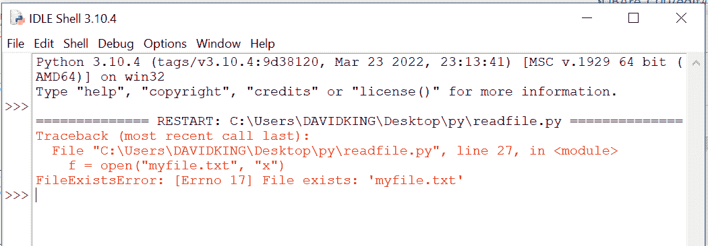
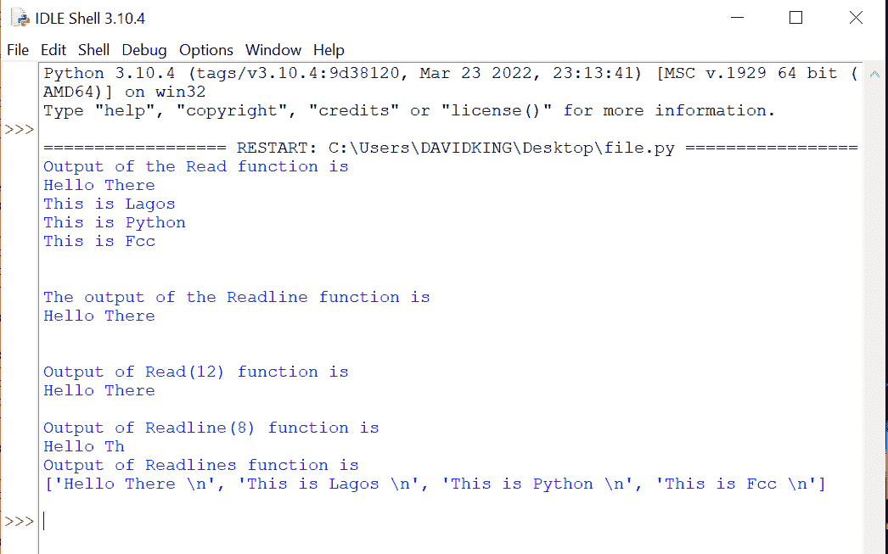

# Python 中的文件处理——如何创建、读取和写入文件

> 原文：<https://www.freecodecamp.org/news/file-handling-in-python/>

在本教程中，您将学习如何打开文件、写入文件以及关闭文件。您还将学习如何使用 Python 读取文件。

本教程结束时，您应该知道如何在 Python 中使用文件的基础知识。

## **Python 中的文件处理**

文件处理是每个 web 应用程序中的一项重要活动。您可以对打开的文件执行的活动类型由访问模式控制。这些描述了文件打开后将如何使用。

这些模式还指定了文件句柄在文件中的位置。类似于指针，文件句柄指示数据应该从文件的哪里读取或放入文件。

在 Python 中，有六种方法或访问模式，它们是:

1.  **只读(' r'):** 此模式打开文本文件只读。文件的开头是句柄所在的位置。如果文件不存在，它会引发 I/O 错误。这也是打开文件的默认模式。
2.  **Read and Write ('r+'):** 这个方法打开文件进行读写。文件的开头是句柄所在的位置。如果文件不存在，将引发 I/O 错误。
3.  **只写(' w'):** 此模式打开文件只写。现有文件中的数据被修改和覆盖。文件的开头是句柄所在的位置。如果文件夹中不存在该文件，则会创建一个新文件。
4.  **读写(' w+')** :该模式打开文件进行读写。该文本将被覆盖并从现有文件中删除。文件的开头是句柄所在的位置。
5.  **Append Only ('a')** :此模式允许打开文件进行写入。如果该文件尚不存在，则会创建一个新文件。句柄设置在文件的末尾。新写入的数据将被添加到末尾，在先前写入的数据之后。
6.  **追加和读取(' a+'):** 使用这个方法，可以在文件中进行读写。如果该文件尚不存在，则会创建一个。句柄设置在文件的末尾。新写入的文本将被添加到末尾，位于先前写入的数据之后。

下面是使用 Python 文件处理方法或访问模式创建、写入和读取文本文件所需的代码。

## 如何在 Python 中创建文件

在 Python 中，使用带有以下选项之一的`open()`函数——“x”或“w”——来创建一个新文件:

*   **“x”–Create**:当且仅当不存在具有该名称的文件时，该命令将创建一个新文件，否则将返回一个错误。

使用“x”命令在 Python 中创建文件的示例:

```
#creating a text file with the command function "x"

f = open("myfile.txt", "x")
```

我们现在已经创建了一个新的空文本文件！但是，如果您重试上面的代码，例如，如果您试图创建一个与上面使用的名称相同的新文件(如果您想重用上面的文件名)，您将得到一个错误，通知您该文件已经存在。它将看起来像下面的图像:



*   **“w”–Write**:该命令将创建一个新的文本文件，无论存储器中是否有新指定名称的文件。如果找到同名的现有文件，它不会返回错误，而是会覆盖现有文件。

如何使用“w”命令创建文件的示例:

```
#creating a text file with the command function "w"

f = open("myfile.txt", "w")

#This "w" command can also be used create a new file but unlike the the "x" command the "w" command will overwrite any existing file found with the same file name.
```

有了上面的代码，无论文件是否存在于内存中，你都可以继续使用这个代码。请记住，如果它找到一个同名的现有文件，它将覆盖该文件。

## 如何用 Python 写文件

在 Python 中有两种写入文件的方法，它们是:

### `write()`方法:

这个函数将字符串插入到文本文件的一行中。

基于我们上面创建的文件，下面一行代码将把字符串插入到创建的文本文件“myfile.txt”中

```
 file.write("Hello There\n")
```

### `writelines()`方法:

这个函数同时插入多个字符串。创建一个字符串元素列表，然后将每个字符串添加到文本文件中。

使用前面创建的文件，下面的代码行将字符串插入到创建的文本文件“myfile.txt”中

```
f.writelines(["Hello World ", "You are welcome to Fcc\n"])
```

示例:

```
#This program shows how to write data in a text file.

file = open("myfile.txt","w")
L = ["This is Lagos \n","This is Python \n","This is Fcc \n"]

# i assigned ["This is Lagos \n","This is Python \n","This is Fcc \n"] to #variable L, you can use any letter or word of your choice.
# Variable are containers in which values can be stored.
# The \n is placed to indicate the end of the line.

file.write("Hello There \n")
file.writelines(L)
file.close()

# Use the close() to change file access modes
```

## 如何用 Python 读取文本文件

在 Python 中有三种从文本文件中读取数据的方法。它们是:

### `read()`方法:

该函数将读取的字节作为字符串返回。如果没有指定 n，它将读取整个文件。

示例:

```
f = open("myfiles.txt", "r")
#('r’) opens the text files for reading only
print(f.read())
#The "f.read" prints out the data in the text file in the shell when run.
```

### readline()方法:

这个函数从文件中读取一行并以字符串的形式返回。对于指定的 n，它最多读取 n 个字节。但是即使 n 大于行的长度，它也不会读取多于一行。

```
f = open("myfiles.txt", "r")
print(f.readline()) 
```

### `readlines()`方法:

这个函数读取所有的行并将它们作为字符串元素返回到一个列表中，每行一个。

您可以通过调用两次`readline()`来读取前两行，读取文件的前两行:

```
f = open("myfiles.txt", "r")
print(f.readline())
print(f.readline()) 
```

## 如何在 Python 中关闭文本文件

使用完文件后，最好总是关闭它。

### 关闭文本文件的示例:

此函数在您完成修改文本文件后关闭它:

```
f = open("myfiles.txt", "r")
print(f.readline())
f.close() 
```

代码末尾的 close()函数告诉 Python，好了，我已经完成了创建或读取这一部分——就像说 end 一样。

### 示例:

下面的程序展示了更多在文本文件中读写数据的方法。每行代码都有注释来帮助您理解发生了什么:

```
# Program to show various ways to read and
# write data in a text file.

file = open("myfile.txt","w")
L = ["This is Lagos \n","This is Python \n","This is Fcc \n"]

#i assigned ["This is Lagos \n","This is Python \n","This is Fcc \n"]
#to variable L

#The \n is placed to indicate End of Line

file.write("Hello There \n")
file.writelines(L)
file.close()
# use the close() to change file access modes

file = open("myfile.txt","r+") 
print("Output of the Read function is ")
print(file.read())
print()

# The seek(n) takes the file handle to the nth
# byte from the start.
file.seek(0) 

print( "The output of the Readline function is ")
print(file.readline()) 
print()

file.seek(0)

# To show difference between read and readline

print("Output of Read(12) function is ") 
print(file.read(12))
print()

file.seek(0)

print("Output of Readline(8) function is ") 
print(file.readline(8))

file.seek(0)
# readlines function
print("Output of Readlines function is ") 
print(file.readlines()) 
print()
file.close() 
```

这是上述代码在 shell 中运行时的输出。我将“这是拉各斯”、“这是 Python”和“这是 Fcc”分配给“L”，然后要求它使用“file.read”函数进行打印。

上面的代码显示“readline()”函数根据指定给它的数字返回字母，而“readlines()”函数返回分配给“L”的每个字符串，包括\n。也就是说，“readlines()”函数将打印出文件中的所有数据。



## 结论

希望在阅读完本教程后，您应该理解 Python 中的文件处理。我们还使用 Python 中的一些基本示例学习了创建、写入、读取和关闭()文本文件所需的模式/方法。

感谢阅读！