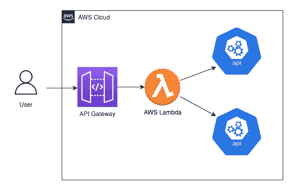
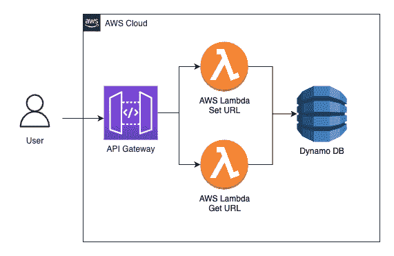
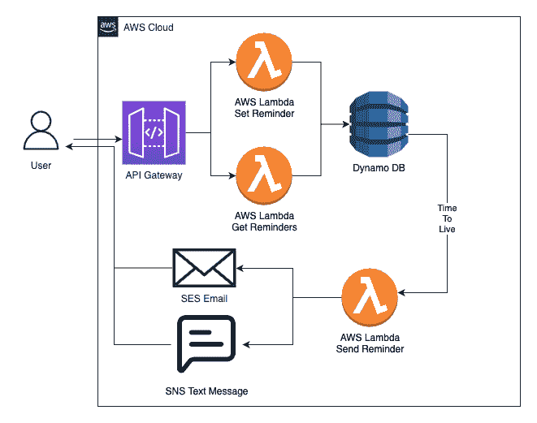
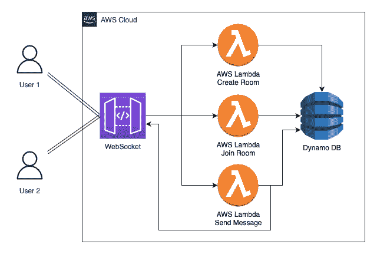
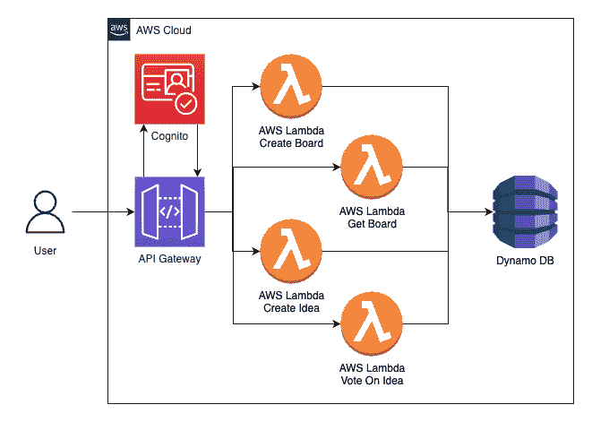
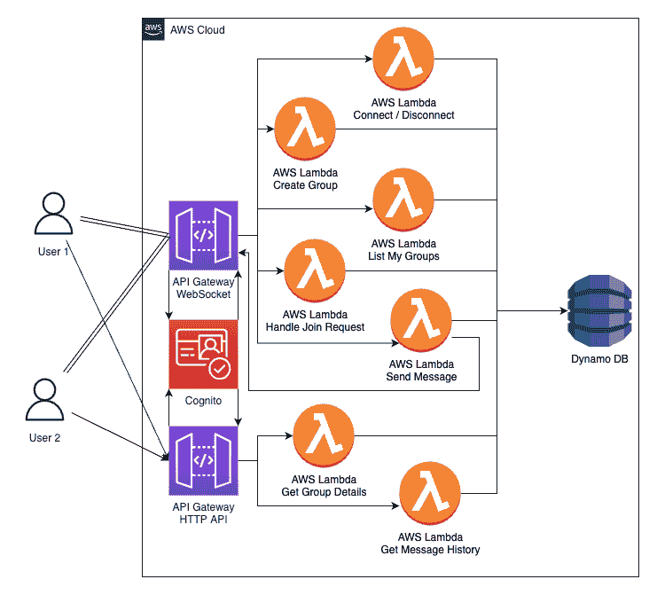
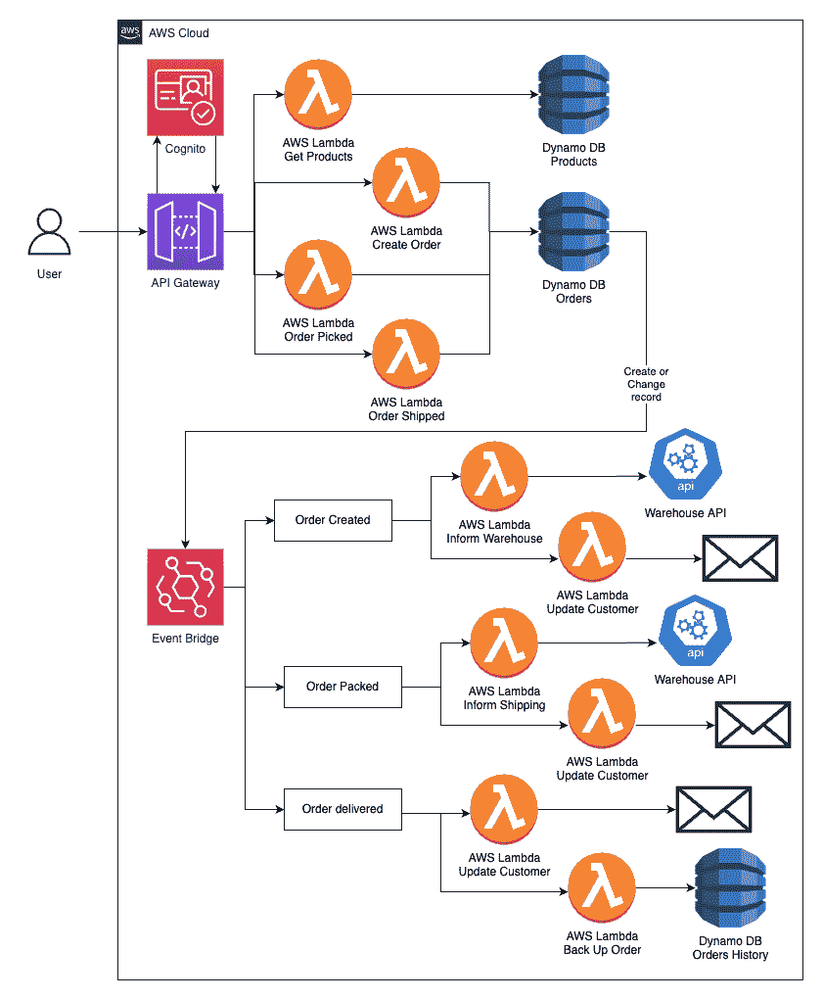

# 如何通过构建 7 个项目来学习无服务器 AWS

> 原文：<https://www.freecodecamp.org/news/learn-serverless-aws-by-building-7-projects/>

开始学习无服务器时，跟随教程是一个很好的开端。但是要真正变得更好，你需要建立自己的项目。

问题是，想出既现实又能帮助你成长的想法很难。

为了帮助你，我想出了 7 个很棒的项目点子来逐步帮助你成为一个更好的无服务器开发者。

如果你是使用无服务器的新手，那么从第一个项目开始。如果你以前已经用无服务器构建过 API 和 Dynamo，那么选择那些覆盖你最想学习的主题的项目。

如果你想看并跟随，我还把它制作成了视频:

[https://www.youtube.com/embed/ROiAUWX8p5E?feature=oembed](https://www.youtube.com/embed/ROiAUWX8p5E?feature=oembed)

# 组合 API 项目

这个项目旨在让你熟悉用 Lambda 部署 API。您还将练习调用其他 API 并合并这些数据。

有很多逻辑可以用于此，但这里有两个例子:

*   获得兑换成当地货币的 Steam 游戏交易
*   将新闻翻译成您当地的语言



这个项目的架构很简单，但这正是你想要的第一个项目。这个想法是，您创建的 API 将接受一些参数，所以看起来像这样

```
https://apiurl.amazonaws.com/dev/steamdeals?currency=EUR
https://apiurl.amazonaws.com/dev/news/fr
```

逻辑都将被写入 Lambda。我不打算写完整的代码，但这里有一些伪代码:

```
const handler = (event: APIGatewayProxyEvent) => {
    // get the path or query string parameter value

    // hit the first API to get the first data

    // get the data you need to translate / convert

    // pass the data from API1 into API2

    // combine the data 

    // return data in API Gateway format
} 
```

如果你需要一些免费的公共 API，那么这里有大量的文档可以从 https://github.com/public-apis/public-apis 选择。

然后尝试使用无服务器框架或 AWS CDK 来构建。作为开发人员，这些工具会让你变得更有价值。

要开始使用无服务器框架[，请观看视频](https://youtu.be/HhgXwKFUzT8)。

# URL 缩写项目

这个项目将让您部署您的第一个 DynamoDB 表，然后从它写入和读取数据。



将有两个 API 端点。一个用于向缩短器添加新的 URL，一个用于给出缩短的 URL 并获取原始的 URL。

这是两个端点的伪代码:

```
// Adding a new URL
const handler = (event: APIGatewayProxyEvent) => {
    // get their original url (body of the event)

    // generate a random 5 character code

    // write to Dyanamo - {id: code, url: originalUrl }

    // return the url (https://{apiurl}.amazonaws.com/dev/get/{code})
}
```

为了获得`apiURL`,我们可以将它作为环境变量传入。如果您使用的是无服务器框架，可以通过将它添加到配置的环境部分来实现:

```
apiUrl: {
  "Fn::Join": [
    "",
    [
      "https://",
      { Ref: "HttpApi" },
      ".execute-api.${self:provider.region}.amazonaws.com",
    ],
  ],
},
```

```
// Getting a URL by code
const handler = (event: APIGatewayProxyEvent) => {
    // get code from the url path

    // get from dynamo by ID

    // return the original url
}
```

您可以更进一步，通过更改`getUrl`代码的状态代码来返回一个 301 -永久重定向。您将需要添加一些额外的标题，但这将自动重定向用户到所需的页面。

# 提醒应用程序项目

这个项目将教你关于迪纳摩的二级索引以及迪纳摩的生存时间。你还可以尝试使用亚马逊简单电子邮件服务(SES)实现电子邮件自动化，或者使用简单通知服务(SNS)发送短信。

您还可以构建一个简单的前端应用程序，并了解如何在 S3 托管它，以及如何使用 CloudFront 来分发它。



这个应用程序的想法是，你可以发布一个新的提醒到第一个 API 端点。这将在 DynamoDB 中写入一条新记录，但是您已经向表中添加了一个全局二级索引(GSI)。这意味着你可以按 id 获取提醒，也可以基于用户进行查询。

它还有一个生存时间(TTL ),允许你在提醒的时候触发一个 Lambda。设置提醒的代码将看起来非常类似于前一个项目。

该表看起来会像这样:

| 身份证明（identification） | 使用者辩证码 | 晶体管-晶体管逻辑。 | 通知类型 | 消息 |
| --- | --- | --- | --- | --- |
| One hundred and twenty-three | [test@gmail.com](mailto:test@gmail.com) | One billion six hundred and forty-eight million two hundred and seventy-seven thousand eight hundred and twenty-eight | 电子邮件 | 发布下一个 youtube 视频 |
| Eight hundred and ninety-seven | Four hundred and forty-seven billion one hundred and thirteen million three hundred and fifty thousand eight hundred and eighty-two | One billion six hundred and forty-eight million eight hundred and forty-two thousand eight hundred and twenty-eight | 存储管理服务 | 多拿些牛奶 |

生存时间(TTL)告诉 dynamo，一旦时间到达这个日期，就从 Dynamo 删除记录。

使用 TTL 需要注意两件事:

*   确保这是删除日期的 Unix 时间戳，但以秒为单位。`new Date('october 20 2022').getTime()`将以毫秒为单位，所以只需除以 1000。
*   该记录将在您的 TTL 后的 15 分钟内被删除，因此如果已经过了 5 分钟而记录还没有被删除，请不要惊慌。

然后，您可以设置第二个 Lambda，它会在记录从 Dynamo 中删除时被触发。然后，这将消息发送到他们的电子邮件或手机。

```
// Send reminder
const handler = async (event: DynamoDBStreamEvent) => {
    // get the list of deleted records

    // map over each record
       // Call SES or SNS to send the reminder
}
```

第二个 API 端点将获取用户的所有提醒。确保您已经用分区键`userId`和排序键`TTL`设置了一个 GSI。

```
// Get My Reminders
const handler = (event: APIGatewayProxyEvent) => {
    // get the userId from request

    // params = KeyConditionExpression: "'userId' = userId",

    // Query Dynamo

    // format the reminders 

    // return to the user
}
```

对于前端，您可以编写一个简单的 web 应用程序，分为两个部分:创建新的提醒，并列出我的提醒。这可以是 React、Vue、Angular，甚至是原始的 HTML、CSS 和 JavaScript。

一旦你有了应用程序，你可以使用`serverless-s3-sync`自动将代码推送到 S3(你在无服务器中创建的)。

# 实时聊天应用程序项目

这个项目将教你如何构建 WebSockets。用户可以创建新的“房间”或加入现有的房间。发送的任何消息都会发送给与该房间连接的每个人。



WebSockets 的工作方式与常规 API 略有不同。您有一个端点和不同的消息类型，而不是多个端点。

有一些默认的消息类型和一些自定义的消息类型:

*   连接室-自定义
*   创建房间-自定义
*   on message–自定义
*   断开连接–默认

当用户连接到 WebSocket 时，他们可以发送一条`connectToRoom`或`createRoom`消息。这两者都将在 Dynamo 中用用户的 WebSocket `connectionId`和`roomId`创造一个记录。正如我们之前所做的，我们将在迪纳摩有一个 GSI，所以我们可以稍后查询获得一个`roomId`的所有用户。

`connectToRoom`和`createRoom`的代码看起来与之前的“向 Dynamo 写入数据”非常相似。

您可能想先检查一下`connectToRoom`房间是否存在。您可以通过按 roomId 查询所有用户来做到这一点。如果房间里没有用户，这意味着他们试图连接到一个不存在的房间。

现在用户在房间里，他们可以发送消息。这是 Lambda 的伪代码:

```
// onMessage
const handler = (event: WebsocketMessageEvent) => {
    // get the user's connectionId

    // get the user by connectionId from Dynamo to get the roomId

    // query for all users in that roomId

    // send the message to all users

    // return
}
```

最后，还有 onDisconnect，这是一个简单的 Lambda，只从 Dynamo 中删除用户记录。

# 创意投票应用项目

这个项目将教你设计和建立更先进的发电机表，并与 Cognito 认证工作。您还应该为此构建一个简单的前端，以了解如何将 Cognito 集成到 web 应用程序中。

该工具允许您向您的社区征求意见，并找出最受欢迎的意见。



首先，所有用户都需要注册您的应用程序。为此，我们使用 Cognito，这样做是为了确保每个人只能投票一次。

然后，您需要创建几个端点:

*   创建一个董事会
*   将想法添加到板上
*   为一个想法投票
*   获取董事会详细信息

### 创建一个董事会

我们需要的第一个 API 端点是创建一个新的想法板。任何人都可以创建董事会，迪纳摩的记录非常简单。只是一个`boardId`和一些关于董事会主席的信息，也许是一个头衔和描述。

| boardId | 物主 | 标题 | 描述 |
| --- | --- | --- | --- |
| boardId | 使用者辩证码 | 我的好主意 | 一些描述 |

### 将想法添加到板上

接下来，我们需要能够添加想法到董事会。这将是另一个 API 端点和 Lambda。有了创意数据库记录，我们需要更聪明一点，因为我们需要能够直接引用一个创意，但也需要为一个板获取所有创意。

为此，我们有一个这样的模式。`pk`是一个分区键，`sk`是一个排序键，这两个键都是在 DynamoDB 上查询所需要的。

| 身份证明（identification） | 公园 | 沙王 | 想法 | 物主 |
| --- | --- | --- | --- | --- |
| 身份证明（identification） | boardId | 理念是 | 这个想法 | 使用者辩证码 |

使用`id`我们可以直接引用这个想法，但是我们也可以查询记录。我们可以通过查询`pk = 1234`获得所有关于`1234`板的想法。

### 为想法添加投票

现在我们已经有了想法，我们需要我们的用户为他们投票。这将是一个新的 API 端点和 Lambda。这个 Lambda 比其他两个要多做一点工作。首先，我们来看看这个记录的模式。

| 公园 | 沙王 | pk2 | sk2 |
| --- | --- | --- | --- |
| 理念是 | 使用者辩证码 | 使用者辩证码 | 理念是 |

乍一看这可能很奇怪，但是我会解释为什么我们要这样构造它。

对于一个给定的想法，我们想知道它有多少票。我们可以通过查询`pk = ideaId`找到答案，它将返回该想法的所有投票。

当添加投票时，我们希望检查用户是否已经为该想法投票。我们可以通过查询`pk = ideaId && sk = userId`来实现。如果我们找到匹配的记录，我们知道他们已经投票赞成这个想法。如果没有，那么我们可以为这个用户和建议添加`vote`记录。

### 获取董事会详细信息

我们现在可以编写一个 lambda 来查询我们拥有的数据:

```
export const handler = async (event: APIGatewayProxyEvent) => {
    // get boardId from the request
    // query all ideas on the board
    // map over each idea
        // query for all votes on this idea
    // format it all into a nice format
    // return to the user
}
```

### 为用户获得投票

最后，我们希望能够显示给定用户的所有投票。我们不能查询 where `sk = userId`,因为在查询 DynamoDB 时，您总是需要一个分区键。因此，我们创建了第二个分区键(`pk2`)，其中包含用户 Id。现在我们可以查询`pk2 = userId`来获得用户投票支持的所有想法。

这种具有第二个 GSI 的模式非常常见，其中 PK 和 SK 被交换。它允许你有一个多对多的关系。您可以查询连接到特定 A 的所有 B 以及连接到特定 B 的所有 A。这通常称为连接表。

## 消息应用程序项目

这个项目将教你关于 Dynamo 的复合键，并给你更多的练习。

该应用程序允许用户注册，请求加入一个房间，然后查看该房间中已发送的所有消息。房间的主人决定是否让某人加入房间。



该架构将从看起来很像实时聊天应用程序开始——通过 WebSocket 连接到 Lambdas 的`onConnect, onDisconect, create`组、`joinGroup, listMyGroups handleJoinGroupRequest`和`sendMessage`。

在我们讨论 Lambda 代码之前，我们想将 Cognito 添加到应用程序中，这样我们就可以让用户注册了。稍后当用户请求访问某个组时，将会用到它。

λ将与实时聊天解决方案几乎相同。它只是创建一个简单的`group`记录。

### Websocket 连接/断开

现在，当用户登录并连接到 WebSocket 时，我们可以创建一个 onConnection Lambda。这将获得 userId 并验证他们的 Cognito 用户令牌。这个令牌将很容易给我们用户标识和用户名。

如果他们没有传递令牌或者令牌无效(或者已经过期)，那么我们可以终止 websocket，阻止他们在没有有效令牌的情况下做任何其他事情。

如果令牌有效，那么我们可以存储一个简单的连接记录。这将允许我们稍后将消息发送回 websocket。

只要记住当用户从 WebSocket 断开连接时删除这个记录。我们可以使用默认的`$disconnect`动作来触发一个`onDisconnect`λ。

### 创建一个组

某人需要做的第一件事是创建一个群，然后他们可以邀请他们的朋友加入。

这将涉及到在迪纳摩创造两个记录。第一个只是该组的记录。这将包括群组 ID、群组名称以及群组所有者。

第二个是组成员记录。这将表明该用户是该组的一部分。

| 公园 | 沙王 | pk2 | sk2 | 用户名 | 群组名称 |
| --- | --- | --- | --- | --- | --- |
| groupId | 用户#{userId} | 使用者辩证码 | groupId | 用户名 | 组名 |

第一部分将允许我们查询`pk = groupId and sk startsWith('user')`来获取该组的所有用户。这将在`sendMessage` Lambda 中使用，以让所有用户向其发送 WebSocket 消息。

添加的第二部分(PK2，SK2)允许我们通过查询 where `PK2 = userId`来获得一个用户被授权的所有组。当我们需要获得所有用户组的列表时，就会用到它。

### 加入一个团体

`join`组请求现在将在 Dynamo 中为`access request`创建一个记录。这不会授予用户对组的访问权限，但会允许组的所有者查看访问请求。

这些记录将是我们第一次使用复合键。这是将排序关键字提升到下一个级别，记录将如下所示:

| 公园 | 沙王 |
| --- | --- |
| groupId | 加入请求#{userId} |

这使我们能够查询`pk = groupId and sk startsWith('joinRequest')`在哪里。这将返回该组的所有访问请求。当有人提出这个请求时，我们可以首先检查他们是否是该群的所有者。

然后，群主有两个选项——接受或拒绝。如果所有者拒绝用户，我们可以删除访问请求记录。如果他们接受用户，那么我们需要添加一个`authorised user`。这对迪纳摩来说需要一个新的记录。

### 发送消息

现在我们来看看消息应用的核心——发送和存储消息。

在`sendMessage` WebSocket Lambda 中，我们可以查询组中的所有用户，并将消息发送到所有当前连接。我们还需要将消息存储在 Dynamo 中。

| 公园 | 沙王 | 消息 | 用户 |
| --- | --- | --- | --- |
| groupId | 消息# {时间戳} | 我的信息 | 使用者辩证码 |

### 获取以前的消息

当用户登录时，他们需要能够获得离线时错过的消息。通过这种方式构建的消息数据，我们可以查询:

`pk = groupId and sk > 'message#{ timestamp for yesterday }'`

这将返回自昨天以来创建的所有邮件。

我们也可以通过传递他们拥有的最后一条消息来允许他们获得更老的消息。这将允许我们获得下一批消息。这将允许我们在消息历史上创建一个无限向上的滚动。

## 事件驱动的电子商务系统项目

这个项目将教你关于事件桥，加上给你一些额外的实践与 DynamoDB 表设计和服务，如 SES 和 SNS 的电子邮件和文本。

这个系统将有你所期望的产品和过滤、购物车和订单。这里的关键是，订单下达、订单状态更改和交货更新都将通过 Event Bridge 来处理。



### 储存产品

首先，我们需要存储产品。我们可以在某种程度上构建我们的排序关键字，以允许我们的产品有一个层次结构。

| 身份证明（identification） | 公园 | 沙王 | 标题 | 描述 | ... |
| --- | --- | --- | --- | --- | --- |
| 产品 id | 衣服 | mens#tops#{productId} | 下一件修身 t 恤 | ... | ... |
| 产品 id | 衣服 | 女式#裤子#{productId} | 李维斯牛仔裤 | ... | ... |

这允许我们查询`pk = clothing and sk beginsWith mens`以获得所有的男装，或者查询`pk = clothing and sk beginsWith womens#trousers`以获得所有的女装。

### 下订单

下一步是能够下订单。我们不打算尝试接受付款，只是向 dynamoDB 表添加一个订单记录。

### 事件桥

这里最大的不同是我们将开始使用事件桥。这是一个允许我们拥有可以触发多个 lambdas 的事件的工具。这很好，因为我们可以添加一个新的侦听器，而不必更改前面的代码。

### 订单已创建

我们将有两个 lambdas 监听`orderCreated`事件。第一个是获取订单数据，并将其发送到仓库 API 进行打包。第二个是向用户发送订单确认电子邮件

### 订单包装

我们将假装有一个真正的仓库，在获得订单装箱单后，他们打包并准备好订单进行装运。他们有一个系统调用我们的 API，把订单状态改成`packed`。

发电机记录的这一变化将为`orderPacked`触发另一个事件桥事件。它也有两个侦听器:一个通过电子邮件向用户发送更新，另一个通过电子邮件向递送服务发送邮件，从仓库收集包裹并将其递送给客户。

### 订单已发货

同样，我们将假设一家快递公司接收了包裹并进行了递送。他们调用另一个`Order Shipped` API 端点，再次改变订单在数据库中的状态。

这为`orderDelivered`触发了另一个事件，它有两个监听器:

一个用于向客户发送“谢谢”消息。

另一个会做一些不同的事情。它将接受订单，删除任何个人数据，并将其存储到另一个 DynamoDB 表中。

这是数据科学家越来越常见的准备步骤。我们删除了个人数据，以减少法律问题，但仍然允许数据科学家做一些事情，如训练一个模型，给你“人们也买了......”各种推荐。

## 下一步是什么

如果你喜欢这些项目想法，但不知道从哪里开始，那么我有一个完整的视频课程，将教你如何建立所有这些项目。

[点击此处查看课程](https://completecoding.mykajabi.com/7-serverless-projects)。

你也可以下载这些项目的免费 PDF 文件，这样你就可以看到你在学习过程中的进步。