# 如何双启动 Windows 10 和 Ubuntu–Linux 双启动教程

> 原文：<https://www.freecodecamp.org/news/how-to-dual-boot-windows-10-and-ubuntu-linux-dual-booting-tutorial/>

使用 Linux 和 Windows 10 不一定要有两台不同的电脑。可以在预装 Windows 10 的电脑上安装 Linux 发行版。

在本文中，我将向您展示如何双启动 Windows 10 和流行的 Ubuntu Linux 发行版。但在此之前，你得在你的 Windows 10 PC 上安装 Ubuntu。

在执行此过程之前，您必须备份您的文件。这是因为安装操作系统是一个有风险的过程。有时它会覆盖现有的操作系统并删除你所有的文件。

**N.B.** :本文中的大部分流程都需要时间来完成，所以你需要耐心。

## 我们将介绍的内容–双启动 Windows 10 和 Linux 的分步指南

*   [先决条件](#prerequisites)
*   [如何为 Ubuntu 对硬盘进行分区](#howtopartitionyourharddriveforubuntu)
*   [如何优化硬盘以获得更多分区空间(可选)](#howtooptimizeyourharddriveformorepartitionspaceoptional)
*   [如何下载 ISO 镜像格式的 Ubuntu](#howtodownloadubuntuinisoimageformat)
*   [如何制作 Ubuntu (Linux)可引导 USB 驱动器](#howtomakeanubuntulinuxbootableusbdrive)
*   [如何随 Windows 10 安装 Ubuntu Linux 发行版](#howtoinstallubuntulinuxdistroalongwithwindows10)
*   [现在你可以双启动 Ubuntu 和 Windows 10 了](#nowyoucandualbootubuntuandwindows10)
*   [结论](#conclusion)

## 先决条件

最重要的是，如果你想在同一台电脑上使用(和双重启动)Ubuntu 和 Windows 10，你必须准备好一些东西:

*   预装 Windows 10 的电脑
*   分区的硬盘驱动器
*   UEFI 模式下的 BIOS(统一可扩展固件接口)
*   一个至少 4gb 的空 USB 驱动器，用于创建可引导磁盘
*   一个互联网连接来下载 Ubuntu ISO 镜像(Linux 发行版)和 Rufus(一个可引导的驱动器创建工具)

## 如何检查您的 PC BIOS 是否处于 UEFI 模式

要检查您的 PC BIOS 是否进入 UEFI 模式，请搜索“系统信息”并点击`ENTER`。
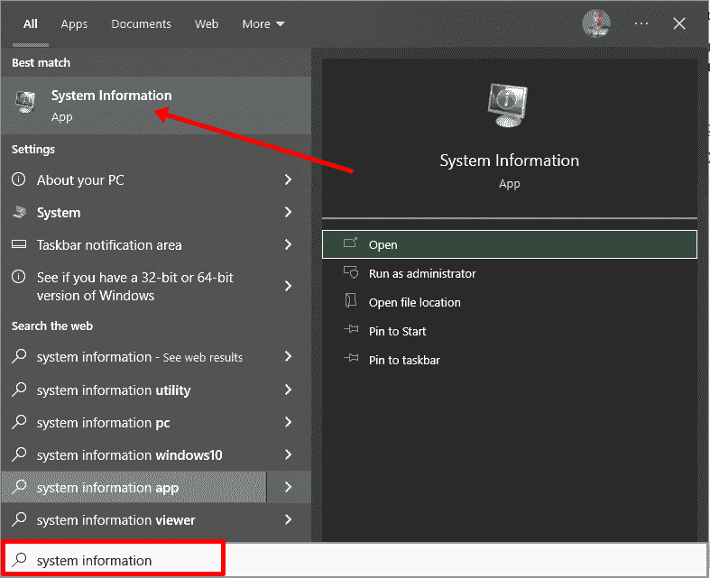

查看 BIOS 模式，确认您的 PC BIOS 模式显示为 UEFI。
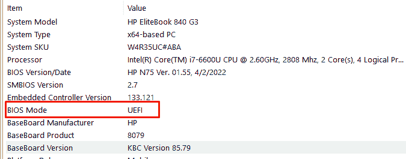

如果您的 PC BIOS 不处于 UEFI 模式，这两个操作系统将看不到对方。你可以在这里了解更多关于这两种模式的[区别。](https://www.freecodecamp.org/news/uefi-vs-bios/)

## 如何为 Ubuntu 对硬盘进行分区

你必须对你的硬盘进行分区，因为你必须留出至少 20 千兆字节的空间给 Ubuntu 使用和启动。

**要对硬盘进行分区，请遵循以下步骤**:

**步骤 1** :右键点击开始，选择“磁盘管理”。

**第二步**:右键点击 c 盘，选择收缩卷。

**第三步**:为 Ubuntu 选择至少(20000) 20Gig，点击“缩小”。这可能需要一些时间来完成，所以请耐心等待。

**步骤 4** (可选):您可以继续为新卷分配一个字母。右键单击未分配的空间，然后选择“新建简单卷”。

**步骤 5** :按照向导给驱动器分配一个盘符，然后按照剩余部分操作。

完成向导后，驱动器应该在您的计算机上列出。
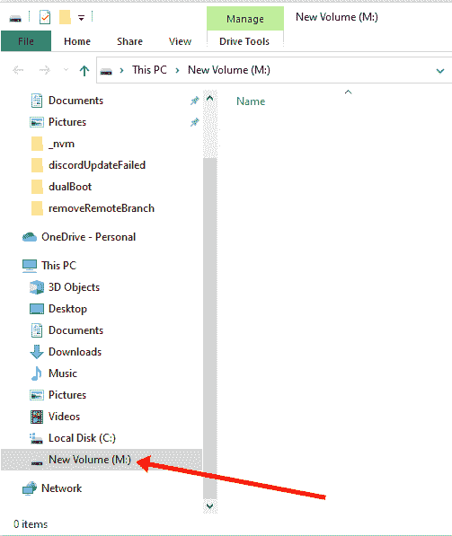

恭喜你。您已成功对硬盘进行分区。

**注意:**:如果你的硬盘有很多空闲空间，但你的电脑仍然没有给你 20 千兆字节的分区空间，那么你需要优化你的电脑硬盘。请继续阅读本文的下一部分。

## 如何优化硬盘以获得更多分区空间(可选)

硬盘优化的共同目的是在启动时加速您的计算机，使其运行更流畅。

同时，该过程将对硬盘进行碎片整理，并为分区提供更多可用空间。

要优化您的硬盘驱动器，请单击开始(Windows 徽标键)，搜索“碎片整理”并选择“碎片整理和优化驱动器”。
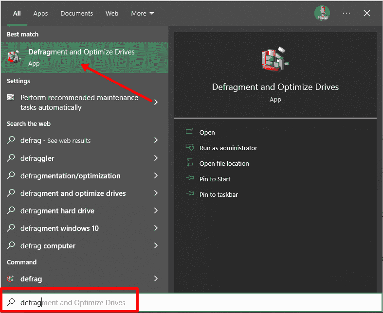

确保你的 c 盘高亮显示，然后点击“优化”。
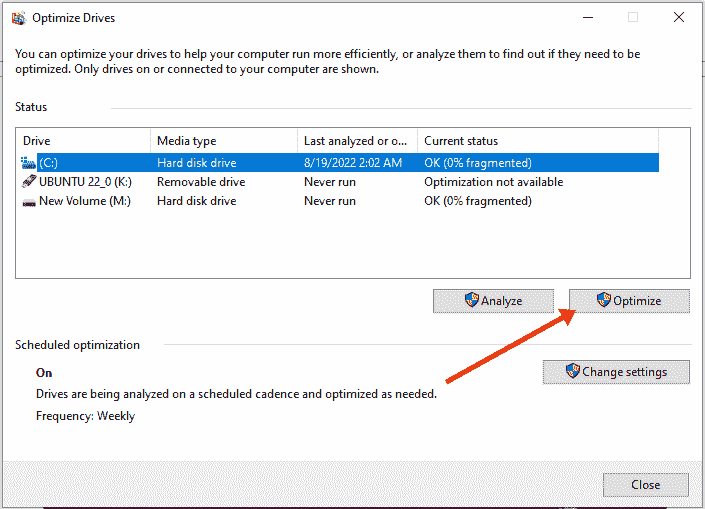

当你能够通过硬盘分区为 Ubuntu 留出至少 20g 的空间后，就该下载 Ubuntu 并制作一个可启动的 USB 了。

## 如何下载 ISO 图像格式的 Ubuntu

接下来就是下载 ISO 镜像格式的 Ubuntu，这样就可以安装 Ubuntu 了。可以从 Ubuntu 发行版网站下载。
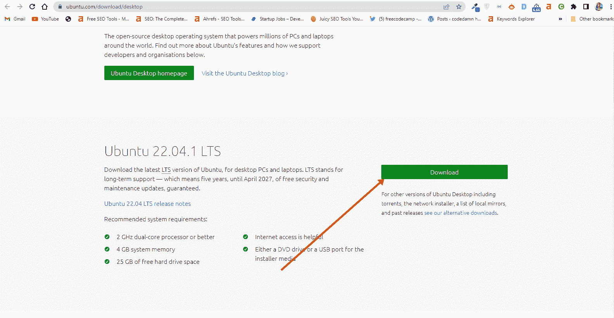

下载 Ubuntu 后，先不要用它做任何事情。你需要做一个可启动的 USB 并把它放在那里。这就是你能够使用它的方式。

你不能那样安装 Ubuntu 的原因是它不是可执行文件。它以 ISO(光盘映像)的形式出现。这意味着你必须找到一个磁盘把它放进去，然后它才能工作。

本指南的下一部分将展示如何将下载的 Ubuntu ISO 文件保存到 u 盘上。

## 如何制作一个 Ubuntu (Linux)可引导的 USB 驱动器

你不能仅仅通过把下载的 ISO 镜像放入其中来为 Ubuntu 制作一个可启动的 USB 驱动器。遵循以下步骤来完成它:

**第一步**:你需要像 Rufus 一样下载一个可引导的 u 盘创建工具。你可以[从他们的网站](https://rufus.ie/en/)下载 Rufus。
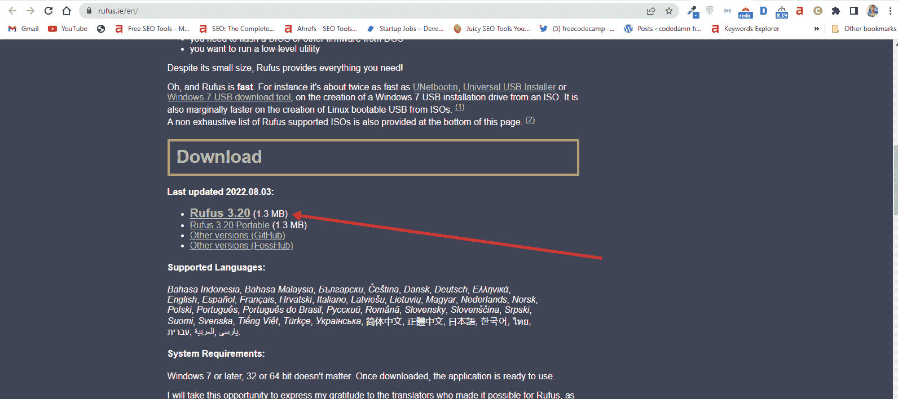

**第二步**:将空的 u 盘插入你的 Windows 10 PC。右键单击 Rufus 并选择“打开”。

**第三步**:在“设备”下，选择你的 u 盘。在“引导选择”下，点击“选择”按钮，选择你下载的 Ubuntu ISO 文件

第四步:保持默认设置，点击“开始”按钮，开始将 Ubuntu 发行版刻录到光驱。

**第五步**:点击确定开始流程。
T3

一旦该过程完成，您应该会看到绿色背景上的“就绪”。单击关闭按钮。是时候安装 Ubuntu 了。

恭喜你。现在您有了一个可以安装 Linux 的可引导驱动器。

下一步是在你的 Windows 10 PC 上安装 Ubuntu 发行版。为此，您必须从您创建的可引导 USB 驱动器启动您的 PC。

## 如何随 Windows 10 安装 Ubuntu Linux 发行版

**步骤 1** :确保可启动驱动器已插入您的 Windows 10 电脑

**第二步**:右键点击开始，按住 SHIFT，选择重启。

**第二步**:选择“使用设备”。

第三步:在下一个屏幕上，你应该会看到几个可以启动的设备。

您可能会看到可引导驱动器是 USB 品牌的名称。
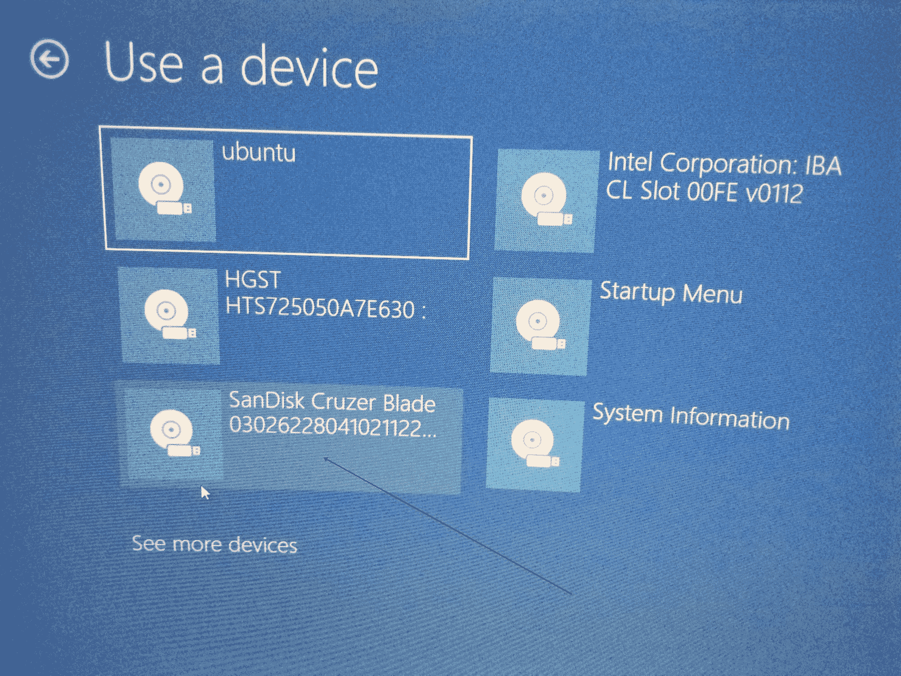

也可以把它看作是“Ubuntu”。有些时候，你可能看不到它，所以你需要点击“查看更多设备”。

如果你仍然看不到你的可引导驱动器，进入 BIOS 进入你的引导菜单。你会在那里看到它。

**注意:**在 BIOS 中进行更改时，您应该非常小心。无论你在那里做什么，都会对你的电脑产生持久的影响。如果你不确定你在那里做什么，你应该联系一个 IT 专家。

**第四步**:选择“安装 Ubuntu”。你也可以在安装前试用一下。

遵循安装向导的其他提示，并确保您没有用 Ubuntu 替换 Windows 10 操作系统安装。这就是我建议你备份所有文件的原因。

当你选择你制作的分区时，滚动到[你之前制作的分区](#howtopartitionyourharddriveforubuntu)并按下`ENTER`。
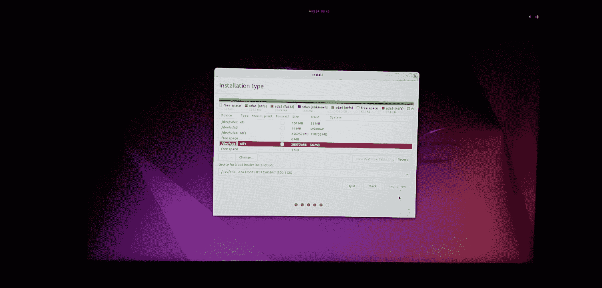

单击确定选择分区中的所有空间。
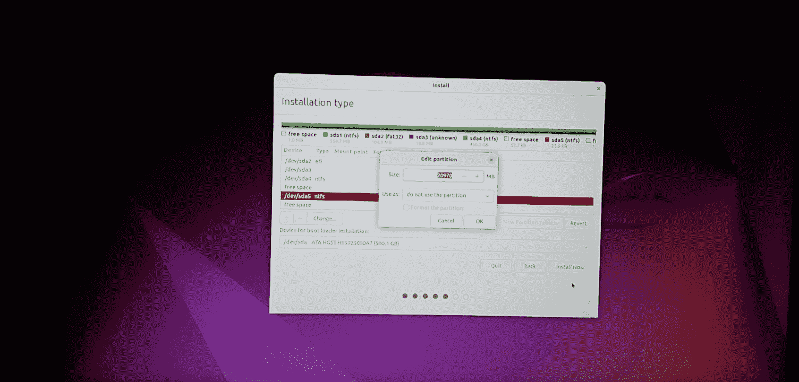

这一次,“立即安装”按钮将不再变灰。
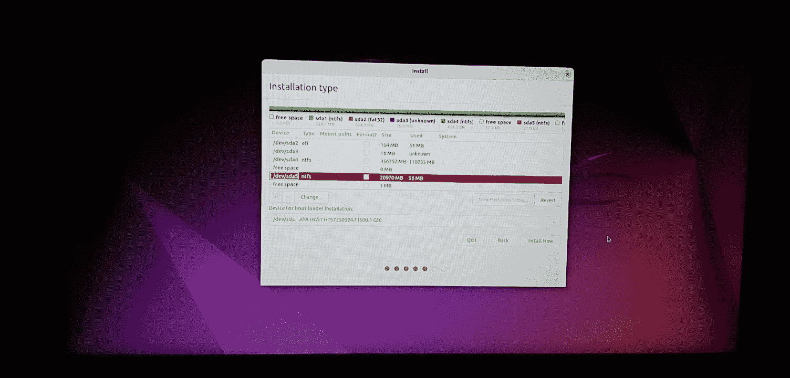

按照其他提示操作，直到 Ubuntu 开始安装。

安装完成后，Ubuntu 会提示你移除可引导驱动器，按`ENTER`重启电脑。

## 现在你可以双启动 Ubuntu 和 Windows 10 了

重新启动计算机后，您应该会看到如下所示的屏幕:
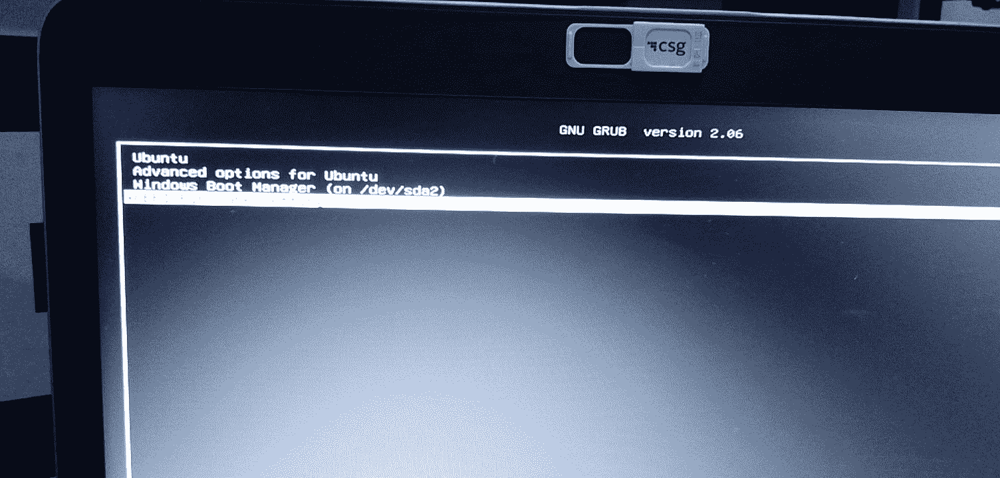

现在，你可以在 Ubuntu 和 Windows 10 之间选择启动哪个。

要引导至 Ubuntu，请选择 Ubuntu。要启动到 Windows 10，请选择 Windows 启动管理器。

您也可以通过选择 UEFI 固件设置从同一位置进入您的 BIOS。
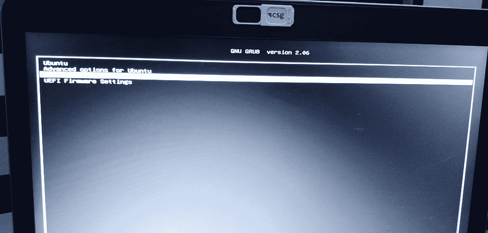

## 结论

希望这篇文章能帮助你在电脑上双启动 Ubuntu 和 Windows 10。

这篇文章的最终目的是向你展示如何双重启动 Ubuntu 和 Windows 10。

但是本文超出了这个范围，向您展示了如何:

*   检查您电脑的 BIOS 是否处于 UEFI 模式
*   给你的硬盘分区
*   优化您的硬盘
*   制作一个可启动的 USB 驱动器
*   在你的 Windows 10 电脑上安装 Ubuntu Linux 发行版和 Windows。

如果你觉得这篇文章有帮助，请与你的朋友和家人分享。