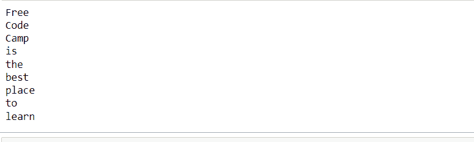

# 学习数据科学之前需要了解的 Python 概念

> 原文：<https://www.freecodecamp.org/news/top-python-concepts-for-data-science/>

如果你对学习数据科学感兴趣，你可能听说过流行词**“Python”、**。这是一种常用于数据科学的流行编程语言。

但是 Python 是一种通用编程语言。这意味着它不仅限于数据科学。你也可以用它来开发网络和移动应用。

所以，在学习数据科学的 Python 时，初学者最常犯的一个错误是“不正确地”学习它——也就是说，没有为数据科学做准备而学习 Python。这会导致时间和精力的浪费。

在本文中，我们将介绍在深入研究数据科学之前您应该了解的 Python 概念。现在放松，跟着走，因为这将是一次激动人心的旅程。

为了快速了解旅程的全部内容，我们将介绍以下内容:

*   [Python 中的整数和浮点数](#integers-and-floating-point-numbers-in-python)
*   [Python 中的字符串](#strings-in-python)
*   [Python 中的布尔值](#boolean-values-in-python)
*   [Python 中的算术运算符](#arithmetic-operators-in-python)
*   [Python 中的比较运算符](#comparison-operator-in-python)
*   [Python 中的逻辑运算符](#logical-operators-in-python)
*   [Python 中的隶属运算符](#membership-operator-in-python)
*   [Python 中的 F 字符串格式](#f-string-formatting-in-python)
*   [Python 中的列表](#lists-in-python)
*   [Python 中的元组](#tuples-in-python)
*   [Python 中的字典](#dictionaries-in-python)
*   Python 中的 [`Zip()`函数](#zip-function-in-python)
*   Python 中的 [`Enumerate()`函数](#enumerate-function-in-python)
*   Python 中的 [`Counter()`函数](#counter-function-in-python)
*   [Python 中的 If-else 语句](#if-else-statements-in-python)
*   Python 中的 [`Range()`函数](#range-function-in-python)
*   [用 Python 列出理解](#list-comprehension-in-python)
*   [Python 中的用户自定义函数](#user-defined-functions-in-python)

## 数据科学中最值得了解的 Python 概念

### 为什么知道这些概念很重要

坦率地说，当您想使用 Python 作为数据科学的语言时，这些概念是启动您的数据科学之旅所需要的。作为一名数据科学家，您将在日常工作中与他们一起工作，因此牢牢掌握他们的工作方式是有好处的。

### Python 中的整数和浮点数

数字是数据科学中最基本的概念之一。Python 包含各种可能存在的数字类型的表示(数据类型)。这些主要分为:

*   整数:在 Python 中，这些整数要么是正数，要么是负数。示例包括 200、-100、67 等等。
*   浮点数:这些是正数或负数的十进制数值。例如 200.65，-14.34，53.0002 等等。

### Python 中的字符串

在 Python 中，字符串包含通常用单引号或双引号括起来的字母数字值。

一个例子包括`"FreeCodeCamp has a lot of rich resources"`。

Python 有很多方法可以用来操作字符串。例如，如果您希望将一个字符串从大写转换成小写，您可以使用 Python 中的`.lower()`方法，如下所示。

```
string = "FREECODECAMP IS COOL"
print(string.lower())
>>> 'freecodecamp is cool'
```

在数据科学中，您经常使用字符串来创建或操作数据集中的任何文本数据。

要了解更多关于字符串及其方法的知识，请查看这本有用的手册。

### Python 中的布尔值

布尔值也称为二进制值。它们是由两个数字表示的值。`True and False`，或`0 and 1`。

### Python 中的算术运算符

使用算术运算符对两个数值操作数或值执行数学运算。它们包括以下内容:

*   加号`+`代表加法。
*   破折号`-`代表减法
*   星号符号`*`代表乘法。
*   斜线符号`/`代表除法。
*   百分比符号`%`是用于表示模数的
*   双星号符号`**`代表指数。
*   双斜线符号`//`代表楼层划分。

前四个操作符非常简单，因为我们每天都要与它们打交道。但是，以下内容需要更多的解释:

#### 什么是模算符？

模数运算符(`%`)返回对两个独立数字执行运算时的余数。例如，8 % 3 将返回 2，因为 3 只能在 8 中出现两次，剩下 2 的余数。

#### 什么是指数算子？

您使用指数运算符`**`来计算一个数的幂。例如，`2**3`等于 8，因为 2 被提升(或乘以自身)三次:`2*2*2 = 8`

#### 什么是地板除法运算符？

你用地板除法`/`运算符来除。但是与产生小数的其他除法运算符不同，底数除法返回除法的整数部分。

例如，`5//2`将得出 2(因为 2 平均两次进入 5)。楼层划分也不近似。

#### 如何对字符串执行算术运算

此外，您还可以对字符串执行算术运算。加法和乘法是可以在字符串上执行的两种算术运算。

*   加法运算符`+`:使用加法运算符将两个字符串操作数连接在一起(也就是说，将两个字符串连接在一起)。例如:

```
"Folks" + "connect" 
>>> "Folksconnect"
```

*   乘法运算符`*`:使用乘法运算符重复一个字符串(但是注意其中一个操作数必须是数字)。例如:

```
2 * "Folks" 
>>> "FolksFolks"
```

### Python 中的比较运算符

使用比较运算符来比较两个操作数。当对两个操作数执行比较运算符时，它们会返回布尔值 true 或 false。比较运算符包括:

*   大于号`>`
*   小于号`<`
*   等号`==`
*   不等于号`!=`
*   大于或等于`>=`
*   小于或等于`<=`

下面举几个例子:`2==2`会产生`True`。同样，`5>= 5`将导致`True`，因为 5 也等于 5。

### Python 中的逻辑运算符

使用逻辑运算符来组合条件语句。它们包括`and` `or`和`not`。

例如，`4<5`和`3>2`将返回`True`，因为`4 <5`是一个为真的条件，而`3 > 2`也是另一个为真的条件。因此根据逻辑门的`True`和`True`将导致为真。

在我们继续之前，我想定义一个我将在本文剩余部分中经常使用的术语——iterables。iterable 基本上是由一系列值组成的，例如字符、数字等等。Python 中的可迭代对象包括字符串、列表、字典、范围、元组等等。

### Python 中的成员运算符

使用成员资格操作来确定一个值是否属于序列/可迭代。序列可以是一串字符、一列数字或其他任何东西。

隶属度操作符包括`in`操作符和`not in`操作符。

例如，假设我想检查字符`b`是否在字符串`"What a time to be alive"`中——我可以通过键入以下语句来完成，结果将是一个布尔值。

```
"b" in "what a time to be alive"

>>> True
```

要了解 Python 中运算符的更多信息，请查看这些 [文章](https://www.freecodecamp.org/news/operators-in-python-how-to-use-logical-operators-in-python/)[。](https://www.freecodecamp.org/news/basic-operators-in-python-with-examples/)

### Python 中的 f 字符串格式

在某些情况下，您可能希望在字符串中插入一个变量值。假设您事先不知道该值，但希望它在一个字符串内。字符串格式可以帮助您实现这一点。

在 Python 中有几种格式化字符串的方法，但是我们将集中讨论其中的一种:f-literal 格式。

让我们看一个例子:我有两个变量，名字和年龄，我想把它们包含在一个字符串中，然后打印出整个字符串。

```
age = 10
name = "Eagle"

string = f"There are some birds of prey such as {name} that are older than {age} years."

print(string)

>>> There are some birds of prey such as Eagle that are older than 10 years. 
```

所以要做的第一件事是你必须在你想用 f-literal 格式化的字符串前面有一个 f。另外，要格式化的变量必须在花括号内。

要了解更多关于使用 f-literals 进行字符串格式化的内容，请查看来自 [Bala Priya 的这篇文章，它解释了这一点](https://www.freecodecamp.org/news/python-f-strings-tutorial-how-to-use-f-strings-for-string-formatting/)。此外，你可以在这里了解更多关于其他类型的字符串格式。

### Python 中的列表

您可以使用列表按顺序存储或组织数据。这些数据可以是字符串、数字或类似列表的可重复项。

列表也是可变的，这意味着它可以在声明后扩展和改变(向它添加新元素)。

在 Python 中，可以用方括号创建一个列表，然后保存到变量中。例如:

```
lst_of_num = [2, 3, 4, 2]. 
```

正如我们所看到的，前面是一个数字列表。列表的美妙之处在于它允许列表中有重复的值。如前所述，您可以创建不同数据类型的列表，例如数字、字符串和列表的列表。

```
diverse_lst = [4, "Folks", ["2", 4, 6, 7]]
```

要访问列表项或元素，可以使用索引。在 Python 中，任何 iterable 的第一个元素总是在第零个索引位置。换句话说，列表的位置从 0 开始。例如，`lst_of_number`变量元素在下面的索引或位置。

```
lst_of_num = [2, 3, 4, 2]. 

2 -- index or position 0
3 -- index or position 1
4 -- index or position 2
2 -- index or position 3 
```

您可以使用以下方法访问列表元素:

`name_of_list[index or position]`

对于我们的例子，如果您想访问第三个位置的元素，您可以通过键入:

```
print(lst_of_num[3])
>> 2
```

列表是你的朋友，在数据科学中你会经常用到它。当您希望在一个容器中包含一系列值时，您将需要它们。

要了解如何添加、删除或更新列表，请查看 Ihechikara Vincent Abba 撰写的关于如何用 Python 制作列表的教程。

### Python 中的元组

tuple 是 Python 中的另一种数据收集类型。您还可以用它来存储和组织列表形式的数据。

唯一的区别是它是不可变的，这意味着它不能像列表一样扩展(不能添加新元素)。

在 Python 中，可以通过使用括号来创建元组。

```
my_tuple = (2, 3, 5) # This is a tuple of number.

Also a tuple can contain different data types:

diverse_tuple = (2, "Golang", [4, 5, 2], ("day", "night"))
```

要访问元组中的元素，您可以执行与列表相同的操作:

```
my_tuple[2]
>>> 5
```

当您需要一个 Python 集合，并且一旦创建就不需要添加新元素时，元组就派上了用场。

如果你想了解更多关于元组的信息，请查看这篇文章。另外，如果你想知道更多关于列表和元组之间的区别，请查看[这篇由 Dionysia Lemonaki 撰写的解释它的文章](https://www.freecodecamp.org/news/python-tuple-vs-list-what-is-the-difference/)。

### Python 中的字典

字典是将数据存储为键值对的 Python 集合。你可以用花括号创建一个字典。字典也是可变的。例如:

```
my_dict = {"names":["Grace", "Dave", "Jack"], "scores":[45, 56, 70]}
```

列前的值称为键，只能包含不可变的数据类型，如字符串、整数或元组。列后的值称为值，可以包含可变和不可变的数据类型，如列表、字典等。

您可以通过键访问字典的值。比如说我想从上面的字典中得到一个学生的名字。我可以很容易地通过使用键来做到这一点，就像这样:

```
print(my_dict["names"])
>>> ["Grace", "Dave", "Jack"]
```

对于与键-值对相关的任务，或者当您希望在 Pandas 中将某个东西转换成一个系列/数据帧时，您经常需要字典(这是一个主要用于数据操作的库)。

要了解更多关于字典以及如何添加、更新或删除字典的信息，请查看 Dionysia Lemonaki 的这篇有用的教程。这里还有一篇来自 Kolade Chris 的关于字典的[有用文章](https://www.freecodecamp.org/news/python-dictionary-methods-dictionaries-in-python/)。

### `Zip()`Python 中的函数

您可以使用 zip 函数来压缩(合并)两个可迭代对象，比如列表、元组、字典等等。每个 iterable 的每个元素都是成对出现的。

换句话说，第一个 iterable 的第一个元素与第二个 iterable 的第一个元素成对出现。通常使用 zip 函数将两个列表或元组合并到一个字典中。让我们看看结果如何。

假设我有一个包含学生姓名的列表和另一个包含每个学生分数的列表。现在，如果我想将每个学生的名字映射到他们各自的分数，我可以使用 zip 函数来实现。

```
name = ["Dave", "Jerry", "Sasha"]
score = [43, 56, 78]
result = zip(name, score) 
```

现在我们完成了——但是如果你打印上面代码的结果，它总是一个迭代器对象。我们需要做的最后一件事是利用 dict 函数——用它将 iterable 转换成字典。

```
print(dict(result)
>>> {"Dave":43, "Jerry":56, "Sasha":78}
```

在数据科学中，您会经常使用`zip()`函数将 list 加入字典。

要了解更多关于`zip()`函数的信息，请点击此处查看 Ihechikara Vincent Abba [撰写的有用教程。](https://www.freecodecamp.org/news/python-zip-zip-function-in-python/)

### `Enumerate()`Python 中的函数

在 Python 中，使用 enumerate 函数为 iterable 中的值分配或配对索引或位置值(记住，索引值从 0 开始)。

一旦这些索引值与 iterable 值配对，您就可以决定将它转换成一个字典，其中的索引值现在将作为 iterable 中值的键。

让我们看一个例子来看看它是如何工作的。

```
lst = ["Free", "Code", "Camp"]
result = dict(enumerate(s))
print(result)
>>> {0: 'Free', 1: 'Code', 2: 'Camp', 3: 'Code'} 
```

您将经常使用`Enumerate()`函数为一个列表分配一个索引，然后将它转换成一个字典。

### `Counter()`Python 中的函数

顾名思义，counter 函数允许您计算 iterable 中的值出现的次数。

counter 函数产生一个字典形式的 counter 对象。要使用计数器()，我们需要从收集模块中导入它。让我们看看它是如何工作的。

```
from collections import Counter
lst = ["Free", "Code", "Camp", "Code", "Free"]
print(Counter(lst))
>>> Counter({'Free': 2, 'Code': 2, 'Camp': 1}) 
```

在数据科学中执行自然语言处理时，您将经常使用`Counter`函数。

### Python 中的 If-else 语句

当您希望根据特定条件执行任务时，可以使用 if-else 语句。例如，在现实生活中，如果你通过了考试，你就会被提升。但是如果你失败了，你将不得不再次参加考试以获得晋升。

事实证明，这种类型的表达式也可以在 Python 中使用 if-else 语句来执行。这是编写 if else 语句的方法:

```
if condition:
	execute statement
else:
	execute statement
```

在我们的考试例子中，上述表达式的条件是你是否通过，可执行语句是你是否通过。

上面的表达式所做的是，如果条件被评估为真，if 块中的可执行语句将被执行。如果条件不为真，则执行 else 块中的可执行语句。

让我们复习一个例子，这样我们就能理解我们刚才谈到的内容。

假设我有一个类似于`[4, 5, 6, 8, 10]`的数字列表，我有一个值为`6`的变量`i`。现在我需要写一个 if-else 语句，打印出`i`是否在列表中。

如您所料，我们的条件是`i`是否在列表中，我们的可执行语句是打印一条消息给我们。您可以使用上面提供的代码这样做:

```
lst = [4, 5, 6, 8, 10]
i = 6

if i in lst:
	print("Yes 6 is present in the list")
else:
	print("No 6 is not present in the list")

>>> "Yes 6 is present in the list"
```

`i in lst`是评估为`True`或`False`的条件语句。如果`i`不在列表中，那么将打印 else 块中的可执行语句。

在数据科学中，您经常需要 if-else 语句来执行条件运算。

要了解关于 if-else 语句的更多信息，请查看 Dionysia Lemonaki 撰写的这篇文章，其中[简单地解释了 Python if-else 语句](https://www.freecodecamp.org/news/python-else-if-statement-example/)。

### `Range()`Python 中的函数

range 函数，顾名思义，在需要时提供特定范围内的一系列值。基本上是这样工作的:(start，end-1)。也就是说，它不会包括最后一个值。

假设我想要一个从 2 到 10 的数字列表。所以我可以用 range 函数很容易地做到这一点，然后将结果转换成一个列表，而不是创建一个列表，然后输入那些项目。例如:

```
# rememeber it's end-1 so it will display values from 2 to 10
no_range = range(2, 11)
print(list(no_range))
>>> [2, 3, 4, 5, 6, 7, 8, 9, 10] 
```

在数据科学中，当您需要获得一个长范围的数字列表时，您将经常需要`range()`函数。

要了解更多关于 range 函数的信息，请点击这里查看 Bala Priya 的实用教程。

### Python 中的 For 循环

for 循环语句允许您将任务重复预定义的次数。for 循环的语法基本如下:

```
for i in iterable:
	execute statement

where i is a variable (you can change its name to anything you prefer) which stands as a place holder to access all the items in the iterable (for example dictionary, list, string, etc.)
```

假设我有一个包含数千名学生姓名的列表，我想打印这些姓名。现在，我可以很容易地使用 for 循环，因为我想重复执行相同的任务，而不是用手动的方式(通过索引像`print(names[10])`到`1000th`元素来访问列表中的名字)。

例如:

```
lst  = ["Free", "Code", "Camp", "is", "the", "best", "place", "to", "learn"]
for i in lst:
	print(i)
```



在数据科学中，你经常需要循环来遍历一个 iterable 并执行某些特定的任务。

我们可以看到,`i`变量作为占位符来访问列表中的每一项。要了解更多关于 for 循环及其应用的知识，请点击这里查看这篇由 Kolade Chris [撰写的有用教程。](https://www.freecodecamp.org/news/python-for-loop-example-how-to-write-loops-in-python/)

### Python 中的列表理解

列表理解是一种使用特定操作从另一个 iterable 生成新列表的简单方法。

假设我有一个包含一些值的元组，并想用它创建一个新的列表，该列表只包含元组中可以被 3 整除的值。

一种方法是创建一个空列表，然后使用 for 循环遍历元组中的所有元素。您还可以创建一个 if-else 语句来匹配您想要的条件，然后将匹配该条件的值追加到您初始化的空列表中。代码看起来是这样的:

```
my_tuple = (2, 3, 4, 6, 10, 12)
my_new_lst = []
for i in my_tuple:
	if i % 3 == 0:
    	my_new_lst.append(i)
print(my_new_lst)
>>> [3, 6, 12] 
```

我也可以在一行代码中使用列表理解来做到这一点。让我们看看这是怎么做到的:

```
my_tuple = (2, 3, 4, 6, 10, 12)

my_new_lst = [i for i in my_tuple if i % 3 == 0]
print(my_new_lst)

>>>[3, 6, 12] 
```

到目前为止，我们已经看到列表理解类似于上面的代码行。

首先，我们使用 for 循环遍历元组，用`i`作为元组中每一项的占位符。现在将对`i`进行评估，以查看条件是否满足(即对于元组中`i`表示的每个元素)。因此，如果`i`条件评估为真，`i`将被添加到新创建的列表中。

当您需要一种简单的方法来从现有列表创建新列表时，您通常需要理解数据科学中的列表。

要了解更多关于列表理解的知识，请点击这里查看这个由 Dionysia Lemonaki [撰写的有用教程。](https://www.freecodecamp.org/news/list-comprehension-in-python-with-code-examples/)

### Python 中的用户定义函数

用户定义是指您自己从头开始创建的功能。

您使用函数将大量代码模块化或分组为较小的部分。当您需要重复执行一组代码时，函数非常有用。您可以轻松地将其模块化成一个函数，然后在需要时调用该函数(这只是一行语句),而不是在需要时一遍又一遍地输入代码。

在 Python 中，可以通过以下方式创建函数。

```
def function_name(parameter1, parameter2, ....):

    //execute statement

    return value
```

*   函数中的`Parameter`用作占位符，用来保存要在函数可执行语句中传递的任何值。根据您希望实现的目标，您可以有多个参数。
*   `Execute statement`表示您希望在调用函数时执行的代码。
*   `return`是一个关键词。函数并不一定要返回值。你可能决定不归还任何东西。

让我们看一个如何编写函数的例子。例如，假设您想运行一些 Python 代码来询问一个人的姓名和年龄。您还想创建一个条件语句，根据此人的年龄打印一条消息。

现在，您希望一遍又一遍地执行这段代码，因为您想在不同的人身上试验它。您可以轻松地编写一个函数，将这些代码组合成一个片段，然后您可以在需要时调用它。

```
def print_func(person_name, person_age):
    if person_age > 10:
        print(f"Hi {person_name} you are more than your denary age and your name contains {len(person_name)} characters.")
    else:
         print(f"Hi {person_name} you are still in your denary age and your name contains {len(person_name)} characters.") 
```

现在让我们回顾一下上面的内容。我们创建了一个名为`print_func`的函数，它需要两个我们想要传递给它的参数:它们是`person_name`和`person_age`。

此外，可执行语句是我们在其中创建的 if -else 语句，如果一个人的年龄大于 10 岁，它将打印出一条消息，如果不大于 10 岁，则打印出另一条消息。

您可以看到，我们利用字符串格式来打印人名和人名的长度。此外，我们决定不返回任何东西，因为我们只想打印一个值到控制台。

现在如果你想调用这个函数，你可以用它的名字和参数来调用它。在我们的情况下，它需要姓名和年龄。

```
name = "Ibrahim"
age = 12
print_func(name, age)

>>> Hi Ibrahim you are more than your denary age and your name contains 7 characters. 
```

在数据科学中，您经常需要函数来模块化您的代码。

要了解更多关于如何创建函数的信息，请点击这里查看 Bala Priya [为初学者提供的有用的函数教程。也可以看看 Dionysia Lemonaki 的这篇文章，看看如何用参数](https://www.freecodecamp.org/news/functions-in-python-a-beginners-guide/)[声明和调用函数。](https://www.freecodecamp.org/news/python-function-examples-how-to-declare-and-invoke-with-parameters-2/)

## 结论

我们已经到了这个漫长旅程的终点。您可能想知道在学习数据科学之前，是否应该学习像面向对象编程(OOP)这样的高级主题，其中包括像类这样的概念。

直接回答你的问题，没必要。您的大部分数据科学工作将围绕我们在本教程中讨论的这些概念，并且您将主要使用函数来模块化您的代码。

尽管如此，随着你知识的增长，如果你需要为一个开源项目做贡献，学习 OOP 还是很有用的。

感谢您花时间阅读这篇文章。我希望你学到了一些东西。