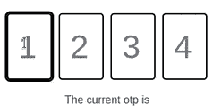
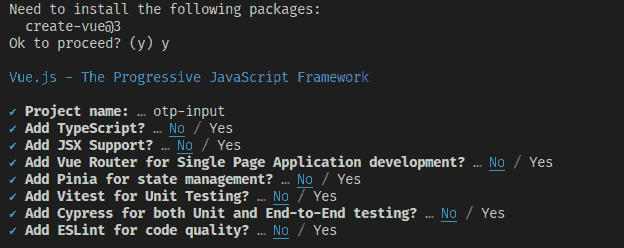
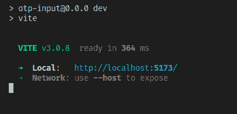
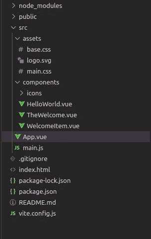
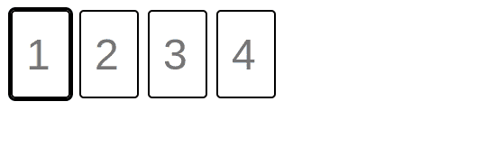
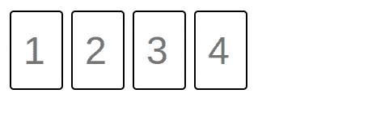
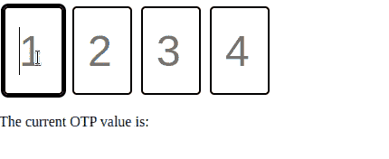

# 如何在 Vue 3 中构建 OTP 输入

> 原文：<https://www.freecodecamp.org/news/create-otp-input-vue-3/>

OTP 输入是您可以在应用程序中使用的最有趣的组件之一。它们让填写另一种表格的枯燥过程变得更有吸引力。

在本文中，您将学习如何在 Vue 3 中从头开始构建 OTP 输入。在本教程结束时，您将构建一个如下所示的 OTP 输入:



以下是本教程将遵循的步骤概述:

*   项目设置
*   构建基础
*   添加功能
*   收尾
*   结论

## 先决条件

要轻松完成本教程，您应该具备以下条件:

*   对 Vue 3 和普通 JavaScript 的基本理解
*   您机器上安装的 Node.js 16+
*   CSS 的基本知识

## 什么是动态口令输入？

如果您不熟悉这个术语，OTP 输入是字符串的表单组件。字符串中的每个字符都被输入到一个单独的框中，当您输入时，组件在框之间切换(而不是您需要单击每个框)。

它被称为 OTP 输入，因为它们通常用于让用户键入他们通过其他渠道(通常是电子邮件或短信)收到的 OTP(一次性密码)。

## 项目设置

这个项目不会使用任何外部库，所以你所需要的设置就是用 [Vite](https://vitejs.dev/) 创建一个 Vue 应用程序。

通过在终端窗口中运行以下命令来创建 Vue 项目:

```
npm init vue@3 
```

如果您的设备上没有安装`create-vue`，这个命令将会安装它。接下来，它会向您呈现一系列选项。这些选项允许您指定项目名称，并选择要包含的附加组件。

调用项目`otp-input`，不要选择任何附加组件，如下图所示:



完成后，运行:

```
cd otp-input
npm install
npm run dev 
```

在 dev 服务器启动后，您应该在终端中看到类似这样的内容:



在你的浏览器中打开 Vite 给你的 URL，让我们开始有趣的东西。

## 如何构建基础

如果在编辑器中打开`otp-input`文件夹，它的文件结构应该是这样的:



你要把这个装置调整到更合适的位置。从打开`src/App.vue`开始，用以下内容替换其内容:

```
<template>
</template>

<script setup>

</script>

<style>

</style> 
```

接下来，选择`src/components`中的所有文件并删除它们，并在组件中创建一个名为`OTP.vue`的文件。在 Linux/Mac 设备上，您可以通过在新的终端窗口中运行以下命令来实现:

```
rm -rfv src/components
mkdir src/components
touch src/components/OTP.vue 
```

然后，删除`src/assets`文件夹，从`src/main.js`中删除下面一行:

```
import './assets/main.css' 
```

接下来，打开`components/OTP.vue`，将 OTP 的起始模板放入其中:

```
<template>
  <div ref="otpCont">
    <input
      type="text"
      class="digit-box"
      v-for="(el, ind) in digits"
      :key="el+ind"
      v-model="digits[ind]"
      :autofocus="ind === 0"
      :placeholder="ind+1"
      maxlength="1"
    >
  </div>
</template> 
```

我们来解释一下这个。

该模板以一个容器 div 开始，您已经附加了一个名为`otpCont`的引用。在容器内部，您有一个带有`v-for`的文本输入。`v-for`将为我们称为`digits`的集合的每个元素提供一个输入，并附加一个与共享其索引的`digits`元素的双向绑定。

第一个呈现的输入将具有`autofocus`属性，每个输入的占位符是其索引加 1，每个输入的最大长度为一个字符。

接下来是组件的脚本。将以下代码放入`OTP.vue`:

```
<script setup>
  import { ref, reactive } from 'vue';

  const props = defineProps({
    default: String,

    digitCount: {
      type: Number,
      required: true
    }
  });

  const digits = reactive([])

  if (props.default && props.default.length === props.digitCount) {
    for (let i =0; i < props.digitCount; i++) {
      digits[i] = props.default.charAt(i)
    }
  } else {
    for (let i =0; i < props.digitCount; i++) {
      digits[i] = null;
    }
  }

  const otpCont = ref(null)

</script> 
```

导入之后，这段代码定义了两个属性:一个控制输入数量的必需数字`digitCount`和一个可选字符串`default`。

然后，它创建模板需要的反应式`digits`数组。如果提供了`default`属性，并且其长度与`digitCount`属性匹配，则使用`default`中的字符初始化`digits`。如果不是，`digits`的元素用`null`填充。

最后，代码从模板创建了`otpCont`引用。

本节的最后一个任务是给输入一些样式。将以下内容放在`OTP.vue`的末尾:

```
<style scoped>
.digit-box {
    height: 4rem;
    width: 2rem;
    border: 2px solid black;
    display: inline-block;
    border-radius: 5px;
    margin: 5px;
    padding: 15px;
    font-size: 3rem;
}

.digit-box:focus {
  outline: 3px solid black;
}

</style> 
```

这就创建了您的动态口令的基本形式。

接下来，您将编辑应用程序的主页来呈现输入。用以下内容替换`src/App.vue`的内容:

```
<template>
  <otp 
    :digit-count="4"
  ></otp>

</template>

<script setup>
import otp from "./components/OTP.vue";
</script> 
```

如果您在浏览器中打开应用程序，您应该会看到单独的输入呈现如下:



## 如何添加功能

现在，您还没有真正的 OTP 输入。您需要手动在字段之间切换焦点，并且没有验证。接下来，您将编写逻辑来解决这个问题。

打开`components/OTP.vue`，向输入标签添加一个 keydown 事件处理程序:

```
 @keydown="handleKeyDown($event, ind)" 
```

现在，在`script setup`部分的末尾创建`handleKeyDown`函数，如下所示:

```
const handleKeyDown = function (event, index) {
    if (event.key !== "Tab" && 
        event.key !== "ArrowRight" &&
        event.key !== "ArrowLeft"
    ) {
      event.preventDefault();
    }

    if (event.key === "Backspace") {
      digits[index] = null;

      if (index != 0) {
        (otpCont.value.children)[index-1].focus();
      } 

      return;
    }

    if ((new RegExp('^([0-9])$')).test(event.key)) {
      digits[index] = event.key;

      if (index != props.digitCount - 1) {
        (otpCont.value.children)[index+1].focus();
      }
    }
  } 
```

我们来分解一下这个函数。当其中一个输入字段处于焦点时，每次按下一个键都会调用事件处理程序。

如果按下的键不是 tab 或水平箭头键之一，该函数将调用`preventDefault()`，并移动到下一个 If 块。

如果按下的键是 Backspace，目标输入索引处的`digit`数组的值将被设置为 null。然后，如果目标输入不是第一个输入，代码将焦点转移到它的前一个兄弟。

最后一个 if 块使用一个正则表达式来测试按下的键是否是数字 0 到 9 中的一个。如果是，`digits`被适当地更新，并且焦点被转移到下一个输入。

如果您现在在浏览器中打开应用程序，您应该会看到 OTP 输入会自动在两个框之间切换焦点。此外，它只接受数字作为输入，您可以使用 tab 键在框之间导航:



## 添加最后的润色

OTP 输入现在已经基本完成，但是感觉有点简单。让我们添加最后一组功能:

*   一旦所有字段都被填充，输入应该发出 OTP 值。
*   当用户输入一个值时，会触发一个小的反弹动画。

我们将从发出 OTP 值的逻辑开始。首先，您将修改`App.vue`以便它可以显示发出的值。用以下内容替换`App.vue`的内容:

```
<template>
  <otp 
    :digit-count="4"
    @update:otp="otpValue = $event"
  ></otp>

  <p>The current OTP value is: {{ otpValue }} </p>
</template>

<script setup>
import otp from "./components/OTP.vue";
import { ref } from "vue";

otpValue = ref('')
</script> 
```

没有什么变化:您只是创建了一个名为`otpValue`的反应变量，告诉模板呈现它，并向 OTP 组件添加了一个事件监听器来更新`otpValue`。

接下来，打开`components/OTP.vue`并在`handleKeyDown`函数之前添加以下代码:

```
const emit = defineEmits(['update:otp']);

const isDigitsFull = function () {
  for (const elem of digits) {
    if (elem == null || elem == undefined) {
      return false;
    }
  }

  return true;
} 
```

这段代码定义了自定义事件`update:otp`，以及函数`isDigitsFull`。如果`digits`内有`null`值，则`isDigitsFull`返回`false`，否则返回`true`。

将以下内容添加到最后一个 if 块末尾的`handleKeyDown`:

```
if (isDigitsFull()) {
  emit('update:otp', digits.join(''))
} 
```

每次在输入框中按下一个数字，这段代码都会调用助手函数`isDigitsFull`来确定是否所有的输入框都被填充了。

如果是，它发出`update:otp`事件，将所有输入框的值组合成一个字符串，并作为事件的值发送。

您在浏览器中呈现的页面现在应该显示最新的(完整的)OTP 值:



最后，将动画添加到 OTP 输入中。将以下 CSS 粘贴到`components/OTP.vue`中样式标签的末尾:

```
.bounce {
  animation: pulse .3s ease-in-out alternate;
}

@keyframes pulse {
  0% {
    transform: scale(1);
  }

  100% {
    transform: scale(1.1);
  }
} 
```

然后将下面的类绑定添加到模板的输入中:

```
:class="{bounce: digits[ind] !== null}" 
```

这就是动画的代码！它是这样工作的:

*   每个输入的弹跳等级与`digits[index]`相关
*   如果`digits[index]` *的值改变了*，表达式将被重新计算
*   如果新值不为空，则应用 bounce 类
*   如果为空，则删除反弹类
*   如果值没有改变，表达式不会重新计算，因此动画不会触发。

这是你的 OTP 的最终外观:


你完了！

## 结论

在本教程中，您学习了如何在 Vue 3 中从头开始构建 OTP 输入。你可以在这里找到这个组件[的源代码。我希望你喜欢这本书！](https://github.com/Morgenstern2573/otp-input)

如果你想看更多我写的东西，你可以在推特上关注我。