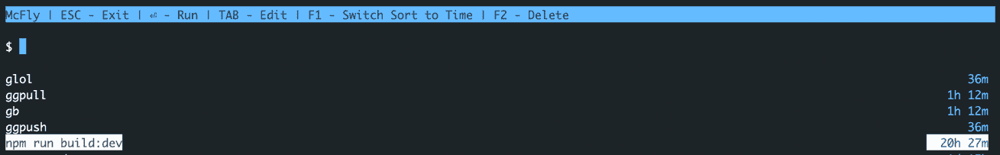
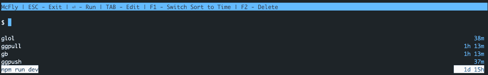
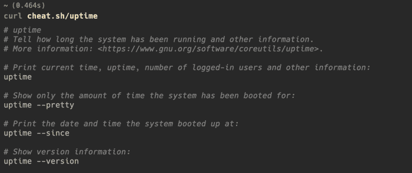
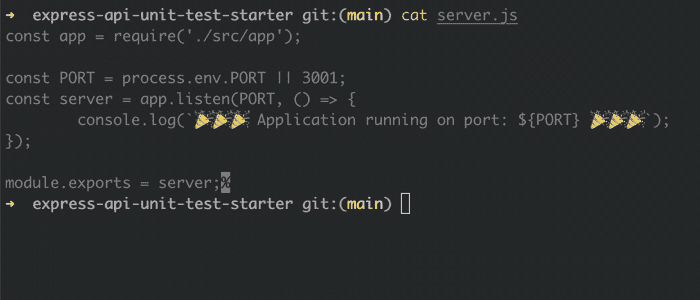
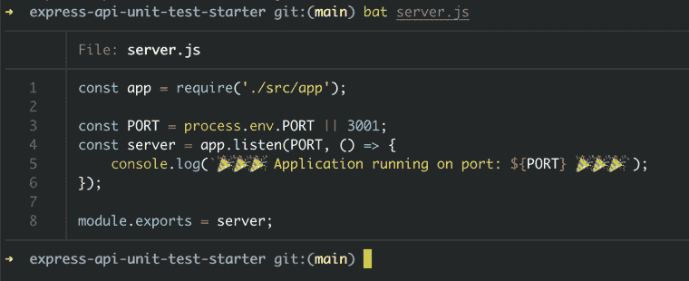

# 2022 年改进编程工作流程的 5 个 Linux 实用程序

> 原文：<https://www.freecodecamp.org/news/5-linux-utilities-for-better-programming-workflow/>

作为一名软件开发人员，总会有新的工具和框架出现，它们可以完全改变你的工作流程——变得更好(或者更坏？).

无论哪种方式，总有可能优化你的日常工作方式。

本文包含一些 Linux 实用程序，它们最近取代了我过度使用且效率低下的日常编程工作流。

您将了解这些实用程序，以及它们如何成为更好的替代品。

我们开始吧。

## 如何使用邓泽旭

您是否坚持不懈地在终端上点击`up arrow`，直到得到之前运行的命令？我去过那里。我不知道我可以优化它，所以我虔诚地使用了一段时间。

然后我被介绍给了`ctrl + r`。它允许您搜索您的命令历史，并有通配符搜索。哇哦。

结果？我的手指敲击练习从第一天就结束了。再次，我认为这必须是如此小的公用事业的峰值 DX。我大错特错了。

那又怎样？嗯，有一个更好的`ctrl-r`给你。介绍邓泽旭🦋。

除了常规的`ctrl+r`功能，它还有一些额外的好处:

1.  这些建议是使用神经网络定制的，它会考虑您当前的工作目录和最近执行的命令。
2.  它跟踪命令的退出状态(您可能不想再次运行失败的命令)、时间戳和其他有用的信息。
3.  您可以使用`%`作为通配符来匹配多个字符。

根据我的 shell 历史，以下是我在两个不同的存储库上得到的建议:



suggestions include a build script specific to this project



project has a different build script

你可以从[这里](https://github.com/cantino/mcfly#installation)安装邓泽旭。

## 如何使用 Cheat.sh

谁喜欢阅读手册页？我不知道。当我纠结于一个命令时，我最不想读的就是手册页。不是因为没有帮助，而是势不可挡。

我经常只需要一些快速的例子，这样我就可以随时使用。当我发现 [TLDR 页面](https://tldr.sh/)时，我是最幸福的人。现在有了 Cheat (sheets)，我更开心了。

Cheat 可以让你访问到 [cheatsheets](https://github.com/cheat/cheatsheets/) 来获得你可能需要的每一个命令——只是例子，没有百科全书。

如果您不想安装该实用程序，您可以使用 CURL 获得如下的备忘单:

```
curl cheat.sh/uptime
```

Fetching cheatsheet for sed

因此，您不是在机器上安装备忘单，而是只获取您需要的命令的信息。你可以访问 [cheat.sh](https://cheat.sh/) 并在你的浏览器上使用它。

以上命令的输出如下所示:



Cheatsheet output for uptime command

你会在[代码库](https://github.com/cheat/cheat)中找到很多例子。

## 如何使用 Git Open

我经常需要在浏览器中打开我正在进行的项目的 GitHub 存储库。可能是检查我提出的 Pull 请求的评论更新，更改存储库设置，或者任何需要 GitHub 存储库页面的事情。

好吧，我们甚至有一个实用工具！

运行`git open`将在浏览器上打开当前的工作库。默认情况下，它会打开您所在分支的远程页面。您甚至可以为命令创建一个别名，以避免键入整个内容。

这里有一些别名的想法给你:

```
alias go="git open"
alias blog="git open https://github.com/<username>/blog <branch>"
```

opening remote Github repository using zsh alias

查看 Github 上的 Git Open[这里](https://github.com/paulirish/git-open)。

## 如何使用 Bat

我们都做过`cat`，对吧？Bat 就是这样，但是有语法高亮、漂亮的格式和样式选项，以及 git diff 支持。它非常通用，可以很容易地与其他工具集成，并且还提供了自定义主题选项。

让我们来看一看。这是我们使用`cat`的 express 服务器文件:



output of cat command

上面的输出没有突出显示语法，这降低了代码的可读性。让我们用`bat`做同样的事情:



output of bat command

这显然更具可读性。它自动应用适当的语法高亮显示(没有任何配置)，提供文件名和行号。

在这里您可以随意开始使用它[。](https://github.com/sharkdp/bat)

## 如何使用 Jq

Jq 是 JSON 的命令行处理器。您可以分割 JSON，执行投影以仅显示某些字段，并从(巨大的)JSON 中仅提取所需的信息。不再淹没终端输出。

```
[
  {"value": 1, "rating": 2 },
  {"value": 2, "rating": 4 },
  {"value": 3, "rating": 5 }
]
```

Sample input array

从数组中访问一个键看起来像这样:

```
jq '.[0] | { value }'
```

我们要求数组中的第一个元素，并且只投影`value`字段:

```
{
  "value": 1
}
```

要了解更多，请前往他们的官方教程。

他们还有一个方便的在线游乐场。我在这里创建了一个片段[。你可以随意调整它，到处玩玩。](https://jqplay.org/s/E2-xscbiHba)

你甚至可以用 [jid](https://github.com/simeji/jid) 更进一步。这是一个利用 Jq 的交互式 JSON 挖掘器。它为您提供了非常方便的建议和自动完成功能。

## 结论

这些是一些扩展了我视野的工具，让我意识到总有更好的方法来做事。你只需要继续谷歌。从“如何做 X”和“X 的更好替代方案”开始。

我在日常编程工作流程中经常使用这些工具。我希望其中至少有一个对你有用。

我很想知道哪些实用程序对您的日常工作流程至关重要——您使用本文中提到的任何一种吗？

喜欢这篇文章吗？[获得两周一次的后端网络开发改进药丸](https://rrawat.com/newsletter)💌。