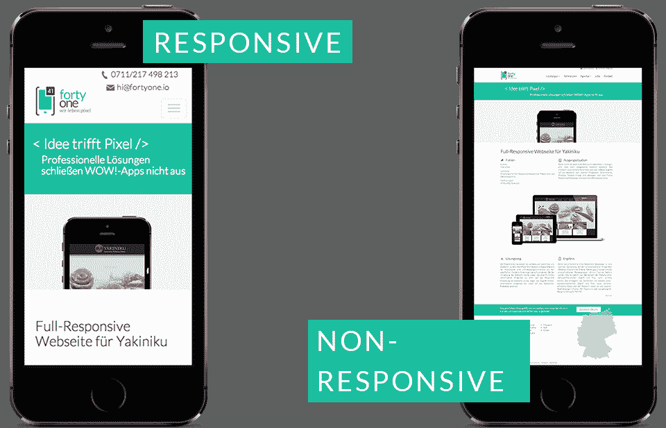

# 如何覆盖根字体大小以创造更好的用户体验

> 原文：<https://www.freecodecamp.org/news/override-root-font-size-for-a-better-user-experience/>

过去，web 开发人员、前端工程师和 UI 设计师的工作要轻松一些。这是因为他们没有被期望重新安排他们的代码和设计来适应这么多不同的屏幕尺寸。

但是在今天的世界里，如果你做一个没有考虑响应设计技术的决定，它注定会失败。

毕竟，没有人希望访问一个网站时盯着怪异的形状、扭曲的图像和难以辨认的文字。

人们的时间是宝贵而有限的，尤其是在当今快节奏的世界里。以非响应性网页设计形式出现的糟糕用户体验可能会在一瞬间伤害一个企业或品牌。

这就是为什么每个开发者都应该像对待宝石一样对待他们的产品和网站。这些确实是你个人品牌的一部分，你不想用糟糕的设计毁掉它。



[Illustration by Forty One](https://www.fortyone.io/en/responsive-webdesign.html)

如果你想保证一个没有麻烦的用户体验，作为一个网页开发人员或设计师，你应该采取一些要求你摆弄布局的做法。通过这种方式，无论屏幕大小如何，您撰写的每个页面看起来都很复杂，并且用户友好。

这个创建响应式设计的过程与[内容架构](https://www.madcapsoftware.com/blog/content-architecture-what-it-is-and-why-its-important/#:~:text=What%20is%20Content%20Architecture%3F,can%20affect%20the%20content%20architecture.)紧密相连。

有各种各样的技巧可以让你网站的潜在用户在看着他们的屏幕时微笑——或者至少不会感到沮丧。

这些可能涉及到使用媒体查询、CSS Flexbox 或 CSS Grid。也就是说，本文将主要考虑一种在有经验的 web 开发人员中流行的方法。

## 为什么要调整根字体大小？

简而言之，这项技术的目标是根字体大小，它也与你为什么选择这个设置的“雷姆”单位有关。如果你已经对此感到好奇，那就让我们深入了解一下吧。

首先，你应该知道浏览器的标准根字体大小是 16px。默认情况下，该固定值以“px”为单位。但是与 px 相比，rem 单元能够创建更具响应性的网站。你可以在本文中了解更多信息。

所以如果我们试图把 px 值转换成 rem，我们需要做一些数学运算。假设我们想将一个元素的字体大小设置为 4px，但是我们也想让它尽可能地响应。要将其转换为“雷姆”值，我们需要将其除以 16px，结果将是 0.25 雷姆。[在线转换器](https://nekocalc.com/px-to-rem-converter)也可用于此目的。

如果我们有办法更容易地将每个“px”值转换成“rem”值，一切都会很好，因为 rem 被认为更具响应性。这是我们实现梦想的方法。

我们可以将 root (HTML)字体大小设置为 62.5%，而不是处理这种繁琐的计算。在这种情况下，您可以通过系统自动进行所有其他计算。

## 如何更改根字体大小

让我们深入细节，以便更好地掌握情况。当根字体/HTML 大小为 100%时，默认情况下字体大小为 16px。但是，如果将它设置为 62.5%，新的根值将是 10px。

现在，10px(1 内存)太小了，从良好的用户体验来看，这是一个灾难。所以我们应该在体内再次设置为 1.6 雷姆(16x)。表面上看一切都一样。但这一次，新的 rem 设置将比“px”版本更灵敏。

现在我们可以把所有的值转换成雷姆单位。这里比较棘手的是 HTML 部分的根大小计算。现在，无论我们为正文选择什么大小，都将根据 root/HTML 中的预定义值重新调整形状。简单来说，root/html 部分新增的百分比值' 62.5% '保证了' px '到' rem '的平滑转换。

## 为什么我们更喜欢“百分比”的表达方式

在这一点上，你可能会问自己，为什么我们选择百分比表达式(62.5%)和“rem”单位。何必呢？‘px’版本不应该是一样的吗？嗯，没那么多。

正如 Quora 上的一些开发者建议的那样，基于百分比的数值比固定数值更容易缩放。这意味着不仅 rem 单位很重要，而且 root/HTML 部分的百分比偏好在这个特定的设置中也很重要。

关于根中的数字“62.5%”最有效的部分是，由于相关的 CSS 设置，即使访问者改变了浏览器的字体大小，他们也能够正确地查看页面。

此外，它不会对可访问性造成威胁，因为除了 root/HTML 部分中的 62.5%排列之外，我们还将正文的字体大小设置为 1.6rem。这样，我们可以确保无论屏幕大小如何，这两个数字都是一致的。

## 为什么可访问性很重要

详细阐述可访问性问题很重要。我相信这对各行各业的网页开发者和设计师来说都是至关重要的。

[研究](https://websitesetup.org/websites-for-visually-impaired/)显示，视力受损个体的数量正在逐渐上升，造成这种情况的原因有很多。但有一点是肯定的:在一个尖端技术进步的时代，每个人都应该能够通过某些无障碍措施享受互联网和获取信息。应用适当的响应式设计技术肯定是其中之一。

## 布鲁斯·劳森的重要信息是什么？

我记得看过布鲁斯·劳森的精彩演讲，他是网络标准方面的专家。在去年由[班级中心](https://www.classcentral.com/)和 freeCodeCamp 组织的一次虚拟免费训练营中，他是演讲嘉宾。他非常清楚地解释了为什么我们作为 web 开发人员有责任让每个人都参与进来，并确保在编码和/或设计网站时没有人被遗漏。

[https://www.youtube.com/embed/tgXbbOirY8o?feature=oembed](https://www.youtube.com/embed/tgXbbOirY8o?feature=oembed)

## 我们要测试我们的新装置吗？

让我们具体一点，想出一个假想的场景。假设一个有视觉障碍的用户想要访问你设计的网页。为了能够更清楚地看到一切，他们决定提前对浏览器的字体大小进行一些调整。例如，他们可能会将其设置为 18px，比标准大小(16px)大一点。

现在是时候仔细检查下面的代码片段，从这个人的角度见证 HTML 和面向主体的设置的功能了。

```
html {
    font-size: 62.5%;
}
body {
    font-size: 1.6rem;
}
```

作为此网页的开发者，您为 HTML 选择了“62.5%”，为正文选择了“1.6 雷姆”作为初始字体大小。但是请记住，由上述用户确定的浏览器字体大小现在是 18px，而不再是 16px。结果会如何？这个人会感到沮丧并离开网页，还是会继续浏览网页而不会遇到麻烦？

下面是答案。一旦用户选择浏览器的字体大小为 18px，系统将立即重新计算字体大小为 11.25px (18px * 62.5%)。因此，body 的值将是 18px (1.6rem * 11.25px)，这正是该特定用户所请求的值。因此，这个人不会因为希望看到比标准字体大的字体而受到负面影响。

好消息是，所有这些都会自动重新计算。由于百分比和 rem 导向的设置，网页上的文本将更具响应性和用户友好性。

## 更多实验

为了进一步了解这种设置的可能效果，现在让我们看看下面的元素/主容器的字体大小将如何为我们的用户工作。

```
html {
    font-size: 62.5%;
}
body {
    font-size: 1.6rem;
}
header {
    font-size: 3rem;
}
section {
    font-size: 2.5rem;
}
footer {
    font-size: 2.8rem;
}
```

根据新的 HTML 大小(62.5% * 18px = 11.25px)，重新计算的 header 元素的字体大小值将为 33.75px (3rem * 11.25px)。section 元素的大小大约为 28px (2.5rem * 11.25px)。最后，从我们想象的用户的角度来看，页脚的字体大小将是 31.5 像素(11.25 像素* 2.8 雷姆)。

换句话说，有了涉及 HTML 和 body 的字体大小的新安排，其他一切都将在幕后顺利处理，而您作为开发人员不必为每个元素执行单独的计算。

## 这种方法防弹吗？

尽管使用根大小“62.5%”的方法，因为它是一个具体的百分比值，并且 body 部分中基于 rem 的首选项为我们提供了一个动态调整一般字体大小的机会，但它也不是没有风险的，您应该谨慎使用(更多信息请参见[本文](https://www.joshwcomeau.com/css/surprising-truth-about-pixels-and-accessibility/))。

例如，当首选“em”值而不是“rem”值时，可能会导致一些问题。另外，这种技术只能调整文本的大小。所以你需要使用一些其他的技巧(例如，当处理图像的大小时)。

也就是说，覆盖根字体大小仍然是全球许多开发人员喜欢的一种普遍做法，如果小心使用的话会很方便。

## 包扎

总而言之，可访问性、响应性 web 设计、可维护和可伸缩的代码以及 web 性能是创建可靠用户体验的基础。

也许在未来，有人会想出一个更好的方法来处理这个问题。我只是想和你分享一下调整根字体大小的利弊。

即使你根本不打算使用它，你的一个队友也可能会使用它。因此，了解支持和反对它的理由总是一个好主意。

感谢您的阅读。如果你喜欢这篇文章，支持我的最好方式之一就是分享它。如果您有任何问题或意见，您可以随时通过 [LinkedIn](https://www.linkedin.com/in/damla-erkiner-000b76227/) 联系我。我非常乐意帮助你解决你的疑问。

编码快乐！

“知识就是力量。”弗朗西斯·培根