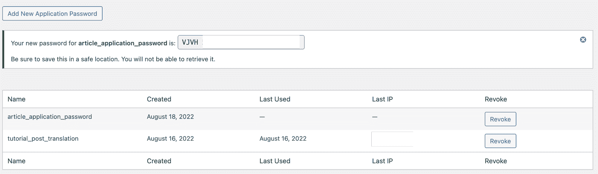
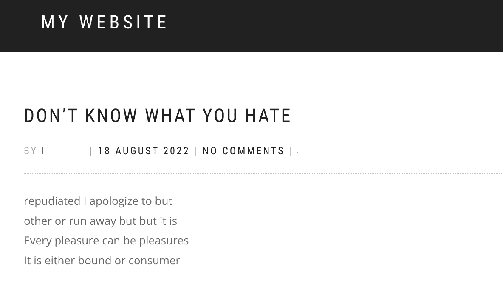
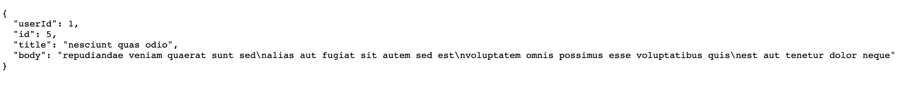

# 如何用 Python 自动生成 WordPress 帖子

> 原文：<https://www.freecodecamp.org/news/how-to-generate-wordpress-posts-automatically/>

如果你经营一个网站，你会意识到内容的重要性。这对你的网站很重要，有助于你在你的领域被认可为领导者，提高你的搜索引擎优化排名，增加你的观众，等等。

WordPress 是最流行和广泛使用的创建博客、电子商务平台和网站的工具之一。

在本文中，我将向您展示如何使用 Python 自动创建内容并将其推送到您的 WordPress 网站。

它是这样工作的:

*   我们将从我们的来源获取内容(例如，我们运营的另一个网站)
*   我们会把它翻译成我们的语言
*   我们将选择一个已经在我们的网站上可用的特色图片，并最终将其作为帖子发布到我们的 WordPress 实例。

如果您想快速创建另一种语言的内容以扩大您的受众，我们即将开发的脚本可能会很有用。

假设你有一个用英语写的内容的网络杂志，你想让说西班牙语的用户开始阅读你的帖子。你可以创建一个新的博客，运行你的脚本，将你的文章翻译成西班牙语，并准备好让你的用户阅读。

## 我们开始吧

这是我们将在本文结束时开发的脚本:

```
import requests
import json
import random
from googletrans import Translator
from requests.auth import HTTPBasicAuth

def post_creator(sourceURL, wpBaseURL, sourceLang, targetLang, postStatus):
    response_API = requests.get(sourceURL)
    data = response_API.text
    parse_json = json.loads(data)
    get_article_title = parse_json['title']
    get_article_content = parse_json['body']
    image_list = ["1689","1594","1612"]

    translator = Translator()

    title_translation = translator.translate(get_article_title, src=sourceLang, dest=targetLang)
    title_translation_text = title_translation.text 

    content_translation = translator.translate(get_article_content, src=sourceLang, dest=targetLang)
    content_translation_text = content_translation.text 

    random_image_list = random.choice(image_list)

    WP_url = wpBaseURL + "/wp-json/wp/v2/posts"

    auth = HTTPBasicAuth(<USERNAME>, <PASSWORD>)

    headers = {
    "Accept": "application/json",
    "Content-Type": "application/json"
    }

    payload = json.dumps({ 
        "status":postStatus,
        "title": title_translation_text,
        "content": content_translation_text,
        "featured_media": random_image_list
    })

    response = requests.request(
    "POST",
    WP_url,
    data=payload,
    headers=headers,
    auth=auth
    )

    print(response)
    print(random_image_list)

post_creator("https://jsonplaceholder.typicode.com/posts/5", "<BASE_URL>", "la", "en", "publish")
```

我们将把它分成几个部分，然后一步一步地看看我们需要做什么。

在此之前，我们需要去我们的 WordPress 网站的仪表板，创建一个新的应用程序密码。我们将在向我们的网站推送帖子时使用它来构建我们的基本身份验证。

如果你以前从未做过，你可以查看 WordPress 官方[文档](https://make.wordpress.org/core/2020/11/05/application-passwords-integration-guide/)了解如何做。一旦你创建了它，你会看到这样的东西:



别忘了保存它，这是得到它的唯一机会！

## 编码时间到了

让我们开始从我们需要的库中检查我们的代码。我们将使用 googletrans 库通过 Google translate APIs 翻译我们的内容。因此，从命令行，我移动到我的项目目录并键入:

```
pip install googletrans
```

运行脚本时，您可能会遇到以下错误:

```
AttributeError: 'NoneType' object has no attribute 'group'
```

如果您看到此消息错误，您应该安装此版本:

```
pip install googletrans==4.0.0-rc1 
```

我在[这篇](https://stackoverflow.com/questions/52455774/googletrans-stopped-working-with-error-nonetype-object-has-no-attribute-group) StackOverflow 文章上找到的。如果你想了解更多，就去看看吧！

## 如何翻译内容

一旦我们安装了 googletrans，我们就定义了一个新函数，并将其命名为“post_creator”:

```
def post_creator(sourceURL, wpBaseURL, sourceLang, targetLang, postStatus):
```

我们给这个函数传递五个参数:

*   `sourceURL`:你从中获取内容的网站的 URL
*   `wpBaseURL`:您要导入翻译内容的新网站的 URL
*   `sourceLang`:内容的原始语言
*   `targetLang`:你希望你的内容被翻译成的语言
*   你的 WordPress 文章的状态:例如“草稿”、“已发布”等等。

在函数内部，我们声明了六个变量。让我们看看他们。

我们使用 GET 方法调用 API 来获取我们想要翻译的内容:

```
response_API = requests.get(sourceURL)
```

然后，我们将请求的文本存储在“数据”变量中:

```
data = response_API.text
```

我们用“.”来解析 JSON。loads()"方法将其转换为 Python 字典:

```
parse_json = json.loads(data) 
```

然后我们存储 JSON 键“title”的值:

```
get_article_title = parse_json['title'] 
```

我们对“body”键做了同样的操作:

```
get_article_content = parse_json['body'] 
```

最后，我们将一个列表存储在一个变量中，在这个列表中，我们有想要用作“特色图像”的媒体的 id:

```
image_list = ["1689","1594","1612"] 
```

创建上述变量后，我们实例化 Translator():

```
translator = Translator()
```

现在我们可以开始翻译内容了。我们翻译从前面的 API 调用中获得的文章标题，并将其存储在“title_translation”变量中。然后，我们获取它的文本，并将其存储在“title_translation_text”变量中:

```
title_translation = translator.translate(get_article_title, src=sourceLang, dest=targetLang)
title_translation_text = title_translation.text 
```

我们对文章的内容做了同样的处理:

```
content_translation = translator.translate(get_article_content, src=sourceLang, dest=targetLang)
content_translation_text = content_translation.text 
```

我们从之前创建的图像 id 列表中获得一个随机图像。图像必须已经在我们的 WordPress 实例中可用。然后我们通过指定 ID 来选择一个:

```
random_image_list = random.choice(image_list)
```

## 如何创建我们的 WordPress 博客

现在，我们设置好将我们的内容推送到我们的 WordPress 网站。首先，我们将调用的推送内容的 URL 存储在一个变量中:

```
WP_url = wpBaseUrl + "/wp-json/wp/v2/posts" 
```

我们将基本身份验证的凭证存储在一个变量中:我们之前创建的用户名和应用程序密码。我们使用“HTTPBasicAuth”来处理我们的身份验证:

```
auth = HTTPBasicAuth(<USERNAME>, <PASSWORD>)
```

我们将想要传递的头存储在一个变量中。我们将输出类型设置为 JSON，并指出请求体格式是 JSON:

```
headers = {
    "Accept": "application/json",
    "Content-Type": "application/json"
    }
```

定义有效负载的时间。我们使用 dumps()函数将我们创建的 Python 对象转换成 JSON 字符串，然后我们传递创建博客文章所需的数据:

```
payload = json.dumps({ 
        "status":postStatus,
        "title": title_translation_text,
        "content": content_translation_text,
        "featured_media": random_image_list
    })
```

然后，我们使用 request()方法进行 API 调用:

```
response = requests.request(
    "POST",
    WP_url,
    data=payload,
    headers=headers,
    auth=auth
    )
```

在函数的最后，我们打印 POST 调用的响应和我们将用作特色图片的媒体的 ID:

```
print(response)
print(random_image_list)
```

一旦我们完成了函数，就该调用它并传递正确的参数了:

```
post_creator("https://jsonplaceholder.typicode.com/posts/5", <BASEURL>, "la", "en", "publish")
```

*   `https://jsonplaceholder.typicode.com/posts/5`:我们调用的获取我们想要翻译的内容的 URL
*   我们 WordPress 网站的基本 URL
*   `la`:我们从 API 调用中获得的内容的语言代码。在本例中，它是“Lorem Ipsum”内容，因此我们将其设置为拉丁文
*   我们希望将内容翻译成的语言代码。我们把它设置为英语。
*   我们正在创建的 WordPress 文章的状态

如果我们通过命令行运行该脚本，我们会看到以下消息:

```
<Response [201]> 
1594
```

如果你访问这个网站，你可以看到这个帖子:



为了给你一个完整的概述，这是我们从中获取内容的 JSON:



## 最后的想法

在本文中，我们看到了如何使用 Python 用几行代码实现自动化发布。它可以批量运行，也可以在必要时运行。

当你管理一个网站时，内容总是一个关键点。我希望这篇文章能帮助你快速翻译内容，并更快地扩大你的受众。[这里](https://github.com/mventuri/python-wordpress-blog-post)你可以在 GitHub 上找到回购。

享受并继续编码！:)