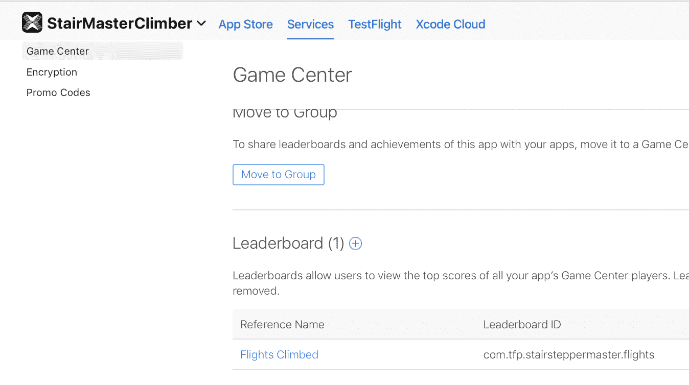
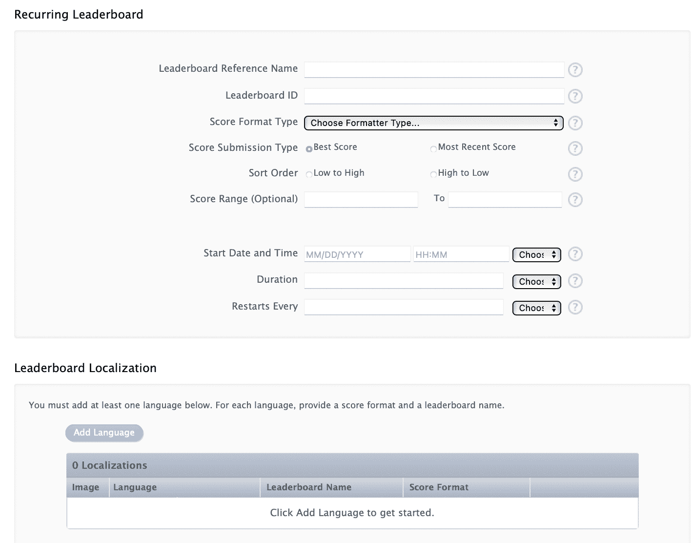
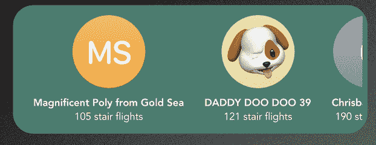
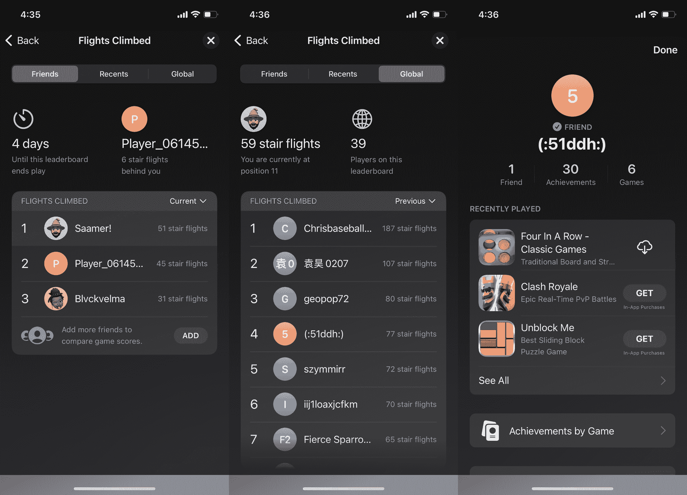
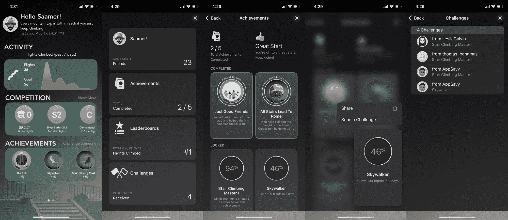

# 如何在 SwiftUI 中实现 GameKit 排行榜

> 原文：<https://www.freecodecamp.org/news/how-to-implement-a-leaderboard-in-swiftui/>

在本文中，我们将讨论为什么以及如何在您的应用中实现 [GameCenter 的排行榜](https://developer.apple.com/design/human-interface-guidelines/technologies/game-center/leaderboards/)。

## 为什么 GameCenter 正在大规模复兴

你可以在没有记分牌的情况下制作 iPhone 游戏，但排行榜有助于让游戏感觉更有竞争力，就像全世界的人都在相互竞争一样。

GameCenter 排行榜不需要创建和管理您自己的后端，而是允许您随着流量无限扩展，跳过整个登录页面进行授权，获得图像、姓名和玩同一游戏的朋友-所有这些都无需您的用户输入任何内容。

特别是随着 iOS 16 的推出，[苹果正在投入更多资金来改进它](https://developer.apple.com/game-center/)，并推动更多应用程序的使用，比如当你的朋友在游戏中击败你时，通过推送通知。

在我学习 SwiftUI 的过程中，我一直在创建和发布应用程序，因为在我看来这是最好的学习方式。

没有太多关于如何做这些的更新文档，特别是 SwiftUI 和 Swift 中的 async 和 await[的出现。所以我整合并简化了它，让每个人都能构建出令人惊叹的应用。所以请随时邀请我来测试你的应用程序！](https://www.freecodecamp.org/news/make-rest-api-call-in-swiftui-in-2-minutes/)

### 先决条件:

*   你需要有一个苹果开发者付费账户
*   你必须在苹果开发者门户的预置描述部分为你的应用程序创建[应用程序 Id](https://support.magplus.com/hc/en-us/articles/203808708-iOS-Creating-App-IDs)
*   你必须[在 iTunes Connect Connect](https://support.staffbase.com/hc/en-us/articles/115003481992-Creating-an-App-Profile-in-App-Store-Connect) 门户中创建应用程序

## 如何用 6 个步骤实现你的 iOS 排行榜

如果你想跳过，排行榜的大部分代码逻辑都在[文件中。这里的步骤如下:](https://github.com/StairMasterClimber/mobile/blob/main/StairStepperMaster/StairStepperMaster/Views/LeadersTileView.swift)

### 1.如何创建 App Store Connect 排行榜



Screenshot from the Apple iTunes Connect Portal 

在 App Store Connect portal 中成功创建应用程序后，转到应用程序的服务选项卡->并确保您位于 GameCenter 页面。

然后使用“+”号添加新的排行榜，它可以是“经典”(分数永不重置)或“循环”(分数根据您的频率设置重置)。

大多数游戏更喜欢一个循环的排行榜，这样排行榜就不会被旧的不可能达到的高分弄得乱七八糟。

您在那里输入的 LeaderboardID 是您需要在代码中所有需要它的地方使用的 ID。



Details required to create a new Leaderboard

### 2.如何设置 GameCenter 认证

首先，您需要对 GameCenter 的用户进行身份验证，才能使用这些功能。

因此，我们将使用这段代码来完成这项工作，它基本上确保您(GKLocalPlayer.local)通过了身份验证，或者如果有错误，则打印一个错误:

```
func authenticateUser() {
    GKLocalPlayer.local.authenticateHandler = { vc, error in
        guard error == nil else {
            print(error?.localizedDescription ?? "")
            return
        }
    }
} 
```

如果用户通过了身份验证，您将在 UI 中看到一个小弹出窗口。如果没有，用户将被带到一个页面登录到他们的游戏中心帐户。


A sign that displays when a user is logged in

### 3.如何在用户界面中显示排行榜项目

为了从 GameCenter ViewController 排行榜(GKLeaderboard)中获取数据，您需要使用`loadLeaderboards`。

您可以将`loadEntries`功能从`.global`切换到`.friends`，以便只拉您的朋友。

您还可以通过遍历每个玩家并执行一个`loadPhoto`来检索每个玩家的图像。

使用`NSRang(1...5)`，你可以选择显示多少玩家。这将从排行榜中提取得分最高的 5 个用户，如果没有用户，则返回 none，例如在循环刷新循环排行榜的情况下。

如果您利用 async-await，这就是从排行榜中提取数据的样子:

```
func loadLeaderboard() async {
    playersList.removeAll()
    Task{
        var playersListTemp : [Player] = []
        let leaderboards = try await GKLeaderboard.loadLeaderboards(IDs: [leaderboardIdentifier])
        if let leaderboard = leaderboards.filter ({ $0.baseLeaderboardID == self.leaderboardIdentifier }).first {
            let allPlayers = try await leaderboard.loadEntries(for: .global, timeScope: .allTime, range: NSRange(1...5))
            if allPlayers.1.count > 0 {
                try await allPlayers.1.asyncForEach { leaderboardEntry in
                    var image = try await leaderboardEntry.player.loadPhoto(for: .small)
                    playersListTemp.append(Player(name: leaderboardEntry.player.displayName, score:leaderboardEntry.formattedScore, image: image))
                                print(playersListTemp)
                    playersListTemp.sort{
                        $0.score < $1.score
                    }
                }
            }
        }
        playersList = playersListTemp            
    }
} 
```



You can get leaderboard data into your app

### 4.如何在视图/页面出现时调用 SwiftUI 中的功能

您可以利用视图的`onAppear` [生命周期功能来实际调用验证和加载，但是如果您喜欢，您也可以点击一个按钮来完成:](https://www.hackingwithswift.com/quick-start/swiftui/how-to-respond-to-view-lifecycle-events-onappear-and-ondisappear)

```
.onAppear(){
    if !GKLocalPlayer.local.isAuthenticated {
        authenticateUser()
    } else if playersList.count == 0 {
        Task{
            await loadLeaderboard()
        }
    }
} 
```

### 5.如何加载提交的分数

为了加载分数，您也需要提交分数。`submitScore`功能可以帮你做到这一点。

*   `flightsClimbed`变量应该包含您想要提交的分数。
*   GameKit 确保在排行榜上只显示你的最佳分数。
*   `leaderboardId`包含您在 App Store Connect 帐户中手动输入的值:

```
func leaderboard() async{
    Task{
        try await GKLeaderboard.submitScore(
            flightsClimbed,
            context: 0,
            player: GKLocalPlayer.local,
            leaderboardIDs: ["com.tfp.stairsteppermaster.flights"]
        )
    }
    calculateAchievements()
}
```

### 6.如何显示 GameCenter ViewController 门户

当你登录到 GameCenter 时，一个小图标会出现在你屏幕的右上角。当你点击它时，你会被带到 GameCenter ViewController。幸运的是，如果它不是你设计的一部分，你可以用`GKAccessPoint.shared.isActive = false`隐藏它。

由于 GameCenter UI 是一个 UIKit `ViewController`而不是一个简单的 SwiftUI `View`，你需要首先创建这个[UIViewControllerRepresentable](https://www.hackingwithswift.com/books/ios-swiftui/wrapping-a-uiviewcontroller-in-a-swiftui-view)(正如你可以[看到这里](https://github.com/StairMasterClimber/mobile/blob/main/StairStepperMaster/StairStepperMaster/Views/GameCenterView.swift))，使用不同的按钮启动 GameCenter，

一旦您将文件添加到项目中，您就可以简单地使用这个:`GameCenterView(format: gameCenterViewControllerState)`来显示 GameCenter 门户，其中 gameCenterViewControllerState 可以帮助您转到 GameCenter 中的详细页面。



GameCenter's Leaderboard View

## 使用 GameCenter 排行榜时要记住的事项:

*   模拟器调试——由于某种原因，游戏中心的认证在模拟器上非常慢，所以在使用模拟器时甚至创建一个数据模拟也是有意义的。
*   挑战——由于被弃用,你不能再通过编程方式向你的朋友[发出挑战。取而代之的是，你必须在用户的游戏中心仪表盘中手动完成这些任务。此外，无法查看您发送的挑战。](https://developer.apple.com/documentation/gamekit/gkscore/1520610-issuechallenge)
*   成就——排行榜与 GameKit 成就不同，game kit 成就的计算和显示方式也不同，但[要容易得多](https://github.com/StairMasterClimber/mobile/blob/18283a68e1c5cac4e270a85b03853887b3950156/StairStepperMaster/StairStepperMaster/Views/AchievementTileView.swift#L113)。这些也可以放入应用程序，如下图所示:



GameKit Challenges and Achievements

## 包扎

你可以试试我上面分享的免费开源的[爬楼梯高手 iPhone 健康&健身应用](https://stairmasterclimber.com/app)。我很想知道你的想法，这样我们可以一起学习。

如果您有任何问题，请随时通过社交媒体[或通过](https://twitter.com/StairMasterApp)[电子邮件](mailto:hi@stairmasterclimber.com)联系我。