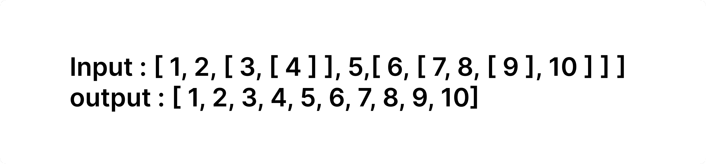
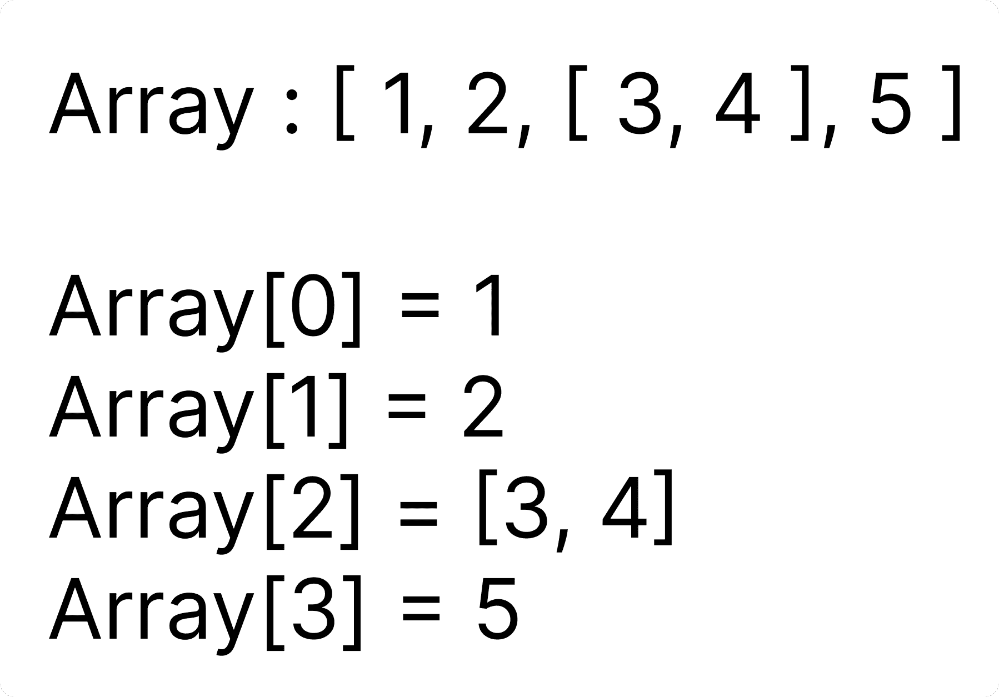

# 如何在 JavaScript 中使用递归展平数组

> 原文：<https://www.freecodecamp.org/news/flatten-array-recursion/>

在本教程中，我们将讨论一个面试官喜欢问应聘者的常见编码问题。希望这能帮助你理解如何思考和解决这个问题。

让我们从理解这个问题开始。给你一个包含数字和数字嵌套数组的数组。你的工作是返回一个新的数组，该数组包含所有没有嵌套的线性数字。请记住，嵌套可以是任何深度。

这里有一个例子:

Example input and output

现在，当你听到嵌套这个词时，你会想到什么？嗯，你应该想到的一个概念是**递归**。

## **什么是递归？**

递归仅仅意味着一个调用自身的函数。马上你可能会问如果一个函数一直调用自己，会不会是一个无限循环？是的，你是对的！

为了处理这个问题，一旦我们完成了任务，我们使用一些**条件**(很可能是一个 if 条件)来停止递归函数调用。这些条件被称为**基础案例**。

先说个例子。假设我想打印从 1 到 N(包括 1 和 N)的数字。通常，你会为它写一个 for 循环，对吗？大概是这样的:

Function to print 1 to N (Iterative solution)

如果我想写代码用递归打印 1 到 N 呢？

要为上面写一个递归函数，我们必须问下面两个问题:

1.  我们的递归函数应该什么时候停止？答:到了 N + 1，由于我们要打印从 1 到 N **含**。
2.  我们的递归函数应该做的实际工作是什么？答:将值打印到控制台。

所以简而言之，**继续打印值，直到我们达到 N + 1。**

根据我们刚才讨论的第二个问题，我们的代码应该是这样的:

上面这段代码也打印 1 到 N (5)，对吗？这段代码的实际工作是将值打印到控制台。

现在，让代码为我们做这件事，而不是手动调用相同的函数。大概是这样的:

如果你仔细观察上面的代码，第 6 行`print1ToNo(currentValue + 1)`用一个新值调用同一个函数(无论当前值是什么，加 1，即当前值+ 1)。它一直这样做，**直到当前值超过 N** ，因为那时我们告诉它**返回**。这就是递归的含义。

## 如何思考递归方式

现在，让我们回到我们的主要问题——我们需要**展平数组**。假设我们只有一层嵌套(当然，我们可以有多个嵌套，但是现在我们只处理一个)。该数组应该如下所示:

Example input - 1 level nesting

我们将逐个索引地遍历输入数组。

### 索引 0，值= 1

索引 0 包含一个数字(值= 1)。它只是一个数字而不是一个数组。我们需要简化数字吗？不要！它们将成为输出数组的一部分。也就是说，我们不需要对数字做什么特别的处理，我们只需要特别关注数组。

所以，我们的规则是，如果它是一个数字，把它推到输出数组，并移动到下一个索引(这里是索引 1)。

### 索引 1，值= 2

索引 1 也包含一个数字(值= 2)。我们需要简化数字吗？不要！它们将成为输出数组的一部分。

所以，按照我们的规则，如果是一个数字，就把它推到输出数组，然后移到下一个索引(这里是索引 2)。

### 索引 2，值= [ 3，4 ]

现在， **index 2 是一个数组([ 3，4 ])** 而不是一个数字。所以现在我们必须想办法把它压平。

如果我给你一个数组[3，4]让你把它展平呢？你可以像我们之前做的那样，一个索引一个索引地遍历数组元素。然后你可能会意识到 3 只是一个数字，所以把它推到输出数组，然后继续下一个索引。

在下一个索引中，4 也只是一个数字，所以把它放到输出数组中。我们完事了。那么，为什么不在我们输入数组的`**index 2 ( [ 3, 4 ] )**`上做同样的事情呢？

你一定在想，说起来容易！如何用代码实现呢！？这就是递归的用武之地。每当遇到数组，我们都会告诉递归函数把那个数组作为新的输入，替我们求解。

将所有内容放入上下文中，如果只是一个数字，不要做任何事情，只需将该数字推送到我们的输出数组，并继续移动到下一个索引。

如果是一个数组，那么把这个数组作为一个新的输入，开始做我们之前做的事情。(我们将使用递归来完成这一部分)

## 问题的解决方案

好吧，提醒一下，这是我们的问题:

给你一个包含数字和数字嵌套数组的数组。你的工作是返回一个新的数组，该数组包含所有没有嵌套的线性数字。请记住，嵌套可以是任何深度。

下面是使用递归对我们的问题的解决方案:

Solution - Code

如果你仔细观察上面代码片段中名为**递归**的函数，我们会检查我们当前所在的数组元素是否是一个数组。在`**inputArray**`中，名为 **`index`** 的变量用来表示我们当前所在的索引。

如果它不是一个数组，我们就把这个元素放入输出数组，然后继续下一个索引。否则，我们用索引变量指向的数组开始一个新的函数调用(recurse)。

这段代码适用于任何级别的嵌套，而不仅仅是 1 级嵌套！这是为什么呢？每当我们发现一个数组而不是一个数字，我们就启动一个新的递归调用，把这个数组作为递归调用的输入。

因此，不管我们有多少嵌套数组，递归将继续下去，直到我们找到一个数字，这样我们就开始把它推到输出数组！

递归在幕后是这样工作的(对于上一个例子):

How things are getting done!

## 结论

现在，您知道了如何使用递归来展平数组。当涉及到时间和空间复杂性时，递归是一种昂贵的方法。

例如，我们在解决方案中使用的唯一额外空间是`**outputArray**`，我们用它来存储问题的答案。

但是，这不是我们使用的唯一空间！当我们使用递归时，总有一个辅助堆栈空间在使用。

这个辅助堆栈空间有多大？嗯，递归函数被反复调用，直到满足基本条件，对吧？这些重复的函数调用被放在调用堆栈中，并在每个函数完成时弹出。因此，堆栈的最大高度(代表递归调用的深度)就是辅助堆栈空间的组成部分。类似 **`O(h) space, where h is the maximum height of the stack`** 的东西。

现在，说到时间复杂度，它取决于输入。例如:`**[1 , 2, 3, 4, 5]**` **。**像这样的输入不需要任何展平，但我们仍然遍历整个数组一次。所以，时间复杂度是`**O(n) where n is the number of elements**`。

对于这个例子呢？这里我们有两个选择:如果是一个数组，用这个数组调用递归函数，作为我们新的输入数组。如果它是一个数字，把它推到我们的输出数组，然后递归到下一个索引。

所以，时间复杂度几乎是指数级的。递归很少用在生产环境中。但是你会在技术面试中经常看到:)