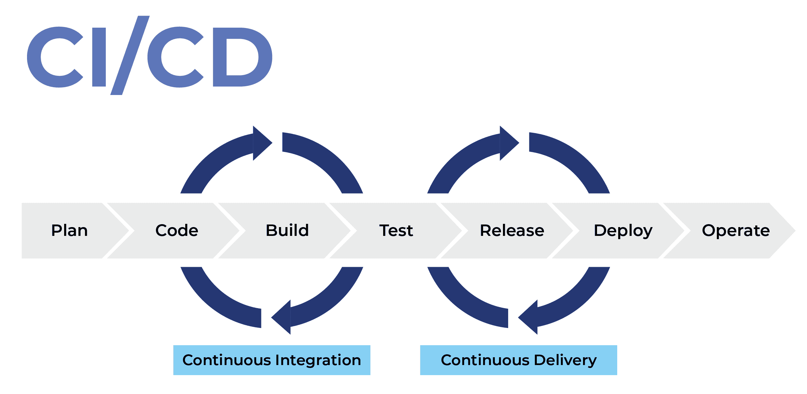
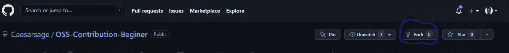
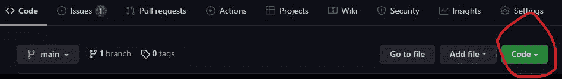
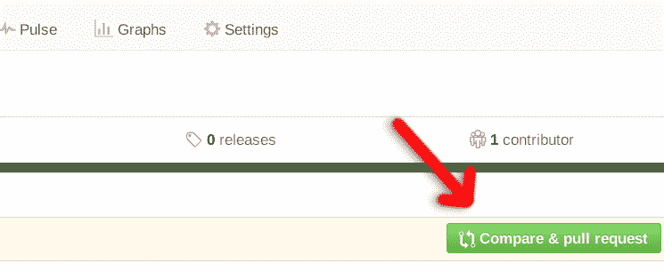
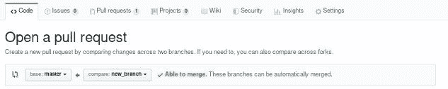

# 什么是开源？如何为开放源码软件项目做贡献

> 原文：<https://www.freecodecamp.org/news/what-is-open-source-software/>

在本文中，我们将讨论开源软件。开源软件通常被认为是自由软件。

在本文中，我将从较高的层次解释什么是开源软件(OSS ),它在现代技术世界中的优势，如何使用它，以及在使用或参与 OSS 项目时要遵循的一些最佳实践。

您将了解广泛使用的工具和技术，如 GitHub 和持续集成，以及选择什么许可证和如何在开源项目中促进多样性。

如果你还没有这样做的话，你也可以做出你的第一个开源贡献。

开源项目的维护者和贡献者都应该阅读这篇文章。

## 目录

*   [OSS](#what-is-oss)是什么？
*   [什么是专有软件](#what-is-proprietary-software)？
*   [开源治理模式](#open-source-governance-models)
*   [为什么要使用开源项目(优点)](#why-use-open-source-projects-advantages-)？
*   [如何从事 OSS 项目](#how-to-work-on-an-oss-project)
*   [如何为开源项目做贡献](#how-to-contribute-to-open-source-projects)
*   [有用的投稿技巧](#helpful-contribution-tips)
*   [持续集成和交付](#continuous-integration-and-delivery)
*   [开放源码软件许可证和法律问题](#oss-licenses-and-legal-issues)
*   [如何为您的 OSS 项目选择许可证](#how-to-chose-a-license-for-your-oss-project)
*   [如何构建更好的开源软件项目](#how-to-build-better-open-source-software-projects)
*   [明白领导不是控制](#understand-that-leadership-is-not-control)
*   [为什么许多 OSS 项目失败](#why-many-oss-projects-fail)
*   [开放源码软件的多样性](#diversity-in-oss)
*   [如何使用 GitHub 托管 OSS 项目](#how-to-use-github-for-hosting-oss-projects)

# OSS 是什么？

OSS 代表开放源码软件。这种类型的软件在许可证下可以自由访问源代码，允许您不受限制地检查、修改和使用该代码。

# 什么是专有软件？

与 OSS 相反，许多公司使用专有软件。只有专有软件的所有者才能完全访问源代码。一旦可信的合作伙伴签署了保密协议，他们就可以检查代码。

使用专有软件时，您必须同意限制您共享产品能力的许可。

# 开源治理模型

任何想要成功的组织都需要被组织起来。仔细考虑组织如何做出决策以及由谁做出决策非常重要。

建立治理模型有助于确定如何实现这一点。现在就来说说其中的几款。

### 公司主导的治理模式

在这个模型中，软件开发和发布管理由一个单独的实体来处理。

*   可能要求也可能不要求外部捐助。
*   计划和发布日期不得公开披露，非官方谈话不得公开。
*   软件在发布时是公开的(也就是说，它是公开的)。
*   这种模式的一个例子是谷歌的 Android。

### 仁慈的独裁治理模式

在这个模型中，一个人对软件有着主导性的影响——因此有了“独裁者”这个术语(但在这里有更积极的意义)。

*   项目的质量和效果在很大程度上受到独裁者的智慧和管理能力的影响
*   随着项目的成熟，维护者编写更少的代码，这可以减少讨论并加快进度。
*   这种治理的一个例子是维基百科

### 董事会治理模式(更严格的监管)

*   所有讨论都通过邮件列表公开，并采取集体选择。
*   管理委员会决定谁可以贡献，以及新软件是否被接受。
*   发布有时不太频繁，但会仔细调试。
*   例如 Debian 和 FreeBSD

# 为什么使用开源项目(优势)

从事开源开发有很多好处。以下是其中的一些:

*   你与其他贡献者合作，通常会得到更好的结果
*   源代码通常更安全，质量更高
*   使用 OSS 最佳实践帮助开发者变得更好
*   它降低了开发成本
*   它缩短了上市时间
*   顾客可以信任质量，因为没有秘密，他们知道他们得到的是什么
*   你将获得大量廉价或免费的教育和学习辅助工具
*   这是向新手介绍工作场所的好方法

# 如何从事开放源码软件项目

## 如何为开源项目做贡献

在参与开源项目之前，您应该围绕项目做一些研究。以下是一些准备方法:

### 调查项目

在你开始一个项目之前，你会想了解更多。首先，您应该确定并理解项目工作流程及其使用的样式。其次，你应该弄清楚需要做的工作的范围和性质。

### 了解它的沟通方式

确定项目维护人员是如何沟通的，是通过研究档案、邮件列表，还是一些在线小组或聊天平台。

### 弄清楚投稿是如何提交的

对 OSS 项目的贡献可以是邮件列表、电子邮件的形式，或者最常见的是通过 Git 版本控制系统。

### 研究项目以前的历史

研究项目的历史总是一个好主意，这样你就知道它是如何开始的，以及它是如何发展的。检查项目是否提供资深贡献者作为导师。

### 先当看门人

在开始提交代码之前，提供测试、查找 bug 等服务。这对初学者和不熟悉 OSS 生活方式的人来说是有益的。这是一个暂时的阶段。

### 理解项目的语言

人们经常对学习新的编程语言感兴趣，通过参与使用这些语言的开源项目。但是不要把这个项目作为学习语言的一种方式。

在考虑做出软件贡献之前，您应该对该语言有所了解。大多数维护人员只想要合格的贡献——例如，他们可能没有时间教你 Python 或 JavaScript。

因此，在投稿之前，请确保您精通该项目使用的编程语言。不要从一个项目开始学习。

### 要尊重

礼貌和尊重是 OSS 社区不可或缺的一部分，因为它涉及到不同的人。永远不要使用 flaming 和 trolling，因为它们在开源社区中没有位置。

### 找到平衡

尝试在过程的早期寻求反馈和建议，以及将您的请求延迟太长时间并使维护人员一次承担大量工作之间取得平衡。

### 研究并理解项目的结构(DNA)

最有可能的是，项目已经有了正式或非正式的领导结构和社区建立的文化。

研究项目的目的及其背后的动力。了解贡献通常有多大或多小，社区有多活跃，以及正在使用哪种许可证。

## 有用的投稿技巧

为了成功地为开源项目做出贡献，您可以遵循一些最佳实践。

首先，您将想要识别维护者、他们的工作和他们的 techniques‌‌.对于单独的子系统，有单个维护者或者多个维护者的项目。‌‌

维护人员也有不同的职责。他们需要能够理解和审查所有的提交，并验证它们没有增加不必要的复杂性或缺陷。他们还应该确保这些更改不会与现有代码冲突。

您可以与项目维护人员建立融洽的关系，并根据需要帮助他们进行调试、审查和其他任务。

当你在做一个项目的时候，尽早获得信息并公开工作也是很重要的。

以下是一些需要记住的快速提示:

1.  该项目可能有很多历史，所以检查以确保您的问题尚未得到解决，或者其他人尚未提交拉请求来修复它。你的提议可能过时了。
2.  不要提出一个新的想法，然后让别人去实现它。这表明你没有承诺做出贡献。
3.  如果你不喜欢别人经常看你的作品，OSS 可能不是最适合你的。然而，这可能是一个学习如何接受反馈和建设性批评的机会。
4.  一次贡献一点——不要一次产生大量代码。
5.  把你的自负留在门口。你有时会收到一些糟糕的评论，你需要冷静地消化这些反馈。
6.  不要歧视他人。
7.  保持耐心，努力与 OSS 社区中的其他人发展长期的专业关系。

## 持续集成和交付

当你在做一个 OSS 项目时，可能会有既定的代码库指南来防止冲突，因为许多贡献者会一起工作。测试还有助于确保代码正常工作。

### 什么是持续集成？

持续集成技术有助于确保经常进行测试，并且任何问题都不会长时间未被发现。CI 还有助于确保分散的开发人员保持同步，即使他们在世界各地远程协作。

持续集成的不同阶段是集成、交付和部署。

*   **连续交付**:一旦费用被合并，就有一个快速和自动的交付或释放过程的实践，并且它被释放以构建客户。
*   **持续部署**:产品实际发布给客户时

一些持续集成工具的例子有:

*   詹金斯
*   绕圈圈圈圈圈圈圈圈圈圈圈圈圈圈圈圈圈圈圈圈圈圈圈圈圈圈圈圈圈圈圈圈圈圈圈圈圈圈圈圈圈圈圈圈圈圈圈圈
*   GitLab
*   特拉维斯



** Continuous integration and delivery process**. credits: [Ronak Kumar Samantray](https://substack.com/profile/2655972-ronak-kumar-samantray)

### CI/CD 对 OSS 有什么好处？

当一群贡献者从不同的角度和地点在一个项目的不同方面工作时，它必须走到一起，不能有冲突。此外，解决一个问题不应该导致其他地方出现新问题。

要完成所有这些，您必须使用一些自动化测试。所以在测试时，你应该考虑许多因素，例如:

*   您是否可以同时实现重叠的修改。
*   是否有任何冲突。
*   如果项目在应用更改后仍然能够编译。
*   如果你做了所有必要的修改，你能发货吗？
*   它对所有可能的目标都有效吗？

通过确保测试是持续的、自动化的和定期执行的，任何出现的问题都可以被迅速解决，并且开发人员和用户保持在同一页面上。并且**持续集成**确保这些问题被最小化。

## OSS 许可是一个法律问题

### 什么是开源许可证？

开源许可证是一种软件许可证，允许在特定条款和条件下使用、修改和/或共享源代码、蓝图或设计。

然后，最终用户或开发人员可以审查和修改源代码、蓝图或设计，以满足他们自己的用例、好奇心或故障排除需求。虽然情况并非总是如此，但开放源码许可软件通常是免费提供的。

OSS 项目通常使用两种类型的软件许可证:

*   **限制性**–软件保持开放，但对任何试图创建专有封闭商品的行为有严格限制。对代码的修改也可以提供给将来的接收者，比如 GPL 许可证。
*   **许可**–这些许可证不要求公开更新和变更，例如 BSD 和 Apache fences。

公司应该咨询内部或外部的律师，以确保他们在使用开源项目的代码时不会违反版权和许可。

有许多不同的许可证，所以要小心。但是一旦一个组织建立了适当的标准操作程序，他们必须为每个项目遵循这些程序。

OSS 许可证帮助贡献者更好地了解如何使用和贡献源代码。

### 最常见的许可证

*   GNU 通用公共许可证
*   带许可证
*   Apache 许可证 2.0
*   BSD 3-条款“新”或“修订”许可证
*   BSD 2-条款“简化”或“FreeBSD”许可证
*   GNU 库或“宽松”通用公共许可证(LGPL)
*   Mozilla 公共许可证 2.0
*   通用开发和发行许可证

### 如何为您的 OSS 项目选择许可证

这是一个必须仔细考虑的关键选择，因为在项目存在的后期可能很难甚至不可能切换到不同的许可证。

以下是为您的项目选择时需要考虑的一些事项:

*   如果你需要一个简单的许可，麻省理工学院的许可是简洁和直接的。它让用户几乎可以无限制地访问你的项目。使用麻省理工学院许可证的项目包括。网和栏杆。
*   如果你更关心共享改进，在 GNU GPLv3 下，你的项目几乎可以做任何事情，除了传播闭源版本。使用该许可证的项目示例包括 Ansible 和 Bash。

点击此处和阅读更多关于为您的项目选择最佳许可的信息。

# 如何构建更好的开源软件项目

## 明白领导不是控制

一个有效的领导者允许并鼓励所有参与者在做出贡献的同时畅所欲言并分享他们的理想。这通常会带来更有创造性、高质量的工作。所以记住:能松开缰绳就松开。

根据著名的领导范式“仁慈的终身独裁者”(BDFL)，一个项目的控制者只能做这么多，如果他们通过教导和调节没有回报。

此外，如果你是一名维护人员，确保你通过一些培训来学习如何成为一名优秀的领导者。例如，有一个好的导师对于帮助你获得成为一个好的维护者所需的信息和技能是至关重要的。

如果维护者不帮忙或不支持，新的项目参与者如果不能与有经验的贡献者联系，通常会转移到另一个项目。

最后，请记住，没有信任，开源项目就不会成功。声誉是随着时间建立起来的，新成员应该认识到过去。

## 为什么许多 OSS 项目失败了

大多数成功的开源项目都是从小规模起步，发展缓慢。通常很难预测哪些项目会成功，哪些不会。

OSS 项目失败的一些原因是:

1.  他们试图做和更成熟的程序一样的事情。
2.  他们没有好的领导。
3.  人们对他们的产品/服务普遍缺乏兴趣。
4.  他们没有足够的开发人员
5.  他们没有正确的执照。

为了解决这些问题，请记住以下几点:

*   确保你有好的和有效的领导，因为这会带来更有创造性的、高质量的工作。
*   确保您的项目具有定义良好的治理结构和许可。
*   通过提供资源和信息来鼓励开发人员参与您的项目，帮助他们开始做出贡献。

## 开放源码软件的多样性

开放源代码软件(OSS)中的“开放”一词可能意味着一个受欢迎的友好环境。但如果这个项目没有营造出一种欢迎的氛围，这可能只是一个虚假的承诺。

多样性有各种形式，如国籍和种族、性别和性别认同、地区或地理位置、政治和信仰体系等等。

尽你所能尊重和培养多样性是很重要的。促进开放源码软件领域多样性的一些方法包括:

*   尊重人们的信仰和宗教
*   不因任何与种族、性别、性别认同、所在地、信仰等相关的原因而对贡献者有偏见。
*   重视所有贡献者的贡献，并尽可能与他们合作。

## 如何使用 GitHub 托管 OSS 项目

在 GitHub 出现之前，项目需要自己的服务器来托管存储库。他们还需要具有丰富技术技能的开发人员来建立、管理和保护存储库的完整性。

开发人员现在可以通过使用 GitHub 或其他 Git 托管服务(如 GitLab 或 Bitbucket)来专注于代码。

### 储存库的类型

Git 上有两种类型的存储库:

*   互联网上的每个人都可以访问的公共存储库。
*   **私有存储库**，只有您、您明确共享访问权限的人以及某些组织成员(对于组织存储库)可以访问。

### 使用 GitHub 进行协作的实践

现在，我们将经历一些基本步骤，当你记下这些步骤时，将为你提供有效协作的终极超能力。

通过建立一个名字传记网站，我们会了解得更全面。所以让我们开始吧:

**下面是** [**项目回购**](https://github.com/Caesarsage/OSS-Contribution-Beginer.git) **这样你就可以跟着来了。**

#### 步骤 1–派生存储库

这是为了在您的 gitHub 帐户中创建一个项目资源库的副本，以便于访问。

然后，点击上方的**项目链接，然后分叉存储库。要分叉一个存储库，请单击该存储库的 GitHub 网站右上角的 fork 按钮。**



fork repository

#### 步骤 2–克隆存储库

克隆是在本地计算机上创建代码的在线副本(您的存储库),这样您就可以从那里开始工作。

在您的计算机上克隆存储库有时被称为使用“**本地存储库**”。

点击 GitHub 上分叉项目的 code 选项卡，然后点击复制代码图标，如下所示:



clone repository

现在让我们转到您的本地计算机。打开你最喜欢的代码编辑器(我的是 VSCode)，打开内置的终端。然后在“git clone”命令后粘贴您复制的代码，将此项目存储库克隆到您的本地计算机，如下所示:

```
git clone <your-copy-code>
```

现在，在您的终端中，使用以下代码移动到生成的项目文件夹:

```
cd OSS-Contribution-Beginer 
```

git clone

#### 步骤 3–从您的本地存储库创建一个分支

分支允许您在不影响其他贡献者的代码和主分支的情况下进行更改。在为项目做贡献时，创建自己的分支总是好的。

做到这一点很简单，只需编写以下代码:

```
git branch ‘name-of-the-branch-you-want

e.g git branch caesar-name
```

git branch

然后，您可以切换到刚刚创建的分支:

```
git checkout caesar-name 
```

git checkout

#### 步骤 4–对存储库进行更改

在这种情况下，我们的问题是更改 [README.md](http://README.md) 以包含您的姓名、社交媒体句柄和首选表情符号(您可以浏览如何获得 markdown 表情符号)。

滚动到 [README.md](http://README.md) 文件的底部。将你的名字、社交账号和表情符号添加到列表中。然后保存更改。

#### 步骤 5–添加并提交您的更改

添加并提交您的更改是将您所做的更改保存到本地 Git 存储库中的一种方式。

为此，在您的终端中运行以下命令:

```
git add . 
```

git add

然后提交代码:

```
git commit –m “added my name bio” 
```

git commit

#### 第六步——把它放到网上

我们在**步骤五**中所做的一切都在您的本地计算机或存储库中。现在是时候把它推到 GitHub 上原来的在线资源库了。

您可以使用下面几行代码来实现这一点:

```
git push origin –u ‘your branch name’
i.e
git push origin –u caesar-name
```

git push

**第 7 步–提出拉取请求(PR)**

您可以通过发出一个 pull 请求，让人们知道您已经将更改推送到 GitHub 存储库中的一个分支。

在您的修改被合并到主分支之前，您可以在提交 pull 请求之后，与合作者和维护者一起检查和验证预期的变更。甚至可以添加后续贡献。

转到 GitHub online 中的分叉库，查看您刚刚推送的最新更改，然后点击 compare and pull。然后单击“创建拉式请求”按钮。



Pull request



pull request

万岁！恭喜你。🔥💡你已经成功地做出了你的第一个开源贡献。

# 摘要

开源生态系统是一个广泛而有趣的生态系统，你可以从与他人的合作和贡献中受益匪浅。

在本文中，您了解了开源项目是如何工作的，开始时需要考虑什么，如何做出贡献，以及不同的许可证是如何工作的。

一如既往，我希望你喜欢这篇文章，并学到一些新东西。如果你愿意，你也可以在 [LinkedIn](https://www.linkedin.com/in/destiny-erhabor) 或 [Twitter](https://twitter.com/caesar_sage) 上关注我。

干杯，下期再见！✌️