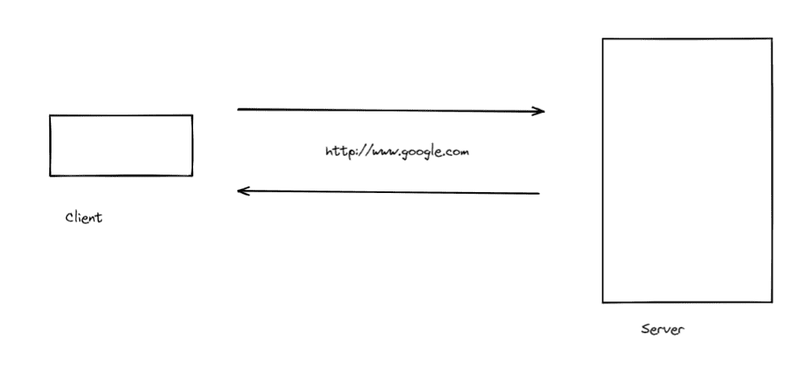
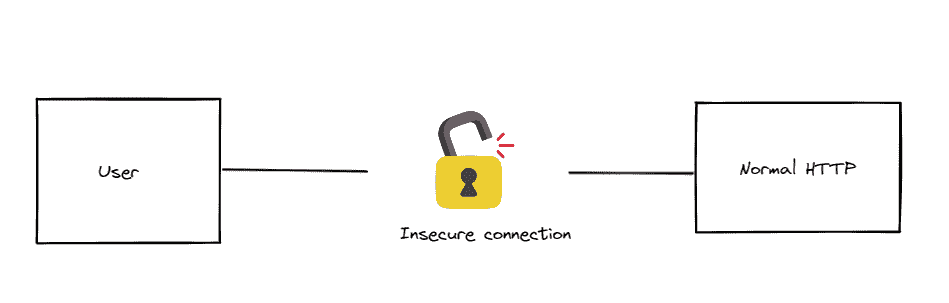
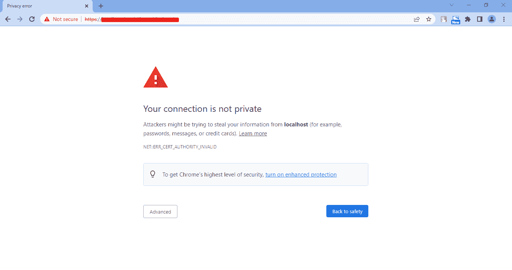
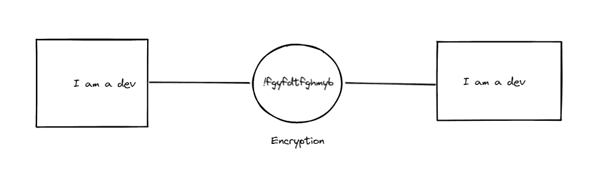
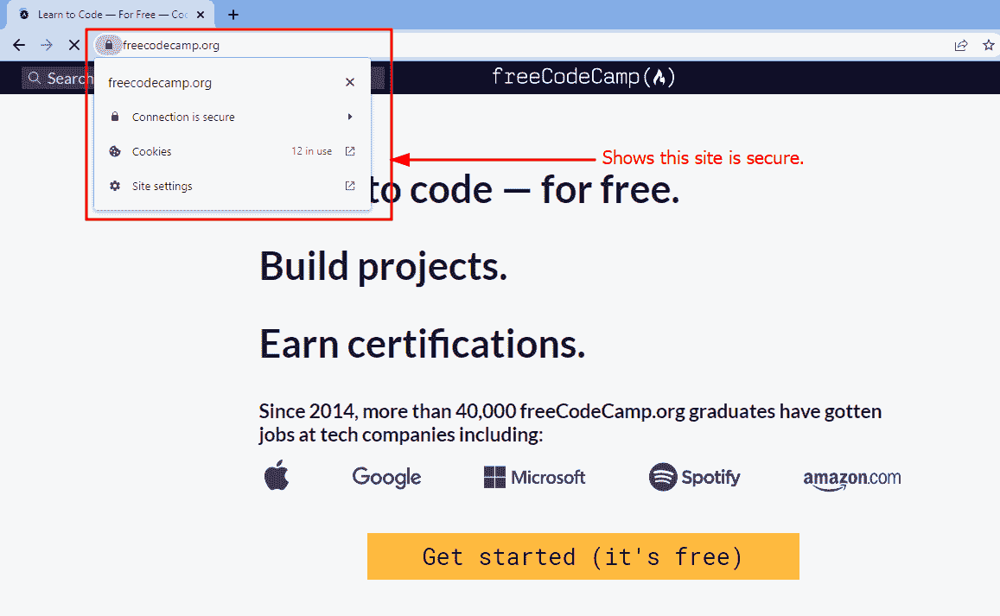
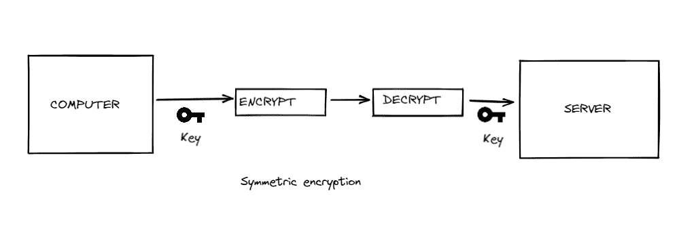

# HTTP 与 HTTPS——有什么区别？

> 原文：<https://www.freecodecamp.org/news/http-vs-https/>

我们在日常生活中与 HTTP 和 HTTPS 进行了大量的交互，但是许多人并不知道它们的区别。

大多数计算机用户只是看到浏览器告诉他们，他们的应用程序不安全，黑客可能想窃取他们的重要信息。这导致用户逃跑的速度超过了乌塞恩博尔特目前的纪录。

但这是可以避免的。这就是 HTTPS 取代 HTTP 的原因。我们今天将讨论这个问题。:)

## 以下是我们将要介绍的内容:

1.  什么是 HTTP？
2.  HTTP 如何工作
3.  HTTP 的功能
4.  如何知道网站是否不安全
5.  HTTP 网站都不安全吗？
6.  什么是 HTTPS？
7.  HTTPS 是如何运作的
8.  HTTPS 的特色
9.  加密的工作原理
10.  如何知道一个站点是否安全
11.  什么是 SSL 证书？
12.  SSL 是如何工作的？
13.  我如何为我的网站获得 SSL？
14.  在哪里可以获得 SSL 证书？
15.  可以免费获得 SSL 证书吗？
16.  HTTPS 和 HTTP 的主要区别
17.  结论

## 什么是 HTTP？

超文本传输协议，简称 HTTP，是您的浏览器和您要访问的站点(web 服务器)之间的一种通信方法。

这允许您在浏览器上从服务器获取所需的信息。

理解 HTTP 和 HTTPS 的一个好方法是使用类比。我们知道浏览器和服务器使用 HTTP 进行通信。HTTP 通常是纯文本的。世界上许多人都说英语。如果懂英语的黑客侵入你的电脑，他们可以轻易看到你输入的任何密码。

在肯尼亚，在我的母语中，我们说图尔卡纳语。如果你不会说这种语言，你来到肯尼亚，发现两个土耳其人在说话，你可能听不懂他们在说什么。

这就是 HTTPS 的魅力所在。它是加密的，因此黑客很可能不理解浏览器和服务器之间的通信。

如果我去 http://www.google.com，我希望看到谷歌的默认页面。

客户端(在大多数情况下是 web 浏览器)发送一条消息，用计算机术语来说就是一个请求。然后服务器会给回一个答案，就是响应。

HTTP 在将 HTML 文档以及图像和视频发送到 web 浏览器供用户查看时非常有用。它还用于以 HTML 形式向服务器发送数据。

 and the web server, which is in constant communication with the server side script and the database.")

## HTTP 如何工作

HTTP 通过纯文本发送数据。例如，如果您要访问您的银行网页，而他们使用的是 HTTP，黑客可能能够访问该网页并读取您发送的任何信息。

这就是 HTTPS 的用武之地。许多公司已经实施了 HTTPS，以允许他们的用户安全地发送数据。我们将在下面进一步讨论这个问题。

## HTTP 的功能

*   纯文本。最初开发 HTTP 时，开发人员只有一个想法:只提供文本文档。现在，HTTP 被用在比它最初打算的更多的方面。

*   第 7 层协议。HTTP 是 OSI 网络模型中的第 7 层协议。第 7 层是应用层。这一层是 OSI 模型的最顶层。其他层包括物理层、数据链路层、网络层、传输层、会话层和表示层。要了解更多关于 OSI 模型的知识，你可以在 freeCodeCamp 的 YouTube 频道上查看 Brian Ferrill 关于互联网如何工作的免费视频。除了 OSI 模型，罐子里还有更多 cookies。[计算机网络课程-网络工程【CompTIA 网络+备考】](https://www.youtube.com/watch?v=qiQR5rTSshw&t=27s&ab_channel=freeCodeCamp.org)

*   没有安全感。当您发送 HTTP 请求时，它们是通过纯文本发送的。此外，当您获得响应时，您通过纯文本获得它。这意味着任何可以访问请求和响应的人都可以阅读它们。
    

*   重量轻。HTTP 的优点是非常轻量级。因此它非常快，因为它不像 HTTPS 那样做加密的事情来保护数据。

*   HTTP 通常监听端口 80。

## 如何知道网站是否不安全

当一个网站不安全时，Chrome 通常会发出一个警告，上面写着`Your connection is not private`。

在 Chrome 上，如果一个网站不安全，地址栏通常会用红色显示`Not Secure`。

## HTTP 网站都不安全吗？

让我们来看一个例子。想象一下，你正在浏览一个迷因网站，当你滚动浏览的时候，嘲笑每一个网站。如果它使用 HTTP，那么你就不用挂机了。没什么大不了的。

你觉得无聊，决定去你的银行网站，在你的浏览器上访问你的账户。如果这个网站没有使用 HTTPS，你可能会把你的账户信息放在银盘子里交给黑客。

所以底线是，如果你在浏览无关紧要的信息，HTTP 是可以的。但是如果您正在处理不安全的信息，HTTP 是不够的。

## 什么是 HTTPS？

超文本传输协议安全，或 HTTPS，是一种可以在您的浏览器和您要访问的网站(web 服务器)之间进行安全通信的方式。

## HTTPS 是如何运作的

HTTPS 通过使用加密数据的安全协议建立安全连接。

对于大多数网站来说，获得 HTTPS 的最佳方式是获得 SSL(安全套接字层)证书或 TLS(传输层安全性)证书。

目前，SSL 已经足够先进，可以支持 TLS。所以不需要考 TLS 证书。

## HTTPS 的特色

*   加密数据。数据加密通过 TLS/SSL 协议进行。
*   它是第 4 层(传输层)协议。
*   公钥和私钥的密钥交换发生在 HTTPS，用于加密和解密数据。
*   相比 HTTP，是不是更重。当加密和解密发生在 HTTPS，它变得更重。
*   HTTP 侦听端口 443。

## 加密的工作原理

假设我输入“我是一个开发者”。当我点击发送时，这个文本被加密，然后在服务器端被解密。

从服务器端来说也是如此。如果我从服务器得到一个响应，它将首先被加密，然后在客户端被解密。

## 如何知道一个站点是否安全

要知道一个网站是安全的，你通常会查看地址栏，在那里你可以看到一把锁。如果有锁，则从客户端到服务器的连接是安全的。

当您单击锁图标时，它会告诉您有关安全连接的更多信息。

## 什么是 SSL 证书？

SSL 证书是一个小文件，它告诉浏览器你的网站——例如 freecodecamp.org——是它所说的那个网站，它是可靠的。

为了进行身份验证，证书能够向客户端(用户)确认他们所连接的服务器是管理该域的服务器。所有这些都是为了保护用户免受安全问题的影响，比如域名欺骗。

它包含一个公钥，并告诉你谁是你试图连接的网站的所有者。如果网站没有 SSL 证书，则不能使用 TLS 进行加密。

如果您是网站所有者，您可以亲自创建自己的 SSL 证书(也称为自签名证书)。这种方法的问题是，像 Chrome 这样的浏览器不信任这些证书。他们更喜欢信任由证书颁发机构颁发的证书。

## SSL 加密是如何工作的？

SSL 加密有两种类型，非对称和对称。非对称和对称的结合是 SSL 加密工作的基础。下面让我们来看看它们，了解更多信息。

### 什么是非对称加密？

在非对称加密中，您有两个密钥。这些是:

1.  公钥。
2.  私钥。

 encryption")

客户端/用户/浏览器将公共密钥提供给与之通信的服务器。然后，在公钥的帮助下进行加密，在服务器私钥的帮助下进行解密。

私钥只能在该特定服务器上找到。别人都没有。这向您展示了为什么非对称加密更强、更难破解，因为它有两个不同的密钥，私钥和公钥。这两个密钥共同确保数据更加安全。

这也告诉你为什么这个加密的大小是 1024/2048 位。

### 什么是对称加密？

在对称加密中，这非常简单。你只有一把钥匙，仅此而已。客户端使用一个密钥进行加密，服务器使用同一个密钥对数据进行解密。

对称加密是非常轻量级的。大小为 128/256 位。但与非对称相比，它更容易侵入。这并不意味着它没有用。当我们使用 SSL 时，我们将不对称和对称结合起来，以便能够使通信更加安全。

### 不对称+对称加密如何工作

非对称和对称的组合现在是双面墙。

第一步，服务器将向浏览器发送非对称公钥。正如我们现在所知道的，非对称密钥既有公钥又有私钥。因此，浏览器将收到公钥。

此后，浏览器生成一个会话密钥。

对称加密对客户端和服务器只使用一个密钥。接下来，浏览器会生成一个本地会话密钥。这是对称加密会话密钥。然后，它将使用第一步中给出的非对称公钥对其进行加密。然后，本地生成的会话密钥将与公钥相结合，并发送给服务器。

然后，服务器将使用私钥解密它收到的加密会话密钥。在这个特定的步骤中，服务器将使用非对称私钥来解密它收到的会话密钥。

现在，一旦解密发生，服务器和浏览器将使用会话密钥进行通信。会话密钥将仅用于该特定会话。

假设你关闭了浏览器，也许第二天就登录了——一切又重新开始。再次创建会话密钥。

## 我如何为我的网站获得 SSL？

如果您是网站所有者，您可以从证书颁发机构获得 SSL 证书。

然后，您需要在托管您网站的 web 服务器上安装证书。大多数时候，你的网站所在的主机公司会为你处理这个过程。

## 在哪里可以获得 SSL 证书？

有些组织颁发安全证书。这些组织被称为认证机构。其中一些认证机构包括:DigiCert、Comodo 和许多其他机构。

许多开发人员从这些组织获得证书。由于他们是最广泛使用的证书颁发者，浏览器通常信任来自这些组织的证书。

## 可以免费获得 SSL 证书吗？

Cloudflare 免费提供 SSL 证书。它是首批这样做的互联网安全公司之一。

如果你想得到一个，你可以[在这里](https://www.cloudflare.com/ssl/)查看。

## HTTPS 是用来做什么的？

HTTPS 在安全方面帮助很大。没有它，传递敏感信息将成为一个巨大的挑战，尤其是如果您的企业需要一种安全的通信方式。

像电子商务网站这样接受在线支付的网站通常需要 HTTPS。这是为了避免诸如信用卡详细信息和登录信息等信息被窃取(来源:[托尼刀子乐队](https://www.entrepreneur.com/article/281633))。

## HTTPS 和 HTTP 的主要区别

*   HTTPS 启用了加密层，而 HTTP 中没有加密层。
*   你的数据在 HTTPS 是受保护的，而在 HTTP 却不是。
*   当你使用 HTTPS 时，你在谷歌的排名会上升，而使用 HTTP 时，你的排名不会上升。
*   当您使用 HTTPS 时，可以防止网络钓鱼，而使用 HTTP 时则不能。
*   当您使用 HTTPS 时，您符合支付行业的法规，而 HTTP 不符合。
*   在最初几秒钟加载 HTTPS 可能比加载 HTTP 慢。
*   获得 SSL 证书可能要花钱，而 HTTP 没有认证成本。
*   在使用 HTTPS 的时候，你成为了谷歌浏览器的好友。谷歌 Chrome 不喜欢 HTTP，因此你会一直收到不安全的网站通知。

## 结论

HTTP 和 HTTPS 在我们作为开发人员的日常生活中非常重要。浏览器和服务器之间的通信是我们工作的动力。

通过尽可能保护用户的数据，使他们的信息不被窃取，您将获得他们的信任，并提供更好的用户体验。

回头见。