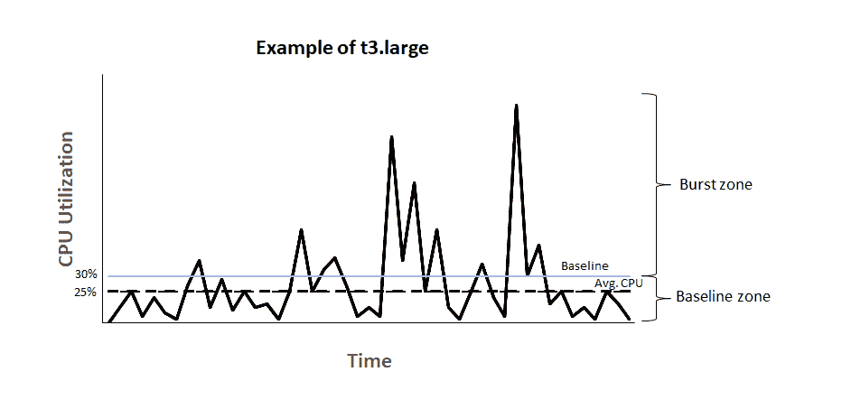
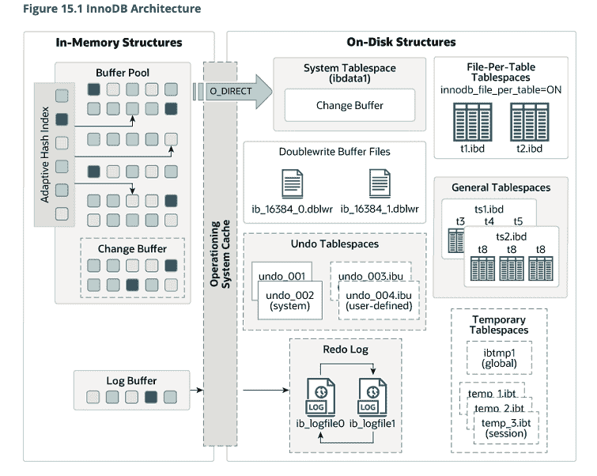

# 如何在不花更多钱的情况下提高 AWS 性能

> 原文：<https://www.freecodecamp.org/news/improve-aws-performance-without-spending-more-money/>

识别性能问题一直是工程界的圣杯。您希望被认为是能够诊断和纠正生产中出现的性能问题的软件工程师。这真的增加了你工程能力的可信度。

我们最近在工作中遇到了一个问题，我觉得写出来会很有趣。我将深入研究我们如何试图找到问题的根本原因(通常是 90%的问题)的细节，然后我们如何修复它。

## 问题开始的地方

问题始于 AWS。这个应用程序已经平稳运行了一段时间，没有出现任何问题。我们决定运行一个负载测试来了解一个特定的 API 端点是否能够处理我们所期望的负载。

我们下载了 JMeter，试着弄清楚怎么用，然后放弃了。一天后，我们回到这里，终于对如何让它运行起来有了一些想法。

我们将它指向运行在 AWS 上的测试服务器，并在一个循环中启动 25 个线程运行 8 次，很快发现大约 25%的请求失败。请求的平均时间约为 45 秒。不打算撒谎——这太可怕了。

这让我们感到害怕，因为这意味着我们的路由效率低得可笑，它只能产生大约每秒 1.2 个请求的吞吐量。但是我们期望它每秒能处理大约 4-8 个请求。

好吧，到底发生了什么？为什么这条路线效率如此之低？

## 抑制 CPU

我们做出的直接假设是将责任归咎于公司内部的 ERP 系统，我们依赖该系统进行验证。当然，它必须是 ERP，因为这意味着我们不必为它承担任何责任，因为它是一个不同的提供商。

嗯，在将 JMeter 指向一台本地机器并运行相同的负载测试之后，我们很容易就达到了我们想要的吞吐量。事实上，我们超出了很多。如果是内部 ERP 系统导致了这个问题，为什么不能在本地机器上重现呢？

我向在 Amazon 工作的人寻求帮助，并被告知 AWS 节流服务器的方向，因为在 EC2 测试实例中，我们的 CPU 负载从未超过 10%。这给我带来了一大堆麻烦。

那么，当您在 AWS 上运行应用程序时，到底发生了什么呢？老实说，我并没有真正理解它的内部结构，现在也不完全理解，但这里是要点。

您从 AWS 购买计算时间。我认为这意味着他们在服务器上运行我们的应用程序，我们为服务器时间付费。但是，这不太准确。

AWS 有 EC2 计算单元(ECU)的概念，这是他们抽象出必须考虑应用程序实际运行在哪些服务器上的方式。如果你能从 ECU 的角度考虑问题，你根本不用担心实际的物理基础设施。

AWS 后来把 ECU 改成了虚拟 CPU (vCPU)，但是你仍然可以在网上找到很多关于 ECU 的参考资料。

因此，vCPU 是他们描述其各种实例的计算能力的方式。我们将 t2.micro EC2 实例用于测试服务器，并将其中两个实例用于生产服务器。我们的应用程序主要是一个读取量很大的 OLTP 工作负载。

由于 AWS 在由虚拟机管理程序分隔的单个服务器上运行多个应用程序，因此它们会根据您选择的实例为您的应用程序分配特定数量的计算带宽、网络带宽和存储。

AWS 如何通过所谓的突发信用来管理 t2 类实例。

## 那么，我是如何在突发信贷上赔钱的呢？



上面的图表准确地解释了 AWS 突发信用如何为 EC2 实例工作。图片来源[本 AWS 文档](https://docs.aws.amazon.com/AWSEC2/latest/UserGuide/burstable-credits-baseline-concepts.html)。

这个想法是，AWS 为您提供一个基准 CPU 利用率，超过这个利用率，您就要为消耗的 CPU 时间付费。

以 EC2 t2.micro 实例为例，基准 CPU 利用率设置为 10%。实例根据其拥有的 vCPU 数量不断获得积分。

获得积分的计算方法是:

`1vCPU * 10% baseline * 60 minutes = 6 credits per hour.`

如果您的使用率为 15%,则消费积分的计算方法是:

`1vCPU * 15% CPU * 60 minutes = 9 credits per hour.`

因此，如果您一直以 15%的速度运行，那么您的实例每小时会损失 9 个积分。一个 t2.micro 实例只能累积总共 144 个积分。一旦这些配额用完，您的 CPU 使用率将被限制在 10%，这是基准利用率。

因此，虽然您在实例上可能没有严格意义上的损失，但是您是在为损失的 CPU 周期付出代价。

另一种确认由于节流而丢失 CPU 周期的方法是登录到 EC2 实例并运行`top`命令来检查窃取时间。如果您尝试对您的服务器进行负载测试，并且您的 CPU 受到抑制，那么您可以实时观察窃取时间的增长，以防止您的进程占用任何额外的 CPU 时间。

## 数据库故障

好的，如果问题是 EC2 实例的限制，那么移除限制应该可以解决问题，对吗？嗯，我们检查了我们的生产实例，注意到它们也出现了故障，尽管它们没有受到限制。

在生产实例中，我们意识到一些请求花费的时间超过了 10 秒，一旦到了下午 2 点就超时了。

为什么下午 2 点的时间是相关的？

因为 AWS 限制了 EC2 服务器上可以使用的 CPU 周期，所以它们也限制了 RDS 实例可以使用的 IOPS 数量。

AWS 将 IOPS 限制在 3 *(分配给 EBS 卷的存储)的比率。当您实例化一个 RDS 实例时，您还需要为它分配一些磁盘存储。通过将这两者相互分离，AWS 可以在不影响任何数据的情况下升级 RDS 实例。

我们的 GP2 存储从 20GB 开始，这为我们提供了 60IOPS。然而，AWS 至少提供 100 IOPS。

但是，每次 RDS 实例超过 100 IOPS 时，您都会消耗特定于 DB 实例的突发信用，这不同于 EC2 实例的 CPU 信用。

用户在每天下午 2 点左右面临减速的原因是因为我们的 IOPS 全天将超过 100，这将消耗突发信用，然后在下午 2 点耗尽，之后我们被限制在 100 IOPS。

这导致了我们的用户面临的所有超时！我们认为解决这个问题最简单、最便宜的方法是增加 EBS 卷的存储容量。我们将其增加到 100GB，这样我们的基线为 300 IOPS。我们认为这就足够了，因为我们一天中的平均 IOPS 有很大的波动，但似乎平均在这个数字左右。

我们升级了我们的 EBS 音量，并等待第二天下午-完全相同的问题再次出现！

当查看我们的平均 IOPS 时，我选择了 1 米的区间，它不能很好地反映平均值，因为它显示了很多峰值。选取 1 小时的时间间隔显示出明显更高的平均值 600 IOPS！

在对 IOPS 问题进行更深入的调查后，我发现读取 IOPS 对总 IOPS 的贡献最大。

最后，我们决定在 AWS 控制台上为我们的 RDS 实例启用性能洞察，这样我们就可以看到哪些查询占用了大部分 IOPS，并修复那个特定的查询。

当我们试图启用性能洞察时，我们发现它不能工作于任何低于`db.t3.medium`的情况，这迫使我们升级到具有 4GB RAM 的 DB 实例。

我们升级了实例，然后重启数据库服务器并等待。我密切关注 IOPS 指标，但它似乎没有超过 0-10 IOPS，我认为这意味着还没有人使用该应用程序。

我检查了一下，被反复告知人们正在使用这个应用程序，而且它运行得非常好，但我就是不明白到底发生了什么。为什么会起作用？它不应该工作，几乎没有任何 IOPS 发生。

## 记住 RAM 的重要性

我没有意识到的一件事是，RAM 如何影响一个数据库发生多少次 IOPS。

AWS 在读取和写入硬盘本身时测量 IOPS。它不把它作为对 MySQL 中 innoDB 引擎维护的缓冲池的读/写来衡量。

问题是我们使用的前一个 DB 实例(`db.t2.micro`)只有 1gb 的 RAM，这意味着缓冲池大小约为 250MB。在具有 4GB 内存的新实例上，这意味着缓冲池有 2GB 内存可供使用。

导致大量 IOPS 的违规查询是查询一个大小约为 210 MB 的表。因为它正在进行表扫描，所以它将几乎整个表加载到缓冲池中，然后运行它必须在其上执行的任何操作。

由于缓冲池只有大约 250 MB，一旦它加载了大表，它就会不断地删除所有其他数据，然后它必须返回到磁盘去获取它们，这导致了更多的 IOPS。



## 令人不快的查询

这个谜还缺少一块。导致每次运行时都有 210MB 数据加载到内存中的查询是什么？当然，我们通过增加内存解决了这个问题，但是这里显然有问题。该表的大小只会增加，不断增加内存并不是一个好的解决办法。

下面是导致所有问题的查询:

```
EXPLAIN ANALYZE
SELECT `oc`.`oc_number` AS `ocNumber` , `roll`.`po_number` AS `poNumber` ,
`item`.`item_code` AS `itemCode` , `roll`.`roll_length` AS `rollLength` ,
`roll`.`roll_utilized` AS `rollUtilized`
FROM `fabric_barcode_rolls` AS `roll`
INNER JOIN `fabric_barcode_oc` AS `oc` ON `oc`.`oc_unique_id` = `roll` . `oc_unique_id`
INNER JOIN `fabric_barcode_items` AS `item` ON `item`.`item_unique_id` = `roll`.`item_unique_id_fk`
WHERE BINARY `roll`.`roll_number` = 'dZkzHJ_je8' 
```

在上面运行`EXPLAIN ANALYZE`时，MySQL 提供了以下查询计划:

```
-> Nested loop inner join  (cost=468792.05 rows=582836) (actual time=0.092..288.104 rows=1 loops=1)
    -> Nested loop inner join  (cost=264799.45 rows=582836) (actual time=0.067..288.079 rows=1 loops=1)
        -> Filter: (cast(roll.roll_number as char charset binary) = 'dZkzHJ_je8')  (cost=60806.85 rows=582836) (actual time=0.053..288.064 rows=1 loops=1)
            -> Table scan on roll  (cost=60806.85 rows=582836) (actual time=0.048..230.675 rows=600367 loops=1)
        -> Single-row index lookup on oc using PRIMARY (oc_unique_id=roll.oc_unique_id)  (cost=0.25 rows=1) (actual time=0.014..0.014 rows=1 loops=1)
    -> Single-row index lookup on item using PRIMARY (item_unique_id=roll.item_unique_id_fk)  (cost=0.25 rows=1) (actual time=0.024..0.024 rows=1 loops=1) 
```

查看查询计划，奇怪的是每次查询运行时都要对`roll`表进行全表扫描。它每次查看 582，000 行，这就是性能问题的来源。

这似乎是一个索引不良的问题。因此，我仔细查看了表格，查看了每张表格的索引，确保它们准确无误。在运行查询的其余部分之前，我尝试重写查询以过滤`roll`表，结果性能甚至更差。

最后，我心血来潮地删除了查询中的`BINARY`函数调用，我放入这个函数是为了确保区分大小写不会成为问题。最终的查询执行计划令人震惊:

```
-> Rows fetched before execution  (cost=0.00 rows=1) (actual time=0.000..0.000 rows=1 loops=1) 
```

那一个函数调用浪费了大量的执行时间。那么，为什么一个函数调用会导致所有这些问题呢？

我想了想，做了每个自尊的软件工程师在面对他们无法解决的问题时都会做的事情。我把问题贴在栈溢出上了。

这里是问题的链接。答案是它与列排序规则有关。

由于我将`roll`表中的`roll_number`列中的每个值都转换为二进制值，除非在 DDL 中的列上定义了特定的排序规则，否则 MySQL 不能使用索引。

因为索引是无用的，所以它进行全表扫描，并通过嵌套的内部连接检查每一行的值。

移除`BINARY`函数调用是解决这个问题最简单的方法。但是将列排序规则更改为使用拉丁字符集并区分大小写，这样索引就可以区分大小写，从而确保我们不会遇到条形码冲突的问题。

## AWS 面临的挑战

毫无疑问，AWS 在从数百万软件工程师中抽象出硬件方面做得非常出色。但它同时也让定价变得如此难以理解，以至于没有人真正知道他们要付多少钱，直到为时已晚。

我们不能将 EBS 卷从 100GB 降级回 20GB，因为 AWS 不允许这样做。我们不需要额外的存储空间，拥有它也没有任何意义，但我们不得不使用它。

我们也不能从`db.t3.medium`降级到`db.t3.micro`，因为我们无法获得性能洞察。当然，我们可以重新创建性能洞察，因为它本质上是建立在性能模式之上的，而性能模式是 MySQL 的一个固有特性，但它耗费了太多的工程时间，对我们的最终客户没有任何价值。

## 最后

我喜欢 AWS，我喜欢它让数百万开发者能够轻松访问硬件。但是，我不禁对围绕 AWS 的糟糕文档以及搬起石头砸自己的脚是多么容易感到沮丧，除非你愿意不断地掏钱。

我知道了解硬件是如何被使用的是软件工程师必须要做的。但是，当您需要花费大量时间来理解 AWS 抽象，而这应该消除对底层硬件的担忧时，这感觉就像是双重打击。

AWS 有一个 Aurora DB，它看起来像一个托管数据库，可以防止这类问题的发生。但是有时候运行你自己的硬件更容易，就像氧化物计算机鼓励人们做的那样。

*注意:你可以在我的博客[这里](https://redixhumayun.github.io/performance/2022/05/27/diagnosing-performance-issues.html)找到这篇文章和其他文章。*