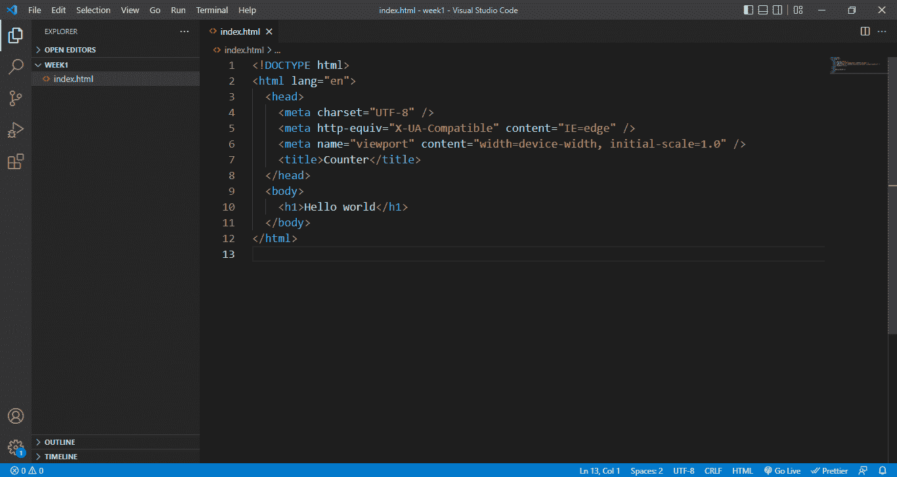
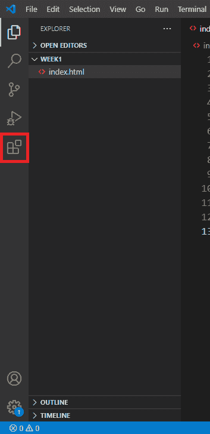
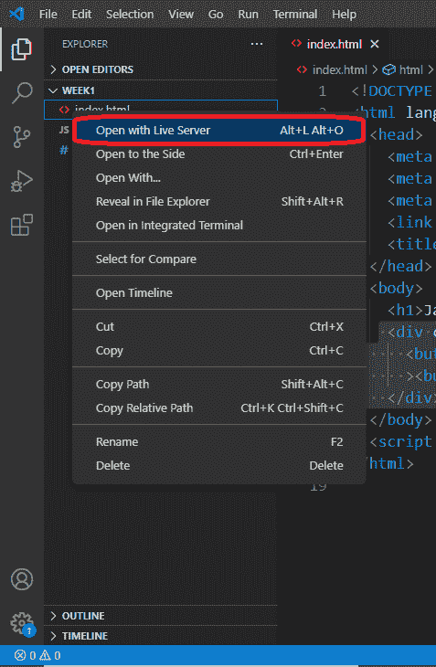
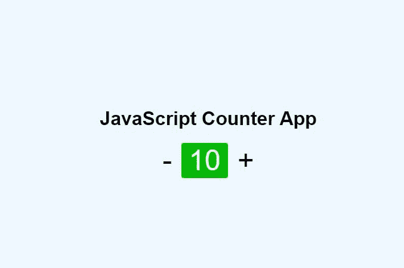

# 通过构建计数器应用程序学习 JavaScript 基础知识

> 原文：<https://www.freecodecamp.org/news/learn-javascript-by-building-a-project/>

JavaScript 允许你制作动态网站。这是 HTML 和 CSS 三位一体的 web 开发的最后一部分，您可以用它来使静态页面变得动态。

一旦你掌握了 HTML 和 CSS 的基础知识，你就有可能开始学习 JavaScript。然后，一段时间后，你可能会落入以下类别之一:

*   你已经学会了所有花哨的 JavaScript 语法，但你无法理解它。
*   您理解语法，但无法将其应用到您的个人项目中。
*   你想辞职或者正在考虑转行。

在本文和后面的文章中，我们将采用实用的方法来学习 JavaScript。我保证不会让你对语法感到厌烦，而是让我们通过构建项目来学习。

我将假设您了解这篇文章以及后续文章中 HTML 和 CSS 的基础知识。但是如果你没有，你可以在继续本教程之前，通过这个[初学者友好的课程](https://www.freecodecamp.org/news/learn-html-beginners-course/)来学习或温习你的知识。

## 学习 JavaScript 需要哪些工具？

JavaScript 不需要复杂或昂贵的设置。您真正需要的是一台具备以下功能的计算机:

*   文本编辑器(类似于 Visual Studio 代码)
*   现代网络浏览器(如 Chrome、Edge、Firefox 等)

如果你没有电脑，你仍然可以通过使用在线代码编辑器如 [codepen.io](https://codepen.io/) 来跟随课程。

## 如何开始使用 JavaScript

如上所述，您只需要一个文本编辑器和一个浏览器就可以开始了。在您希望放置代码文件的目录中启动您的文本编辑器——在我的例子中是 VSCode。

创建一个名为`index.html`的新文件。如果您使用 VS 代码，您的项目设置应该如下所示:



### 如何在浏览器中预览代码

一旦您完成了 HTML 文件的创建，您将希望在浏览器中查看完成的产品。

为了使这个过程更容易，我们需要在 VS 代码上安装“live server”扩展。这个扩展将导致网页在我们每次修改 HTML 文件时立即刷新。

单击 VSCode 右侧的扩展图标。



查找并安装 live server 扩展。返回到您的 HTML 文件，并从上下文菜单中选择“用 live server 打开”。



您的网页现在应该可以在浏览器中看到了。

### 如何将 JavaScript 嵌入你的 HTML 页面

通过将 JavaScript 代码直接放在 Script 标签中，可以将它包含在 HTML 中。

```
<!DOCTYPE html>
<html lang="en">
  <head>
    ...
    <script>
      let my_variable = "hello JavaScript";

      // any JavaScript can go in here
    </script>
  </head>
  <body>
    <h1>Hello world</h1>

  </body>
</html> 
```

但是请记住，不建议使用上述方法。相反，您应该生成一个扩展名为`.js`的外部 JavaScript 文件。

在项目目录中创建一个名为`script.js`的新文件，然后使用外部 JavaScript 代码的 URL 将它链接到 HTML 文件，如下所示:

```
<!DOCTYPE html>
<html lang="en">
  <head>
   ...
    <script src="script.js"></script>
    <title>Counter</title>
  </head>
  <body>
    ...
  </body>
</html> 
```

JavaScript 将在任何 HTML 之前执行。这通常会导致问题，因为浏览器从上到下读取 HTML 代码，所以用 JavaScript 选择的 HTML 元素将是未定义的。

我们将使用 script 元素的`defer`属性来纠正这一点，它指示浏览器在运行 JavaScript 代码之前首先加载 HTML。

```
<script defer src="script.js"></script> 
```

现在我们都准备好了，让我们深入一些 JavaScript 基础知识。

### 如何在 JavaScript 中使用变量

变量是将来可能需要使用的值的占位符。使用 JavaScript，一切都存储在变量中。

要声明一个变量，你可以使用`let`或者`const`关键字。

```
let first_variable
const last_variable` 
```

使用等号给变量赋值。

```
let first_variable = “hello world”
```

如果你用 let 声明一个变量，你可以修改它。另一方面，如果你用`const`声明变量，你不能改变它们的值——因此得名。

在 JavaScript 中，可以在变量中存储多种数据类型:

*   字符串–任何用引号括起来的单精度或双精度值都是字符串。

```
let my_string = "Hello world" // string
let my_second_string = "24" // string 
```

*   数字–这些数字没有用引号括起来。

```
let my_number = 15 // number
let my_second_number = "15" // string 
```

*   数组–如果你想在一个变量中存储几个值，数组是你的最佳选择。

```
let my_array = [1, "hello", "4", "world"] 
```

*   boolean–不需要用引号将布尔值括起来，因为它是 true 或 false 值，而不是字符串。

```
let my_boolean = true; 
```

*   对象–对象允许您以键值对的形式存储数据。

```
let my_obj = {
    name: "John snow",
    aim: "Learning JavaScript",
    age: 20,
} 
```

由于 JavaScript 将一切都解释为对象，所以您甚至可以将对 HTML 元素的引用保存在变量中。

```
let my_button = document.querySelector("#id") 
```

当我们使用`document.querySelector("#id")`时，我们根据 id 选择网页上的元素。不要担心，我们稍后将对此进行更详细的讨论。

要在 JavaScript 中使用变量，只需像这样调用变量名:

```
my_button 
```

为了演示 JavaScript 中变量的工作方式，让我们构建一个基本的计数器应用程序。将以下代码添加到您之前创建的 HTML 文件中:

```
...
<body>
    <div class="counter_conatiner">
      <button id="subtract">-</button><span id="output">0</span
      ><button id="add">+</button>
    </div>
  </body>
... 
```

创建一个`style.css`文件，添加以下样式，使用 CSS 赋予它一些生命力:

```
*,
*::after,
*::before {
  padding: 0px;
  margin: 0px;
  font-family: inherit;
}
html,
body {
  height: 100vh;
}

body {
  font-family: sans-serif;
  font-size: 16px;
  display: flex;
  flex-direction: column;
  align-items: center;
  justify-content: center;
  background-color: aliceblue;
}
.counter_conatiner {
  display: flex;
  align-items: center;
  justify-content: center;
  padding: 6px;
  margin-top: 1rem;
}
span {
  font-size: 3rem;
  background-color: #00bb00;
  padding: 2px 12px;
  margin-left: 16px;
  margin-right: 16px;
  border-radius: 4px;
  color: #fff;
}
button {
  font-size: 3rem;
  cursor: pointer;
  background-color: transparent;
  border: 0px;
} 
```

不要忘记将 CSS 文件链接到 HTML，如下所示:

```
<head>
   ...
    <link rel="stylesheet" href="style.css" />
    <title>Counter</title>
  </head>
```

这就是你要的——一个用 HTML 和 CSS 构建的基本计数器应用程序。



请记住，变量可以包含对 HTML 元素的引用。现在让我们将对按钮的引用保存在变量中。打开我们之前创建的 script.js 文件，并将以下代码添加到其中:

```
let add = document.querySelector("#add");
let subract = document.querySelector("#subtract");

console.log(add, subract); 
```

等等，变量很有趣，对吧？尽管它们可以包含任何内容，但在使用变量之前，您应该了解一些基本原则:

*   避免在变量名的开头使用下划线，比如`_my_variable`，因为它们很容易混淆。
*   JavaScript 不会让你以数字开始变量名，比如`8_variable`。
*   由于区分大小写，`my_variable`、`MY_VARIABLE`和`my_Variable`在 JavaScript 中是完全不同的东西。
*   并且在任何情况下都不应该使用任何 [JavaScript 保留字](https://developer.mozilla.org/en-US/docs/Web/JavaScript/Reference/Lexical_grammar#reserved_words)，包括 let、const、true、false、function 以及任何其他。

嘿，不要违反这些基本准则。因此，让我们来看看使用 JavaScript 可以做的其他一些有趣的事情。

### 如何在 JavaScript 中使用运算符

没有数学，世界会变成什么样？如果没有数学，JavaScript 会是什么呢？

在 JavaScript 中，我们有一组数学符号，你可以用它们来进行简单的数学运算。

不要担心，您可能已经熟悉了其中的大部分:

*   加法–在 JavaScript 中，您可以使用加号(+)来连接(联接)字符串或添加数字。

```
let addition = 1 + 1 // 2
let addition = 1 + "1" // "11"
let addition = "hello" + "world" // "hello world" 
```

*   减法–使用减号(-)来减去数字。

```
let subtraction = 10 - 9 // 1 
```

*   乘法——在 JavaScript 中，当数字相乘时，用星号表示乘法。

```
let multiplication = 2 * 2 // 4 
```

*   除法–使用除法符号(/)来划分数字。

```
let division = 4 / 2 // 2 
```

*   equality–在 JavaScript 中使用双等号(==)来检查两个值是否相等。

```
let if_true = 2 + 4 == 6 // true
let if_false = 5 + 6 == 10 // false 
```

还有其他可用的 JavaScript 操作符，但我不会在这里详细讨论它们。

现在我们已经熟悉了操作符，让我们返回到我们的计数器应用程序，并对它进行修改，这样每当我们单击页面上的“+”按钮时，它就会增加。

在前一节中，我们声明了一些变量，并将对 HTML 按钮的引用保存为值。

```
let add = document.querySelector("#add");
let subract = document.querySelector("#subtract");

... 
```

现在，使用我们的`add`变量所要做的就是调用它的名字。

```
add
```

但这还不够。我们需要知道它是否被点击过，JavaScript 为我们提供了我们所说的事件。我们用它们来监听网页上发生的事件，比如当用户点击按钮或向下滚动页面时，等等。

这看起来是这样的:

```
add.addEventListener("click", function () {
 // Every time the add button is pressed, this code will execute.
});
```

没有必要让这一点马上变得有意义。在这种情况下，我们使用`addEventListener`向按钮添加一个点击事件。我们将在另一部分专门讨论事件。

现在，当单击按钮时，侦听器回调中的任何代码都会被调用。

现在我们意识到了这一点，让我们增加产值。要做到这一点，只需获得输出值，然后每当按下按钮时就增加 1。下面是实现这一点的代码:

```
let add = document.querySelector("#add");

add.addEventListener("click", function () {
  let output = document.querySelector("#output");
  let result = output.innerText + 1;

  output.innerText = result;
});
```

除了在 JavaScript 中用于从网页上的 HTML 元素中获取文本并且还可以修改 HTML 元素的文本的`innerText`之外，上面的大部分语法现在应该是可以识别的。

在下面的示例中，点按添加按钮(+)以查看计数器增量。

[https://codepen.io/Spruce_khalifa/embed/preview/JjLmoMa?default-tabs=css%2Cresult&height=300&host=https%3A%2F%2Fcodepen.io&slug-hash=JjLmoMa](https://codepen.io/Spruce_khalifa/embed/preview/JjLmoMa?default-tabs=css%2Cresult&height=300&host=https%3A%2F%2Fcodepen.io&slug-hash=JjLmoMa)

不是你预期的那样，是吗？因为`let output = document.querySelector("#output")`的值是一个字符串，而 JavaScript 不允许将字符串和数字相加，所以在相加之前必须将输出转换为数字。

```
let result = Number(output.innerText) + 1;
```

在上面的代码中，我们使用`Number()`方法将字符串转换为数字。

在我们做出更改后，让我们再次尝试前面的示例。

[https://codepen.io/Spruce_khalifa/embed/preview/gOeBbeO?default-tabs=css%2Cresult&height=300&host=https%3A%2F%2Fcodepen.io&slug-hash=gOeBbeO](https://codepen.io/Spruce_khalifa/embed/preview/gOeBbeO?default-tabs=css%2Cresult&height=300&host=https%3A%2F%2Fcodepen.io&slug-hash=gOeBbeO)

现在它可以按计划工作了。

### 如何在 JavaScript 中使用条件句

如果...？条件句用于解决这样的问题，“如果我们想让我们的计数器应用程序在 10 点停止计数呢？”或者“如果我们想跳过一个数字呢？”当你面对这样的条件问题时，你需要一个条件句。

我们今天在 JavaScript 中唯一要看的条件是 if...else 语句。

```
if (condition) {
  /* code to run if condition is true */
} else {
  /* run some other code instead */
} 
```

条件允许我们仅在满足给定条件时运行代码。例如，如果我们的计数器大于 10，我们可以将其重置为零(0)。

```
let add = document.querySelector("#add");

add.addEventListener("click", function () {
  let output = document.querySelector("#output");
  let result = output.innerText + 1;

  if (result > 10) {
    result = 0;
  }

  output.innerText = result;
}); 
```

如果结果大于 10，前面代码中的 If 语句将结果返回 0。在下面的示例中，尝试将计数器增加到大于 10 的数字。

[https://codepen.io/Spruce_khalifa/embed/preview/GRxYgYg?default-tabs=css%2Cresult&height=300&host=https%3A%2F%2Fcodepen.io&slug-hash=GRxYgYg](https://codepen.io/Spruce_khalifa/embed/preview/GRxYgYg?default-tabs=css%2Cresult&height=300&host=https%3A%2F%2Fcodepen.io&slug-hash=GRxYgYg)

您会发现我们省略了 else 语句。那是因为它是可选的。

### 如何在 JavaScript 中使用函数

我们终于完成了我们的小型计数器应用程序。让我们加上减法的能力。我们要做的就是从输出中减去 1。

```
let add = document.querySelector("#add");
let subract = document.querySelector("#subtract");

add.addEventListener("click", function () {
  let output = document.querySelector("#output");
  let result = Number(output.innerText) + 1;

  if (result > 10) {
    result = 0;
  }

  output.innerText = result;
});

subract.addEventListener("click", function () {
  let output = document.querySelector("#output");
  let result = Number(output.innerText) - 1;

  if (result < 0) {
    result = 0;
  }

  output.innerText = result;
}); 
```

这是一个基本的 JavaScript 计数器应用程序。

[https://codepen.io/Spruce_khalifa/embed/preview/Barqyvz?default-tabs=css%2Cresult&height=300&host=https%3A%2F%2Fcodepen.io&slug-hash=Barqyvz](https://codepen.io/Spruce_khalifa/embed/preview/Barqyvz?default-tabs=css%2Cresult&height=300&host=https%3A%2F%2Fcodepen.io&slug-hash=Barqyvz)

看看上面那支笔的完整代码，描述一下你观察到的情况。

嗯，我注意到了很多重复的代码，这并不好。你应该避免代码中的重复。

因此，我们使用函数。我们可以写一段代码，然后在函数中多次使用它。

您可以在 JavaScript 中使用 function 关键字来创建函数。

```
function add() {
  alert("hello world")
} 
```

函数也可以带参数。

```
function add(number1, number2) {
 return number1 + number2
}
```

这些参数的使用方式与变量在函数中的使用方式相同。它们本质上是占位符。

函数和变量一样，都是用名字来称呼的。唯一的区别是，在调用函数时，必须包含括号–()。

```
add(2,4) // 6
```

您可能也见过以这种方式声明的函数:

```
const add = (number1, number2) => number1 + number2;
```

以上相当于形式上的`add()`函数。它们被称为箭头函数，这就是我们从现在开始声明函数的方式。

我相信这是足够的介绍信息，所以我把这个任务留给你。

### JavaScript 每周挑战

在本课中，我们创建了一个简单的计数应用程序，但它包含大量重复代码，因此这是一个挑战:

*   创建一个名为`addAndSubtract()`的函数，它可以处理加法和减法运算，而无需重复任何代码。

## 结论

在这篇文章中，我们学习了如何使用 JavaScript，开发了一个小的计数器应用程序，并了解了变量、条件和函数。

如果您有任何问题，请随时在 Twitter 上联系我，电话: [@sprucekhalifa](https://twitter.com/sprucekhalifa) 。

还有，编码快乐！