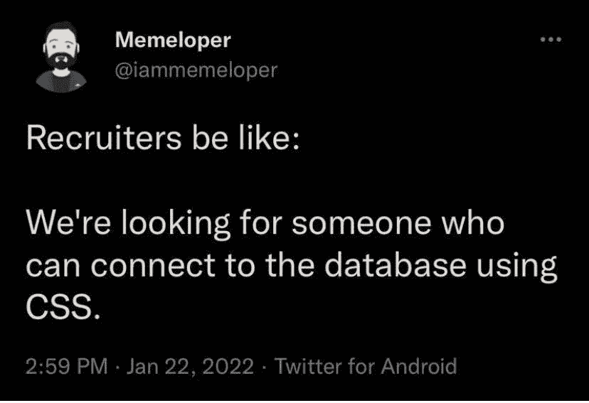
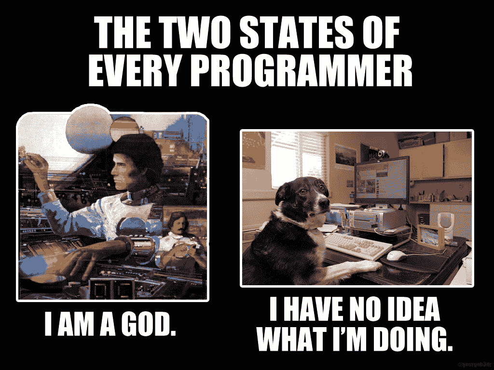

# 我作为专业开发人员的第一年——进入科技行业的小贴士

> 原文：<https://www.freecodecamp.org/news/my-first-year-as-a-professional-developer-tips-for-getting-into-tech/>

大家好！在这篇文章中，我将分享我作为软件开发人员第一年职业经历的想法。

我进入编码界已经快两年了，成为全职 dev 也有一年了。

我开始写这篇文章仅仅是作为一种自我反省练习。但是我想，也许和我处境相似或者现在刚开始写代码的人会觉得我的一些经历有用或者有趣。

我打算在这里谈论很多事情。我将回顾一切，从我的背景和我如何在将近 30 岁时转行，到我如何学习编码和选择我的技术堆栈。

我还将讨论我未来的学习计划和原因，以及一些一般性的建议和我对第一年专业工作的总体感受和想法。

我的结构是，首先我要告诉你我是如何成为一名开发人员的。然后我会列出帮助我达到现在这个位置的主要思想和概念。

这篇文章将与我通常写的文章有所不同，因为它不会太专业，在某些地方可能会太自我。但我的想法是带你经历我的经历和思考过程，这样你就能知道如果你走同样的路，事情会怎样。

尽管永远记住我的观点和经历不一定延伸到其他所有人。而且我也不宣称我的选择和偏好一定是最好的。所以你知道...如果你通读一遍，只拿对你有用的，忽略其余的。:)

够了，我们走！

## 目录

*   [我的背景](#my-background)
*   [我是如何学会编码的](#how-i-learned-to-code)
*   [我作为开发人员的第一份工作](#my-first-job-as-a-developer)
*   [现在时和将来时](#present-tense-and-future)
*   [提示和想法](#tips-and-thoughts)
    *   [学会如何学习](#learn-how-to-learn)
    *   [试着找到一条路径](#try-to-find-a-path)
    *   从事技术工作需要大学文凭吗？
    *   你想成为什么样的开发人员？
    *   [如何挑选科技筹码](#how-to-pick-a-tech-stack)
    *   不要跳得太多
    *   [不要太舒服或超越自己](#don-t-be-too-comfortable-or-get-ahead-of-yourself)
    *   [如何知道自己何时准备好工作](#how-to-know-when-you-re-job-ready)
    *   [有时候不编码是了解代码的最好方法](#sometimes-not-coding-is-the-best-way-to-learn-about-code)
    *   使你的学习来源多样化
    *   请记住，没有人知道所有的事情
    *   也有好的和坏的事情
*   [结束](#wrapping-up)

# 我的背景

我今年 29 岁，来自阿根廷的布宜诺斯艾利斯。

我在这里长大，当我高中毕业时，我不知道我该做什么。我知道我必须上大学，因为其他人都是这么做的。根据“常识”，这将给我人生中最好的机会。所以我开始调查不同的职业道路...

我在高中时是一个害羞内向的青少年，所以在我人生的新篇章中，我决定改变这一点，更多地接触人们和社会。

我被哲学、心理学和历史等社会科学研究吸引住了。但令我担心的是，这些职业在劳动力市场上并不是很受欢迎。所以我最终选择了人力资源专业，因为我认为这是社会科学和商业之间的一个很好的匹配。

这个决定完全是我自己做的，因为我是我们家第一代大学生的一员。我真的不知道有谁能在这种情况下给我指点迷津。我只是根据我掌握的信息做了最好的猜测。

几年后，我开始非常后悔我的选择。我对我所学的东西一点也不感兴趣。大学僵化的结构和官僚主义让我厌烦得要死，我觉得听那些我不尊重的人给我做毫无意义的讲座是在浪费我的青春。

我开始再次分析我还能走什么样的职业道路，但似乎没有什么能让我信服。我甚至咨询了一群职业定向专家，他们向我收取了一大笔钱，因为他们告诉我，我将来会成为一名出色的人力资源经理，我应该“继续努力”。

再加上我已经花了两年时间在大学这件事上，这让我相信“继续走下去”。

又过了几年，我还是有同样的感觉，但至少我快毕业了，我也在工作。所以我还是无聊死了，但至少我从中赚钱了。

我终于毕业了，带着几乎什么都没学到的感觉离开了大学，只是很高兴我终于可以有更多的自由时间了。

关于工作，我开始攀登公司的阶梯。偶尔换工作，多挣一点钱，为知名大公司工作。

在这一点上，我不知何故地确信我喜欢这种生活，尽管我从来不喜欢我的工作或在办公室的环境，这是交易的一部分。

2017 年，我在一家非常大的工业公司工作，并获得了一个离开布宜诺斯艾利斯近一千英里的机会，交换条件是加薪和未来职业发展的承诺。我想了想，接受了，因为此时此刻，这似乎是一个错过的大好机会。

这个新职位的工作环境很糟糕。我不得不处理糟糕的任务、糟糕的领导和糟糕的人。我什么也没学到，未来职业发展的承诺最终都成了废话。

几年来，事情一直朝着同一个方向发展，当疫情到来时，我比以往更加努力地工作，经常在晚上和周末加班，但不知何故，我的领导对我的努力不满意。

我感到困顿和痛苦。为了发展我的事业，我离开了我在布宜诺斯艾利斯的家人，尽管我尽了最大努力工作，但我没有获得任何利润，而且我比以往任何时候都更不喜欢我的工作。

此时我终于睁开眼睛，意识到我不能再呆在那里了。我不知道下一步该做什么，但我清楚地知道我必须离开那里。

然后在某处看到一个关于编程课程的广告，开始调查编码。我一直对技术感兴趣，此时此刻，让新事物占据我的头脑是正确的。

我没有把它当作一种获得新工作的方式，而是当作一种爱好，一种让我的大脑思考其他事情的方式。

# 我是如何学会编码的

因此，在看到这个补充并对编码产生兴趣后，我做了大多数人在寻找信息时会做的事情:我谷歌了一些东西，打开了大量的浏览器标签，观看了一百万个 YouTube 视频。

我记得当时我常常一点也看不懂那些视频。使用了如此多奇怪的术语，人们把这些术语和我不知道的其他话题联系起来。

我真的不知道电脑是如何工作的，更不知道互联网是如何工作的。我不知道什么是编程语言，为什么有这么多编程语言，前端和后端有什么区别，什么是函数，什么是变量，SQL 到底是什么...这么多概念，而且都是全新的。

我只是不知道从哪里开始。学习编码感觉就像盯着《权力的游戏》的墙一样。

I was feeling like the recruiter here...

这里是我回到 freeCodeCamp 的地方(几年前我学过一些基本的 HTML 和 CSS 课程)，还下载了一个名为 [Mimo](https://getmimo.com/) 的应用程序(它帮助你学习用 [Duolingo](https://duolingo.com/) 的方式编码)。

这些结构化的课程帮助我组织我的学习，并在进入更复杂的主题之前掌握事物的基础。我每天花几个小时研究这两个资源，几个月后，我能够构建一个非常非常简单的 HTML 和 CSS 页面。

从那以后，我觉得我需要与和我有相同学习经历的人交流。我希望与他人分享知识，听取他人的经验，并检查我所做的和所学的与其他人所做的相比是否有意义。

我做到这一点的方法是报名参加一些在线训练营课程。我喜欢和一位教授以及一群学生一起上课。这意味着我有机会问问题，也能听到别人的问题，并和别人比较。

四个月过去了，那时我已经完全投入到编码中了。我对 HTML 和 CSS 已经驾轻就熟，还学习了 JavaScript 的基本编程概念。我把我所有的空闲时间都投入到了这件事上，尽管很慢，但我觉得我每天都在进步。

幸运的是，这时候我可以换工作(仍然在人力资源领域)并回到布宜诺斯艾利斯。我在一个好得多的环境中工作，我对我的工作和团队很满意。但我仍然每天坚持编码和学习。我只是非常喜欢它，觉得有一天我会做得很好。

又过了几个月，我完成了更多的训练营课程，对 React 也很熟悉。我能够自己构建一些更有趣和“复杂”的项目，随着时间的推移，我越来越好奇以此为生是什么感觉。

我可以想象自己是一名开发人员，在怀疑了很多之后，我决定试一试，并开始申请工作。

我被拒绝了很多次，在为数不多的面试机会中挣扎了很久(你可以在我写的关于技术面试技巧的文章中读到更多)。

其中一些面试对我来说就像是一次现实检查，从某种意义上说，它们让我意识到仍然有大量的事情我一无所知，如果我有机会成为一名开发人员，我需要不断提高。

这些经历有点伤害了我的自尊，让我怀疑自己是否能做到这一点。我在将近一年的时间里第一次放弃了几个星期的编码工作，但最终还是回去了。我只是很喜欢它，觉得我必须证明那些拒绝我的人是错的。

这时，我开始扩展我用来学习的资源。直播课对我来说不再那么有趣了，因为我觉得我不需要像刚开始时那样不断地从别人那里得到反馈。

现在，我已经有了大量的知识、术语和概念，至少表面上是这样，我可以很容易地利用异步资源，比如视频、文章和文档。

更重要的是，我知道我需要走哪条路，才能学到我想要的工作需要学的东西。

所以我减少了我参加的现场课程的数量，并开始更多地学习视频、文章和我找到的可靠来源的文档。

此外，我开始写下我正在学习的每一件事情，这对我产生了巨大的影响，因为它帮助我内化知识，深入了解我所学的每一个主题，并以一种我从未体验过的方式获得信心。

与此同时，我仍在经历不同的面试过程，在这些情况下感觉更好、更自信。在其中一个过程中，我最终被录用了。🙃

经过一年的学习，我绞尽脑汁，把我所有的空闲时间都用来写代码，我终于达到了我的目标。

我记得当我得到这个消息时，我感到前所未有的快乐。感觉就像结束了一场马拉松。我从来没有在一件事情上投入了这么多持续的努力，从对技术一无所知到能够称自己为“程序员”的感觉是惊人的。

这真是一个伟大的时刻，但说实话，我也害怕到骨子里...当我照镜子的时候，我没有看到一个程序员。我看到了一个还不太懂的家伙。现在我打算转行，把我的财务(和情感)稳定性置于风险之中。废话...😳

# 我作为开发人员的第一份工作

幸运的是，我开始第一份开发工作时的所有恐惧都是没有根据的。我进入了一家很棒的公司，在一个很棒的团队里和一个很棒的领导一起工作。

有大量的新东西要学，有时我一点也不明白。但我的团队明确告诉我，这是应该有的感觉，我应该有耐心，坚持学习的过程。

我做到了，而且是一步一步来的。在我的领导和队友的帮助下，我能够在几个月内变得相当熟练。

我的团队有很好的文化，我们的领导鼓励我们一直分享知识。如果有人发现了一个 bug，创建了一个新特性，或者写了一些文档，这些都必须与团队的其他成员共享。

当有人犯错时也是如此。错误没有被视为指责某人的机会，而是每个人学习的机会。

我们每周开会，互相分享这类信息。通过这种持续的交流，我在脑海中产生了巨大的“点击”。我明白了**没有人知道一切**。

在我得到这份工作之前，我最大的恐惧之一就是我没有做好充分的准备。有许多事情我一无所知，我觉得我“应该”知道它们。但是在了解了有 5 年、8 年或更多年经验的开发人员之后，我明白即使有那么多的学习和准备，他们仍然不知道所有的事情。没关系，因为没人能做到。

人类创造的技术世界的规模和它的不断发展使得一个人不可能理解和知道每一个细节。

我认为真正重要的是深入理解您在环境中使用的给定工具集，并对您工作的一般系统有一个肤浅的理解。

但即使那样，你也永远不会明白所有的事情。一直学习新东西并弄清楚是这份工作的核心部分。事实上，大多数公司付钱给工程师是为了把事情搞清楚。你只是面对你一开始不知道如何解决的问题，然后慢慢地解决它们，直到你找到解决方法。

这个想法对我来说非常有力量，让我克服了自己的冒名顶替综合症。

总的来说，我对我的新工作感觉棒极了。我一直都在远程工作(我喜欢远程工作，这让我有更多的时间陪伴家人和宠物)。我和我觉得有关系的人一起工作，因为每个人都对分享知识和不断学习感兴趣。我觉得我的工作既刺激又有趣。

我每天都在使用我的大脑，为了解决问题而不得不思考，这让我感到活着和有用，而不是我在过去工作中的僵尸般的感觉。

我过去(现在仍然)的感觉是，我的工作和我的爱好是一回事。我不再为周末而活了([顺便说一句很棒的歌](https://www.youtube.com/watch?v=fGardUiWjR4))。我喜欢我的工作，我仍然将大部分空闲时间用于学习和做与代码相关的事情，因为我喜欢它。

# 现在时态和将来时态

在我的第一份开发工作做了 9 个月后，我又有了换工作的机会。离开这样一个伟大的团队和领导者很难，但在我目前的职位上，我能够在一个大而有趣的项目上与酷的技术一起工作。此外，更换公司和项目让我更好地理解了软件开发的过程以及不同的公司是如何管理它的。

了解其他开发人员并向他们学习也非常有趣。我觉得在这个行业工作的每一个人身上都有值得学习的东西，所以每隔一段时间就去认识新的人并和他们一起工作是我想不断练习的事情。

除了专注于我的工作，我还回到大学学习计算机工程。我做出这个决定是因为我觉得我参加的大多数课程和班级都非常注重学习使用工具(例如 React 或 Node)，但我缺乏这些工具所依赖的基础知识。

我也想对计算机科学有深入的了解，尽管有很多方法可以获得这些知识，但大学对我来说是有意义的。

我觉得有趣的是，与我第一次上大学相比，我现在有了完全不同的经历。我带着好奇心去上课，每次都至少学到一些有用的东西。对你所学的东西真正感兴趣，并理解信息的目的，真的会有很大的不同。

除了这两件事，我还在一个编码训练营做兼职助教，并尝试定期写文章。

与他人分享知识是我真正喜欢和欣赏编码世界的事情，毫无疑问，这是让我学到最多的事情之一。许多人从这种实践中受益，我也不例外。

关于未来，我想把自己培养成一名全面发展的软件工程师。我的意思是，我的目标是获得关于围绕基于网络的软件创建的整个生态系统的知识:前端和后端开发、测试、基础设施、云技术、CI/CD、系统设计等等。

我觉得至少对这些领域的核心概念有一个肤浅的了解是重要和有价值的，即使以后会专攻某个领域。所以这是我目前关注的方向...剩下的就是继续走下去。

从我现在所处的位置，反思过去几年我所采取的步骤，我有点感激我的经历是如何引领我到现在的位置的。

在社会科学环境中工作几年让我获得了青少年时期所缺乏的社交技能。此外，在有毒环境中工作锻造了我的性格，让我有能力欣赏优秀的团队和领导者。

如果我没有经历过那些不愉快的经历，我可能永远也不会从事编码工作。

生活真的很奇怪...我不想假装我知道这是怎么回事。我想没有人知道。但是在过去的几年里，我自己明白了，只要我投入足够的时间和精力，我就能做我想做的事情。

我也明白了我不应该满足于我不喜欢的情况。我喜欢以学习、思考和用脑子解决问题为生。

# 提示和想法

既然我们已经完成了电视连续剧，我将向你们展示帮助我走到现在的主要概念和思想。

请记住，这不是直接的建议。其中一些事情可能对你不适用，但是你可以分享它们，这样你就可以自己分析并做出决定。

## 学会如何学习

如果你想成为一名开发人员，那就不断地学习新东西吧。正如我提到的，我认为这是我们大多数人工作的核心部分。

习惯于一开始不理解事物的斗争，问问题，做研究，取得很少或根本没有进展，再试一次，谷歌搜索，看视频，读文章...慢慢地但肯定地得到你想要的。

如果你挣扎，有时觉得自己无法理解任何事情，那没关系！我们都有这种感觉。重要的是要始终如一，不要放弃，保持好奇，坚持走下去。你最终会明白的——只是不要期望它会很容易或很快。

我认为学习的最好方法就是不断尝试。它就像一块肌肉:如果你推它，它会变得更强壮。

有趣的是，随着你的进步，事情变得越来越容易。你理解的概念和想法越多，你进入下一个主题的连接点就越多，这将加速你的学习曲线，并帮助你更快地前进。

## 试着找到一条路

学习如何编码最大的好处是有如此多的信息。最糟糕的是，外面有太多的信息。

一开始，一切听起来都很陌生和困难，所以我认为获得某种结构会有很大的帮助。

有许多来源供你选择。免费和有成本的，活的或异步的，单独或集体学习...这取决于你，你发现什么对你有用。

我会说，如果你喜欢，从免费测试的东西开始是个好主意。然后尝试不同的来源，使用一两个你更喜欢的来源。

此外，在第一步，我觉得有一个导师或社区的陪伴是继续你的学习道路的关键。

如此多的信息让人不知所措，很难知道下一步该做什么。一个可以提问的社区和人群有助于在开始时减少这种不确定性。

直播课程为我解决了这个问题，但是有很多方法可以和学习编程的人联系，所以找一个适合你的吧。

此外，过一段时间后，一旦你对你的环境和你想做什么有了清晰的了解，实时课堂可能会开始变得效率较低，异步学习成为最好的事情。

因此，了解有用和可信的知识来源是关键。对此我没有什么秘诀——对我来说，这只是无数个小时探索博客、YouTube 频道和网站的问题。当然，我一直在寻找很棒的资源...

关于这一点，[我在这里收集了一些我最近发现的最酷的资源。也许这对某些人来说是个好的起点。如果你有任何建议，我也想收到。😉](https://alexandria-rust.vercel.app/)

## 从事技术工作需要大学学历吗？

绝对不行。我能够在没有相关大学学位的情况下找到一份好的开发人员工作。

此外，如果你只是想换工作，进入科技行业，我建议你去训练营或者完成一些免费的在线课程。对你来说，这可能比通过大学学习要快得多，也便宜得多。

我确实认为，如果你能负担得起上大学的费用(金钱和时间)，学位一点也不会有坏处。通过大学，你可以学到一系列在训练营或编程课程中不常见的基本概念(尽管这些信息也可以在其他媒体上免费获得)。

在我的国家，大学教育相对便宜，也有高质量的免费选择。所以大学对我来说是一个合理的选择。但这可能因国而异，因人而异。

## 你想成为什么样的开发者？

一旦你开始理解技术世界，你会发现软件工程师职业有许多不同的道路和细微差别。仅举几个例子:

*   前端开发者:建立网站的视觉方面
*   **移动开发者:**开发移动应用
*   **后端开发人员:**使用所有不直接暴露给最终用户的软件，如数据库、认证等等。
*   **测试/ QA:** 这些人编写程序来测试开发的软件是否按预期工作。

以及许多其他途径，如**基础设施、数据分析、机器人、**等等。

起初，你无法区分这两者，但这没关系。一个好主意是做一些研究，了解软件工程世界中存在的所有可能性，看看你最喜欢什么。

还要记住，你可以在不同的环境中工作。从全球性的大公司到小型创业公司，到自由职业者，再到创办自己的公司...一切皆有可能。

不同的领域，不同的环境，造就不同的体验，有些可能更适合你喜欢的，你感兴趣的。而且他们会要求你学习不同的东西去那些地方工作。

## 如何选择技术组合

这与你想要的工作类型和环境密切相关。虽然所有的知识都是有用的，但是一些技术更多地与一个领域和一种特定的环境相关。因此，仔细选择要学的内容将有助于你更有效地利用时间，更快地达到目标。

如果我必须给出一个适用于大多数人的通用路径，我会说用 JavaScript 了解基本的 HTML、CSS 和核心编程概念(变量、函数、循环、条件、数据结构等等)。

有很多在线资源可以让你获得这些知识，无论你以后选择什么样的道路，掌握这些概念都会在一定程度上帮助你。

我也觉得这是进入软件的最简单的方法，因为你从视觉角度出发，这将允许你在几周内至少建立一个非常简单的网站。

一旦你到了那里，我建议你分析不同的可能职业道路，并决定你最喜欢或最感兴趣的是什么。

观看视频、阅读文章、与人交谈...了解每种工作的内容以及每种工作中使用的技术。然后以此为基础，不断学习。

我发现根据你能得到什么来选择也很重要。对我来说，我学习的训练营提供了 React 和 Node 课程，这为我铺平了道路。也许如果他们有 Angular 和 Python 课程，我会学习这些技术。

我真的不认为这有多大区别，只要这些技术服务于你的目的。从长远来看，技术只是工具。您可以使用许多不同的工具来达到相同的结果。

也请记住，没有选择是确定的。我的意思是，如果你开始做一件事，然后发现你不喜欢它，你可以随时回来学习其他的东西。有某种计划和学习路径是有用的，但它不是一成不变的，永远不能改变。

只是给你一个肤浅的想法，我遵循的道路(我仍然遵循)看起来像这样:

*   超文本标记语言
*   半铸钢ˌ钢性铸铁(Cast Semi-Steel)
*   Git 和 GitHub
*   基本终端使用
*   Java Script 语言
*   反应
*   Node、Express、MongoDB 和 PostgreSQL
*   算法和数据结构
*   测试:Jest，react 测试库和 Cypress
*   以打字打的文件
*   中间终端使用和脚本编写(Bash)
*   反应自然
*   Firebase / AWS
*   GraphQL
*   计算机编程语言
*   码头工人

## 不要跳得太多

拥有学习路径的想法是为你将获得的知识提供结构和意义，这样你就能更快地达到你的目标。

正如我之前提到的，那里有大量的信息，如果你知道你在找什么，那就太棒了。但是，如果你不确定你需要学习什么，你可能会迷失在所有不同的可能性中，最终只知道很多事情中的一小部分——这并不是真正有用的。

至少在开始时，我建议你至少花几周时间学习每一种新工具或新概念。确保知识被吸收，用你正在学习的工具建立一两个项目，然后跳到下一件事。

如果可能的话，每学到一个新东西，试着把它加入到同一个项目中，或者用你目前所知道的所有工具建立一个新的项目。

例如，如果您之前学习了 React，现在正在学习 Node 的后端，那么为后端构建一个前端将是一个好主意。练习和重复会让你变得更好。

我也不建议同时学习多种东西。例如，假设您正在构建您的第一个 React 项目，并且您也是第一次使用 TypeScript。这可能会有问题，因为当你得到一个错误时，你可能无法区分它是 React 还是 TypeScript。您也可能混淆属于一种技术的概念和另一种技术的概念。

## 不要太舒服或超越自己

按照前面的思路，我觉得重要的是要鞭策自己，一直尝试学习新的东西。但是知道自己在哪里，控制节奏也很重要。我的意思是，知道什么时候你需要转移到下一件事情，知道什么时候你需要坚持目前正在学习的东西。

这是一件很难知道的事情，也没有办法绝对肯定。我会说你不需要成为一个绝对的专家，但是至少用你学到的每一项技术建立两个像样的项目。

确保您理解它背后的基本概念，理解使用它时可能面临的最常见的错误和问题，将您的代码与其他人的代码进行比较，等等。如果你觉得你理解并且能够理解关于特定技术的大多数概念，那么你可能已经准备好学习其他的东西了。

关于下一步学什么，这取决于你的学习路径和你以前学过的东西。我认为一个好的迹象是当你能够把你以前的知识和你正在学习的新东西联系起来。

例如，如果你学过 HTML，现在又开始学习 CSS，你将能够理解 CSS 如何帮助你配置 HTML 元素的外观和行为。如果你以前学过 JavaScript，你就能理解 TypeScript 如何帮助你控制类型等等。

另一方面，如果你在对 JavaScript 一无所知的情况下[试图学习 React，你很可能混淆概念，搞不清每件事情是由什么技术负责的(例如，我看到很多人认为`map`、`filter`和`reduce`函数是 React 的东西，而它们都是 ES6 的 JavaScript 特性)。](https://www.freecodecamp.org/news/top-javascript-concepts-to-know-before-learning-react/)

消费适量的信息很重要。太少，你不会取得进步，太多，你会感到困惑，也不会取得进步。

## 如何知道自己何时准备好工作

简而言之，你永远不会知道。你需要尝试自己，并且(可能)看不到你还需要做得更好的地方。

找工作没有确切的方法。公司要求不同的技能，对候选人的要求也不同。

我认为一个好的开始是浏览招聘信息，看看你喜欢的工作类型需要什么样的知识。一旦你或多或少地适应了他们要求的大部分东西，我会说开始申请吧。

等待太长时间申请工作也会伤害你。即使在面试中表现糟糕很糟糕(我知道，相信我...)，它将真正帮助你认识到你缺少什么知识，并以那种方式加速你的学习进程。

你可以[通读我写的这篇面试指南](https://www.freecodecamp.org/news/problem-solving-and-technical-interview-prep/)来帮助你尽可能地做好准备。

## 有时候不编码是学习代码的最好方法

我觉得当你开始的时候，构建东西是学习编程的最好方法。它给你实用的知识和进步的感觉(这是克服任何学习过程中的挫折的关键)。

但是一旦你适应了事物的实际方面，我认为获得理论基础也是很重要的。学习工具如何工作，互联网如何工作，计算机如何工作，计算机科学的历史，算法和数据结构等等。我不是说成为专家，但至少这些话题的表面知识是有用的。

关于如何做到这一点，你可以通过视频，文章，书籍，课程...同样，有无数的资源可供选择。

但是我发现真正有用的是创造内容。写东西，分享知识，帮助他人——这一切都让你从不同的角度思考代码和编程，并对主题有更深的理解。

这是我喜欢写文章的主要原因之一。我发现最有趣的是，当我真正回到编码的时候，我觉得我比以前更好了。我想有时候不编码是精通它的最好方法。

## 多样化你的学习资源

我认为一个让你思考复杂话题的好方法是听不同的“声音”解释同一件事。不同的人会使用不同的类比、词汇和方法来解释。最终你会找到一个适合你的。

同样的道理也适用于不同的格式，比如视频、文章、课程等等。每次你学习一个新的东西，试着把不同的学习资源结合在一起，这样你就能对它有一个好的总体概念。

## 请记住，没有人知道一切

从外表上看，在这个行业工作的人似乎比你知道得更多。但是他们不是什么都知道。

高级开发人员通常在某个特定的方面有很深的知识，但是他们并不知道所有的事情，如果你刚刚开始学习，你就更不应该知道了。

对我来说，好奇心强，好学，在学习上持之以恒是最重要的。

## 也有好的和坏的事情

对我来说，技术是目前最好的工作环境。工作很有趣，报酬也很高，就业市场对开发人员的需求也很高(未来可能会保持增长)。

这也是为数不多的没有大学文凭也能找到好工作的行业之一。

我喜欢它，进入技术领域给我的生活带来了非常积极的变化。但我也认为，反思围绕它的一些负面的东西是很重要的。例如:

#### 远程工作面临挑战

远程工作在很多方面都很棒。对我来说，它给了我更多的时间控制权。它让我节省了大量的通勤时间，并将这些时间投入到学习中，花更多的时间与我的宠物和家人在一起，或者只是睡得更多。另一方面，我认识到它也使我与人和社会分离了很多，这有时会使我感到孤立、单调和社交焦虑。

#### 在技术行业工作可能会有压力

在基于项目的环境中工作(这是技术中最常见的事情)是令人敬畏的。你偶尔会做不同的事情，面对不同的挑战，学习新的东西，获得进步和成就感。但另一方面，处理截止日期和需要解决技术问题以便完成工作的压力可能很难处理，尤其是在开始时和没有他人帮助的情况下。

#### 虽然大多数人都很好...有些真的不是

虽然我在科技界遇到的大多数人都很好，很好奇，非常渴望学习和分享知识，但也有一些自私自利、傲慢自大的人。人生的道路上有好人也有坏人。

#### 科技对我们的生活有着巨大的影响

或多或少，通过在技术领域工作，我们正在设计和做出决定，这些决定塑造了世界现实和人们生活的重要部分。

想一想——技术每天都变得越来越与我们人类所做的一切有着内在的联系。从决定吃什么或去哪里吃饭，到旅行，到结识新朋友和建立关系，到买东西，学习，理财，找工作或像了解我们周围的世界这样基本和重要的事情。当我们想要获得任何信息时，谷歌搜索已经成为我们大多数人最主要的行动。

科技在我们身边无处不在。作为开发者，这对我们来说很好，因为它给了我们一个巨大的平台，以积极的方式影响人们的生活。

但是这个平台也会对人们的生活产生负面影响。作为人类，我们已经变得如此依赖技术，以至于科技公司和工程师做出的决定对社会的影响可能与政治家做出的决定相同或更大。

我们都比我们愿意承认的更沉迷于手机。社交网络已经被公司用来非常详细地了解我们的期望、偏好、恐惧和情绪。从这些知识中，让我们买我们不需要的东西来打动我们不喜欢的人([耶](https://www.youtube.com/watch?v=49FB9hhoO6c))，或者更糟，[操纵人们的政治观点](https://www.youtube.com/watch?v=HVHKYXJq7qo&t=15s)。

技术是一个非常强大的工具，这个工具既可以用来做好事，也可以用来做坏事。它的目的和影响取决于我们，无论是作为用户还是作为开发人员。

# 包扎

嗯，我在这里讲了很多东西。我希望这些概念能帮助你描绘出自己在科技行业工作的情景。或者至少让你思考和反思一两件事。

如果你通读了所有这些，我很想听听你的反馈或你自己在技术方面的故事。如果你愿意，你可以在 LinkedIn 或 T2 Twitter 上联系我。😉

这是给你的一首告别歌曲(我正在做这件事)🤷‍♂️).下一集见。✌️

