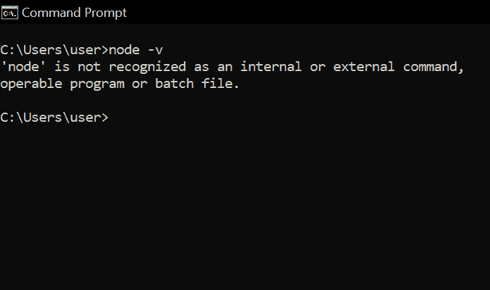
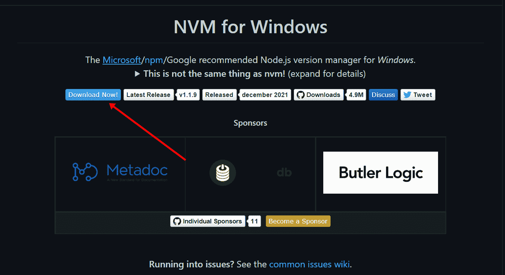
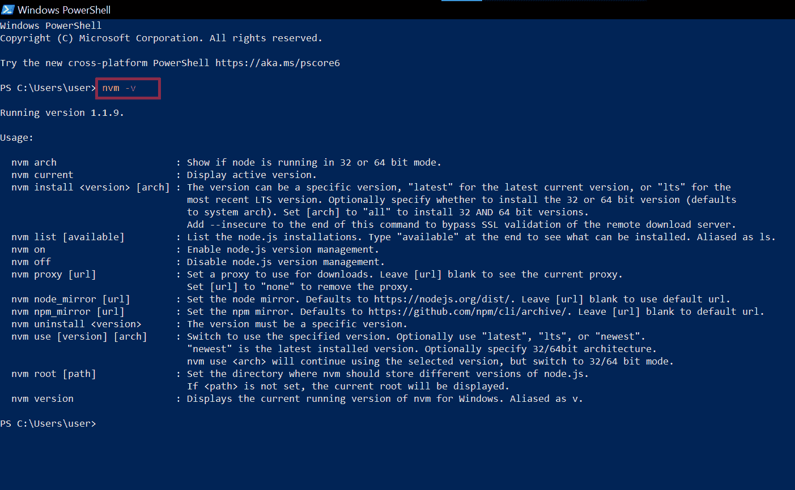
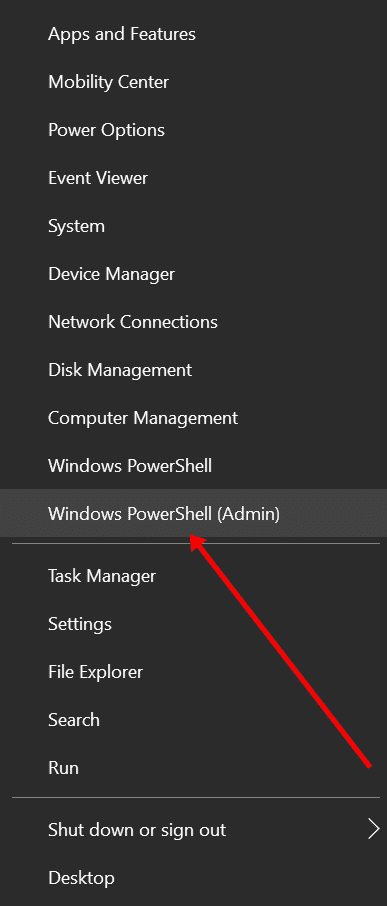
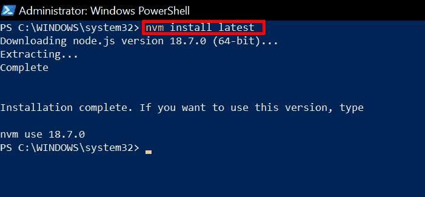
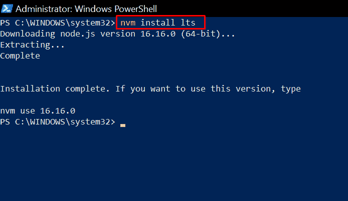
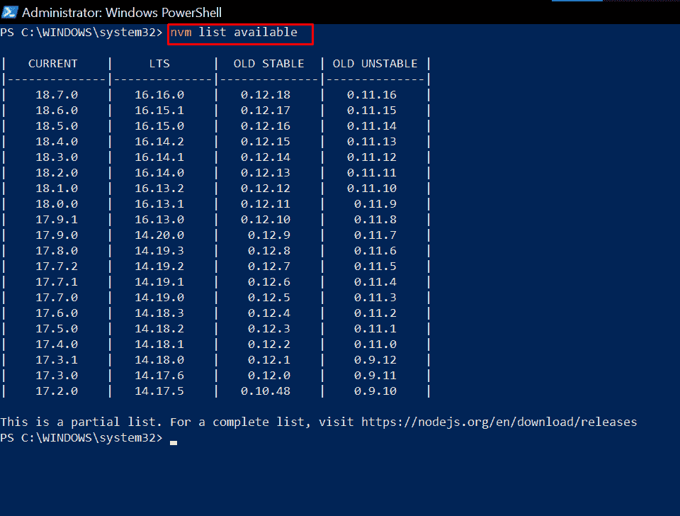
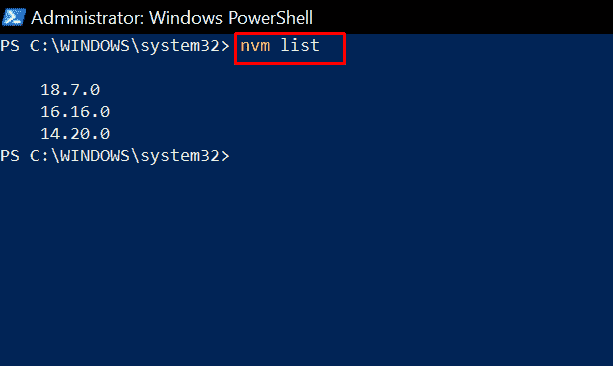
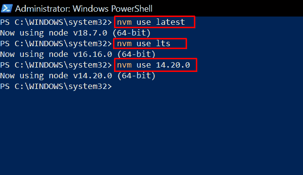

# 适用于 Windows 的 NVM–如何在 Windows 10 中下载和安装节点版本管理器

> 原文：<https://www.freecodecamp.org/news/nvm-for-windows-how-to-download-and-install-node-version-manager-in-windows-10/>

不同的软件开发工具可能需要特定版本的 Node.js 和 NPM(节点包管理器)。NPM 是一个管理从 NPM 注册表安装的软件包的工具。

此外，如果您正在制作一个 NPM 包，您可能需要使用不同版本的 Node.js 来测试它。这就是为什么您应该安装 NVM 的原因。

NVM 是 Node Version Manager 的缩写，是一个命令行工具，用于管理和切换到 Node.js 的不同版本。

在本文中，我将向您展示如何在 Windows 10 上下载和安装 NVM——即使 Windows 没有“NVM”。

我还将向您展示如何在您的 Windows 计算机上设置和使用不同版本的 Node.js 和 NPM。

## 我们将涵盖的内容

*   [如何在 Windows 10 中下载安装节点版本管理器](#howtodownloadandinstallnodeversionmanagerinwindows10)
    *   [按照以下步骤下载 nvm-windows](#followthestepsbelowtodownloadnvmwindows)
*   [如何在 Windows 10 上使用 NVM](#howtousenvmonwindows10)
    *   [如何用 NVM 安装不同版本的 Node.js 和 NPM](#howtoinstalldifferentversionsofnodejsandnpmwithnvm)
*   [重述](#recap)

## 如何在 Windows 10 中下载安装节点版本管理器

正如我前面提到的，Windows 没有“NVM ”,因为 NVM 只在 Linux 和 Mac 上受支持。

您将在 Windows 机器上使用的是“nvm-windows”。nvm-windows 与 nvm 相似，但又不完全相同。

**N.B.** :如果你已经安装了 Node.js，你需要卸载它，这样在使用不同版本的 Node 和从 NPM 注册表安装软件包时就不会出错。

之后重启你的电脑，打开命令提示符或者 PowerShell，运行`node -v`确认 Node 已经卸载。

另外，如果你安装了 yarn，卸载它，安装 NVM 后重新安装。你不想得到奇怪的错误，而安装和使用软件包从 NPM 注册表。

### 按照以下步骤下载 nvm-windows

*   **第一步**:前往 [nvm-windows 资源库](https://github.com/coreybutler/nvm-windows#installation--upgrades)，点击立即下载！”
    

您将被带到一个包含不同版本的 nvm-windows 的页面。

*   **第二步**:点击最新版本下载。目前是 2022 年 4 月 28 日的版本。
    

*   **第三步**:在电脑上找到安装程序并打开。按照安装向导进行安装。
    T3
    

*   **第四步**:打开 PowerShell 或命令提示符，运行`nvm -v`确认安装。
    

如果你收到和我上面一样的信息，那么 nvm-windows 已经成功安装。恭喜你。

## 如何在 Windows 10 上使用 NVM

要使用 NVM，您需要以管理员身份打开 PowerShell 或命令提示符。也可以使用 Git bash。

*   要以管理员身份打开 PowerShell，请右键单击开始并选择“PowerShell (Admin)”。
    

*   要以管理员身份打开命令提示符，请搜索“cmd”并在右侧选择“以管理员身份打开”。
    

### 如何用 NVM 安装不同版本的 Node.js 和 NPM

NVM 给你的超能力是能够在你的机器上安装多个版本的 Node.js。

要安装 Node 的最新版本，请运行`nvm install latest`。

安装 Node 的长期支持(LTS)版本总是更好，因为它的问题更少。

要安装 Node 的 LTS 版本，请运行`nvm install lts`。

要安装特定版本的 Node，您需要首先运行`nvm list available`，这样您就可以看到可用的 Node 版本。

要安装该特定版本，请运行`nvm install node-version-number`。比如`nvm install 14.20.0`。

**注意**:一旦你安装了 Node 的一个版本，相应的 NPM 版本也会为你安装。所以你不需要单独安装 NPM。

如果您想要使用的 NPM 版本不可用，请运行`npm install @npm version-number -g`来安装它。

现在，要查看您在 Windows 机器上安装的节点版本列表，运行`nvm list`。

要使用特定版本的节点，请运行:

*   `nvm use latest`使用最新版本
*   `nvm use lts`使用长期支持版本
*   `nvm use version-number`使用您已经安装的任何其他版本
    

## 概述

本文向您展示了如何在 Windows 10 (nvm-windows)上安装 NVM，以及如何使用它来安装和管理不同版本的 Node。

提醒一下，以下是您将在 nvm-windows 上使用的常用命令:

*   `nvm install node-version`–安装一个版本的节点
*   `nvm list`–查看您机器上安装的节点版本
*   `nvm use node-version`–使用特定版本的节点

感谢阅读，继续编码:)