# 如何在没有任何软件的情况下构建一个类似 Docker 引擎的自定义容器

> 原文：<https://www.freecodecamp.org/news/build-your-on-custom-container-without-docker/>

本文将讨论容器的各个方面，包括它们如何在后台运行以及它们的各种组件元素。我们也将发现为什么 Docker 如此快。

最后，您将能够创建自己的自定义容器。我们还将研究为什么 Kubernetes 弃用 Docker 而采用 CRI-O，以及如何使用 CRI-O 配置多节点 Kubernetes 集群。

最后，我们将查看可用容器运行时的列表。

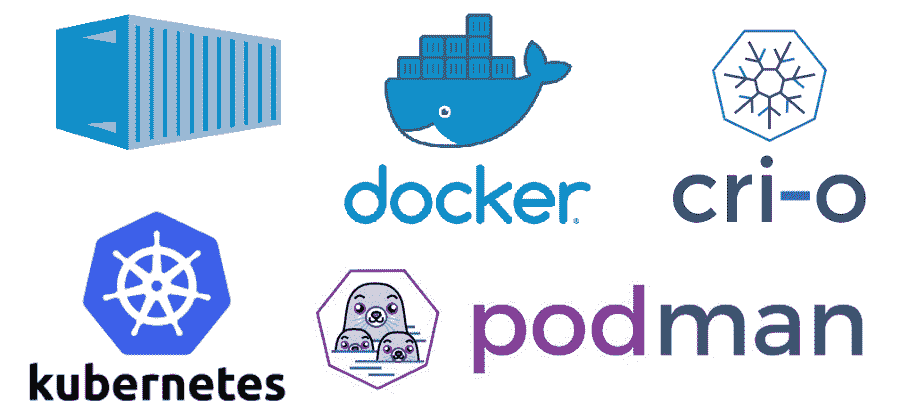

## 目录

1.  [什么是容器](#what-are-containers)？
2.  [为什么我们需要容器](#why-do-we-need-containers)？
3.  [容器和虚拟化有什么区别](#what-s-the-difference-between-containers-and-virtualization)？
4.  [容器](#is-there-a-standard-format-for-containers)有标准格式吗？
5.  [集装箱平台的类型](#types-of-container-platforms)
6.  [如何启动容器](#how-to-launch-a-container)
7.  【Kubernetes 为什么不赞成 Docker ？
8.  [使用 Docker 的挑战](#challenges-of-using-docker)
9.  [什么是 CRI(容器运行时接口)](#what-is-a-cri-container-runtime-interface-)？
10.  [如何使用 CRI-O 构建多节点集群](#how-to-build-a-multi-node-cluster-using-cri-o)

好吧，我们开始吧。

## 什么是容器？

容器允许您可靠地将软件从一个计算环境移动到另一个计算环境。

容器背后的技术几乎和虚拟机背后的技术一样古老。但信息技术行业直到 2013-14 年左右才开始使用容器，当时 Docker、Kubernetes 和其他颠覆该行业的创新开始流行。

容器已经成为软件开发过程中的一个重要工具。它们既可以替代虚拟机，也可以作为虚拟机的补充。

容器化有助于开发人员更快更安全地构建应用程序，同时也更容易地部署它们。

## 为什么我们需要容器？

正如我们在上面了解到的，容器为以可靠的方式将软件从一个计算机环境传输到另一个计算机环境提供了一个解决方案。这可以是从开发人员的工作站到测试环境，从试运行环境到生产环境，甚至是从数据中心的真实系统到私有或公共云虚拟机。

集装箱化使所有这些转变成为可能。这些只是可能发生的一些观点改变。

这句话从一个小小的角度解释了为什么容器是有用的:

> “您将使用 Python 2.7 进行测试，然后它将在生产中运行于 Python 3 上，奇怪的事情将会发生。或者你将依赖于某个 SSL 库版本的行为，另一个将被安装。
> 
> 你将在 Debian 上运行你的测试，在 Red Hat 上生产，各种奇怪的事情发生了。
> 
> 网络拓扑可能不同，或者安全策略和存储可能不同，但软件必须在其上运行。”所罗门·海克斯

## 容器如何解决这个问题？

更直接的解释是，容器是一个无所不包的运行时环境。

这意味着一个软件，连同它所有的依赖项、库、其他二进制文件和配置文件，被打包并作为一个包分发给客户。

如果将应用程序平台及其依赖项捆绑在容器中，则可以保护它们免受操作系统分布和底层基础设施变化的影响。

## 容器和虚拟化有什么区别？

虚拟机是在采用虚拟化技术时可以共享的包。该软件包包括程序和正在使用的操作系统。

在运行三台虚拟机的物理服务器之上，您将安装一个虚拟机管理程序，以及三个不同的操作系统。

另一方面，托管三个容器化程序的 Docker 服务器只需要运行一个操作系统，因为所有的容器共享同一个内核。操作系统的标准组件只能被读取，但是每个容器都有自己的挂载或访问机制，这允许它存储和检索数据。

这暗示着容器比虚拟机要轻得多，并且使用的资源也少得多。

## 容器有标准格式吗？

当 CoreOS 在 2015 年发布自己的应用容器映像(ACI)规范时，一些人担心快速增长的容器运动可能会分裂成不同的 Linux 容器格式。这是因为 ACI 代表“应用程序容器映像”

相比之下，后来成为开放集装箱倡议(OCI)的开放集装箱项目直到同年下半年才公开。

由 Linux 基金会领导的开放容器倡议(Open Container Initiative)旨在为容器格式以及与所有操作系统(OCI)兼容的容器运行时软件建立行业标准。

Docker 技术被用于开发开放容器项目(OCP)指南，Docker 提供了大约 5%的软件来帮助这项工作的开展。

### 什么是开放容器倡议？

开放容器倡议(OCI)是一个组织，其使命是确保容器技术的基本方面，如容器的格式，是标准化的，以便任何人都可以使用它们。

因此，公司可以集中精力开发他们需要的补充软件，以便在企业或云环境中使用标准化的容器(而不是开发容器的竞争技术)。

称为容器编排和管理解决方案的软件组件，以及容器安全系统，都是必不可少的组件。

## 集装箱平台的类型

由于容器技术的发展和扩展，目前有许多不同的选择。

毫无疑问，Docker 是最常见、使用最广泛的容器平台。

另一方面，容器技术的前景包括其他技术，每种技术都有自己的用例及优点。

我们将看看两个最著名的，即码头工人和波德曼。

### 码头工人

Docker 是目前最流行、使用最广泛的容器平台。它允许您开发和使用 Linux 容器。

Docker 是一款软件，通过使用容器，它简化了创建、部署和操作软件应用程序的过程。它通过最大限度地减少每个过程中的步骤来做到这一点。

Docker 不仅获得了大多数主流 Linux 发行版的支持，如 Red Hat 和 Canonical，还获得了大型组织的支持，如 Microsoft、Amazon 和 Oracle。

几乎所有与信息技术和云计算有关的企业都使用 Docker。

##### Docker 架构和组件

Docker 是建立在客户机-服务器架构上的。Docker 守护进程支持 Docker 容器的创建、操作和分发。

Docker 客户机和 Docker 守护进程可以通过 REST 应用程序编程接口(API)、UNIX 套接字或网络接口进行交互。

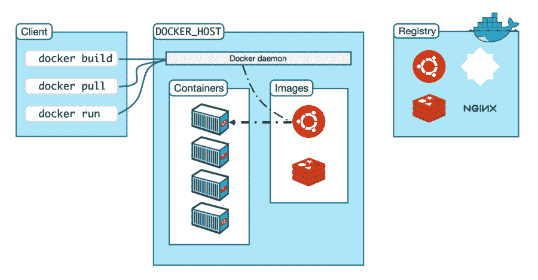

Source: docs.docker.com

Docker 的架构由以下五个主要组件组成:

1.  **Docker 守护进程**管理 Docker 对象，如图像、容器、网络和卷。它还响应 Docker API 查询。
2.  **Docker 客户端**通过允许用户与 Docker 连接，使用户能够与 Docker 交互。Docker 客户端提供了一个 CLI 界面，允许用户向 Docker 守护进程发送应用程序命令，并启动和停止此类操作。
3.  **Docker 主机**提供完整的软件程序执行和运行环境。该系统包括 Docker 守护程序、映像、容器、网络和存储组件。
4.  **Docker 注册表**维护 Docker 图像。Docker Hub 是一个公共注册表，默认情况下，Docker 被配置为使用保存在 Docker Hub 上的图像。您可以使用它来管理自己的注册表。
5.  **Docker 图像**是只能通过遵循 Docker 文件的一组指令来读取和生成的模板。图像指定了我们想要的打包程序的外观、它的依赖项以及应用程序启动时应该运行的进程。

#### Docker 中的资源隔离组件

##### 命名空间:

*   进程隔离的 PID 命名空间。
*   管理网络接口的. NET 命名空间。
*   用于管理对 IPC 资源的访问的 IPC 命名空间。
*   用于管理文件系统挂载点的 MNT 命名空间。
*   用于隔离内核和版本标识符的 UTS 命名空间。

##### 对照组

*   内存可以是一个监督会计以及限制和警报组
*   HugeTBL 是一个 cgroup，它跟踪每个进程组对巨大页面的使用。
*   CPU 组负责管理用户和系统使用 CPU 的时间。
*   CPUSet cgroup 允许您将组与某个 CPU 相关联。用于实时工作负载和每个 CPU 都有本地化内存的 NUMA 系统。
*   BlkIO cgroup 用于测量和限制每组产生的 BlkIO 量。
*   net cls 和 net prio cgroups 用于流量控制标记。
*   设备可以是一组既能读写数据又能访问设备。
*   用于冷冻的一组称为冷冻器。这对于调度集群批处理、重定位进程和故障排除非常有用。

##### 联合文件系统

*   Docker 映像由分层的文件系统组成，这使得它们非常轻量级和快速。联合文件系统是基于分层的文件系统。
*   Docker 引擎能够使用几个不同版本的 UnionFS，比如 AUFS、btrfs、vfs 和 devicemapper。
*   为了执行五个 250MB 的图像容器，如果没有 UnionFS，我们将需要 1.25GB 的磁盘空间。

从外部看，Docker 接口可能看起来像一个神秘的黑匣子，其中包含各种未知的技术。尽管这些技术相对来说不太为人所知，但它们非常吸引人而且非常有用。

尽管我们不需要掌握这些技术来有效地利用 Docker，但了解这些技术仍然是有益的。

如果我们对仪器有了更深入的了解，我们将更容易做出正确的决定，例如关于性能优化或安全影响的决定。

此外，这有助于发现创新的新技术，这些技术对组织的用途可能比最初想象的要多得多。

### 只有一张纸条:

Docker 不需要 cgroupfs 作为控制组驱动程序。可以将 cgroup 更改为 systemd。

Docker 自己的控制组管理器是 cgroupfs。然而，对于大多数 Linux 发行版，systemd 是默认的 init 系统，systemd 与 Linux 控制组有紧密的交互。

对于 Kubernetes，建议使用 systemd，因为将 cgroupfs 与 systemd 结合使用似乎不是最佳选择。

所以 systemd 更适合于 cgroup 管理。默认情况下，kubelet 被设置为使用 systemd。因此，应该修改 Docker 以利用 systemd 驱动程序。

##### 码头引擎引发了集装箱化运动

Docker 引擎是 Linux 和 Windows 服务器平台事实上的容器运行时。

Docker 开发简单的工具和统一的打包策略，将所有应用需求封装到一个容器中，然后由 Docker 引擎执行。

Docker 引擎使容器化的应用程序能够在任何基础设施上的任何地方可靠地运行，为开发人员和运营团队解决了“依赖性地狱”，并消除了“它在我的笔记本电脑上工作！”问题。

### 托普曼

波德曼是 RedHat 的产品。多克和波德曼在很多方面都很相似。

Podman 提供了一个 Docker 兼容的命令行接口，您可以用`$ alias docker = podman`将它作为 Docker 命令行接口的别名。此外，Podman 提供了一个套接字激活的 REST API 服务，使得远程应用程序可以随时启动容器。

docker-py 和 docker-compose 的用户能够以服务的形式连接 Podman，因为这个 REST API 也支持 Docker API。

通过使用 libpod 库，Podman 能够处理整个容器生态系统，包括 pod、容器、容器映像和容器卷。

Podman 与 Docker 的不同之处在于，它不需要服务器，并且具有轻量级和无守护进程的设计。这意味着它直接与 runC 联系来启动容器，这消除了对开销服务器的需要。

由 Podman 管理的容器既可以由 root 用户操作，也可以由比 root 权限更少的用户操作。

在使用 Docker 时，Docker 命令行接口是我们与 Docker 在后台运行的守护程序进行交互的方式。在容器上运行并产生图片的守护进程是程序的大部分功能所在。

该守护程序以 root 用户的权限运行。这也表明，如果配置不当，Docker 容器可能有权访问主机的文件系统。

相比之下，Podman 的架构使我们有可能与负责运行容器的用户协作，并且该用户不需要拥有 root 访问权限就可以执行应用程序。

与使用根功能运行的容器相比，非特权容器具有很大的优势。这是因为如果入侵者闯入一个非特权容器并逃跑，入侵者仍然是一个非特权主机用户。使用这种方法为我们的数据提供了额外的保护。

只需在使用说明中将 Docker 替换为 Podman 即可。它的命令与 Docker 相同。

```
$ alias docker=podman
```

##### 波德曼还有哪些优点？

*   对 systemd 的集成支持使得在后台运行容器进程成为可能，而不需要单独的守护进程。
*   为我们提供了构建和管理 Podami 的能力，Podami 是由一个或多个功能容器组成的集合。因此，未来的工作负载迁移到 Kubernetes 和 Podman 容器的编排现在是可能的。
*   可以使用名称空间实现 UID 分离，在执行容器时提供额外的安全隔离层。
*   可以从当前正在运行的容器中为 Kubernetes 创建一个 YAML 文件(使用命令`$ podman generate kube`)。

## 如何启动容器

要启动任何容器，我们需要两样东西:映像和运行时。

Docker 和 Podman 等容器引擎只是运行时之上的一个附加软件层。他们不负责实际启动容器本身。

它们还在后台启动与运行时的交互，以启动容器进程。

容器运行时是运行和管理运行容器所需组件的软件。

运行时实际上是一个启动、删除和移除容器的程序/软件。

runC 是一个非常著名的运行时，但我们还有许多其他的运行时，如 gvisor 和 kata。

Docker 在幕后连接到这个运行时。

运行时规范文件是一个配置文件，其中我们给出了容器启动的所有重要内容，如 CMD、文件夹、网络等等。它是容器运行时用来启动容器的文件。

我们可以验证 Docker 使用 runC 作为它的默认运行时引擎，如下所示:

```
$ docker info
```


### 如何使用通用容器运行时 runC


因为“容器”是复杂且偶尔晦涩的系统元素的集合，所以它们被组合成一个单一的底层组件。这是 runC。作为一种独立的工具，世界各地的基础设施管道工都将 runC 用作管道。

runC 是一个轻量级的、可移植的容器运行时。它是一个命令行工具，用于根据开放容器倡议(OCI)规范创建和运行容器。它有 libcontainer，这是 Docker 引擎用来设置我们称之为操作系统容器的原始下层库接口。

runC 的设计原则是安全性、大规模可用性以及不依赖 Docker。

每当我们启动一个容器，它就会在一秒钟内启动。它看起来像一个新的操作系统已经启动，因为它拥有操作系统应该拥有的所有东西(像所有的命令、网卡等等)。看起来像一个独立的操作系统。

#### 如何在一秒钟内启动一个容器？

你可能知道，当你运行任何一个程序时，它就变成了一个进程。所以即使在这里，每个运行的容器都是主机系统中的一个进程。所以每当我们启动一个容器，就意味着我们已经开始了某个过程。

看起来这个容器是一个不同的操作系统，有自己的文件系统、网络等等，正如我上面提到的。但是内核通过使用名称空间的概念在进程内部运行整个设置。我们稍后将进一步讨论名称空间。

因此，因为容器是一个进程，所以它启动很快。

容器只是运行在 RAM 中的一个进程。这个过程看起来像是在一个操作系统中运行一个全闪存操作系统。通常，进程(容器)运行 bash 命令，该命令具有无限的生存期，直到有人给出 exit 命令。

如果我们检查容器，我们可以找到在基本操作系统中运行的/bin/bash 命令的 PID。现在，如果我们杀死/bin/bash 的进程，容器也将被终止。

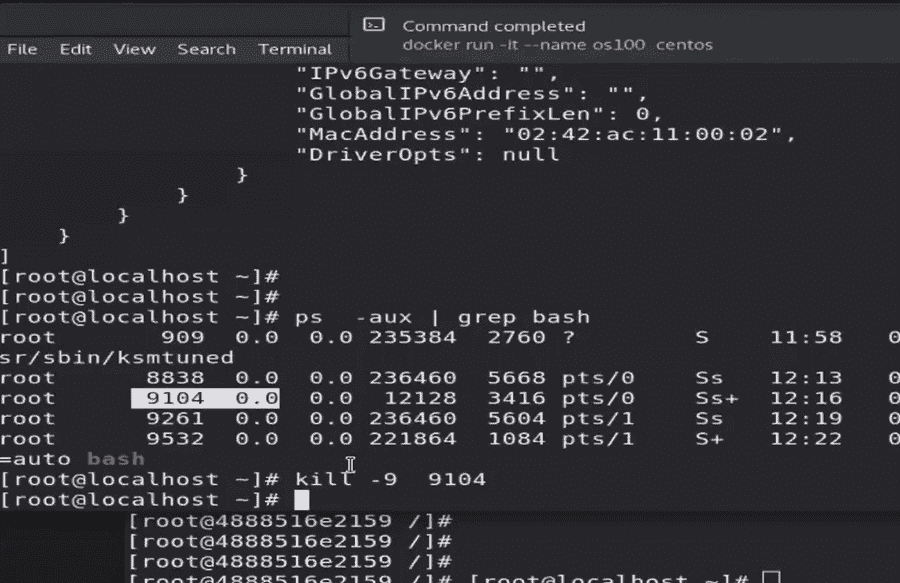

#### 什么是名称空间？

同样，运行容器也是一个过程。但是在 Docker 中，容器被赋予了自己的主要用户、网络配置、挂载文件夹、文件系统等等，这些都是 baseOS 的公共组件。因此，容器现在有了自己的隔离环境，称为名称空间。

```
$ lsns

# To list down all the namespace in the baseOS
```

为了启动容器，Docker 为 runC 创建一个运行时规范文件，然后 runC 使用它来启动容器。runC 为容器进程创建名称空间。

该映像相当于一个硬盘驱动器，也就是说，它包含容器的整个文件系统。容器映像捆绑了装载在存储命名空间(即装载命名空间)上的所有数据。

该映像在容器的“/”目录中创建整个包。我们必须通过解开它来解开它。

请注意，runC 不会为我们下载、解压缩这些图像。它可以启动容器并将文件装载到容器中。对于图像，我们需要一些图像管理工具。

还有，runC 只给我们提供了一个网络命名空间，但是 Docker 要管理网络(也就是指定 IP 范围，提供 IPs 等等)。

Docker 可以下载、解压缩或解包图像。它还可以进行所需的网络设置。它还可以为我们连接存储，Docker 提供了许多这样的功能。通常，Docker 可以通过命令完成 Kubernetes 提供的几乎所有东西。

在 Docker 中，我们有一个客户端-服务器架构，其中 Docker CLI 作为客户端程序，容器作为服务器。服务器现在将连接到运行时并为我们启动容器。

如果我们想直接启动容器，我们可以在 runC 的帮助下这样做。

首先，我们需要使用 yum 安装 runC。

```
$ runc list 

# This will list the available containers.
```

```
$ runc spec

# To create a runtime spec file in current directory.
```

runC 是用 Go 语言写的。所以，一般来说它支持 Go 程序(图像也是用 Go 语言写的)。

`$ go build -o name`是编译围棋程序的命令。

### runC 命令:

```
$ runc create <cont_name>

# To launch a container (This will take config file from current directory).
```

```
$ runc start <cont_name>

# This command will run and give the output of the program that we’ve specified in container.
```

在工作空间中，我们使用以下内容:

```
$ runc spec

# This will create a config.json file for the runC configuration.
```

在 congif.json 文件中，我们必须根据我们的需求更改参数值。

例如，如果我们不想要终端，我们需要使它成为假的。为此，我们可以在 arg 中给出运行命令，我们可以设置主机名，等等。

我们可以通过执行以下操作来连接到该容器名称空间:

```
$ nsenter -u -t -n <pid_of_container>

# To enter user and network namespace of specific process ID.
```

#### 使用 runC 创建一个容器:

1.  安装 runC。
2.  通过运行 runC spec 命令创建 config.json。
3.  在上面的文件中提到所有重要的事情。我们还必须通过用 Go 语言编写代码来给出过程。
4.  在当前工作区创建一个 rootfs 文件夹，并将编译好的 Go 代码移动到这个文件夹中。
5.  现在，要启动容器:

```
$ start runc create <container_name>
```

要启动容器并在控制台上打印 go 文件中的内容，请运行以下命令:

```
$ runc start <container_name>
```

### 如何用 runC 生成一个示例规范:

```
> runc spec
> cat config.json
{
  "ociVersion": "1.0.0",
  "process": {
    "terminal": true,
    "user": { "uid": 0, "gid": 0 },
    "args": ["sh"],
    "env": [
      "PATH=/usr/local/sbin:/usr/local/bin:/usr/sbin:/usr/bin:/sbin:/bin",
      "TERM=xterm"
    ],
    "cwd": "/",
    "capabilities": {
      "bounding": ["CAP_AUDIT_WRITE", "CAP_KILL", "CAP_NET_BIND_SERVICE"],
      [...]
    },
    "rlimits": [ { "type": "RLIMIT_NOFILE", "hard": 1024, "soft": 1024 } ],
    "noNewPrivileges": true
  },
  "root": { "path": "rootfs", "readonly": true },
  "hostname": "runc",
  "mounts": [
    {
      "destination": "/proc",
      "type": "proc",
      "source": "proc"
    },
    [...]
  ],
  "linux": {
    "resources": { "devices": [ { "allow": false, "access": "rwm" } ] },
    "namespaces": [
      { "type": "pid" },
      { "type": "network" },
      { "type": "ipc" },
      { "type": "uts" },
      { "type": "mount" }
    ],
    "maskedPaths": [
      "/proc/kcore",
      [...]
    ],
    "readonlyPaths": [
      "/proc/asound",
      [...]
    ]
  }
}
```

## 为什么忽必烈折旧码头？

Docker 通常是管理和创建容器和图像的首选。它非常快——所以你可能想知道为什么 Kubernetes 放弃 Docker，转而使用 CRI-O 容器引擎？我们来探索一下。

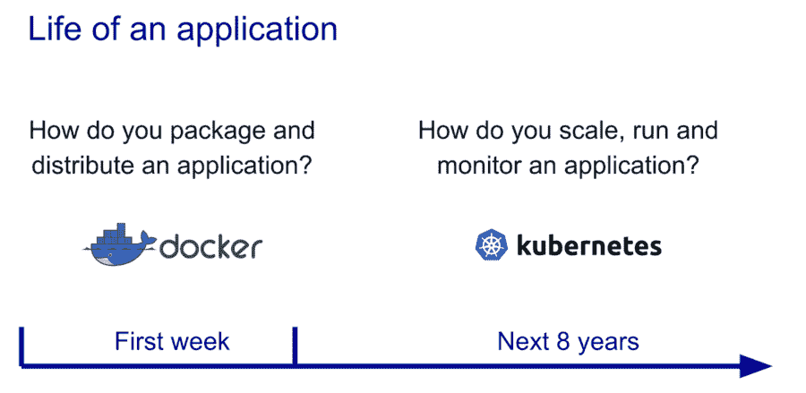

Source: https://www.sumologic.com/blog/kubernetes-vs-docker/

我们可以这样检查 Docker 容器引擎:

```
$ systemctl status docker
```

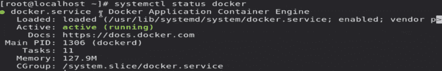

这里它显示了 Docker 应用程序容器引擎，但 conntainerD 是实际运行的引擎。

在 Docker 中，当 kubelet 需要连接到 ContainerD 时，它必须通过 API Docker shim 来联系 runC。这充当了 Docker 和 Kubernetes 之间的接口。这使得整个过程相当复杂。


Source: Tutorial Works

### 什么是 ConatinerD？

ContainerD 是一个强调简单性、持久性和可移植性的行业标准容器运行时。

您可以在 Linux 和 Windows 上找到 containerD 的基于守护进程的实现。它负责管理托管它的系统的整个容器生命周期，包括图像传输和存储、容器执行和监控、低级存储和网络附件。

#### 集装箱的特点:

*   OCI 映像规范支持
*   图像推拉支持
*   用于创建、修改和删除接口的网络原语
*   CAS 全球映像存储支持多租户
*   OCI 运行时规范支持(又名 runC)
*   容器运行时和生命周期支持
*   管理网络命名空间容器以加入现有命名空间

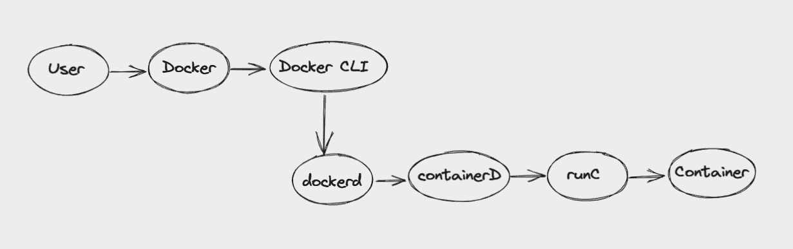

### dockerd 是什么？

Docker 的守护进程可以在 docker 的帮助下启动(这样你就可以命令守护进程管理图像、容器等等)。Dockerd 是一个在后台作为守护进程运行的服务器。

要运行 Docker 守护进程，我们可以指定 dockerd。在 dockerd 关键字之后，您应该提供想要使用的守护进程参数。

Docker(Docker 守护进程)可以通过三种不同类型的套接字监听 Docker 引擎 API 请求:`unix`、`tcp`和`fd`。

### 使用 Docker 的挑战

#### 开销

Docker 是集装箱市场上一个相当发达的平台。除了容器管理，它还提供许多其他功能，如存储、安全和网络基础设施等。

与 Cri-O 和 Podman 相比，Docker 的性能受到这些额外功能导致的开销的直接影响。

但是 Kubernetes 和 OpenShift 配备了所有这些功能。因此，他们只想从容器引擎得到一样东西:启动和管理容器的能力。换句话说，它们不需要任何其他功能。

#### Dockershim

在 Kubernetes 中，启动容器的过程始于 kubelet 与 containerD 通信，然后 container d 联系 runC。

因为独立的业务负责 containerD 和 kubelet 的生产，所以 kubelet 必须有一个附加层才能联系 containerD(一个类似 API 的层)。在 Docker 生态系统中，这一层被称为 Dockershim。

Kubernetes 贬低 dockershim 是因为 Docker 更新带来的复杂性和负担。

#### dockershim 有什么问题？

Kubernetes 提出了一个临时的解决方案，包括对 Docker 的支持，这样它就可以作为它的容器运行时。Dockershim 的反对仅仅意味着 Dockershim 的代码将不再维护在 Kubernetes 源代码库中。

Dockershim 已经成为 Kubernetes 开发者的一个重大问题。在此变更之后，Kubernetes 社区将只被允许维护 Kubernetes 容器运行时接口(CRI)。

Kubernetes 支持所有符合 CRI 的运行时，比如 containerD 和 CRI-O。

Kubernetes 提出用 CRI-O 作为与 runC 联系的接口。Kubelet 现在将联系 CRI-O。此外，它将联系 runC，容器将被启动。

然而，像 CRI-O 和 Docker 一样，现在有许多容器引擎。因此，Kubernetes 社区决定在所有容器引擎之上创建一个抽象层。因此，客户可以根据自己的需求使用任何容器引擎。

这个抽象层叫做 CRI(容器运行时接口)。

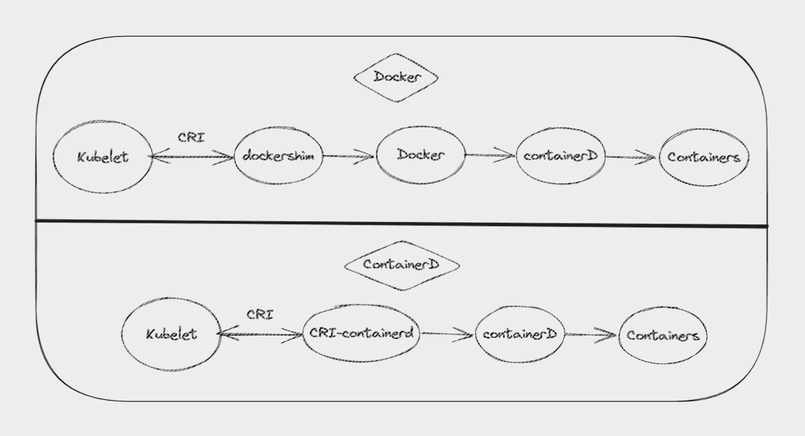

Kubernetes using Docker vs Kubernetes using CRI-O

### 什么是 CRI(容器运行时接口)？

Kubelet 程序抽象了底层的容器引擎。容器运行时接口(CRI)是一个插件接口，它允许 kubelet 使用几个容器运行时而无需重新编译。

除了协议缓冲区、gRPC API 和库，CRI 的其他规范和工具也在积极开发中。

Kubelet 通过 gRPC 协议与 CRI 建立连接。

### 什么是 CRI-O？

CRI-OCI 是一个缩写，代表容器运行时接口，OCI，代表开放容器倡议。

CRI-O 这一术语是在考虑了 CRI 和 CIO 群体成员的意见后选择的。

CRI-O 是另一个容器引擎，但它比 Docker 更轻量级，因为它不包含 Docker 所具有的额外功能，如网络、存储等。

CRI-O 为执行与开放容器倡议(OCI)兼容的运行时提供了一个更加安全、稳定和高性能的基础。符合 OCI 标准的运行时可以与 CRI-O 容器引擎结合使用来启动容器和 pod。

这种运行时的例子包括 runC(默认的 OCI 运行时)和 Kata 容器。但是您可以使用任何符合 OCI 标准的运行时来代替它。

CRI-O 项目的目标是取代 Docker 作为容器引擎，为 OpenShift 容器平台和 Kubernetes 实现 Kubernetes 容器运行时接口(CRI)。

CRI-O 的稳定性可能是由于它是与 Kubernetes 的主要版本和次要版本一起开发、测试和分发的，并且符合 OCI 标准。

CRI 作用域中的 O 依赖于容器运行时接口(CRI)。Kubernetes 服务(kubelet)的实际容器引擎规范是由 CRI 编译和指定的。

鉴于有几个集装箱引擎正在开发中，CRI 团队决定采取这一措施，以满足 Kubernetes 对集装箱引擎的要求。

根据 OpenShift 文档，帮助替换和扩展 Docker 命令和服务的工具有:

*   crictl:用于直接使用 CRI-O 容器引擎和故障排除
*   runc:用于运行容器映像
*   podman:用于管理容器引擎外部的容器和容器映像(运行、停止、启动、ps、附加、执行等)
*   buildah:用于构建、推送和签名容器图像
*   skopeo:用于复制、检查、删除和签署图像

### CRI-O 架构

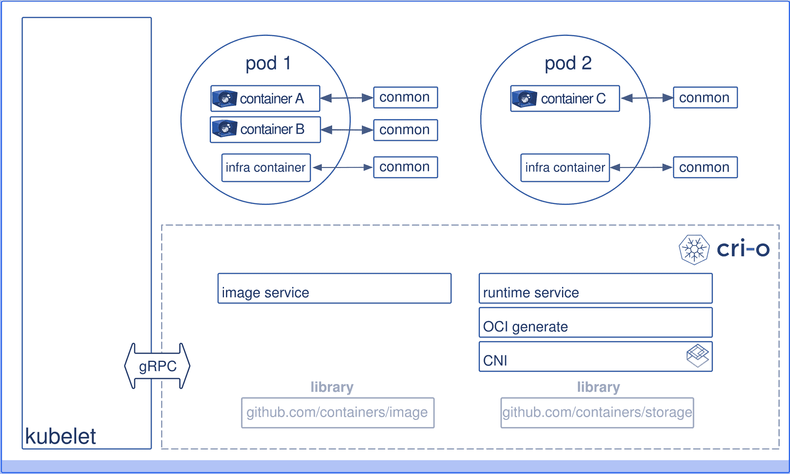

Source: cri-o.io

## 如何使用 CRI-O 构建多节点集群

下面是您在 Ubuntu 20.04 中使用 CRI-O 创建多节点 Kubernetes 集群时使用的命令。

这里是包含命令集的存储库:

[Kubernetes-CRIO/commands at main · gursimarh/Kubernetes-CRIOContribute to gursimarh/Kubernetes-CRIO development by creating an account on GitHub.gursimarhGitHub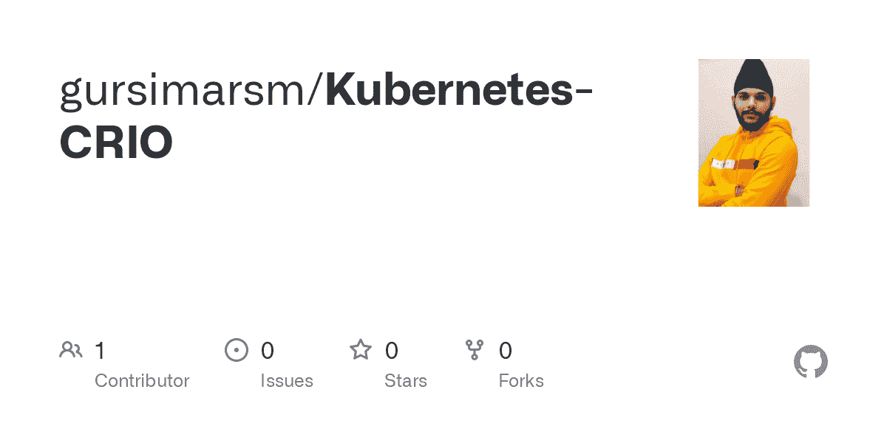](https://github.com/gursimarh/Kubernetes-CRIO/blob/main/commands)

```
OS=xUbuntu_20.04
VERSION=1.20

cat >>/etc/apt/sources.list.d/devel:kubic:libcontainers:stable.list<<EOF
deb https://download.opensuse.org/repositories/devel:/kubic:/libcontainers:/stable/$OS/ /
EOF

cat >>/etc/apt/sources.list.d/devel:kubic:libcontainers:stable:cri-o:$VERSION.list<<EOF
deb http://download.opensuse.org/repositories/devel:/kubic:/libcontainers:/stable:/cri-o:/$VERSION/$OS/ /
EOF

curl -L https://download.opensuse.org/repositories/devel:/kubic:/libcontainers:/stable/$OS/Release.key | apt-key --keyring /etc/apt/trusted.gpg.d/libcontainers.gpg add -

curl -L https://download.opensuse.org/repositories/devel:kubic:libcontainers:stable:cri-o:$VERSION/$OS/Release.key | apt-key --keyring /etc/apt/trusted.gpg.d/libcontainers-cri-o.gpg add -

apt update

apt install -qq -y cri-o cri-o-runc cri-tools

systemctl daemon-reload

systemctl enable --now crio

curl -s https://packages.cloud.google.com/apt/doc/apt-key.gpg | apt-key add -

apt-add-repository "deb http://apt.kubernetes.io/ kubernetes-xenial main"

apt install -qq -y kubeadm=1.20.5-00 kubelet=1.20.5-00 kubectl=1.20.5-00

cat >>/etc/modules-load.d/crio.conf<<EOF
overlay
br_netfilter
EOF

modprobe overlay

modprobe br_netfilter

cat >>/etc/sysctl.d/kubernetes.conf<<EOF
net.bridge.bridge-nf-call-ip6tables = 1
net.bridge.bridge-nf-call-iptables  = 1
net.ipv4.ip_forward                 = 1
EOF

sysctl --system

cat >>/etc/crio/crio.conf.d/02-cgroup-manager.conf<<EOF
[crio.runtime]
conmon_cgroup = "pod"
cgroup_manager = "cgroupfs"
EOF

systemctl daemon-reload

systemctl enable --now crio

systemctl restart crio

sed -i '/swap/d' /etc/fstab

swapoff -a

systemctl disable --now ufw

kubeadm init --apiserver-advertise-address=172.16.16.100 --pod-network-cidr=192.168.0.0/16

kubectl --kubeconfig=/etc/kubernetes/admin.conf create -f https://docs.projectcalico.org/v3.18/manifests/calico.yaml

kubeadm token create --print-join-command 
```

我们可以使用 join 命令将节点连接到集群，我们已经准备好了 Kubernetes 的多节点集群。

### 以下是 Docker、Kubernetes、CRI-O、containerD 和 runC 如何协同工作的示例

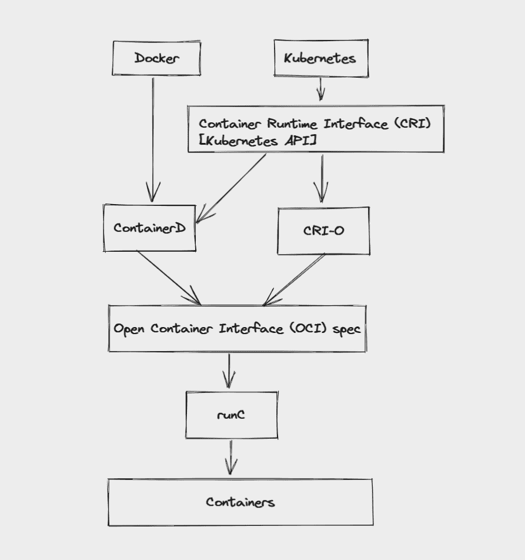

### 容器运行时

我们已经看到了很多关于容器如何工作的细节，我们已经定义了容器运行时，以及如何使用 runC 构建我们的定制容器。现在，我们手中还有其他像 runC 这样的工具吗？

在这里，我们将看看所有可用的容器运行时的情况。

一般来说，它们分为两大类:

1.开放集装箱倡议(OCI)运行时

OCI 运行时进一步分为两大类:本地运行时和沙箱化虚拟化运行时

2.容器运行时接口(CRI)

CRI 由 containerD 和 CRI-O 组成。

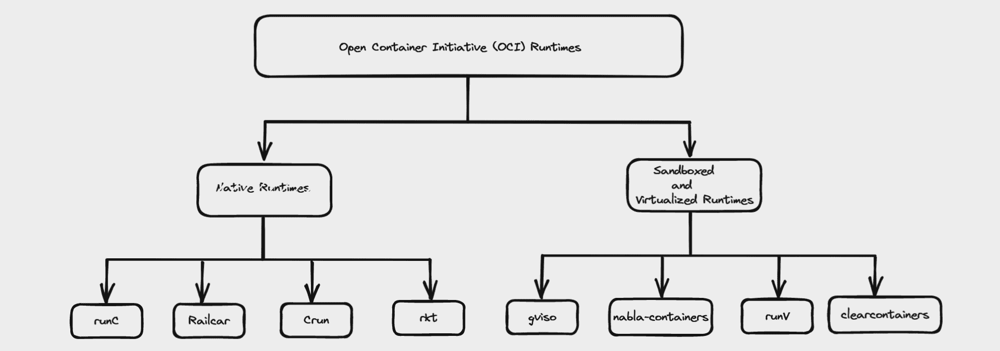

1\. Open Container Initiative (OCI) runtimes

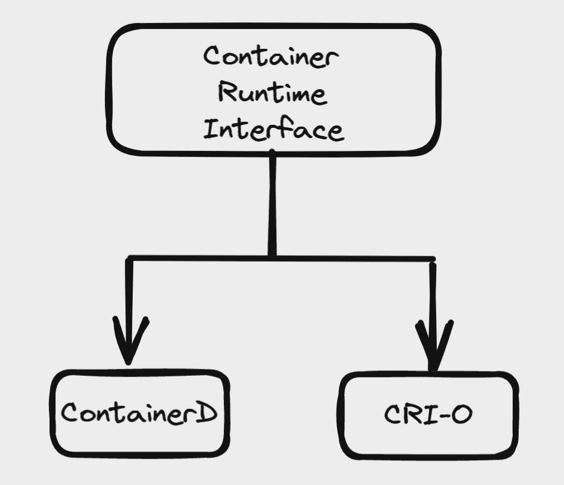

2\. Container Runtime Interface (CRI)

## 结论

在这里，我们看到了如何构建自定义图像和各种可用的工具。这是一个漫长的过程，但我希望你喜欢它，并学到了一些新的东西。

我总是乐于接受 LinkedIn 上的建议和讨论。直接给我发信息。

如果你喜欢我的写作，想让我保持动力，可以考虑在 [GitHub](https://github.com/gursimarh) 上离开 starts，并在 [LinkedIn](https://www.linkedin.com/in/gursimarh) 上为我的相关技能背书。

直到下一个，保持安全，继续学习。