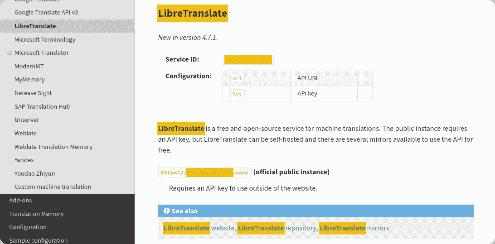
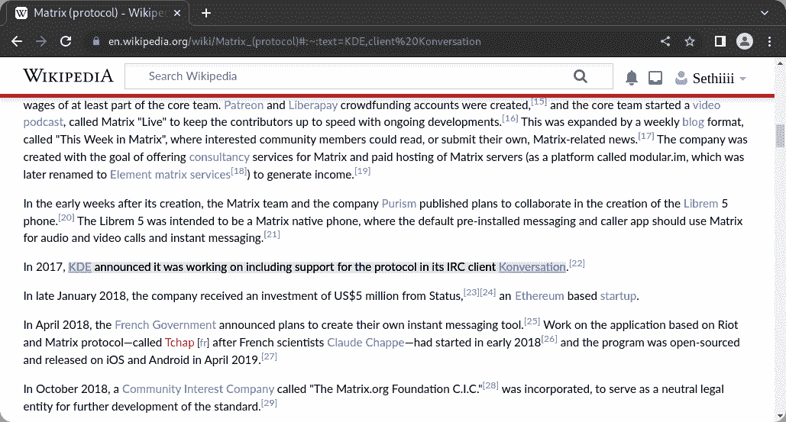
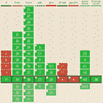
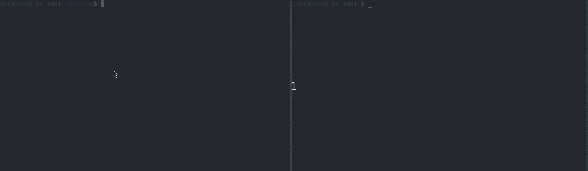
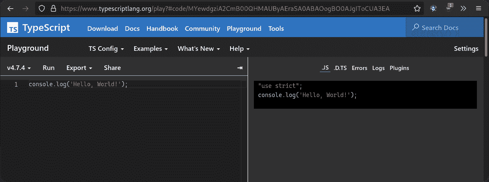
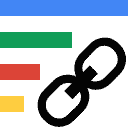
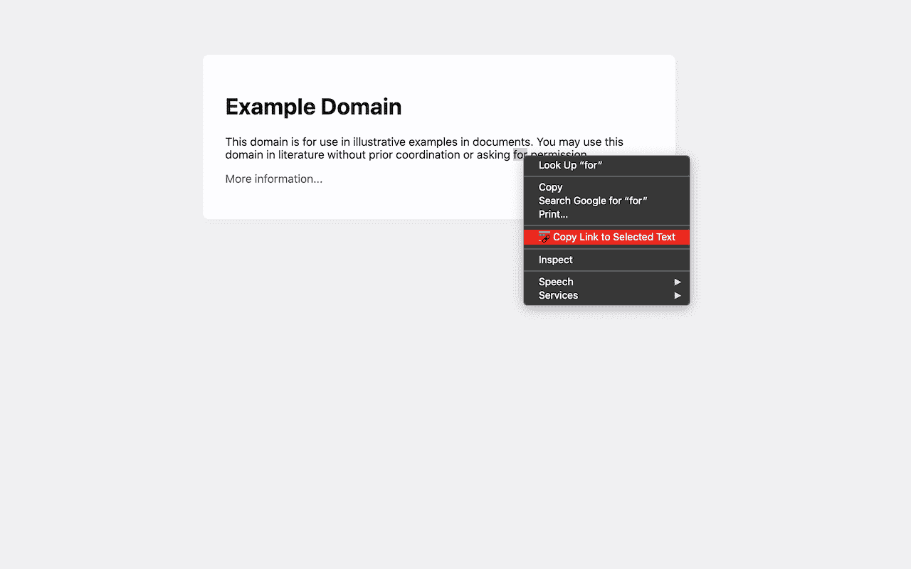

# 如何共享锚定网页上任何文本的链接

> 原文：<https://www.freecodecamp.org/news/how-you-can-share-links-that-anchor-to-any-text-on-a-webpage/>

你知道吗，有一个[非官方草案](https://wicg.github.io/scroll-to-text-fragment/)规范允许任意文本被传递到 URL 的片段(`#`)中？

这将允许用户共享指向网页上任何特定文本的链接！

## 什么是 URI 碎片？

[URI 片段](https://en.wikipedia.org/wiki/URI_fragment)是 URL 末尾的可选部分，以哈希(`#`)字符开头。它允许您引用您访问过的文档的特定部分。

例如，如果你访问下面的链接，你会自动滚动到你正在阅读的章节的顶部！

什么是 URI 碎片？

假设您正在浏览器中阅读这篇文章，您会注意到 URL 也发生了变化。它现在附加了`#what-s-a-uri-fragment`，这是 [Ghost CMS](https://ghost.org/) 分配给标题的 ID。

## 有什么变化？

以前，将链接锚定到页面的一部分的主要方法是在片段中指定 HTML 元素的 ID([source](https://developer.mozilla.org/en-US/docs/Web/HTML/Global_attributes/id))。

这使得读者被网页开发者或内容作者随意摆布。如果作者没有提供适当的 id，就没有办法锚定到那个部分的链接。

一些网站或工具提供了一种非标准的处理方式，即高亮显示。例如，在[阅读文档](https://readthedocs.org/)中，您可以传递`highlight`查询参数来高亮显示页面上的任何特定文本。

你可以在 [Weblate 文档](https://docs.weblate.org/en/latest/)中尝试一下。



[This is what you see when you specify the `highlight` query parameter on the Weblate documentation.](https://docs.weblate.org/en/latest/admin/machine.html?highlight=libretranslate#libretranslate)

文本片段是一个相对较新的提议，它扩展了 URI 片段的可用性，可以查询和高亮显示任意文本。

## 为什么这会有用？

你能联想到这些场景中的一个或多个吗？

*   在寻找信息来源时，您可以直接链接到您引用的报价或内容。
*   作为支持人员的一员，您可以链接并突出显示文档的特定摘录或用户常见问题。
*   文本片段可以用于任何不能存储锚元数据的任意文本文档，比如明文或配置文件。
*   您是一名 web 开发人员，为此实现了一个定制的解决方案，但是现在可以让浏览器为您处理它。

如果是这样的话，那么这可能有助于更好地确定 web 上内容的属性，突出用户需要的信息，或者减轻开发人员的一些维护工作。

## 这个提议

您可以指定文本，也可以指定文本范围的开始和结束。该规范包括一个伪图，演示了语法的样子:

```
:~:text=[prefix-,]textStart[,textEnd][,-suffix]

         context  |-------match-----|  context
```

[https://github.com/WICG/scroll-to-text-fragment#tldr=](https://github.com/WICG/scroll-to-text-fragment#tldr=)

或者更容易理解的版本:

| 部分 | 需要 | 描述 | 笔记 |
| --- | --- | --- | --- |
| `prefix` | 错误的 | 值必须出现在文本之前，但不会突出显示。 | 必须以`-`结尾。 |
| `textStart` | 真实的 | 如果未指定`textEnd`，则直接匹配，否则与`textEnd`结合使用以匹配范围。 |  |
| `textEnd` | 错误的 | 与`textStart`结合使用，匹配一系列文本。 |  |
| `suffix` | 错误的 | 值必须出现在文本之后，但不会突出显示。 | 必须以`-`开头。 |

部分`prefix`和`suffix`用于上下文，因此如果您想要匹配的文本在一个页面上出现多次，您可以使用它们向浏览器指示您想要匹配哪个实例。

为了提供一些例子，让我们假设我们打开网络货币化网站，其中包括以下文本。

> JavaScript 浏览器 API 允许创建从用户代理到网站
> 
> —【https://webmonetization.org/ 的支付流

| 例子 | 突出 |
| --- | --- |
| `:~:text=javascript` | Java Script 语言 |
| `:~:text=api,stream` | 允许创建付款流的 API |
| `:~:text=javascript-,browser` | 浏览器 |
| `:~:text=a-,javascript,api` | JavaScript 浏览器 API |
| `:~:text=that-,allows,stream,-from` | 允许创建付款流 |

对于较长的文本摘录，最好使用一个范围来避免 URL 膨胀。通常，无论如何，开发者的目标是将 URL 的总长度保持在 2000 ~字符以下。这避免了旧用户代理的潜在问题，尤其是在考虑了域和查询参数的长度之后。



[Here is how highlighting looks on Chromium when you visit a webpage with a text fragment.](https://en.wikipedia.org/wiki/Matrix_(protocol)#:~:text=KDE,client%20Konversation)

### 实施细节

通过阅读规范，并在 Chromium 浏览器中手工测试，这里有一些关于在文本片段中查询内容的更好的细节。

*   这些部分不区分大小写，重音被忽略( [source](https://wicg.github.io/scroll-to-text-fragment/#finding-ranges-in-a-document) )
*   所有部分只匹配全词，所以不能部分匹配
*   如果有多个([源](https://wicg.github.io/scroll-to-text-fragment/#syntax))匹配，则只突出显示第一个匹配

## 和睦相处

大多数 Chromium 浏览器都有文本片段，因为这是在 2020 年在 [Chromium 中实现的。](https://chromestatus.com/feature/4733392803332096)

文本片段在 Firefox 中根本不可用。Mozilla 有望在未来实现这一点——2022 年 2 月，他们[开了一张跟踪进度的罚单](https://bugzilla.mozilla.org/show_bug.cgi?id=1753933 )。

[](https://caniuse.com/url-scroll-to-text-fragment)[URL Scroll-To-Text Fragment | Can I use... Support tables for HTML5, CSS3, etcCan I use... Support tables for HTML5, CSS3, etc](https://caniuse.com/url-scroll-to-text-fragment)

## 隐私和安全

规范引起了一些关注，即自动滚动到页面的某些部分可能会泄露用户的某些细节。

关于 URI 碎片的一个有趣的事情是，它们不应该被发送到 web 服务器进行处理。URI 片段旨在成为由浏览器或 web 应用程序本地处理的客户端/用户代理专用机制。

为了验证这一点，我们可以运行一个只记录 URL 的小型 Express 服务器。我们会看看它是否包含了片段:

```
const express = require('express');
const app = express();
const port = 3000;

app.get('*', (req, res) => {
   console.log('URL:', req.url);
   res.status(204).send();
});

app.listen(port, () => {
   console.log(`Listening on port ${port}.`); 
});
```

A minimal web server that just prints the URL of the incoming request.



The results of each request via curl. The same strings would've printed had I executed the requests in a browser.

一些网站利用这一点来提高隐私和减少发送到网络服务器的带宽。

例如，如果你看一下 [TypeScript Playground](https://www.typescriptlang.org/play) ，你会注意到，他们没有使用查询参数或构建一个短 URL，而是对 TypeScript 进行编码并将其存储在 URI 片段中。



Observe how the URL includes a URI fragment. It's actually just `console.log('Hello, World!');` but encoded.

有了这样的实现，你可以将链接加入书签或与任何人共享，他们的 web 服务器不会知道或关心代码。然而，你用来共享链接的任何服务当然可以解码和读取它。

然而，文本片段引起的问题是，如果用户代理将自动向下滚动到页面的给定部分，而文本片段不会与 web 服务器共享，则可能会引发网络请求，例如在站点的该部分加载图像。这将允许 web 服务器推断出您链接到了页面的那个部分( [source](https://github.com/WICG/scroll-to-text-fragment/issues/76) )。

尽管有这些担忧，但在我看来，URI 片段作为一个整体，在很长一段时间内都容易受到这种影响，而不仅仅是文本片段。

无论如何，在浏览器开发人员和安全研究人员对此给予更多考虑之前，记住这一点是件好事。

## 链接到文本片段扩展

谷歌还开发了一个扩展,它提供了一个用户界面，可以将任意文本链接成一个 URL。

当您选择文本并双击它时，该扩展将“复制选定文本的链接”添加到上下文菜单中。你可以在下面的视频中看到它的作用。

[https://www.youtube.com/embed/Y5DmGqnzvBI?feature=oembed](https://www.youtube.com/embed/Y5DmGqnzvBI?feature=oembed)

[Link to Text FragmentBrowser extension that allows for linking to arbitrary text on a page.Chrome Web Store](https://chrome.google.com/webstore/detail/link-to-text-fragment/pbcodcjpfjdpcineamnnmbkkmkdpajjg)

Firefox 也提供了该扩展，polyfills 在每个网页中实现了文本片段，因此它甚至可以滚动到匹配的文本并高亮显示。

[Link to Text Fragment – Get this Extension for 🦊 Firefox (en-US)Browser extension that allows for linking to arbitrary text on a page.Thomas Steiner](https://addons.mozilla.org/en-US/firefox/addon/link-to-text-fragment/)

## 结论

我希望这能给 URI 碎片更多的启发，尤其是文字碎片。

如果您对如何改进该规范有任何想法，请随时查看浏览器和 WICG 存储库上的公开问题，并提供您的想法。

我渴望看到更多的浏览器支持这一点，因为它使引用、归因和链接到网络内容的体验更加方便。