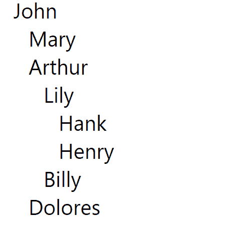
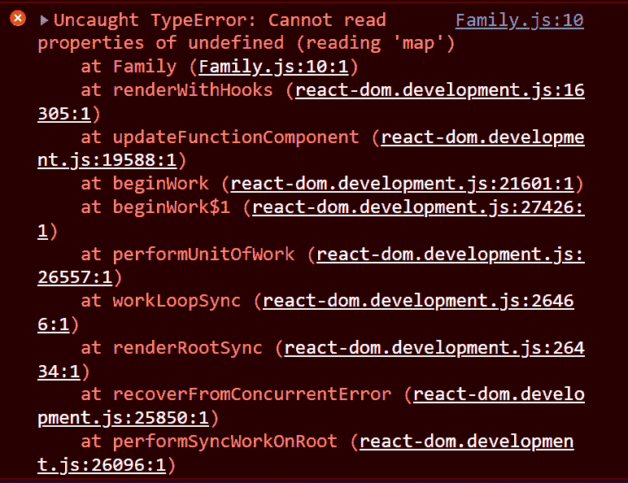
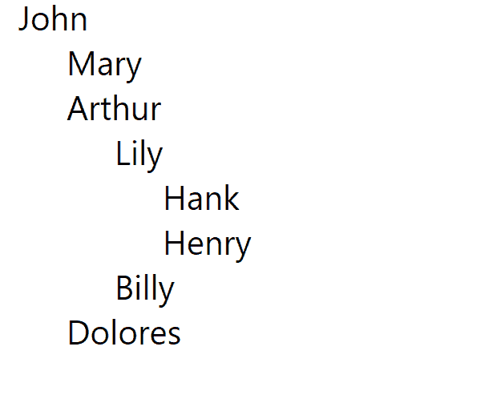

# 如何在 React 中使用递归

> 原文：<https://www.freecodecamp.org/news/how-to-use-recursion-in-react/>

有时你需要从一个数组中打印记录，但是这个数组太大并且是嵌套的。

假设我们有一个家谱，或者一个文件夹结构。我们有多个嵌套在数组中的数组，这样循环往复。它又大又深，不可能映射父数组中的每一个子数组。

它看起来像这样:

```
export const familyTree = {
  //Grandfather
  name: "John",
  age: 90,
  children: [
    {
      name: "Mary",
      age: 60,
    },
    {
      name: "Arthur",
      age: 60,
      children: [
        {
          name: "Lily",
          age: 35,
          children: [
            {
              name: "Hank",
              age: 60,
            },
            {
              name: "Henry",
              age: 57,
            },
          ],
        },
        {
          name: "Billy",
          age: 37,
        },
      ],
    },
    {
      name: "Dolores",
      age: 55,
    },
  ],
}; 
```

在上面的例子中，我们有一个家谱。如果父节点有子节点，它将位于名为 **Children** 的数组中。如果那个**子**有**子**，它会在它们的**子**数组里面。

这个例子有点简单，但是假设我们有很多很多家庭成员。也许即使这样也很难数清。

在这种情况下，为了有效地表示我们的家谱，我们将使用一种叫做**递归**的东西。递归简单地说就是在同一个函数内部调用同一个函数，或者在同一个组件内部呈现一个组件。

将要发生的是，只要我们有数据，函数或组件就会被调用。所以，我们试着在这种情况下实现**递归**。

## 下面是没有递归的代码

所以，我们有数据，正如你在上面看到的。让我们在 UI 中打印所有家庭成员的姓名。

创建一个名为 **Family 的组件。**

```
import "./App.css";
import { familyTree } from "./data";
import Family from "./Family";

function App() {
  return (
    <div>
      <Family familyTree={familyTree} />
    </div>
  );
}

export default App; 
```

我们还导入了数组 **familyTree** 。然后，我们将数据作为道具作为**家族**组件中的**家族**进行传递。

现在，在家庭组件中，让我们接收道具并将其析构。

```
import React from "react";

export default function Family({ familyTree }) {
  return <div style={{ paddingLeft: 10 }}></div>;
} 
```

现在，我们将创建一个函数，通过单击父母的名字来展开家谱。我们还将创建一个在函数运行时切换其值的状态。

```
import React, { useState } from "react";

export default function Family({ familyTree }) {
  const [isVisible, setIsVisible] = useState(false);
  const expand = () => {
    setIsVisible(!isVisible);
  };
  return <div style={{ paddingLeft: 10 }}></div>;
} 
```

现在，让我们映射 familyTree 数组并从中提取数据。

```
import React, { useState } from "react";

export default function Family({ familyTree }) {
  const [isVisible, setIsVisible] = useState(false);
  const expand = () => {
    setIsVisible(!isVisible);
  };
  return (
    <div style={{ paddingLeft: 10 }}>
      <span>{familyTree.name}</span>
      {familyTree.children.map((child) => {
        return (
          <div style={{ paddingLeft: 10 }}>
            <span>{child.name}</span>
          </div>
        );
      })}
    </div>
  );
} 
```

我们还将第一个数组(在子数组中)映射到父数组 **John** 中。这基本上意味着**约翰**的所有孩子都将被打印。

现在，让我们添加函数触发器。如果我们单击父节点的名称，比如说**约翰**，函数**展开**将运行，它将切换**可见**状态的值。

```
import React, { useState } from "react";

export default function Family({ familyTree }) {
  const [isVisible, setIsVisible] = useState(false);
  const expand = () => {
    setIsVisible(!isVisible);
  };
  return (
    <div style={{ paddingLeft: 10 }}>
      <span onClick={expand}>{familyTree.name}</span>
      {familyTree.children.map((child) => {
        return (
          <div style={{ paddingLeft: 10 }}>
            <span>{child.name}</span>
          </div>
        );
      })}
    </div>
  );
} 
```

现在，让我们隐藏映射数组中的值，只在 **isVisible** 为真时显示它们。

```
import React, { useState } from "react";

export default function Family({ familyTree }) {
  const [isVisible, setIsVisible] = useState(false);
  const expand = () => {
    setIsVisible(!isVisible);
  };
  return (
    <div style={{ paddingLeft: 10 }}>
      <span onClick={expand}>{familyTree.name}</span>
      {isVisible ? (
        familyTree.children.map((child) => {
          return (
            <div style={{ paddingLeft: 10 }}>
              <span>{child.name}</span>
            </div>
          );
        })
      ) : (
        <></>
      )}
    </div>
  );
} 
```

如果您单击父项的名称，它将切换其子项并显示以下内容:


现在我们假设玛丽有几个孩子，或者亚瑟有几个孩子。他们的孩子有孩子，这样继续下去。我们可以映射一个数组中的每个数组来得到列表中的整个家谱。代码看起来会像这样。

```
import React, { useState } from "react";

export default function Family({ familyTree }) {
  const [isVisible, setIsVisible] = useState(false);
  const expand = () => {
    setIsVisible(!isVisible);
  };

  return (
    <div style={{ paddingLeft: 10 }}>
      <span onClick={expand}>{familyTree.name}</span>

      {isVisible ? (
        familyTree?.children?.map((child) => {
          return (
            <div style={{ paddingLeft: 10 }}>
              <span onClick={expand}>{child.name}</span>
              {child?.children?.map((subChild) => {
                return (
                  <div style={{ paddingLeft: 10 }}>
                    <span onClick={expand}>{subChild?.name}</span>
                    {subChild.children?.map((subChildInner) => {
                      return (
                        <div style={{ paddingLeft: 10 }}>
                          <span onClick={expand}>{subChildInner?.name}</span>
                          {subChildInner.children?.map((subChildInner2) => {
                            return (
                              <div>
                                <span>{subChildInner2.name}</span>
                              </div>
                            );
                          })}
                        </div>
                      );
                    })}
                  </div>
                );
              })}
            </div>
          );
        })
      ) : (
        <></>
      )}
    </div>
  );
} 
```

输出会是这样的。



但是我们不能一直映射父数组中的每一个子数组。整个代码可能看起来很难看，而且这个过程可能会变得很忙乱。

这是如此令人困惑，我也被困在这里一段时间。

在这种情况下，我们将使用**递归**。所以，我们来实施吧。

## 如何使用递归来代替

现在，让我们用递归做同样的事情。我们的代码现在会更干净。

```
import React, { useState } from "react";

export default function Family({ familyTree }) {
  const [isVisible, setIsVisible] = useState(false);
  const expand = () => {
    setIsVisible(!isVisible);
  };
  return (
    <div style={{ paddingLeft: 10 }}>
      <span onClick={expand}>{familyTree.name}</span>
      {isVisible ? (
        familyTree.children.map((child) => {
          return (
            <div style={{ paddingLeft: 10 }}>
              <span>{child.name}</span> *
            </div>
          );
        })
      ) : (
        <></>
      )}
    </div>
  );
} 
```

所以，在 **span** 标签的地方(在我们从第一级父数组打印孩子名字的地方)，我们将再次调用**家族**组件。

```
import React, { useState } from "react";

export default function Family({ familyTree }) {
  const [isVisible, setIsVisible] = useState(false);
  const expand = () => {
    setIsVisible(!isVisible);
  };
  return (
    <div style={{ paddingLeft: 10 }}>
      <span onClick={expand}>{familyTree.name}</span>
      {isVisible ? (
        familyTree.children.map((child) => {
          return (
            <div style={{ paddingLeft: 10 }}>
              <Family />
            </div>
          );
        })
      ) : (
        <></>
      )}
    </div>
  );
} 
```

就像这样。但是你会看到**家族**组件正在接收一个道具，这就是**家族树。**我们也必须通过考试。

那么，我们可以传递什么来满足 **familyTree** prop 的值呢？

打开并查看我们获取数据的阵列。我们有一个最高级别，那就是约翰。现在，我们正在映射 John 内部的 Children 数组，这将为我们提供他的三个孩子，我们将在我们的 UI 中显示他们。

现在如果你点击**玛丽**，它将显示**玛丽**里面的孩子，因为玛丽现在是父母。

因此，为了进一步深入数组，我们必须在映射时传递数组中的**子节点**，作为 prop familyTree。

```
import React, { useState } from "react";

export default function Family({ familyTree }) {
  const [isVisible, setIsVisible] = useState(false);
  const expand = () => {
    setIsVisible(!isVisible);
  };
  return (
    <div style={{ paddingLeft: 10 }}>
      <span onClick={expand}>{familyTree.name}</span>
      {isVisible ? (
        familyTree.children.map((child) => {
          return (
            <div style={{ paddingLeft: 10 }}>
              <Family familyTree={child}/>
            </div>
          );
        })
      ) : (
        <></>
      )}
    </div>
  );
} 
```

就像这样。确保两个地方的道具名称相同。

但是我们一点击**玛丽**就会遇到问题。因为玛丽没有孩子，里面也没有孩子数组。所以，我们不能映射一个空数组或者一个不存在的数组。我们将得到一个错误，页面将变成空白。



因此，我们将跳过那些没有子数组的数组。

一个简单的方法是使用问号('？')).这就是所谓的可选链接。如果值或任何属性未定义，它将跳过它。[阅读本文](https://www.freecodecamp.org/news/how-the-question-mark-works-in-javascript/)中关于可选链接的更多信息。

```
import React, { useState } from "react";

export default function Family({ familyTree }) {
  const [isVisible, setIsVisible] = useState(false);
  const expand = () => {
    setIsVisible(!isVisible);
  };
  return (
    <div style={{ paddingLeft: 10 }}>
      <span onClick={expand}>{familyTree.name}</span>
      {isVisible ? (
        familyTree?.children?.map((child) => {
          return (
            <div style={{ paddingLeft: 10 }}>
              <Family familyTree={child} />
            </div>
          );
        })
      ) : (
        <></>
      )}
    </div>
  );
} 
```

因此，我们在映射阵列时添加了一个问号。如果我们单击没有子对象的父对象，我们不会得到任何错误。



我们可以像这样展示整个家谱。如果父代有子代，它将扩展。如果父节点没有子节点，它将什么也不做。

这就是我们如何在 React 中实现**递归。**

## 结论

让我重复一下我们正在做的事情。我们只是简单地映射一个数组，数组中有子元素，其中一些子元素有子元素，这可以继续下去。

因此，我们使用了**递归**来自动映射数组本身。当我们映射数组时，我们只是简单地调用它内部的同一个系列组件，以便它调用自身并再次打印所有内容。它将继续下去，直到我们什么也不剩，或者一个空数组。

这就是递归的力量。

如果你想看这个的视频版本，请在我的[赛博纳蒂科](https://www.youtube.com/c/CybernaticoByNishant)频道访问我在 [Recursion in React](https://youtu.be/1Qq_0rJUEos) 的视频。

如果你愿意，也可以查看一下 Github 上的代码。

感谢阅读。上帝保佑。