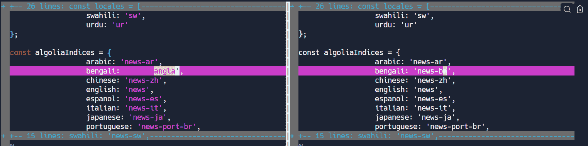
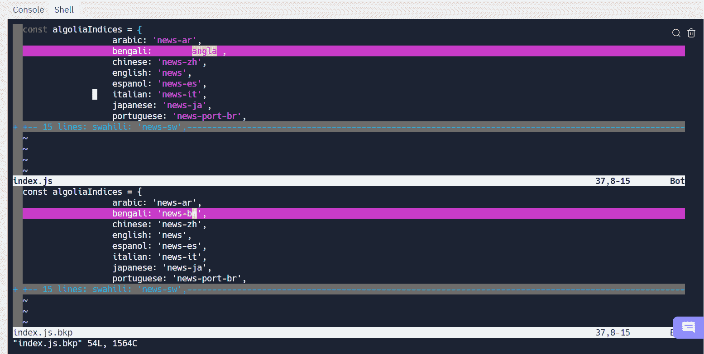
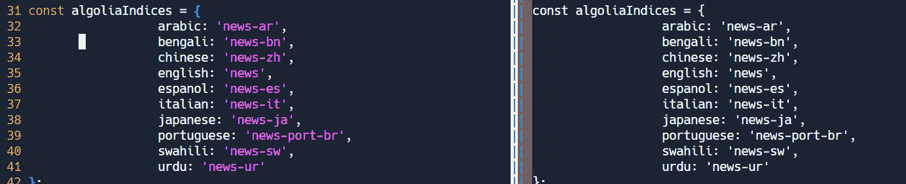
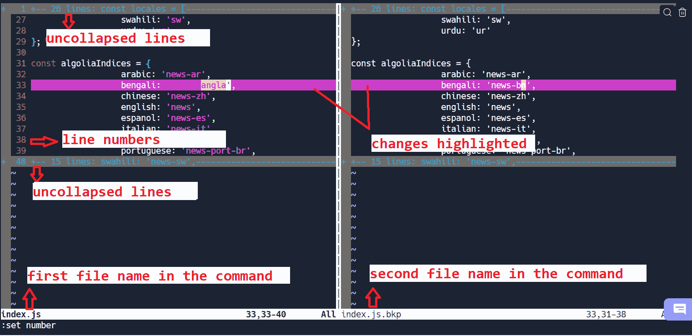

# Linux `Vimdiff `命令——如何在命令行中比较两个文件

> 原文：<https://www.freecodecamp.org/news/compare-two-files-in-linux-using-vim/>

软件开发和维护有时会变得复杂。您可能会发现自己在比较代码或配置的变化。

当您手动比较它们时，您可能会出错，并且很容易错过细微的变化。除此之外，在大文件中寻找变化也是很累人的。

有许多在线工具和文本编辑器可以帮助您有效地比较文件。但是有一种更简单、更容易的方法可以使用 Linux 命令行来比较文件。

Linux 命令行非常强大，在`vim`中提供了一个文件比较工具，可以并排区分文件。

在命令行中学习文件比较是有帮助的，因为许多服务器只使用 CLI(命令行界面)。这意味着您没有可以运行浏览器或其他文本编辑器的 GUI。

## 什么是 vimdiff？

`Vimdiff`是一个 Linux 命令，可以用`Vim`编辑一个文件的两个、三个或四个版本，并显示它们的区别。

### `Vimdiff`语法

为了比较两个文件，语法如下:

```
 vimdiff [options] file1 file2
```

我们来对比两个文件`index.js`和`index.js.bkp`看看它们的区别。

```
vimdiff index.js index.js.bkp 
```

**输出:**



`Vimdiff` output

在这里，我们可以看到突出显示的行中的差异。

为了方便起见，我们也可以显示行号。当你处于`Vim`时，按两次 escape 键并输入`:set number`进入扩展命令模式。这将显示当前会话的行号。


Line numbers in `vim`

让我们再仔细看看输出:


Detailed output of `vimdiff`.

*   **未折叠行:**这些是没有被改变的代码行。这些被包装，可以使用`z+c`和`z+o`组合键打开。
*   **突出显示的更改:**这些是文件中存在的差异。
*   **行号:**这些是文件中对应的行号。
*   **文件名:**左边的文件名是命令中提到的第一个文件名。右边的文件名是命令中提供的第二个文件名。

默认情况下，还有一种方法可以在 Vim 中启用行号，这样您就不必每次都手动设置它。

### 如何在 Linux 上的 Vim 中默认显示行号

如果您想在`Vim`中默认查看行号，您可以遵循以下步骤:

1.  找到`vimrc`文件。

`Vim`配置存在于`vimrc`文件中。文件位置可能因 Linux 发行版的不同而不同。在 Ubuntu 中，`vimrc`文件位于`/usr/share/vim/`中。

2.编辑`vimrc`文件。

只需在文件中添加`set number`，保存并退出。

现在无论何时打开`Vim`，行号都会默认出现。

## `Vimdiff`操作

让我们看看如何利用`vimdiff`的力量。

首先，确保您处于命令模式。

按两次`escape`键可以进入命令模式。

### 如何水平分割屏幕

默认情况下，`vimdiff`垂直分割屏幕。如果您希望看到文件被水平分割，您可以像这样使用标志`-o`:

```
vimdiff -o index.js index.js.bkp
```

**输出:**



Horizontal split

### 如何在比较窗口中导航

*   在不同窗口间导航

要在窗格之间导航，请使用组合键`Ctrl+W+W`。一旦你按键，光标将在文件之间切换。

*   跳转到更改

您可以使用特定的组合键跳转到更改，而不是逐行向下滚动并扫描更改。

1.  使用`[ + c`移动到之前的变更。
2.  要移动到先前的变更，使用:`] + c`

### 如何从比较窗口应用更改

*   要将左侧文件的更改应用到右侧文件:

要将左侧文件的更改应用到右侧文件，首先，移动到突出显示的更改。然后，使用命令:

`:diffput`

请记住，您需要处于命令模式。


Using `diffput` to apply changes from left to right.

*   要将右侧文件的更改应用到左侧文件:

要将右侧文件的更改应用到左侧文件，首先，移动到突出显示的更改。然后，使用命令:

`:diffget`



Using `diffget` to apply changes from right to left.

### 如何撤销更改

如果你犯了一个错误，如果你没有保存文件，你可以撤销更改。

当处于命令模式时，按`u`撤销最后的更改。

如果您最近撤销了一项更改，您将无法像以前一样看到高亮显示的更改。您需要刷新才能再次看到更改。您可以使用以下命令来完成此操作:

`:diffupdate`

### 如何打开和关闭折叠

未更改的行被换行以提供更好的可读性。



要查看如上所示的未折叠行，请将光标移至该处，并使用以下组合键:

*   要打开褶皱:`z + o`。
*   要闭合褶皱:`z + c`。

### 如何退出比较窗口

根据最终结果，有许多方法可以退出比较窗口。

*   `:qa`退出所有文件而不保存。
*   `:q`逐个退出文件而不保存。
*   `:wq!`逐个保存和退出文件。

## 结论

当我们在命令行中比较文件时，使用`vimdiff`比较文件是简单而快速的。在本教程中，您学习了如何使用`vimdiff`命令有效地查找代码或配置文件中的差异。

我希望这篇教程对你有所帮助。谢谢你一直读到最后。

你从这个教程中学到的最喜欢的东西是什么？在 [Twitter](https://twitter.com/hira_zaira) 上告诉我！

你也可以在这里阅读我的其他帖子[。](https://www.freecodecamp.org/news/author/zaira/)

[图片来源:
由故事集-www.freepik.com]创建的编程向量