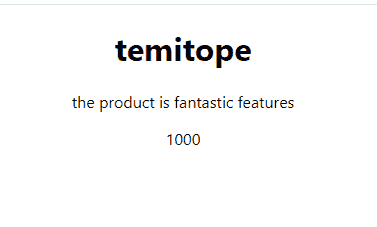

# 道具在 React 中如何工作——初学者指南

> 原文：<https://www.freecodecamp.org/news/beginners-guide-to-props-in-react/>

Props 用于存储 React 组件的子组件可以访问的数据。

它们是可重用性概念的一部分。属性代替了类属性，允许你在组件层次结构中创建一致的接口。

在本文中，我们将学习 React 中的道具。我们将了解它们是什么以及它们是如何工作的。然后我们将看看道具与状态相比如何。

我们将涵盖的内容:

*   什么是道具？
*   如何声明一个道具
*   如何使用`defaultProps`
*   React 中的道具 vs 状态

所以让我们开始吧！

## React 里的道具是什么？

Props 仅仅代表属性。它们使得组件可重用。因为它们执行一个重要的功能——将数据从一个组件传递到另一个组件。

道具充当组件通信的通道。属性从父节点传递到子节点，帮助子节点访问父节点树中的属性。

现在，假设我们有一个产品形式的组件，由产品名称、描述和价格组成。我们所要做的就是编写一次组件，并通过修改我们通过 props 传递的数据来多次重用它，从而将它呈现为所需的输出。

毫无价值的是:

*   我们在功能组件和基于类的组件中都使用了 props。
*   我们从上到下传递道具。我们也可以称之为祖先对后代，或父母对孩子。
*   道具是只读的。这意味着一旦一个组件收到一堆道具，我们就不能改变它，只能使用和消耗它，不能修改传递给组件的属性。如果我们想修改它，我们必须在 React 中引入我们称之为 state 的东西。

## 如何在 React 中使用道具

我们将使用我之前关于将产品作为组件并多次重用的解释来演示如何使用 props。

我们首先要看的是如何在不破坏的情况下使用道具。然后我们将看看如何使用析构的道具。

作为一个初学者，知道如何在不破坏的情况下使用道具是很重要的，这样你就可以理解道具是如何工作的。

### 不重组如何使用道具

首先，让我们创建一个功能组件:

```
import React from "react";

function MyProducts() {
  return (
    <div>

    </div>
  );
}

export default MyProducts;
```

然后我们要初始化我们的道具。所以我们的功能组件看起来像这样:

```
import React from "react";

function MyProducts(props) {
  return (
    <div>
      <h1>{props.name}</h1>
      <p>{props.description}</p>
      <p>{props.price}</p>
    </div>
  );
}

export default MyProducts;
```

所以基本上，我们把`props`作为函数中的一个参数传入。`props`作为参数传递给我们的功能组件。然后，我们试图通过编写以下代码来访问它:`props.name`、`props.price`和`props.description`。

现在我们已经完成了，我们可以返回到我们的`App.js`来渲染我们的产品，并将一些数据传递给这三个道具。道具像 HTML 属性一样传入。我们的`App.js`会是这样的:

```
import "./App.css";
import MyProducts from "./MyProducts";
function App() {
  return (
    <div className="App">
      <MyProducts
        name="temitope"
        description="the product has fantastic features"
        price={1000}
      />
    </div>
  );
}

export default App;
```

这是我们的结果:



所以下面是使用道具的逻辑。我们首先必须初始化它，然后我们需要访问道具和它拥有什么样的属性。然后，我们的呈现组件使用这些属性并将数据传递给它们。

道具得心应手！为什么？因为我们可以通过各种方式使一个组件可重用。为了证实这一点，我们将复制我们渲染出来的`MyProducts`,粘贴到另一行中，但这次传入一些其他数据:

```
import "./App.css";
import MyProducts from "./Myproducts";
function App() {
  return (
    <div className="App">
      <MyProducts
        name="temitope"
        description="the product is has fantastic features"
        price={1000}
      />
      <MyProducts
        name="iphone"
        description="awesome camera features!"
        price={5000}
      />
    </div>
  );
}

export default App;
```

因此，您可以看到我们只是重用了具有不同属性的相同组件。现在让我们看看如何传入带有析构的道具。

### 如何使用带有析构的道具

析构是一种 JavaScript 特性，允许您从数组或对象中提取数据部分。让我们看一个简单的例子来说明这是如何工作的。

假设我们有一个 todos 数组，并想获取该数组中的前两个元素。一个老方法是这样做:

```
const todo = ["bath","sleep","eat"];
// old way
const firstTodo = todo[0];//bath
const secondTodo = todo[1];//sleep

console.log(firstTodo);
console.log(secondTodo);
```

析构提供了一种更简单的方法:

```
const todo = ["bath","sleep","eat"];

// destructuring
const [firstTodo, secondTodo] = todo;// bath, sleep

console.log(firstTodo);
console.log(secondTodo); 
```

在 React 中，析构允许我们拆开或打开我们的道具，这让我们可以访问我们的道具，并以更可读的格式使用它们。

我们可以对上一节中的代码使用析构，如下所示:

```
import React from "react";

function MyProducts({ name, description, price }) {
  return (
    <div>
      <h1>{name}</h1>
      <p>{description}</p>
      <p>{price}</p>
    </div>
  );
}

export default MyProducts; 
```

这种方法和前一种方法的不同之处在于，我们把道具拆开，解构，然后渲染。如果我们检查我们的结果，我们会看到它仍然完好无损。

因为道具可以从上到下传递，所以我们可以创建另一个子组件，在其中传递父组件的属性。让我们看看它是怎么做的。

创建另一个名为`AdditionalDescription`的文件，并在其函数中以名称和描述的形式传入一些属性:

```
import React from "react";

function AdditionalDescription({ name, description }) {
  return (
    <div>

    </div>

  );
}

export default AdditionalDescription;
```

然后我们将有两个段落标签显示名称和描述。这将使该组件看起来像这样:

```
import React from "react";

function AdditionalDescription([name, description]) {
  return (
  <div>
      <p>{name}</p>
      <p>{description}</p>
  </div>
  )
}

export default AdditionalDescription;
```

现在让我们渲染我们的`AdditionalDescription`并传递一些道具给它:

```
<AdditionalDescription name={name} description={description} />
```

你会看到它在拿父母的道具。

## 如何设置道具的默认值

`defaultProps`是一个 React 组件属性，它允许我们为 props 参数设置默认值。当我们没有传入任何道具数据时，它通常会派上用场。

让我们继续创建一个默认道具:

```
import React from "react";

function MyProducts({ name, description, price }) {
  return (
    <div>
      <h1>{name}</h1>
      <p>{description}</p>
      <p>{price}</p>
    </div>
  );
}
Myproducts.defaultProps = {
  name: "temitope",
  description: "i like this feature",
  price: 500,
};

export default MyProducts;
```

就在导出组件之前，我们在代码末尾声明了属性的默认值。

为了声明默认属性，我们使用了组件名，后跟一个点，然后是`defaultProps`，这是在创建 React 应用程序时包含的。

这样，我们就不会有一个空的属性，因为这些值现在将是我们导入这个组件时的初始值。但是当我们向它传递数据时，默认值就会被覆盖。

## React 中的道具 vs 状态

状态是 React 中管理数据的另一种方式。那么状态和道具有什么不同呢？首先要注意的是，while props 是`read-only`并且是不可变的，而 states 是异步变化的并且是可变的。

状态会随着时间而改变，这种改变可以作为对用户动作或系统事件的响应而发生。只能在组件内部访问或修改状态。

另一方面，Props 允许数据从一个组件传递到另一个组件。下表显示了它们之间的区别:

| 序列号 | 道具 | 状态 |
| 1 | 道具是只读的 | 状态异步变化 |
| 2 | 它们是不可变的 | 他们是可变的 |
| 3 | 它们允许你将数据从一个组件传递到另一个组件 | 它们保存关于组件的信息 |
| 4 | 它们可以被子组件传递和访问 | 它们不能被子组件访问 |
| 5 | 道具基本上用于组件之间的通信 | 状态用于呈现动态变化 |
| 6 | 道具使组件可重用 | 状态不能使组件重用 |

## 包扎

这篇文章谈到了作为初学者需要了解的关于道具的一切。你学会了它们是什么以及如何使用它们。

我们还看了一下道具和状态的区别，引用了一些有用的例子，这样你就能完全理解什么是道具了。

如果你觉得这篇文章有帮助，请分享。感谢阅读！