# 如何用 React，Node，Socket.io，HarperDB 搭建实时聊天 App

> 原文：<https://www.freecodecamp.org/news/build-a-realtime-chat-app-with-react-express-socketio-and-harperdb/>

在本文中，我们将使用 Socket.io 和 HarperDB 构建一个带有聊天室的全栈实时聊天应用程序。

这将是一个很好的项目，学习如何将 fullstack 应用程序放在一起，以及如何创建一个后端可以与前端实时通信的应用程序。

通常，使用 HTTP 请求，服务器不能实时地将数据推送到客户机。但是使用 Socket.io，服务器能够将关于服务器上发生的一些事件的实时信息推送到客户端。

我们将要构建的应用程序将有两个页面:

加入聊天室页面:


和一个聊天室页面:

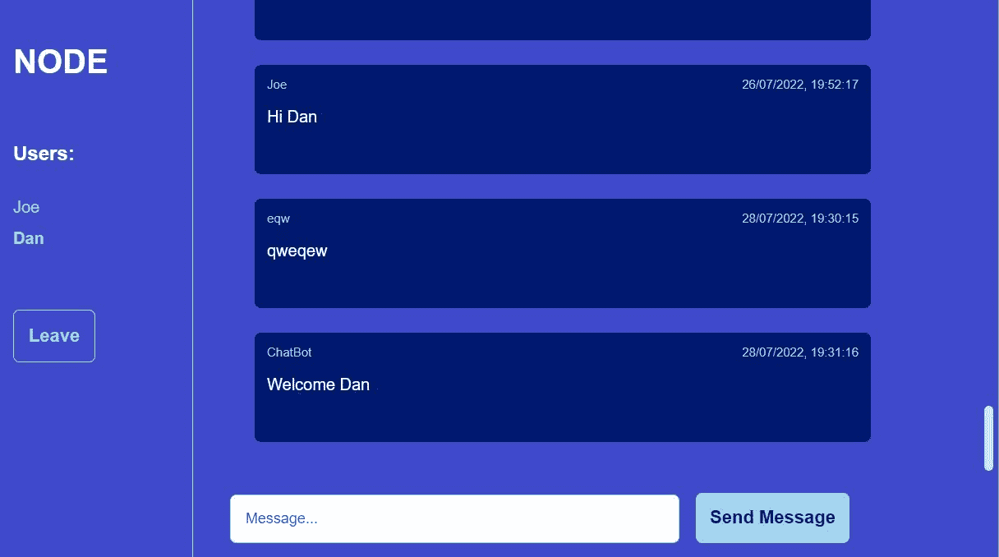

下面是我们将用来构建此应用程序的内容:

*   **前端** : [反应](https://reactjs.org/docs/create-a-new-react-app.html)(一个构建交互式应用的前端 JavaScript 框架)
*   **后端** : [节点](https://nodejs.org/en/)和 [Express](https://expressjs.com/) (Express 是非常流行的 NodeJS 框架，允许我们轻松创建 API 和后端)
*   ****数据库** :** [HarperDB](https://harperdb.io/) (一个数据+应用平台，允许你使用 SQL 或者 NoSQL 查询数据。HarperDB 还有一个内置的 API，让我们不必编写大量的后端代码)
*   **实时通信** : [Socket.io](https://socket.io/docs/v3/) (见下文！)

[下面是源代码](https://github.com/DoableDanny/Realtime-chat-app-with-rooms)(记得给它起个星星⭐).

## 目录

1.  [什么是 Socket.io？](#what-is-socket-io)
2.  [项目设置](#project-setup)
3.  [如何创建“加入房间”页面](#how-to-build-the-join-a-room-page)
4.  [如何设置服务器](#how-to-set-up-the-server)
5.  [如何在服务器上创建我们的第一个 Socket.io 事件监听器](#how-to-create-our-first-socket-io-event-listener-on-the-server)
6.  [房间如何在 Socket.io 中工作](#how-rooms-work-in-socket-io)
7.  [如何建立聊天页面](#how-to-build-the-chat-page)
8.  [如何创建消息组件(B)](#how-to-create-the-messages-component-b-)
9.  [如何在 HarperDB 中创建模式和表格](#how-to-create-a-schema-and-table-in-harperdb)
10.  [如何创建发送消息组件(C)](#how-to-create-the-send-message-component-c-)
11.  [如何设置 HarperDB 环境变量](#how-to-set-up-harperdb-environment-variables)
12.  [如何允许用户通过 Socket.io 互相发送消息](#how-to-allow-users-to-send-messages-to-each-other-with-socket-io)
13.  [如何从 HarperDB 获取消息](#how-to-get-messages-from-harperdb)
14.  [如何在客户端显示最近 100 条消息](#how-to-display-the-last-100-messages-on-the-client)
15.  [如何显示房间和用户(一)](#how-to-display-the-room-and-users-a-)
16.  [如何从 Socket.io 房间移除用户](#how-to-remove-a-user-from-a-socket-io-room)
17.  [如何添加 Socket.io 断开事件监听器](#how-to-add-the-socket-io-disconnect-event-listener)

## 什么是插座。木卫一？

插座。当服务器上发生事件时，IO 允许服务器将信息实时推送到客户端。

例如，如果你在玩一个多人游戏，一个事件可能是你的“朋友”对你进了一个精彩的球。

带插座。木卫一，你会(几乎)立即知道失球。

不带插座。IO，客户端将不得不进行多次轮询 AJAX 调用来验证服务器上是否发生了事件。例如，客户端可以使用 JavaScript 每 5 秒钟检查一次服务器上的事件。

插座。IO 意味着客户机不必多次轮询 AJAX 调用来验证服务器上是否发生了某个事件。相反，服务器一得到信息就发送给客户机。好多了。👌

所以，插座。IO 允许我们轻松构建实时应用程序，例如聊天应用程序和多人游戏。

## 项目设置

### 1.如何设置我们的文件夹

在您选择的文本编辑器中启动一个新项目(对我来说是 VS 代码)，并在根目录下创建两个名为 client 和 server 的文件夹。

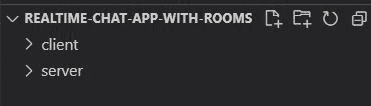

我们将在客户机文件夹中创建我们的前端 React 应用程序，在服务器文件夹中创建我们的 Node/Express 后端。

### 2.如何安装我们的客户端依赖项

在项目的根目录下打开一个终端(在 VS 代码中，你可以通过按 Ctrl+'或者转到*终端* - > *新建终端*来完成这个操作)

接下来，我们将 React 安装到我们的客户端目录中:

```
$ npx create-react-app client
```

React 安装后，将目录切换到客户端文件夹，并安装以下依赖项:

```
$ cd client
$ npm i react-router-dom socket.io-client
```

React-router-dom 将允许我们设置到不同 React 组件的路径——本质上是创建不同的页面。

Socket.io-client 是 Socket.io 的客户端版本，它允许我们向服务器“发出”事件。一旦被服务器接收到，我们就可以使用服务器版本的 socket.io 向与发送者在同一房间的用户发送消息，或者将用户加入套接字房间。

当我们用代码实现这些想法时，你会对此有更好的理解。

### 3.如何启动 React 应用程序

让我们通过从客户端目录运行以下命令来检查以确保一切正常:

```
$ npm start
```

Webpack 将构建 React 应用程序并将其提供给 [http://localhost:3000](http://localhost:3000) :

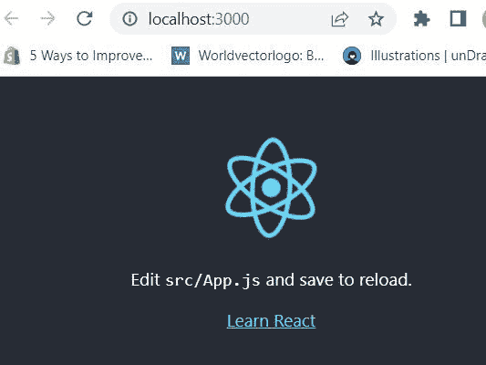

现在让我们设置 HarperDB 数据库，我们将使用它来永久保存用户发送的消息。

### 如何设置 HarperDB

首先，[用 HarperDB](https://studio.harperdb.io/) 创建一个帐户。

然后创建一个新的 HarperDB 云实例:

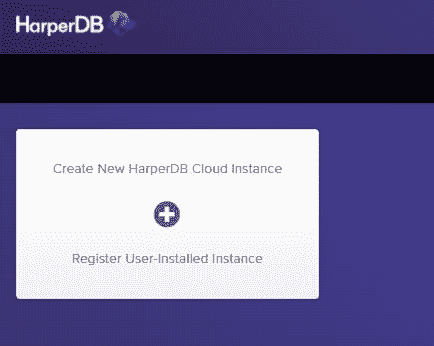

为了简单起见，选择云实例:


选择云提供商(我选择了 AWS):


命名云实例，并创建实例凭证:

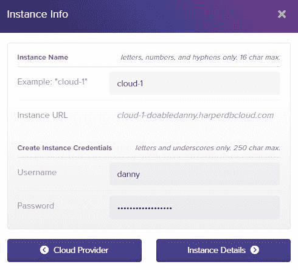

HarperDB 有一个慷慨的免费层，我们可以用于这个项目，所以选择:

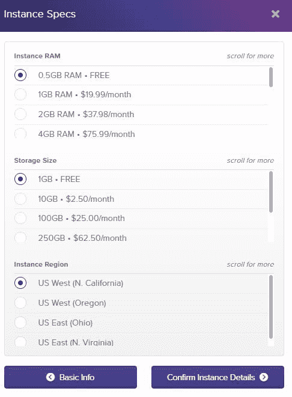

检查您的详细信息是否正确，然后创建实例。

创建实例需要几分钟时间，所以让我们开始制作我们的第一个 React 组件吧！

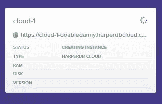

## 如何建立“加入房间”页面

我们的主页最终会变成这样:

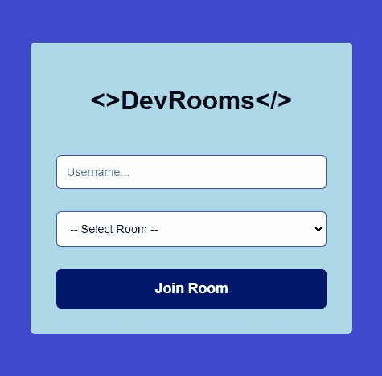

用户将输入用户名，从下拉列表中选择一个聊天室，然后单击“加入房间”。然后，用户将被带到聊天室页面。

所以，我们来做这个主页吧。

### 1.如何创建 HTML 表单并添加样式

在 *src/pages/home/index.js 处创建一个新文件*

我们将使用 CSS 模块向我们的应用程序添加基本样式，因此创建一个新文件:*src/pages/home/styles . module . CSS*。

我们的文件夹结构现在应该是这样的:

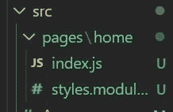

现在让我们创建基本的 HTML 表单:

```
// client/src/pages/home/index.js

import styles from './styles.module.css';

const Home = () => {
  return (
    <div className={styles.container}>
      <div className={styles.formContainer}>
        <h1>{`<>DevRooms</>`}</h1>
        <input className={styles.input} placeholder='Username...' />

        <select className={styles.input}>
          <option>-- Select Room --</option>
          <option value='javascript'>JavaScript</option>
          <option value='node'>Node</option>
          <option value='express'>Express</option>
          <option value='react'>React</option>
        </select>

        <button className='btn btn-secondary'>Join Room</button>
      </div>
    </div>
  );
};

export default Home;
```

上面，我们有一个简单的文本输入来获取用户名，还有一个选择下拉菜单，其中有一些默认选项，供用户选择要加入的聊天室。

现在让我们将这个组件导入 App.js，并使用 react-router-dom 包为该组件设置一个路由。这将是我们的主页，因此路径将是“/”:

```
// client/src/App.js

import './App.css';
import { BrowserRouter as Router, Routes, Route } from 'react-router-dom';
import Home from './pages/home';

function App() {
  return (
    <Router>
      <div className='App'>
        <Routes>
          <Route path='/' element={<Home />} />
        </Routes>
      </div>
    </Router>
  );
}

export default App;
```

现在，让我们添加一些基本样式，使我们的应用程序看起来更像样:

```
/* client/src/App.css */

html * {
  font-family: Arial;
  box-sizing: border-box;
}
body {
  margin: 0;
  padding: 0;
  overflow: hidden;
  background: rgb(63, 73, 204);
}
::-webkit-scrollbar {
  width: 20px;
}
::-webkit-scrollbar-track {
  background-color: transparent;
}
::-webkit-scrollbar-thumb {
  background-color: #d6dee1;
  border-radius: 20px;
  border: 6px solid transparent;
  background-clip: content-box;
}
::-webkit-scrollbar-thumb:hover {
  background-color: #a8bbbf;
}
.btn {
  padding: 14px 14px;
  border-radius: 6px;
  font-weight: bold;
  font-size: 1.1rem;
  cursor: pointer;
  border: none;
}
.btn-outline {
  color: rgb(153, 217, 234);
  border: 1px solid rgb(153, 217, 234);
  background: rgb(63, 73, 204);
}
.btn-primary {
  background: rgb(153, 217, 234);
  color: rgb(0, 24, 111);
}
.btn-secondary {
  background: rgb(0, 24, 111);
  color: #fff;
}
```

让我们添加特定于主页组件的样式:

```
/* client/src/pages/home/styles.module.css */

.container {
  height: 100vh;
  width: 100%;
  display: flex;
  justify-content: center;
  align-items: center;
  background: rgb(63, 73, 204);
}
.formContainer {
  width: 400px;
  margin: 0 auto 0 auto;
  padding: 32px;
  background: lightblue;
  border-radius: 6px;
  display: flex;
  flex-direction: column;
  align-items: center;
  gap: 28px;
}
.input {
  width: 100%;
  padding: 12px;
  border-radius: 6px;
  border: 1px solid rgb(63, 73, 204);
  font-size: 0.9rem;
}
.input option {
  margin-top: 20px;
} 
```

让我们也通过添加一个样式属性使“加入房间”按钮全幅显示:

```
// client/src/pages/home/index.js

<button className='btn btn-secondary' style={{ width: '100%' }}>Join Room</button>
```

我们的主页现在看起来很坚固:

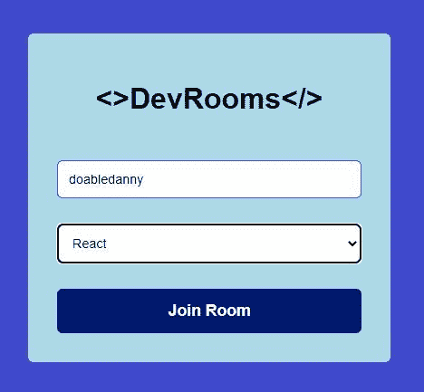

### 2.如何向加入房间表单添加功能

现在我们有了一个基本的表单和样式，所以是时候添加一些功能了。

下面是我们希望当用户点击“加入房间”按钮时发生的情况:

1.  检查用户名和房间字段是否已填写。
2.  如果是这样，我们向服务器发出一个套接字事件。
3.  将用户重定向到聊天页面(我们将在后面创建)。

我们需要创建一些状态来存储用户名和房间的值。我们还需要创建一个套接字实例。

我们可以直接在我们的 home 组件中创建这些状态，但是我们的聊天页面也需要访问*用户名*、*房间*和*套接字*。因此，我们将状态提升到 App.js，然后我们可以将这些变量传递到主页和聊天页面组件。

因此，让我们在 App.js 中创建我们的状态并设置一个套接字，并将这些变量作为道具传递给<home>组件。我们还将传递 set state 函数，这样我们就可以改变来自<home>的状态:</home></home>

```
// client/src/App.js

import './App.css';
import { useState } from 'react'; // Add this
import { BrowserRouter as Router, Routes, Route } from 'react-router-dom';
import io from 'socket.io-client'; // Add this
import Home from './pages/home';

const socket = io.connect('http://localhost:4000'); // Add this -- our server will run on port 4000, so we connect to it from here

function App() {
  const [username, setUsername] = useState(''); // Add this
  const [room, setRoom] = useState(''); // Add this

  return (
    <Router>
      <div className='App'>
        <Routes>
          <Route
            path='/'
            element={
              <Home
                username={username} // Add this
                setUsername={setUsername} // Add this
                room={room} // Add this
                setRoom={setRoom} // Add this
                socket={socket} // Add this
              />
            }
          />
        </Routes>
      </div>
    </Router>
  );
}

export default App; 
```

我们现在可以在我们的 Home 组件中访问这些道具。我们将使用析构来获得道具:

```
// client/src/pages/home/index.js

import styles from './style.module.css';

const Home = ({ username, setUsername, room, setRoom, socket }) => {
  return (
    // ...
  );
};

export default Home;
```

当用户输入用户名或选择房间时，我们需要更新*用户名*和*房间*状态变量:

```
// client/src/pages/home/index.js

// ...

const Home = ({ username, setUsername, room, setRoom, socket }) => {
  return (
    <div className={styles.container}>
      // ...
        <input
          className={styles.input}
          placeholder='Username...'
          onChange={(e) => setUsername(e.target.value)} // Add this
        />

        <select
          className={styles.input}
          onChange={(e) => setRoom(e.target.value)} // Add this
        >
         // ...
        </select>

        // ...
    </div>
  );
};

export default Home; 
```

现在我们正在捕获用户输入的数据，我们可以为用户单击“加入房间”按钮创建一个 *joinRoom()* 回调函数:

```
// client/src/pages/home/index.js

// ...

const Home = ({ username, setUsername, room, setRoom, socket }) => {

  // Add this
  const joinRoom = () => {
    if (room !== '' && username !== '') {
      socket.emit('join_room', { username, room });
    }
  };

  return (
    <div className={styles.container}>
      // ...

        <button
          className='btn btn-secondary'
          style={{ width: '100%' }}
          onClick={joinRoom} // Add this
        >
          Join Room
        </button>
      // ...
    </div>
  );
};

export default Home; 
```

上面，当用户单击按钮时，会发出一个名为 *join_room* 的套接字事件，以及一个包含用户用户名和所选房间的对象。这个事件稍后会被我们的服务器接收到，在那里我们会做一些魔术。

为了完成我们的主页组件，我们需要在我们的 *joinRoom()* 函数的底部添加一个重定向，将用户带到*/聊天*页面:

```
// client/src/pages/home/index.js

// ...
import { useNavigate } from 'react-router-dom'; // Add this

const Home = ({ username, setUsername, room, setRoom, socket }) => {
  const navigate = useNavigate(); // Add this

  const joinRoom = () => {
    if (room !== '' && username !== '') {
      socket.emit('join_room', { username, room });
    }

    // Redirect to /chat
    navigate('/chat', { replace: true }); // Add this
  };

 // ... 
```

测试一下:输入用户名并选择一个房间，然后点击*加入房间*。你应该被带到路线[http://localhost:3000/chat](http://localhost:3000/chat)——目前是一个空页面。

但是在我们创建聊天页面前端之前，让我们在服务器上运行一些东西。

## 如何设置服务器

在服务器上，我们将监听前端发出的套接字事件。目前，我们只有一个从 React 发出的 join_room 事件，所以我们将首先添加这个事件侦听器。

但在此之前，我们需要安装我们的服务器依赖项，并让服务器启动和运行。

### 1.如何安装服务器依赖项

打开一个新的终端(在 VS 代码中:Terminal->New Terminal)，将目录切换到我们的服务器文件夹，初始化 package.json 文件，并安装以下依赖项:

```
$ cd server
$ npm init -y
$ npm i axios cors express socket.io dotenv
```

*   Axios 是一个很容易向 API 发出请求的常用包。
*   Cors 允许我们的客户端向其他来源发出请求——这是 socket.io 正常工作所必需的。参见[什么是 CORS？如果你以前没听说过 CORS。](https://medium.com/@electra_chong/what-is-cors-what-is-it-used-for-308cafa4df1a)
*   Express 是一个 NodeJS 框架，它允许我们用更少的代码更容易地编写后端。
*   Socket.io 是一个允许客户端和服务器实时通信的库——这对于标准的 HTTP 请求是不可能的。
*   Dotenv 是一个模块，它允许我们安全地存储私钥和密码，并在需要时将它们加载到我们的代码中。

我们还将安装 nodemon 作为开发依赖项，这样我们就不必在每次修改代码时重启服务器，从而节省了我们的时间和精力:

```
$ npm i -D nodemon
```

### 2.如何启动我们的服务器

在我们的服务器目录的根目录下创建一个名为 index.js 的文件夹，并添加以下代码来启动并运行服务器:

```
// server/index.js

const express = require('express');
const app = express();
const http = require('http');
const cors = require('cors');

app.use(cors()); // Add cors middleware

const server = http.createServer(app);

server.listen(4000, () => 'Server is running on port 4000');
```

在我们的服务器上打开 package.json 文件，添加一个允许我们在开发中使用 nodemon 的脚本:

```
{
  ...
  "scripts": {
    "dev": "nodemon index.js"
  },
  ...
} 
```

现在，让我们通过运行以下命令启动我们的服务器:

```
$ npm run dev
```

我们可以通过添加 get 请求处理程序来快速检查我们的服务器是否正常运行:

```
// server/index.js

const express = require('express');
const app = express();
http = require('http');
const cors = require('cors');

app.use(cors()); // Add cors middleware

const server = http.createServer(app);

// Add this
app.get('/', (req, res) => {
  res.send('Hello world');
});

server.listen(4000, () => 'Server is running on port 3000');
```

现在去 [http://localhost:4000/](http://localhost:4000/) :

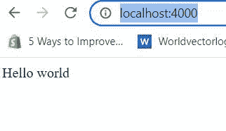

我们的服务器已经启动并运行。现在是时候做一些服务器端的 Socket.io 工作了！

## 如何在服务器上创建我们的第一个 Socket.io 事件监听器

还记得我们从客户端发出一个 *join_room* 事件吗？嗯，我们很快就会在服务器上监听该事件，并将用户添加到一个套接字房间。

但是首先，我们需要监听客户端何时通过 socket.io-client 连接到服务器。

```
// server/index.js

const express = require('express');
const app = express();
http = require('http');
const cors = require('cors');
const { Server } = require('socket.io'); // Add this

app.use(cors()); // Add cors middleware

const server = http.createServer(app); // Add this

// Add this
// Create an io server and allow for CORS from http://localhost:3000 with GET and POST methods
const io = new Server(server, {
  cors: {
    origin: 'http://localhost:3000',
    methods: ['GET', 'POST'],
  },
});

// Add this
// Listen for when the client connects via socket.io-client
io.on('connection', (socket) => {
  console.log(`User connected ${socket.id}`);

  // We can write our socket event listeners in here...
});

server.listen(4000, () => 'Server is running on port 3000');
```

现在，当客户端从前端连接时，后端会捕获连接事件，并使用特定客户端的唯一套接字 id 记录`User connected`。

让我们测试一下服务器现在是否正在从客户端捕获连接事件。在 [http://localhost:3000/](http://localhost:3000/) 访问您的 React 应用程序并刷新页面。

您应该在服务器终端控制台中看到以下日志:


太棒了，我们的客户端已经通过 socket.io 连接到我们的服务器。我们的客户端和服务器现在可以实时通信了！

## Socket.io 中房间的工作方式

从 [Socket.io 文档](https://socket.io/docs/v3/rooms/):

> “一个*室*是插座可以`join`和`leave`的任意通道。它可用于向客户端子集广播事件。”

因此，我们可以将用户加入一个房间，然后服务器可以向该房间中的所有用户发送消息，允许用户实时相互发送消息。酷！

### 如何将用户加入 Socket.io 房间

一旦用户通过 Socket.io 进行了连接，我们就可以在服务器上添加我们的 Socket 事件监听器来监听从客户端发出的事件。此外，我们可以在服务器上发出事件，并在客户机上监听它们。

现在让我们监听 *join_room* 事件，捕获数据(用户名和房间)，并将用户添加到一个套接字房间:

```
// server/index.js

// Listen for when the client connects via socket.io-client
io.on('connection', (socket) => {
  console.log(`User connected ${socket.id}`);

  // Add this
  // Add a user to a room
  socket.on('join_room', (data) => {
    const { username, room } = data; // Data sent from client when join_room event emitted
    socket.join(room); // Join the user to a socket room
  });
});
```

### 如何向房间中的用户发送消息

现在，让我们向房间中除了刚刚加入的用户之外的所有用户发送一条消息，通知他们有新用户加入了:

```
// server/index.js

const CHAT_BOT = 'ChatBot'; // Add this
// Listen for when the client connects via socket.io-client
io.on('connection', (socket) => {
  console.log(`User connected ${socket.id}`);

  // Add a user to a room
  socket.on('join_room', (data) => {
    const { username, room } = data; // Data sent from client when join_room event emitted
    socket.join(room); // Join the user to a socket room

    // Add this
    let __createdtime__ = Date.now(); // Current timestamp
    // Send message to all users currently in the room, apart from the user that just joined
    socket.to(room).emit('receive_message', {
      message: `${username} has joined the chat room`,
      username: CHAT_BOT,
      __createdtime__,
    });
  });
});
```

上面，我们向当前用户刚刚加入的房间中的所有客户端发出一个 receive_message 事件，以及一些数据:消息、发送消息的用户名和消息发送的时间。

稍后，我们将在 React 应用程序中添加一个事件监听器来捕获这个事件，并在屏幕上输出消息。

让我们也向新加入的用户发送一条欢迎消息:

```
// server/index.js

io.on('connection', (socket) => {
  // ...

    // Add this
    // Send welcome msg to user that just joined chat only
    socket.emit('receive_message', {
      message: `Welcome ${username}`,
      username: CHAT_BOT,
      __createdtime__,
    });
  });
});
```

当我们向 Socket.io 房间添加用户时，Socket.io 只存储每个用户的套接字 id。但是我们需要房间里每个人的用户名以及房间名。因此，让我们将数据存储在服务器上的变量中:

```
// server/index.js

// ...

const CHAT_BOT = 'ChatBot';
// Add this
let chatRoom = ''; // E.g. javascript, node,...
let allUsers = []; // All users in current chat room

// Listen for when the client connects via socket.io-client
io.on('connection', (socket) => {
    // ...

    // Add this
    // Save the new user to the room
    chatRoom = room;
    allUsers.push({ id: socket.id, username, room });
    chatRoomUsers = allUsers.filter((user) => user.room === room);
    socket.to(room).emit('chatroom_users', chatRoomUsers);
    socket.emit('chatroom_users', chatRoomUsers);
  });
});
```

上面，我们还通过 *chatroom_users* 事件将所有聊天室用户的数组发送回客户端，这样我们就可以在前端列出房间中的所有用户名。

在我们向我们的服务器添加任何代码之前，让我们回到我们的前端并创建聊天页面——这样我们就可以测试我们是否正在接收 *receive_message* 事件。

## 如何建立聊天页面

在您的客户端文件夹中，创建两个新文件:

1.  src/page/chat/index . js
2.  src/pages/chat/styles . module . CSS

让我们添加一些将在聊天页面和组件中使用的样式:

```
/* client/src/pages/chat/styles.module.css */

.chatContainer {
  max-width: 1100px;
  margin: 0 auto;
  display: grid;
  grid-template-columns: 1fr 4fr;
  gap: 20px;
}

/* Room and users component */
.roomAndUsersColumn {
  border-right: 1px solid #dfdfdf;
}
.roomTitle {
  margin-bottom: 60px;
  text-transform: uppercase;
  font-size: 2rem;
  color: #fff;
}
.usersTitle {
  font-size: 1.2rem;
  color: #fff;
}
.usersList {
  list-style-type: none;
  padding-left: 0;
  margin-bottom: 60px;
  color: rgb(153, 217, 234);
}
.usersList li {
  margin-bottom: 12px;
}

/* Messages */
.messagesColumn {
  height: 85vh;
  overflow: auto;
  padding: 10px 10px 10px 40px;
}
.message {
  background: rgb(0, 24, 111);
  border-radius: 6px;
  margin-bottom: 24px;
  max-width: 600px;
  padding: 12px;
}
.msgMeta {
  color: rgb(153, 217, 234);
  font-size: 0.75rem;
}
.msgText {
  color: #fff;
}

/* Message input and button */
.sendMessageContainer {
  padding: 16px 20px 20px 16px;
}
.messageInput {
  padding: 14px;
  margin-right: 16px;
  width: 60%;
  border-radius: 6px;
  border: 1px solid rgb(153, 217, 234);
  font-size: 0.9rem;
} 
```

现在，让我们看看我们的聊天页面最终会是什么样子:


在一个文件中添加这个页面的所有代码和逻辑可能会变得混乱和难以管理，所以让我们利用这样一个事实:我们正在使用一个令人敬畏的前端框架(React) 和**将我们的页面分成组件**:

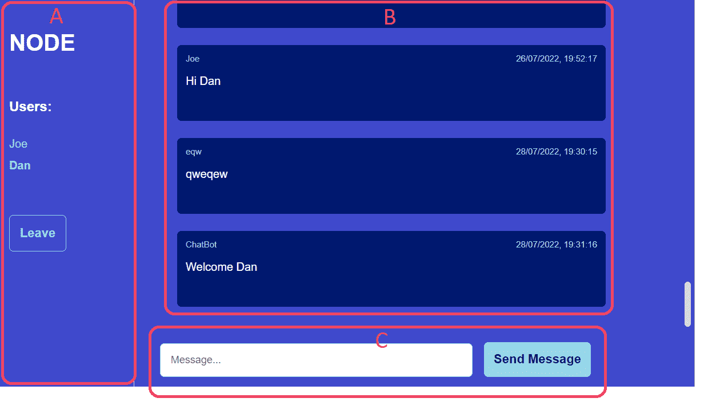

### 聊天页面组件:

**A** :包含房间名称、该房间的用户列表以及将用户从房间中移除的“离开”按钮。

**B** :已发送的消息。在初始呈现时，该房间中发送的最后 100 条消息将从数据库中取出并显示给用户。

**C** :输入和发送信息的按钮。

我们将首先创建组件 B，这样我们可以向用户显示消息。

## 如何创建消息组件(B)

在 src/pages/chat/messages.js 处创建一个新文件，并添加以下代码:

```
// client/src/pages/chat/messages.js

import styles from './styles.module.css';
import { useState, useEffect } from 'react';

const Messages = ({ socket }) => {
  const [messagesRecieved, setMessagesReceived] = useState([]);

  // Runs whenever a socket event is recieved from the server
  useEffect(() => {
    socket.on('receive_message', (data) => {
      console.log(data);
      setMessagesReceived((state) => [
        ...state,
        {
          message: data.message,
          username: data.username,
          __createdtime__: data.__createdtime__,
        },
      ]);
    });

	// Remove event listener on component unmount
    return () => socket.off('receive_message');
  }, [socket]);

  // dd/mm/yyyy, hh:mm:ss
  function formatDateFromTimestamp(timestamp) {
    const date = new Date(timestamp);
    return date.toLocaleString();
  }

  return (
    <div className={styles.messagesColumn}>
      {messagesRecieved.map((msg, i) => (
        <div className={styles.message} key={i}>
          <div style={{ display: 'flex', justifyContent: 'space-between' }}>
            <span className={styles.msgMeta}>{msg.username}</span>
            <span className={styles.msgMeta}>
              {formatDateFromTimestamp(msg.__createdtime__)}
            </span>
          </div>
          <p className={styles.msgText}>{msg.message}</p>
          <br />
        </div>
      ))}
    </div>
  );
};

export default Messages;
```

上图中，我们有一个 *useEffect* 钩子，每当接收到一个套接字事件时就会运行。然后，我们将消息数据传递给 *receive_message* 事件监听器。在那里，我们设置了 *messagesReceived* 状态，这是一个包含消息、发送者用户名和消息发送日期的 message 对象数组。

让我们将新的 messages 组件导入到聊天页面中，然后在 App.js 中为聊天页面创建一个路由:

```
// client/src/pages/chat/index.js

import styles from './styles.module.css';
import MessagesReceived from './messages';

const Chat = ({ socket }) => {
  return (
    <div className={styles.chatContainer}>
      <div>
        <MessagesReceived socket={socket} />
      </div>
    </div>
  );
};

export default Chat; 
```

```
// client/src/App.js

import './App.css';
import { useState } from 'react';
import Home from './pages/home';
import Chat from './pages/chat';
import { BrowserRouter as Router, Routes, Route } from 'react-router-dom';
import io from 'socket.io-client';

const socket = io.connect('http://localhost:4000');

function App() {
  const [username, setUsername] = useState('');
  const [room, setRoom] = useState('');

  return (
    <Router>
      <div className='App'>
        <Routes>
          <Route
            path='/'
            element={
              <Home
                username={username}
                setUsername={setUsername}
                room={room}
                setRoom={setRoom}
                socket={socket}
              />
            }
          />
          {/* Add this */}
          <Route
            path='/chat'
            element={<Chat username={username} room={room} socket={socket} />}
          />
        </Routes>
      </div>
    </Router>
  );
}

export default App; 
```

让我们来测试一下:转到主页并加入一个房间:

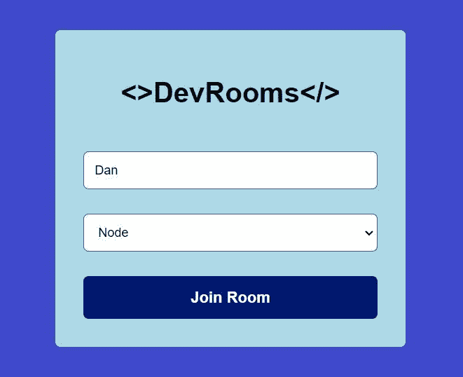

我们应该被带到聊天页面，并收到来自*聊天机器人*的欢迎消息:

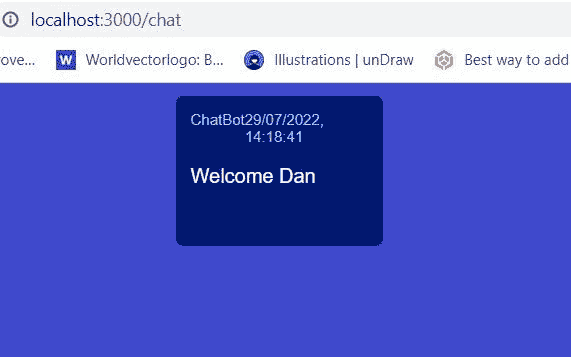

用户现在可以看到他们收到的消息。厉害！

接下来:设置我们的数据库，这样我们就可以永久保存邮件。

## 如何在 HarperDB 中创建模式和表

回到你的 HarperDB 仪表板，点击“浏览”。然后创建一个名为“realtime_chat_app”的新模式。模式只是一组表。

在该模式中，创建一个名为“messages”的表，其散列属性为“id”。

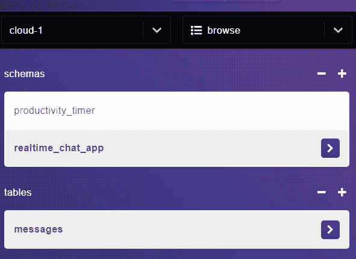

我们现在有了存储消息的地方，所以让我们创建 SendMessage 组件。

## 如何创建发送消息组件(C)

创建文件 src/pages/chat/send-message.js，并添加以下代码:

```
// client/src/pages/chat/send-message.js

import styles from './styles.module.css';
import React, { useState } from 'react';

const SendMessage = ({ socket, username, room }) => {
  const [message, setMessage] = useState('');

  const sendMessage = () => {
    if (message !== '') {
      const __createdtime__ = Date.now();
      // Send message to server. We can't specify who we send the message to from the frontend. We can only send to server. Server can then send message to rest of users in room
      socket.emit('send_message', { username, room, message, __createdtime__ });
      setMessage('');
    }
  };

  return (
    <div className={styles.sendMessageContainer}>
      <input
        className={styles.messageInput}
        placeholder='Message...'
        onChange={(e) => setMessage(e.target.value)}
        value={message}
      />
      <button className='btn btn-primary' onClick={sendMessage}>
        Send Message
      </button>
    </div>
  );
};

export default SendMessage;
```

上面，当用户点击“Send Message”按钮时，一个 send_message 套接字事件和一个 Message 对象被发送到服务器。我们将很快在服务器上处理这个事件。

将*发送消息*导入我们的聊天页面:

```
// src/pages/chat/index.js

import styles from './styles.module.css';
import MessagesReceived from './messages';
import SendMessage from './send-message';

const Chat = ({ username, room, socket }) => {
  return (
    <div className={styles.chatContainer}>
      <div>
        <MessagesReceived socket={socket} />
        <SendMessage socket={socket} username={username} room={room} />
      </div>
    </div>
  );
};

export default Chat;
```

聊天页面现在看起来像这样:

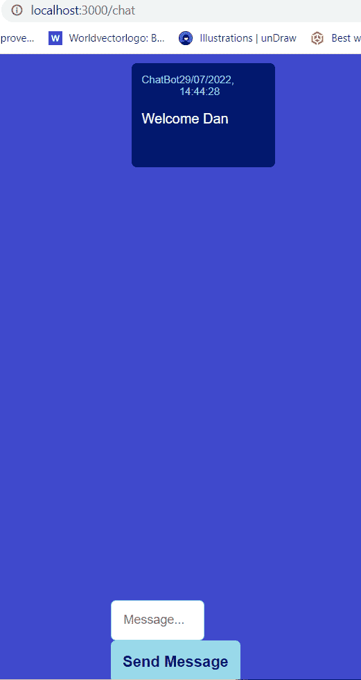

接下来，我们需要设置 HarperDB 环境变量，这样我们就可以开始与数据库进行交互。

## 如何设置 HarperDB 环境变量

为了能够在 HarperDB 中保存消息，您需要 HarperDB 实例 URL 和 API 密码。

在 HarperDB 仪表板中，单击您的实例，然后转到“config”。您将发现您的实例 URL 和您的实例 API Auth 头——即您的“超级用户”密码，它允许您向数据库发出任何请求——仅供您查看！

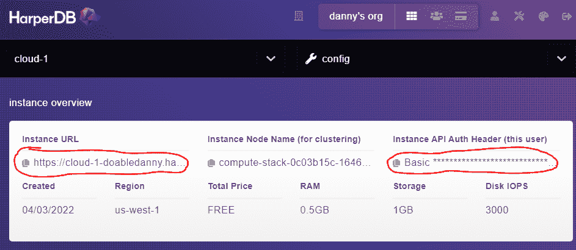

我们将这些变量存储在一个. env 文件中。警告:不要推动。env 文件到 GitHub！该文件不应公开。变量是通过后台服务器加载的。

创建以下文件并添加您的 HarperDB URL 和密码:

```
// server/.env

HARPERDB_URL="<your url goes here>"
HARPERDB_PW="Basic <your password here>"
```

我们还将创建一个. gitignore 文件来防止。env 与 node_modules 文件夹一起被推送到 GitHub:

```
// server/.gitignore

.env
node_modules
```

注意:精通 Git 和 GitHub 是所有开发人员的必备技能。如果您需要升级您的 Git 游戏，请查看我的 [Git 工作流文章](https://www.doabledanny.com/git-workflows)。

或者，如果你发现自己经常需要查找相同的 Git 命令，并且想要一种快速的方法来查找、修改和复制/粘贴命令——看看我的流行的 [Git 命令备忘单 PDF](https://doabledanny.gumroad.com/l/git-commands-cheat-sheet-pdf) 和[物理 Git 备忘单海报](https://doabledanny.gumroad.com/l/git-cheat-sheet-poster)。

最后，让我们将这段代码添加到主服务器文件的顶部，将环境变量加载到服务器中:

```
// server/index.js

require('dotenv').config();
console.log(process.env.HARPERDB_URL); // remove this after you've confirmed it working
const express = require('express');
// ...
```

## 如何允许用户用 Socket.io 互相发送消息

在服务器上，我们将监听 *send_message* 事件，然后将消息发送给房间内的所有用户:

```
// server/index.js

const express = require('express');
// ...
const harperSaveMessage = require('./services/harper-save-message'); // Add this

// ...

// Listen for when the client connects via socket.io-client
io.on('connection', (socket) => {

  // ...

  // Add this
  socket.on('send_message', (data) => {
    const { message, username, room, __createdtime__ } = data;
    io.in(room).emit('receive_message', data); // Send to all users in room, including sender
    harperSaveMessage(message, username, room, __createdtime__) // Save message in db
      .then((response) => console.log(response))
      .catch((err) => console.log(err));
  });
});

server.listen(4000, () => 'Server is running on port 3000'); 
```

我们现在需要创建 *harperSaveMessage* 函数。在 server/services/Harper-save-message . js 处创建一个新文件，并添加以下内容:

```
// server/services/harper-save-message.js

var axios = require('axios');

function harperSaveMessage(message, username, room) {
  const dbUrl = process.env.HARPERDB_URL;
  const dbPw = process.env.HARPERDB_PW;
  if (!dbUrl || !dbPw) return null;

  var data = JSON.stringify({
    operation: 'insert',
    schema: 'realtime_chat_app',
    table: 'messages',
    records: [
      {
        message,
        username,
        room,
      },
    ],
  });

  var config = {
    method: 'post',
    url: dbUrl,
    headers: {
      'Content-Type': 'application/json',
      Authorization: dbPw,
    },
    data: data,
  };

  return new Promise((resolve, reject) => {
    axios(config)
      .then(function (response) {
        resolve(JSON.stringify(response.data));
      })
      .catch(function (error) {
        reject(error);
      });
  });
}

module.exports = harperSaveMessage; 
```

如上所述，保存数据可能需要一点时间，所以我们返回一个承诺，如果数据保存成功，该承诺将被解决，否则将被拒绝。

如果你想知道我从哪里得到上面的代码，HarperDB 在他们的工作室仪表板中提供了一个很棒的"[代码示例](https://studio.harperdb.io/resources/examples/QuickStart%20Examples/Create%20dev%20Schema)"部分，这使得生活变得更加容易:

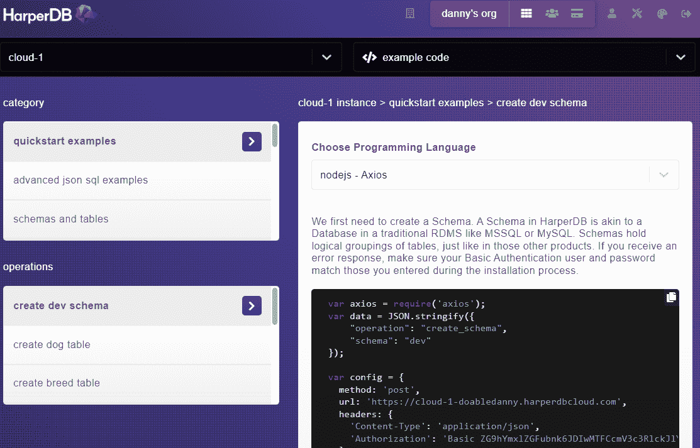

考验的时候到了！以用户身份加入房间，然后发送消息。然后转到 HarperDB 并点击“浏览”，然后点击“消息”表。您应该会在数据库中看到您的消息:

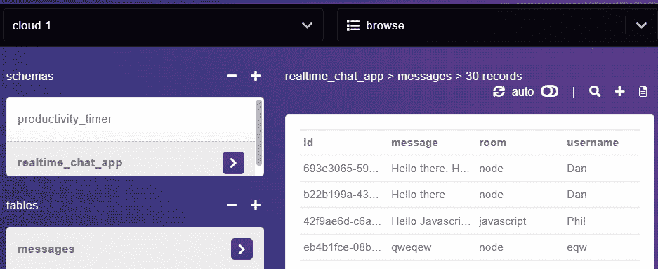

凉爽的😎。那么接下来呢？嗯，如果当用户加入房间时，房间中发送的最后 100 条消息被加载，那就太好了，不是吗？

## 如何从 HarperDB 获取消息

在服务器上，让我们创建一个函数来获取在特定房间中发送的最后 100 条消息(注意 HarperDB 还允许我们使用 SQL 查询👌):

```
// server/services/harper-get-messages.js

let axios = require('axios');

function harperGetMessages(room) {
  const dbUrl = process.env.HARPERDB_URL;
  const dbPw = process.env.HARPERDB_PW;
  if (!dbUrl || !dbPw) return null;

  let data = JSON.stringify({
    operation: 'sql',
    sql: `SELECT * FROM realtime_chat_app.messages WHERE room = '${room}' LIMIT 100`,
  });

  let config = {
    method: 'post',
    url: dbUrl,
    headers: {
      'Content-Type': 'application/json',
      Authorization: dbPw,
    },
    data: data,
  };

  return new Promise((resolve, reject) => {
    axios(config)
      .then(function (response) {
        resolve(JSON.stringify(response.data));
      })
      .catch(function (error) {
        reject(error);
      });
  });
}

module.exports = harperGetMessages;
```

每当用户加入房间时，我们都会调用这个函数:

```
// server/index.js

// ...
const harperSaveMessage = require('./services/harper-save-message');
const harperGetMessages = require('./services/harper-get-messages'); // Add this

// ...

// Listen for when the client connects via socket.io-client
io.on('connection', (socket) => {
  console.log(`User connected ${socket.id}`);

  // Add a user to a room
  socket.on('join_room', (data) => {

    // ...

    // Add this
    // Get last 100 messages sent in the chat room
    harperGetMessages(room)
      .then((last100Messages) => {
        // console.log('latest messages', last100Messages);
        socket.emit('last_100_messages', last100Messages);
      })
      .catch((err) => console.log(err));
  });

 // ...
```

上面，如果成功获取了消息，我们发出一个名为 *last_100_messages* 的 Socket.io 事件。我们现在将在前端监听这个事件。

## 如何在客户端显示最近 100 条消息

下面，我们为 *last_100_messages* 事件*添加一个包含 Socket.io 事件监听器的 useEffect 钩子。*从那里，消息按日期顺序排序，最新的在底部，并且*消息接收*状态被更新。

当 *messagesReceived* 更新时，useEffect 运行以将 *messageColumn* div 滚动到最近的消息。这改善了我们的应用程序*T5 的用户体验👍。*

```
// client/src/pages/chat/messages.js

import styles from './styles.module.css';
import { useState, useEffect, useRef } from 'react';

const Messages = ({ socket }) => {
  const [messagesRecieved, setMessagesReceived] = useState([]);

  const messagesColumnRef = useRef(null); // Add this

  // Runs whenever a socket event is recieved from the server
  useEffect(() => {
    socket.on('receive_message', (data) => {
      console.log(data);
      setMessagesReceived((state) => [
        ...state,
        {
          message: data.message,
          username: data.username,
          __createdtime__: data.__createdtime__,
        },
      ]);
    });

    // Remove event listener on component unmount
    return () => socket.off('receive_message');
  }, [socket]);

  // Add this
  useEffect(() => {
    // Last 100 messages sent in the chat room (fetched from the db in backend)
    socket.on('last_100_messages', (last100Messages) => {
      console.log('Last 100 messages:', JSON.parse(last100Messages));
      last100Messages = JSON.parse(last100Messages);
      // Sort these messages by __createdtime__
      last100Messages = sortMessagesByDate(last100Messages);
      setMessagesReceived((state) => [...last100Messages, ...state]);
    });

    return () => socket.off('last_100_messages');
  }, [socket]);

  // Add this
  // Scroll to the most recent message
  useEffect(() => {
    messagesColumnRef.current.scrollTop =
      messagesColumnRef.current.scrollHeight;
  }, [messagesRecieved]);

  // Add this
  function sortMessagesByDate(messages) {
    return messages.sort(
      (a, b) => parseInt(a.__createdtime__) - parseInt(b.__createdtime__)
    );
  }

  // dd/mm/yyyy, hh:mm:ss
  function formatDateFromTimestamp(timestamp) {
    const date = new Date(timestamp);
    return date.toLocaleString();
  }

  return (
    // Add ref to this div
    <div className={styles.messagesColumn} ref={messagesColumnRef}>
      {messagesRecieved.map((msg, i) => (
        <div className={styles.message} key={i}>
          <div style={{ display: 'flex', justifyContent: 'space-between' }}>
            <span className={styles.msgMeta}>{msg.username}</span>
            <span className={styles.msgMeta}>
              {formatDateFromTimestamp(msg.__createdtime__)}
            </span>
          </div>
          <p className={styles.msgText}>{msg.message}</p>
          <br />
        </div>
      ))}
    </div>
  );
};

export default Messages; 
```

## 如何显示房间和用户(一)

我们已经制作了组件 B 和 C，所以让我们通过制作 a 来完成事情。


在服务器上，当用户加入一个房间时，我们发出一个 *chatroom_users* 事件，将房间中的所有用户发送到该房间中的所有客户端。让我们在名为 *RoomAndUsers 的组件中监听该事件。*

下面还有一个“离开”按钮，当按下时，会向服务器发送一个 *leave_room* 事件。然后，它将用户重定向回主页。

```
// client/src/pages/chat/room-and-users.js

import styles from './styles.module.css';
import { useState, useEffect } from 'react';
import { useNavigate } from 'react-router-dom';

const RoomAndUsers = ({ socket, username, room }) => {
  const [roomUsers, setRoomUsers] = useState([]);

  const navigate = useNavigate();

  useEffect(() => {
    socket.on('chatroom_users', (data) => {
      console.log(data);
      setRoomUsers(data);
    });

    return () => socket.off('chatroom_users');
  }, [socket]);

  const leaveRoom = () => {
    const __createdtime__ = Date.now();
    socket.emit('leave_room', { username, room, __createdtime__ });
    // Redirect to home page
    navigate('/', { replace: true });
  };

  return (
    <div className={styles.roomAndUsersColumn}>
      <h2 className={styles.roomTitle}>{room}</h2>

      <div>
        {roomUsers.length > 0 && <h5 className={styles.usersTitle}>Users:</h5>}
        <ul className={styles.usersList}>
          {roomUsers.map((user) => (
            <li
              style={{
                fontWeight: `${user.username === username ? 'bold' : 'normal'}`,
              }}
              key={user.id}
            >
              {user.username}
            </li>
          ))}
        </ul>
      </div>

      <button className='btn btn-outline' onClick={leaveRoom}>
        Leave
      </button>
    </div>
  );
};

export default RoomAndUsers;
```

让我们将这个组件导入聊天页面:

```
// client/src/pages/chat/index.js

import styles from './styles.module.css';
import RoomAndUsersColumn from './room-and-users'; // Add this
import SendMessage from './send-message';
import MessagesReceived from './messages';

const Chat = ({ username, room, socket }) => {
  return (
    <div className={styles.chatContainer}>
      {/* Add this */}
      <RoomAndUsersColumn socket={socket} username={username} room={room} />

      <div>
        <MessagesReceived socket={socket} />
        <SendMessage socket={socket} username={username} room={room} />
      </div>
    </div>
  );
};

export default Chat; 
```

## 如何从 Socket.io 房间中移除用户

Socket.io 提供了一个 *leave()* 方法，您可以使用它将用户从 Socket.io 房间中删除。我们还在服务器内存的一个数组中跟踪我们的用户，因此我们也将从这个数组中删除用户:

```
// server/index.js

const leaveRoom = require('./utils/leave-room'); // Add this

// ...

// Listen for when the client connects via socket.io-client
io.on('connection', (socket) => {

  // ...

  // Add this
  socket.on('leave_room', (data) => {
    const { username, room } = data;
    socket.leave(room);
    const __createdtime__ = Date.now();
    // Remove user from memory
    allUsers = leaveRoom(socket.id, allUsers);
    socket.to(room).emit('chatroom_users', allUsers);
    socket.to(room).emit('receive_message', {
      username: CHAT_BOT,
      message: `${username} has left the chat`,
      __createdtime__,
    });
    console.log(`${username} has left the chat`);
  });
});

server.listen(4000, () => 'Server is running on port 3000'); 
```

我们现在需要创建 *leaveRoom()* 函数:

```
// server/utils/leave-room.js

function leaveRoom(userID, chatRoomUsers) {
  return chatRoomUsers.filter((user) => user.id != userID);
}

module.exports = leaveRoom; 
```

您可能会问，为什么要将这个简短的函数放在一个单独的 utils 文件夹中？因为我们稍后会再次使用它，我们不想重复(保持我们的代码[干燥](https://en.wikipedia.org/wiki/Don%27t_repeat_yourself))。

让我们测试一下:并排打开两个窗口，并加入两个窗口的聊天:

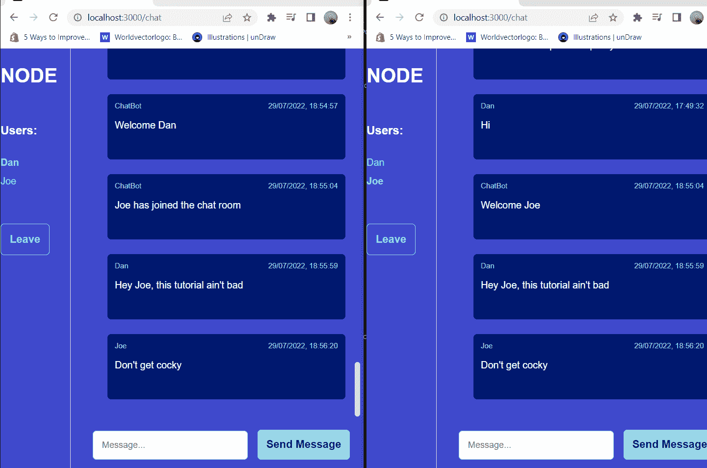

然后单击窗口 2 上的离开按钮:

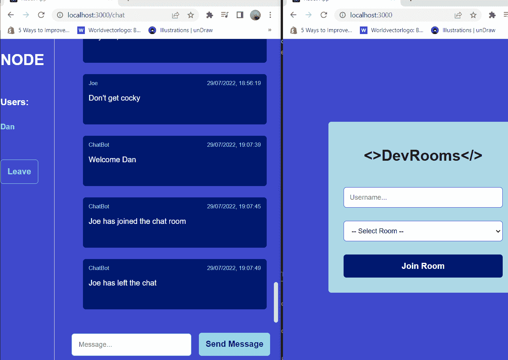

该用户被从聊天中移除，并向其他用户发送消息，通知他们已经离开。不错！

## 如何添加 Socket.io 断开事件侦听器

如果用户不知何故与服务器断开连接，比如他们的互联网掉线，该怎么办？Socket.io 为此提供了内置的 *disconnect* 事件监听器。让我们将它添加到我们的服务器中，以便在用户断开连接时从内存中删除用户:

```
// server/index.js

// ...

// Listen for when the client connects via socket.io-client
io.on('connection', (socket) => {

  // ...

  // Add this
  socket.on('disconnect', () => {
    console.log('User disconnected from the chat');
    const user = allUsers.find((user) => user.id == socket.id);
    if (user?.username) {
      allUsers = leaveRoom(socket.id, allUsers);
      socket.to(chatRoom).emit('chatroom_users', allUsers);
      socket.to(chatRoom).emit('receive_message', {
        message: `${user.username} has disconnected from the chat.`,
      });
    }
  });
});

server.listen(4000, () => 'Server is running on port 3000'); 
```

现在，您已经拥有了——您刚刚构建了一个带有 React 前端、Node/Express 后端和 HarperDB 数据库的全栈实时聊天应用程序。干得好！

下一次，我计划看看 HarperDB 的[自定义函数](https://harperdb.io/docs/custom-functions/)，它允许用户在 HarperDB 中定义自己的 API 端点。这意味着我们可以在一个地方构建整个应用程序！参见本文中 HarperDB 如何折叠堆栈[的示例。](https://harperdb.io/blog/mean-stack-alternative/)

## 对你的挑战💪

如果刷新聊天页面，用户的用户名和房间将会丢失。看看当用户刷新页面时，您是否能防止这些信息丢失。线索:[本地存储](https://www.w3schools.com/html/html5_webstorage.asp)可能有用！

## **感谢您的阅读！**

如果您觉得本文有用，您可以:

*   [订阅我的 YouTube 频道](https://www.youtube.com/channel/UC0URylW_U4i26wN231yRqvA)。我将在 React/NextJS/Node/Express 上传深入的教程和项目视频。
*   [在 Twitter 上关注我](https://twitter.com/doabledanny),我在 Twitter 上发布我的自由职业之旅、兼职项目和当前的学习。
*   [查看我的 Gumroad 商店](https://doabledanny.gumroad.com/)，在那里我制作了有用且受欢迎的(截至发稿时已有 8000 次下载)小抄和海报。
*   [查看我的网络开发博客](https://www.doabledanny.com/blog/)