# Google Sheets 教程——如何使用 Regex 和 VLOOKUP 显示 Google Drive 中的图像

> 原文：<https://www.freecodecamp.org/news/google-sheets-use-regex-and-vlookup-to-display-images-from-google-drive/>

图像让很多事情变得更好。Google Sheets 就是其中之一。

将图片添加到 Google Sheets 的最简单方法是简单地将图片插入到您的工作表中。

但是如果你用这种方式添加了很多图片，你很快就会厌倦多次点击的操作。尤其是如果您必须经常添加图像，或者如果您必须将相同的图像添加到多个工作表中。

在本文中，您将了解如何从 URL 添加许多图像，您可以在下拉列表中动态切换这些图像。我们将涵盖:

*   用于创建下拉列表的数据验证
*   命名范围使公式引用更加简单和清晰
*   VLOOKUP 函数从下拉列表中显示右边的图像
*   REGEXEXTRACT 函数从 URL 中提取一个字符串(不要担心，它会有意义的😉)
*   显示来自 URL 地址的图像的图像函数
*   我们将使用&运算符和正则表达式(Regex)
*   我们还将通过删除网格线、更改字体、添加边框、颜色和表格后面的阴影效果来使我们的工作表看起来更好

## 如何设置项目📐

你可以跟着我在我们将要讨论的所有内容中使用的表格走:

[https://docs . Google . com/spreadsheets/d/1 rfu 2g py 6 ru 8 ikfdmsxkhycf 0 kgvhkcumq 5 o 5 qcf 156m/edit？usp =共享](https://docs.google.com/spreadsheets/d/1rFU2gPy6rU8IKFDmsxKHYCf0KGVHkcumQ5O5QCf156M/edit?usp=sharing)

如果你想自己编辑，就复制一份。

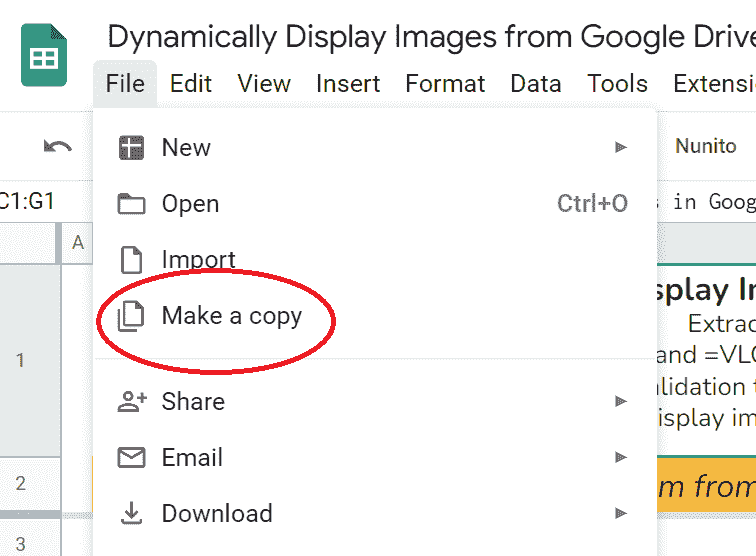

Make a copy to edit yourself

下面所有的单元格和区域引用都来自这张表，所以你可以很容易地看到我在说什么。

我还做了一个图片文件夹[在这里](https://drive.google.com/drive/folders/1na_BdarFXheF5t6YssKY2qPfTEDLYlSF?usp=sharing)，它是公开共享的，所以这一切都工作。你不必复制这个，除非你只是想😀。

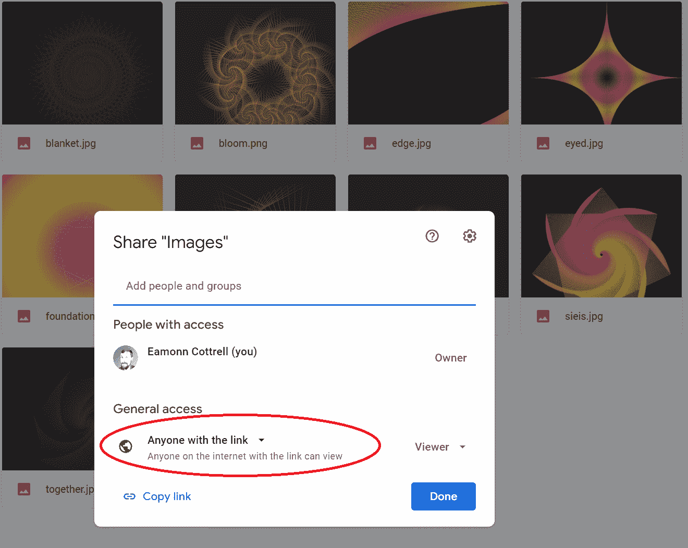

## 如何在 Google 工作表中使用命名范围📛

命名范围使生活变得更容易。

你不需要*使用它们，但是它使得函数中的引用更容易，因为你将写一些东西的名字，而不是无菌的单元格引用。*

我们将使用其中的三种:

1.  这是我们的下拉列表所在的单元格。
2.  这是我们 VLOOKUP 函数的范围。它包含了我们将要显示的图片的名称以及它们各自的 URL。
3.  `B8:B16` = `pictureName`这是`pictureMatch`范围的第一列，仅引用数据验证单元格中的名称。

要创建一个命名范围，只需突出显示该范围，从工具栏中选择 Data -> Named ranges，然后命名它。

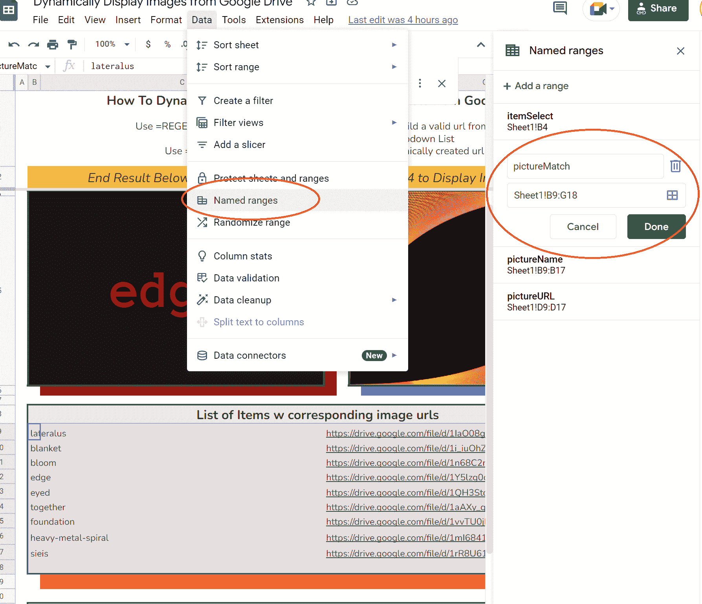

## 如何执行数据验证📃

我们将使用数据验证在 B4 中创建一个下拉列表。这里也是一样——只需突出显示单元格(或范围),然后从工具栏中选择数据->数据验证:

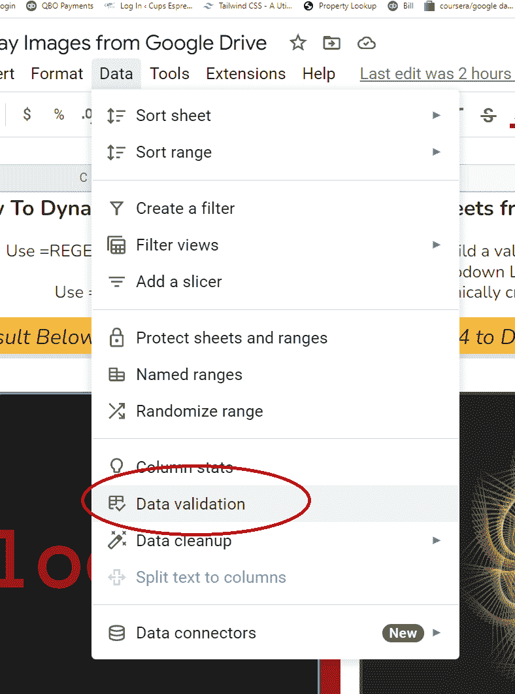

从一个范围中选择 List，然后为该范围选择`=pictureName`(因为我们命名了该范围)。或者，您可以显式声明该范围。

如果您想进行任何更改，还可以配置其他选项:

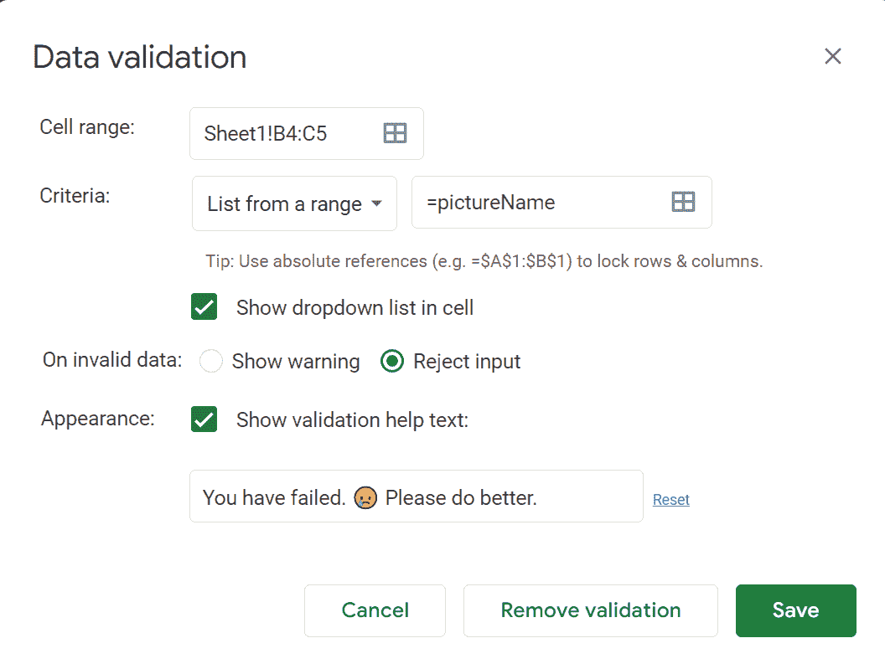

如果您选择拒绝输入，您可以在输入无效选项时弹出一条自定义消息:

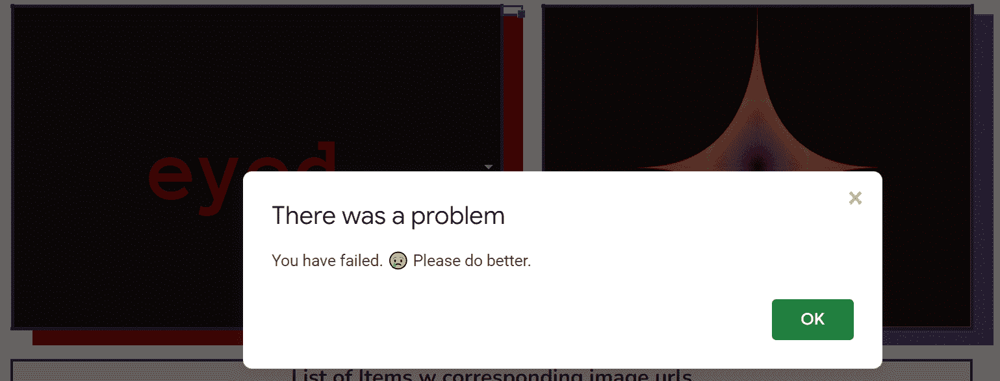

You might want to make your message more helpful than this one.

## 如何使用 VLOOKUP📊

VLOOKUP 是一个非常有用的功能。它需要四个参数:

```
=VLOOKUP(search_key, range, index, [is_sorted])

=VLOOKUP(itemSelect,pictureMatch,3,0) 
```

我们将使用`itemSelect`表示`search_key`，使用`pictureMatch`表示范围，因为我们希望在该范围内找到`itemSelect`。那么 3 表示 index 得到该范围内第三列的值。

(在我们的示例中是 3，因为我们合并了 B & C 列中的单元格进行格式化，但是 VLOOKUP 仍然将它们都计算在内)。

最后，零点将`is_sorted`设置为`FALSE`。我们的数据没有排序，我们希望精确匹配。

## 如何使用 REGEXEXTRACT💾

事情是这样的:我发现了正则表达式在现实世界中的用途。😳

freeCodeCamp 的 Javascript 认证的这一部分对我来说特别困惑，在野外重温其中的一小部分是很好的。

因为 Google Drive 很古怪，而且我们在这里是在黑一个免费的选项，我们需要改变图片的 URL 以便图片功能正常工作。

[这个](https://stackoverflow.com/questions/60287504/how-display-images-from-google-drive-on-gsheet-cell)栈溢出的回答对我很有帮助。

我们需要通过以下方式建立一个 URL:

```
https://drive.google.com/uc?export=download&id=###
```

并用我们用`REGEXEXTRACT`函数提取的 ID 替换末尾的###部分。

查看我们复制的 URL，我们可以看到一个模式。在`/d/`之后和下一个`/`之前的所有内容都是 ID。

这里有一个我们的图片网址的例子: [`https://drive.google.com/file/d/1IaO08gj3GWIUQDAnzKEob62Gcl87ufuN/view?usp=sharing`](https://drive.google.com/file/d/1IaO08gj3GWIUQDAnzKEob62Gcl87ufuN/view?usp=sharing)

您可以在示例电子表格的`B26`中看到这一点，因为该函数会抓取这两个标记之间的所有内容:

`=REGEXEXTRACT(D9,".*/d/(.*)/")`

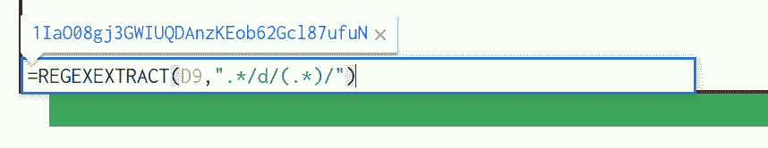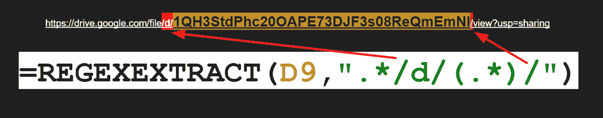

This extracts everything between the /d/ and the /

## 如何使用图像功能📷

好吧。我们已经把不同的部分弄清楚了。我知道这些碎片是吻合的。🎵

让我们把它们放在一起。

我们所有的工作就是让一个单元格(`B4`)向`IMAGE`函数提供数据。

Image 有一个参数和另外三个可选参数:

```
 IMAGE(url, [mode], [height], [width])
```

我们通过使用 and ( &)操作符和我们的`REGEXEXTRACT`函数组合我在`J17`中得到的 URL 的所需开头来构建 URL。在我们的`REGEXEXTRACT`函数中，我们使用我们的`VLOOKUP`函数来获取我们在`itemSelect`单元格中选择的任何图像的 URL。

咻。

但是，酷，对！？

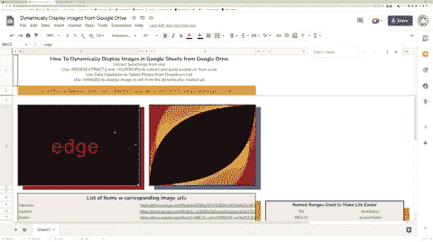

如果你感觉迷失在递归的噩梦中，我鼓励你打开 [**示例电子表格**](https://docs.google.com/spreadsheets/d/1rFU2gPy6rU8IKFDmsxKHYCf0KGVHkcumQ5O5QCf156M/edit?usp=sharing) ，一点一点地检查`F4`中的函数部分。👍

## 如何格式化你的工作表💯

这些小细节可以提高音量📣在一个平凡的电子表格上。


This is likely the only place you'll find a NIN gif in an article about spreadsheets today.

我喜欢硬阴影，我们可以通过控制特定单元格或范围周围的行和列大小，对主要范围使用合并单元格选项，然后在右侧和底部使用填充颜色来实现这一点。

单击列标题之间的线条，拖动并调整列和行的宽度和高度。

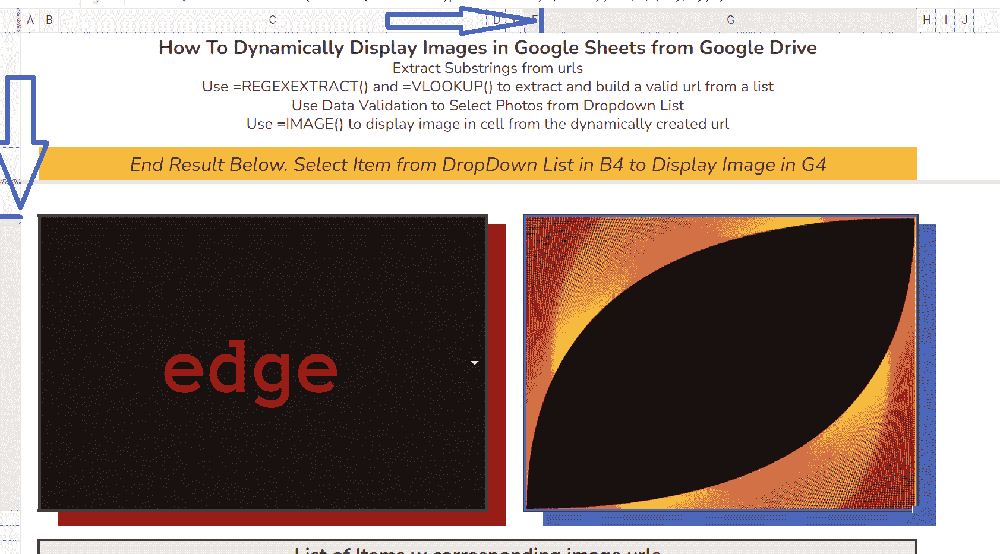

单元格是电子表格的主要吸引力，但在某些情况下，隐藏网格线可以使您的工作表突出。在这个项目中，我选择了这种方法。

选择视图->显示->网格线。


尽管我很欣赏 Arial，但我通常会立即退出默认字体。

单击工具栏中的字体下拉菜单。它通常正好在中间:

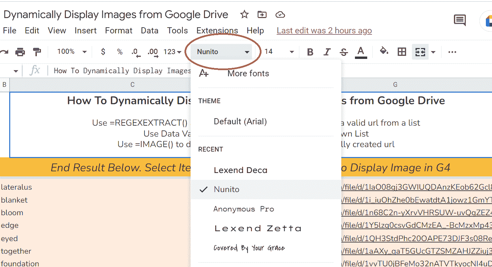

选择你喜欢的字体。

你有它！

## 感谢阅读！🙏

在推特上关注我可以看到更多这样的内容:[https://twitter.com/EamonnCottrell](https://twitter.com/EamonnCottrell)

谢谢！

