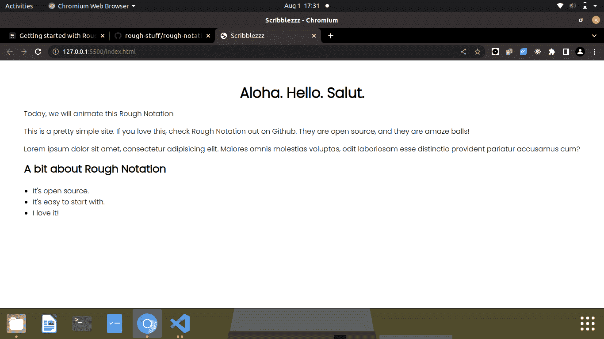
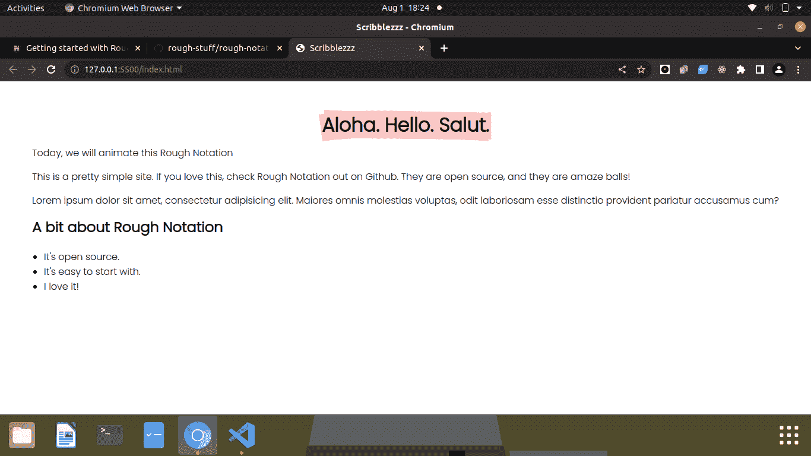
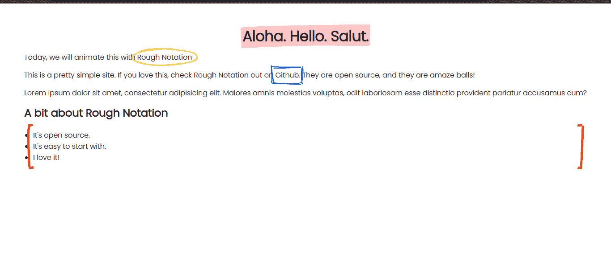

# 如何使用粗略符号库来制作你的网站动画

> 原文：<https://www.freecodecamp.org/news/how-to-add-animation-to-your-site-with-rough-notation/>

我喜欢制作网站动画。当你只是看一个网站时，它是如此有趣，而且有很酷的动画让一切看起来都很漂亮。

开始使用一个动画库并不困难。任何人都可以在他们的网站上添加一些动画，不管他们是否擅长前端工作。

让我告诉你如何开始。

# 什么是粗略记谱法？

Rough notation 是一个轻量级但令人惊叹的 JavaScript 动画库，您可以使用它快速开始制作动画。而且是开源的！

文档非常简单，这也是它是一个很好的动画库的原因之一。

在这篇文章中，我将带你通过基本步骤开始粗略的符号，我们将建立一个非常小的网站，有一些动画。

如果你喜欢使用图书馆，看看他们的超级仓库。给它一颗星，如果你喜欢这篇文章，大声喊出来！(这个不是赞助的。我就是爱图书馆:))

你可以[在这里](https://github.com/rough-stuff/rough-notation)查看粗略的符号文档。

## 让我们开始制作动画

### 如何编写 HTML/CSS 代码

我们不能让我们看不见的东西动起来。首先，我们将用最少的 HTML 和 CSS 创建一个非常简单的静态页面。

现在，我们的 HTML 看起来很平淡无奇。没发生什么事。只是一个很好的中心与 Poppins 字体进行。

```
<div class="main">

        <header>
            <h1 class="header">Aloha. Hello. Salut.</h1>
        </header>

        <main>
            <p>Today, we will animate this with <scan class="rough-notation">Rough Notation</scan></p>

            <p>This is a pretty simple site. If you love this, check Rough Notation out on <scan class="link">Github</scan>. They are open source, and they are amazing!</p>

            <p>Lorem ipsum dolor sit amet, consectetur adipisicing elit. Maiores omnis molestias voluptas, odit laboriosam esse distinctio provident pariatur accusamus cum?</p>

            <h2>A bit about Rough Notation</h2>
            <ul class="list">
                <li>It's open source.</li>
                <li>It's easy to start with.</li>
                <li>I love it!</li>
            </ul>
        </main>
    </div>
```

在上面的代码中，请注意我添加到一些元素中的类。这就是我们选择动画元素的方式。

我们的 CSS 本身是空的，但下面是它的样子和我们页面的样子:

```
@import url('https://fonts.googleapis.com/css2?family=Poppins:wght@300&display=swap');
*{
    box-sizing: border-box;
    margin: 0;
    padding: 0;
}
body{
    font-family: 'Poppins', sans-serif;
}
.main{
    display: flex;
    justify-content: center;
    align-items: center;
    flex-direction: column;
    padding: 10px;
    margin: 40px;
}
h1{
    margin-bottom: 10px;
}
p{
    margin-bottom: 15px;
}
ul{
    margin: 20px;
}
```



Screenshot of how our bare static page looks. There is an h1 header that says 'Aloha. Hello. Salut.' A few other paragraphs make up the page and there is an unordered list that states three little facts about Rough Notation.

### 让我们添加一些 JavaScript

等等，这是有趣的部分！为了让我们的动画产生任何效果，我们需要一个 JavaScript 文件。只需创建一个，并像平常一样将其链接到 HTML。

现在让我们看看粗略记谱法是如何工作的。

文档提供了一些将库添加到我们的项目中的方法。为了简单起见，我们将直接加载 ES 模块。

[在这里查看回购和文件](https://github.com/rough-stuff/rough-notation)。

因此，本质上，我们将在 HTML 中添加一个额外的脚本标记，使其看起来像这样:

```
<script type="module" src="https://unpkg.com/rough-notation?module"></script> 
```

现在这个粗略的符号已经部分出现在我们的项目中，我们可以深入 JavaScript 文件，并导入它。我们的 JavaScript 文档的第一行如下所示:

```
import { annotate } from 'rough-notation';
```

现在，粗略的符号已经完全设置好了，让我们从页面中抓取我们想要的动画。根据我们添加类的元素，我们将得到以下内容:

```
const header = document.querySelector('.header');
const roughNotation = document.querySelector('.rough-notation');
const link = document.querySelector('.link');
const list = document.querySelector('.list'); 
```

下一步是什么将使我们的网页生活。比方说，我想突出的标题浅粉红色。我会写这段代码:

```
const annotation = annotate(header, { type: 'highlight' , color:'pink'});
annotation.show(); 
```

我们将变量 annotation 赋给一个名为`annotate`的函数。annotate 函数有两个参数——我们想要注释的元素和一个对象。

该对象可以接受一些属性。在本例中，我们有两个参数:我们希望在标题上使用的注释类型和颜色。

仅举几个我们可以做的其他类型的注释:

*   高光
*   圆
*   强调
*   括号
*   箱子
*   删除线
*   划掉的

回到我们的头部动画。最后一行是`annotation.show()`，它基本上显示了我们的动画。

如果我们保存我们的页面，并检查我们的浏览器，什么都不会发生。它应该是有效的(根据文件)，但是我们什么也没得到。

我在 YouTube 视频上找到了这个问题的解决方案，为了让动画栩栩如生，我们必须调整 JavaScript 文件中的导入行。

所以你可以这样更新它:

```
import { annotate } from "https://unpkg.com/rough-notation?module";
```

如果你和我一样，喜欢公开抱怨(开玩笑)开源项目，如果动画也不适合你，可以在粗糙符号库上提出问题。但是，只有在还没有人捷足先登的情况下，你才可以提出问题。所以一定要先检查最近的开放和关闭的问题。愿最佳发行人胜出:)

如果你在修复了我们的问题后刷新，我们的标题会得到一个漂亮的粉红色的亮点。你可以看到它在页面上嗖嗖作响。



Screenshot of our site now, with the header highlighted in pink.

很漂亮，对吧？

让我们继续添加一些动画:

```
const annotation = annotate(header, { type: 'highlight' , color:'pink'});
const annotation2 = annotate(roughNotation, {type:'circle', color:'yellow', padding:7});
const annotation3 = annotate(link, { type: 'box' , color:'blue', padding:7});
const annotation4 = annotate(list, { type: 'bracket' , color:'red', brackets:['left', 'right'], strokeWidth:5});

const array = annotationGroup([annotation, annotation2, annotation3, annotation4]);
array.show();
```

这一次，我们增加了不少。但不要让它压倒一切。我们会一步一步来。

首先，我们将`padding`添加到我们的`annotation2`动画中。就像我们看到的标题一样，`roughNotation`(我们 HTML 中的`rough-notation`类)得到一个填充为 7 的黄色圆圈。

但是填充并不是我们引入的唯一新属性。我们需要了解一些新的东西。object 参数有一个属性`brackets`，以数组作为值。`left`和`right`表示我们希望元素两边都有开括号和闭括号。它还有`strokeWidth`，决定支架的厚度。

因为我们必须“显示”每个元素的动画，如果我们必须制作很多动画，这有点无聊，所以我创建了一个数组，将每个动画存储在其中，然后一次性“显示”该数组。它很简洁，节省了很多时间。

所以我们引入了`annotationGroup`。为了使其生效，我们将把它添加到我们的导入行中，如下所示:

```
import { annotate, annotationGroup } from "https://unpkg.com/rough-notation?module";
```

因此...我们的最终网站看起来像这样:



动画在你的浏览器上会工作得更好，因为你可以刷新并看到它们一个接一个地生效。

# 结论

写这个很有趣！我希望你不仅学到了新东西，还尝试了新东西。

一定要查看粗略的符号库和文档，因为它们涵盖的内容比我们在本文中讨论的要多得多。

快乐动画！