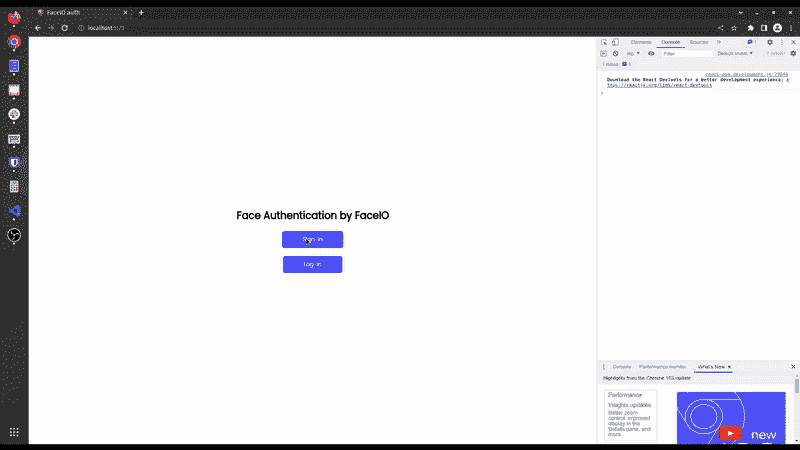
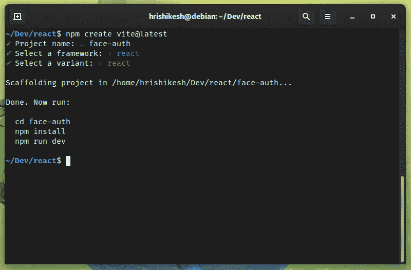
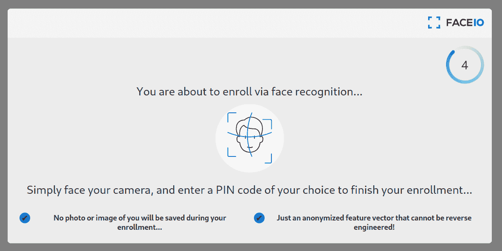

# 如何在 React.js 中使用人脸识别来认证用户

> 原文：<https://www.freecodecamp.org/news/authenticate-with-face-recognition-reactjs/>

随着 Web 2.0 的出现，认证用户成为开发人员的一项重要任务。

在 Web 2.0 之前，网站访问者只能查看网页内容，没有互动。这个互联网时代被称为 Web 1.0。

但在 Web 2.0 之后，人们获得了在网站上发布自己内容的能力。然后内容审核成为网站所有者永无止境的任务。

为了减少这些网站上的垃圾邮件，开发者引入了用户认证系统。现在，网站管理员可以很容易地知道垃圾邮件的来源，并可以阻止那些垃圾邮件发送者进一步访问网站。

如果你想知道如何在你的网站上实现内容审核，你可以阅读我的文章[如何在你的网络应用中检测和模糊人脸](https://betterprogramming.pub/detect-and-blur-human-faces-on-your-website-8c4a2d69a538)。

现在，让我们来看看我们将进入本教程。

## 您将在本教程中学到什么

在本教程中，我们将讨论可以用来验证用户身份的不同验证技术。这些包括电子邮件密码认证、电话认证、OAuth、无密码魔法链接，最后还有面部认证。

在本文中，我们主要关注通过人脸识别技术进行身份验证。

我们还将构建一个项目，教您如何在 React web 应用程序中集成基于面部识别的身份验证。

在这个项目中，我们将使用 FaceIO SaaS(软件即服务)平台来集成基于面部识别的身份验证。因此，请确保你设置了一个免费的 [FaceIO 账户](https://faceio.net/getting-started)来跟进。

最后，我们将看看用户隐私方面，并讨论面部识别如何不会损害您的隐私。我们还会谈到它是否是未来开发者的可靠选择。

这篇文章充满了信息、实践项目和讨论。拿一杯咖啡和一片比萨饼🍕让我们开始吧。

这个项目的最终版本是这样的。看起来很有趣？那我们就这么做吧。



## 不同类型的用户认证系统

现在有很多用户认证系统，你可以选择在你的网站上实现。没有真正优越或低劣的认证技术。所有这些认证系统都依赖于使用正确的工具来完成工作。

例如，如果您正在制作一个简单的登录页面来收集用户的电子邮件，就没有必要使用 OAuth。但是如果你正在构建一个社交平台，那么使用 OAuth 比传统的认证更有意义。您可以直接从 OAuth 获取用户的详细信息和配置文件图像。

如果您的 web 应用程序是围绕任何与投资相关的内容或具有法律约束力的服务构建的，那么使用 phone auth 更有意义。用户可以创建无限的电子邮件帐户，但他们只能使用有限的电话号码。

让我们来看看一些流行的身份验证系统，以便了解它们的优缺点。

### 基于电子邮件密码的身份验证

基于电子邮件密码的身份验证是最古老的用户验证技术。实现也非常简单易用。

这个系统的优点是你不需要有第三方帐户登录。如果你有一封电子邮件，不管它是自己管理的还是来自某个服务(比如 Gmail、Outlook 等等)，你都可以使用。

这个系统的主要缺点是你需要记住所有的密码。随着网站数量的不断增长，我们需要登录大多数网站来访问我们的个人资料，记住每个网站的密码对我们人类来说是一项艰巨的任务。

想出一个独特而强有力的密码也是一项艰巨的任务。我们的大脑通常无法记忆许多随机的字母和数字串。这是基于电子邮件密码的认证系统的最大缺点。

### 电话认证

电话认证通常是验证用户身份的非常可靠的认证技术。由于用户通常不会有一个以上的电话号码，这可能最适合于用户身份非常重要的资产相关网站。

但是这个系统的缺点是，如果人们不信任你，他们不想透露他们的电话号码。电话号码比电子邮件更私人。

电话认证的一个更重要的因素是它的成本。与电子邮件相比，使用一次性密码向用户发送文本消息的成本较高。所以网站所有者和开发者通常更喜欢坚持电子邮件认证。

### 基于 OAuth 的认证

与前两者相比，OAuth 是一种相对较新的技术。在这种技术中，OAuth 代表用户提供用户身份验证和有用的信息。

例如，如果用户有一个谷歌帐户(举例来说)，他们可以使用他们的谷歌帐户直接登录到其他网站。该网站从谷歌那里获得用户的详细信息。这意味着没有必要创建多个帐户并记住这些帐户的每个密码。

这个系统的主要缺点是，作为开发人员，您必须信任 OAuth 提供者，而许多人出于隐私原因不想链接他们的所有帐户。所以在大多数网站上，除了 OAuth 之外，你还会经常看到一个电子邮件密码字段。

### 魔法链接认证

神奇的链接解决了你在基于密码的电子邮件认证中面临的大部分问题。在这里，您只需提供您的密码，您将收到一封带有授权链接的电子邮件。然后你必须在你的浏览器中打开这个链接，你就完成了。不需要记住任何密码。

这种类型的认证近来越来越流行。它为用户节省了大量的时间，而且非常便宜。您不必像 OAuth 那样信任第三方。

### 面部识别认证

面部识别是最新的身份验证技术之一，目前许多开发人员正在采用它。面部识别减少了登录网络应用程序时输入电子邮件密码或任何其他用户凭据的麻烦。

最重要的是这个认证系统速度很快，不需要任何特殊的硬件。你只需要一个网络摄像头，现在几乎所有的设备都有。

面部识别技术使用人工智能绘制出用户独特的面部细节，并将其存储为哈希(一些随机数字和没有意义的文本)，以减少与隐私相关的问题。

对于独立开发者和小型创业公司来说，从头开始构建和部署基于人工智能的人脸识别模型并不容易，而且成本可能非常高。所以你可以使用 SaaS 平台来帮你完成所有这些繁重的工作。FaceIO 和 AWS recognition 就是您可以在项目中使用的这类服务的例子。

在这个动手项目中，我们将使用 FaceIO APIs 在 React web 应用程序中通过面部识别来验证用户。FaceIO 为您提供了一种将认证系统与他们的`fio.js` JavaScript 库集成的简单方法。

## 项目设置

开始之前，请确保创建一个 FaceIO 帐户并创建一个新项目。保存 FaceIO 项目的公共 ID。我们在项目的后期需要这个 ID。

要制作 React.js 项目，我们将使用 Vite。要启动 Vite 项目，请导航到所需的文件夹并执行以下命令:

```
npm create vite@latest 
```

然后按照说明，用 Vite 创建一个 React app。在文件夹中导航并运行`npm insall`来安装项目的所有依赖项。



完成所有这些步骤后，您的项目结构应该如下所示:

```
.
├── index.html
├── package.json
├── package-lock.json
├── public
│   └── vite.svg
├── src
│   ├── App.css
│   ├── App.jsx
│   ├── assets
│   │   └── react.svg
│   └── main.jsx
└── vite.config.js 
```

## 如何将 FaceIO 整合到我们的反应项目中

为了将 FaceIO 集成到我们的项目中，我们需要在`index.html`文件中添加他们的 CDN。打开`index.html`文件，在`root`组件前添加 faceIO CDN。要了解更多信息，请查看 [FaceIO 的集成指南](https://faceio.net/integration-guide)。

```
<body>    
    <script src="https://cdn.faceio.net/fio.js"></script>
    <div id="root"></div>
    <script type="module" src="/src/main.jsx"></script>
</body> 
```

现在删除`App.jsx`文件中的所有代码，从头开始。我已经尽可能的简化了这个教程。所以我只在 UI 中添加了一个标题和两个按钮来演示 FaceIO 面部认证过程是如何工作的。

这里，一个按钮作为登录按钮，另一个作为登录按钮。

`App.jsx`文件中的代码如下所示:

```
import "./App.css";
function App() {
  return (
    <section>
      <h1>Face Authentication by FaceIO</h1>
      <button>Sign-in</button>
      <button>Log-in</button>
    </section>
  );
}

export default App; 
```

### 如何使用 FaceIO 注册用户的面部

使用 FaceIO 非常快速简单。因为我们使用的是`fio.js`库，所以我们只需要执行一个助手函数来认证用户。这个`fio.js`库将为我们完成大部分工作。

为了注册用户，我们在一个`useEffect`钩子中初始化我们的 FaceIO 对象。否则，每次状态改变时，它都会重新运行组件并重新初始化`faceIO`对象。

```
let faceio;
useEffect(() => {
    faceio = new faceIO("Your Public ID goes here");
}, []); 
```

您的 FaceIO 公共 ID 位于您的 FaceIO 控制台上。复制公共 ID 并粘贴到这里来初始化你的 FaceIO 对象。

现在，定义一个名为`handleSignIn()`的函数。这个函数包含我们的用户注册逻辑。

在函数内部调用`faceIO`对象的`enroll`方法。这个`enroll`方法相当于标准密码支持注册系统中的注册功能，并接受一个`payload`参数。您可以将任何特定于用户的信息(例如他们的姓名或电子邮件地址)添加到此有效负载中。

该有效载荷信息将与面部认证数据一起存储，以供将来参考。要了解其他可选参数，请查看它们的 [API 文档](https://faceio.net/integration-guide#enroll)。

在我们的登录`button`中，当用户点击时，我们调用这个`handleSignIn()`函数。用户登录的代码片段如下所示:

```
const handleSignIn = async () => {
    try {
      let response = await faceio.enroll({
        locale: "auto",
        payload: {
          email: "example@gmail.com",
          pin: "12345",
        },
      });

      console.log(` Unique Facial ID: ${response.facialId}
      Enrollment Date: ${response.timestamp}
      Gender: ${response.details.gender}
      Age Approximation: ${response.details.age}`);
    } catch (error) {
      console.log(error);
    }
  };

<button onClick={handleSignIn}>Sign-in</button> 
```



FaceIO screen

### 如何使用面部识别登录

注册用户后，您需要让用户进入身份验证或登录/登录流程。使用`fio.js`库还可以让我们非常容易地设置使用面部认证的登录流程。

我们必须调用`faceIO`对象的`authenticate`方法，这相当于标准密码支持注册系统中的登录功能，所有关键工作都将由`fio.js`包完成。

首先，定义一个名为`handleLogIn()`的新函数来处理 React 应用程序中的所有登录逻辑。在这个函数中，我们调用了前面提到的`faceIO`对象的`authenticate`方法。

这个方法接受一个`locale`参数。这是用户与 FaceIO 小部件交互的默认语言。如果不确定，可以在该字段赋值`auto`。

`authenticate`方法还接受更多可选参数，如`permissionTimeout`、`idleTimeout`、`replyTimeout`等等。您可以查看他们的 API 文档来了解更多关于可选参数的信息。

当有人点击`Log-in`按钮时，我们调用这个`handleLogIn()`函数:

```
const handleLogIn = async () => {
    try {
      let response = await faceio.authenticate({
        locale: "auto",
      });

      console.log(` Unique Facial ID: ${response.facialId}
          PayLoad: ${response.payload}
          `);
    } catch (error) {
      console.log(error);
    }
  };

<button onClick={handleLogIn}>Log-in</button> 
```

我们使用 FaceIO 和 React 的用户认证项目现在已经完成了！您学习了如何注册和登录用户。您可以看到，与我们在本文前面讨论的基于`email-password`或其他身份验证方法相比，这个过程相当简单。

现在你可以使用 CSS 样式化所有的`jsx`元素。我没有在这里添加 CSS 来降低这个项目的复杂性。如果你好奇，可以看看我的 [GitHub gist](https://gist.github.com/hrishiksh/bf76c98e05f6e85eb46d7e736bae351d) 。

如果您想免费托管这个 React FaceIO 项目，可以查看这篇关于如何在 Cloudflare pages 中部署 React 和 Nextjs 项目的文章。

## 如何使用 FaceIO REST API

除了通过`fio.js`库提供小部件，FaceIO 还提供了[REST API](https://faceio.net/rest-api)来简化认证过程。

FaceIO 控制台中的每个应用程序都有一个 API 密钥。您可以使用这个 API 键来访问 FaceIO REST API 端点。REST API 的基本 URL 是`https://api.faceio.net/.`

URL 模式接受像这样的 URL 参数`https://api.faceio.net/cmd?param=val&param2=val2`。这里的`cmd`是一个 API 端点，`param`是一个端点参数，如果它接受任何参数的话。

使用 REST API 端点，您可以在后端自动化各种任务。

1.  您可以根据用户的请求删除面孔 ID。
2.  您可以附加带有 face ID 的有效负载。
3.  您可以更改与面 ID 相关联的 PIN。

这个 REST API 旨在纯粹用于服务器端。确保你不会暴露给客户。请务必阅读以下隐私和安全部分，以了解更多相关信息。

## 如何使用 FaceIO WebHooks

Webhooks 是服务器之间事件驱动的通信系统。您可以使用 FaceIO 的这个 [webhook 特性来更新您的后端，并与您的前端 web 应用程序中发生的新事件同步。](https://faceio.net/webhooks)

此 webhook 的事件在新用户注册、面部身份验证成功、面部 ID 删除等情况下触发。

您可以在项目控制台中设置 FaceIO webhooks。来自 FaceIO 的典型 webhook 调用持续 6 秒。它包含 JSON 格式的特定事件的所有信息，如下所示:

```
{
  "eventName":"String - Event Name",
  "facialId": "String - Unique Facial ID of the Target User",
  "appId":    "String - Application Public ID",
  "clientIp": "String - Public IP Address",
  "details": {
     "timestamp": "Optional String - Event Timestamp",
     "gender":    "Optional String - Gender of the Enrolled User",
     "age":       "Optional String - Age of the Enrolled User"
   }
} 
```

## 隐私和面子

如今，隐私对用户来说是最重要的事情。当大公司为了他们的利益使用你的数据时，关于这些面部识别技术的隐私是否有效和合法的问题就出现了。

FaceIO as a service 遵循所有隐私准则，并在请求用户访问摄像头之前获得用户同意。即使开发者想要，FaceIO 也不会在没有得到同意的情况下扫描人脸。用户可以很容易地退出该系统，并可以从服务器上删除他们的面部数据。

FaceIO 符合 CCP 和 GDPR 的标准。作为开发者，你可以在世界任何地方发布这个面部认证系统，而不会面临隐私问题。你可以阅读这篇文章来了解更多关于 FaceIO 隐私最佳实践的[。](https://faceio.net/apps-best-practice)

## FaceIO 安全

web 应用程序的安全性是一个需要讨论和考虑的重要话题。作为开发人员，您负责站点或应用程序用户的安全。

FaceIO 遵循一些重要且严肃的用户数据保护安全准则。FaceIO 散列了用户所有唯一的面部数据以及我们之前指定的有效载荷。所以存储的信息只不过是一些无法逆向工程的随机字符串。

FaceIO 为开发者概述了一些非常重要的[安全指南](https://faceio.net/security-best-practice)。他们的安全指南侧重于添加强 pin 码来保护用户数据。FaceIO 还拒绝遮盖面部，这样就没有人可以冒充其他人。

## 结论

如果你已经读到这里，感谢你的时间和努力。确保跟随动手教程，这样你就可以完全掌握这个主题。

如果你遵循所有的步骤，这个项目应该是可接近的。如果你从中得到了什么，在推特上告诉我。如果你有任何问题，请提问。我很乐意帮助你。在那之前，祝你愉快。