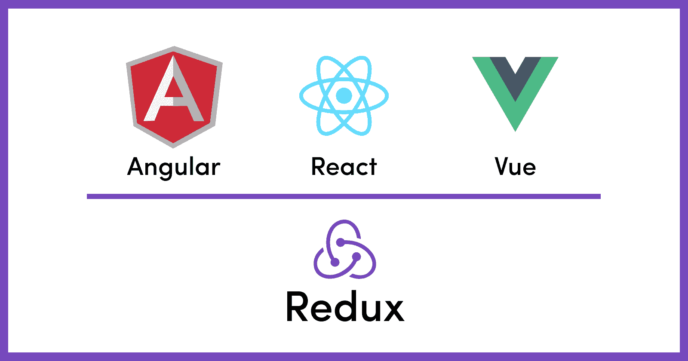
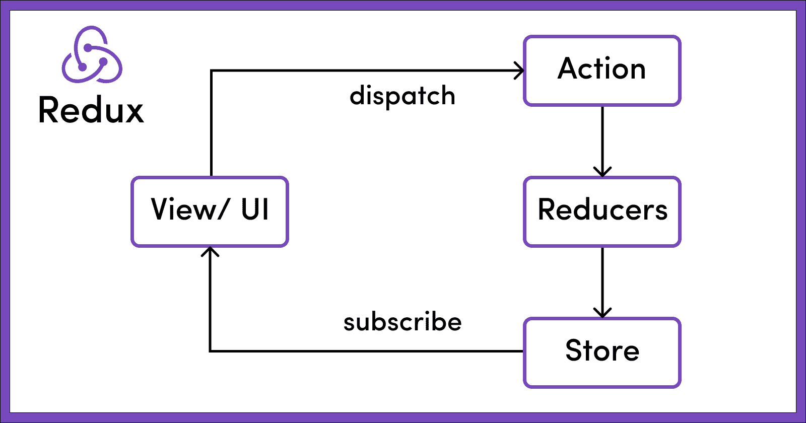
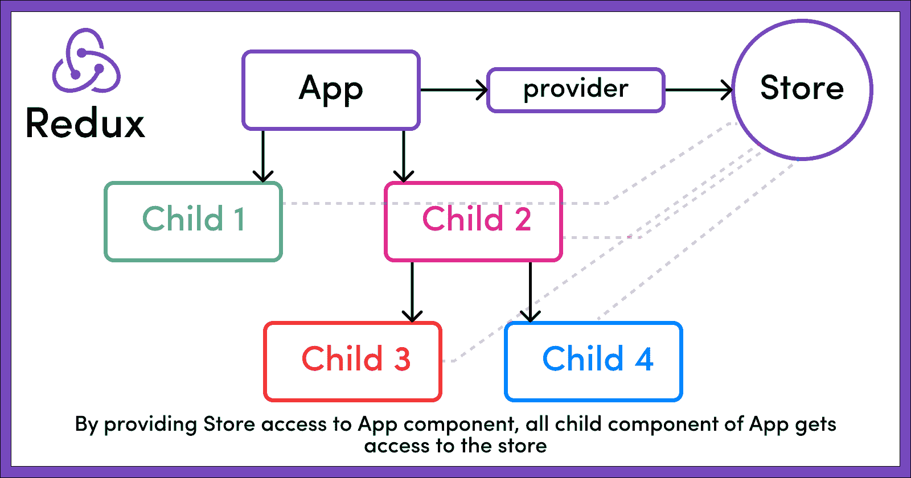
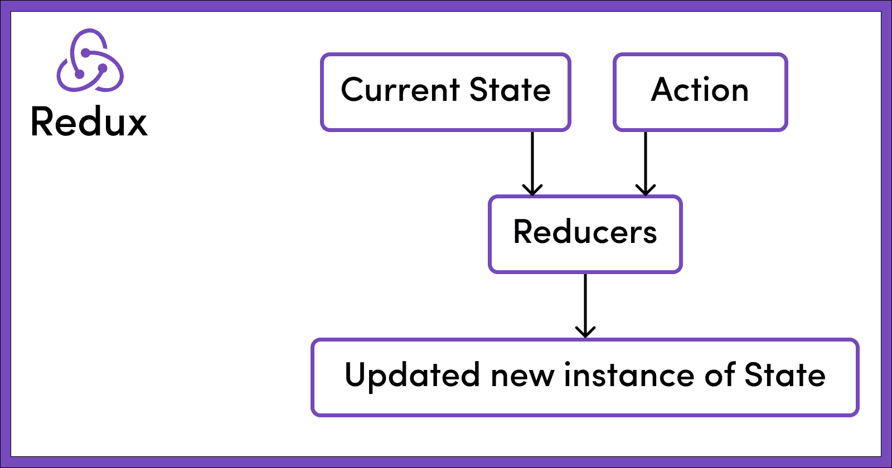

# Redux 是什么？为初学者解释的存储、动作和减少器

> 原文：<https://www.freecodecamp.org/news/what-is-redux-store-actions-reducers-explained/>

Redux 是 JavaScript 应用程序的可预测状态容器。那么这到底意味着什么呢？

如果我们更深入地研究这一陈述，我们会发现 Redux 是一个状态管理库，您可以将它用于任何 JS 库或框架，如 React、Angular 或 Vue。



在本文中，我们将讨论 Redux 的基础知识。我们将了解 Redux 的核心是什么，以及它的三个关键原则。

我们还将看到它的一些核心构件是如何工作的，比如存储、动作和 reducers，以及它们是如何组合在一起，使 Redux 成为现在这样的全局状态管理库的。

作为先决条件，我将假设你熟悉 React。

## 为什么要用 Redux？

一个应用程序有它的状态，可以是它内部组件状态的组合。

我们以一个电子商务网站为例。一个电子商务网站将有几个组件，如购物车组件、用户配置文件组件、以前查看的部分组件等。

我们将采用显示用户购物车中商品数量的购物车组件。购物车组件的状态将由用户添加到购物车中的所有商品以及这些商品的总数组成。在应用程序启动并运行的任何时候，该组件都必须显示用户购物车中更新的商品数量。

每当用户向购物车添加商品时，应用程序必须通过将该商品添加到购物车对象来内部处理该动作。它必须在内部维护其状态，并在 UI 中向用户显示购物车中的商品总数。

类似地，从购物车中删除一个商品会减少购物车中的商品数量。它应该从购物车对象中移除商品，并在 UI 中显示购物车中更新后的商品总数。

我们可以很好地维护组件的内部状态，但是当应用程序变大时，它可能需要在组件之间共享一些状态。这不仅是为了在视图中显示它们，也是为了管理或更新它们，或者基于它们的值执行一些逻辑。

当应用程序变大时，有效处理来自多个组件的多种状态的任务会变得很有挑战性。

这就是 Redux 的用武之地。作为一个状态管理库，Redux 将基本上存储和管理应用程序的所有状态。

它还为我们提供了一些重要的 API，使用这些 API，我们可以对现有状态进行更改，也可以获取应用程序的当前状态。

## Redux 凭什么可以预测？

Redux 中的状态为只读。Redux 的可预测性在于，要改变应用程序的状态，我们需要分派一个动作，描述我们希望在状态中做出什么样的改变。

这些动作然后被称为 reducerss 的东西消费，reducer 的惟一工作是接受两件事(动作和应用程序的当前状态)并返回状态的一个新的更新实例。

我们将在接下来的章节中更多地讨论动作和缩减器。

请注意，还原器不会改变状态的任何部分。更确切地说，一个缩减器会产生一个新的状态实例，其中包含所有必要的更新。

据@ [丹·阿布拉莫夫](https://www.freecodecamp.org/news/what-is-redux-store-actions-reducers-explained/@gaearon)(Redux 的创作者)自己说，

> “动作可以被记录并在以后重放，所以这使得状态管理是可预测的。以同样的顺序做同样的动作，你会以同样的状态结束。”

所以继续我们上面的电子商务网站的例子，如果购物车的初始状态是它有 0 个商品，那么**向购物车添加一个商品**的动作将使购物车中的商品数量增加 1。再次触发**向购物车添加一件商品**的动作会将购物车中的商品数量增加到 2。

给定一个初始状态，有一个按特定顺序排列的**动作**的特定列表，它总是为我们提供实体的完全相同的最终状态。这就是 Redux 如何让状态管理变得可预测。

在下一节中，我们将深入 Redux 的核心概念——存储、动作和 reducers。

## Redux 的核心原则



### 1.Redux 店是什么？

> 应用程序的全局状态存储在单个存储的对象树中—[Redux docs](https://redux.js.org/understanding/thinking-in-redux/three-principles)

Redux 存储是主要的中央存储区，存储应用程序的所有状态。对于应用程序的状态来说，它应该被视为并维护为一个**单一的真实来源**。

如果将`store`提供给 **App.js** (通过将`App`组件包装在`<Provider>` `</Provider>`标签中)，如下面的代码片段所示，那么它的所有子组件(`App.js`的子组件)也可以从商店访问应用程序的状态。这使得它作为一个全球性的国家。

```
// src/index.js

import React from 'react'
import ReactDOM from 'react-dom'
import { Provider } from 'react-redux'

import { App } from './App'
import createStore from './createReduxStore'

const store = createStore()

// As of React 18
const root = ReactDOM.createRoot(document.getElementById('root'))
root.render(
  <Provider store={store}>
    <App />
  </Provider>
) 
```



整个应用程序的状态以 **JS 对象树**的形式存储在**单一存储**中，如下图所示。

```
// this is how the store object structure looks like
{
    noOfItemInCart: 2,
    cart: [
        {
            bookName: "Harry Potter and the Chamber of Secrets",
            noOfItem: 1,
        },
        {
            bookName: "Harry Potter and the Prisoner of Azkaban",
            noOfItem: 1
        }
    ]
} 
```

### 2.Redux 中有哪些动作？

> 改变状态的唯一方法是发出一个动作，这是一个描述发生了什么的对象—[Redux Docs](https://redux.js.org/understanding/thinking-in-redux/three-principles)

如上所述，Redux 中的状态是只读的。这有助于您限制视图的任何部分或任何网络调用直接写入/更新状态。

相反，如果有人想改变应用程序的状态，那么他们需要通过发出或分派动作来表达他们的意图。

让我们以上面的商店为例，我们在商店里有两本书:*《哈利·波特与密室》*和*《哈利·波特与阿兹卡班的囚徒》*。每本只有一份。

现在，如果用户想要向购物车添加另一个商品，那么他们必须单击该商品旁边的**“添加到购物车”**按钮。

点击**“添加到购物车”**按钮，将会分派一个动作。这个动作只不过是一个 JS 对象，它描述了需要在存储中进行哪些更改。大概是这样的:

```
// Rest of the code

const dispatch = useDispatch()

const addItemToCart = () => {
return {
    type: "ADD_ITEM_TO_CART"
    payload: {
        bookName: "Harry Potter and the Goblet of Fire",
        noOfItem: 1,
        }
    }
}

<button onClick = {() => dispatch(addItemToCart())}>Add to cart</button>

// Rest of the code 
```

请注意在上面的例子中，我们是如何在点击按钮时分派动作的。或者更确切地说，我们分派了一个叫做**动作创建器**的东西——也就是函数`addItemToCart()`。这又返回一个`action`，它是一个普通的 JS 对象，描述了由`type`键表示的动作的目的，以及状态改变所需的任何其他数据。在这种情况下，要添加到购物车中的书的名称由`payload`键表示。

**每个动作必须至少有一个`type`与**相关联。需要传递的任何其他细节都是可选的，将取决于我们调度的操作类型。

例如，上面的代码片段调度以下操作:

```
// Action that got created by the action creator addItemToCart()

{
    type: "ADD_ITEM_TO_CART" // Note: Every action must have a type key
    payload: {
        bookName: "Harry Potter and the Goblet of Fire",
        noOfItem: 1,
    }
} 
```

### 3.Redux 中的减速器有哪些？

> 为了指定状态树如何被动作转换，我们编写了纯 reducer-[Redux docs](https://redux.js.org/understanding/thinking-in-redux/three-principles)



Reducers，顾名思义，接受两件事:**前一个状态**和**一个动作**。然后他们将它简化(读取返回)为一个实体:状态的**新的更新实例**。

所以 reducers 基本上是纯粹的 JS 函数，它接受前一个状态和一个动作，并返回新更新的状态。

如果它是一个简单的应用程序，可以有一个缩减器，或者在一个更大的应用程序中，可以有多个缩减器来处理全局状态的不同部分或片段。

例如，在购物应用程序中可以有一个处理购物车状态的 reducer，然后可以有一个处理应用程序的用户细节部分的 reducer，等等。

每当发出一个动作，**所有的减速器都被激活**。每个减速器使用一个开关语句过滤动作，打开**动作类型**。每当 switch 语句与传递的动作匹配时，相应的 reducers 就采取必要的动作进行更新，并返回全局状态的新实例。

继续我们上面的例子，我们可以有一个减速器如下:

```
 const initialCartState = {    
    noOfItemInCart: 0,          
    cart: []                              
}

// NOTE: 
// It is important to pass an initial state as default to 
// the state parameter to handle the case of calling 
// the reducers for the first time when the 
// state might be undefined

const cartReducer = (state = initialCartState, action) => {
    switch (action.type) {
        case "ADD_ITEM_TO_CART": 
            return {
                ...state,
                noOfItemInCart: state.noOfItemInCart + 1,
                cart : [
                    ...state.cart,
                    action.payload
                ]
            }
        case "DELETE_ITEM_FROM_CART":
            return {
                // Remaining logic
            }
        default: 
            return state  
    }       // Important to handle the default behaviour
}           // either by returning the whole state as it is 
            // or by performing any required logic 
```

在上面的代码片段中，我们创建了一个名为`cartReducer`的缩减器，这是一个纯 JS 函数。这个函数接受两个参数:`state`和`action`。

注意，`state`参数是接受初始状态的默认参数。这是为了处理`state`值为`undefined`时**第一次调用**减速器的场景。

还要注意，每个缩减器都应该处理`default`情况，如果没有一个开关情况与传递的动作匹配，那么缩减器应该原样返回`state`或者在传递状态之前对其执行任何所需的逻辑。

每当我们调度某种类型的动作时，我们需要确保有合适的 reducers 来处理该动作。

在上面的例子中，在点击按钮时，我们已经分派了一个**动作**和一个叫做`addItemToCart()`的**动作创建者**。该动作创建者已经用`type` `ADD_ITEM_TO_CART`调度了一个动作。

接下来，我们创建了一个名为`cartReducer`的**缩减器**，它将状态(默认初始状态)和动作作为参数。它打开**动作类型**，然后无论哪种情况与分派的动作类型匹配，它都进行必要的更新，并返回更新状态的全新版本。

这里注意 redux 中的**状态是不可变的**。因此，reducers 首先制作整个当前状态的副本，进行必要的更改，然后返回该状态的一个新实例——包含所有必要的更改/更新。

所以在上面的例子中，我们首先使用扩展操作符`...state`复制整个状态。然后我们将`noOfItemInCart`加 1，通过添加下面所示的`action.payload`中传递的新对象来更新购物车数组，最后返回更新后的对象。

```
{
    bookName: "Harry Potter and the Goblet of Fire",
    noOfItem: 1,
} 
```

减速器更新状态后，如果我们去`console.log`和`state`，那么我们会看到以下结果:

```
// Updated store

{
    noOfItemInCart: 3, // Incremented by 1
    cart: [
        {
            bookName: "Harry Potter and the Chamber of Secrets",
            noOfItem: 1,
        },
        {
            bookName: "Harry Potter and the Prisoner of Azkaban",
            noOfItem: 1
        },
        { // Newly added object
            bookName: "Harry Potter and the Goblet of Fire",
            noOfItem: 1,
        }
    ]
} 
```

## 摘要

简而言之，以下三个原则完全决定了 Redux 的工作方式:

*   应用程序的全局状态存储在单个**存储**中的对象树中
*   改变状态的唯一方法是发出一个**动作**，这是一个描述发生了什么的对象
*   为了指定状态树如何被动作转换，我们编写了**纯归约器**

## 包扎

感谢阅读！我真的希望你喜欢学习 Redux 和它的核心原则，并且觉得这篇教程很有用。

请考虑与你的朋友分享，我会非常感激。更多精彩内容敬请期待。安静点。🖖

### 社会联系

*   [LinkedIn](https://www.linkedin.com/feed/)
*   [网站](https://www.sohamderoy.dev/)
*   [其他博客](https://www.freecodecamp.org/news/author/sohamderoy)
*   [推特](https://twitter.com/_sohamderoy)