# 通过在 AWS 上部署 Jenkins 服务器了解 Terraform

> 原文：<https://www.freecodecamp.org/news/learn-terraform-by-deploying-jenkins-server-on-aws/>

大家好！今天我们将通过构建一个项目来了解 Terraform。

Terraform 不仅仅是一个提高运营团队生产力的工具。通过实施 Terraform，您有机会将您的开发人员转变为运营商。

这有助于提高整个工程团队的效率，改善开发人员和操作人员之间的沟通。

在本文中，我将向您展示如何使用 Terraform 和定制的烘焙映像在 AWS 云上完全自动化部署您的 Jenkins 服务。

## 目录

*   [什么是 Terraform？](#what-is-terraform)
*   [为什么要使用 Terraform？](#why-should-you-use-terraform)
*   [地形如何工作](#how-terraform-works)
*   什么是过程性语言 vs 声明性语言？
*   [先决条件和安装](#prerequisites-and-installation)
*   [我们项目的文件/文件夹结构](#file-folder-structure-of-our-project)
*   [如何首先初始化地形状态](#how-to-first-initialize-terraform-state)
*   [如何调配 AWS 虚拟私有云](#how-to-provision-an-aws-virtual-private-cloud)
*   [如何使用 Terraform 模块](#how-to-work-with-terraform-modules)
*   [如何创建 VPC 子网](#how-to-create-a-vpc-subnet)
*   [如何设置 VPC 路由表](#how-to-setup-vpc-route-tables)
*   [如何创建公共路由表](#how-to-create-a-public-route-table)
*   [如何创建私有路由表](#how-to-create-a-private-route-table)
*   [如何设置 VPC 堡垒主机](#how-to-setup-a-vpc-bastion-host)
*   [如何调配我们的计算服务](#how-to-provision-our-compute-service)
*   [詹金斯主实例](#jenkins-master-instance)
*   [如何创建负载平衡器](#how-to-create-the-load-balancer)
*   [清理](#cleaning-up)
*   [总结](#summary)

# 什么是 Terraform？

HashiCorp 的 Terraform 是一个基础设施代码解决方案。它允许您在可读的配置文件中指定云和本地资源，您可以重用和共享这些资源。这是一个强大的 DevOps 配置工具。

# 为什么应该使用 Terraform？

Terraform 有许多使用案例，包括以下功能:

*   在配置/代码中指定基础架构，轻松重建/更改和跟踪基础架构的更改。
*   支持不同的云平台
*   执行增量资源修改
*   支持软件定义的网络

# Terraform 如何工作

让我们来看看 Terraform 是如何在高层次上工作的。

Terraform 是用 Go 编程语言开发的。Go 代码被编译成 **terraform，**单个二进制。您可以使用这个二进制文件从您的笔记本电脑、构建服务器或几乎任何其他计算机上部署基础设施，并且您不需要运行任何额外的基础设施来这样做。

这是因为 Terraform 二进制文件代表您对一个或多个提供商进行 API 调用，这些提供商包括 Azure、AWS、Google Cloud、DigitalOcean 等。这使得 Terraform 可以利用这些提供商已经为他们的 API 服务器准备的基础设施，以及他们需要的认证过程。

但是 Terraform 不知道 API 请求是什么——它是怎么知道的呢？ Terraform 配置是用**声明性语言**编写的文本文件，它指定了您想要生成什么样的基础设施，这就是答案。“基础设施即代码”中的“代码”就是这些设置。

您可以完全控制您的基础设施，包括服务器、数据库、负载平衡器、网络拓扑等。Terraform 二进制程序代表您解析您的代码，并尽快将其转换为一系列 API 调用。

# 什么是过程性语言和声明性语言？

过程语言允许你指定整个过程，并列出完成它所必需的步骤。你只需给出指示，并具体说明该过程将如何进行。厨师和 Ansible 鼓励这种方法。

另一方面，声明性语言允许您简单地设置命令或顺序，并让系统来执行。你不需要进入流程；你只需要结果。例如地形、云层形成和木偶。

理论说够了...

现在是将 Terraform 的高可用性、安全性、性能和可靠性付诸行动的时候了。

这里，我们讨论的是亚马逊网络服务上基于 Terraform 的 Jenkins 服务器。我们正在从头开始建立网络，所以让我们开始吧。

## 先决条件和安装

按照本教程，您需要设置和安装一些东西:

*   [创建一个 AWS 账户](https://aws.amazon.com/console/)
*   [创建一个 IAM 用户](https://docs.aws.amazon.com/IAM/latest/UserGuide/id_users_create.html#id_users_create_console)
*   [创建并下载您的用户密码和访问密钥](https://docs.aws.amazon.com/IAM/latest/UserGuide/id_credentials_access-keys.html#Using_CreateAccessKey)
*   [从 Terraform - HashiCorp 学习页面安装 terra form](https://learn.hashicorp.com/tutorials/terraform/install-cli)

## 我们项目的文件/文件夹结构

我们将使用模块化开发策略将 Jenkins 集群部署分成许多模板文件(而不是开发一个大的模板文件)。

每个文件负责执行一个目标基础设施组件或 AWS 资源。

为了创建和执行基础设施设置，Terraform 利用了一种类似 JSON 的配置语言 HCL (HashiCorp 配置语言)的语法。

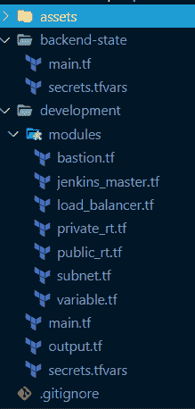

files/folders structures

## 如何首先初始化地形状态

为了遵循最佳实践，我们将把我们的 Terraform 状态文件存储在我们的云存储中。这对团队协作尤其重要。

Terraform 状态文件是包含项目中 Terraform 资源的文件。

在后端状态文件夹的 main.tf 文件中，添加以下代码:

```
variable "aws_region" { 
	default = "us-east-1" 
 } 
variable "aws_secret_key" {} 
variable "aws_access_key" {} 

provider "aws" { 
	region = var.aws_region 
    access_key = var.aws_access_key 
    secret_key = var.aws_secret_key 
} 

resource "aws_s3_bucket" "terraform_state" { 
	bucket = "terraform-state-caesar-tutorial-jenkins" 

    lifecycle { 
    	prevent_destroy = true 
    } 

    versioning { 
    	enabled = true 
   } 

   server_side_encryption_configuration { 
   		rule { 
        	apply_server_side_encryption_by_default { 
            	sse_algorithm = "AES256" 
            } 
        } 
   } 
}
```

**backend-state/main.tf**

让我们确保我们知道上面的代码是怎么回事。

我们使用**变量**来存储数据，在 Terraform 中，您用变量关键字后跟名称来声明一个变量。变量块可以接受一些属性，如 default、description、type 等，也可以不接受。你会经常看到这个。

现在我们将变量声明为`variable "variable_name"{}`，将在任何资源/数据块中使用它们的**声明为** `var.variable_name`。稍后，您将看到我们将如何在 secrets.tfvars 文件中为这些变量赋值。

要使用 Terraform，您需要告诉它将与之通信的**提供者**，并传递其认证所需的属性。这里我们有 AWS 区域、访问和密钥(您应该从系统必备中下载这些内容)。

在 terraform 中，我们需要的每个**资源**都在资源块中定义。资源是创建我们的云服务的基础设施。它遵循语法`resource "terraform-resource-name" "custom-name" {}`。

Terraform 文档中为特定提供商提供了大量资源(如有疑问，请参考这些文档)。

接下来，我们将创建 aws_s3_bucket。这将存储我们的远程状态。它具有以下属性:

*   **桶** →这必须是全球唯一的
*   生命周期 →如果你需要破坏你的地形资源，你可能想防止破坏状态，因为它是跨团队共享的
*   **版本化** →帮助提供对状态的一些版本控制
*   **服务器端加密配置** →提供加密。

我们的状态后端已经准备好了。但是在我们初始化它，计划它，并用 Terraform 应用它之前，让我们用**给变量赋值**。

在 secrets.tfvars 中，从您的 AWS 帐户添加以下信息:

```
 aws_region = "us-east-1 
  aws_secret_key = "enter-your-secret" 
  aws_access_key = "enter-your-access 
```

**backend-state/secrets.tfvars**

在您的终端的相同后端状态文件夹中，运行`terraform init`。

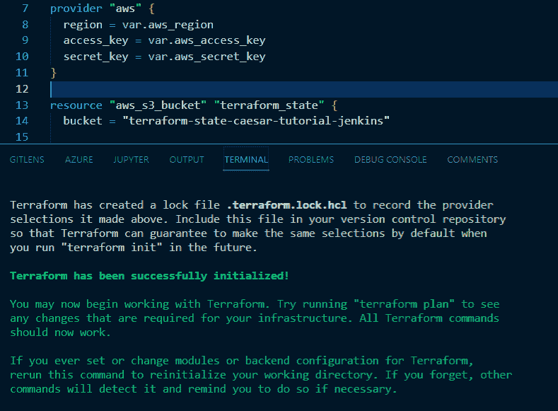

terraform state on terminal

然后`terraform apply -var-file=secrets.tfvars`:

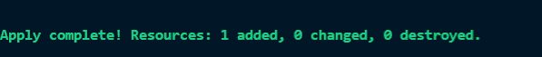

terraform state on terminal

在您的 **AWS 控制台**中，您将看到以下内容:

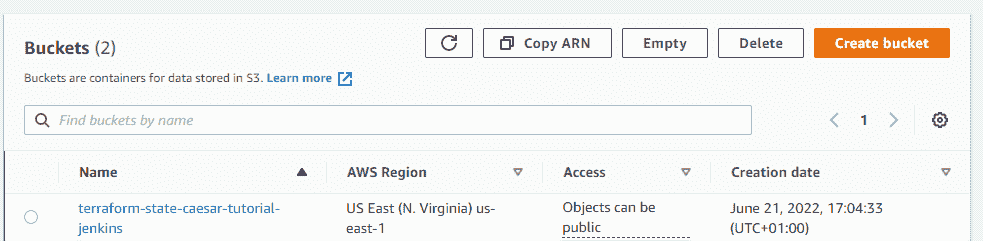

terraform state on aws s3 bucket

‌‌Now，我们的状态已经准备好了，让我们进入下一部分。

## 如何调配 AWS 虚拟私有云

为了保护我们的 Jenkins 集群，我们将在虚拟私有云(VPC)和专用子网内部署该架构。您可以在 AWS 默认 VPC 中部署集群。

为了完全控制网络拓扑，我们将从头开始创建一个 VPC。

```
 variable "cidr_block" {} 
 variable "aws_access_key" {} 
 variable "aws_secret_key" {} 
 variable "aws_region" {} 

 provider "aws" { 
 	region = var.aws_region 
    access_key = var.aws_access_key 
    secret_key = var.aws_secret_key 
} 

terraform { 
	backend "s3" { 
    	bucket     = "terraform-state-caesar-tutorial-jenkins" 
        key        = "tutorial-jenkins/development/network/terraform.tfstate" 
        region     = "us-east-1" 
        encrypt    = true 
   }
} 

resource "aws_vpc" "main_vpc" { 
	cidr_block           = var.cidr_block 
    enable_dns_support   = true 
    enable_dns_hostnames = true 

    tags = { 
    	Name        = "jenkins-instance-main_vpc" 
    } 
}
```

**development/main.tf**

```
output "vpc_id" { 
	value = aws_vpc.main_vpc.id 
} 

output "vpc_cidr_block" { 
	value = aws_vpc.main_vpc.cidr_block 
} 
```

**development/output.tf**

```
cidr_block            = "172.0.0.0/16" 
aws_region = "us-east-1" 
aws_secret_key = "enter-your-secret" 
aws_access_key = "enter-your-access" 
```

**development/secrets.tfvars**

*   **cidr_block →** 无类域间路由被称为 cidr。简单地说，CIDR 块就是一个 IP 地址范围。这决定了我们的工作范围。
*   **输出→**terra form 中的输出块用于将资源值导出到其他模块。这是将一个模块中的资源数据传输到另一个模块中的另一个资源时的另一个重要术语。(你很快就会知道什么是模块)下面是它的语法:`output "custom_output_name" {  value = "resource-name"}`。它接受一个**值**键，该键接受传递的资源。这里我们输出 vpc_id 和 cidr_block。

现在，在终端中，运行`terraform init`和`terraform apply` 来创建资源。你可以先运行`terraform plan`，看看你实际上在创建什么资源。下面是命令:`terraform apply -var-file=secrets.tfvars`，输出:

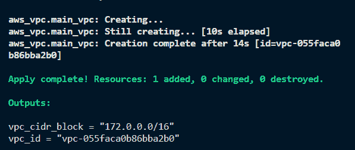

你应该在你的 **AWS 控制台**中看到你的 **vpc_id 和 vpc_cidr_block** :

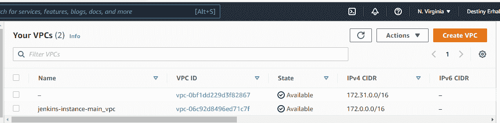

vpc on aws

## 如何使用 Terraform 模块

特定目录中的一组典型配置文件构成了一个 Terraform 模块。Terraform 模块将用于单一操作的资源放在一起。这减少了创建相同基础设施组件所需的代码量。

使用下面的语法，您可以将一个 Terraform 模块资源转移到另一个要使用的资源。

```
module "custom-module-name" { 
	source     = "path-to-modules-resources" 
}
```

**terraform-modules syntax**

而要在另一个资源模块内部使用模块资源输出，这是命令:`module.custom-module-name.resource-output-value`。

## 如何创建 VPC 子网

创建一个 VPC 是不够的——我们还需要一个子网，以便能够在这个隔离的网络上安装 Jenkins 实例。我们必须传递之前输出的 VPC ID，因为该子网属于之前构建的 VPC。

为了恢复能力，我们将在不同的可用性区域中使用两个公共子网和两个私有子网。每个子网都有自己的 CIDR 地址块，它是 VPC·CIDR 地址块的子集，后者是我们从 VPC 资源获得的。

```
resource "aws_subnet" "public_subnets" { 
	vpc_id         = var.vpc_id 
    cidr_block     = cidrsubnet(var.vpc_cidr_block, 8, 2 + count.index)  
   	availability_zone   = element(var.availability_zones, count.index)  	
    map_public_ip_on_launch = true 
    count                   = var.public_subnets_count 

    tags = { 
    	Name        = "jenkins-instance-public-subnet" 
   } 
} 

resource "aws_subnet" "private_subnets" { 
	vpc_id     = var.vpc_id 
    cidr_block = cidrsubnet(var.vpc_cidr_block, 8, count.index)  			
    availability_zone    = element(var.availability_zones, count.index)  
    map_public_ip_on_launch = false 
    count                   = var.private_subnets_count 

    tags = { 
    	Name        = "jenkins-instance-private-subnet" 
    } 
 }
```

**modules/subnets.tf**

好了，这段代码是怎么回事？

*   [**count**](https://www.terraform.io/language/meta-arguments/count)**→**count 元参数接受一个整数，并创建资源或模块的多个实例。这里，我们为变量 private_subnets_count 和 public_subnets_count 各指定 2。
*   **map_public_ip_on_launch →** 指定 true，表示应该为启动到子网中的实例分配一个公共 ip 地址。
*   [**cidrsubnet()**](https://www.terraform.io/language/functions/cidrsubnet)**→**cidrsubnet 计算给定 IP 网络地址前缀内的子网地址。
*   [**element()**](https://www.terraform.io/language/functions/element)**→**element 从列表中检索单个元素。

现在让我们更新我们的模块变量:

```
variable "vpc_id" {} 
variable "vpc_cidr_block" {} 
variable "private_subnets_count" {} 
variable "public_subnets_count" {} 
variable "availability_zones" {} 
```

**development/modules/variables.tf**

像这样更新 secrets.tfvars:

```
private_subnets_count = 2 
public_subnets_count  = 2
```

**secrets.tfvars**

您必须建立私有和公共路由表来指定 VPC 子网中的流量路由方法。在我们对我们的资源执行 **terraform apply** 之前，让我们这样做吧。

## 如何设置 VPC 路由表

我们将开发私有和公共路由表来进行精细的流量管理。这将使部署在私有子网中的实例能够访问互联网，而不会暴露给公众。

### 如何创建公共路由表

首先，我们需要建立一个**互联网网关资源**，并将其链接到我们之前生成的 VPC。然后我们需要定义一个**公共路由表**和一个将所有流量(0.0.0.0/0)指向互联网网关的路由。最后，我们需要将它与 VPC 中的公共子网链接起来，以便通过创建一个**路由表关联，将来自这些子网的流量路由到互联网网关。**

```
/*** Internet Gateway - Provides a connection between the VPC and the public internet, allowing traffic to flow in and out of the VPC and translating IP addresses to public* addresses.*/ 
resource "aws_internet_gateway" "igw" { 
	vpc_id = var.vpc_id 

    tags = { 
    	Name = "igw_jenkins" 
   } 
} 

/*** A route from the public route table out to the internet through the internet* gateway.*/ 
resource "aws_route_table" "public_rt" { 
	vpc_id = var.vpc_id 

    route { 
    	cidr_block = "0.0.0.0/0" 
        gateway_id = aws_internet_gateway.igw.id 
   } 

   tags = { 
   		Name = "public_rt_jenkins" 
   } 
} 
/*** Associate the public route table with the public subnets.*/ 
resource "aws_route_table_association" "public" { 
	count     = var.public_subnets_count 
    subnet_id = element(var.public_subnets.*.id, count.index) 
    route_table_id = aws_route_table.public_rt.id 
}
```

**development/modules/public_rt.tf**

### ‌How 创建私有路由表

既然我们的公共路由表已经完成，让我们创建私有路由表。

为了允许我们的 Jenkins 实例在部署到私有子网时连接到互联网，我们将在公共子网内构建一个 **NAT 网关资源**。

在此之后，向 NAT 网关添加一个**弹性 IP** 地址，并添加一个带有路由(0.0.0.0/0)的私有路由表，将所有流量定向到您建立的 NAT 网关的 ID。然后，我们通过创建**路由表关联**将私有子网连接到私有路由表。

```
 /*** An elastic IP address to be used by the NAT Gateway defined below.  The NAT* gateway acts as a gateway between our private subnets and the public* internet, providing access out to the internet from within those subnets,* while denying access to them from the public internet.  This IP address* acts as the IP address from which all the outbound traffic from the private* subnets will originate.*/ 

 resource "aws_eip" "eip_for_the_nat_gateway" { 
 	vpc = true 

    tags = { 
    	Name = "jenkins-tutoral-eip_for_the_nat_gateway" 
    } 
} 

/*** A NAT Gateway that lives in our public subnet and provides an interface* between our private subnets and the public internet.  It allows traffic to* exit our private subnets, but prevents traffic from entering them.*/ 

resource "aws_nat_gateway" "nat_gateway" { 
	allocation_id = aws_eip.eip_for_the_nat_gateway.id 
    subnet_id     = element(var.public_subnets.*.id, 0) 

    tags = { 
    	Name = "jenkins-tutorial-nat_gateway" 
	} 
} 
/*** A route from the private route table out to the internet through the NAT * Gateway.*/ 

resource "aws_route_table" "private_rt" { 
	vpc_id = var.vpc_id 

    route { 
    	cidr_block     = "0.0.0.0/0" 
        nat_gateway_id = aws_nat_gateway.nat_gateway.id } 

        tags = { 
        	Name   = "private_rt_${var.vpc_name}" 
            Author = var.author 
        } 
} 
/*** Associate the private route table with the private subnet.*/ 
resource "aws_route_table_association" "private" { 
	count = var.private_subnets_count 
    subnet_id = element(aws_subnet.private_subnets.*.id, count.index) 
    route_table_id = aws_route_table.private_rt.id 
}
```

**development/modules/private_rt.tf**

‌Now 让我们跑吧。但是我们需要**更新我们的 main.tf** 文件(因为这是我们的入口 terraform 文件)来了解我们的子网和模块变量以及 **secrets.tfvars** (用于我们的变量)。

```
variable "vpc_id" {} 
variable "vpc_cidr_block" {} 
variable "private_subnets_count" {} 
variable "public_subnets_count" {} 
variable "availability_zones" {} 
variable "public_subnets" {}
```

**development/modules/variables.ftvars**

```
variable "private_subnets_count" {} 
variable "public_subnets_count" {} 
variable "availability_zones" {} 

module "subnet_module" { 
	source     = "./modules" 
    vpc_id     = aws_vpc.main_vpc.id 
    vpc_cidr_block = aws_vpc.main_vpc.cidr_block 
    availability_zones = var.availability_zones 
    public_subnets_count = var.public_subnets_count 
    private_subnets_count = var.private_subnets_count 
 }
```

**development/main.tf**

```
 availability_zones    = ["us-east-1a", "us-east-1b", "us-east-1c", "us-east-1d", "us-east-1e"]
```

**development/secrets.tf**

我们的子网和各自的安全都准备好了。现在我们可以用 Terraform 初始化它，计划和应用它。

我们将运行 **terraform apply** 来创建资源。您可以先运行 terraform plan，看看您实际创建了哪些资源。

在终端运行`terraform apply -var-file=secrets.tfvars`。


请记住，这里添加的资源数量可能与您的不同。

下面是 AWS 控制台(子网、弹性地址、路由表):

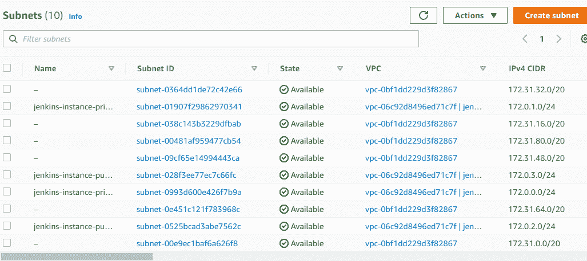

subnets

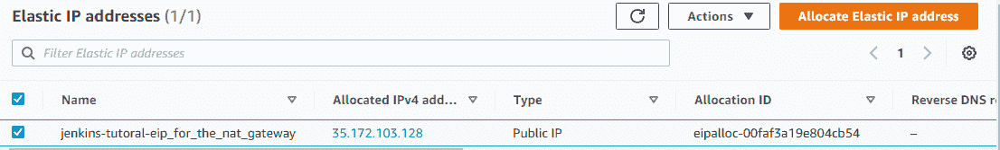

elastic ip

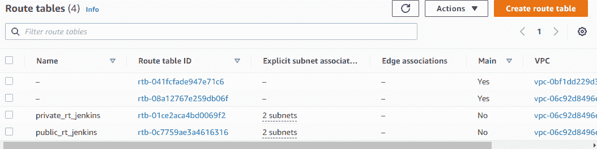

route tables

## 如何设置 VPC 堡垒主机

我们在私有子网内部署了 Jenkins 集群。因为群集缺少公共 IP，所以实例不会通过互联网公开。因此，为了解决这个问题，我们将设置一个堡垒主机，这样我们就可以安全地访问 Jenkins 实例。

在 bastion.tf 文件中添加以下资源和安全组:

```
/*** A security group to allow SSH access into our bastion instance.*/ 
resource "aws_security_group" "bastion" { 
	name   = "bastion-security-group" 
    vpc_id = var.vpc_id 

    ingress { 
    	protocol    = "tcp" 
        from_port   = 22 
        to_port     = 22 
        cidr_blocks = ["0.0.0.0/0"] 
    } 
    egress { 
    	protocol    = -1 
        from_port   = 0 
        to_port     = 0 
        cidr_blocks = ["0.0.0.0/0"] 
   } 

   tags = { 
   		Name = "aws_security_group.bastion_jenkins" 
   } 
} 

/*** The public key for the key pair we'll use to ssh into our bastion instance.*/ 

resource "aws_key_pair" "bastion" { 
	key_name   = "bastion-key-jenkins" 
    public_key = var.public_key 
 } 

 /*** This parameter contains the AMI ID for the most recent Amazon Linux 2 ami,* managed by AWS.*/ 

 data "aws_ssm_parameter" "linux2_ami" { 
 	name = "/aws/service/ami-amazon-linux-latest/amzn-ami-hvm-x86_64-ebs" 
} 

/*** Launch a bastion instance we can use to gain access to the private subnets of* this availabilty zone.*/ 

resource "aws_instance" "bastion" { 
	ami           = data.aws_ssm_parameter.linux2_ami.value 
    key_name      = aws_key_pair.bastion.key_name 
    instance_type = "t2.large" 
    associate_public_ip_address = true 
    subnet_id                   = element(aws_subnet.public_subnets, 0).id 
    vpc_security_group_ids      = [aws_security_group.bastion.id] 

    tags = { 
    	Name        = "jenkins-bastion" 
    } 
} 

output "bastion" { value = aws_instance.bastion.public_ip }
```

**bastion.tf**

让我们看看代码中发生了什么:

*   **堡垒安全组资源–**新生成的 EC2 实例不允许 SSH 访问。
*   我们将一个安全组链接到活动实例，以便支持对堡垒主机的 SSH 访问。安全组将允许来自任何位置(0.0.0.0/0)的端口 22 (SSH)上的任何入站(入站)流量。为了提高安全性和防止安全漏洞，您可以用您自己的公共 IP 地址/32 或网络地址替换 CIDR 源地址块。
*   **AWS _ key _ pair–**为了能够使用 SSH 和私钥连接到 bastion 主机，我们在创建 EC2 时添加了一个 SSH 密钥对。密钥对中使用了我们的公共 SSH 密钥。使用 **sshkeygen** 命令，您也可以创建一个新的。
*   **AWS _ SSM _ parameter**–Amazon 2 Linux 机器映像由 EC2 实例使用。AMI ID 是使用 AWS AMI 数据源从 AWS marketplace 获得的
*   **AWS _ instance–**最后，我们使用定义的配置和访问来部署我们的 EC2 bastion 实例
*   **output**–通过指定输出，我们使用 Terraform 输出功能来显示终端会话中的 IP 地址。

现在，让我们用我们作为变量传递的新的 **public_key** 来更新模块和 main.tf 中的变量:

```
variable "public_key"{} 
```

**development/modules/variables/tfvars**

```
varable "public_key" {} 
module "subnet_module" { 
	source     = "./modules" 
    ... 
    publc_key = var.public_key 
}
```

**development/main.tf**

```
public_key = "enter-your-public-key"
```

**development/secrets.tf**

我们将运行 **terraform apply** 来创建资源。您可以先运行 terraform plan，看看您实际创建了哪些资源。

在终端上，让我们运行`terraform apply -var-file=secrets.tfvars`:


terminal resources

以下是 AWS 控制台中的输出:

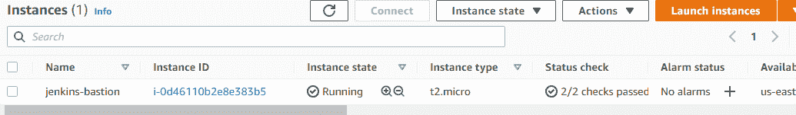

aws-console instances

## 如何调配我们的计算服务

### Jenkins 主实例

到目前为止，我们已经成功地设置了 VPC 和网络拓扑。‌‌Finally，我们将创建我们的詹金斯 EC2 实例，该实例将使用 Packer 烘焙的詹金斯主 AMI。

你可以看看我以前的一篇关于它是如何被烘焙的文章:[通过在 freecodecamp.org 的 AWS 上构建一个定制的机器映像来学习基础设施作为代码](https://www.freecodecamp.org/news/learn-instructure-as-a-code-by-building-custom-machine-image-in-aws/)。无论如何，你可以使用任何你的自定义图像，如果你有一个。

```
 /*** This parameter contains our baked AMI ID fetch from the Amazon Console*/ data "aws_ami" "jenkins-master" { 
 	most_recent = true owners      = ["self"] 
} 

resource "aws_security_group" "jenkins_master_sg" { 
	name        = "jenkins_master_sg" 
    description = "Allow traffic on port 8080 and enable SSH" 
    vpc_id      = var.vpc_id 

    ingress { 
    	from_port       = "22" 
        to_port         = "22" 
        protocol        = "tcp" 
        security_groups = [aws_security_group.bastion.id] 
   } 
   ingress { 
   		from_port       = "8080" 
        to_port         = "8080" 
        protocol        = "tcp" 
        security_groups = [aws_security_group.lb.id] 
   } 
   ingress { 
   		from_port   = "8080" 
        to_port     = "8080" 
        protocol    = "tcp" 
        cidr_blocks = ["0.0.0.0/0"] 
  } 
  egress { 
  		from_port   = "0" 
        to_port     = "0" 
        protocol    = "-1" 
        cidr_blocks = ["0.0.0.0/0"] 
  } 

  tags = { 
  	Name = "jenkins_master_sg" 
  }
} 
```

**development/modules/jenkins_master.tf**

将一个安全组附加到实例将在端口 8080(Jenkins web dashboard)上启用入站流量，并且 SSH 仅来自堡垒服务器和 VPC CIDR 块。

```
resource "aws_key_pair" "jenkins" { 
	key_name   = "key-jenkins" 
    public_key = var.public_key 
} 

resource "aws_instance" "jenkins_master" { 
	ami       = data.aws_ami.jenkins-master.id 
    instance_type  = "t2.large" 
    key_name       = aws_key_pair.jenkins.key_name 
    vpc_security_group_ids = [aws_security_group.jenkins_master_sg.id]
    subnet_id              = element(aws_subnet.private_subnets, 0).id
    root_block_device { 
    	volume_type           = "gp3" 
        volume_size           = 30 
        delete_on_termination = false 
    } 

    tags = { 
    	Name = "jenkins_master" 
     } 
 }
```

**development/modules/jenkins_master.tf**

接下来，我们创建一个变量，并定义用于部署 EC2 实例的实例类型。我们不会在主服务器上分配执行器或工作器，所以为了简单起见，t2.large (8 GB 内存和 2vCPU)应该足够了。

因此，建设工作不会导致詹金斯硕士过于拥挤。但是 Jenkins 的内存需求会因项目的构建需求和构建中使用的工具而异。它将需要两到三个线程，或者至少 2 MB 的内存来连接到每个构建节点。

只是一个注意:考虑安装詹金斯工人，以防止过度劳累的主人。因此，一个通用实例可以托管一个 Jenkins 主实例，并在计算和内存资源之间实现平衡。为了保持文章的简洁，我们不会这样做。

## 如何创建负载平衡器

为了访问 Jenkins 仪表板，我们将在 EC2 实例前面创建一个公共负载平衡器。

这个弹性负载平衡器将接受端口 80 上的 HTTP 流量，并将其转发到端口 8080 上的 EC2 实例。此外，它会自动检查端口 8080 上注册的 EC2 实例的健康状况。如果弹性负载平衡(ELB)发现实例不正常，它会停止向 Jenkins 实例发送流量。

```
 /*** A security group to allow SSH access into our load balancer*/ resource "aws_security_group" "lb" { 
 	name   = "ecs-alb-security-group" 
    vpc_id = var.vpc_id 

    ingress { 
    	protocol    = "tcp" 
        from_port   = 80 
        to_port     = 80 
        cidr_blocks = ["0.0.0.0/0"] 
     } 
     egress { 
     	from_port   = 0 
        to_port     = 0 
        protocol    = "-1" 
        cidr_blocks = ["0.0.0.0/0"] 
     } 

     tags = { 
     	Name = "jenkins-lb-sg" 
      } 
 } 

 /***Load Balancer to be attached to the ECS cluster to distribute the load among instances*/ 

 resource "aws_elb" "jenkins_elb" { 
 	subnets    = [for subnet in aws_subnet.public_subnets : subnet.id]
    cross_zone_load_balancing = true 
    security_groups       = [aws_security_group.lb.id] 
    instances             = [aws_instance.jenkins_master.id] 

    listener { 
    	instance_port     = 8080 
        instance_protocol = "http" 
        lb_port           = 80 
        lb_protocol       = "http" 
     } 

     health_check { 
     	healthy_threshold   = 2 
        unhealthy_threshold = 2 
        timeout             = 3 
        target              = "TCP:8080"    
        interval            = 5 
    } 

    tags = { 
    	Name = "jenkins_elb" 
    } 
 } 

 output "load-balancer-ip" { 
 	value = aws_elb.jenkins_elb.dns_name 
 }
```

**development/modules/loadbalancer.tf**

在我们进行 terraform 应用之前，让我们更新 development/output.tf 文件夹，以输出负载平衡器 DNS:

```
 output "load-balancer-ip" { 
 	value = module.subnet_module.load-balancer-ip
 }
```

**development/output.tf**

在终端上，运行以下命令:`terraform apply -var-file="secrets.tfvars"`。它会给你这个:

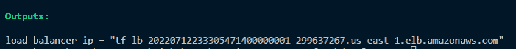

load balancer output

使用 Terraform 应用更改后，Jenkins 主负载平衡器 URL 应该会显示在您的终端会话中。

将您最喜欢的浏览器指向该 URL，您应该可以访问 Jenkins web dashboard。

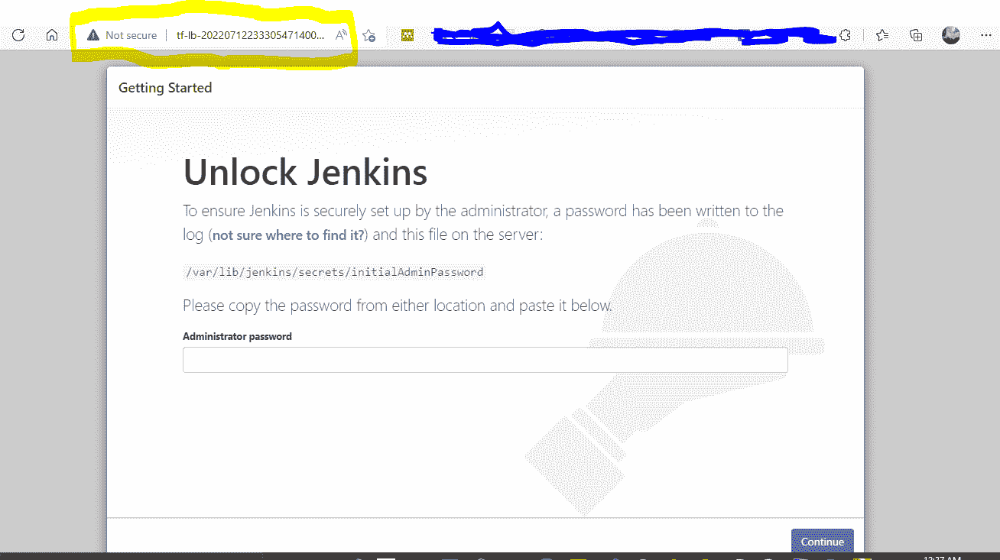

jenkins-instances

然后只需按照屏幕指示解锁即可。

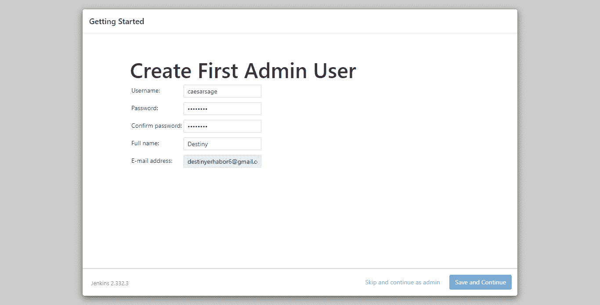

unlock jenkins

你可以在 GitHub repo 上找到完整的代码。

## 清理

为了避免运行 AWS 服务的不必要成本，您将需要运行以下命令来销毁所有已创建和正在运行的 resources:‌‌ `terraform destroy -var-file="secrets.tfvars"`,它将给出以下输出:

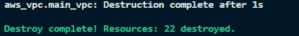

destroy resources

多有趣啊，对吧？只需几行代码，我们就可以摧毁并加速我们的资源。

## 摘要

在本教程中，您已经学习了如何在较高层次上使用 Terraform。您还通过在 AWS 云平台上配置 Jenkins 服务器了解了它的一个应用程序。

您还了解了 Terraform 后端状态和模块的最佳实践。

要了解更多关于 Terraform 及其众多用例的信息，你可以点击这里查看 Terraform 的官方文档。

快乐学习！