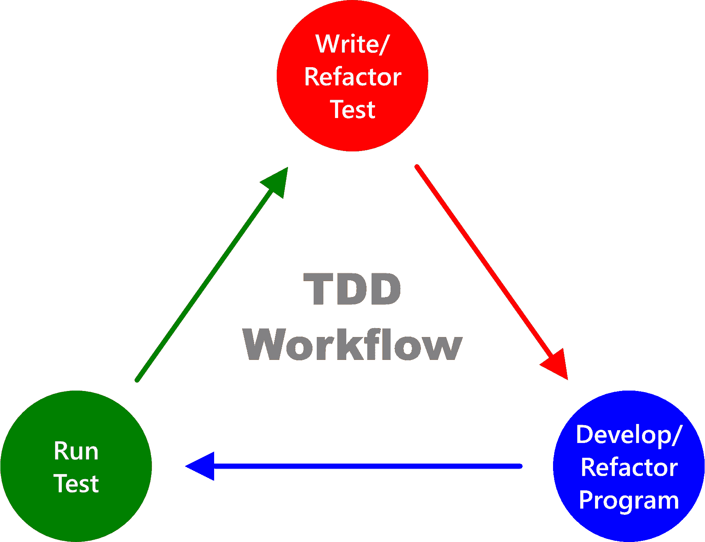

# 测试驱动开发教程——如何测试您的 JavaScript 和 ReactJS 应用程序

> 原文：<https://www.freecodecamp.org/news/test-driven-development-tutorial-how-to-test-javascript-and-reactjs-app/>

理解测试驱动的开发是成为一个多产的软件开发人员的重要部分。测试为构建可靠的程序提供了一个坚实的平台。

本教程将向您展示在 JavaScript 和 React 应用程序中实现测试驱动开发所需的一切。

## 目录

1.  什么是测试驱动开发？
2.  [测试驱动开发工作流程的 JavaScript 示例](#javascript-example-of-a-test-driven-development-workflow)
3.  [如何使用 Jest 作为测试实现工具](#how-to-use-jest-as-a-test-implementation-tool)
4.  [关于使用 ES6 模块和 Jest 的重要信息](#important-stuff-to-know-about-using-es6-modules-with-jest)
5.  测试驱动开发的优势是什么？
6.  [什么是测试驱动开发中的单元测试](#what-is-a-unit-test-in-test-driven-development)？
7.  [什么是测试驱动开发中的集成测试](#what-is-an-integration-test-in-test-driven-development)？
8.  什么是测试驱动开发中的端到端测试？
9.  [什么是测试驱动开发中的测试替身](#what-are-test-doubles-in-test-driven-development)？
10.  [到目前为止测试驱动开发的快速概述](#quick-overview-of-test-driven-development-so-far)
11.  [如何测试 React 组件](#how-to-test-react-components)
12.  [测试运行器 vs. React 组件测试工具:有什么区别？](#test-runner-vs-react-component-testing-tool-what-s-the-difference)
13.  [项目:React 测试如何工作](#project-how-react-testing-works)
14.  [概述](#overview)

所以，废话不多说，让我们从讨论测试驱动开发意味着什么开始。

## 什么是测试驱动开发？

测试驱动开发(TDD)是一种编码实践，你在创建程序之前写下你希望程序产生的结果。

换句话说，TDD 要求您预先指定您想要的程序必须产生的输出，以通过您所设想的运行方式的测试。

因此，在有效的测试驱动开发实践中，您应该首先编写测试来表达您对预期程序的预期结果。

随后，你将开发程序通过预先编写的测试。

例如，假设您希望创建一个加法计算器。在这种情况下，TDD 方法将是这样的:



Test-driven development workflow diagram

1.  编写一个测试，指定您期望计算器产生的结果，以通过作为您心目中的程序的测试。
2.  开发计算器通过预写测试。
3.  运行测试以检查计算器是否通过测试。
4.  重构您的测试代码(如有必要)。
5.  重构你的程序(如有必要)。
6.  继续循环，直到计算器符合你的视力。

现在让我们看一个 TDD 工作流的 JavaScript 例子。

## 测试驱动开发工作流的 JavaScript 示例

下面的步骤将使用一个简单的 JavaScript 程序向您展示如何使用 TDD。

### 1.编写您的测试

编写一个测试，指定您期望计算器程序产生的结果:

```
function additionCalculatorTester() {
  if (additionCalculator(4, 6) === 10) {
    console.log("✔ Test Passed");
  } else {
    console.error("❌ Test Failed");
  }
}
```

### 2.开发你的程序

开发计算器程序以通过预先编写的测试:

```
function additionCalculator(a, b) {
  return a + b;
}
```

### 3.运行测试

运行测试以检查计算器是否通过测试:

```
additionCalculatorTester();
```

[**在 StackBlitz** 上试一下](https://stackblitz.com/edit/js-ciui1u?devToolsHeight=33&file=index.js)

### 4.重构测试

在您确认您的程序通过了预先编写的测试之后，是时候检查是否有任何重构的必要了。

例如，您可以重构`additionCalculatorTester()`来使用一个[条件操作符](https://codesweetly.com/javascript-statement/#what-is-a-conditional-ternary-operator-in-javascript)，如下所示:

```
function additionCalculatorTester() {
  additionCalculator(4, 6) === 10 
    ? console.log("✔ Test Passed") 
    : console.error("❌ Test Failed");
}
```

### 5.重构程序

让我们也重构程序代码，使用一个[箭头函数](https://codesweetly.com/javascript-function-object#arrow-function-expression-in-javascript)。

```
const additionCalculator = (a, b) => a + b;
```

### 6.运行测试

重新运行测试以确保您的程序仍按预期运行。

```
additionCalculatorTester();
```

[**在 StackBlitz** 上试一下](https://stackblitz.com/edit/js-xp732h?devToolsHeight=33&file=index.js)

注意，在上面的例子中，我们没有使用任何库就实现了 TDD。

但是您也可以使用强大的测试运行工具，如 [Jasmine](https://jasmine.github.io/) 、 [Mocha](https://mochajs.org/) 、 [Tape](https://github.com/substack/tape) 和 [Jest](https://jestjs.io/) ，让您的测试实现更快、更简单、更有趣。

例如，让我们看看如何使用 Jest。

## 如何使用 Jest 作为测试实现工具

下面是开始使用 Jest 作为测试实现工具时需要遵循的步骤:

### 步骤 1:获得正确的节点和 NPM 版本

确保您的系统上安装了 Node 10.16(或更高版本)和 NPM 5.6(或更高版本)。

你可以从 [Node.js](https://nodejs.org/en/) 网站安装最新的 LTS 来获得这两者。

如果你喜欢用纱线，确保你有 0.25(或更大)的。

### 步骤 2:创建项目目录

为您的项目创建新文件夹。

```
mkdir addition-calculator-jest-project
```

### 步骤 3:导航到您的项目文件夹

使用命令行，导航到您的项目目录。

```
cd path/to/addition-calculator-jest-project
```

### 步骤 4:创建一个`package.json`文件

为您的项目初始化一个`package.json`文件。

```
npm init -y
```

或者，如果您的[包管理器](https://codesweetly.com/package-manager-explained)是 Yarn，运行:

```
yarn init -y
```

### 步骤 5:安装 Jest

将 Jest 作为开发依赖包安装，如下所示:

```
npm install jest --save-dev
```

或者，如果您的包管理器是 Yarn，运行:

```
yarn add jest --dev
```

### 步骤 6:让 Jest 成为项目的测试运行工具

打开您的`package.json`文件并将 Jest 添加到`test`字段。

```
{
  "scripts": {
    "test": "jest"
  }
}
```

### 步骤 7:创建您的项目文件

创建一个用于开发程序的文件。

```
touch additionCalculator.js
```

### 步骤 8:创建您的测试文件

创建一个您将用来编写测试用例的文件。

```
touch additionCalculator.test.js
```

**注意:**你的测试文件名必须以`.test.js`结尾——这样 Jest 就可以识别出它是包含你的测试代码的文件。

### 步骤 9:编写你的测试用例

打开您的测试文件，编写一些测试代码，指定您希望程序产生的结果。

**这里有一个例子:**

```
// additionCalculator.test.js

const additionCalculator = require("./additionCalculator");

test("addition of 4 and 6 to equal 10", () => {
  expect(additionCalculator(4, 6)).toBe(10);
});
```

下面是我们在上面的片段中所做的:

1.  我们将`additionCalculator.js`项目文件导入到`additionCalculator.test.js`测试文件中。
2.  我们编写了一个测试用例，指定每当用户提供`4`和`6`作为其[参数](https://codesweetly.com/javascript-arguments)时，我们期望`additionCalculator()`程序输出`10`。

**注:**

*   [`test()`](https://jestjs.io/docs/api#testname-fn-timeout) 是 Jest 的全局方法之一。它接受三个参数:
    1.  测试的名称(`"addition of 4 and 6 to equal 10"`)。
    2.  包含要测试的期望值的函数。
    3.  可选的超时参数。
*   [`expect()`](https://jestjs.io/docs/expect#expectvalue) 是一个 Jest 方法，让你测试代码的输出。
*   [`toBe()`](https://jestjs.io/docs/expect#tobevalue) 是一个[笑话匹配器](https://jestjs.io/docs/using-matchers)功能，使您能够将`expect()`的参数与原始值进行比较。

假设您现在运行测试代码。测试会失败，因为您还没有开发您创建测试的程序。所以，我们现在就开始吧。

### 步骤 10:开发你的程序

打开你的项目文件，开发一个程序来通过预先写好的测试。

**这里有一个例子:**

```
// additionCalculator.js

function additionCalculator(a, b) {
  return a + b;
}

module.exports = additionCalculator;
```

上面的代码片段创建了一个`additionCalculator()`程序，并用`module.exports`语句将其导出。

### 步骤 11:运行测试

运行预先编写的测试来检查您的程序是通过还是失败。

```
npm run test
```

或者，你可以像这样使用纱线:

```
yarn test
```

假设您的项目包含多个测试文件，并且您希望运行一个特定的文件。在这种情况下，按如下方式指定测试文件:

```
npm run test additionCalculator.test.js
```

或者，你可以像这样使用纱线:

```
yarn test additionCalculator.test.js
```

一旦你开始测试，Jest 会在你的编辑器控制台上打印一个通过或失败的信息。该消息将类似于以下内容:

```
$ jest
 PASS  ./additionCalculator.test.js
  √ addition of 4 and 6 to equal 10 (2 ms)

Test Suites: 1 passed, 1 total
Tests:       1 passed, 1 total
Snapshots:   0 total
Time:        2.002 s
Ran all test suites.
Done in 7.80s.
```

如果您喜欢 Jest 自动运行您的测试，那么将`--watchAll`选项添加到您的`package.json`的`test`字段中。

**这里有一个例子:**

```
{
  "scripts": {
    "test": "jest --watchAll"
  }
}
```

添加`--watchAll`之后，重新执行`npm run test`(或`yarn test`)命令，让 Jest 在您保存更改时自动开始重新运行您的测试。

**注:**按键盘上的 **Q** 键可以退出手表模式。

### 步骤 12:重构测试代码

因此，现在您已经确认了您的程序正在按预期工作，是时候检查是否有任何重构测试代码的需要了。

例如，假设您意识到`additionalCalculator`应该允许用户添加任意数量的数字。在这种情况下，您可以像这样重构您的测试代码:

```
// additionCalculator.test.js

const additionCalculator = require("./additionCalculator");

describe("additionCalculator's test cases", () => {
  test("addition of 4 and 6 to equal 10", () => {
    expect(additionCalculator(4, 6)).toBe(10);
  });

  test("addition of 100, 50, 20, 45 and 30 to equal 245", () => {
    expect(additionCalculator(100, 50, 20, 45, 30)).toBe(245);
  });

  test("addition of 7 to equal 7", () => {
    expect(additionCalculator(7)).toBe(7);
  });

  test("addition of no argument provided to equal 0", () => {
    expect(additionCalculator()).toBe(0);
  });
});
```

注意，我们在上面的代码片段中使用的 [describe()](https://jestjs.io/docs/api#describename-fn) 方法是可选代码——它有助于将相关的测试用例组织成组。

`describe()`接受两种说法:

1.  您希望给测试用例组起一个名字——例如，`"additionCalculator's test cases"`。
2.  包含测试用例的函数。

### 步骤 13:重构程序

所以，现在你已经重构了你的测试代码，让我们对`additionalCalculator`程序做同样的事情。

```
// additionCalculator.js

function additionCalculator(...numbers) {
  return numbers.reduce((sum, item) => sum + item, 0);
}

module.exports = additionCalculator;
```

下面是我们在上面的片段中所做的:

1.  `...numbers`代码使用 JavaScript 的 [rest 操作符](https://codesweetly.com/javascript-rest-operator) ( `...`)将函数的参数放入一个数组。
2.  `numbers.reduce((sum, item) => sum + item, 0)`代码使用 JavaScript 的 [reduce()](https://codesweetly.com/javascript-reduce-method) 方法对`numbers`数组中的所有项目求和。

### 步骤 14:重新运行测试

一旦你完成了代码的重构，重新运行测试来确认你的程序仍然像预期的那样工作。

### 就是这样！

恭喜你！您已经成功地使用 Jest 开发了一个使用测试驱动开发方法的加法计算器程序！🎉

## 关于使用 ES6 模块和 Jest 的重要知识

Jest 目前不识别 ES6 模块。

然而，假设您更喜欢使用 ES6 的导入/导出语句。在这种情况下，请执行以下操作:

### 1.将 Babel 作为开发依赖项安装

```
npm install @babel/preset-env --save-dev
```

或者，你可以使用纱线:

```
yarn add @babel/preset-env --dev
```

### 2.在项目的根目录下创建一个`.babelrc`文件

```
touch .babelrc
```

### 3.打开`.babelrc`文件，复制下面的代码

```
{ "presets": ["@babel/preset-env"] }
```

上面的配置现在允许您更改第 9 步的`require()`语句，如下所示:

```
const additionCalculator = require("./additionCalculator");
```

...对此:

```
import additionCalculator from "./additionCalculator";
```

同样，您现在也可以用下面的语句替换步骤 10 的`export`语句:

```
module.exports = additionCalculator;
```

...对此:

```
export default additionCalculator;
```

**注:** Jest 在他们的[使用巴别塔](https://jestjs.io/docs/getting-started#using-babel)文档中也指定了类似的指令。

### 4.重新运行测试

您现在可以重新运行测试，以确认您的程序仍然工作！

所以，现在我们知道了什么是测试驱动开发，我们可以讨论它的优势了。

## 测试驱动开发的优势是什么？

下面是在你的编程工作流程中采用测试驱动开发(TDD)的两个主要优点。

### 1.理解你的计划的目的

测试驱动的开发帮助你理解你的程序的目的。

换句话说，因为你在实际程序之前写测试，所以 TDD 让你考虑你希望你的程序做什么。

然后，在您使用一个或多个测试记录了程序的目的之后，您就可以自信地继续创建程序了。

因此，TDD 是一种有用的方法，可以记下您期望您的计划产生的具体结果。

### 2.信心助推器

TDD 是了解您的程序是否按预期工作的基准。它给你信心，你的程序工作正常。

因此，不管您的代码库将来会有什么样的发展，TDD 都提供了一种有效的方法来测试您的程序是否还能正常工作。

现在让我们讨论一些流行的 TDD 术语:“单元测试”、“集成测试”、“E2E”和“测试加倍”

## 什么是测试驱动开发中的单元测试？

单元测试是你写的一个测试，用来评估一个独立程序的功能。换句话说，单元测试检查一个完全隔离的程序单元是否按预期工作。

我们为步骤 10 的`additionalCalculator`程序编写的测试是一个优秀的单元测试例子。

步骤 10 的`additionalCalculator()`的测试是一个单元测试，因为程序是一个独立的功能，不依赖于任何外部代码。

请注意，单元测试的主要目的不是检查错误。相反，单元测试的核心目的是检查程序的一个独立部分(称为单元)在各种测试用例下是否如预期的那样运行。

## 什么是测试驱动开发中的集成测试？

一个**集成测试**评估一个相关程序的功能。换句话说，集成测试检查一个依赖于其他代码的程序是否按预期运行。

我们为步骤 13 的`additionalCalculator`程序编写的测试是集成测试的一个很好的例子。

步骤 13 的`additionalCalculator()`测试是一个集成测试，因为程序是一个依赖于 JavaScript 的 [reduce()](https://codesweetly.com/javascript-reduce-method) 方法的依赖函数。

换句话说，我们使用预先编写的测试用例来评估`additionalCalculator()`和`reduce()`的集成。

因此，假设 JavaScript 使`reduce()`成为一个过时的方法。在这种情况下，`additionalCalculator`将因为`reduce()`方法而无法通过测试。

## 什么是测试驱动开发中的端到端测试？

端到端(E2E)测试评估用户界面的功能。换句话说，E2E 检查你的用户界面是否按预期工作。

观看 [Max 的 YouTube 视频](https://youtu.be/r9HdJ8P6GQI?t=1755)可以很好地了解端到端测试。

## 什么是测试驱动开发中的测试替身？

**测试替身**是用来模仿真实依赖关系的模仿对象，比如数据库、库、网络和 API。

双精度测试允许你绕过你的程序所依赖的自然物体。它们让你独立于任何依赖来测试你的代码。

例如，假设您需要验证应用程序中检测到的错误是来自外部 API 还是您的代码。

但是假设 API 的服务只在生产环境中可用，而不在开发环境中。在这种情况下，你有两个选择:

1.  等到你的应用上线——这可能需要几个月的时间。
2.  克隆 API，这样无论依赖项是否可用，您都可以继续测试。

测试替身提供了一种有用的方法来克隆程序的依赖关系，这样你的测试活动就不会遇到任何中断。

测试替身的典型例子是虚拟对象、模拟、伪造和存根。下面我们来讨论一下。

### 测试驱动开发中的假人是什么？

**dummy** 是一个测试 double，用于模拟特定依赖关系的值。

例如，假设您的应用程序依赖于一个第三方方法，该方法要求您提供一些参数。在这种情况下，哑元允许您向该方法的参数传递假值。

### 测试驱动开发中的 mock 是什么？

**Mock** 是一个测试 double，用于模拟外部依赖关系，而不考虑依赖关系可能返回的响应。

例如，假设您的应用程序依赖于第三方 API(例如，脸书)，而您无法在开发模式下访问该 API。Mock 允许您绕过 API，这样您就可以专注于测试您的代码，而不管脸书 API 是否可用。

### 测试驱动开发中的存根是什么？

一个 **stub** 是一个测试 double，用于在返回手工编码的值时模拟外部依赖关系。您可以使用返回值，通过依赖项的各种测试用例响应来评估程序的行为。

例如，假设您的应用程序依赖于第三方 API(例如，脸书)，而您无法在开发模式下访问该 API。Stub 允许您绕过 API，同时模拟脸书将返回的确切值。

因此，stub 帮助您评估程序在各种响应场景下的行为。

### 测试驱动开发中什么是假的？

**Fake** 是一个测试 double，用于创建一个具有动态值的外部依赖的工作测试实现。

例如，您可以使用 fake 创建一个本地数据库，它允许您测试一个真实的数据库将如何与您的程序一起工作。

## 迄今为止测试驱动开发的快速概述

我们已经知道测试驱动开发可以帮助你在创建程序之前记录下程序的行为。

我们还看到了一个简单的 JavaScript 测试，并使用 Jest 作为测试实现工具。

现在让我们看看如何测试 React 组件。

## 如何测试 React 组件

测试 React 组件需要的两个主要工具是:

1.  测试运行工具
2.  React 组件测试工具

但是测试运行器和 React 组件测试工具之间的区别到底是什么呢？让我们找出答案。

## 测试运行器与 React 组件测试工具:有什么区别？

下面是测试运行器和 React 组件测试工具之间的区别。

### 什么是试跑者？

**测试运行程序**是开发人员用来运行测试脚本并在命令行(CLI)上打印测试结果的工具。

例如，假设您希望在项目的`App.test.js`测试脚本中运行测试用例。在这种情况下，您将使用一个测试运行器。

测试运行程序将执行`App.test.js`并在命令行上打印测试结果。

试跑者的典型例子有[茉莉](https://jasmine.github.io/)、[摩卡](https://mochajs.org/)、[胶带](https://github.com/substack/tape)和 [Jest](https://jestjs.io/) 。

### 什么是 React 组件测试工具？

一个 **React 组件测试工具**为定义组件的测试用例提供了有用的 API。

例如，假设您需要测试项目的`<App />`组件。在这种情况下，您将使用 React 组件测试工具来定义组件的测试用例。

换句话说，React 组件测试工具提供了编写组件测试用例的 API。

典型的例子有[酶](https://enzymejs.github.io/enzyme/)和[反应测试库](https://testing-library.com/docs/react-testing-library/intro)。

所以，现在我们知道了什么是测试运行器和 React 组件测试工具，让我们用一个小项目来理解 React 测试是如何工作的。

## 项目:反应测试如何工作

在接下来的步骤中，我们将使用 [Jest](https://en.wikipedia.org/wiki/Jest_(JavaScript_framework)) 和 [React 测试库](https://testing-library.com/docs/react-testing-library/intro)(作者 Kent C. Dodds)来了解 React 测试是如何工作的。

**注:**React 官方文档[推荐](https://reactjs.org/docs/testing.html#tools)测试 React 组件的 Jest 和 React 测试库组合。

### 步骤 1:获得正确的节点和 NPM 版本

确保您的系统上安装了 [Node 10.16](https://codesweetly.com/package-manager-explained#how-to-check-the-installed-node-version) (或更高版本)和 NPM 5.6(或更高版本)。

如果你喜欢用纱线，确保你有 0.25(或更大)的纱线。

### 步骤 2:创建一个新的 React 应用程序

使用 NPM 的 [create-react-app](https://create-react-app.dev/) 包创建一个名为`react-testing-project`的新 react 应用。

```
npx create-react-app react-testing-project
```

或者，您可以使用 Yarn 来配置您的项目，如下所示:

```
yarn create react-app react-testing-project
```

### 步骤 3:进入项目目录

安装过程结束后，导航到项目目录，如下所示:

```
cd react-testing-project
```

### 步骤 4:设置您的测试环境

安装以下测试包:

*   玩笑
*   @测试-库/反应
*   @testing-library/jest-dom
*   @测试-库/用户-事件

**注意:**如果您已经用`create-react-app`(步骤 2)初始化了 React 项目，那么您不需要安装上面的任何包。它们预先安装并预配置在您的`package.json`文件中。

现在，让我们讨论一下上面每个测试包的目的。

#### 什么是玩笑？

jest 是测试运行工具，我们将使用它来运行这个项目的测试脚本，并在命令行上打印测试结果。

#### @testing-library/react 是什么？

[@testing-library/react](https://www.npmjs.com/package/@testing-library/react) 是 react 测试库，它提供了为 React 组件编写测试用例所需的 API。

#### 什么是@testing-library/jest-dom？

@testing-library/jest-dom 提供了一些自定义的 jest 匹配器来测试 dom 的状态。

**注意:** Jest 已经有了很多匹配器，所以使用`jest-dom`是可选的。通过提供匹配器，简单地扩展 Jest，使你的测试更具声明性，易读，易维护。

#### 什么是@测试库/用户事件？

[@ testing-library/user-event](https://www.npmjs.com/package/@testing-library/user-event)提供了`userEvent` API，用于在网页上模拟用户与你的应用的交互。

**注意:** `@testing-library/user-event`是 [fireEvent](https://testing-library.com/docs/dom-testing-library/api-events/#fireevent) API 的更好替代。

### 第五步:清理`src`文件夹

删除项目目录的`src`文件夹中的所有文件。

### 步骤 6:创建您的代码文件

在项目的`src`文件夹中创建以下文件。

*   `index.js`
*   `App.js`
*   `App.test.js`

### 第 7 步:呈现`App`组件

打开您的`index.js`文件，将`App`组件呈现到 DOM，如下所示:

```
// index.js

import React from "react";
import { createRoot } from "react-dom/client";
import App from "./App";

// Render the App component into the root DOM
createRoot(document.getElementById("root")).render(<App />);
```

### 步骤 8:编写你的测试用例

假设您希望您的`App.js`文件向网页呈现一个`<h1>CodeSweetly Test</h1>`元素。在这种情况下，打开您的*测试脚本*，并编写一些测试代码，指定您期望您的`<App />`组件产生的结果。

**这里有一个例子:**

```
// App.test.js

import React from "react";
import { render, screen } from "@testing-library/react";
import "@testing-library/jest-dom";
import App from "./App";

test("codesweetly test heading", () => {
  render(<App />);
  expect(screen.getByRole("heading")).toHaveTextContent(/codesweetly test/i);
});
```

下面是我们在上面的测试片段中做的主要事情:

1.  我们导入了编写测试用例所需的包。
2.  我们编写了一个测试用例，指定我们期望我们的`<App />`组件呈现一个带有`"codesweetly test"`文本的标题元素。

*   [`test()`](https://jestjs.io/docs/api#testname-fn-timeout) 是 Jest 的全局方法之一。我们用它来运行一个测试用例。该方法接受三个参数:
    *   测试的名称(`"codesweetly test heading"`)
    *   包含要测试的期望值的函数
    *   可选的超时参数
*   [`render()`](https://testing-library.com/docs/react-testing-library/api/#render) 是 React 测试库 API 之一。我们用它来呈现我们想要测试的组件。
*   [`expect()`](https://jestjs.io/docs/expect#expectvalue) 是一个 Jest 方法，让你测试代码的输出。
*   [`screen`](https://testing-library.com/docs/queries/about/#screen) 是一个 React 测试库的对象，包含许多在页面上查找元素的方法。
*   [`getByRole()`](https://testing-library.com/docs/queries/about/#priority) 是 React 测试库的查询方法之一，用于查找页面上的元素。
*   [`toHaveTextContent()`](https://github.com/testing-library/jest-dom#tohavetextcontent) 是`jest-dom`的自定义匹配器之一，您可以使用它来确认特定节点中文本内容的存在。
*   `/codesweetly test/i`是一个[正则表达式](https://codesweetly.com/javascript-regular-expression-object)语法，我们用来为`codesweetly test`指定不区分大小写的搜索。

请记住，有三种方法可以编写上述 expect 语句:

```
// 1\. Using jest-dom's toHaveTextContent() method:
expect(screen.getByRole("heading")).toHaveTextContent(/codesweetly test/i);

// 2\. Using the heading's textContent property and Jest's toMatch() method:
expect(screen.getByRole("heading").textContent).toMatch(/codesweetly test/i);

// 3\. Using React Testing Library's name option and jest-dom's toBeInTheDocument() method
expect(screen.getByRole("heading", { name: /codesweetly test/i })).toBeInTheDocument();
```

**提示:**

在`getByRole()`方法中添加一个`level`选项来指定你的标题级别。

**这里有一个例子:**

```
test("codesweetly test heading", () => {
  render(<App />);
  expect(screen.getByRole("heading", { level: 1 })).toHaveTextContent(/codesweetly test/i);
});
```

`level: 1`选项指定了一个`<h1>`标题元素。

假设您现在运行测试代码。测试将会失败，因为您还没有开发为其创建测试的组件。所以，我们现在就开始吧。

### 步骤 9:开发 React 组件

打开您的`App.js`文件，开发组件以通过预先编写的测试。

**这里有一个例子:**

```
// App.js

import React from "react";

const App = () => <h1>CodeSweetly Test</h1>;

export default App;
```

上面代码片段中的`App`组件呈现了一个包含`"CodeSweetly Test"`文本的`<h1>`元素。

### 步骤 10:运行测试

运行预先编写的测试来检查您的程序是通过还是失败。

```
npm test App.test.js
```

或者，你可以像这样使用纱线:

```
yarn test App.test.js
```

一旦你启动了测试，Jest 将在你的编辑器控制台上打印一条通过或失败的消息。该消息将类似于以下内容:

```
$ jest
 PASS  src/App.test.js
  √ codesweetly test heading (59 ms)

Test Suites: 1 passed, 1 total
Tests:       1 passed, 1 total
Snapshots:   0 total
Time:        3.146 s
Ran all test suites related to changed files.
```

**注意:**`create-react-app`默认在[观看模式](https://codesweetly.com/javascript-module-bundler/#what-is-webpack---progress---watch)下配置 Jest。因此，在运行`npm test`(或`yarn test`之后，您当前打开的终端将继续处理`test`命令的活动。所以，你将不能在那个终端上输入任何命令，直到你停止`test`的执行。但是您可以在处理`test`的同时打开一个新的终端窗口。

换句话说，用一个终端运行`test`，另一个终端输入命令。

### 步骤 11:运行应用程序

运行以下命令，在浏览器中查看您的应用:

```
npm start
```

或者，如果您的[包管理器](https://codesweetly.com/package-manager-explained)是 Yarn，运行:

```
yarn start
```

运行上面的命令后，你的应用将自动在默认浏览器上打开。

### 步骤 12:重构测试代码

假设您希望在用户单击按钮时更改标题的文本。在这种情况下，您可以模拟用户与按钮的交互，以确认它按预期工作。

**这里有一个例子:**

```
// App.test.js

import React from "react";
import { render, screen } from "@testing-library/react";
import userEvent from "@testing-library/user-event";
import "@testing-library/jest-dom";
import App from "./App";

describe("App component", () => {
  test("codesweetly test heading", () => {
    render(<App />);
    expect(screen.getByRole("heading")).toHaveTextContent(/codesweetly test/i);
  });

  test("a codesweetly project heading", () => {
    render(<App />);

    const button = screen.getByRole("button", { name: "Update Heading" });

    userEvent.click(button);

    expect(screen.getByRole("heading")).toHaveTextContent(/a codesweetly project/i);
  });
});
```

下面是我们在上面的测试片段中做的主要事情:

1.  我们导入了编写测试用例所需的包。
2.  我们编写了一个测试用例，指定我们期望`<App />`组件呈现一个带有`"codesweetly test"`文本的标题元素。
3.  我们编写了另一个测试用例，模拟用户与应用程序的按钮元素的交互。换句话说，我们指定每当用户点击按钮时，我们期望`<App />`的标题更新为`"a codesweetly project"`文本。

**注:**

*   [`describe()`](https://jestjs.io/docs/api#describename-fn) 是 Jest 的全局方法之一。它是帮助将相关测试用例组织成组的可选代码。`describe()`接受两个参数:
    *   您希望给测试用例组起一个名字——例如，`"App component"`。
    *   包含测试用例的函数。
*   [`userEvent`](https://www.npmjs.com/package/@testing-library/user-event) 是 React 测试库的一个包，包含了几种模拟用户与应用交互的方法。例如，在上面的代码片段中，我们使用了`userEvent`的`click()`方法来模拟按钮元素上的点击事件。
*   我们为每个测试用例渲染了`<App />`,因为 React 测试库在每次测试后都会卸载渲染的组件。然而，假设您对一个组件有许多测试用例。在这种情况下，使用 Jest 的 [`beforeEach()`](https://jestjs.io/docs/api#beforeeachfn-timeout) 方法在您的文件(或`describe`块)中的每个测试之前运行`render(<App />)`。

### 步骤 13:重构 React 组件

所以，现在您已经重构了您的测试代码，让我们对`App`组件做同样的事情。

```
// App.js

import React, { useState } from "react";

const App = () => {
  const [heading, setHeading] = useState("CodeSweetly Test");

  const handleClick = () => {
    setHeading("A CodeSweetly Project");
  };

  return (
    <>
      <h1>{heading}</h1>
      <button type="button" onClick={handleClick}>
        Update Heading
      </button>
    </>
  );
};

export default App;
```

下面是我们在上面的代码片段中做的主要事情:

1.  用一个`"CodeSweetly Test"`字符串初始化`App`的`heading`状态。
2.  我们编写了一个`handleClick`函数来更新`heading`状态。
3.  我们向 DOM 呈现了一个`<h1>`和`<button>`元素。

请注意以下几点:

*   `<h1>`的内容是`heading`状态的当前值。
*   每当用户点击按钮元素时，`onClick()`事件监听器将触发`handleClick()`函数。并且`handleClick`会将`App`的`heading`状态更新为`"A CodeSweetly Project"`。因此，`<h1>`的内容会变成`"A CodeSweetly Project"`。

### 步骤 14:重新运行测试

一旦你重构了你的组件，重新运行测试(或者检查正在运行的测试)来确认你的应用程序仍然像预期的那样工作。

之后，检查浏览器以查看您最近的更新。

### 就是这样！

恭喜你！您已经成功地使用 Jest 和 React 测试库测试了 React 组件。🎉

## 概观

本文讨论了测试驱动开发如何在 JavaScript 和 ReactJS 应用程序中工作。

我们还学习了如何使用 Jest 和 React 测试库来使测试更加简单和快速。

感谢阅读！

### 这里有一个有用的资源:

我写了一本关于 React 的书！

*   这是初学者友好的✔
*   它有✔的现场代码片段
*   它包含可扩展的项目✔
*   ✔有很多容易理解的例子

[React 解释清楚](https://www.amazon.com/dp/B09KYGDQYW)的书就是你理解 ReactJS 所需要的全部。

[](https://www.amazon.com/dp/B09KYGDQYW)