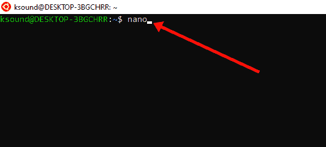
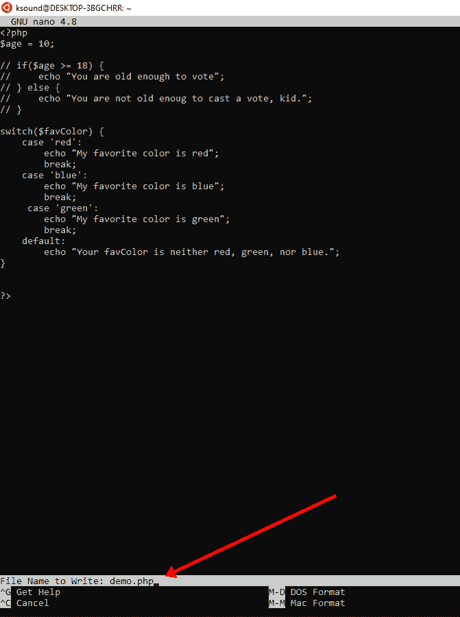
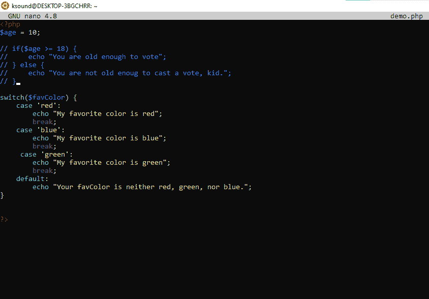
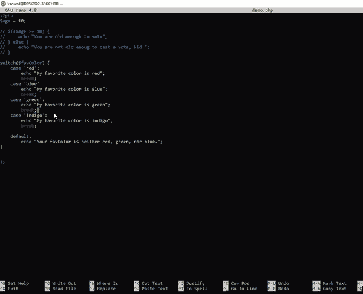

# 如何在终端中保存和退出 Nano–Nano Quit 命令

> 原文：<https://www.freecodecamp.org/news/how-to-save-and-exit-nano-in-terminal-nano-quit-command/>

Nano 是一个基于命令行的代码编辑器，与 Vim 和 Emacs 等其他编辑器相比，它以简单著称。

但是如果你是 Nano 的新手，执行基本操作，比如创建文件、保存文件和退出编辑器，可能会感到困惑。

因此，在本文中，我想向您展示如何在 Nano 中保存代码并退出代码。

在本文中，我将使用 Linux 的 Windows 子系统(WSL)。但是如果你是在 Linux 本身上的话，这是没问题的。命令是相同的。

## 我们将涵盖的内容

*   [如何在 Nano 中保存文件](#howtosaveafileinnano)
*   [如何退出 Nano](#howtoexitnano)
*   [结束](#wrappingup)

## 如何在 Nano 中保存文件

**第一步**:打开 WSL，输入“nano”，点击`ENTER`进入 Nano 代码编辑器

第二步:用任何语言编写你的代码。在下面的截图中，我写了一些 PHP。

**注意:**如果你没有得到语法高亮，通过按`ALT` + `4`启用它。如果您仍然没有突出显示语法，那么您需要保存文件。

**第三步:**按`CTRL` + `O`保存文件，输入文件名，点击`ENTER`。

现在，语法高亮显示被启用:

如果您已经通过在 WSL 中键入`nano file_name`打开了文件…

完成更改后，按`CTRL + O`并点击`ENTER`保存更改。

## 如何退出 Nano

要退出 nano，你需要做的就是按`CTRL` + `X`。

如果您有任何尚未保存的更改，在退出编辑器之前，系统会提示您保存更改。

## 包扎

我希望这篇文章能帮助你学会如何在 Nano 中保存文件，并随时退出编辑器。

不要忘记:

*   键入`nano`进入 WSL 中的 Nano 编辑器
*   `CTRL` + `O`保存一个 Nano 文件
*   `CTRL` + `X`退出纳米

感谢您的阅读。如果你觉得这篇文章有帮助，不要犹豫，与你的朋友和家人分享。