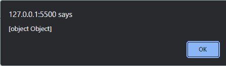
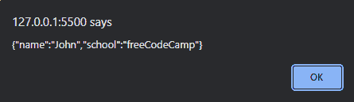

# JavaScript 中的[object，object]——JS 中的含义

> 原文：<https://www.freecodecamp.org/news/object-object-in-javascript-meaning-in-js/>

在 JavaScript 中处理对象时，您可能会遇到`[object, object]`输出。虽然这看起来无关紧要，但不一定是错误。

`[object, object]`是 JavaScript 对象数据类型的字符串表示。随着本文的深入，您会更好地理解。

在两种主要情况下，您会遇到这样的输出:

*   当你尝试使用`alert()`方法显示一个对象时(最常见)。
*   当你在一个对象上使用`toString()`方法时。

让我们来看一些例子。

## 如果用 JavaScript 警告一个对象会发生什么？

在这一节中，您将看到使用`alert()`方法在 JavaScript 中显示对象时会发生什么。下面是代码示例:

```
const student = {
  name: "John",
  school: "freeCodeCamp",
};

alert(student)
```

在上面的代码中，我们创建了一个名为`student`的对象。使用`alert()`方法在浏览器中显示对象后，我们得到了下面的输出:



在上图中，没有显示对象及其属性，而是显示了`[object, object]`。

这是因为当使用`alert()`方法在 JavaScript 中显示一个对象时，显示的是字符串格式。

要解决这个问题，您可以使用`JSON.stringify()`方法将对象更改为一个字符串，该字符串可以使用`alert()`方法在浏览器中弹出。这里有一个例子:

```
const student = {
  name: "John",
  school: "freeCodeCamp",
};

alert(JSON.stringify(student));
```

运行上面的代码时，应该会显示对象及其属性，类似于下图。



## 在 JavaScript 中对一个对象使用`toString()`方法会发生什么？

JavaScript 中的`toString()`方法返回对象的字符串格式。本节将帮助您理解上一节中发生的事情。

当您在 JavaScript 中对一个对象使用`toString()`方法时，您会得到返回的字符串表示–`[object, object]`。

```
const student = {
  name: "John",
  school: "freeCodeCamp",
};

console.log(student.toString());
// [object Object]
```

正如你在上面的代码中看到的，我们在一个名为`student` : `student.toString()`的对象上使用了`toString()`方法。

当我们将此记录到控制台时，我们得到了`[object, object]`。

这种效果正是当您使用`alert()`方法在浏览器中弹出一个对象时所发生的(正如我们在上一节中看到的)。

## 摘要

在本文中，我们讨论了 JavaScript 中奇怪的`[object, object]`输出。

我们必须理解输出是 JavaScript 中对象数据类型的字符串表示。

当您试图使用`alert()`方法在浏览器中显示一个对象时，或者当您对一个对象使用`toString()`方法时，您很可能会看到这样的输出。

我们还通过一些代码示例和图片展示了如何在 JavaScript 中看到`[object, object]`。

编码快乐！