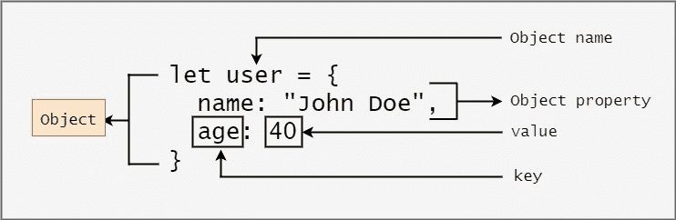

# 对象中的 JavaScript 键——如何检查对象在 JS 中是否有键

> 原文：<https://www.freecodecamp.org/news/how-to-check-if-an-object-has-a-key-in-javascript/>

JavaScript 中的对象是非原始数据类型，它们持有一个无序的键值对集合。



正如您在上面的图像中看到的，键是属性，每个对象值都必须有一个键。

当与对象交互时，可能会出现需要您检查特定键是否存在的情况。重要的是要注意，如果你知道一个键存在，那就自动意味着一个值存在。该值可以是任何值，甚至可以是空的、null 或未定义的。

在本文中，我们将学习各种方法来检查 JavaScript 中是否存在对象的键。

如果你赶时间，这里有两种标准方法可以用来检查:

```
// Using in operator
'key' in object

// Using hasOwnProperty() method
object.hasOwnProperty('key') 
```

## 如何在 JavaScript 中用`in`操作符检查对象是否有`key`

您可以使用 JavaScript `in`操作符来检查对象中是否存在指定的属性/键。它有一个简单的语法，如果指定的属性/键存在于指定的对象或其原型链中，它将返回`true`。

使用 [`in`](https://www.freecodecamp.org/news/the-javascript-in-operator-explained-with-examples/) [运算符](https://www.freecodecamp.org/news/the-javascript-in-operator-explained-with-examples/)时的语法是:

```
'key' in object 
```

假设我们有一个包含用户详细信息的对象:

```
let user = {
  name: "John Doe",
  age: 40
}; 
```

我们可以用如下所示的`in`操作符检查一个键是否存在:

```
'name' in user; // Returns true
'hobby' in user; // Returns false
'age' in user; // Returns true 
```

注意:`in`关键字前的值应该是类型`string`或`symbol`。

## 如何在 JavaScript 中用`hasOwnProperty()`方法检查对象是否有`key`

您可以使用 JavaScript `hasOwnProperty()`方法来检查指定的对象是否将给定的属性作为其属性。T

他的方法非常类似于`in`操作符。它接受一个`string`，如果对象中存在`key`，它将返回`true`，否则返回`false`。

使用`hasOwnProperty()`方法时的语法是:

```
object.hasOwnProperty('key') 
```

假设我们有一个包含用户详细信息的对象:

```
let user = {
  name: "John Doe",
  age: 40
}; 
```

我们可以用如下所示的`in`操作符检查一个键是否存在:

```
user.hasOwnProperty('name'); // Returns true
user.hasOwnProperty('hobby'); // Returns false
user.hasOwnProperty('age'); // Returns true 
```

注意:传递给`hasOwnProperty()`方法的值应该是类型`string`或`symbol`。

既然我们现在知道这些方法存在，我们现在可以使用一个条件来检查和执行我们希望执行的任何操作:

```
if ("name" in user) {
  console.log("the key exists on the object");
}

// Or

if (user.hasOwnProperty("name")) {
  console.log("the key exists on the object");
} 
```

## 包扎

在本文中，我们学习了如何使用两种标准方法检查对象是否有键。这两种方法的区别在于，`Object.hasOwnProperty()`只在对象中寻找一个键，而`in`操作符在对象及其原型链中寻找键。

您还可以使用其他方法，但是在某些时候，这些方法可能会过于复杂，不容易理解。在特定条件下测试时，它们也可能会失败。

例如，我们可以使用可选的链接，因此如果指定的键不存在，它将返回`undefined`:

```
let user = {
  name: "John Doe",
  age: 40
};

console.log(user?.name); // Returns John Doe
console.log(user?.hobby); // Returns undefined
console.log(user?.age); // Returns 40 
```

所以我们可以创建一个条件，当它不等于`undefined`时，就意味着这个键存在:

```
if (user?.hobby !== undefined) {
  console.log("The key exists on the object");
} 
```

如前所述，这些方法在一些不常见的情况下会失败。例如，在特定键设置为“未定义”的情况下，如下所示，条件失败:

```
let user = {
  name: "John Doe",
  age: undefined
};

console.log(user?.age); // Returns undefined 
```

另一个例子是当我们在使用`some()`方法的同时使用了`Object.keys()`方法。这是可行的，但并不容易理解:

```
let user = {
  name: "John Doe",
  age: undefined
};

const checkIfKeyExist = (objectName, keyName) => {
    let keyExist = Object.keys(objectName).some(key => key === keyName);
    return keyExist;
};

console.log(checkIfKeyExist(user, 'name')); // Returns true 
```

在上面的代码中，我们将所有的键作为一个数组，然后应用`some()`方法来测试数组中是否至少有一个元素通过了测试。如果通过，则返回`true`，否则返回`false`。

编码快乐！