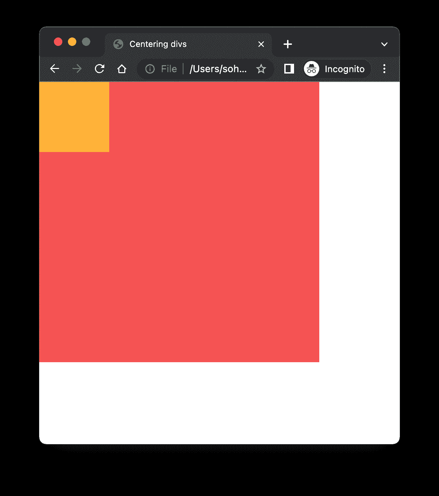
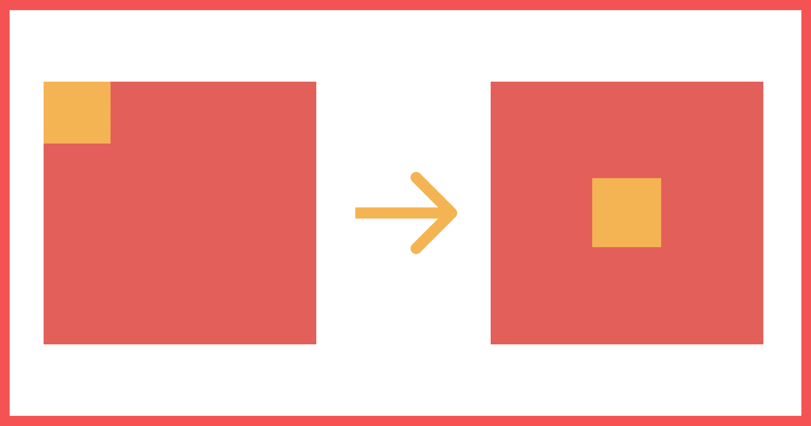
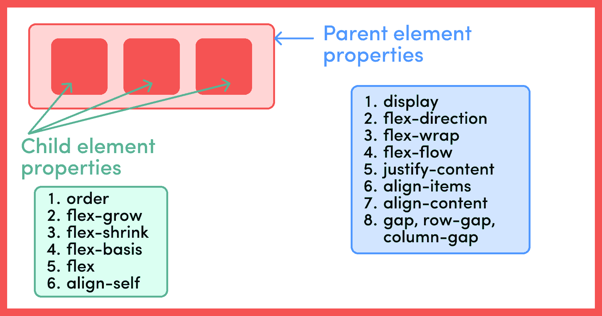
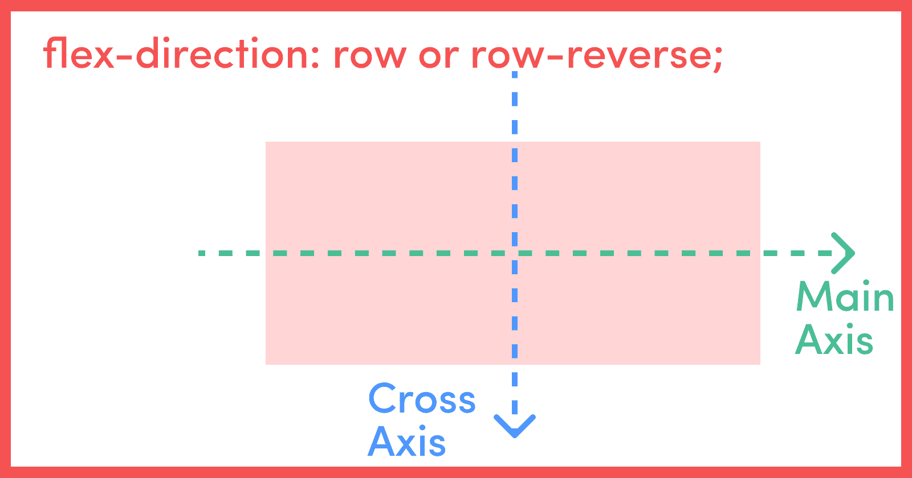
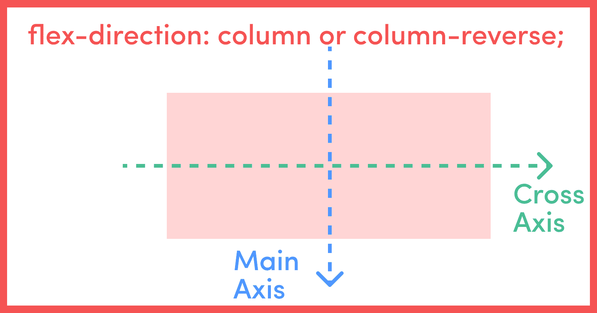
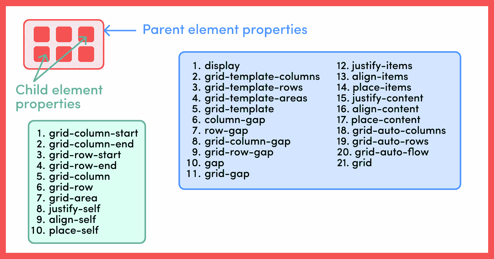
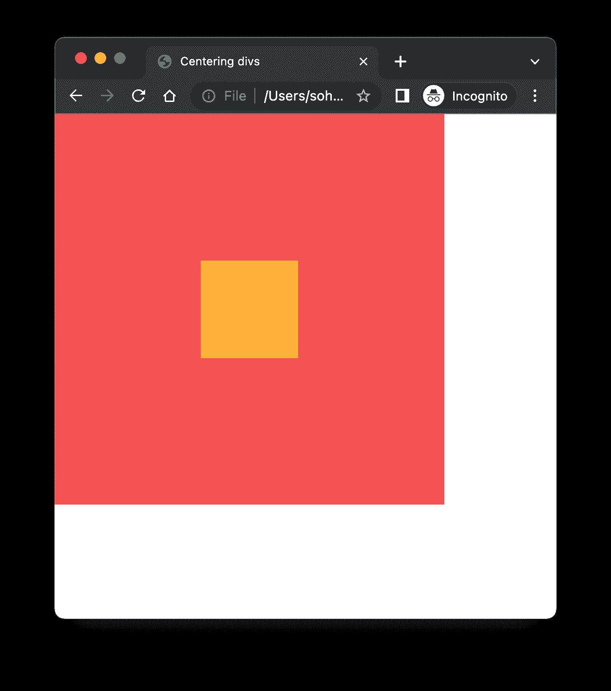

# 如何用 CSS 居中 Div——10 种不同的方法

> 原文：<https://www.freecodecamp.org/news/how-to-center-a-div-with-css-10-different-ways/>

作为一名 web 开发人员，有时**将 div** 居中感觉是地球上最艰难的工作之一。

嗯，不再是了。在这篇文章中，你将学习 10 种不同的方法来使一个`div`居中。我们将探索如何使用 CSS **位置**属性、CSS **Flexbox** 和 CSS **网格**来居中 div。

读完这篇文章后，我相信你会像专家一样开始集中注意力。

## 如何将一个`Div`居中

对于本教程，我将对我们将在下面讨论的所有 10 种方法使用相同的 HTML。HTML 中只包含一个父节点`div`和一个子节点`div`。

这篇文章的主要目的是使内部的`div`相对于它的父对象居中。我将只改变 CSS 文件，但是你将能够看到所有 10 种不同的方法生效。

主 HTML 文件是这样的:

```
<!DOCTYPE html>
<html lang="en">
  <head>
    <meta charset="UTF-8" />
    <meta http-equiv="X-UA-Compatible" content="IE=edge" />
    <meta name="viewport" content="width=device-width, initial-scale=1.0" />
    <title>Centering divs</title>
    <link rel="stylesheet" href="./basicStyle.css" />
    <!-- Change the link of CSS file here -->
    <link rel="stylesheet" href="" />
    <style>
      * {
        box-sizing: border-box;
        margin: 0px;
        padding: 0px;
      }
    </style>
  </head>
  <body>
    <div id="parentContainer">
      <div id="childContainer"></div>
    </div>
  </body>
</html> 
```

只有下面几行给出的基本样式:

```
#parentContainer {
  width: 400px;
  height: 400px;
  background-color: #f55353;
}
#childContainer {
  width: 100px;
  height: 100px;
  background-color: #feb139;
} 
```

我们会得到这样的结果:



What the basic HTML and CSS styling gives us.

我们只要做一个父`div`，给它一个`400px`的`width`和`height`，一个`#f55353`的`color`。

同样，我们在其中创建一个孩子`div`，给它一个`width`和`100px`的`height`，给它一个`#feb139`的`color`。

本文的最终目标是实现这种转变:



## 如何使用 CSS `position`属性将 Div 居中

### 1.如何使用位置:相对、绝对和左上偏移值

```
#parentContainer {
  position: relative;
}
#childContainer {
  position: absolute;
  top: 50%;
  left: 50%;
  transform: translate(-50%, -50%);
} 
```

CSS 中的**位置**属性设置元素在页面上的位置。位置属性的默认值为`static`。位置属性取的其他值有`relative`、`absolute`、`fixed`和`sticky`。

现在，当我们给一个 DOM 元素赋予一个`position: absolute`时，它的**就变成了相对于整个页面的绝对**。如果我们想让`div`相对于整个页面居中，这将会很有用。

另一方面，将父元素设置为`position: relative`，使得子元素(带有`position: absolute` ) **相对于父元素是绝对的，而不是整个页面**。

在上面的例子中，我们就是这样做的。我们给父元素一个`position: relative`，给子元素一个`position: absolute`。

除了位置属性，我们还可以指定其他四个属性，即。`top`、`right`、`bottom`和`left`，然后确定元素的最终位置。

`top`和`bottom`指定元素的**垂直定位**，其中`left`和`right`指定**水平定位**。

### 2.如何使用位置:相对和绝对、上、左、右和下偏移值和边距:自动

```
#parentContainer {
  position: relative;
}
#childContainer {
  position: absolute;
  top: 0;
  left: 0;
  bottom: 0;
  right: 0;
  margin: auto;
} 
```

继续学习上面第一点中的位置知识，我们在这里使用 CSS 中的`margin`属性。`margin: auto`让浏览器为子元素选择一个**合适的边距**。

在大多数情况下，它允许子元素取其指定的宽度，浏览器**在左右页边空白对或上下页边空白对或这两对之间平均分配剩余的空间**。

如果我们只提到`top: 0`、`bottom: 0`和`margin: auto`，它将子元素**垂直地**居中。

同样，如果我们只提到`left: 0`、`right: 0`和`margin: auto`，那么它会将子**水平居中**。

如果我们提到上面代码块中显示的所有属性，那么我们会得到一个水平和垂直居中的 div。

## 如何使用 CSS Flexbox 将 Div 居中

### 3.如何使用 Flexbox、对齐内容和对齐项目

以上两种方法更多的是基于页面中元素对齐的经典方法。现代方法利用了 **Flexbox** (用于单向布局建模)和**网格**布局(用于更复杂的二维布局建模)属性。

让我们看看 Flexbox 方法:

Flexbox 不仅仅是一个单独的属性，而是一个由一组属性组成的模块。这些属性中有些是针对**容器**(即父容器)的，有些是针对容器内的**子元素**的。

下图显示了与 Flexbox 相关的父元素和子元素的属性列表。


现在不可能涵盖本文中的所有属性。相反，让我们来看看本文中使用的一些属性。

如上所述，Flexbox 模型中有两个不同的实体，父容器和子元素。

属性将一个容器定义为一个 flex 容器。`flex-direction`是另一个父容器属性，可以接受四个值`row`(默认值)、`row-reverse`、`column`和`column-reverse`。

使用 Flexbox 时，我们需要考虑两个不同的轴，即**主轴**和**横轴**。

对于`flex-direction`为`row`或`row-reverse`的情况，**横轴为主轴，纵轴为横轴**。

同样，当`flex-direction`为`column`或`column-reverse`时，则**纵轴为主轴，横轴为横轴。**为清晰起见，请参考下图:





父容器的`justify-content`属性定义了其子容器沿主轴的对齐方式。因此`justify-content: center`将它的所有子元素设置在相对于主轴的中心对齐。

类似地，父容器的`align-items`属性定义了其子容器沿横轴的对齐方式。因此`align-items: center`设置所有子元素在横轴中心的对齐方式。

因此，下面的代码块将完美地将子元素垂直和水平对齐到父元素的中心。

在这种方法中，我们不需要为子元素明确指定任何内容。`display: flex`、`justify-content`和`align-items`处理来自父组件的一切。

```
#parentContainer {
  display: flex;
  justify-content: center;
  align-items: center;
} 
```

### 4.如何使用 Flexbox、对齐内容和自对齐

这种方法只是上述方法的一种替代方法，与上述方法非常相似。

但是我们没有使用`align-items`属性(在父容器属性中),该属性设置**所有子**元素相对于横轴的对齐，而是使用`align-self`(在子元素中),该属性设置**单个伸缩项**在横轴上的对齐。

```
#parentContainer {
  display: flex;
  justify-content: center;
}
#childContainer {
  align-self: center;
} 
```

### 5.如何使用 Flexbox 和边距:自动

Flexbox 给了我们非常强大的对齐和空间分配能力。同样如上所述，`margin: auto`让浏览器为子元素选择合适的边距。

在大多数情况下，它允许子元素采用其指定的宽度，并且浏览器在左右边距对或上下边距对之间或者在这两对之间平均分配剩余的空间。

这意味着将父容器设置为`flex`并给子容器一个`margin: auto`允许浏览器沿垂直和水平方向均匀分布剩余空间。

```
#parentContainer {
  display: flex;
}
#childContainer {
  margin: auto;
} 
```

## 如何使用 CSS 网格将 Div 居中

### 6.如何使用网格、对齐内容和对齐项目

CSS Grid 或 just Grid 用于**二维**布局建模，而 Flexbox 用于**一维**建模。

与 Flexbox 类似，我们有网格容器或父容器以及网格项目或子项目的概念。

下图列出了您可以用于父项和子项的所有属性。由于 CSS 网格本身就是一个巨大的主题，所以讨论每一个属性都不在本文的讨论范围之内。因此，让我们讨论一下我们在本文中使用的属性。



启动一个元素成为网格容器。

`justify-items`和`align-items`分别沿内嵌(行)轴和块(列)轴对齐网格内的项目。

另一方面，如果网格的总大小小于网格容器(如果所有的网格项目都使用非灵活的单位(如 px)来调整大小，就会发生这种情况)，那么在这种情况下，我们可以使用`justify-content`和`align-content`来控制网格在网格容器中的对齐。

`justify-content`和`align-content`分别沿内嵌(行)轴和块(列)轴对齐网格。

你可以在这里找到对所有这些属性的全面解释:[网格的完整指南](https://css-tricks.com/snippets/css/complete-guide-grid/)

对于我们的例子，只有一个**网格单元**，并且其中只有一个子元素，所以我们可以交替使用`justify-content`或`justify-items`以及`align-content`或`align-items`，得到相同的结果。

```
#parentContainer {
  display: grid;
  justify-content: center;
  align-items: center;
}
```

### 7.如何使用网格和放置项目

您可以使用`place-items`在同一个声明中设置`align-items`和`justify-items`属性。同样`place-content`设置`justify-content`和`align-content`是相同的声明。

如上所述，在这个用例中，我们可以互换使用`justify-content`或`justify-items`以及`align-content`或`align-items`。同样，我们也可以互换使用`place-items`和`place-content`，得到相同的结果(具体针对这个用例。对于任何其他用例，我们需要分析应该使用哪个属性)。

```
#parentContainer {
  display: grid;
  place-items: center;
} 
```

### 8.如何使用网格、自对齐和自调整

与 Flexbox 类似，Grid 也支持使用`align-self`和`justify-self`属性(在 children 元素中指定的属性)来对齐单个网格项。

`justify-self`沿内嵌(行)轴对齐网格单元内的网格项目，而`align-self`沿块(列)轴对齐网格单元内的网格项目。

```
#parentContainer {
  display: grid;
}
#childContainer {
  align-self: center;
  justify-self: center;
} 
```

### 9.如何使用网格和自定位

`place-self`属性在一个声明中同时设置了`justify-self`和`align-self`属性。因此，将子元素分配给`place-self: center`会使子元素垂直和水平居中。

```
#parentContainer {
  display: grid;
}
#childContainer {
  place-self: center;
} 
```

### 10.如何使用网格和边距:自动

与 Flexbox 类似，Grid 也给了我们强大的对齐和空间分配能力。

如第 5 点所示，我们可以用 Grid 代替 Flexbox 进行类似的处理，如果我们将`margin: auto`赋给子元素，我们会得到相同的结果。

```
#parentContainer {
  display: grid;
}
#childContainer {
  margin: auto;
} 
```

## 这是结果

正如所料，采用上述任何一种方法都会导致以下结果:



## 摘要

在本文中，我们看到了如何使用 10 种不同的方法使 div 居中。这些方法是:

1.  使用**位置:相对**、**绝对**和**顶部**、**左侧**偏移值
2.  使用**位置** : **相对**和**绝对**，**顶部**，**左侧**，**右侧**和**底部**偏移值和**余量:自动**
3.  使用 **flexbox** 、 **justify-content** 和 **align-item**
4.  使用 **flexbox** 、 **justify-content** 和 **align-self**
5.  使用**柔性盒**和**余量:自动**
6.  使用**网格**、**对齐-内容**和**对齐-项目**
7.  使用**网格**和**放置物品**
8.  使用**网格**、**自对齐**和**自对齐**
9.  使用**网格**和**自定位**
10.  使用**网格**和**余量:自动**

我们还查看了所有这些属性，如`justify-content`、`align-items`、`position`等的含义，以及我们如何一起使用它们来使我们的 div 居中。

## 一些好的资源

1.  [Flexbox 完整指南](https://css-tricks.com/snippets/css/a-guide-to-flexbox/)
2.  [网格完整指南](https://css-tricks.com/snippets/css/complete-guide-grid/)
3.  [通过构建响应性登录页面了解 Flexbox 和 Grid](https://www.freecodecamp.org/news/css-flexbox-and-grid-tutorial/)

## GitHub 链接

你可以在这里找到上述所有方法的所有文件的 GitHub 链接: [Github 链接](https://github.com/sohamderoy/blog-setup-centring-divs)

## 包裹

感谢阅读！我希望你喜欢这篇关于 10 种不同方法的文章，并且我希望它们将来对你有用。

请考虑与你的朋友分享这篇文章，我将不胜感激。更多精彩内容敬请期待。安静点。🖖

## 社会联系

*   [LinkedIn](https://www.linkedin.com/feed/)
*   [网站](https://www.sohamderoy.dev/)
*   [推特](https://twitter.com/_sohamderoy)