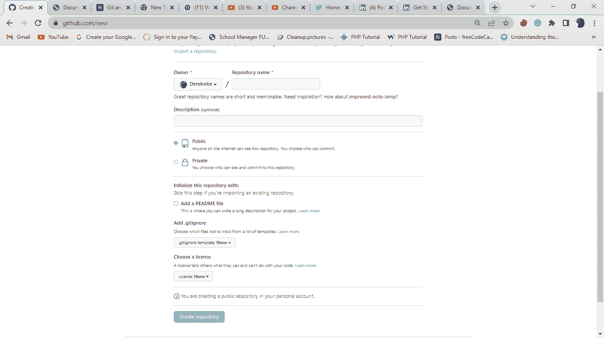
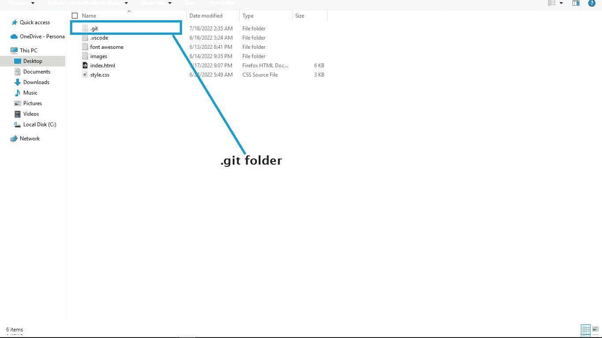
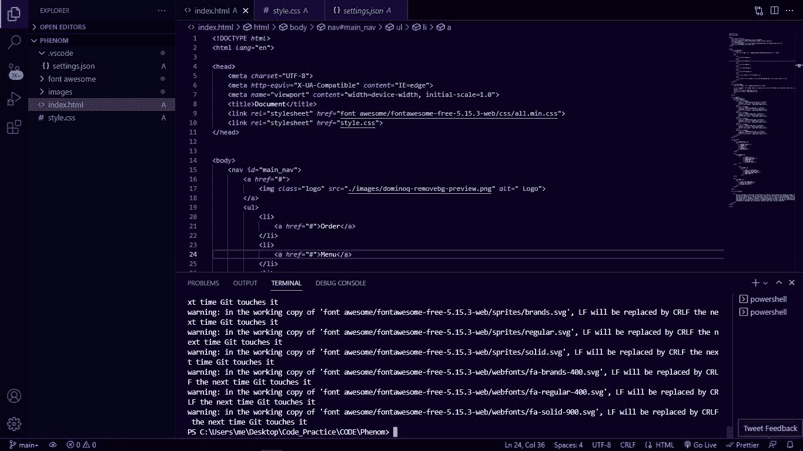
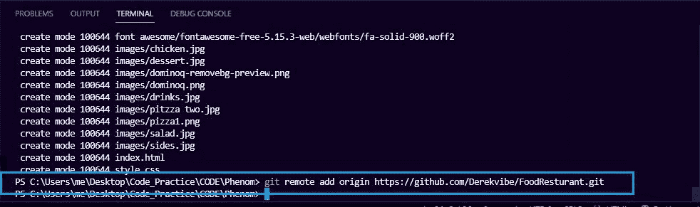
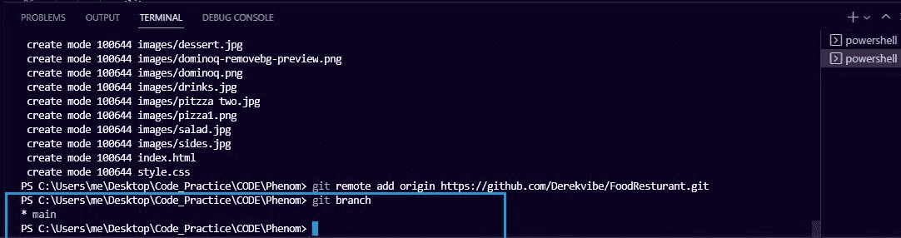
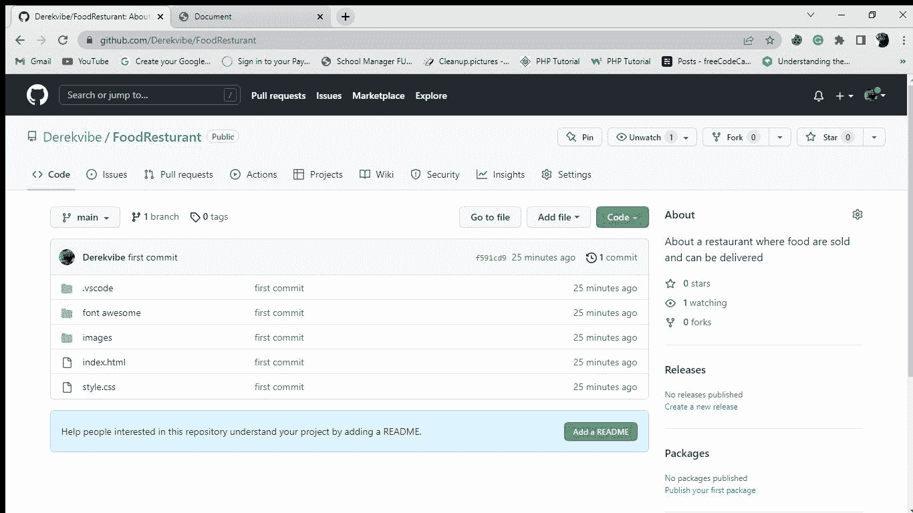
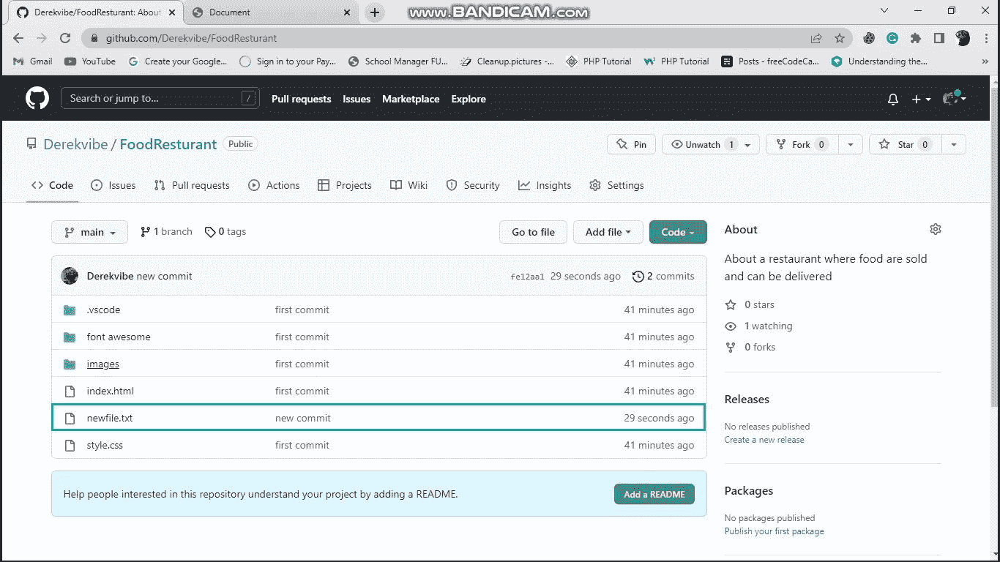
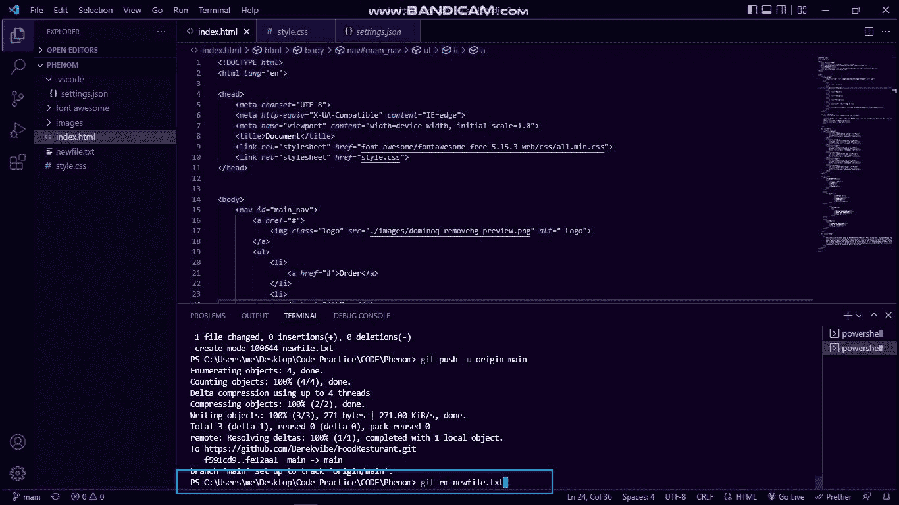
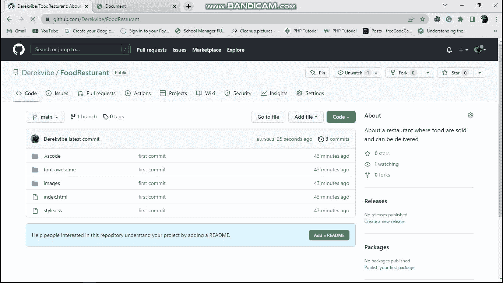

# 基本 Git 命令——如何在实际项目中使用 Git

> 原文：<https://www.freecodecamp.org/news/how-to-use-basic-git-and-github-commands/>

在我之前的教程中，我们讨论了什么是版本控制，Git 和 GitHub 是如何工作的，以及如何用 GitHub 设置一个帐户。

今天我们将看看如何在实际项目中使用一些基本的 Git 命令。

我创建了一个简单的项目，我们将在本教程中使用。

Project interface

通过阅读本教程，您将学会如何:

*   在 GitHub 中创建一个资源库
*   在项目中初始化 Git
*   添加并提交您的项目
*   将您的项目推送到 GitHub
*   从存储库中添加和删除文件

## 如何在 Github 中创建存储库

我使用 HTML 和 CSS 构建了上面的示例项目。为了将 Git 初始化到项目中，我必须在我的 GitHub 帐户中创建一个新的存储库。

我可以登录我的账户，然后点击屏幕右上角的`new`按钮。当它打开时，我将输入我的存储库名称和描述，然后选择我希望我的项目是公开访问还是私人访问。然后，我将单击“创建存储库”

## 如何初始化 Git

如果我们不首先用`git init`命令初始化/启动 Git，我们就不能在我们的项目中使用 Git。

所以在 GitHub 中创建了资源库之后，我会在我的 VS 代码编辑器中打开项目，进入我的终端，然后使用`git init`命令来初始化/启动。

当您在终端中运行此命令时，您会注意到项目中的颜色发生了一些变化。您还会看到一个`U`符号，表示您的文件未被跟踪。

此外，当您打开存储/定位项目的文件夹时，您会看到另一个名为`.git`的文件夹，它是在您运行`git init`命令时自动创建的。

git add

.git folder

## 如何添加和提交您的项目

### 如何使用`git add`命令

将项目添加到临时区域有助于 Git 跟踪您的项目，并看到您对它所做的更改。

要将您的项目添加到临时区域，运行`git add .`命令。当您运行这个命令时，您会看到`U`符号自动变成了`A`。这意味着您的文件已经被添加到 staging 区域，现在正在被 Git 跟踪，等待提交。

git add

### 如何使用`git commit`命令

通过运行`git commit`命令，您将保存这个特定的阶段，并将对项目的更改永久保存在 Git 存储库中。尽管您将来可能会对项目做一些更改并提交它们，但是您现在所做的这个特定的提交仍然会保存在 Git 存储库中，并且可以随时访问。

因此，在您的项目被添加到临时区域之后，接下来您要做的事情是使用`git commit –m “first commit”`命令提交它。

当您运行这个命令时，您应该注意到项目中的`A`符号已经不存在了，项目看起来又和您期望的一样了。

## 如何将你的项目推送到 GitHub

将您的项目推送到 Github 有助于防止您的项目在本地存储中损坏/丢失。它还允许您从任何地方，用任何计算机(不一定是您的个人计算机)自由访问 GitHub 库。

为了能够将您的项目推送到 GitHub 存储库，您必须添加最初在 GitHub 中创建的远程存储库。

为此，您将使用`git remote add origin (repository name)`命令。在我的例子中，我的库名是 [`https://github.com/Derekvibe/FoodResturant.git`](https://github.com/Derekvibe/FoodResturant.git) 。在终端中编写它应该是这样的:

`git remote add origin [https://github.com/Derekvibe/FoodResturant.git](https://github.com/Derekvibe/FoodResturant.git)`

如果你不确定你正在处理的当前分支，使用`git branch`命令。如果它显示分支为`master`，我们将通过运行`git branch –M main`命令将其更改为`main`分支。

(my git branch)

在我的例子中，当我通过运行`git config –global init.default branch main`命令在我的计算机上安装 Git 时，我已经将我的默认分支配置为`branch main`。所以我不需要再次运行`git branch –M main`命令。

最后，在添加了您想要上传项目的远程存储库并将分支更改为`main`之后，您会想要将您的项目推送到 GitHub。

为此，运行`git push –u origin main`命令并等待它完全加载。

完成后，转到您在 GitHub 中创建的 Git 存储库并刷新页面。您会看到本地存储库中的所有项目都已经上传到 GitHub 存储库中。

从这一点开始，在对项目进行更改之后，您只需通过运行`git add .`命令将更改添加到临时区域。然后您可以使用`git commit –m “(commit name)”`提交它，并通过使用`git push –u origin main`将其推送到 Git 存储库。

## 如何在存储库中添加和删除文件

现在，我将向您展示如何在 GitHub 存储库中添加和删除新文件。

### 如何向现有存储库中添加新文件

简单回顾一下:我在我的项目中添加了一个名为`newfile.txt`的新文件。我通过运行`git add newfile.txt`将它添加到暂存区，然后使用`git commit –m “new commit”`提交它，并将其推送到 GitHub，就像我们想要将整个项目上传到 GitHub 时所做的那样。

当我刷新我的 GitHub 页面时，我应该看到我创建的新文件正在显示。

### 如何从现有存储库中删除文件

如果我想从我的 GitHub 项目中删除我刚刚创建的文件，我可以通过在终端中运行`git rm newfile.txt`命令来完成。

当我在终端中运行这个命令时，我将使用`git add .`将更改添加到暂存区，然后提交并将更改推送到 GitHub 存储库。

当我刷新我的 GitHub 页面时，该文件将从我的 GitHub 存储库中删除。此外，当我转到我的本地存储时，该文件也应该从那里删除。

## 结论

在本教程中，您学习了如何使用基本的 Git 命令来管理您的项目。

[点击这里](https://github.com/Derekvibe/FoodResturant)访问我的 GitHub 资源库，这样你就可以自己尝试了。

希望这篇教程对你有帮助。

祝编码愉快！