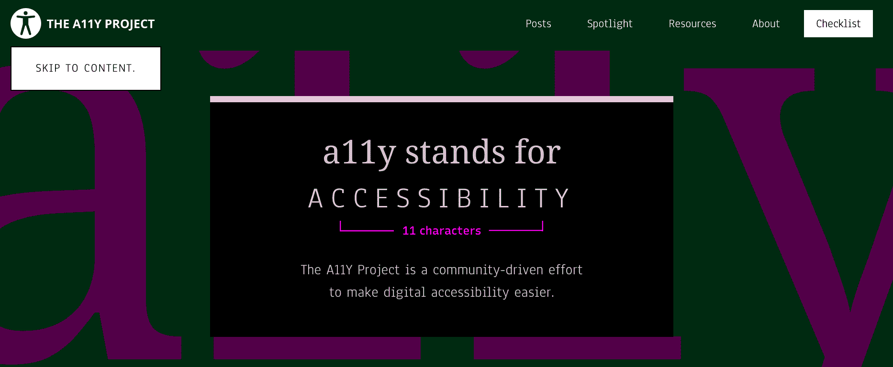

# 如何在你的网站上添加一个“跳到主要内容”的链接

> 原文：<https://www.freecodecamp.org/news/how-to-add-skip-to-main-content-links-to-a-website/>

网站和网络应用变得越来越复杂。但是，作为 web 开发人员，我们仍然有责任尽可能地争取最高级别的可访问性。

这并不总是容易的，因为用户可访问性需求的范围会使事情变得更加复杂。

令人欣慰的是，有各种各样的指导方针来设计和构建更易访问的网站和网络应用程序。本文将着眼于看似平凡、鲜为人知且经常被忽视的 web 可访问性特性:“跳转到主要内容”链接。

因为它们在默认情况下是不可见的，许多用户使用通常的点击方式浏览网站时，甚至不会注意到跳转到主要内容的链接。但是这些链接是至关重要的，因为对于只使用键盘和一些屏幕阅读器的用户来说，它们使复杂和大型网站的导航变得更加简单。

在下一节中，我们将详细介绍“跳转到主要内容”链接，以及为什么你应该考虑在你的网站或网络应用程序中实现它们。

## 什么是“跳到主要内容”链接？

大多数网站通常带有导航菜单，以使导航更容易。但是，尽管导航菜单使你的网站或 web 应用程序对于点击式用户来说是可导航的，但对于只使用键盘的用户和一些屏幕阅读器用户来说，导航菜单也会导致糟糕的用户体验。

对于一个典型的网站来说，在每个网页的顶部有一个多达十个菜单项的导航菜单是很常见的。因此，只使用键盘的用户在访问他们访问的页面的主要内容之前，不必要地浏览所有的导航链接。

一些屏幕阅读器用户可能经历类似的经历，在到达主要内容之前遍历所有菜单项。

这给你的用户带来了负面的体验。对于只使用键盘和一些屏幕阅读器的用户来说，添加跳转到内容的链接可以使浏览如此复杂的网站变得更加容易和不那么费力。

“跳转到内容”链接是一个普通的链接，通常在顶部主导航菜单之前，链接到网页上的主要内容。因为点击式用户不需要它，所以“跳转到主要内容链接”通常是隐藏的，当它处于焦点时是可见的。

它帮助只使用键盘和屏幕阅读器的用户跳到主要内容，而不是遍历所有的菜单项。这极大地改善了他们的浏览体验。

下图显示了 [a11y 项目](https://www.a11yproject.com/)的跳转到主内容链接。如上所述，跳转到主要内容的链接只有在被聚焦后才可见。

要测试它，导航到[a11yproject.com](https://www.a11yproject.com/)并点击 Tab 键。跳转到主要内容链接立即变得可见。之后，你可以按回车键跳过导航菜单。



Skip to main content link on a11y project website

在下一节中，我们将实现一个简单的跳转到主要内容的链接。

## 如何将跳转到主要内容的链接添加到您的网站

现在我们知道了什么是“跳到主要内容”链接，让我们看看如何实现它们以及使用它们时的一些最佳实践。

正如在引言中已经提到的，跳转到主要内容的链接是普通的链接。

但是，它们通常对普通的点击用户来说是不可见的。当键盘用户获得焦点时，您可以更改跳转到主要内容链接的可见性。

下面的代码显示了典型导航菜单的标记。除了顶级菜单项之外，真实世界的应用程序可能更复杂，具有嵌套菜单项。但是我在下面的例子中保持了简单。

```
 <body>
    <a href="#main" class="skip-to-main-content-link">Skip to main content</a>
    <nav>
      <ul>
        <li>
          <a href="/">Home</a>
        </li>
        <li>
          <a href="/about.html">About</a>
        </li>
        <li>
          <a href="/blog.html">Blog</a>
        </li>
        <li>
          <a href="/contact.html">Contact</a>
        </li>
        <li>
          <a href="/portfolio.html">Portfolio</a>
        </li>
      </ul>
    </nav>
    <main id="main">
      <h1>Your sweet heading</h1>

      <!-- Page content goes here! -->
    </main>
  </body> 
```

在上面的例子中,`<body>`标签的第一个元素是跳转到主要内容的链接。它的`href`属性通过它的`id`属性指向`main`元素。当 skip-to-main-content 链接处于焦点时，单击或按 Enter 键会将主要内容滚动到视窗视图中。

正如上一节所指出的，跳转到主要内容链接主要是为只使用键盘的用户和一些屏幕阅读器用户提供的。所以我们需要应用一些样式来隐藏它，当它失去焦点时显示它。

所以我们使用给定的类选择它，并应用下面的样式。您可以隐藏和显示不同样式的跳过链接。不一定要和下面的代码一样。

```
.skip-to-main-content-link {
  position: absolute;
  left: -9999px;
  z-index: 999;
  padding: 1em;
  background-color: black;
  color: white;
  opacity: 0;
}
.skip-to-main-content-link:focus {
  left: 50%;
  transform: translateX(-50%);
  opacity: 1;
} 
```

您也可以将过渡动画应用到跳转到主内容链接，尽管我没有在上面的例子中包括它。

## 添加跳转到主要内容链接时的良好做法

尽管跳转到主要内容的链接很容易实现，但是有一些潜在的问题很容易被你忽略。

当实现跳转到主要内容的链接时，遵循我认为的下面的好的实践。我是从 [WCAG 技巧](https://www.w3.org/TR/WCAG20-TECHS/G1.html)中学会的。

*   如果跳转到主内容链接是为了跳过网页顶部的主导航菜单，那么它应该是网页上第一个可聚焦的元素。
*   跳转链接的文本应该描述意图。文本“跳到主要内容”通常就足够了。
*   要求跳转到内容的链接要么总是可见，要么在获得焦点时可见。因为我们的跳转到内容链接只针对键盘用户和一些屏幕阅读器用户，你可以隐藏它，使它可见，就像我们在上面的例子中所做的那样。
*   激活跳转链接后，焦点应该转移到主要内容。

值得指出的是，使用跳转链接不仅限于导航菜单。您还可以实现链接来帮助用户跳过那些难以使用键盘导航的可聚焦元素。

## 结论

导航菜单是导航到网站不同部分或页面的便捷功能。尽管导航菜单旨在提供更好的用户体验，但对于一些只使用键盘或屏幕阅读器的用户来说，它可能会成为一个可访问性障碍。

这就是为什么在每个页面上添加跳转到主要内容的链接是个好主意。当用户需要遍历导航菜单项时，他们可以使用该链接绕过导航菜单。

跳转到主要内容链接是一个普通的链接，点击式用户是看不见的。它对屏幕阅读器用户是可见的，并且在焦点上时也是可见的。单击它会将焦点转移到网页上的主要内容。

希望这篇文章能让你了解跳转到主要内容的链接，以及如何在你的网站或 web 应用程序中实现它们。

可及性是一个旅程。你朝着正确的方向迈出的每一步都会让你的网站或网络应用程序更容易访问。实现跳转到主要内容的链接就是这样一个步骤。如果你还没有，那就迈出这一步，让网络变得更容易访问。通过这样做，您丰富了客户的数字体验。