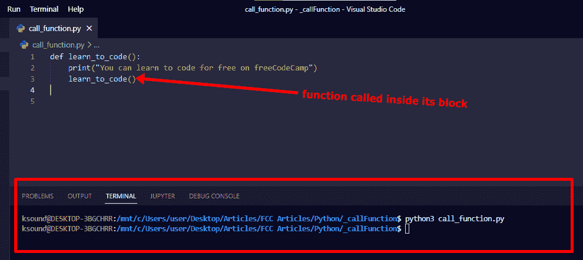
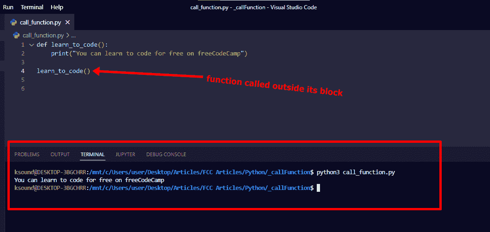
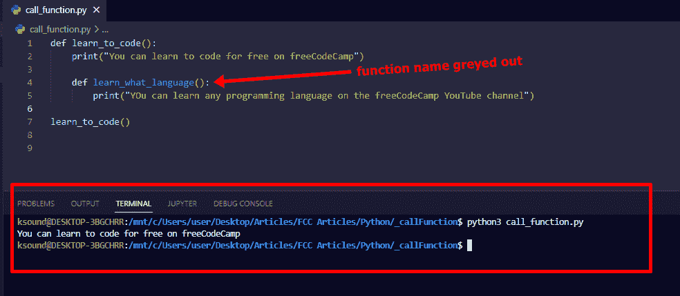
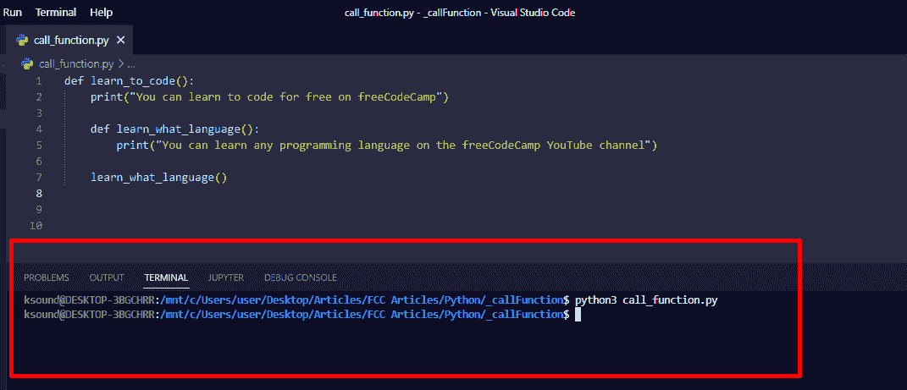
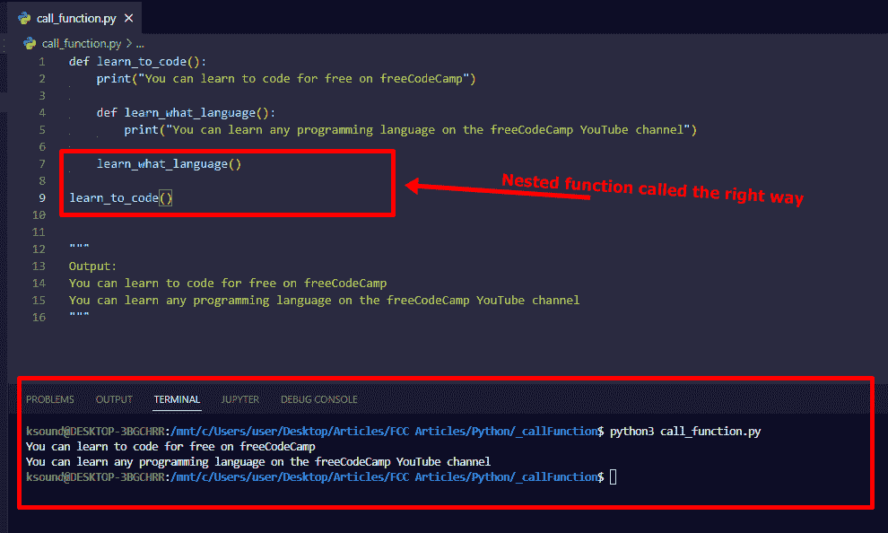

# 如何在 Python–Def 语法示例中调用函数

> 原文：<https://www.freecodecamp.org/news/how-to-call-a-function-in-python-def-syntax-example/>

在 Python 和其他编程语言中，您可以使用函数来避免重复，并重用代码片段。

为了让函数工作，你不能只是写下它们然后说再见——你还必须调用它们。

在调用一个函数之前，需要用 def 关键字编写它。所以在这篇文章中，我不仅会告诉你如何调用一个函数，我还会告诉你如何创建它。

## 我们将涵盖的内容

*   [如何用`def`关键字](#howtodefineafunctionwiththedefkeyword)定义函数
*   [如何在 Python 中调用函数](#howtocallafunctioninpython)
*   [如何在 Python 中调用嵌套函数](#howtocallanestedfunctioninpython)
*   [最终想法](#finalthoughts)

## 如何用关键字`def`定义一个函数

要在 Python 中定义函数，首先输入 def 关键字，然后输入函数名和括号。

为了告诉 Python 这个函数是一个代码块，需要在函数名前面指定一个冒号。接下来是您希望该函数做的事情。

函数的基本语法如下所示:

```
def function_name():
    # What you want the function to do 
```

函数的示例如下:

```
def learn_to_code():
    print("You can learn to code for free on freeCodeCamp") 
```

我们希望这个函数将文本`You can learn to code for free on freeCodeCamp`打印到终端。

要运行这个函数，你必须调用它。这就是我们接下来要做的。

## 如何在 Python 中调用函数

要调用一个函数，你要写出函数名，后跟一个冒号。

调用函数的语法如下所示:

```
function_name() 
```

为了调用我们之前定义的函数，我们需要编写`learn_to_code()`:

```
def learn_to_code():
    print("You can learn to code for free on freeCodeCamp")

learn_to_code()
# Output: You can learn to code for free on freeCodeCamp 
```

**N.B** :确保不要在功能块内部指定函数调用。它不会那样工作，因为调用将被视为函数运行的一部分。



您可以看到这个函数没有将文本打印到终端，因为我试图在函数块内部调用它。



这里你可以看到函数在运行，因为我在函数块外面调用了它。

## 如何在 Python 中调用嵌套函数

调用嵌套函数可能会令人困惑，所以我想向您展示如何做。

下面是嵌套函数:

```
def learn_to_code():
    print("You can learn to code for free on freeCodeCamp")

    def learn_what_language():
        print("You can learn any programming language on the freeCodeCamp YouTube channel") 
```

`learn_what_language`函数是`learn_to_code`函数的一部分，因为它嵌套在函数内部。

如果您键入`learn_to_code()`并运行代码，只有外部函数(learn_to_code)被调用:


你可以看到只有外层函数被调用，而内层函数是灰色的。

要调用内部函数，您应该准确地键入`learn_what_language()`。但是在哪里？

您应该在内部函数的 def 关键字下查看，并在那里键入函数调用。

但是如果你只这样做，它将不再工作，因为你也必须调用外部函数。


你可以看到内部函数(`learn_what_language`)仍然没有做我们想要它做的事情。

要使它工作，您必须在必要的地方调用这两个函数:

```
def learn_to_code():
    print("You can learn to code for free on freeCodeCamp")

    def learn_what_language():
        print("You can learn any programming language on the freeCodeCamp YouTube channel")

    learn_what_language()

learn_to_code()

"""
Output:
You can learn to code for free on freeCodeCamp
You can learn any programming language on the freeCodeCamp YouTube channel
""" 
```


可以看到一切都按预期工作。

## 最后的想法

我希望这篇文章能帮助你学习如何在 Python 中正确地调用函数。

如果你想更多的学习 Python，可以去看看 [freeCodeCamp Python 课程](https://www.freecodecamp.org/learn/scientific-computing-with-python/)。它是免费的。

继续编码:)