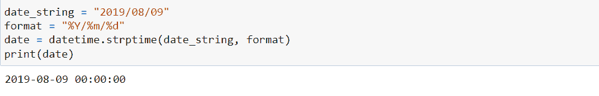
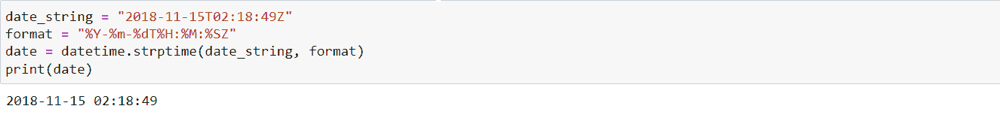

# 如何在 Python 中将字符串转换为日期时间对象

> 原文：<https://www.freecodecamp.org/news/how-to-convert-a-string-to-a-datetime-object-in-python/>

当您从原始数据中获取日期时，它们通常是字符串对象的形式。但是在这个表单中，您不能访问日期的属性，比如年、月等等。

这个问题的解决方案是将 string 对象解析(或转换)成 datetime 对象，以便 Python 可以将其识别为日期。然后你可以从中提取任何你想要的潜在属性。

本教程将教你如何在 Python 中将字符串转换成日期时间对象。事不宜迟，我们开始吧。

# 日期时间格式代码

在我们学习如何将字符串转换为日期之前，您应该理解 Python 中日期时间对象的格式代码。

每当您需要将字符串转换为日期时，这些先决条件都会很有用。我们将看看一些最常见的格式化代码，您可以在任何时候将字符串转换为日期。

以下是一些最常见的:

*   %Y —用于表示年份，范围从 0001 到 9999
*   %m —用于表示一年中的月份，范围从 01 到 12。
*   %d —用于表示一个月中的日期，范围从 01 到 31。
*   %H —用于以 24 小时制表示一天中的小时，范围从 00 到 23。
*   %I —用于以 12 小时制表示一天中的小时，范围从 01 到 12。
*   %M —用于表示一小时中的分钟数，范围从 00 到 59。
*   %S —用于表示一分钟内的秒数，范围也是从 00 到 59。

我们将在这里停止讨论日期格式代码，但是在 Python 文档中还有更多。可以点击[这里](https://docs.python.org/3/library/datetime.html#strftime-and-strptime-format-codes)查看更多。

# 如何将字符串转换为日期时间对象

请注意，每当将字符串转换为日期时，首先要考虑的是确保字符串的格式正确。

为了将字符串转换为日期，它必须满足以下条件。

*   首先，字符串中的每个元素必须用空格、字母或符号(如/ &、% # -等)与其他元素分隔开。
*   字符串中要解析为年、月或日的元素的长度必须与格式代码的长度相同。字符串中的元素不得超出格式代码的范围。例如,%Y 代码要求传递 4 个数字作为年份，其范围是 0001–9999(例如，09 是无效的，您需要 2009)。

让我们看一些字符串到日期转换的例子。首先，我们将字符串“2019/08/09”转换为日期。

我们需要在 Python 中导入 datetime 库来实现这一点。我们可以通过键入以下命令来实现:

```
from datetime import datetime

date_string = "2018/08/09"

format = %Y/%m/%d #specifify the format of the date_string.

date = datetime.strptime(date_string, format)
print(date) 
```

让我们再看一遍上面的代码，以确保我们理解发生了什么。

format 变量声明要传递给解析器的日期字符串的格式(这个函数将帮助我们转换日期)。我们必须提前知道格式，也就是在我们把它传递给解析器之前。

在这种情况下，字符串的格式为“2019/08/09”。

字符串中的第一个元素代表年份，其格式代码为`%Y`。然后在月份后面有一个正斜杠，格式代码是`%m`。然后我们有另一个正斜杠，最后是日期，其格式代码是`%d`。

因此，我们必须在格式变量中包含正斜杠符号，就像它在字符串中出现的方式一样。如果一切都做对了，格式应该是`"%Y/% m/%d."`

方法`datetime.strptime`是一个解析器，它将帮助我们转换作为日期传递给它的`date_string`。它需要两个参数:日期字符串和格式。

当我们在那之后打印它的时候，它将看起来像这样。



Image by Author

我们可以决定从中检索任何我们想要的属性。例如，如果我们只希望得到年份，我们可以通过键入`date.year`来实现，它将只打印出年份。

现在我们明白了这一点，让我们再看一个比上面更复杂的例子。

### 示例–如何将字符串转换为日期

我们将把这个字符串对象转换成日期:`"2018-11-15T02:18:49Z"`。

从外观上看，我们可以看到这个日期字符串有年、月、日、小时、分钟和秒。所以我们需要做的就是创建适当的格式和其中的符号。

```
from datetime import datetime

date_string = "2018-11-15T02:18:49Z"

format = "%Y-%m-%dT%H:%M:%SZ

date = datetime.strptime(date_string, format)
print(date)
```

我们可以看到，这没有什么太复杂的。只需遵循日期的每个部分的格式，并传递您在日期字符串中找到的任何相应的符号或字母。

不要被字符串中的符号或字母分散注意力。如果你正确地做了所有的事情并打印出来，你应该得到这样的结果:



确保不要混淆格式代码`%m`和`%M`。小的`%m`用于几个月，而大的`%M`用于几分钟。

# 结论和了解更多信息

现在我们已经到了本教程的结尾。您学习了如何将字符串转换为日期格式。

一旦你学会了格式代码，你就可以开始了。只要确保你遵守了控制哪种字符串可以被转换的原则。

例如，你必须记住字符串必须用空格、字母或符号来分隔。此外，字符串范围不得大于或小于格式代码的范围。

感谢您的阅读。