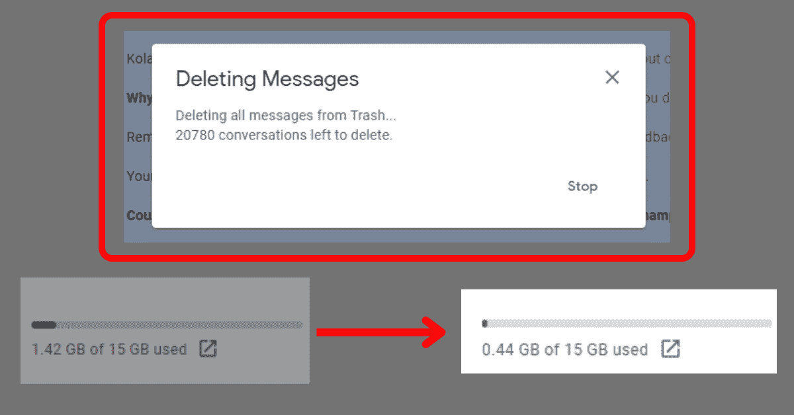
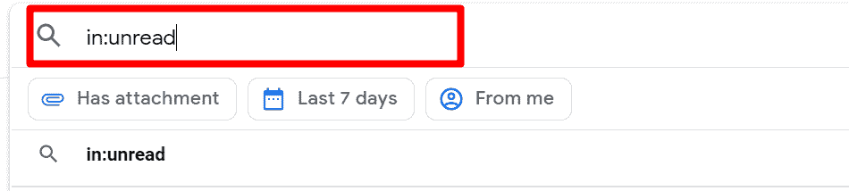
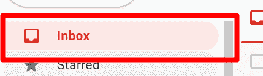
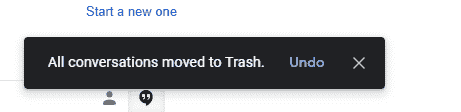

# 如何在 Gmail 中批量删除电子邮件–删除多封电子邮件

> 原文：<https://www.freecodecamp.org/news/how-to-batch-delete-emails-in-gmail-delete-multiple-email-messages/>

我听到我的一些同事谈论到零收件箱。所以我开始想办法清除我的 4000 多封未读邮件。经过几天的寻找，我找到了一个方法。

我甚至从垃圾桶里删除了 20，000 封电子邮件——在这个过程中节省了超过 1g 的磁盘空间。

今天，我想向你展示如何在 Gmail 应用程序中批量删除邮件——不管你有成千上万封邮件。

## 我们将涵盖的内容

*   [如何删除 Gmail 中所有未读邮件](#howtodeleteallunreademailsingmail)
*   [如何清理 Gmail 垃圾](#howtocleargmailtrash)
*   如何从促销列表中删除电子邮件？
*   [结论](#conclusion)

## 如何删除 Gmail 中所有未读邮件

**第一步**:登录您的 Gmail 账户

**第二步**:在搜索栏中，输入`in:unread`，点击`ENTER`。这将显示 50 封未读邮件。

**第三步**:选中右上角的复选框，选择 50 封未读邮件。

**步骤 4** :点击显示“选择所有符合此搜索条件的对话”的消息。这将选择您所有的未读邮件。

**第五步**:点击顶部的删除图标。

**第六步**:会弹出一个对话框，询问你是否要批量删除消息。单击“确定”。

这就是你在 Gmail 中批量删除邮件的方式。

## 如何清理 Gmail 垃圾

**步骤 1** :要清除回收站中的邮件，请点击左侧的“更多”并选择回收站。

**第二步**:点击右上角的复选框，选择回收站中的消息。

**第三步**:选中回收站中的所有邮件，点击“永久删除”。

**第四步**:点击确定，确认删除所有消息。

您应该会收到一条消息，x 封电子邮件已被永久删除。如果你没有得到消息，即使一切都很清楚，刷新页面。

您也可以在“促销”或“社交”标签中删除消息。

## 如何从促销列表中删除电子邮件？

要在“促销”选项卡中删除电子邮件，请执行以下步骤。

**第一步**:点击右侧更多，选择类别。

**第二步**:点击促销。

**第二步**:点击右上角的复选框，选择推广页签中的全部 50 条消息。

**第三步**:在推广页签点击选择所有对话。

**第四步**:点击顶部的删除图标。

**第五步**:确认删除促销页签中的所有消息。

您应该会收到一条消息，表明对话已被移至回收站。

如果您想要删除社交或论坛等其他选项卡中的消息，请重复您所经历的过程来删除推广选项卡中的所有消息。

## 结论

我希望这篇文章能帮助你删除 Gmail 应用程序中不想要的邮件，这样你也能到达零收件箱。

还有其他方法可以使用搜索操作符来查询 Gmail 应用程序，并显示多年来收到的邮件，以便您可以对它们做您想做的事情。你可以在谷歌支持中找到那些[搜索操作符](https://support.google.com/mail/answer/7190?hl=en)。

感谢阅读。