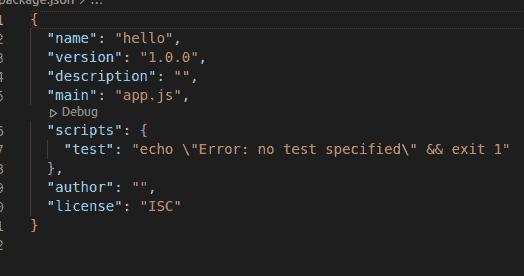
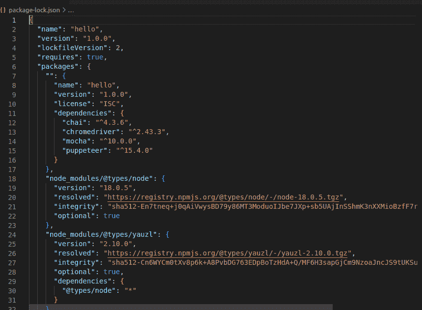
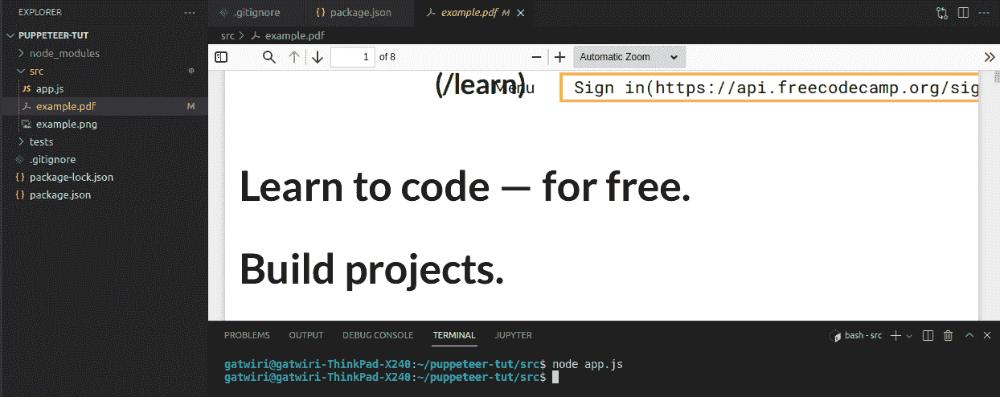
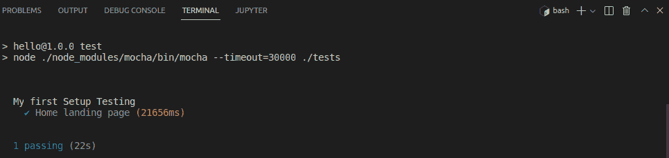

# 如何在 Node.js 中使用木偶师

> 原文：<https://www.freecodecamp.org/news/how-to-use-puppeteer-with-nodejs/>

Puppeteer 是一个 JavaScript 库，允许您编写脚本并与浏览器窗口交互。

在本指南中，我们将探索在 Node.js 中使用 Puppeteer 的基础知识，这样您就可以开始自动化测试了。

### 先决条件

*   对 Node.js 的基本了解
*   对木偶师的基本了解
*   合适的 IDE，如 VS 代码

### 你会学到什么

*   什么是木偶师？
*   Node.js 是什么？
*   如何设置你的第一次测试与木偶戏
*   如何在 CI 服务器上运行无头 Chrome 测试

## **什么是木偶师？**

Puppeteer 是 Google 开发的 Node.js 库，可以让你通过 DevTools 协议控制 headless Chrome。

它是一个使用无头 Chrome 或 Chromebit 设备自动测试应用程序的工具，不需要任何浏览器扩展，如 Selenium Webdriver 或 PhantomJS。

Puppeteer 允许您自动测试您的 web 应用程序。有了它，您可以在浏览器中运行测试，然后在终端上实时查看结果。

Puppeteer 使用 WebDriver 协议连接浏览器，并模拟用户与 HTML 元素或页面的交互。

## **node . js 是什么？**

Node.js 是一个基于 Chrome V8 引擎的开源 JavaScript 运行时，可以在 Linux、Mac OS X 和 Windows 操作系统上运行。它于 2009 年由最初的贡献者之一瑞安·达尔(在道格拉斯·克洛克福特的帮助下)首次发布。

这些年来，Node.js 作为许多软件开发项目的重要组成部分变得非常流行。当涉及到对服务器端应用程序或对等网络协议(如 Websockets)等特定任务进行编码时，它具有广泛的功能。

### 如何设置 Node.js 和木偶师

首先，通过右键单击您的首选位置并选择“新建文件夹”,创建一个您将要使用的目录。您也可以在终端中使用命令`mkdir dir-name`。

然后在您的文件夹中创建一个`app.js`文件，并添加`node.js`代码，如下所示:

```
const puppeteer = require('puppeteer');

(async () => {
	const browser = await puppeteer.launch();
	const page = await browser.newPage();
	await page.goto('https://www.freecodecamp.org/');

	await browser.close();
})(); 
```

app.js

上面的代码创建了一个让木偶师启动的浏览器实例。让我们确保理解上面的代码:

*   `browser.newPage()`创建新页面
*   `page.goto()`向`browser.newPage()`提供网址
*   `browser.close()`关闭运行过程

现在打开你的终端，进入`cd`文件夹。然后运行`npm init`来创建一个`package.json`文件。

按 enter 键，然后在询问“这样可以吗”时键入 yes。

您的输出将如下所示:



package.json

按照安装说明安装我们将在项目中使用的依赖项。

## **如何使用木偶师进行首次测试**

要在 Node.js 中使用 Puppeteer，您需要安装几个包并设置几个环境变量。这一部分将带您完成在测试中使用 Puppeteer 需要遵循的步骤:

*   下载并安装 [Node.js](https://nodejs.org/)
*   安装[木偶师](https://www.npmjs.com/package/puppeteer)
*   安装[摩卡](https://www.npmjs.com/package/mocha)
*   安装[柴](https://www.npmjs.com/package/chai)
*   安装 [Selenium Webdriver](https://www.npmjs.com/package/selenium-webdriver)

如果您想在实际的浏览器上运行测试，而不仅仅是针对 web 驱动程序脚本进行测试，那么您只需要完成最后一步。

如果是这种情况，那么通过键入`npm i selenium-webdriver --save`从 npm 包管理器安装 selenium-web 驱动程序模块。

安装依赖项将生成如下所示的`node_modules`和`package-lock.json`文件:



package-lock.json

截屏是在浏览器中捕捉信息的一种很好的方式。好吧，木偶师会保护你的！

要获取您导航到的网页的屏幕截图，请添加以下代码片段:

```
 await page.screenshot({path: 'example.png'}); 
```

要运行应用程序:

```
cd puppeter-tut
cd src 
```

然后在您的终端中键入以下命令:

```
node app.js
```

您也可以通过在代码中添加以下代码片段来创建 PDF:

```
 await page.pdf({ path: 'example.pdf' });
```

上面的代码片段将给出如下所示的输出:



## 如何测试您的设置

为了测试您的设置，在您的代码中创建一个`test`文件夹，然后添加`example.test.js`。

您的文件应该包含以下代码:

```
const puppeteer = require('puppeteer')

describe("My first Setup Testing",()=>{
     it("Home landing page",async()=>{
    const browser = await puppeteer.launch({headless:false})
     });
});
```

example.test.js

使用`npm run test`运行您的测试。运行测试后，您将获得以下输出:



这里有一个 [GitHub 到教程源代码](https://github.com/gatwirival/puppeteer-tut.git)的链接。

## 如何将一个浏览器实例用于木偶师

作为一名 web 开发人员，您可以使用 Puppeteer 在 headless Chrome 浏览器中运行脚本并访问窗口对象。这在测试需要访问本地存储或 cookies 等 web 资源的应用程序时非常有用。

要在 Puppeteer 中使用一个浏览器实例，只需将`{ headless: false }`传递给 launch 方法。它是异步的，所以它不会阻塞主线程，使你的应用程序没有反应。

这种方法最好的一点是，一旦启动，它应该只使用一次。否则，当您再次尝试从 Puppeteer 访问任何网页时，将会出现错误。

**这里有一个例子:**

```
let browser; (async() => { if(!browser) browser = await puppeteer.launch({headless: false}); 
```

## **结论**

所以，你有它！现在你知道如何开始使用 Puppeteer 和 Node.js 了。

我希望本指南能够帮助您更加熟悉该工具及其功能。如果您有任何问题或建议，请随时与我联系。

‌‌