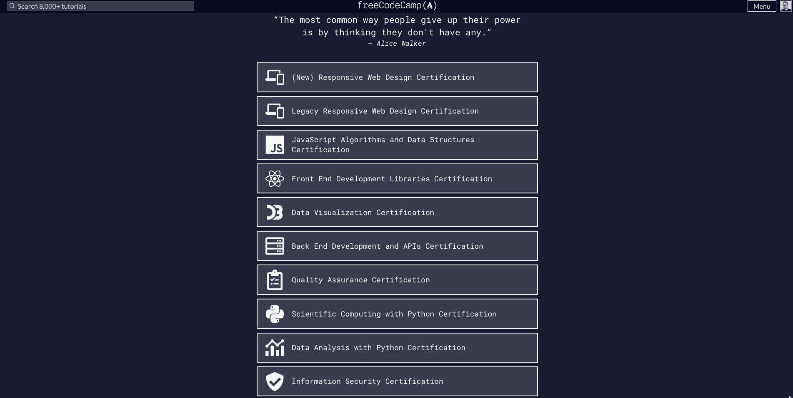
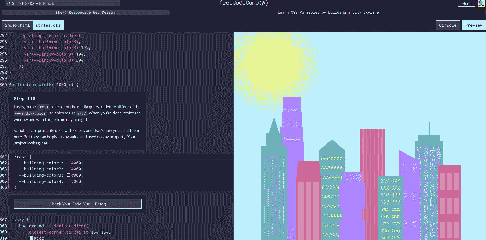
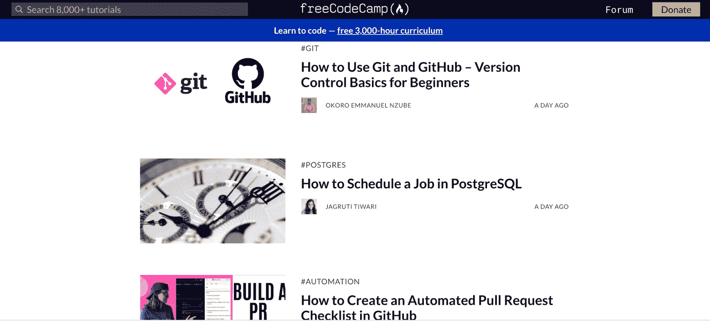
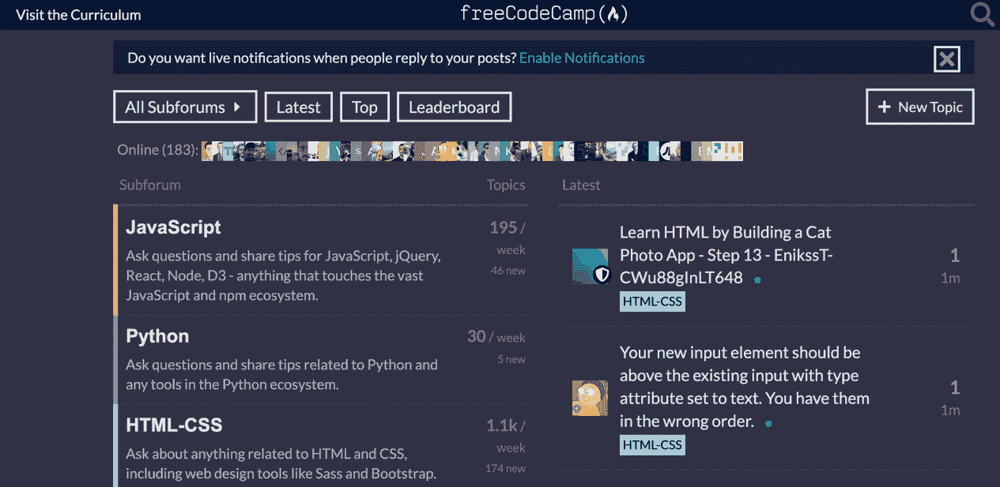
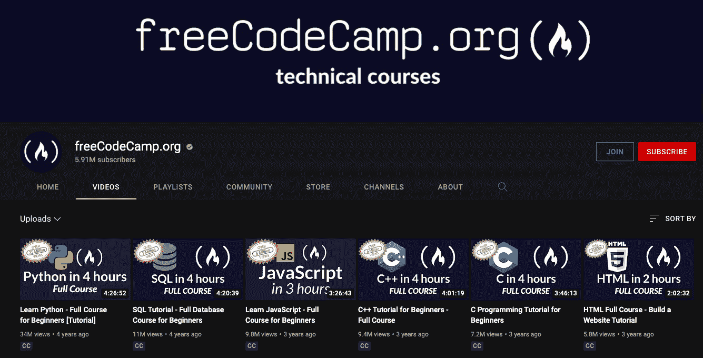
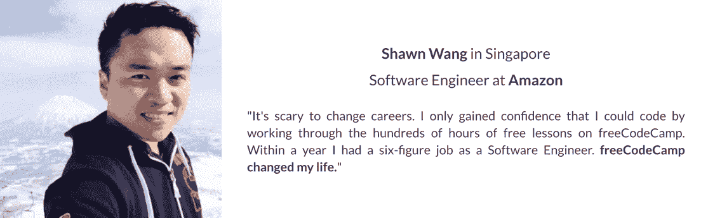
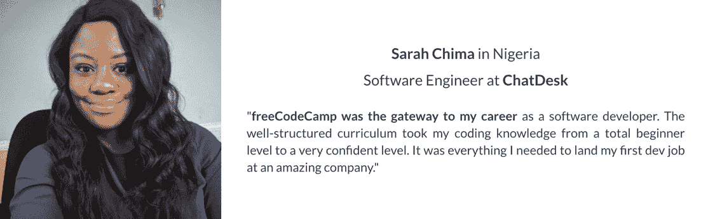
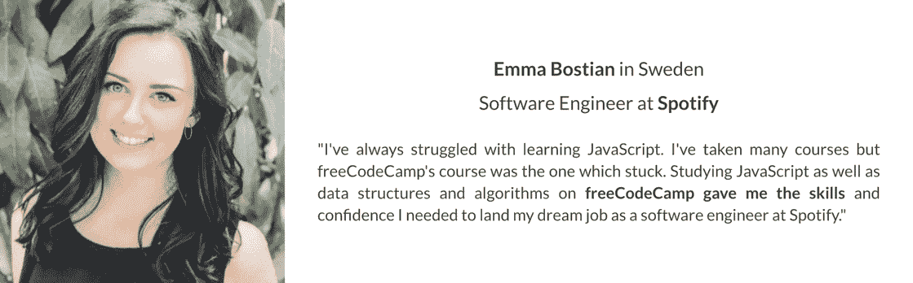
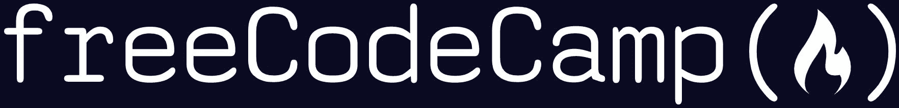
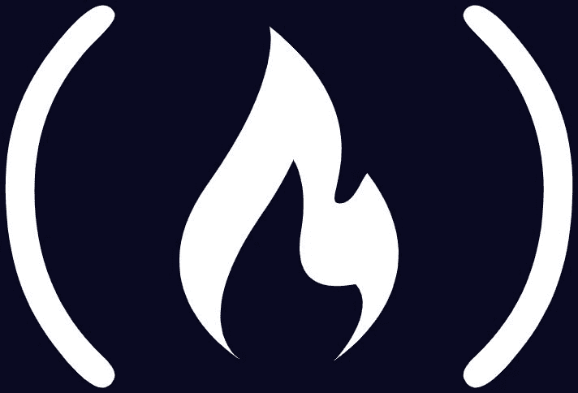

# freeCodeCamp.org 新闻资料袋

> 原文：<https://www.freecodecamp.org/news/freecodecamp-press-kit/>

这是 freeCodeCamp.org 的新闻资料袋。

### 联系信息:

freeCodeCamp 的收入 100%用于项目。

对于采访请求、演讲约定或社交媒体问题，请联系我们在 quincy@freecodecamp.org 的创始人昆西·拉森。

## 关于 freeCodeCamp.org

昆西·拉森在 2014 年创立了 freeCodeCamp.org，利用免费的在线学习资源帮助人们过渡到科技职业。

freeCodeCamp 的使命是帮助人们免费学习编码。

此后不久，freeCodeCamp 推出了我们的社区 YouTube 频道和我们的社区出版物。

2020 年，该社区开始将课程、教程和视频课程本地化为各种世界语言，以使每个人都更容易获得免费编程教育。

freeCodeCamp 的员工和志愿者分布在世界各地，他们努力为有抱负的开发者创造免费的学习资源。

## freeCodeCamp.org 概况介绍

1.  freeCodeCamp 是一个 501(c)(3)公共慈善机构。世界各地的人们都可以使用 freeCodeCamp 的[开源课程](https://www.freecodecamp.org/learn/)，免费的[教程](https://www.freecodecamp.org/news)，以及 [YouTube 课程](https://www.youtube.com/c/Freecodecamp/featured)免费在线学习编码。
2.  每天有超过 100 万人使用 freeCodeCamp 学习如何编码。
3.  freeCodeCamp 在 LinkedIn 上有一个校友协会，拥有超过 20 万名校友，其中许多人在亚马逊、微软、IBM 和谷歌等大型科技公司工作。[https://www.linkedin.com/school/free-code-camp/people/](https://www.linkedin.com/school/free-code-camp/people/)
4.  freeCodeCamp 的核心课程为学习者准备了大多数雇主在 2022 年寻求的关键编程技能:Python、JavaScript、SQL、Git、Linux、HTML 和 CSS。
5.  我们的慈善机构运营着 YouTube 上最大的节目频道，拥有 586 万订户。我们在那里免费提供了 700 多门完整的编程课程，并且我们每周都会发布新的课程。[https://www.youtube.com/c/freecodecamp](https://www.youtube.com/c/freecodecamp)
6.  我们的英文出版物上也有超过 8000 个可搜索的编程教程:[https://www.freecodecamp.org/news](https://www.freecodecamp.org/news)
7.  freeCodeCamp 是 GitHub 上最受欢迎的开源库。它有更多来自开发者的明星，而不是来自谷歌、微软甚至 Linux 的项目。它目前拥有 349，000 颗恒星。[https://github.com/freecodecamp/freecodecamp](https://github.com/freecodecamp/freecodecamp)

## 重要信息

*   [年报](https://www.freecodecamp.org/news/freecodecamp-2021-review-budget-usage-statistics/)
*   [财务](https://projects.propublica.org/nonprofits/organizations/820779546)
*   [常见问题解答](https://www.freecodecamp.org/news/about/)

## 昆西·拉森的传记

昆西·拉森是俄克拉荷马州的一名教师兼学校主任。31 岁时，他开始通过免费在线课程和参加黑客马拉松来学习编程。

在做了一名软件工程师后，他创办了 freeCodeCamp.org 公司，帮助其他忙碌的成年人学习编程并过渡到科技行业。

现在每天有 100 多万人使用 freeCodeCamp 课程，有 10，000 人使用它成功地过渡到软件开发职业。

## freeCodeCamp 有什么新内容？

*   freeCodeCamp 社区正在将课程和数以千计的教程本地化为多种世界语言。
*   freeCodeCamp 社区最近也彻底修改了我们的响应式网页设计认证
*   freeCodeCamp 社区正在扩展 [DevDocs.io](http://DevDocs.io) 文档搜索引擎:【https://github.com/freeCodeCamp/devdocs】T2。
*   freeCodeCamp 社区正在发布 Chapter，这是一个针对多章节组织的开源 meetup.com 替代方案:[https://github.com/freeCodeCamp/chapter](https://github.com/freeCodeCamp/chapter)

## 截屏

### 免费代码营课程

### 新的响应式网页设计认证

### freeCodeCamp 社区出版物

freeCodeCamp.org/News Homepage

### 自由代码营社区论坛

forum.freecodecamp.org Homepage

### 免费代码营社区 YouTube 频道

## 新闻中的免费代码营

freeCodeCamp 受益于《连线杂志》、《商业内幕》、甚至《麻省理工新闻》的主流媒体报道:

*   [连线杂志文章](https://www.wired.com/2015/06/can-real-world-work-free-coding-boot-camp/)
*   [商业内幕文章](https://www.businessinsider.com/learning-how-to-code-imposter-syndrome-2014-11)
*   [麻省理工学院新闻文章](https://news.mit.edu/2021/refugee-learners-lift-their-communities-1012)

## 播客采访 freeCodeCamp 的创始人昆西·拉森

*   GitHub 播客:[https://www . listen notes . com/Podcast/the-readme-Podcast/freecode camp-for-curious-as 5 e 92 yzhi 8/](https://www.listennotes.com/podcasts/the-readme-podcast/freecodecamp-for-curious-aS5e92YZHi8/)
*   本周在创业公司:[https://www . listen notes . com/podcasts/this-Week-in/e 1049-freecodecamp-founder-gpjs 3c jqgwv/](https://www.listennotes.com/podcasts/this-week-in/e1049-freecodecamp-founder-gPJs3CjqGWv/)
*   Changelog 播客:[https://www . listen notes . com/Podcast/the-Changelog-software-development-open-7o 41 svyo 8 z _/](https://www.listennotes.com/podcasts/the-changelog-software-development-open-7o41SvyO8z_/)

## 证明书

Testimonial from software developer and freeCodeCamp alumnus Shawn Wang

Testimonial from software developer and freeCodeCamp alumna Sarah Chima

Testimonial from software engineer and freeCodeCamp alumna Emma Bostian

## freeCodeCamp 徽标

freeCodeCamp 的 logo 出现了两种变体。

这是完整的徽标:

freeCodeCamp logo

这是篝火符号:

如果你需要更多信息，这里有一个链接指向 [freeCodeCamp 的设计风格指南](https://design-style-guide.freecodecamp.org/)。

## 在社交媒体上查找免费代码营:

*   [英文推特](https://twitter.com/freeCodeCamp)
*   [Instagram](https://www.instagram.com/freecodecamp/)
*   [LinkedIn](https://www.linkedin.com/school/free-code-camp/)
*   [YouTube 社区](https://www.youtube.com/c/Freecodecamp/community)

## 样板文件

昆西·拉森在 2014 年创立了 freeCodeCamp.org，利用免费的在线学习资源帮助人们过渡到科技职业。

freeCodeCamp 的使命是帮助人们免费学习编码。

此后不久，freeCodeCamp 推出了我们的社区 YouTube 频道和我们的社区出版物。

2020 年，该社区开始将课程、教程和视频课程本地化为各种世界语言，以使每个人都更容易获得免费编程教育。

freeCodeCamp 的员工和志愿者分布在世界各地，他们努力为有抱负的开发者创造免费的学习资源。