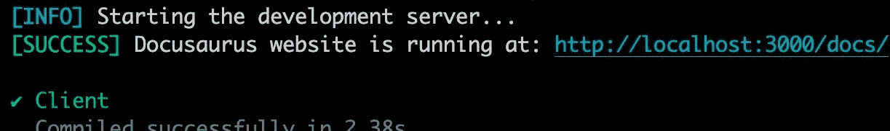
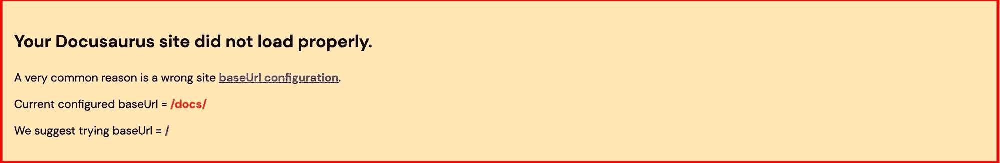

# 如何使用 Netlify 将多个存储库部署到一个网站下的子文件夹中

> 原文：<https://www.freecodecamp.org/news/how-to-deploy-multiple-repos-to-subfolders-under-one-website-netlify/>

你好。👋您在这里可能是因为您正试图使用 Netlify 在一个网站下托管两个独立的网站或存储库。

也许你已经在 Netlify 社区页面上找到了答案，但是你仍然很困惑。

同样的困惑和头疼让我写了这篇教程，这样你就不用像我一样纠结了。

这很棘手但很有效:这个问题的解决方案是`netlify.toml`或`_redirects file`。

让我们跳进来。

我和一些同事一起做一个项目，我们把任务分开，这样我就可以做文档了。

## 我们将在这里使用的技术

*   Docusaurus 可以立刻发布漂亮的文档网站。
*   Next.js/React.js 为我们的主要网站

让我们开始吧，看看我们如何保存文档。我们可以通过两种方式做到这一点:

1.  使用子域 docs.mainsite.dev
2.  使用主域名 mainsite.dev，将文档作为子目录存放在 mainsite.dev/docs.上

根据我在其他项目的文档中看到的实现，我也想通过 Netlify 把它作为一个子文件夹。

我想这会让我们的医生看起来更专业。

如果你也将 docusaurus 作为子文件夹，你需要做一些设置。

## 步骤 1-更新基本 URL

使用以下代码将 docusaurus.config.js 文件中的 **baseUrl** 更改为“**/docs/”**:

```
 title: 'Your Docs Title',
  tagline: 'Your Docs Tagline',
  url: 'my-docs-site.netlify.app',
  baseUrl: "/docs/",
  onBrokenLinks: 'throw',
  onBrokenMarkdownLinks: 'warn',
  favicon: '/favicon.ico',
```

docusaurus.config.js

通过将您的基本 URL 更改为 **/docs/** ，它会使您的网站完全呈现为【https://mainsite.dev/docs/】的**，这是 docs 路径。**

**如果您将 **baseUrl** 设置为“/”，将会出现错误。这也意味着我们不必处理代理我们的文档网站。**

## **步骤 2–更新 routeBasePath**

**您还需要通过将 **routeBasePath** 更改为 **'/'** ，确保文档内容是从您的根域提供的。**

**就像您在下面的片段中看到的那样:**

```
 `presets: [
    [
      'classic',
      /** @type {import('@docusaurus/preset-classic').Options} */
      ({
        docs: {
          routeBasePath: '/',
        },
      }),
    ],
  ],`
```

**docusaurus.config.js**

**这将帮助您激活 docusaurus 上的仅文档模式。这样，您的文档将从您的根域提供，但路径“/docs/”是基本路径。**

**之后，您可以在您的本地主机上运行`npx docusaurus start`,看看您的 docs 站点能否顺利构建和呈现。**

**如果没有问题，您应该会看到类似这样的内容:**

**

Your docusaurus site should render like this on path '/docs/' being the base path.** 

**要了解更多关于 docusaurus docs only 模式的配置，您可以阅读 [this](https://docusaurus.io/docs/docs-introduction#docs-only-mode) 。**

## **步骤 3–部署到网络生活**

**现在是时候将您的 docs 站点部署到 Netlify 了。如果你还不知道怎么做，你可以参考这个[指南](https://docusaurus.io/docs/deployment#deploying-to-netlify)。**

**完成部署后，您的 Netlify 网站 URL 应该已经可用，如下所示:// my-docs-site.netlify.app。**

## **第 4 步–代理**

**接下来就是你要做代理的部分了。**

**您已经在 Netlify 上托管了您的主网站，并且您的文档站点也已部署到 Netlify。**

**现在，您需要在主网站的项目/资源库的根目录下创建一个 *netlify.toml* 文件，并在其中添加以下几行:**

```
`[[redirects]]
from = "/docs/*"
to = "https://my-docs-site.netlify.app/:splat"
status = 200
force = false`
```

**以上规则确保了无论何时在您的主站点上查询/docs/ path，您的 docs 站点都会在您的 main-website.netlify.app/docs/路径上正常加载。**

**或者，您也可以通过您的文档网站/存储库进行代理。只需在 docs 站点/存储库的根目录下创建一个 netlify.toml 文件，并在其中添加以下几行:**

```
`[[redirects]]
from = "/*"
to = "https://main-website.netlify.app/docs/:splat"
status = 301
force = true`
```

**上面的规则确保了无论何时在 docs 站点上查询/*路径，它都会在您的 main-website.netlify.app/docs/路径上正常加载。**

**您还会注意到，您在 Netlify 站点上的 docs 站点已损坏，但它在您的主站点上运行良好。**

**既然它有效，我们也达到了目标，那就顺其自然吧😁。**

**

Broken docusaurus site for subfolder documentation** 

****注意:**不要同时将规则添加到您的文档站点和主站点，因为这将导致“太多重定向”错误的冲突。**

**所以你要么把规则添加到你的文档站点，要么添加到你的主站点，但不能两者都添加。**

## **让我们回答一些问题**

**问:为什么我会选择使用 *netlify.toml* 文件，而不是*重定向*文件？**

**是的，我首先选择了简单的选项，并尝试了 _redirects 文件。但这并不容易，因为在构建你的 Netlify 站点时，你必须总是将 *_redirects* 文件复制到你的 **build/** 或 **public/** 文件夹中。**

**这要求您将您的 Netlify 构建设置编辑成如下所示:**

```
`npm run build && cp _redirects public/`
```

**netlify _redirects file **

**您也可以使用 *_redirects* 文件来实现代理。主站点的规则将采用以下格式:**

```
`/docs/* https://my-docs-site.netlify.app/:splat 200`
```

**netlify _redirects file **

**对于您的文档网站，请使用以下格式:**

```
`/* https://main-website.netlify.app/docs/:splat 301!`
```

**netlify _redirects file **

****问:**为什么我会选择在所有代理规则中使用 Netlify URLs，而不是我们的自定义域 URL？**

**Netlify 社区建议您使用 Netlify URLs，因为这是一种更可靠的代理方式。**

## **结论**

**恭喜🎉，很高兴您阅读完了本指南。**

**我相信你今天学到了一些新东西。**

**是时候实现了，让你的项目文档看起来也很专业，把它放在你的主站点的子文件夹中。👏。**

**你也可以分享这篇文章，让别人看到。**

## **资源:**

*   **[网络游戏规则游乐场](https://play.netlify.com/redirects)**
*   **[[支持指南]我可以在一个站点中部署多个存储库吗？](https://answers.netlify.com/t/support-guide-can-i-deploy-multiple-repositories-in-a-single-site/179)**