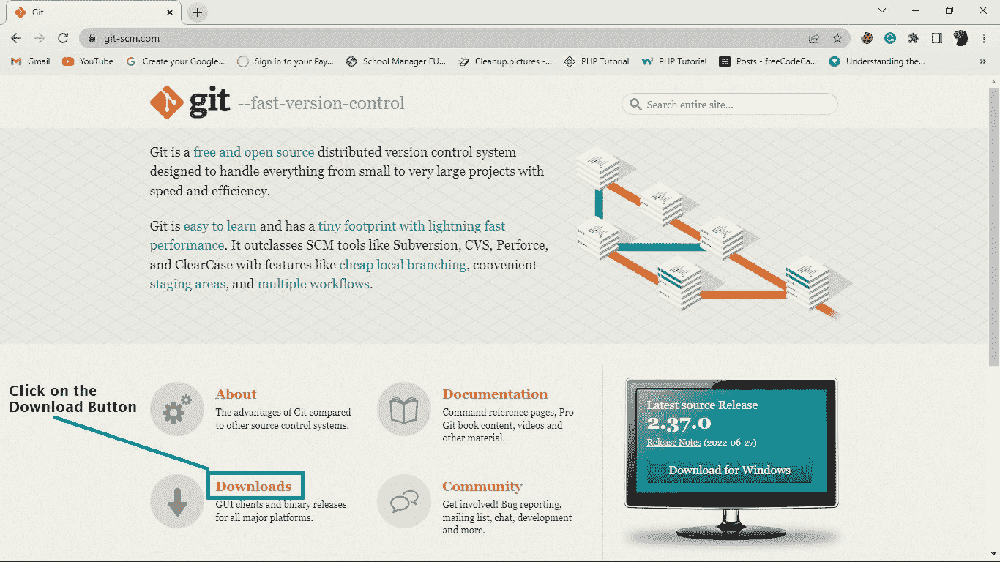
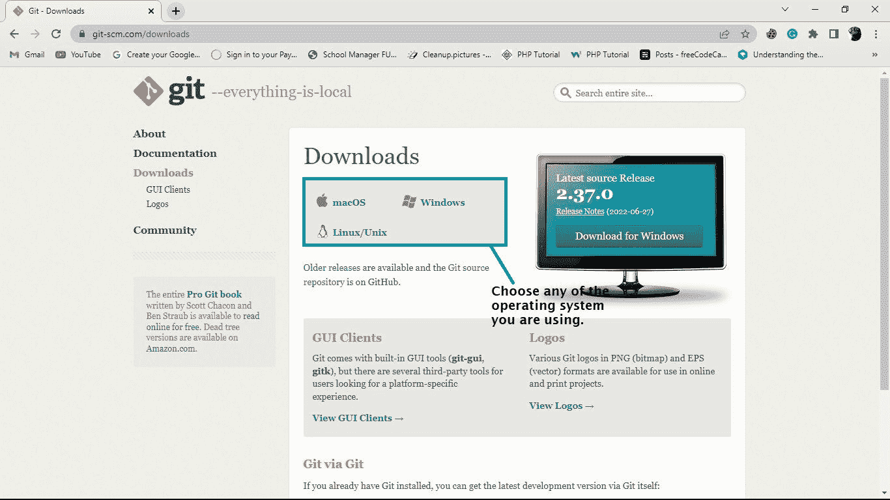
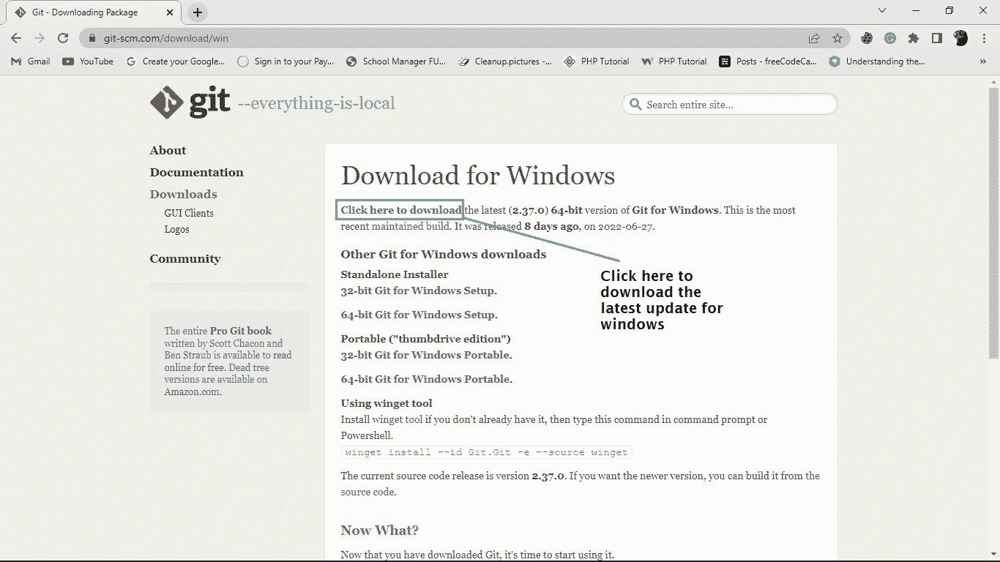
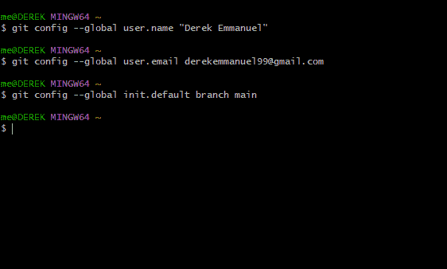
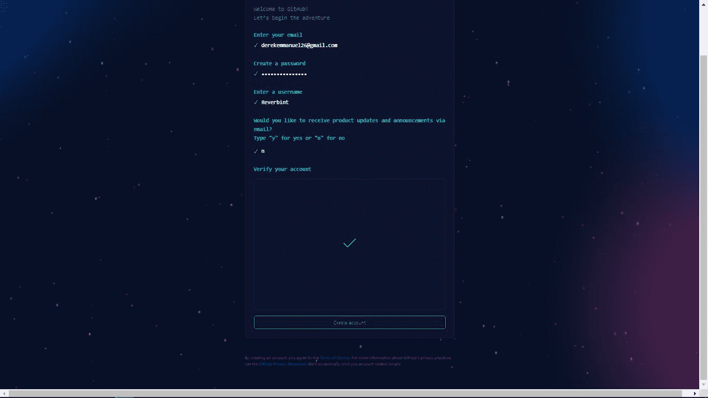

# 如何使用 Git 和 GitHub——初学者的版本控制基础

> 原文：<https://www.freecodecamp.org/news/git-and-github-the-basics/>

版本控制系统是一种工具，用于跟踪、制作和管理软件代码的变更。它也被称为源代码控制。

版本控制系统帮助开发人员存储他们在不同阶段对文件所做的每个更改，以便他们和他们的队友可以在以后检索这些更改。

有三种类型的版本控制系统，它们是:

*   本地版本控制系统
*   集中式版本控制系统
*   分布式版本控制系统。

## 什么是本地版本控制系统(LVCS)？

这是一种非常常见且易于使用的版本控制系统。但是这种方法很容易出错和受到攻击，因为文件存储在您的本地系统中。

这意味着您可能会丢失系统文件或意外忘记您正在工作的文件的目录/文件夹(然后写入另一个目录)。

## 什么是集中式版本控制系统(CVCS)？

在这种版本控制中，服务器充当存储每个版本代码的仓库。CVCS 帮助不同的开发者一起协作。

尽管开发人员之间进行了有益的合作和交流，但如果服务器停机几秒钟或遭到破坏，您就有可能丢失您的工作。不幸的是，这是 CVCS 的一个大问题。

在 CVCS，只有几个开发人员可以在一个项目上合作。

## 什么是分布式版本控制系统(DVCS)？

这是目前最新和最常用的版本控制系统。

在 DVCS 中，所有开发人员都有服务器中所有数据的完整备份(克隆)。这意味着无论何时服务器停机或出现故障，您仍然可以继续您的项目，并且您可以将您的存储库复制或备份到服务器来恢复它们。

当您使用 DVCS 时，许多开发人员可以在一个项目上一起工作。一个流行的 DVCS 是 Git，我们现在将更多地讨论它。

## Git 是什么？

Git 是一个免费的开源分布式版本控制系统，您可以使用它来跟踪文件中的变化。您可以在 Git 中从事各种类型的项目，从小到大。

使用 Git，您可以将更改添加到代码中，然后在准备好的时候提交(或保存)它们。这意味着您还可以回到之前所做的更改。

Git 与 GitHub 携手合作——那么 GitHub 是什么？

## 什么是 GitHub？

GitHub 是一个 web 界面，您可以在其中存储您的 Git 存储库，并有效地跟踪和管理您的更改。它为从事同一项目的不同开发人员提供了对代码的访问。您可以在其他开发人员进行更改的同时对项目进行自己的更改。

如果您在进行更改时不小心弄乱了项目中的一些代码，您可以很容易地回到混乱尚未发生的前一阶段。

## 为什么使用 GitHub

有太多的理由让你应该学习和使用 GitHub。现在让我们来看看其中的几个。

### 有效的项目管理

GitHub 是存储 Git 库的地方。GitHub 使得在不同地点从事同一项目的开发人员可以很容易地在同一页面上工作。

使用 GitHub，您可以轻松地跟踪和管理您所做的更改，并检查您在项目中取得的进展。

### 轻松协作和合作

有了 GitHub，来自世界各地的开发者可以毫无困难地在一个项目上合作。

团队能够在一起处理项目时保持一致，并且能够轻松有效地组织和管理项目。

### 开放源码

GitHub 是一个免费的开源系统。这意味着开发人员可以很容易地访问不同类型的代码/项目，他们可以使用这些代码/项目来学习和发展他们的技能。

### 多才多艺

GitHub 的这个属性很重要。GitHub 不是一个只面向开发者的 web 界面。它可以被设计师、作家和任何想记录他们项目历史的人使用。

## 如何设置 Git

要开始使用 Git，如果你还没有下载的话，你需要把它下载到你的电脑上。你可以去他们的官方网站看看。

当 Git 打开时，向下滚动一点，您应该会看到一个下载按钮。继续点击它。

Download button on the Git website

选择您的操作系统，无论是 Windows、MacOS、Linux/Unix。就我而言，我将选择 Windows 选项，因为我使用的是 Windows 计算机:

Choose your operating see you system

点击页面最上方的第一个链接，下载 Git 的最新版本。

Download the latest version of Git by clicking the first link

下载完成后，继续将 Git 安装到您的计算机上。您需要转到下载文件的位置并安装它。

安装完成后，您需要确保 Git 已经成功安装在您的系统上。打开您的命令提示符或 Git bash(无论您选择使用哪一个)并运行命令:

`git --version`

如果 Git 成功地安装在您的计算机上，它应该在您刚才运行的命令下面显示 Git 的当前版本。如果显示的是当前版本，恭喜您！

## 如何配置 Git

现在我们已经在计算机上安装了 Git，我们必须配置它。我们这样做是为了当我们在一个项目的团队中工作时，我们可以很容易地识别我们在存储库中所做的提交。

要配置 Git，我们需要使用`git config --global`命令指定名称、电子邮件地址和分支。例如:

从上图中，我们使用了`git config --global user.name`来配置用户名。在我的例子中，我使用了我的名字`“Derek Emmanuel”`。这同样适用于`git config --global user.email`。

Git 附带了一个默认的 master 分支，所以我使用`git config --global init.default branch main`命令将其更改为 main 分支。

现在您已经准备好开始使用 Git 了。

## 如何设置 GitHub 帐户

要设置 GitHub 帐户，请访问他们的官方网站。点击右上角的注册按钮:

当注册表单打开时，输入您的电子邮件，创建一个密码，输入您的用户名，然后在单击创建帐户按钮之前验证您的帐户。

Create your GitHub account

## 常用的 Git 命令

每个开发人员都应该知道如何使用一些基本的 Git 命令:

*   `git config`
*   `git init`
*   `git add`
*   `git commit`
*   `git clone`
*   `git push`
*   `git rm`
*   `git branch`

让我们简单地看一下这些，这样你就知道如何使用它们了。

### 如何使用`git config`命令

您可以使用此命令来设置用户的用户名、电子邮件和分支机构，以便在处理项目时识别提交者。当您已经将 git 下载到您的计算机中，并且您想要定制它以供您使用时，可以使用这个命令。

例如:

`git config --global user.name “ [username]”`

`git config --global user.email [email address]`

### 如何使用`git init`命令

您使用`git init`命令在项目中启动 Git。当您正在处理一个项目，并且希望将 git 初始化到项目中，以便跟踪项目中所做的更改时，可以使用这个 git 命令。

例如:

`git init`

当您运行这个命令时，您应该会看到一个名为`.git`的文件夹被自动创建在您正在处理的当前文件夹中。

### 如何使用`git add`命令

此命令将您的文件添加到临时区域。暂存区是我们添加更改的文件的地方，也是它们等待下一次提交的地方。

要将文件添加到临时区域，您可以使用`git add`命令。它会将文件夹中的所有文件添加到临时区域。

`git add (file name)`在临时区域添加您想要提交的特定文件的名称。

当您对文件进行了更改并希望将这些更改提交到项目中时，请使用此命令。

### 如何使用`git commit`命令

这将提交您使用`git add`命令添加的任何文件以及暂存区域中的每个文件。

例如:

`git commit –m “first commit”`

这个命令将文件永久保存到 Git 存储库中。每当使用`git add`命令将一个文件添加到暂存区域时，就可以使用它。

### 如何使用`git clone`命令

您可以使用`git clone`命令将另一个位置的现有存储库复制到您想要的当前位置。

例如:

`git clone (repository name)`

当您想要将 GitHub 中的 Git 存储库复制到本地存储时，可以使用这个命令。

### 如何使用`git push`命令

您可以使用这个命令将文件从本地存储库/存储器上传/推送至另一个存储器，比如 GitHub 这样的远程存储器。

例如:

`git push (remote storage name)`

只有当您对项目所做的更改和提交感到满意，并最终希望将它上传/推送至 GitHub 中的 Git 存储库时，才使用该命令。

### 如何使用`git rm`命令

您可以使用这个 Git 命令从工作存储库中删除一个文件。例如:

`git rm (filename)`

只有当您希望从 Git 存储库中删除不需要的更改/文件时，才使用这个命令。

### 如何使用`git branch`命令

使用该命令检查您正在处理的当前分支，或者是`main`或者是`master`。例如:

`git branch`

这个命令帮助您了解您正在处理的当前分支。

## 结论

在本教程中，您了解了版本控制系统是什么。您还学习了如何在您的计算机上安装和设置 Git，并设置一个 GitHub 帐户。最后，我们浏览了一些常用的 Git 命令。

如果你想更深入地了解 Git 和 GitHub，你可以在免费的 YouTube 频道上查看这个课程。

希望这篇教程对你有帮助。

祝编码愉快！