# 如何在 PostgreSQL 中调度作业

> 原文：<https://www.freecodecamp.org/news/how-to-schedule-a-job-in-postgresql/>

日程安排允许你自动完成事情，这样你就不必实时去做了。

在本文中，我们将了解如何在 PostgreSQL 中调度作业。我们将使用 pgAgent，这是 PostgreSQL 的一个作业调度代理。

# 如何安装 PostgreSQL 和堆栈生成器

您可以使用 Stack Builder 安装 pgAgent。

从[官网](https://www.postgresql.org/download/)安装 PostreSQL。这将与安装程序一起下载堆栈生成器。

如果您已经安装了 PostgreSQL，您可以下载安装程序并运行 Stack Builder(如果您还没有安装的话)。

PostgreSQL 安装完成后，Stack Builder 就会运行。我用的是 PostgreSQL14 和 pgAdmin4。

# 如何安装 pgAgent

当您运行 Stack Builder 时，它将首先打开一个欢迎向导。

如果您安装了多个 PostgreSQL 版本，您将选择一个来安装 pgAgent。

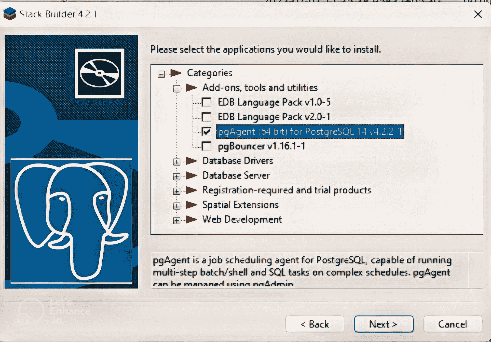

在*附件、工具和实用程序*下，您会找到 pgAgent。选中复选框进行安装。

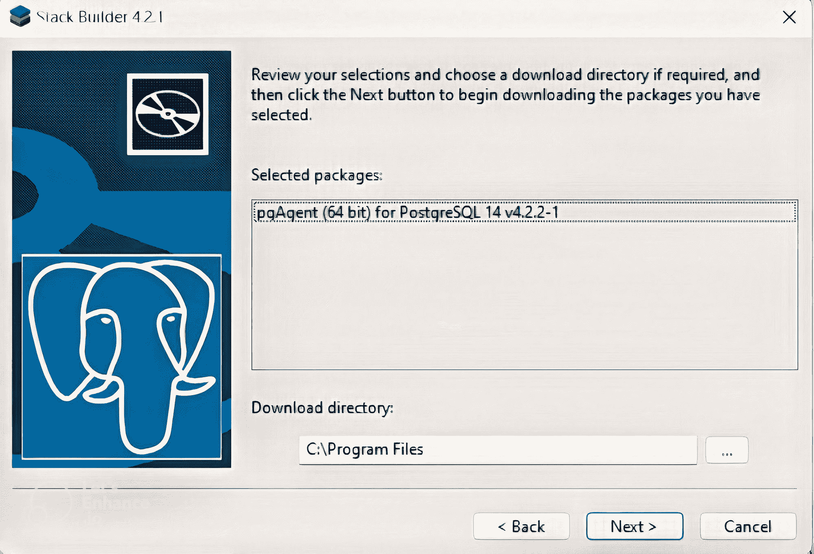

接下来，它将要求您选择要安装 pgAgent 的目录。

然后，Stack Builder 将打开 pgAgent 安装向导。

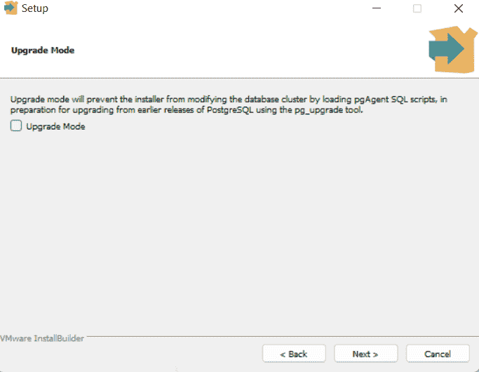

您可以在这里选择是否要在升级模式下安装。如果您不想在升级时自动更改脚本，可以选中该框。

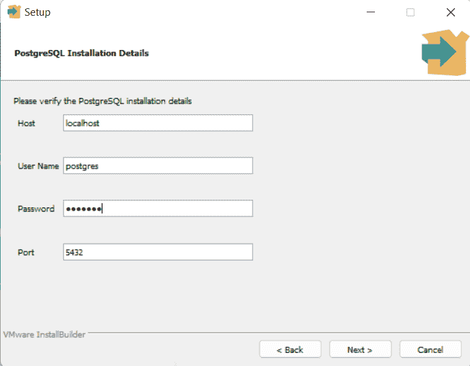

在 *PostgreSQL 安装详细信息*向导中，提供您在安装 PostgreSQL 时输入的用户名和密码。

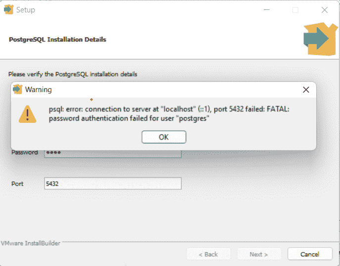

如果您输入不正确的细节，它将抛出一个连接错误。所以一定要记住这些细节。

> ***注意:*** 使用您在此阶段提供的用户名和密码登录 PostgreSQL 查看 *pgAgent 作业*。

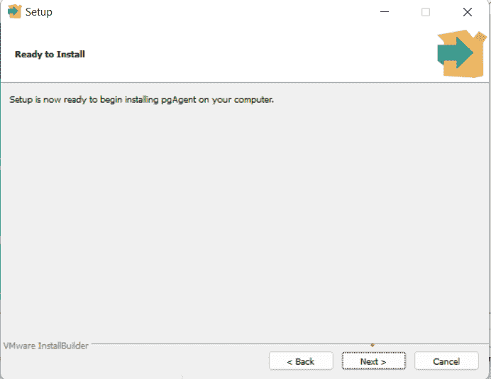

添加这些细节后，设置开始:

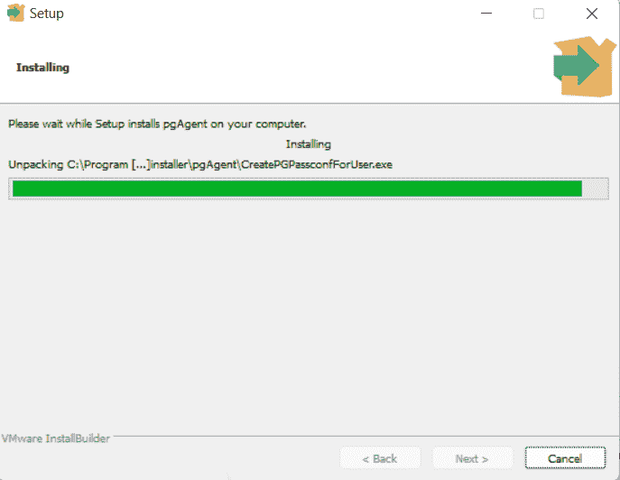

需要几秒钟才能完成。

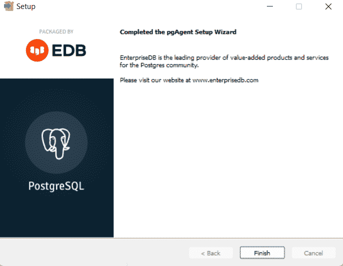

点击最后的*完成*按钮。

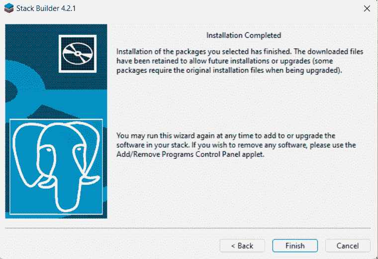

Stack Builder 还会显示一个*安装完成*向导。它有安装和卸载实用程序的说明。

一旦安装了 Stack Builder，您只需运行它来安装其他实用程序。要卸载它们，您需要使用控制面板。

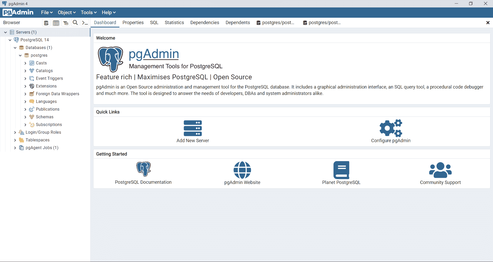

*pgAgent 作业*将在仪表板左侧的浏览器树中显示。

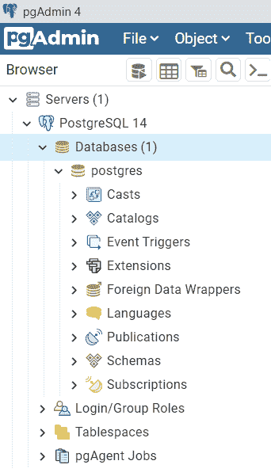

上面你可以看到浏览器树的特写视图。

# 如何在 pgAgent 中创建作业

要创建一个新任务，右击 *pgAgent 任务*按钮并点击*创建*。

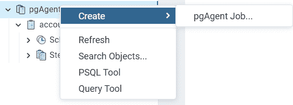

你会看到一个菜单，点击*创建* > *pgAgent 作业*。

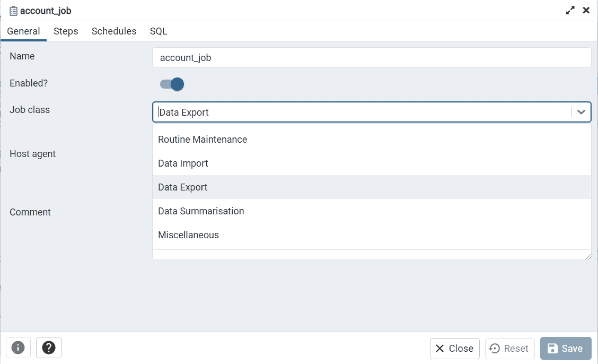

*创建 pgAgent 对话框*有四个选项卡。

第一个是*通用*标签。您可以在这里输入作业的名称并选择一个类别。

*类别*仅用于内部分类，这不会影响您的工作运行。您可以根据工作职能选择一个。因为我想将数据导出到 CSV，所以我将选择*数据导出*类别。

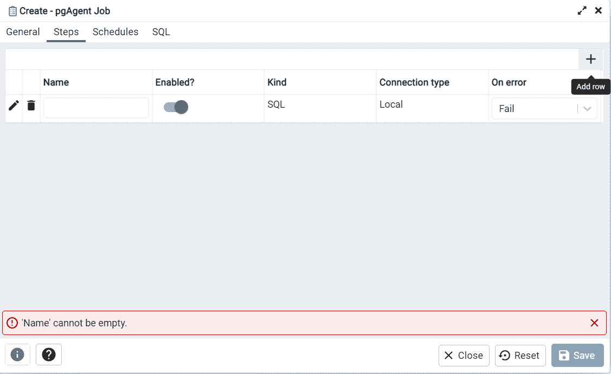

接下来，我们点击*创建 pgAgent* 对话框中的*步骤*选项卡。在方框的右上角，您会看到一个+号。单击它以添加新行。

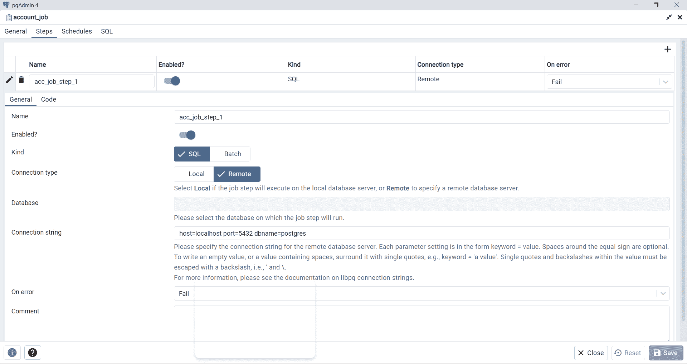

*步骤*页签有两个部分:*通用*和*代码*。

在*常规*选项卡中:

1.  添加步骤的名称。
2.  接下来，你*启用*或*禁用*该步骤。只有启用了该步骤，您的作业才会运行。
3.  根据你的工作是*本地*还是*远程*，你可以选择*连接类型*。我将选择远程连接。
4.  远程连接允许您手动添加连接字符串。语法应该类似于 [libq 连接字符串](https://www.postgresql.org/docs/current/libpq-connect.html#LIBPQ-CONNSTRING)。我将以相同的格式添加我的连接详细信息:`host=localhost port=5432 dbname=postgres`
5.  在*出错时*选择框中，您可以选择出错时应该发生的情况。我选择了失败的工作。
6.  最后可以评论一下步骤。然后保存更改。

接下来是*步骤*选项卡中的*代码*部分。
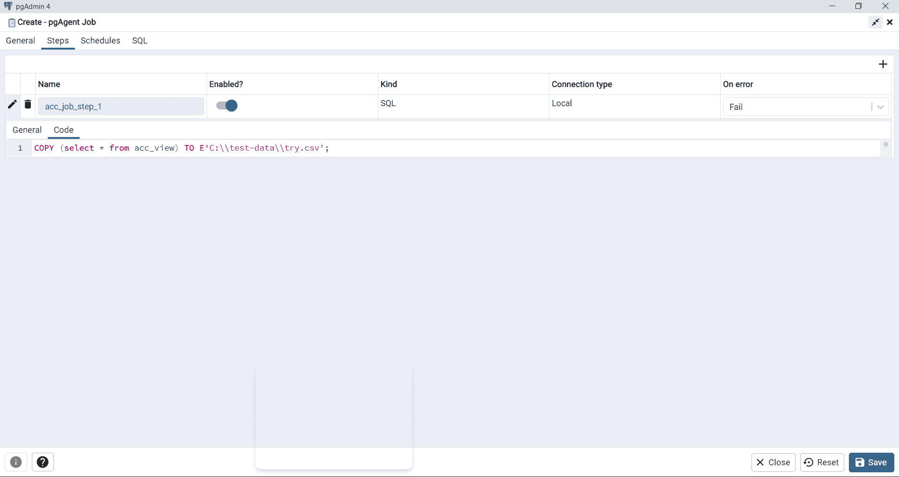

因为我想从一个视图中导出数据，所以我将调用这个视图并请求它导出文件。代码将:
`COPY (select * from acc_view) TO E'C:\\test-data\\try.csv';`

添加代码后，我将保存更改。

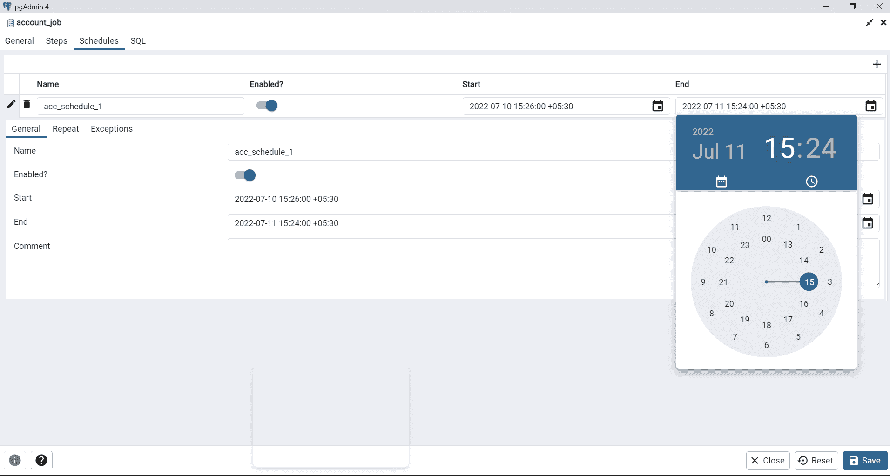

我们现在准备安排作业。在*计划*选项卡中，我们添加了*开始日期时间*和*结束日期时间*以开始和结束作业。

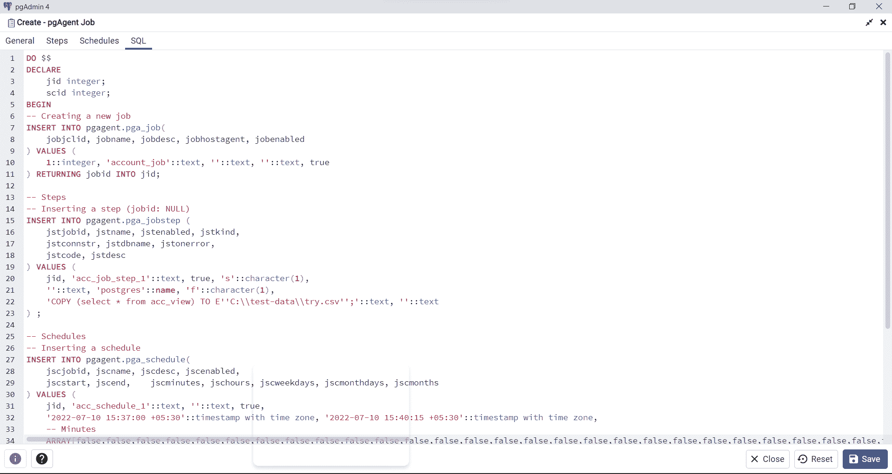

*SQL* 是最后一个标签页。它显示了 GUI 生成的代码。如果您想要动态调度作业，您必须执行此处显示的过程代码。

# 如何在 pgAgent 中查看已创建的作业

一旦创建了新作业，它将显示在浏览器树中的 *pgAgent 作业*下。

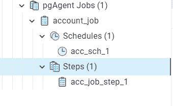

它的*时间表*和*步骤*将在您延长作业时显示。

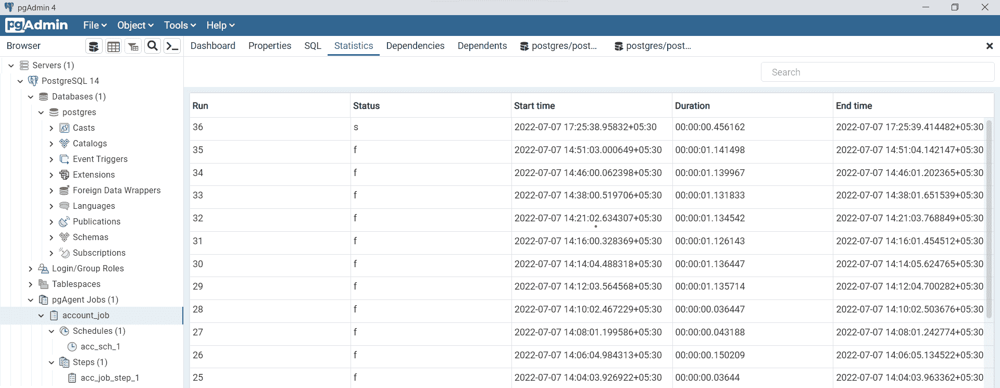

要查看作业是否被执行(是失败还是成功)，您可以通过作业的名称选择作业，然后单击仪表板中的*统计信息*选项卡。在这里，您可以查看作业的执行次数、开始和结束时间、状态和 id。在*状态*栏中 *s* 表示成功 *f* 表示失败。

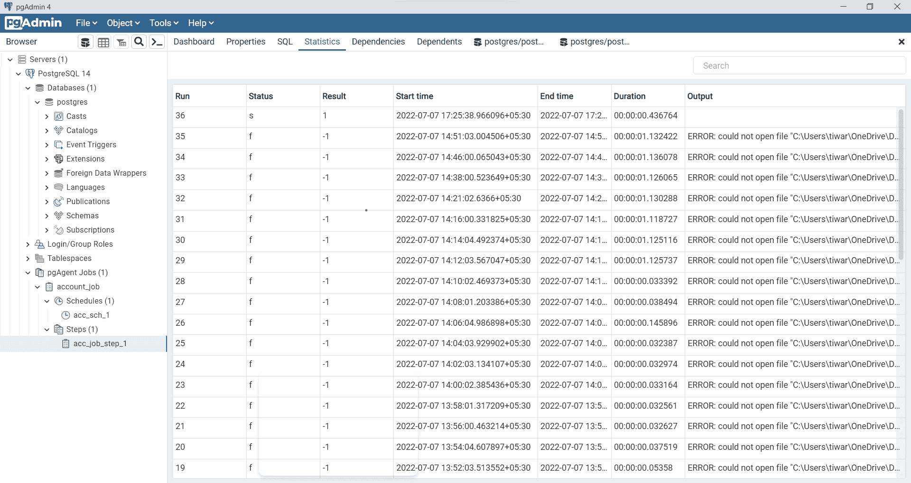

要调试作业失败的原因，您只需在浏览器树中点击*步骤*下的步骤名称，然后点击仪表板上的*统计信息*。在*输出*栏中，您可以看到作业失败的原因。

在我的例子中，它无法访问我试图将数据复制到的目录。一旦我更改了路径，我的作业就成功执行了(注意第一行)。

# 如何在 pgAgent 中编辑作业

要在 pgAgent 中编辑作业，您可以选择该作业并点击仪表板上的*属性*选项卡。

单击左上角的铅笔图标，将会打开一个向导，您可以在其中编辑所有细节。

# 结论

在您的代码中创建调度器并不总是可行的，但是当它是一个选项时，它会非常有用。

PostgreSQL 的一个强大功能是任务调度和导出 CSV 格式的数据。我将在下一个教程中尝试解释如何动态创建作业。快乐学习。