# 如何在 GitHub 中创建自动拉取请求清单

> 原文：<https://www.freecodecamp.org/news/create-a-pr-checklist-in-github/>

如果你曾经参与过一个项目，不管是你工作中的应用还是开源工具，你很可能已经创建了一个拉请求。这要求您的代码更改为合并到主代码库中。

我们使用拉请求来确保只有高质量的代码被合并到我们的主要分支中。但是有时候，在开发一个新特性的艰苦的编码会议之后，我们会错过一些小事情。

在最坏的情况下，这些错误可能会被队友忽略，并合并到主代码库中，造成错误或低效。在最好的情况下，发现这些微小的问题会占用其他团队成员的时间去注意和指出。

我特别容易打开一个懒惰的拉请求，所以我做了任何开发人员都会做的事情...我找到了一个自动制作公关清单的方法，并强迫自己去做这项工作！

本教程向您展示了如何在浏览器中构建一个扩展，该扩展将自动生成一个拉式请求清单，并隐藏“创建拉式请求”按钮，直到您检查完该清单上的每一项。

## 拿上你的工具

在你开始之前，你会想要得到一些东西。

### 列出要在代码中检查的内容

忘记任何工具或任何自动化...花几分钟时间思考**什么是好的拉动式请求**，并列出这些项目。

是什么让您可以轻松查看其他拉动式请求？或者你经常发现人们评论的一个常见错误是什么？

如果你需要一些想法，这里是我在我自己的列表中列出的。

*   所有东西都按字母顺序排列
*   关于评审员如何在本地测试代码的说明
*   已添加测试
*   功能/错误修复的屏幕截图(如果适用)
*   如果添加了任何新文本，它都是国际化的
*   任何新元素都有咏叹调标签
*   调试后无意外`console.logs`遗留
*   我对变量和函数使用了清晰简洁的名字吗？
*   我是否解释了所有可能的解决方案，以及为什么我选择了那个方案？
*   添加任何注释以使新功能更加清晰
*   添加公关标签
*   更新任何历史/变更日志文件

如果您仍然不确定，请与您团队中更高级的开发人员交谈，看看他们在审查拉请求时在寻找什么。

### 创建一个 PixieBrix 帐户(您的浏览器自动化工具)

有一些浏览器扩展可以让你创建自动化，但是我发现 [PixieBrix](https://pixiebrix.com/) 非常强大，社区也非常友好和有帮助。

> PixieBrix 为扩展您和您的团队已经使用的 web 应用程序提供了最通用的低代码平台。结果呢？您可以获得所需的高效、个性化体验...值得拥有。(来源: [PixieBrix](https://www.pixiebrix.com/) 网站)

为了实现我下面描述的自动化，你需要注册一个免费的 PixieBrix 账户。

只需在他们的网站上选择“免费开始”，并按照向导创建一个帐户。系统会提示您安装 [PixieBrix Chrome 扩展](https://chrome.google.com/webstore/detail/pixiebrix/mpjjildhmpddojocokjkgmlkkkfjnepo)。

现在你已经准备好了！

## 如何构建拉式请求清单自动化

好的，你都准备好了。现在是时候建造了。

如果你想走最简单的路线，你可以直接[激活我已经建立的扩展](https://app.pixiebrix.com/activate?id=@brittany-joiner/gh-on-a-pr)，然后随心所欲地编辑。

但是如果你想从头开始构建它，并且更加熟悉浏览器自动化是如何工作的，请遵循以下步骤。

### 步骤 1–在 PixieBrix 中打开页面编辑器

要在 PixieBrix 中构建扩展，您不需要 VSCode 或任何其他编辑器。你可以完全在你的浏览器里做任何事情。

我喜欢从我希望动作发生的页面开始，在这个例子中是`github.com`。

要访问编辑器，右击任何网页打开上下文菜单并选择`Inspect`。滚动你的标签*(你知道，就是那些写着`Elements`、`Console`、`Network`等的标签)*，直到你看到`PixieBrix`。

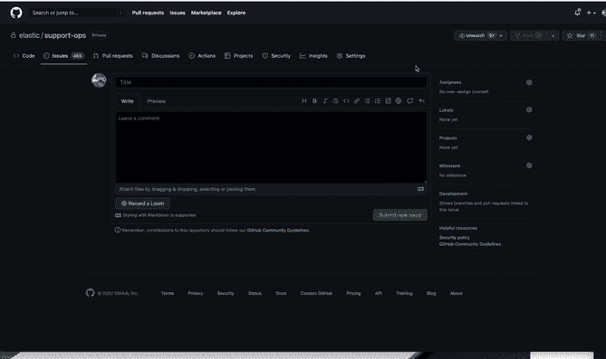

Right click to Inspect, then go to PixieBrix tab

您可能会被提示授予一些权限，但随后您会发现一个空白页，左上角有一个按钮，上面写着“添加”。那是我们将开始的地方。

### 步骤 2–添加触发器砖块

要在 PixieBrix 中建立扩展，您需要将砖块链接在一起。你可以把砖块想象成函数，扩展是主要的函数，在你配置的序列中执行较小的函数。

您有多种选择来触发此扩展。

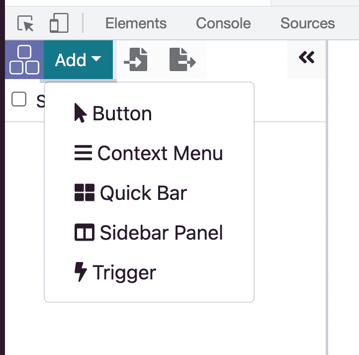

Extension Trigger Options in PixieBrix

你可以选择一个手动操作，比如在页面上添加一个按钮，或者一个上下文菜单(当你右击一个网页的时候——就是你进入你的检查器的那个菜单！)或者您可以使用 quickbar 命令(键盘快捷键)。

侧边栏面板在浏览器的右侧打开一个面板，它实际上不是一个触发器，而是用来为另一个触发器创建一个显示。

对于这个特定的工作流，使用`Trigger`选项，每当您加载特定的网页并且满足您配置的附加标准时，该选项都会运行扩展。

这是它最初的样子:

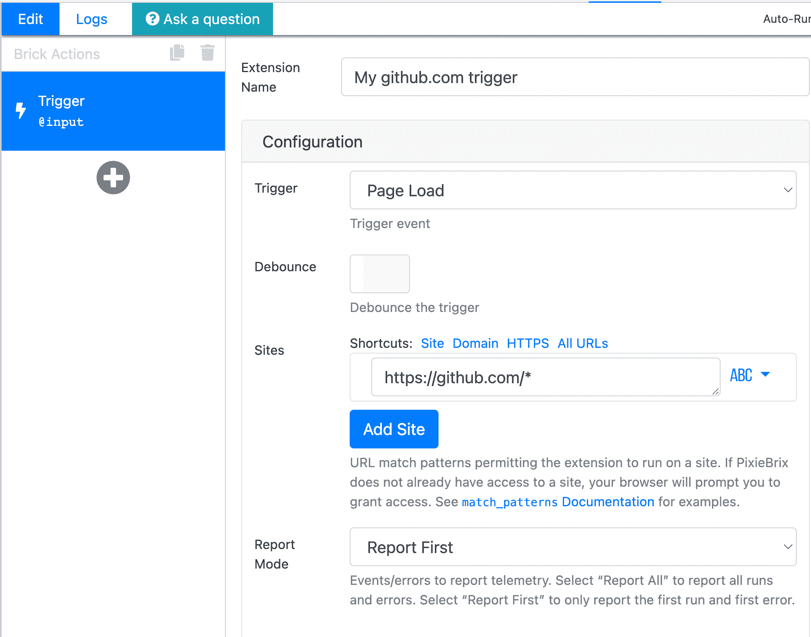

你可以把顶部的名字改成你喜欢的名字，比如`Github PR Checklist`。

要配置触发器，请考虑何时希望看到您的清单。你可以让它在你去 GitHub 的任何时候启动，但这可能比你想要的更频繁，因为当你阅读问题或在回购中搜索某些东西时，你不需要清单。

我决定每当页面上有一个`create pull request`按钮元素时触发，这表示我将要打开一个拉请求。所以这可能是一个很好的时间来检查我的清单！

因此，浏览打开一个拉请求的动作，并导航到有绿色按钮的页面(同时保持页面编辑器打开)。

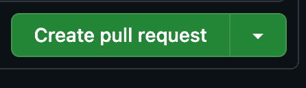

GitHub Create pull request button

一旦你看到那个按钮，滚动到触发器块的`Advanced: Match Rules`部分，并寻找`Selectors`字段。

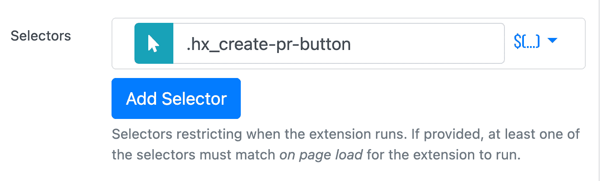

Selector section in PixieBrix trigger brick configuration

在那里，您可以使用鼠标按钮打开一个元素选择器视图，并单击选择按钮，或者您可以直接在字段中复制这个类。

```
.hx_create-pr-button 
```

所以现在你已经创建了一个触发器，告诉你什么时候加载一个托管在`github.com`的页面。

好了，我们已经确定了按钮的类别，所以最难的部分已经过去了！现在我们只需要隐藏它，显示清单，然后在清单完成后再次显示它。

### 步骤 3–隐藏`create pull request`按钮

选择触发器砖块下方的加号按钮添加另一个砖块。您将看到一个市场打开，允许您搜索所有可用的砖块。搜索`hide`就能看到这块砖。

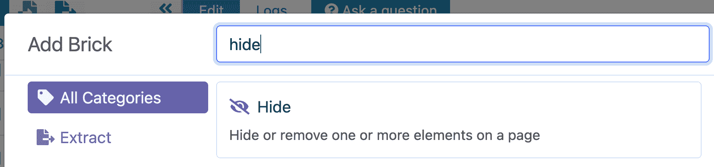

Hide brick in PixieBrix marketplace

将鼠标悬停在“隐藏”砖块上以查看更多选项，然后选择“添加”将其添加到您的扩展中。

这个砖块需要的唯一配置是**隐藏哪个元素**。在这种情况下，它将与我们在触发器中使用的元素完全相同 create pull request 按钮。所以您可以复制同一个类，并将其设置为选择器的值。

### 步骤 4–打开侧边栏

再加一个叫`Show Sidebar`的砖。这将在浏览器的右侧打开一个面板来显示内容。

我将`panelHeading`字段设置为`PR`,以指定它应该加载`PR`选项卡。如果您还没有设置其他侧面板，您不需要在这里放置任何东西，您可以跳到下一步。

### 第 5 步-将自己分配到问题中

在我们进入清单之前，除了显示清单和隐藏按钮之外，我还添加了一个自动化功能。

我创建了一个操作来将自己分配给该问题。只是点击一下，但为什么不让机器人来做呢？😊

为此，添加另一个称为`Simulate a DOM event`砖块的砖块。这块砖确实如其名...它假装对一个特定的元素做了什么，比如点击它。

为您希望与之交互的元素提供一个选择器和一个事件。

就像在触发器和隐藏砖块中一样，您可以使用鼠标按钮在屏幕上打开选择器选择器，并选择`assign yourself`链接来自动将这些类应用到选择器字段。

您也可以通过复制并粘贴到`selector`字段来手动应用该类:

```
#new_pull_request .js-issue-assign-self 
```

确保选择`event`的`click`，一切就绪！

### 步骤 6–创建您的清单

现在，我们在我们的扩展肉。是时候列出清单了。选择加号按钮并添加`Show a modal or sidebar form`砖块。

这是设计表单的砖块，对于我们在提交拉取请求之前想要确认或考虑的每个项目，都将是一个复选框字段。

#### 设置表单标题和描述

这些纯粹是装饰性的，所以你可以随意设置。

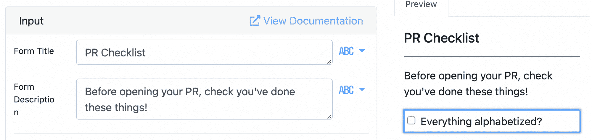

Form settings for PixieBrix Show form brick

#### 配置您的第一个字段

在打开拉取请求之前，拿起您要查看的项目列表，选择第一个项目。这将是我们的第一个表单字段，您需要在 PixieBrix 中设置以下字段:

*   `name`
*   `label`
*   `input type`

名称和标签可以是任何你想要的。**保持名称简单**，因为在下一步检查其真假时，您将需要引用它。**标签是出现在复选框**旁边的可视内容。对于输入类型，选择**复选框**。

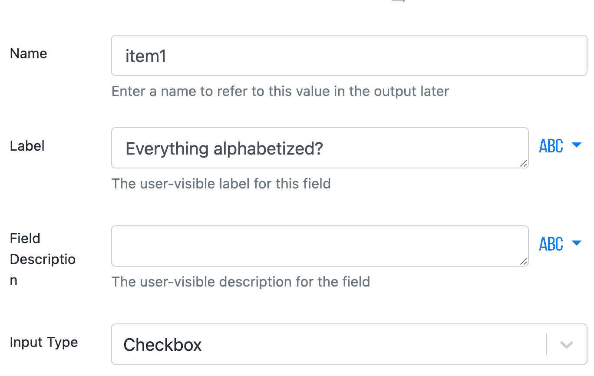

PixieBrix form field configuration

您可以在 PixieBrix 页面编辑器的右侧面板上预览它的外观。

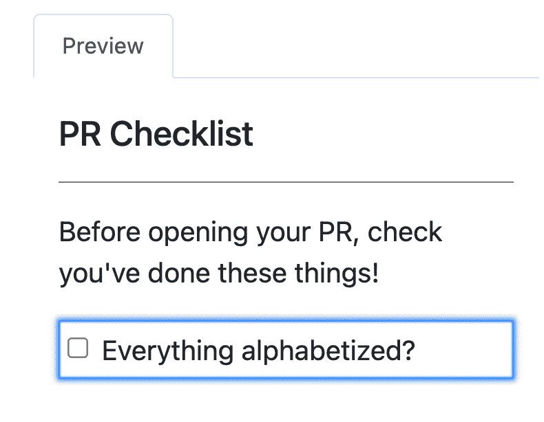

Preview form in PixieBrix preview panel

#### 将其余项目作为新字段添加

滚动字段上方以选择蓝色按钮“添加新字段”，并根据您的条目数重复以上操作。

#### 最终形态结构

快好了！滚动表单域选项下方的**，直到看到`Submit Button Text`。你可以保持原样，但是我定制了我的说`Ready to Open`让按钮动作更清晰。**

最重要的是，通过选择下拉菜单将`Location`值改为`sidebar`而不是`modal`。这会将表单设置为出现在我们在上一步中打开的侧栏中。

### 步骤 7–完成清单后，显示`create pull request`按钮

向这个扩展添加最后一块砖，名为`Show`。这类似于 Hide，我们将传递给它我们一直为`create pull request`按钮引用的同一个类。

如果你需要复习的话，这又是一次:

```
.hx_create-pr-button 
```

还有一部分需要配置，因为我们希望控制何时执行这个砖块，因为我们只想在表单提交中的每一项都被选中时显示按钮。

我们可以将表单中的每个字段都设置为必填字段，这样您就可以在检查完所有内容后再提交表单。但是另一种方法是在这个砖块上的高级选项下编辑`Condition`字段。

您可以在这里指定何时运行这个特定的程序块。如果检查表中的每个字段都为真，您将构建一个返回真的语句。

这就是语法看起来的样子，尽管您需要用每一项的名称替换`item`值。

```
{{ "true" if @form.item1 and @form.item2 and @form.item3 and @form.item4 and @form.item5 and @form.item6 and @form.item7 and @form.item8 and @form.item9 and @form.item10 and@form.item11 }} 
```

完成后，您的砖块应该看起来像这样:

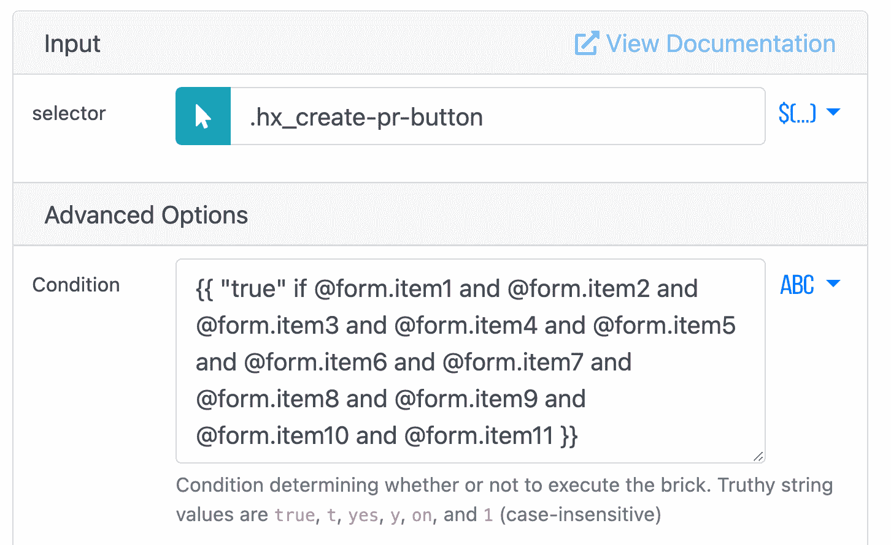

Show brick configuration

选择 PixieBrix 页面编辑器右上角的蓝色保存按钮来保存您的扩展。

## 带它去兜一圈

现在试试吧！无论您已经[激活了预构建的扩展](https://app.pixiebrix.com/activate?id=@brittany-joiner/gh-on-a-pr)，还是按照教程自己构建了它，您都已经准备好测试了。

打开一个 pull 请求，您会看到侧边栏表单，没有绿色按钮。检查列表中的所有项目，并提交，然后突然你的按钮出现，你已经被分配到 PR！

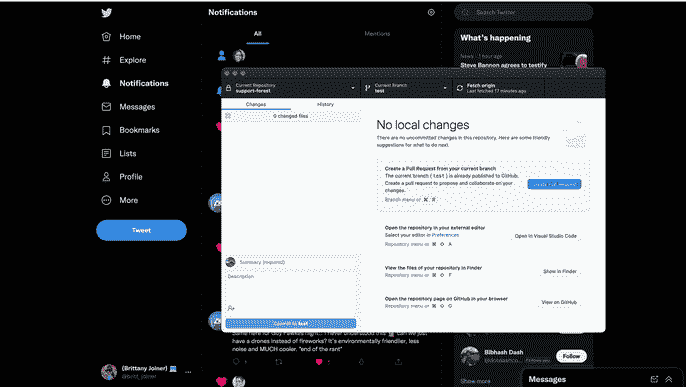

Demo of PR Checklist

如果您在开始构建它时有任何问题，或者它没有按预期工作，PixieBrix 社区是活跃的，维护人员总是愿意加入并提供帮助。

但是如果你更喜欢视觉学习，更喜欢观看，我制作了一个视频，向你展示如何[建立这个自动化的公关清单](https://youtu.be/cpZ1J2s-2jk)。

感谢您的阅读！