# Node.js 入门指南

> 原文：<https://www.freecodecamp.org/news/introduction-to-nodejs/>

Node.js 是一个 JavaScript 运行时，它将其功能扩展到了服务器端。它基于 Chrome 的 V8 JavaScript 引擎。

Node 是一个事件驱动的非阻塞 IO 模型。这意味着它是异步的，不会因为一个请求而阻塞自身(而是立即转移到下一个请求)。这使得 Node 异常快速和高效。

事件驱动意味着节点一启动就启动所有变量和函数，并等待事件发生。

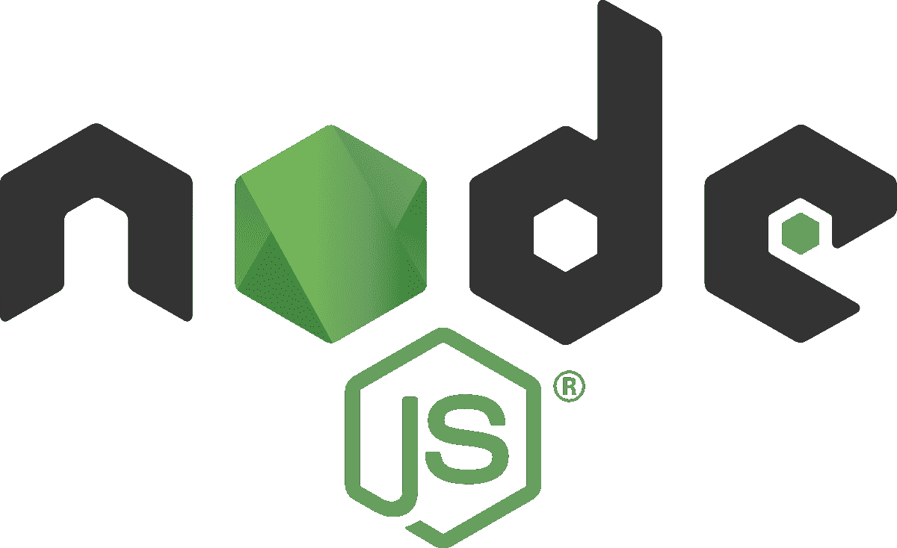

NPM 代表节点包管理器，帮助您管理您的节点包。NPX 代表节点包执行，它可以执行任何 npm 包，甚至不需要安装它。

下载 npm 头像到[https://nodejs.org/en/download/](https://nodejs.org/en/download/)。

## 如何编写你的第一个 Node.js 程序(Hello World)

在项目文件夹中创建一个名为 hello_world.js 的文件

然后在代码编辑器中打开文件，就像 VS 代码一样。在编辑器中键入代码`console.log(“Hello World”);`。

打开终端，导航到文件位置。

现在输入`node hello_world.js`。

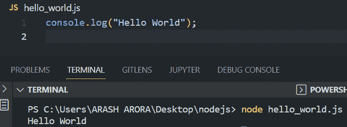

## 如何导入节点核心模块

所以我们先从非常基础的包开始，那就是 **fs(文件系统)**。您可以用它来创建、读取和修改文件。

要导入 fs 模块，请键入以下命令:`const fs = require(“fs”);`。

现在要使用该模块的任何功能，可以参考[文档](https://nodejs.org/docs/latest-v17.x/api/fs.html#file-system)。

要创建一个文件，我们可以使用`fs.writeFileSync(filename, content);`。

```
const fs = require(“fs”);
fs.writeFileSync(“file.txt”, “Hi there..”);
```

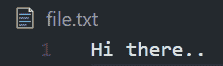

要在同一个文件中追加任何内容，我们可以使用:

```
fs.appendFileSync(filename, content);.
```

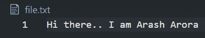

## 如何安装 NPM 软件包

现在我们将使用一个名为**超级英雄**(这是一个随机超级英雄的列表)的非常基本的 npm 包来帮助您理解 npm 是如何工作的。

要安装任何 npm 软件包，我们可以在 cmd 中使用以下命令:

```
npm install superheroes
```

现在导入已安装的包类型`const sh = require(“superheroes”);`。

要显示随机超级英雄的名字，请使用以下命令:

```
console.log(sh.random());.
```

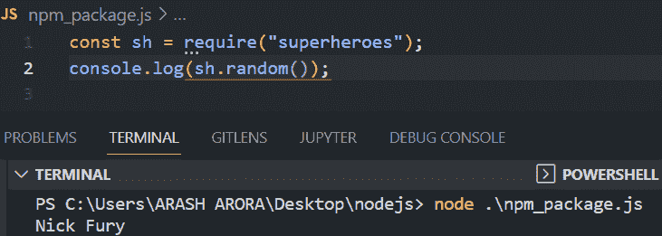

让我们试试另一个包裹。现在我们将安装一个最常用的 npm 包，名为**“chalk”——**它在终端中设计文本字符串的样式。

要安装 chalk 包(我们将安装版本 2.4.2，因为它允许我们使用 **require** 方法导入包)，请键入以下命令:

```
npm install chalk@2.4.2
```

现在，要设置文本字符串的样式，使用此命令选择字符串的颜色:

```
chalk.color(text)
```

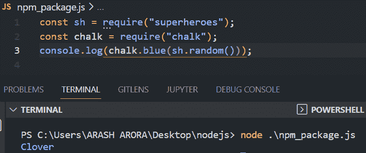

你可以在这里阅读更多关于[粉笔包的信息。](https://www.npmjs.com/package/chalk)

## 如何让 NPM 加入我们的计划

要在我们的程序中启动 NPM，我们可以使用以下命令:

```
npm init
```

然后按回车键或相应地回答问题。

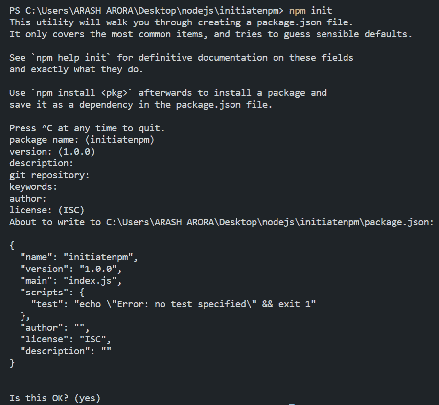

或者可以直接使用命令`npm init -y`(与所有问题按 enter 键相同)。

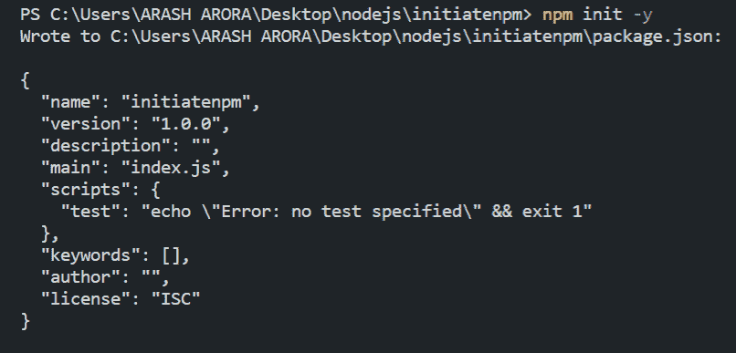

这将导致创建 **package.json** 文件:

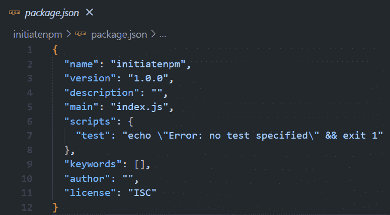

### 那么，package.json 是什么呢？

package.json 是任何 Nodejs 项目的核心。它维护所有依赖项(NPM 包)的记录，并包含每个项目的元数据。

如果其他人下载了该项目，这个文件将帮助他们安装运行该程序所需的所有依赖项。

## 如何使用 moment . js——NPM 软件包

这是最常用的 npm 包之一。您可以使用它来解析和验证日期。

要安装该软件包，请运行以下命令:

```
npm i moment
```

像这样导入包:

```
const moment = require(“moment”);
```

要创建 Date 对象来获取当前日期和时间(JavaScript 方法)，请运行以下代码:

```
const time = new Date();
```

现在，为了解析或格式化日期，我们将使用 **moment** 包:

```
const parsedTime = moment(time).format("h:mm:ss");
```

像这样打印解析的时间:

```
console.log(parsedTime);
```

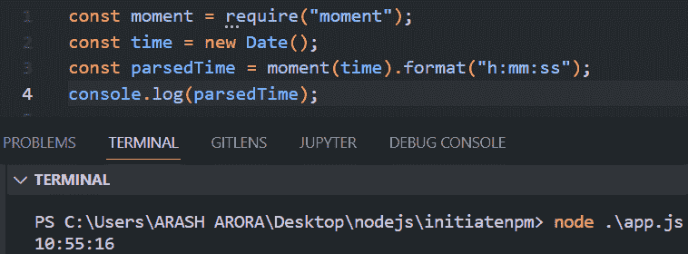

这是这个项目的 package.json，它包含了所有的依赖包——在这个例子中是 **moment** 。

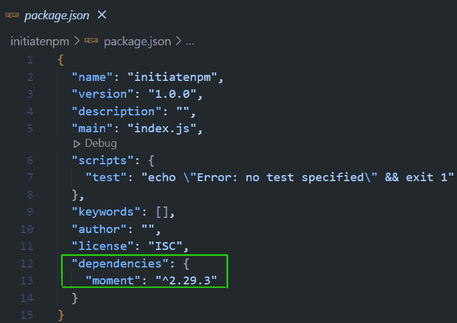

项目文件夹中还有 **node_modules** 。这个文件夹包含了我们的项目所依赖的所有依赖项，包括 moment 和 moment 所依赖的其他包。

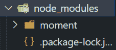

**package-lock.json** 是我们的项目文件夹中的另一个文件，它包含关于名称、依赖项、依赖项版本和项目锁定版本的所有信息。

它描述了生成的确切的树，以允许后续安装具有相同的树。

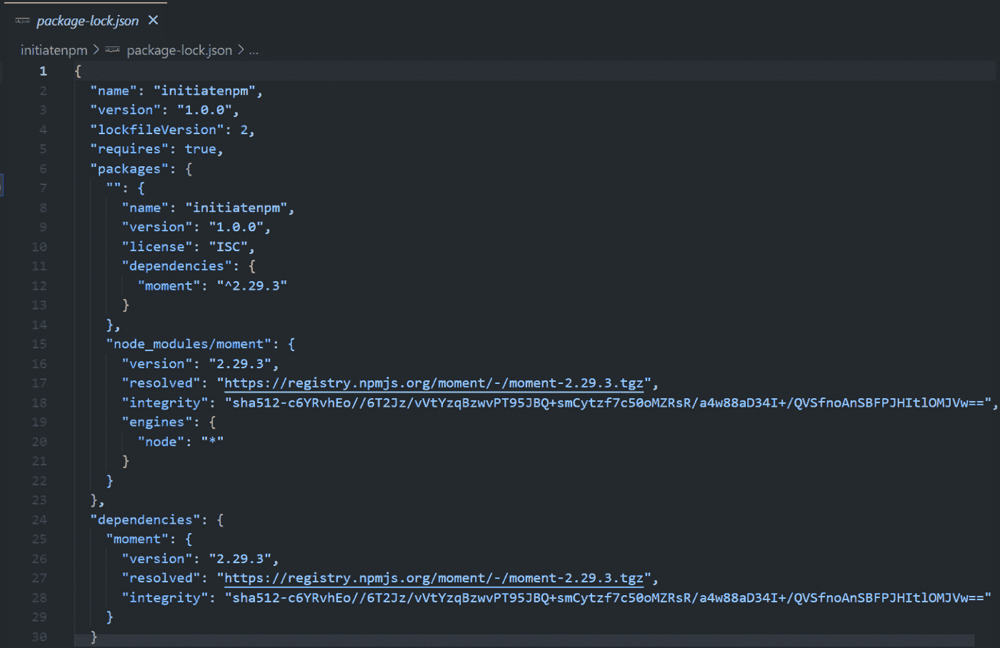

# 如何使用 express js a node.js 框架

Express 是一个 Node.js web 应用程序框架，为 web 和移动应用程序提供了全面的功能。

### 如何安装 Express

要安装 Express，请运行以下命令:

```
npm install express
```

那么您需要像这样导入 Express:

```
const express = require("express");
```

### 如何创建快速应用程序

要创建快速应用程序，只需运行以下命令:

```
const app = express()
```

### 如何在端口 3000 上启动服务器

```
app.listen(3000, () => { 
    console.log("Server running on port 3000");
}
```

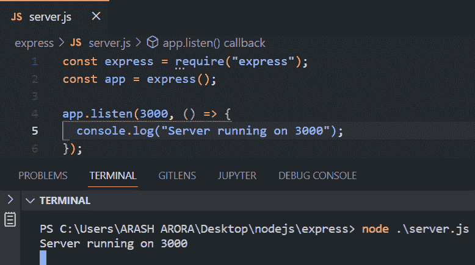

现在您可以打开[**http://localhost:3000**](http://localhost:3000/)**到达您创建的服务器**

**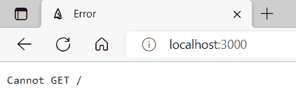**

**好的，所以“无法获得/”意味着还没有定义的路由“/”。**

**因此，为了定义“/”路线，我们使用了函数`app.get()`。**

****app.get (route，callback function)** 函数用于处理所有 get 请求。**

**回调函数有两个参数， **req** 和 **res** ，分别指 HTTP 请求和期望的响应。参数名(req，res)不是固定的，可以任意命名。**

```
`app.get("/", (req,res) => { 
    // app.get to handle GET requests
    // req - http request, res - desired response
    res.send("Hello World"); // send Hello World to this route
}`
```

## **如何在 Express 中创建 Hello World 程序**

**在这一节中，我们将在 Express 中创建 Hello World 的基本程序。**

```
`const express = require("express");
const app = express();
app.get("/", (req, res) => {  
    res.send("hello world");
});
app.listen(3000, () => {  
    console.log("Server running on 3000");
});`
```

**这是输出**

**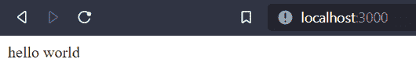**

## **如何在 Express 中渲染静态文件**

**本节向我们介绍使用 Express 进行静态文件渲染的概念。**

**首先，您需要创建一个新的项目文件夹。然后您将使用`npm init -y`初始化 npm。**

**安装 Express 包`npm i express`并创建一个名为 app.js 的文件。**

**然后，您将创建一个应用程序，并在端口 3000 上监听或启动服务器。**

```
`const express = require("express);
const app = express();
app.listen(3000, () => {  
    console.log("Server running on 3000");
}`
```

**要呈现 HTML、CSS 和 JS 等静态网页，请在根目录中创建一个名为 public 的文件夹。**

**因为我们只关注后端，所以我们不会在前端花太多时间，我们只会在 public 文件夹中创建一个 HTML 文件。**

**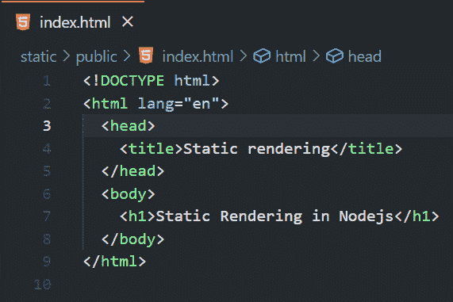**

**我们现在将导入**路径**模块，并将指定的路径合并成一个:**

```
`const path = require(“path”);`
```

**现在要渲染这些文件，我们必须使用以下命令:**

```
`app.use(express.static(path.join(__dirname, “/public”)));`
```

****_ _ 目录名→** 返回当前目录**

```
`const express = require("express");
const path = require("path");
const app = new express();
app.use(express.static(path.join(__dirname, "/public")));
app.listen(3000, () => {  
    console.log("Server running on 3000");
});`
```

**这是输出结果:**

**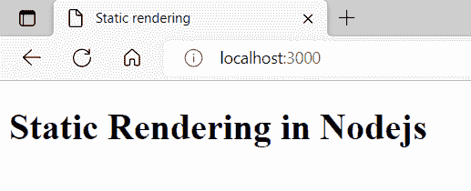**

## **如何在 Express 中渲染动态文件**

**在这一节中，我们将学习渲染动态文件，在这些文件中我们可以使用来自输入对象的值。**

**要渲染动态网页，有很多模板，比如 pug、handlebars、ejs 等等。这些模板允许我们在运行时注入动态数据、if 条件和循环。**

**但这里我们将重点放在车把上。**

**安装软件包(express 和 hbs):**

```
`npm i hbs express`
```

**创建名为 app.js 的文件，并像这样导入包:**

```
`const express = require(“express”);
const hbs = require(“hbs”);
const path = require(“path”);`
```

**创建一个快速应用程序并在端口 3000 上侦听:**

```
`const app = express();
app.listen(3000, (req,res) => {  
    console.log("Server running on 3000");
}`
```

**为了让手柄工作，我们需要将视图引擎设置为 hbs。**

```
`app.set(“view engine”, “hbs”);`
```

**视图引擎使我们能够使用指定的模板呈现动态网页。**

**视图引擎通常在根文件夹中查找“视图”文件夹。但是为了避免错误，我们将使用下面的命令提到“视图”的路径:**

```
`app.set(“views”, path.join(__dirname,“/views”);`
```

**现在在根目录下创建一个**视图**文件夹。在该文件下创建一个名为 index.hbs(.hbs 是手柄的扩展)并插入以下 HTML 代码:**

### **index.hbs**

```
`<html>  
    <head> 
        <title>Dynamic Rendering</title> 
    </head>
    <body>  
      <h1>Dynamic Rendering</h1>   
      <p>{{author}}</p> <!--dynamic data recieved from server-->
    </body>
</html>`
```

****`{{author}}`** —插入动态数据的语法**

**现在，为了呈现 index.hbs 文件，我们将创建一个 app.get 函数来处理 route "/"上的 get 请求，并发送动态数据 **author** 。**

```
`app.get("/", (req, res) => { 
    res.render("index", {    
        author: "Arash Arora", 
    });
});`
```

****`res.render`** 是渲染视图的函数。这里我们要传递两个参数。第一个是不带扩展名的文件名，第二个是局部变量的对象，例如**作者**。**

### **app.js 文件**

```
`const express = require("express");
const hbs = require("hbs");
const path = require("path");
const app = express();
app.set("view engine", "hbs");
app.set("views", path.join(__dirname, "/views"));
app.get("/", (req, res) => {  
    res.render("index", {    
        author: "Arash Arora", 
    });
});
app.listen(3000, (req, res) => { 
    console.log("Server listening on 3000");
});`
```

### **文件夹结构**

**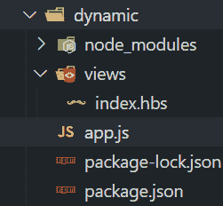**

**这是输出结果:**

**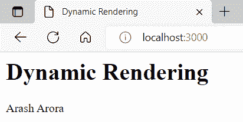**

# **如何创建带手柄的高级模板**

**所以，这是我们学习可重用组件的地方。以前，当涉及到页眉和页脚时，我们必须为每一页构建相同的组件。**

**但是因为有太多重复的任务，所以高级模板是救世主。这个概念表明，我们将只制造一个组件，它将在我们需要它的任何地方使用。**

### **车把引入了分音的概念**

**分部文件是其他模板可以调用的常规把手文件。Partials 是一个广泛使用的模板概念，并不特定于车把。**

**为了构造可能被重用的模板，您可以将它们隔离到它们的文件中(一部分)，然后在不同的模板中使用它们。您可以将 partials 视为模块化模板的一种简单技术。**

**按照以下步骤创建片段:**

*   **启动国家预防机制→ `npm init -y`**
*   **安装所需的软件包，Express 和 hbs → `npm i express hbs`**
*   **创建您的文件夹模板**
*   **在文件夹模板中创建另外两个文件夹: **partials 和 views****
*   **现在创建一个文件 **app.js****

**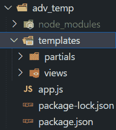

The folder Structure should be similar** 

**让我们创建两个部分文件:header.hbs 和 footer.hbs。我们还将添加两个视图，index.hbs 和 about.hbs。**

**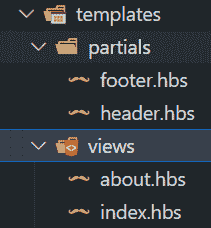**

### **index.hbs**

```
`<html lang="en">  
    <head>   
        <title>Advanced Templating</title>  
    </head>  
    <body>    
        {{>header}} <!--include the header component-->
        <p>I'm a savior</p>    
        {{>footer}} <!-- include the footer component -->
    </body>
</html>`
```

### **about.hbs**

```
`<html lang="en">  
    <head>    
        <title>Advanced Templating -- About</title> 
    </head>
    <body>   
        {{>header}}   
        <p>Handlebars</p>    
        {{>footer}} 
    </body>
</html>`
```

### **header.hbs**

```
`<header>  
    <h1>Advanced Templating</h1> 
    <h3>{{title}}</h3><!--dynamic data received from server-->
    <a href="/">Home</a> 
    <a href="/about">About</a>
</header>`
```

### **footer.hbs**

```
`<footer>  
    <p>Created by {{name}}</p> <!--name -> dynamic data -->
</footer>`
```

### **app.js**

```
`const express = require("express");
const hbs = require("hbs");
const path = require("path");
const app = express();
app.set("view engine", "hbs");
app.set("views", path.join(__dirname, "/templates/views"));
hbs.registerPartials(path.join(__dirname, "/templates/partials"));
app.get("/", (req, res) => {  
    res.render("index", {    
        title: "Home",    
        name: "Arash Arora",  
    });
});
app.get("/about", (req, res) => {  
    res.render("about", {    
        title: "About",    
        name: "Arash Arora",  
    });
});
app.listen(3000, () => {  
    console.log("Listening on port 3000");
});`
```

**一切都和我在 Express 中渲染动态文件一节中解释的一样——除了这里我们必须**注册片段**来使用片段。**

### **如何登记部分音**

```
`hbs.registerPartials(path_to_partials)`
```

**由于我们已经在 templates 文件夹中创建了 partials 目录，下面是 partials 的路径:**

```
`hbs.registerPartials(path.join(__dirname, "/templates/partials"));`
```

# **包扎**

**在本文中，我们从理论到实践介绍了 Node.js。虽然 Node.js 是一个庞大的主题，您无法从一篇较短的文章中完全了解，但我已经尽了最大努力来介绍一些基本的特性，以帮助您开始这个旅程。**

**简而言之，我们已经讨论了 Node.js 是什么，它是一个非阻塞的、事件驱动的 JavaScript 运行时，它是异步的，使用单线程来执行操作。我们还讨论了最常用的最小且灵活的 Node.js web 应用程序框架 Express。**

**然后我们讨论了 Node.js 的 NPM、NPX 以及静态和动态数据渲染。**

**总而言之，Node.js 是一项值得了解的奇妙技术，由于其庞大的社区，可能性是无穷的。**