# PHP 手册——初学者学习 PHP

> 原文：<https://www.freecodecamp.org/news/the-php-handbook/>

PHP 是一种非常流行的编程语言。

据统计，80%的网站都在使用它。它是支持 WordPress 的语言，WordPress 是广泛使用的网站内容管理系统。

它还支持许多不同的框架，使 Web 开发更容易，如 Laravel。说到 Laravel，这可能是如今学习 PHP 最令人信服的理由之一。

## 为什么要学 PHP？

PHP 是一种非常两极分化的语言。有人爱，有人恨。如果我们超越情感，将语言视为一种工具，PHP 可以提供很多东西。

当然它并不完美。但是让我告诉你——没有语言是这样的。

在这本手册中，我将帮助你学习 PHP。

如果你是这门语言的新手，这本书是很好的入门读物。如果你过去做过“一些 PHP”并且想重新开始，这也是完美的。

我来解释一下现代 PHP，8+版。

PHP 在过去的几年里有了很大的发展。因此，如果你最后一次尝试的时候是 PHP 5 甚至 PHP 4，你会对 PHP 现在提供的所有好东西感到惊讶。

我们走吧！

以下是我们将在本手册中介绍的内容:

1.  [PHP 简介](#introduction-to-php)
2.  [PHP 是一门怎样的语言？](#what-kind-of-language-is-php)
3.  [如何设置 PHP](#how-to-setup-php)
4.  如何编写你的第一个 PHP 程序
5.  [PHP 语言基础知识](#php-language-basics)
6.  [如何在 PHP 中使用字符串](#how-to-work-with-strings-in-php)
7.  [如何在 PHP 中使用数字内置函数](#how-to-use-built-in-functions-for-numbers-in-php)
8.  [PHP 中数组的工作原理](#how-arrays-work-in-php)
9.  PHP 中条件是如何工作的
10.  [PHP 中的循环如何工作](#how-loops-work-in-php)
11.  函数如何在 PHP 中工作
12.  [如何在 PHP](#id="how-to-loop-through-arrays-with-map-filter-and-reduce-in-php) 中用`map()`、`filter()`、`reduce()`循环数组
13.  [PHP 中的面向对象编程](#object-oriented-programming-in-php)
14.  [如何包含其他 PHP 文件](#how-to-include-other-php-files)
15.  [PHP 中对文件系统有用的常量、函数和变量](#useful-constants-functions-and-variables-for-filesystem-in-php)
16.  [如何处理 PHP 中的错误](#how-to-handle-errors-in-php)
17.  [如何在 PHP 中处理异常](#how-to-handle-exceptions-in-php)
18.  如何在 PHP 中处理日期
19.  [如何在 PHP 中使用常量和枚举](#how-to-use-constants-and-enums-in-php)
20.  [如何使用 PHP 作为 Web App 开发平台](#how-to-use-php-as-a-web-app-development-platform)
21.  [如何使用作曲者和打包者](#how-to-use-composer-and-packagist)
22.  [如何部署 PHP 应用程序](#how-to-deploy-a-php-application)
23.  [结论](#conclusion)

请注意，您可以获得本手册的 [PDF、ePub 或 Mobi](https://thevalleyofcode.com/download/php/) 版本，以便于参考，或者在 Kindle 或平板电脑上阅读。

## PHP 简介

PHP 是一种编程语言，许多开发人员用它来创建 Web 应用程序等。

作为一种语言，它有一个卑微的开始。它最初是由拉斯马斯·勒德尔夫在 1994 年创建的，用来建立他的个人网站。他当时不知道它最终会成为世界上最流行的编程语言之一。后来，在 1997/1998 年，它变得流行起来，并在 PHP 4 登陆的 2000 年代爆发。

您可以使用 PHP 为 HTML 页面增加一点交互性。

或者您可以将它用作 Web 应用程序引擎，动态创建 HTML 页面并将它们发送到浏览器。

它可以扩展到数百万次页面浏览。

你知道脸书是由 PHP 驱动的吗？听说过维基百科吗？懈怠？Etsy？

## PHP 是一门怎样的语言？

让我们进入一些技术术语。

编程语言根据它们的特性被分成不同的组。例如解释/编译、强/松散类型、动态/静态类型。

PHP 通常被称为“脚本语言”，它是一种解释语言。如果你使用过像 C 或 Go 或 Swift 这样的编译语言，主要的区别是你不需要在运行之前编译一个 PHP 程序。

这些语言被编译，编译器生成一个可执行程序，然后运行。这是一个分两步走的过程。

PHP *解释器*负责解释 PHP 程序执行时编写的指令。只是一步之遥。你告诉解释器运行程序。这是完全不同的工作流程。

PHP 是一种**动态类型语言**。变量的类型在运行时检查，而不是像静态类型语言那样在代码执行之前检查。(这些恰好也是编的——这两个特点往往是齐头并进的。)

PHP 也是松散(弱)类型的。与 Swift、Go、C 或 Java 等强类型语言相比，你不需要声明变量的类型。

被解释和松散/动态类型化将使错误更难在运行时发生之前被发现。

在编译语言中，您经常可以在编译时捕获错误，这在解释语言中是不会发生的。

但是另一方面，解释语言有更多的灵活性。

有趣的事实:PHP 是用 C 语言内部编写的，这是一种编译的静态类型语言。

本质上，PHP 类似于 JavaScript，另一种动态类型、松散类型和解释型语言。

PHP 支持面向对象的编程，也支持函数式编程。你可以随心所欲地使用它。

## 如何设置 PHP

在本地机器上安装 PHP 有很多方法。

我发现在本地安装 PHP 最方便的方法是使用 MAMP。

MAMP 是一款适用于所有操作系统的免费工具——Mac、Windows 和 Linux。这是一个为您提供启动和运行所需的所有工具的包。

PHP 由 HTTP 服务器运行，负责响应浏览器发出的 HTTP 请求。所以你用你的浏览器 Chrome 或者 Firefox 或者 Safari 访问一个 URL，HTTP 服务器用一些 HTML 内容来响应。

服务器通常是 Apache 或 NGINX。

那么要做任何重要的事情，你需要一个数据库，比如 MySQL。

MAMP 是一个包，提供所有这些，甚至更多，并给你一个很好的界面来启动/停止一切。

当然，如果你愿意的话，你可以单独设置每一部分，很多教程都解释了如何设置。但是我喜欢简单实用的工具，MAMP 就是其中之一。

你可以用任何类型的 PHP 安装方法来遵循这个手册，不仅仅是 MAMP。

也就是说，如果你还没有安装 PHP，而你想使用 MAMP，去 [https://www.mamp.info](https://www.mamp.info/) 安装它。

这个过程将取决于你的操作系统，但是一旦你完成了安装，你将有一个“MAMP”应用程序安装。

启动它，您将看到一个类似如下的窗口:

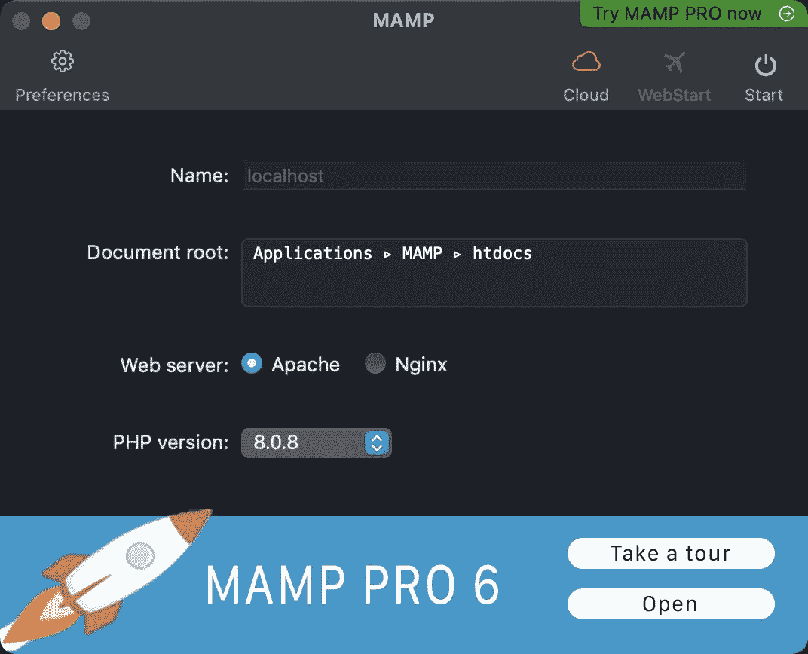

确保选择的 PHP 版本是最新的。

在写这篇文章的时候，MAMP 让你选择 8.0.8。

注意:我注意到 MAMP 的版本有点落后，不是最新的。你可以通过启用 MAMP 专业版演示来安装一个更新的 PHP 版本，然后从 MAMP 专业版设置中安装最新版本(在我的例子中是 8.1.0)。然后关闭它，重新打开 MAMP(非专业版)。MAMP 专业版有更多的功能，所以你可能想使用它，但没有必要按照这本手册。

按右上方的开始按钮。这将启动 Apache HTTP 服务器(启用了 PHP)和 MySQL 数据库。

转到 URL[http://localhost:8888](http://localhost:8888/)，您会看到一个类似如下的页面:

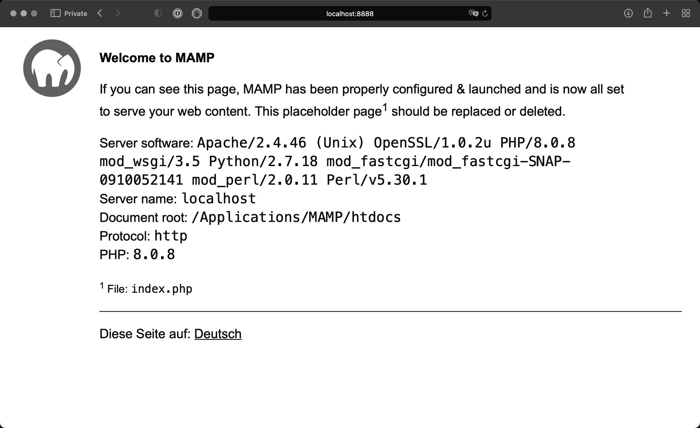

我们准备写一些 PHP 了！

打开列为“文档根目录”的文件夹。如果你在 Mac 上使用 MAMP，它是默认的`/Applications/MAMP/htdocs`。

在 Windows 上是`C:\MAMP\htdocs`。

根据您的配置，您的可能会有所不同。使用 MAMP，您可以在应用程序的用户界面中找到它。

在那里，你会发现一个名为`index.php`的文件。

负责打印上面显示的页面。


## 如何编写你的第一个 PHP 程序

当学习一门新的编程语言时，我们有创造“你好，世界！”申请。打印这些字符串的东西。

确保 MAMP 正在运行，并如上所述打开`htdocs`文件夹。

在代码编辑器中打开`index.php`文件。

我推荐使用 [VS 代码](https://code.visualstudio.com)，因为它是一个非常简单而强大的代码编辑器。你可以去 https://flaviocopes.com/vscode/的[看看有没有介绍。](https://flaviocopes.com/vscode/)

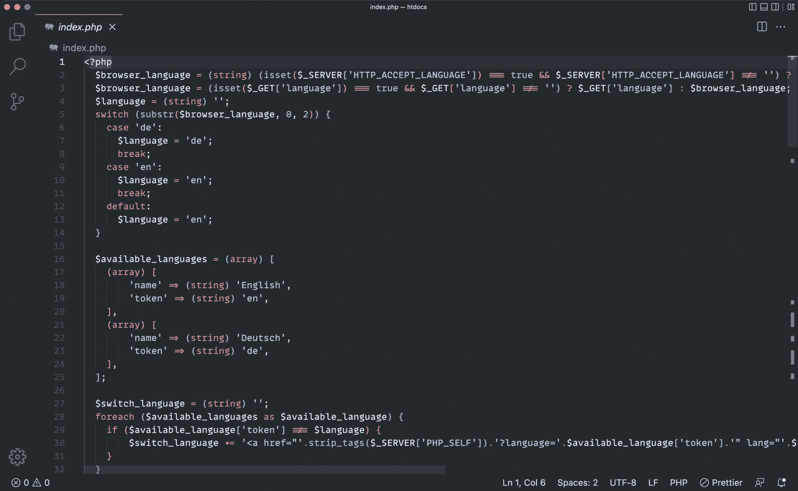

这是生成您在浏览器中看到的“欢迎来到 MAMP”页面的代码。

删除所有内容，替换为:

```
<?php
echo 'Hello World';
?> 
```

保存，在 [http://localhost:8888](http://localhost:8888) 上刷新页面，你应该看到这个:

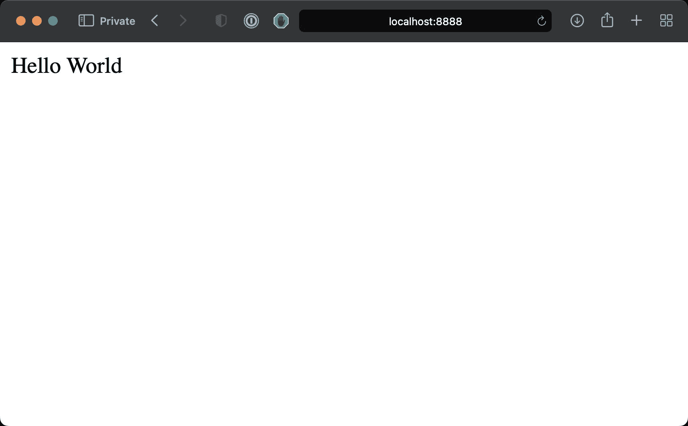

太好了！那是你的第一个 PHP 程序。

让我们解释一下这里发生了什么。

我们让 Apache HTTP 服务器监听本地主机(您的计算机)上的端口`8888`。

当我们用浏览器访问 [http://localhost:8888](http://localhost:8888) 时，我们发出一个 http 请求，请求路由`/`的内容，即基本 URL。

默认情况下，Apache 被配置为为包含在`htdocs`文件夹中的`index.html`文件提供服务。那个文件不存在——但是由于我们已经配置 Apache 使用 PHP，它将搜索一个`index.php`文件。

这个文件存在，在 Apache 将页面发送回浏览器之前，PHP 代码在服务器端执行。

在 PHP 文件中，我们有一个`<?php`开头，写着“这里开始一些 PHP 代码”。

我们有一个结束 PHP 代码片段的结尾`?>`，在它里面，我们使用`echo`指令将包含在引号中的字符串打印到 HTML 中。

每个语句的结尾都需要一个分号。

我们有这种开/闭结构，因为我们可以将 PHP 嵌入 HTML 中。PHP 是一种脚本语言，它的目标是能够用动态数据“装饰”HTML 页面。

注意，对于现代 PHP，我们通常避免将 PHP 混合到 HTML 中。相反，我们使用 PHP 作为“生成 HTML 的框架”——例如使用像 Laravel 这样的工具。但是我们将在本书中讨论*普通 PHP* ，所以从基础开始是有意义的。

例如，类似这样的内容会在浏览器中给出相同的结果:

```
Hello
<?php
echo 'World';
?> 
```

对于最终用户来说，他们看着浏览器，对幕后的代码一无所知，根本没有区别。

从技术上讲，这个页面是一个 HTML 页面，尽管它不包含 HTML 标签，而只是一个`Hello World`字符串。但是浏览器可以知道如何在窗口中显示它。

## PHP 语言基础

在第一个“Hello World”之后，是时候深入了解更多细节的语言功能了。

### 变量如何在 PHP 中工作

PHP 中的变量以美元符号`$`开始，后面是一个标识符，它是一组字母数字字符和下划线`_`字符。

您可以为变量分配任何类型的值，如字符串(使用单引号或双引号定义):

```
$name = 'Flavio';

$name = "Flavio"; 
```

或数字:

```
$age = 20; 
```

或者 PHP 允许的任何其他类型，我们稍后会看到。

一旦一个变量被赋值，例如一个字符串，我们可以给它重新赋值一个不同类型的值，例如一个数字:

```
$name = 3; 
```

PHP 不会抱怨现在类型不一样了。

变量名区分大小写。`$name`与`$Name`不同。

这不是硬性规定，但是一般变量名都是用 camelCase 格式写的，像这样:`$brandOfCar`或者`$ageOfDog`。我们保持首字母小写，后续单词的字母大写。

### 如何用 PHP 写注释

任何编程语言都有一个非常重要的部分，那就是如何编写注释。

用 PHP 编写单行注释的方式如下:

```
// single line comment 
```

多行注释是这样定义的:

```
/*

this is a comment

*/

//or

/*
 *
 * this is a comment
 *
 */

//or to comment out a portion of code inside a line:

/* this is a comment */ 
```

### PHP 中的类型有哪些？

我提到了字符串和数字。

PHP 有以下几种类型:

*   `bool`布尔值(真/假)
*   `int`整数(无小数)
*   `float`浮点数(小数)
*   `string`字符串
*   `array`数组
*   `object`物体
*   `null`表示“未赋值”的值

还有其他一些更先进的。

### 如何在 PHP 中打印变量的值

我们可以使用`var_dump()`内置函数来获取变量的值:

```
$name = 'Flavio';

var_dump($name); 
```

`var_dump($name)`指令将把`string(6) "Flavio"`打印到页面上，这告诉我们变量是一个 6 个字符的字符串。

如果我们使用这个代码:

```
$age = 20;

var_dump($age); 
```

我们会让`int(20)`返回，说值是 20，它是一个整数。

`var_dump()`是 PHP 调试工具带中必不可少的工具之一。

### PHP 中运算符的工作方式

一旦你有了一些变量，你就可以对它们进行操作了:

```
$base = 20;
$height = 10;

$area = $base * $height; 
```

我用来把$base 乘以$height 的`*`就是乘法运算符。

我们有相当多的运营商，所以让我们做一个主要的快速总结。

首先，这里是算术运算符:`+`、`-`、`*`、`/`(除法)、`%`(余数)和`**`(指数)。

我们有赋值操作符`=`，我们已经用它给变量赋值了。

接下来我们有比较操作符，比如`<`、`>`、`<=`、`>=`。这些工作就像数学一样。

```
2 < 1; //false
1 <= 1; // true
1 <= 2; // true 
```

如果两个操作数相等，则返回 true。

如果两个操作数相同，则返回 true。

有什么区别？

有了经验你会发现，但是举个例子:

```
1 == '1'; //true
1 === '1'; //false 
```

我们还有`!=`来检测操作数是否*不*相等:

```
1 != 1; //false
1 != '1'; //false
1 != 2; //true

//hint: <> works in the same way as !=, 1 <> 1 
```

和`!==`来检测操作数是否不相同:

```
1 !== 1; //false
1 !== '1'; //true 
```

逻辑运算符处理布尔值:

```
// Logical AND with && or "and"

true && true; //true
true && false; //false
false && true; //false
false && false; //false

true and true; //true
true and false; //false
false and true; //false
false and false; //false

// Logical OR with || or "or"

true || true; // true
true || false //true
false || true //true
false || false //false

true or true; // true
true or false //true
false or true //true
false or false //false

// Logical XOR (one of the two is true, but not both)

true xor true; // false
true xor false //true
false xor true //true
false xor false //false 
```

我们还有*而不是*运算符:

```
$test = true

!$test //false 
```

我在这里使用了布尔值`true`和`false`，但是在实践中，您将使用计算结果为 true 或 false 的表达式，例如:

```
1 > 2 || 2 > 1; //true

1 !== 2 && 2 > 2; //false 
```

上面列出的所有操作符都是二元的，也就是说它们包含两个操作数。

PHP 还有两个一元运算符:`++`和`--`:

```
$age = 20;
$age++;
//age is now 21

$age--;
//age is now 20 
```

## 如何在 PHP 中使用字符串

当我们讨论变量时，我介绍了字符串的用法，我们用这个符号定义了一个字符串:

```
$name = 'Flavio'; //string defined with single quotes

$name = "Flavio"; //string defined with double quotes 
```

使用单引号和双引号的最大区别在于，使用双引号时，我们可以这样扩展变量:

```
$test = 'an example';

$example = "This is $test"; //This is an example 
```

对于双引号，我们可以使用*转义字符*(想想新行`\n`或制表符`\t`):

```
$example = "This is a line\nThis is a line";

/*
output is:

This is a line
This is a line
*/ 
```

PHP 在其标准库中提供了非常全面的函数(该语言默认提供的函数库)。

首先，我们可以使用`.`操作符连接两个字符串:

```
$firstName = 'Flavio';
$lastName = 'Copes';

$fullName = $firstName . ' ' . $lastName; 
```

我们可以使用`strlen()`函数检查字符串的长度:

```
$name = 'Flavio';
strlen($name); //6 
```

这是我们第一次使用函数。

一个函数由一个标识符(在本例中为`strlen`)后跟括号组成。在这些括号中，我们向函数传递一个或多个参数。在这种情况下，我们有一个论点。

该函数执行*操作*，当操作完成后，它可以返回值。在这种情况下，它返回数字`6`。如果没有返回值，函数返回`null`。

稍后我们将看到如何定义我们自己的函数。

我们可以使用`substr()`获得字符串的一部分:

```
$name = 'Flavio';
substr($name, 3); //"vio" - start at position 3, get all the rest
substr($name, 2, 2); //"av" - start at position 2, get 2 items 
```

我们可以使用`str_replace()`替换字符串的一部分:

```
$name = 'Flavio';
str_replace('avio', 'ower', $name); //"Flower" 
```

当然，我们可以将结果赋给一个新变量:

```
$name = 'Flavio';
$itemObserved = str_replace('avio', 'ower', $name); //"Flower" 
```

还有很多内置函数可以用来处理字符串。

这里有一个简短的不全面的列表，只是为了向您展示可能性:

*   [`trim()`](https://www.php.net/manual/en/function.trim.php) 在一个字符串的开头和结尾剥去空白
*   [`strtoupper()`](https://www.php.net/manual/en/function.strtoupper.php) 使字符串大写
*   [`strtolower()`](https://www.php.net/manual/en/function.strtolower.php) 使字符串小写
*   [`ucfirst()`](https://www.php.net/manual/en/function.ucfirst.php) 使第一个字符大写
*   [`strpos()`](https://www.php.net/manual/en/function.strpos.php) 在字符串中查找第一次出现的子串
*   [`explode()`](https://www.php.net/manual/en/function.explode.php) 将一个字符串拆分成一个数组
*   [`implode()`](https://www.php.net/manual/en/function.implode.php) 将数组元素加入到一个字符串中

你可以在这里找到完整的列表[。](https://www.php.net/manual/en/book.strings.php)

## 如何在 PHP 中为数字使用内置函数

我之前列出了我们常用于字符串的几个函数。

让我们列出我们使用数字的功能:

*   [`round()`](https://www.php.net/manual/en/function.round.php) 对一个小数进行四舍五入，上/下视该值是否为> 0.5 或更小
*   [`ceil()`](https://www.php.net/manual/en/function.ceil.php) 将一个十进制数向上舍入
*   [`floor()`](https://www.php.net/manual/en/function.floor.php) 将小数向下舍入
*   [`rand()`](https://www.php.net/manual/en/function.rand.php) 生成一个随机整数
*   [`min()`](https://www.php.net/manual/en/function.min.php) 查找作为参数传递的数字中最小的数字
*   [`max()`](https://www.php.net/manual/en/function.max.php) 查找作为参数传递的数字中最大的数字
*   [`is_nan()`](https://www.php.net/manual/en/function.is-nan.php) 如果数字不是数字则返回真

有大量不同的函数用于各种数学运算，如正弦、余弦、正切、对数等等。你可以在这里找到完整的列表[。](https://www.php.net/manual/en/book.math.php)

## PHP 中数组的工作原理

数组是在一个公共名称下分组的值的列表。

可以用两种不同的方式定义空数组:

```
$list = [];

$list = array(); 
```

数组可以用值初始化:

```
$list = [1, 2];

$list = array(1, 2); 
```

数组可以保存任何类型的值:

```
$list = [1, 'test']; 
```

甚至其他阵列:

```
$list = [1, [2, 'test']]; 
```

您可以使用以下符号访问数组中的元素:

```
$list = ['a', 'b'];
$list[0]; //'a' --the index starts at 0
$list[1]; //'b' 
```

创建数组后，可以通过以下方式向其追加值:

```
$list = ['a', 'b'];
$list[] = 'c';

/*
$list == [
  "a",
  "b",
  "c",
]
*/ 
```

您可以使用`array_unshift()`将项目添加到数组的开头:

```
$list = ['b', 'c'];
array_unshift($list, 'a');

/*
$list == [
  "a",
  "b",
  "c",
]
*/ 
```

使用内置的`count()`函数计算数组中有多少项:

```
$list = ['a', 'b'];

count($list); //2 
```

使用`in_array()`内置函数检查数组是否包含项目:

```
$list = ['a', 'b'];

in_array('b', $list); //true 
```

如果除了确认存在之外，还需要索引，使用`array_search()`:

```
$list = ['a', 'b'];

array_search('b', $list) //1 
```

### PHP 中对数组有用的函数

与字符串和数字一样，PHP 为数组提供了许多非常有用的函数。我们已经看过了`count()`、`in_array()`、`array_search()`——让我们再看一些:

*   `is_array()`检查变量是否为数组
*   `array_unique()`从数组中删除重复值
*   `array_search()`在数组中搜索一个值并返回键
*   `array_reverse()`反转一个数组
*   使用回调函数将数组缩减为单个值
*   `array_map()`对数组中的每一项应用回调函数。通常用于通过修改现有数组的值来创建新数组，而不改变它。
*   `array_filter()`使用回调函数将数组过滤为单个值
*   `max()`获取数组中包含的最大值
*   `min()`获取数组中包含的最小值
*   `array_rand()`从数组中获取一个随机项
*   `array_count_values()`计算数组中的所有值
*   `implode()`把一个数组变成一个字符串
*   `array_pop()`删除数组的最后一项并返回其值
*   `array_shift()`与`array_pop()`相同，但删除第一项而不是最后一项
*   `sort()`对数组进行排序
*   `rsort()`对数组进行逆序排序
*   `array_walk()`类似于`array_map()`为数组中的每一项做一些事情，但是除此之外，它还可以改变现有数组中的值

### 如何在 PHP 中使用关联数组

到目前为止，我们已经使用了带有增量数字索引的数组:0，1，2…

还可以使用带有命名索引(键)的数组，我们称之为关联数组:

```
$list = ['first' => 'a', 'second' => 'b'];

$list['first'] //'a'
$list['second'] //'b' 
```

我们有一些对关联数组特别有用的函数:

*   `array_key_exists()`检查数组中是否存在关键字
*   从数组中获取所有的键
*   `array_values()`从数组中获取所有的值
*   `asort()`按值对关联数组进行排序
*   `arsort()`按值降序排列关联数组
*   `ksort()`按键对关联数组进行排序
*   `krsort()`按键降序排列关联数组

在这里可以看到所有与数组相关的函数[。](https://www.php.net/manual/en/ref.array.php)

## PHP 中条件如何工作

我之前介绍过比较运算符:`<`、`>`、`<=`、`>=`、`===`、`!=`、`!==`...诸如此类。

这些操作符在一件事上会非常有用:**条件**。

条件句是我们看到的第一个控制结构。

基于比较，我们可以决定做某事，或做其他事情。

例如:

```
$age = 17;

if ($age > 18) {
  echo 'You can enter the pub';
} 
```

括号内的代码仅在条件评估为`true`时执行。

在条件为`false`的情况下，使用`else`做*之外的事情*:

```
$age = 17;

if ($age > 18) {
  echo 'You can enter the pub';
} else {
  echo 'You cannot enter the pub';
} 
```

注意:我使用了`cannot`而不是`can't`,因为单引号会提前终止我的字符串。在这种情况下，你可以这样逃离`'`:`echo 'You can\'t enter the pub';`

您可以使用`elseif`链接多个`if`语句:

```
$age = 17;

if ($age > 20) {
  echo 'You are 20+';
} elseif ($age > 18) {
  echo 'You are 18+';
} else {
  echo 'You are <18';
} 
```

除了`if`，我们还有`switch`语句。

当我们有一个可能有几个不同值的变量时，我们使用这个，并且我们不需要有一个长的 if / elseif 块:

```
$age = 17

switch($age) {
  case 15:
		echo 'You are 15';
    break;
  case 16:
		echo 'You are 16';
    break;
  case 17:
		echo 'You are 17';
    break;
  case 18:
		echo 'You are 18';
    break;
  default:
    echo "You are $age";
} 
```

我知道这个例子没有任何逻辑，但我认为它可以帮助你理解`switch`是如何工作的。

每个案例后的`break;`陈述是必不可少的。如果你不加这个，年龄是 17 岁，你会看到这个:

```
You are 17
You are 18
You are 17 
```

不仅仅是这个:

```
You are 17 
```

如你所料。

## PHP 中的循环是如何工作的

循环是另一个非常有用的控制结构。

PHP 中有几种不同的循环:`while`、`do while`、`for`和`foreach`。

都来看看吧！

### 如何在 PHP 中使用`while`循环

一个`while`循环是最简单的。当条件评估为`true`时，它继续迭代:

```
while (true) {
  echo 'looping';
} 
```

这将是一个无限循环，这就是为什么我们使用变量和比较:

```
$counter = 0;

while ($counter < 10) {
  echo $counter;
  $counter++;
} 
```

### 如何在 PHP 中使用`do while`循环

`do while`是相似的，但是在如何执行第一次迭代上略有不同:

```
$counter = 0;

do {
  echo $counter;
  $counter++;
} while ($counter < 10); 
```

在`do while`循环中，首先我们进行第一次迭代，*然后*我们检查条件。

在`while`循环中，*首先*我们检查条件，然后我们进行迭代。

通过在上面的例子中将`$counter`设置为 15 来做一个简单的测试，看看会发生什么。

根据您的用例，您可能希望选择一种循环，或者另一种。

### 如何在 PHP 中使用`foreach`循环

您可以使用`foreach`循环轻松地迭代数组:

```
$list = ['a', 'b', 'c'];

foreach ($list as $value) {
  echo $value;
} 
```

您还可以通过以下方式获取索引(或关联数组中的键)的值:

```
$list = ['a', 'b', 'c'];

foreach ($list as $key => $value) {
  echo $key;
} 
```

### 如何在 PHP 中使用`for`循环

`for`循环类似于 while，但不是在循环前定义条件变量，也不是手动增加索引变量，而是在第一行完成:

```
for ($i = 0; $i < 10; $i++) {
  echo $i;
}

//result: 0123456789 
```

您可以使用 for 循环以这种方式迭代数组:

```
$list = ['a', 'b', 'c'];

for ($i = 0; $i < count($list); $i++) {
  echo $list[$i];
}

//result: abc 
```

### 如何在 PHP 中使用`break`和`continue`语句

在许多情况下，您需要按需停止循环的能力。

例如，当数组中的变量值为`'b'`时，您想要停止一个`for`循环:

```
$list = ['a', 'b', 'c'];

for ($i = 0; $i < count($list); $i++) {
	if ($list[$i] == 'b') {
    break;
  }
  echo $list[$i];
}

//result: a 
```

这使得循环在该点完全停止，程序在循环后的下一条指令处继续执行。

如果您只想跳过当前的循环迭代并继续查找，请使用`continue`来代替:

```
$list = ['a', 'b', 'c'];

for ($i = 0; $i < count($list); $i++) {
	if ($list[$i] == 'b') {
    continue;
  }
  echo $list[$i];
}

//result: ac 
```

## 函数如何在 PHP 中工作

函数是编程中最重要的概念之一。

您可以使用函数将多条指令或多行代码组合在一起，并给它们命名。

例如，您可以创建一个发送电子邮件的功能。姑且称之为`sendEmail`，我们这样定义:

```
function sendEmail() {
  //send an email
} 
```

您可以使用以下语法在任何地方将它称为 T1:

```
sendEmail(); 
```

您也可以将参数传递给函数。例如，当您发送一封电子邮件时，您想将它发送给某人，因此您将电子邮件添加为第一个参数:

```
sendEmail('test@test.com'); 
```

在函数定义中，我们以这种方式得到这个参数(在函数定义中我们称它们为*参数*，在调用函数时我们称它们为*参数*):

```
function sendEmail($to) {
  echo "send an email to $to";
} 
```

您可以发送多个参数，用逗号分隔它们:

```
sendEmail('test@test.com', 'subject', 'body of the email'); 
```

我们可以按照定义的顺序获取这些参数:

```
function sendEmail($to, $subject, $body) {
  //...
} 
```

我们可以**可选地**设置参数的类型:

```
function sendEmail(string $to, string $subject, string $body) {
  //...
} 
```

参数可以有一个缺省值，所以如果它们被省略，我们仍然可以为它们设置一个值:

```
function sendEmail($to, $subject = 'test', $body = 'test') {
  //...
}

sendEmail('test@test.com') 
```

函数可以返回值。一个函数只能返回一个值，不能超过一个。你可以使用关键字`return`来实现。如果省略，函数返回`null`。

返回值非常有用，因为它告诉您在函数中完成的工作的结果，并让您在调用它之后使用它的结果:

```
function sendEmail($to) {
	return true;
}

$success = sendEmail('test@test.com');

if ($success) {
  echo 'email sent successfully';
} else {
  echo 'error sending the email';
} 
```

我们可以**可选地**使用以下语法设置函数的返回类型:

```
function sendEmail($to): bool {
	return true;
} 
```

当你在一个函数中定义一个变量时，这个变量对于这个函数来说是局部的，这意味着从外面看不到它。当函数结束时，它就停止存在:

```
function sendEmail($to) {
	$test = 'a';
}

var_dump($test); //PHP Warning:  Undefined variable $test 
```

函数外部定义的变量在函数内部**不**可访问。

这加强了良好的编程实践，因为我们可以确保函数不会修改外部变量并导致“副作用”。

相反，您从函数返回一个值，调用该函数的外部代码将负责更新外部变量。

像这样:

```
$character = 'a';

function test() {
  return 'b';
}

$character = test(); 
```

您可以通过将变量值作为参数传递给函数来传递变量值:

```
$character = 'a';

function test($c) {
  echo $c;
}

test($character); 
```

但是您不能从函数内部修改该值。

它是由值传递的**，这意味着函数接收的是它的副本，而不是对原始变量的引用。**

使用这种语法仍然是可能的(注意我在参数定义中使用了`&`):

```
$character = 'a';

function test(&$c) {
  $c = 'b';
}

test($character);

echo $character; //'b' 
```

到目前为止，我们定义的函数是**命名函数**。

他们有名字。

我们还有**匿名函数**，这在很多情况下都很有用。

它们本身没有名字，但是它们被赋给了一个变量。要调用它们，可以调用末尾带括号的变量:

```
$myfunction = function() {
  //do something here
};

$myfunction() 
```

注意，在函数定义后面需要一个分号，但是它们就像命名函数一样用于返回值和参数。

有趣的是，它们提供了一种通过`use()`访问函数外部定义的变量的方法:

```
$test = 'test';

$myfunction = function() use ($test) {
  echo $test;
  return 'ok';
};

$myfunction() 
```

另一种功能是箭头功能。

arrow 函数是一个匿名函数，只有一个表达式(一行)，隐式返回该表达式的值。

您可以这样定义它:

```
fn (arguments) => expression; 
```

这里有一个例子:

```
$printTest = fn() => 'test';

$printTest(); //'test' 
```

您可以将参数传递给箭头函数:

```
$multiply = fn($a, $b) => $a * $b;

$multiply(2, 4) //8 
```

注意，如下一个例子所示，arrow 函数可以自动访问封闭范围的变量，而不需要使用`use()`。

```
$a = 2;
$b = 4;

$multiply = fn() => $a * $b;

$multiply() 
```

当你需要传递一个回调函数时，箭头函数非常有用。稍后我们将看到如何使用它们来执行一些数组操作。

所以我们总共有三种函数:**命名函数**、**匿名函数**和**箭头函数**。

它们都有自己的位置，随着时间的推移，通过练习，你会学会如何正确使用它们。

## 如何在 PHP 中使用`map()`、`filter()`和`reduce()`循环数组

另一组重要的循环结构是`array_map()` / `array_filter()` / `array_reduce()`，常用于函数式编程。

这 3 个内置 PHP 函数接受一个数组和一个回调函数，回调函数在每次迭代中接受数组中的每一项。

`array_map()`返回一个新数组，该数组包含对数组中的每一项运行回调函数的结果:

```
$numbers = [1, 2, 3, 4];
$doubles = array_map(fn($value) => $value * 2, $numbers);

//$doubles is now [2, 4, 6, 8] 
```

`array_filter()`只获取回调函数返回`true`的项，生成一个新数组:

```
$numbers = [1, 2, 3, 4];
$even = array_filter($numbers, fn($value) => $value % 2 === 0)

//$even is now [2, 4] 
```

`array_reduce()`用于*将*一个数组缩减为单个值。

例如，我们可以用它将数组中的所有元素相乘:

```
$numbers = [1, 2, 3, 4];

$result = array_reduce($numbers, fn($carry, $value) => $carry * $value, 1) 
```

注意最后一个参数——它是初始值。如果你忽略它，缺省值是`0`,但是这对于我们的乘法例子来说是不可行的。

注意在`array_map()`中，参数的顺序是相反的。首先是回调函数，然后是数组。这是因为我们可以使用逗号(`array_map(fn($value) => $value * 2, $numbers, $otherNumbers, $anotherArray);`)传递多个数组。理想情况下，我们希望有更多的一致性，但事实就是如此。

## PHP 中的面向对象编程

现在让我们先进入一个大主题:用 PHP 进行面向对象编程。

面向对象编程允许您创建有用的抽象，并使您的代码更易于理解和管理。

### 如何在 PHP 中使用类和对象

首先，你有类和对象。

类是对象的蓝图或类型。

例如，您有这样定义的类`Dog`:

```
class Dog {

} 
```

请注意，该类必须用大写字母定义。

然后你可以从这个类中创建对象——特定的，单独的狗。

一个对象被赋给一个变量，并使用`new Classname()`语法实例化它:

```
$roger = new Dog(); 
```

通过将每个对象分配给不同的变量，可以从同一个类创建多个对象:

```
$roger = new Dog();
$syd = new Dog(); 
```

### 如何在 PHP 中使用属性

这些对象将共享由该类定义的相同特征。但是一旦它们被实例化，它们就会有自己的生命。

例如，一只狗有名字、年龄和毛色。

所以我们可以将它们定义为类中的属性:

```
class Dog {
  public $name;
  public $age;
  public $color;
} 
```

它们像变量一样工作，但是一旦从类中实例化，它们就附加到对象上。`public`关键字是*访问修饰符*，并将属性设置为可公开访问。

您可以通过以下方式为这些属性赋值:

```
class Dog {
  public $name;
  public $age;
  public $color;
}

$roger = new Dog();

$roger->name = 'Roger';
$roger->age = 10;
$roger->color = 'gray';

var_dump($roger);

/*
object(Dog)#1 (3) {
  ["name"]=> string(5) "Roger"
	["age"]=> int(10)
	["color"]=> string(4) "gray"
}
*/ 
```

注意，该属性被定义为`public`。

这被称为访问修饰符。您可以使用另外两种访问修饰符:`private`和`protected`。Private 使该属性无法从对象外部访问。只有在对象内部定义的方法才能访问它。

当我们谈到继承时，我们会看到更多关于受保护的内容。

### 如何在 PHP 中使用方法

我说方法了吗？什么是方法？

方法是在类内部定义的函数，它是这样定义的:

```
class Dog {
  public function bark() {
    echo 'woof!';
  }
} 
```

方法对于将行为附加到对象非常有用。在这种情况下，我们可以让狗叫。

注意，我使用了`public`关键字。也就是说，你可以从类外部调用一个方法。与属性一样，您也可以将方法标记为`private`或`protected`，以限制对它们的访问。

像这样调用对象实例上的方法:

```
class Dog {
  public function bark() {
    echo 'woof!';
  }
}

$roger = new Dog();

$roger->bark(); 
```

就像函数一样，方法也可以定义参数和返回值。

在方法内部，我们可以使用特殊的内置`$this`变量来访问对象的属性，当在方法内部引用该变量时，它指向当前的对象实例:

```
class Dog {
  public $name;

  public function bark() {
    echo $this->name . ' barked!';
  }
}

$roger = new Dog();
$roger->name = 'Roger';
$roger->bark(); 
```

注意我使用了`$this->name`来设置和访问`$name`属性，而不是`$this->$name`。

### 如何在 PHP 中使用构造函数方法

一种叫做`__construct()`的特殊方法叫做**构造器**。

```
class Dog {
	public function __construct() {

  }
} 
```

当你创建一个对象时，你使用这个方法来初始化它的属性，因为它在调用`new Classname()`时被自动调用。

```
class Dog {
  public $name;

	public function __construct($name) {
		$this->name = $name;
  }

  public function bark() {
    echo $this->name . ' barked!';
  }
}

$roger = new Dog('Roger');
$roger->bark(); 
```

这是一件很常见的事情，以至于 PHP(从 PHP 8 开始)包含了一个叫做**构造函数提升**的东西，它会自动做这件事:

```
class Dog {
  public $name;

	public function __construct($name) {
		$this->name = $name;
  }

  //... 
```

通过使用访问修饰符，从构造函数的参数到局部变量的赋值自动发生:

```
class Dog {
	public function __construct(public $name) {
  }

  public function bark() {
    echo $this->name . ' barked!';
  }
}

$roger = new Dog('Roger');
$roger->name; //'Roger'
$roger->bark(); //'Roger barked!' 
```

属性可以是**类型的**。

您可以使用`public string $name`要求名称是一个字符串:

```
class Dog {
  public string $name;

	public function __construct($name) {
		$this->name = $name;
  }

  public function bark() {
    echo $this->name . ' barked!';
  }
}

$roger = new Dog('Roger');
$roger->name; //'Roger'
$roger->bark(); //'Roger barked!' 
```

现在在这个例子中一切正常，但是试着把它改为`public int $name`，要求它是一个整数。

如果你用一个字符串初始化`$name`, PHP 将产生一个错误:

```
TypeError: Dog::__construct():
Argument #1 ($name) must be of type int,
string given on line 14 
```

很有趣，对吧？

我们可以强制属性在`string`、`int`、`float`、`string`、`object`、`array`、`bool`和【T7 其他之间具有特定的类型。

### PHP 中的继承是什么？

当我们允许类从其他类继承属性和方法时，面向对象编程的乐趣就开始了。

假设您有一个`Animal`类:

```
class Animal {

} 
```

每种动物都有年龄，每种动物都可以吃东西。所以我们添加了一个`age`属性和一个`eat()`方法:

```
class Animal {
  public $age;

  public function eat() {
    echo 'the animal is eating';
  }
} 
```

狗是一种动物，有年龄，也能吃东西，所以`Dog`类——而不是重新实现我们在`Animal`中拥有的东西——可以扩展那个类:

```
class Dog extends Animal {

} 
```

我们现在可以实例化一个类为`Dog`的新对象，并且我们可以访问在`Animal`中定义的属性和方法:

```
$roger = new Dog();
$roger->eat(); 
```

在这种情况下，我们称狗为**子类**，称动物为**父类**。

在子类中，我们可以使用`$this`来引用父类中定义的任何属性或方法，就好像它们是在子类中定义的一样。

值得注意的是，虽然我们可以从子节点访问父节点的属性和方法，但我们不能反过来。

父类对子类一无所知。

### `protected`PHP 中的属性和方法

既然我们已经介绍了继承，我们可以讨论一下`protected`。我们已经看到了如何使用`public`访问修饰符来设置属性和方法，这些属性和方法可以被*公众从类的外部调用。*

属性和方法只能从类内部访问。

属性和方法可以从类内部和子类中访问。

### 如何在 PHP 中覆盖方法

如果我们在`Animal`中有一个`eat()`方法，并且我们想在`Dog`中定制它，会发生什么？我们可以用 T3 取代 T4 的方法。

```
class Animal {
  public $age;

  public function eat() {
    echo 'the animal is eating';
  }
}

class Dog extends Animal {
  public function eat() {
    echo 'the dog is eating';
  }
} 
```

现在，`Dog`的任何实例都将使用`Dog`的`eat()`方法的实现。

### PHP 中的静态属性和方法

我们已经看到了如何定义属于类的实例**的属性和方法。**

有时将它们分配给类本身是有用的。

当这种情况发生时，我们称它们为 **static** ，为了引用或调用它们，我们不需要从类中创建一个对象。

让我们从静态属性开始。我们用关键字`static`来定义它们:

```
class Utils {
  public static $version = '1.0';
} 
```

我们使用关键字`self`从类内部引用它们，关键字指向类:

```
self::$version; 
```

在课堂外使用:

```
 Utils::version 
```

这是静态方法的情况:

```
class Utils {
  public static function version() {
    return '1.0';
  }
} 
```

在类的外部，我们可以这样称呼它们:

```
Utils::version(); 
```

在类内部，我们可以使用关键字`self`引用它们，该关键字引用当前的类:

```
self::version(); 
```

### 如何在 PHP 中比较对象

当我们谈到我提到的操作符时，我们用`==`操作符来检查两个值是否相等，用`===`来检查它们是否相同。

主要区别是`==`检查对象内容，比如`'5'`字符串等于数字`5`，但不完全相同。

当我们使用这些操作符来比较对象时，`==`将检查这两个对象是否具有相同的类和相同的赋值。

`===`另一方面会检查它们是否也引用同一个实例(对象)。

例如:

```
class Dog {
  public $name = 'Good dog';
}

$roger = new Dog();
$syd = new Dog();

echo $roger == $syd; //true

echo $roger === $syd; //false 
```

### 如何在 PHP 中迭代对象属性

您可以使用`foreach`循环遍历对象中的所有公共属性，如下所示:

```
class Dog {
  public $name = 'Good dog';
  public $age = 10;
  public $color = 'gray';
}

$dog = new Dog();

foreach ($dog as $key => $value) {
  echo $key . ': ' . $value . '<br>';
} 
```

### 如何在 PHP 中克隆对象

当您拥有一个对象时，您可以使用`clone`关键字克隆它:

```
class Dog {
  public $name;
}

$roger = new Dog();
$roger->name = 'Roger';

$syd = clone $roger; 
```

这执行了一个*浅层克隆*，这意味着对其他变量的引用将作为引用被复制——不会有对它们的“递归克隆”。

要进行深度克隆，你需要做更多的工作。

### PHP 中有哪些神奇的方法？

魔法方法是我们在类中定义的特殊方法，用于在特殊情况发生时执行某些行为。

例如当属性被设置或访问时，或者当对象被克隆时。

我们以前看过`__construct()`。

那是一种神奇的方法。

还有其他人。例如，我们可以在克隆对象时将“克隆的”布尔属性设置为 true:

```
class Dog {
  public $name;

  public function __clone() {
    $this->cloned = true;
  }
}

$roger = new Dog();
$roger->name = 'Roger';

$syd = clone $roger;
echo $syd->cloned; 
```

其他魔法方法还有`__call()`、`__get()`、`__set()`、`__isset()`、`__toString()`等。

你可以在这里看到完整的列表

## 如何包含其他 PHP 文件

我们现在已经讨论完了 PHP 的面向对象特性。

现在让我们探索一些其他有趣的话题！

在一个 PHP 文件中，你可以包含其他 PHP 文件。我们有以下方法，都用于这个用例，但它们都略有不同:`include`、`include_once`、`require`和`require_once`。

使用相对路径加载另一个 PHP 文件的内容。

做同样的事情，但是如果这样做有任何错误，程序就会停止。`include`只会产生一个警告。

您可以根据您的用例决定使用其中的一种。如果您希望程序在无法导入文件时退出，请使用`require`。

`include_once`和`require_once`与没有`_once`的对应函数做同样的事情，但是它们确保文件在程序执行期间只被包含/需要一次。

例如，如果您有多个文件加载其他文件，并且您通常希望避免多次加载这些文件，这将非常有用。

我的经验是永远不要使用`include`或`require`，因为你可能会两次加载同一个文件。`include_once`和`require_once`帮你避免这个问题。

当您想要有条件地加载一个文件时，使用`include_once`，例如“加载这个文件而不是那个”。在所有其他情况下，使用`require_once`。

这里有一个例子:

```
require_once('test.php');

//now we have access to the functions, classes
//and variables defined in the `test.php` file 
```

上面的语法包括当前文件夹中的`test.php`文件，这个文件就是这段代码所在的位置。

您可以使用相对路径:

```
require_once('../test.php'); 
```

要将文件包含在父文件夹中或放入子文件夹:

```
require_once('test/test.php'); 
```

您可以使用绝对路径:

```
require_once('/var/www/test/file.php'); 
```

在使用框架的现代 PHP 代码库中，文件通常是自动加载的，所以你不太需要使用上面的函数。

## PHP 中文件系统的有用常量、函数和变量

说到路径，PHP 为您提供了几个实用程序来帮助您处理路径。

您可以使用以下命令获取当前文件的完整路径:

*   `__FILE__`，一个*魔法常数*
*   `$_SERVER['SCRIPT_FILENAME']`(稍后更上`$_SERVER`！)

您可以获得当前文件正在使用的文件夹的完整路径:

*   [`getcwd()`](https://www.php.net/manual/en/function.getcwd.php) 内置函数
*   `__DIR__`，另一个魔法常数
*   结合`__FILE__`和`dirname()`得到当前文件夹的完整路径:`dirname(__FILE__)`
*   使用`$_SERVER['DOCUMENT_ROOT']`

## 如何处理 PHP 中的错误

每个程序员都会犯错。毕竟，我们是人类。

我们可能会忘记分号。或者使用错误的变量名。或将错误的参数传递给函数。

在 PHP 中，我们有:

*   警告信息
*   注意
*   错误

前两个是小错误，它们不会停止程序的执行。PHP 会打印一条消息，就这样。

错误会终止程序的执行，并会打印一条消息告诉您原因。

有许多不同种类的错误，像解析错误、运行时致命错误、启动致命错误等等。

都是错误。

我说“PHP 将打印一条消息”，但是..在哪里？

这取决于您的配置。

在开发模式下，将 PHP 错误直接记录到网页中是很常见的，但也有错误日志。

您*希望*尽早看到这些错误，这样您就可以修复它们。

另一方面，在生产中，您不想在网页中显示它们，但是您仍然希望了解它们。

那你是做什么的？您将它们记录到错误日志中。

这都是 PHP 配置决定的。

我们还没有谈到这一点，但是在你的服务器配置中有一个文件，它决定了 PHP 如何运行的许多事情。

叫`php.ini`。

该文件的确切位置取决于您的设置。

要找出您的在哪里，最简单的方法是将它添加到一个 PHP 文件中，并在您的浏览器中运行它:

```
<?php
phpinfo();
?> 
```

然后，您将在“加载的配置文件”下看到该位置:

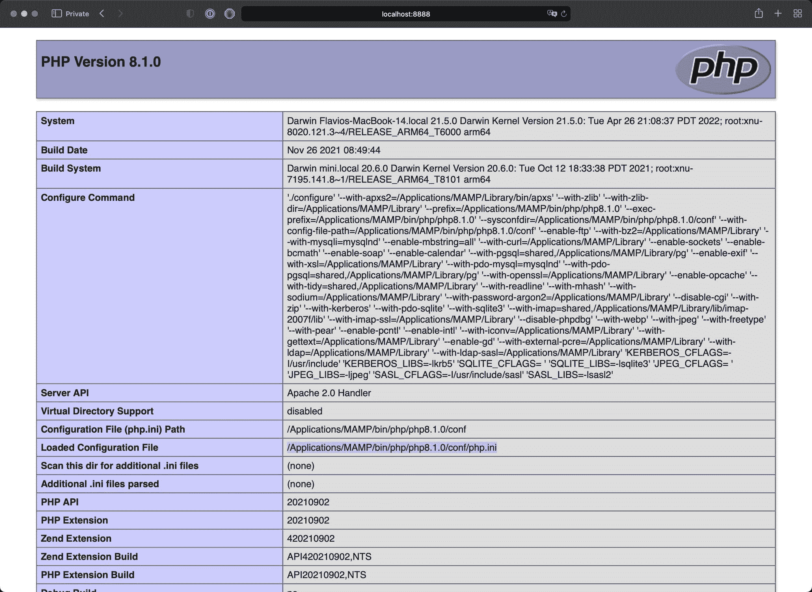

我的情况是`/Applications/MAMP/bin/php/php8.1.0/conf/php.ini`。

注意，`phpinfo()`生成的信息包含许多其他有用的信息。记住这一点。

使用 MAMP 你可以打开 MAMP 应用文件夹并打开`bin/php`。进入您特定的 PHP 版本(在我的例子中是 8.1.0)，然后进入`conf`。在那里你会找到`php.ini`文件:

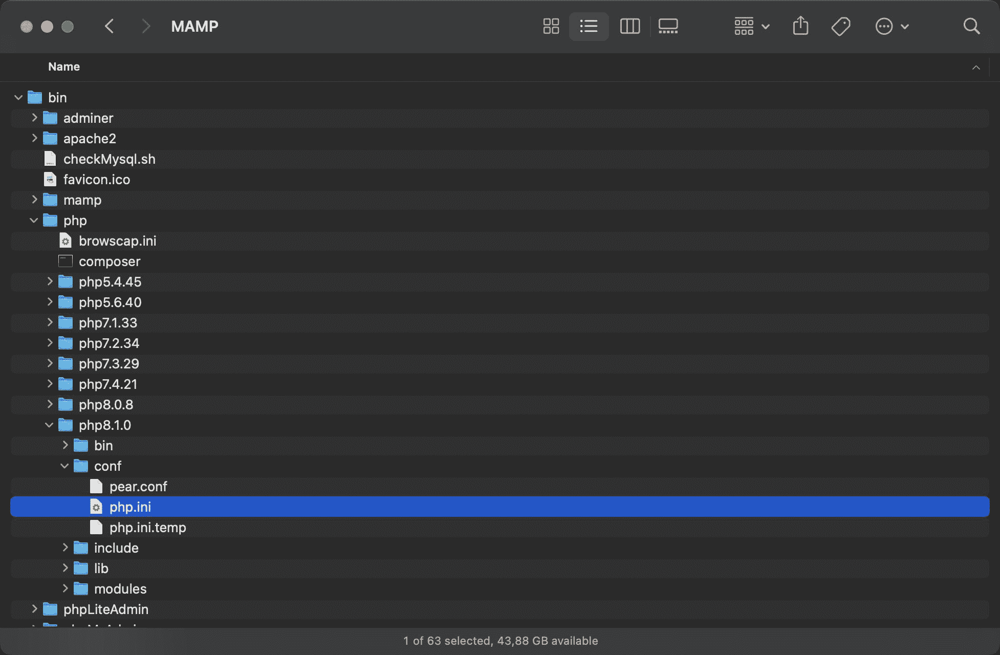

在编辑器中打开该文件。

它包含了一个很长的设置列表，每个设置都有很棒的内联文档。

我们对`display_errors`特别感兴趣:

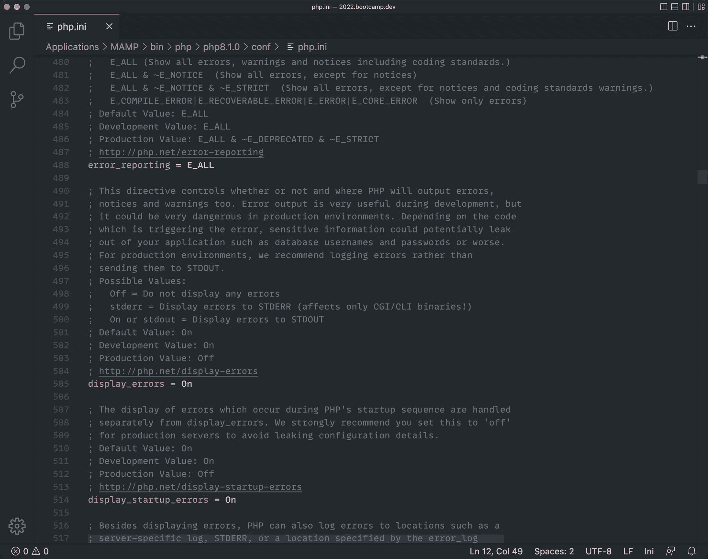

正如上面的文档所说，在生产中，您希望它的值是`Off`。

这些错误将不再显示在网站上，但在这种情况下，您会在 MAMP 的`logs`文件夹中的`php_error.log`文件中看到它们:

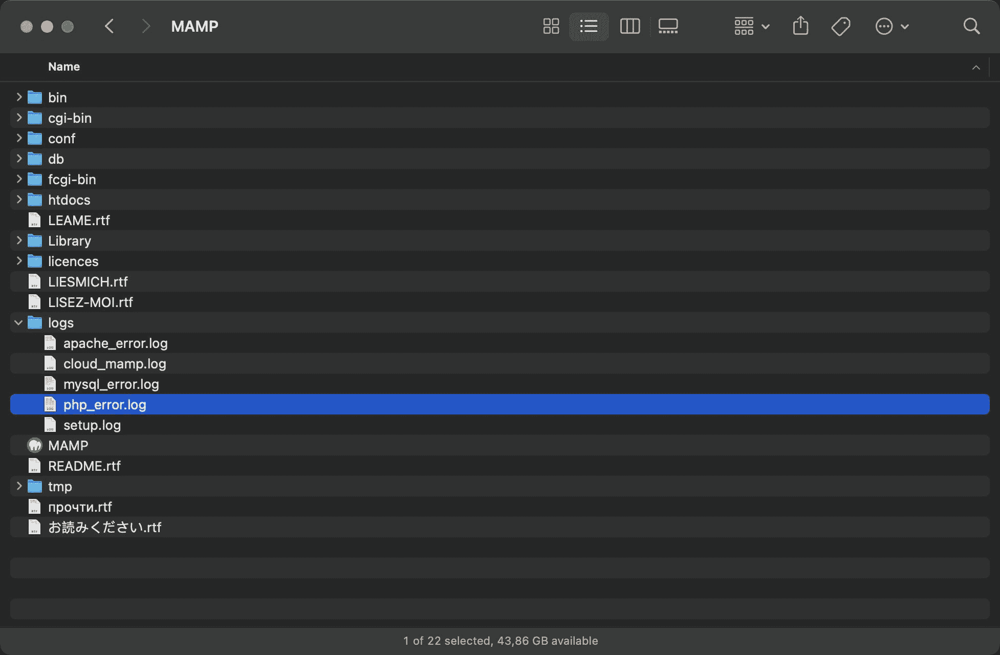

根据您的设置，该文件将位于不同的文件夹中。

您在`php.ini`中设置此位置:

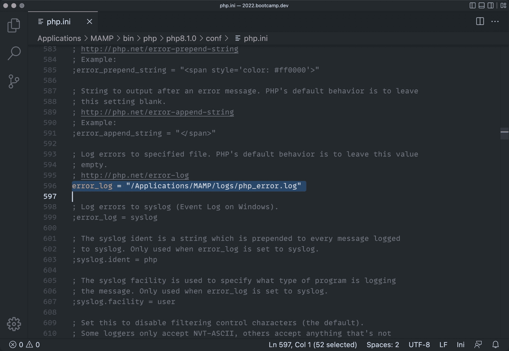

错误日志将包含应用程序生成的所有错误消息:


您可以使用 [`error_log()`](https://www.php.net/manual/en/function.error-log.php) 功能将信息添加到错误日志中:

```
error_log('test'); 
```

使用日志服务来处理错误是很常见的，比如[独白](https://github.com/Seldaek/monolog)。

## 如何在 PHP 中处理异常

有时错误是不可避免的。比如发生了完全不可预测的事情。

但是很多时候，我们可以提前考虑，编写可以拦截错误的代码，并在这种情况发生时做一些明智的事情。比如向用户显示有用的错误消息，或者尝试变通方法。

我们使用**异常**来实现。

异常是用来让我们这些开发者意识到一个问题的。

我们将一些可能引发异常的代码封装到一个`try`块中，然后紧接着是一个`catch`块。如果 try 块中有异常，将执行 catch 块:

```
try {
  //do something
} catch (Throwable $e) {
  //we can do something here if an exception happens
} 
```

注意，我们有一个`Exception`对象`$e`被传递给了`catch`块，我们可以检查该对象以获得关于异常的更多信息，如下所示:

```
try {
  //do something
} catch (Throwable $e) {
  echo $e->getMessage();
} 
```

让我们看一个例子。

假设我错误地将一个数除以零:

```
echo 1 / 0; 
```

这将触发一个致命错误，程序将在该行暂停:

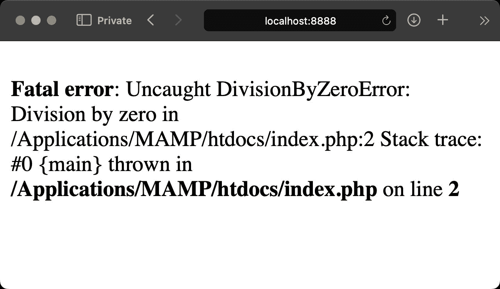

将操作包装在 try 块中，并在 catch 块中打印错误消息，程序成功结束，告诉我问题:

```
try {
  echo 1 / 0;
} catch (Throwable $e) {
  echo $e->getMessage();
} 
```


当然，这是一个简单的例子，但你可以看到好处:我可以拦截问题。

每个异常都有不同的类。例如，我们可以将此捕获为 [`DivisionByZeroError`](https://www.php.net/manual/en/class.divisionbyzeroerror.php) ，这让我可以过滤可能的问题，并以不同的方式处理它们。

我可以在结尾对任何可抛出的错误进行概括，就像这样:

```
try {
  echo 1 / 0;
} catch (DivisionByZeroError $e) {
  echo 'Ooops I divided by zero!';
} catch (Throwable $e) {
  echo $e->getMessage();
} 
```

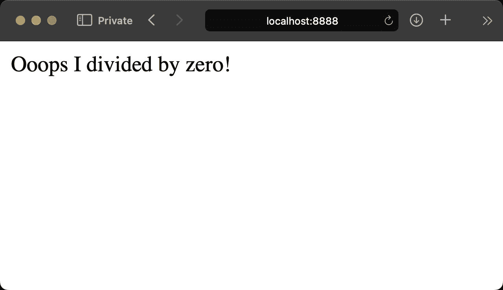

我还可以在这个 try/catch 结构的末尾添加一个`finally {}`块，以便在代码成功执行而没有问题，或者出现了一个 *catch* 之后执行一些代码:

```
try {
  echo 1 / 0;
} catch (DivisionByZeroError $e) {
  echo 'Ooops I divided by zero!';
} catch (Throwable $e) {
  echo $e->getMessage();
} finally {
  echo ' ...done!';
} 
```

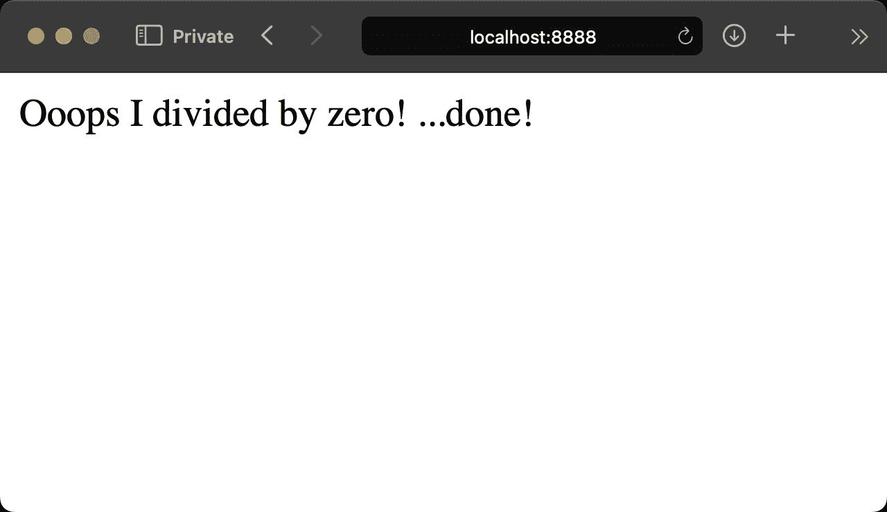

您可以使用 PHP 提供的[内置异常](https://www.php.net/manual/en/reserved.exceptions.php)，但是您也可以创建自己的异常。

## 如何在 PHP 中处理日期

在编程中，处理日期和时间是很常见的。让我们看看 PHP 提供了什么。

我们可以使用 [`time()`](https://www.php.net/manual/en/function.time.php) 获得当前时间戳(自 1970 年 1 月 1 日 00:00:00 GMT 以来的秒数):

```
$timestamp = time(); 
```

当您有时间戳时，您可以使用 [`date()`](https://www.php.net/manual/en/function.date.php) 以您喜欢的格式将其格式化为日期:

```
echo date('Y-m-d', $timestamp); 
```

`Y`是年份的 4 位数表示，`m`是月份号(带前导零)，`d`是一个月中的第几天，带前导零。

在此查看[可用于格式化日期的完整字符列表。](https://www.php.net/manual/en/datetime.format.php)

我们可以使用 [`strtotime()`](https://www.php.net/manual/en/function.strtotime.php) 将任何日期转换成时间戳，它接受一个带有日期文本表示的字符串，并将其转换成自 1970 年 1 月 1 日以来的秒数:

```
echo strtotime('now');
echo strtotime('4 May 2020');
echo strtotime('+1 day');
echo strtotime('+1 month');
echo strtotime('last Sunday'); 
```

...它非常灵活。

对于日期，通常使用提供比语言更多功能的库。一个很好的选择是[碳](https://carbon.nesbot.com)。

## 如何在 PHP 中使用常量和枚举

我们可以使用`define()`内置函数在 PHP 中定义常量:

```
define('TEST', 'some value'); 
```

然后我们可以使用`TEST`,就像它是一个变量，但是没有`$`符号:

```
define('TEST', 'some value');

echo TEST; 
```

我们使用大写标识符作为常量的约定。

有趣的是，在类内部，我们可以使用`const`关键字定义常量属性:

```
class Dog {
  const BREED = 'Siberian Husky';
} 
```

默认情况下，它们是`public`，但我们可以将它们标记为`private`或`protected`:

```
class Dog {
  private const BREED = 'Siberian Husky';
} 
```

枚举允许您将常量分组到一个公共的“根”下。例如，您希望有一个包含三种状态的`Status`枚举:`EATING` `SLEEPING` `RUNNING`，这是一个狗日的三种状态。

所以你有:

```
enum Status {
  case EATING;
  case SLEEPING;
  case RUNNING;
} 
```

现在我们可以这样引用这些常量:

```
class Dog {
  public Status $status;
}

$dog = new Dog();

$dog->status = Status::RUNNING;

if ($dog->status == Status::SLEEPING) {
  //...
} 
```

枚举是对象，它们可以有方法和比我们在这个简短的介绍中能得到的更多的特性。

## 如何使用 PHP 作为 Web App 开发平台

PHP 是一种服务器端语言，通常有两种用途。

一种是在 HTML 页面中，因此 PHP 被用来向 HTML“添加”内容，这些内容是在`.php`文件中手动定义的。这是使用 PHP 的完美方式。

另一种方式认为 PHP 更像是负责生成“应用程序”的引擎。你不用在一个`.php`文件中编写 HTML，而是使用一种模板语言来生成 HTML，一切都由我们称之为**框架**来管理。

当你使用像 Laravel 这样的现代框架时，就会发生这种情况。

我认为第一种方式现在有点“过时”了，如果你刚刚开始，你应该知道这两种不同的使用 PHP 的方式。

但是也要考虑使用像“easy mode”这样的框架，因为框架为您提供了处理路由的工具、从数据库访问数据的工具，并且它们使构建更安全的应用程序变得更加容易。他们使开发速度更快。

也就是说，我们不会在这本手册中讨论框架的使用。但是我将谈论 PHP 的基本的、基本的构建模块。它们是任何 PHP 开发人员都必须知道的基本要素。

要知道“在现实世界中”你可能会使用你最喜欢的框架的做事方式，而不是 PHP 提供的底层特性。

当然，这不仅仅适用于 PHP 这是任何编程语言都会出现的“问题”。

### 如何在 PHP 中处理 HTTP 请求

让我们从处理 HTTP 请求开始。

PHP 默认提供基于文件的路由。您创建一个`index.php`文件，它在`/`路径上响应。

我们在一开始制作 Hello World 示例时就看到了这一点。

类似地，您可以创建一个`test.php`文件，它将自动成为 Apache 在`/test`路径上提供的文件。

### PHP 中如何使用`$_GET`、`$_POST`、`$_REQUEST`

文件响应所有 HTTP 请求，包括 GET、POST 和其他动词。

对于任何请求，您都可以使用`$_GET`对象访问所有查询字符串数据。它叫做*超全局*，在我们所有的 PHP 文件中自动可用。

这当然在 GET 请求中最有用，但是其他请求也可以将数据作为查询字符串发送。

对于 POST、PUT 和 DELETE 请求，您更可能需要以 URL 编码的数据或使用 FormData 对象提交的数据，PHP 通过使用`$_POST`使这些数据可用。

还有一个`$_REQUEST`，它将所有的`$_GET`和`$_POST`组合在一个变量中。

### 如何在 PHP 中使用`$_SERVER`对象

我们还有超全局变量`$_SERVER`，你用它可以获得很多有用的信息。

你之前看到了如何使用`phpinfo()`。让我们再次使用它来看看$_SERVER 为我们提供了什么。

在你的`index.php`文件的根目录下运行 MAMP:

```
<?php
phpinfo();
?> 
```

然后在 [localhost:8888](http://localhost:8888) 生成页面，搜索`$_SERVER`。您将看到存储的所有配置和分配的值:

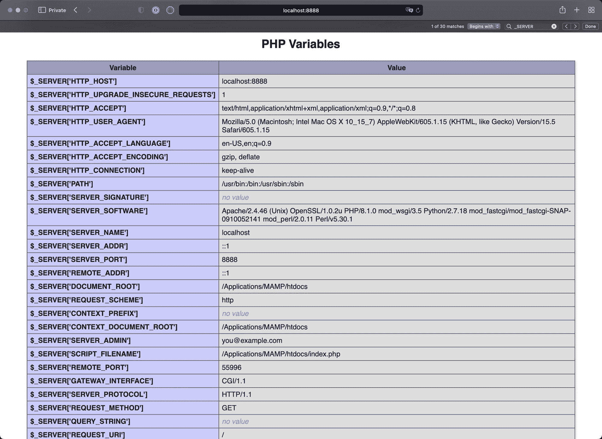

您可能使用的重要工具有:

*   `$_SERVER['HTTP_HOST']`
*   `$_SERVER['HTTP_USER_AGENT']`
*   `$_SERVER['SERVER_NAME']`
*   `$_SERVER['SERVER_ADDR']`
*   `$_SERVER['SERVER_PORT']`
*   `$_SERVER['DOCUMENT_ROOT']`
*   `$_SERVER['REQUEST_URI']`
*   `$_SERVER['SCRIPT_NAME']`
*   `$_SERVER['REMOTE_ADDR']`

### 如何在 PHP 中使用表单

表单是 Web 平台允许用户与页面交互并将数据发送到服务器的方式。

下面是一个简单的 HTML 表单:

```
<form>
  <input type="text" name="name" />
  <input type="submit" />
</form> 
```

你可以把它放在你的`index.php`文件中，就像它被叫做`index.html`一样。

一个 PHP 文件假设你使用`<?php ?>`在其中写了一些“PHP sprinkles”的 HTML，这样 Web 服务器就可以把它发送给客户端。有时 PHP 部分会占据整个页面，这时你就可以通过 PHP 生成所有的 HTML 了——这与我们现在采用的方法正好相反。

所以我们有这个`index.php`文件，它使用普通的 HTML 生成这个表单:

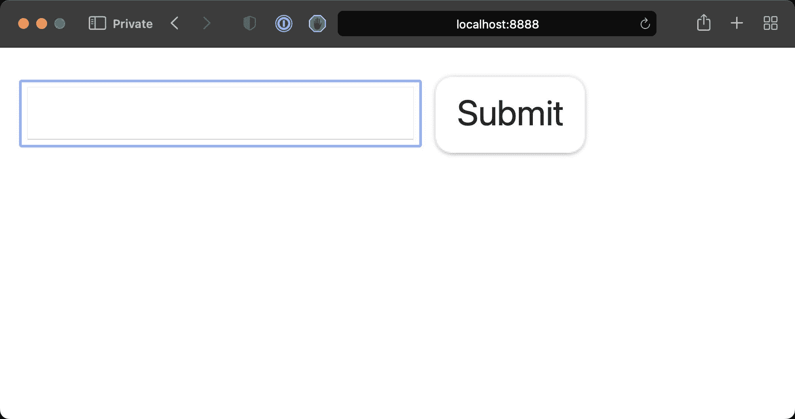

按下 Submit 按钮将向同一个 URL 发出 GET 请求，通过查询字符串发送数据。注意，URL 变成了 [localhost:8888/？name=test](http://localhost:8888/?name=test) 。

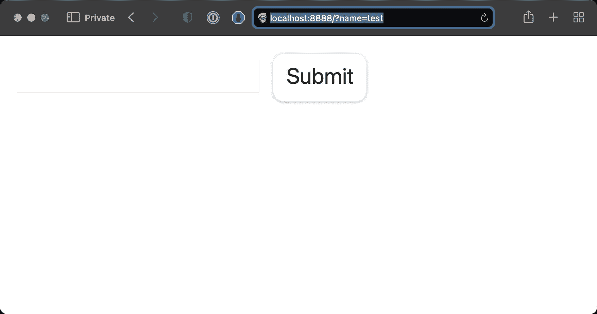

我们可以添加一些代码来检查是否使用 [`isset()`](https://www.php.net/manual/en/function.isset.php) 函数设置了该参数:

```
<form>
  <input type="text" name="name" />
  <input type="submit" />
</form>

<?php
if (isset($_GET['name'])) {
  echo '<p>The name is ' . $_GET['name'];
}
?> 
```

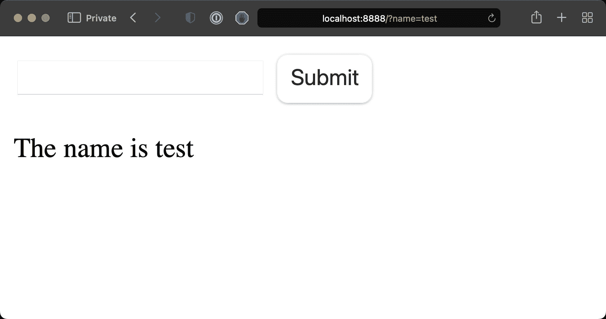

看到了吗？我们可以通过`$_GET`从 [GET 请求](https://developer.mozilla.org/en-US/docs/Web/HTTP/Methods/GET)查询字符串中获取信息。

不过，您通常对表单做的是执行 POST 请求:

```
<form **method="POST"**>
  <input type="text" name="name" />
  <input type="submit" />
</form>

<?php
if (isset($_POST['name'])) {
  echo '<p>The name is ' . $_POST['name'];
}
?> 
```

看，现在我们得到了相同的信息，但是 URL 没有改变。表单信息未附加到 URL。

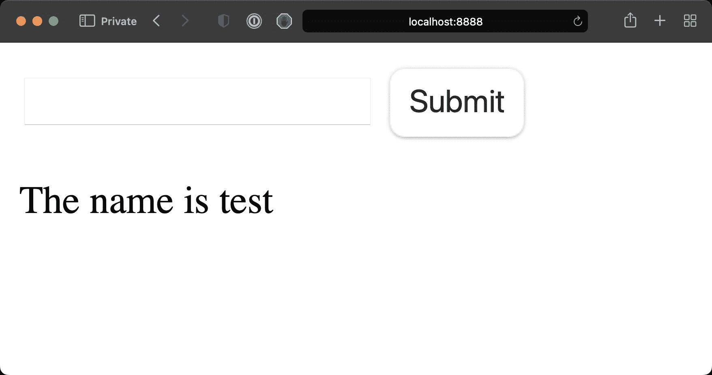

这是因为我们使用了一个 [POST 请求](https://developer.mozilla.org/en-US/docs/Web/HTTP/Methods/POST)，它通过 URL 编码的数据以不同的方式将数据发送到服务器。

如上所述，PHP 仍将服务于`index.php`文件，因为我们仍将数据发送到表单所在的相同 URL。

我们混合了许多代码，可以将表单请求处理程序与生成表单的代码分开。

所以我们可以在`index.php`中看到这个:

```
<form **method="POST" action="/post.php"**>
  <input type="text" name="name" />
  <input type="submit" />
</form> 
```

我们可以用以下内容创建一个新的`post.php`文件:

```
<?php
if (isset($_POST['name'])) {
  echo '<p>The name is ' . $_POST['name'];
}
?> 
```

PHP 将在我们提交表单后显示这些内容，因为我们在表单上设置了`action` HTML 属性。

这个例子非常简单，但是`post.php`文件是我们可以将数据保存到数据库或文件中的地方。

### 如何在 PHP 中使用 HTTP 头

PHP 允许我们通过`header()`函数设置响应的 HTTP 头。

HTTP 头是将信息发送回浏览器的一种方式。

我们可以说该页面生成了一个 500 内部服务器错误:

```
<?php
header('HTTP/1.1 500 Internal Server Error');
?> 
```

现在，如果您在打开[浏览器开发工具](https://flaviocopes.com/browser-dev-tools/)的情况下访问页面，您应该会看到状态:

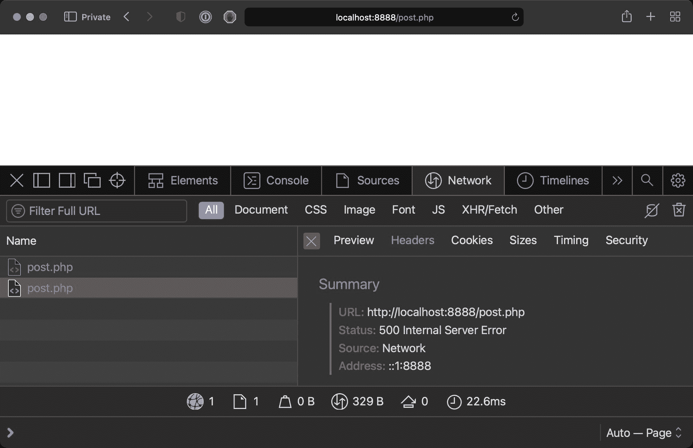

我们可以设置响应的`content/type`:

```
header('Content-Type: text/json'); 
```

我们可以强制 301 重定向:

```
header('HTTP/1.1 301 Moved Permanently');
header('Location: https://flaviocopes.com'); 
```

我们可以使用标题对浏览器说“缓存这个页面”，“不要缓存这个页面”，等等。

### 如何在 PHP 中使用 Cookies

Cookies 是浏览器的一项功能。

当我们向浏览器发送响应时，我们可以设置一个 cookie，它将由浏览器存储在客户端。

然后，浏览器发出的每个请求都会将 cookie 返回给我们。

我们可以用饼干做很多事情。它们主要用于创建个性化体验，而无需您登录服务。

需要注意的是，cookie 是特定于域的，所以我们只能读取我们在应用程序的当前域上设置的 cookie，而不能读取其他应用程序的 cookie。

但是 JavaScript 可以读取 cookie(除非它们是*http only cookie*但是我们开始进入兔子洞了)所以 cookie 不应该存储任何敏感信息。

我们可以使用 PHP 读取引用`$_COOKIE`超全局的 cookie 的值:

```
if (isset($_COOKIE['name'])) {
  $name = $_COOKIE['name'];
} 
```

[`setcookie()`](https://www.php.net/manual/en/function.setcookie.php) 功能允许您设置 cookie:

```
setcookie('name', 'Flavio'); 
```

我们可以添加第三个参数来表示 cookie 何时到期。如果省略，cookie 将在会话结束/浏览器关闭时过期。

使用此代码使 cookie 在 7 天后过期:

```
setcookie('name', 'Flavio', time() + 3600 * 24 * 7); 
```

我们只能在一个 cookie 中存储有限的数据，用户可以在清除浏览器数据时清除 cookie 客户端。

此外，它们是特定于浏览器/设备的，因此我们可以在用户的浏览器中设置一个 cookie，但如果他们更改浏览器或设备，cookie 将不可用。

让我们用之前用过的表单做一个简单的例子。我们将把输入的名称存储为 cookie:

```
<?php
if (isset($_POST['name'])) {
  setcookie('name', $_POST['name']);
}
if (isset($_POST['name'])) {
  echo '<p>Hello ' . $_POST['name'];
} else {
  if (isset($_COOKIE['name'])) {
    echo '<p>Hello ' . $_COOKIE['name'];
  }
}
?>

<form method="POST">
  <input type="text" name="name" />
  <input type="submit" />
</form> 
```

我添加了一些条件来处理已经设置了 cookie 的情况，并在提交表单后立即显示名称，此时 cookie 尚未设置(它将只在下一个 HTTP 请求中设置)。

如果您打开浏览器开发工具，您应该在存储选项卡中看到 cookie。

从那里你可以检查它的值，如果你想删除它。

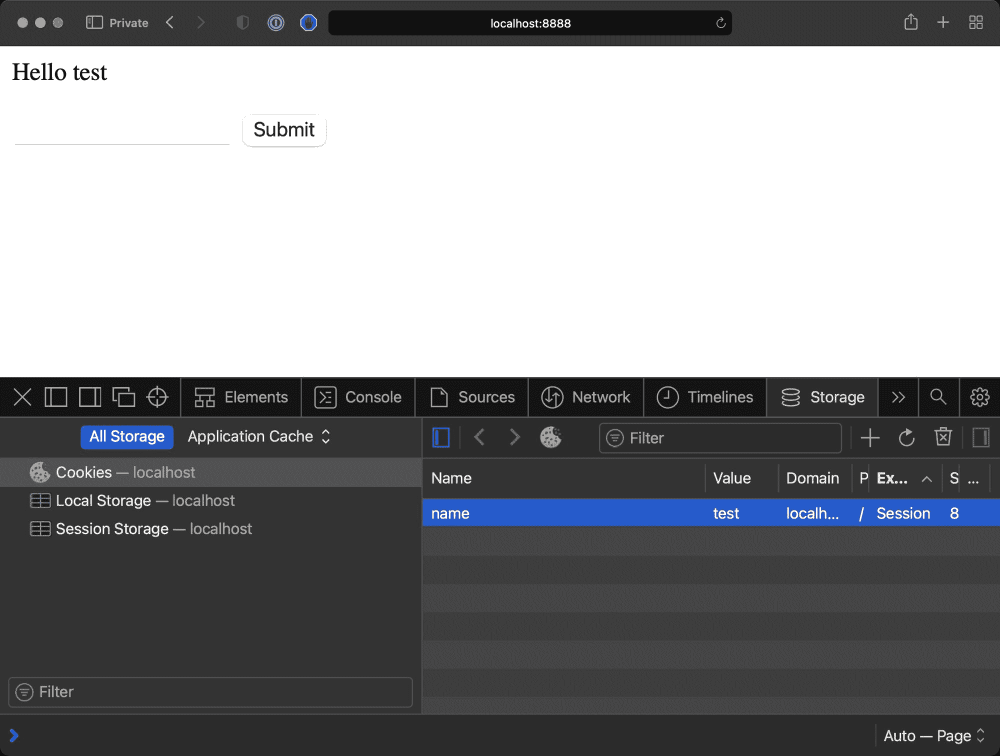

### 如何在 PHP 中使用基于 Cookie 的会话

cookie 的一个非常有趣的用例是基于 cookie 的会话。

PHP 为我们提供了一种非常简单的方法来使用`session_start()`创建基于 cookie 的会话。

尝试添加以下内容:

```
<?php
session_start();
?> 
```

在 PHP 文件中，并将其加载到浏览器中。

您将看到一个默认命名为`PHPSESSID`的新 cookie，并分配了一个值。

这是会话 ID。这将为每个新请求发送，PHP 将使用它来识别会话。

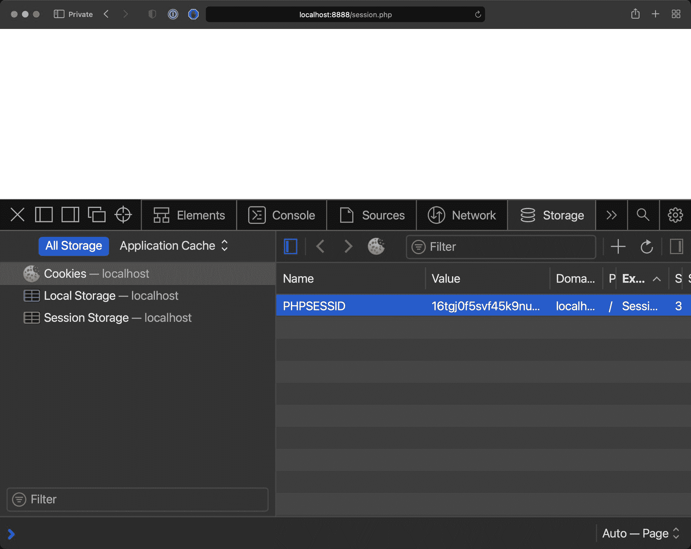

类似于我们如何使用 cookies，我们现在可以使用`$_SESSION`来存储用户发送的信息——但是这次它不是存储在客户端。

只有会话 ID 是。

PHP 将数据存储在服务器端。

```
<?php
session_start();

if (isset($_POST['name'])) {
  $_SESSION['name'] = $_POST['name'];
}
if (isset($_POST['name'])) {
  echo '<p>Hello ' . $_POST['name'];
} else {
  if (isset($_SESSION['name'])) {
    echo '<p>Hello ' . $_SESSION['name'];
  }
}
?>

<form method="POST">
  <input type="text" name="name" />
  <input type="submit" />
</form> 
```

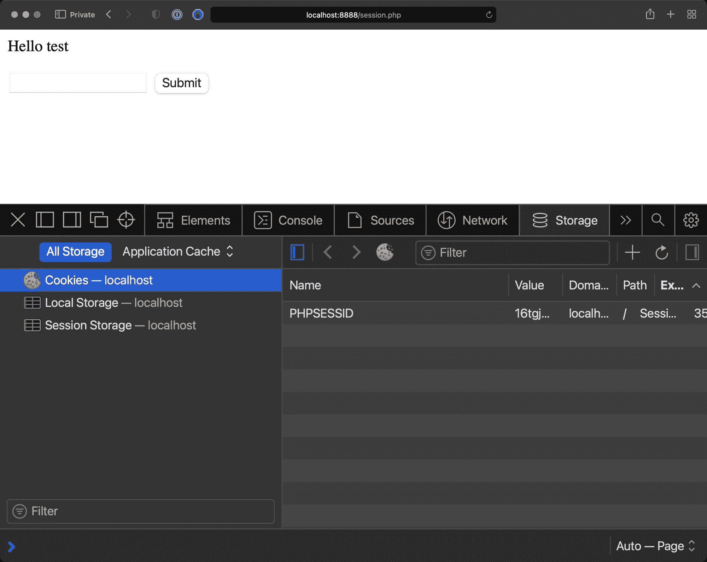

这适用于简单的用例，但是对于密集的数据，您当然需要一个数据库。

要清除会话数据，您可以调用`session_unset()`。

要清除会话 cookie，请使用:

```
setcookie(session_name(), ''); 
```

### 如何在 PHP 中使用文件和文件夹

PHP 是一种服务器端语言，它提供的便利之一是对文件系统的访问。

您可以使用`file_exists()`检查文件是否存在:

```
file_exists('test.txt') //true 
```

使用`filesize()`获取文件的大小:

```
filesize('test.txt') 
```

您可以使用`fopen()`打开文件。这里我们以**只读模式**打开`test.txt`文件，并在`$file`中得到我们称之为**的文件描述符**:

```
$file = fopen('test.txt', 'r') 
```

我们可以通过调用`fclose($fd)`来终止文件访问。

将文件内容读入一个变量，如下所示:

```
$file = fopen('test.txt', 'r')

fread($file, filesize('test.txt'));

//or

while (!feof($file)) {
	$data .= fgets($file, 5000);
} 
```

`feof()`检查当`fgets`一次读取 5000 字节时，我们还没有到达文件的末尾。

您也可以使用`fgets()`逐行读取文件:

```
$file = fopen('test.txt', 'r')

while(!feof($file)) {
  $line = fgets($file);
  //do something
} 
```

要写入一个文件，你必须首先在**写模式**下打开它，然后使用`fwrite()`:

```
$data = 'test';
$file = fopen('test.txt', 'w')
fwrite($file, $data);
fclose($file); 
```

我们可以使用`unlink()`删除文件:

```
unlink('test.txt') 
```

这些是基本的，但是当然还有更多的函数来处理文件。

### PHP 和数据库

PHP 提供了各种内置库来处理数据库，例如:

*   [PostgreSQL](https://www.php.net/manual/en/book.pgsql.php)
*   MySQL / MariaDB
*   [MongoDB](https://www.php.net/manual/en/set.mongodb.php)

我不会在手册中涉及这一点，因为我认为这是一个很大的主题，也需要你学习 SQL。

我还想说，如果你需要一个数据库，你应该使用一个框架或 ORM，这样可以避免 SQL 注入带来的安全问题。拉勒维尔的雄辩就是一个很好的例子。

### 如何在 PHP 中使用 JSON

JSON 是一种可移植的数据格式，我们用它来表示数据并将数据从客户端发送到服务器。

下面是一个包含字符串和数字的对象的 JSON 表示的示例:

```
{
  "name": "Flavio",
  "age": 35
} 
```

PHP 为我们提供了两个使用 JSON 的实用函数:

*   `json_encode()`将变量编码成 JSON
*   `json_decode()`将 JSON 字符串解码成数据类型(对象，数组…)

示例:

```
$test = ['a', 'b', 'c'];

$encoded = json_encode($test); // "["a","b","c"]" (a string)

$decoded = json_decode($encoded); // [ "a", "b", "c" ] (an array) 
```

### 如何用 PHP 发送电子邮件

我喜欢 PHP 的一个原因是它的便利性，比如发送电子邮件。

使用 [`mail()`](https://www.php.net/manual/en/function.mail.php) 发送邮件:

```
mail('test@test.com', 'this subject', 'the body'); 
```

要大规模发送电子邮件，我们不能依赖这种解决方案，因为这些电子邮件往往会到达垃圾邮件文件夹。但是对于快速测试来说，这只是有帮助的。

像[https://github.com/PHPMailer/PHPMailer](https://github.com/PHPMailer/PHPMailer)这样的库对于使用 SMTP 服务器的更实际的需求将会非常有帮助。

## 如何使用 Composer 和 Packagist

[Composer](https://getcomposer.org) 是 PHP 的包管理器。

它允许您轻松地将包安装到项目中。

将它安装在你的机器上( [Linux/Mac](https://getcomposer.org/doc/00-intro.md#installation-linux-unix-macos) 或 [Windows](https://getcomposer.org/doc/00-intro.md#installation-windows) )，一旦你完成了，你应该在你的终端上有一个`composer`命令可用。

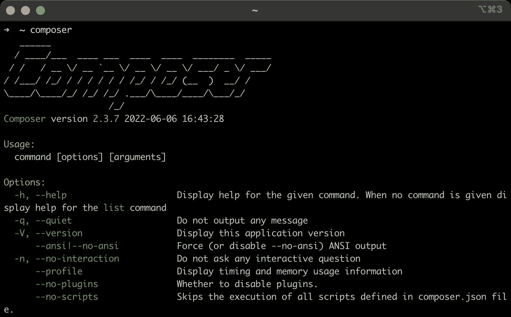

现在在你的项目中你可以运行`composer require <lib>`，它将被本地安装。例如，让我们安装[帮助我们在 PHP 中处理日期的碳库](https://carbon.nesbot.com)

```
composer require nesbot/carbon 
```

它将完成一些工作:

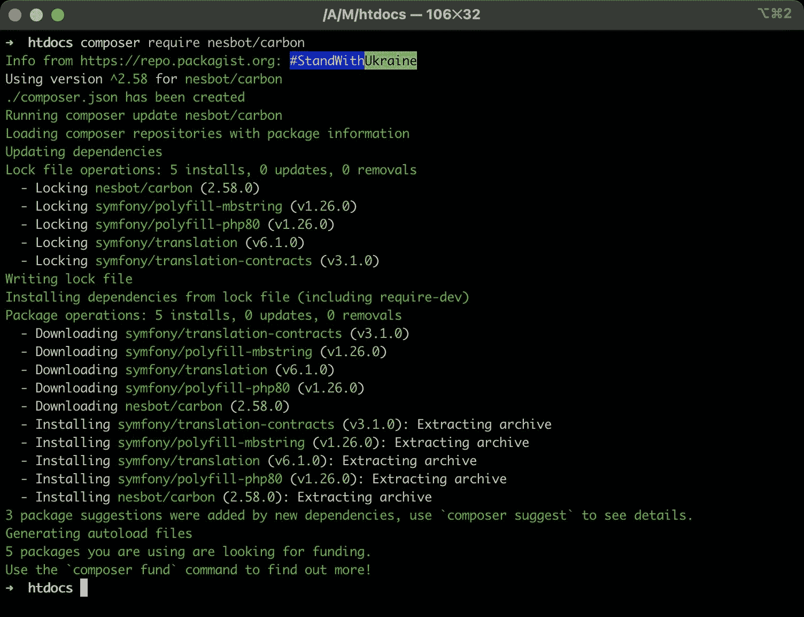

完成后，您会在文件夹`composer.json`中发现一些新东西，它列出了依赖关系的新配置:

```
{
    "require": {
        "nesbot/carbon": "^2.58"
    }
} 
```

`composer.lock`用于及时“锁定”软件包的版本，因此您拥有的完全相同的安装可以在另一台服务器上复制。`vendor`文件夹包含刚刚安装的库及其依赖项。

现在在`index.php`文件中，我们可以在顶部添加这段代码:

```
<?php
require 'vendor/autoload.php';

use Carbon\Carbon; 
```

然后我们就可以用图书馆了！

```
echo Carbon::now(); 
```

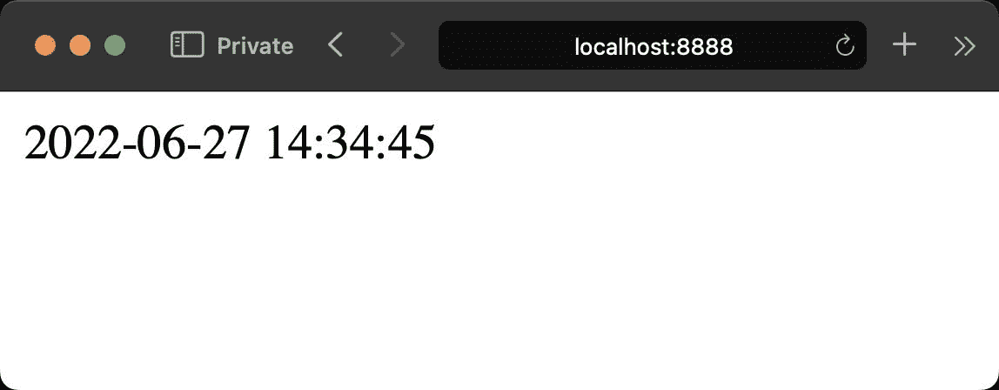

看到了吗？我们不必手动从互联网上下载一个包并安装在某个地方...一切都很快，很快，而且组织得很好。

`require 'vendor/autoload.php';`线使**能够自动加载**。还记得我们说过的`require_once()`和`include_once()`吗？这解决了所有问题——我们不需要手动搜索要包含的文件，我们只需使用`use`关键字将库导入到我们的代码中。

## 如何部署 PHP 应用程序

当你准备好一个应用程序后，就该部署它并让它在网上可以被任何人访问了。

PHP 是 Web 上部署最好的编程语言。

相信我，其他每一种编程语言和生态系统都希望它们像 PHP 一样简单。

PHP 的伟大之处在于它的即时部署，它让*变得正确*并让它取得了令人难以置信的成功。

你把一个 PHP 文件放在一个由网络服务器提供服务的文件夹中，然后*瞧*——它就工作了。

不需要重启服务器，运行可执行文件，什么都不需要。

这仍然是很多人做的事情。你以每月 3 美元的价格获得一个共享主机，通过 FTP 上传文件，就大功告成了。

但是现在，我认为 Git deploy 应该融入到每个项目中，共享主机应该成为过去。

一个解决方案是始终拥有自己的私人 VPS(虚拟私人服务器)，你可以从 DigitalOcean 或 Linode 等服务中获得。

但是管理自己的副总裁可不是闹着玩的。它需要大量的知识和时间投入，以及持续的维护。

你也可以使用所谓的 PaaS(平台即服务)，这是一种专注于处理所有无聊事情(管理服务器)的平台，你只需上传你的应用程序，它就会运行。

像 **DigitalOcean App Platform** (它不同于 DigitalOcean VPS)、Heroku 和许多其他的解决方案对于你的第一次测试来说是非常棒的。

这些服务允许您连接您的 GitHub 帐户，并在任何时候向您的 [Git](https://flaviocopes.com/git/) 存储库推送新的变更时进行部署。

你可以在这里从零开始学习[如何设置 Git 和 GitHub。](https://flaviocopes.com/github-setup-from-zero/)

与 FTP 上传相比，这是一个更好的工作流程。

让我们做一个简单的例子。

我用一个`index.php`文件创建了一个简单的 PHP 应用程序:

```
<?php
echo 'Hello!';
?> 
```

我将父文件夹添加到我的 GitHub 桌面应用程序中，初始化一个 Git repo，并将其推送到 GitHub:

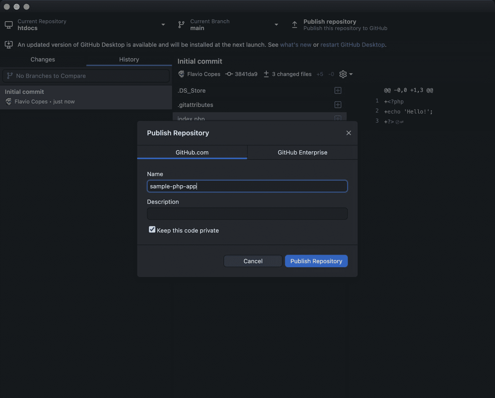

现在继续 digitalocean.com 的比赛。

如果你还没有帐户，[使用我的推荐代码注册，在接下来的 60 天内获得 100 美元的免费积分](https://m.do.co/c/bd0657b4877c)，你就可以免费使用你的 PHP 应用程序了。

我连接到我的 DigitalOcean 帐户，进入应用程序→创建应用程序。

我连接我的 GitHub 帐户，选择我的应用程序的回购。

确保“自动部署”已选中，这样应用程序将在更改时自动重新部署:

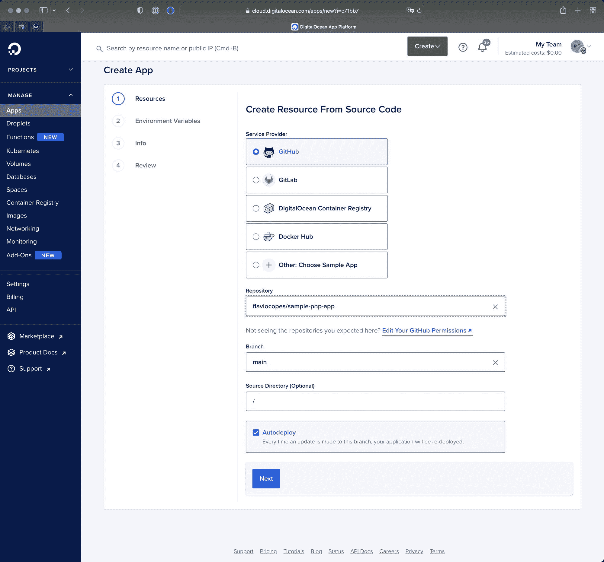

点击“下一步”,然后编辑计划:


默认情况下，会选择 Pro 计划。

使用 Basic 并选择$ 5/月计划。

请注意，你每月支付 5 美元，但计费是每小时-所以你可以随时停止应用程序。


然后返回并按“下一步”，直到“创建资源”按钮出现，以创建应用程序。你不需要任何数据库，否则每月还要多付 7 美元。

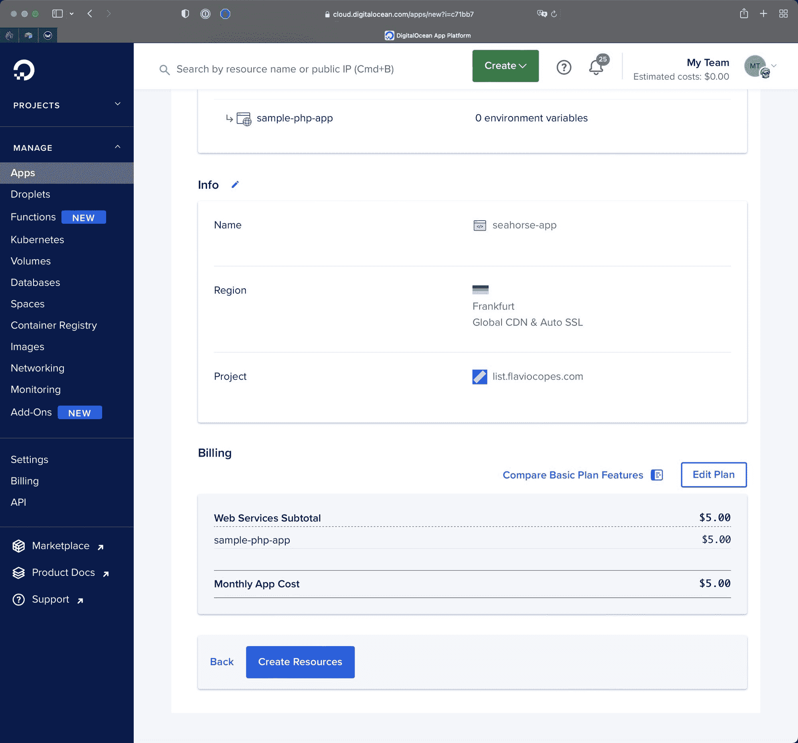

现在，等待部署就绪:

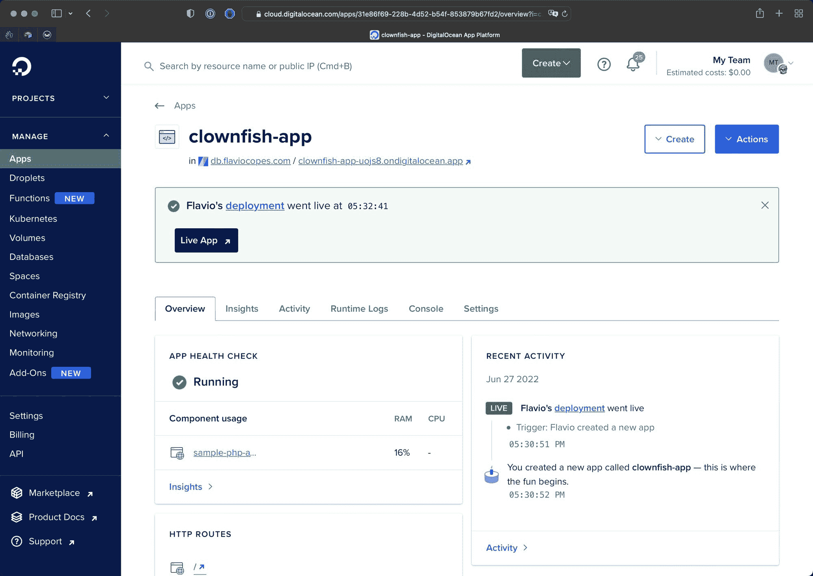

该应用程序现已启动并运行！


## 结论

您已经到达了 PHP 手册的末尾！

感谢您通读这篇介绍 PHP 开发奇妙世界的文章。我希望它能帮助你找到你的 web 开发工作，提高你的技能，并让你有能力实现下一个伟大的想法。

注意:你可以获得本手册的 [PDF、ePub 或 Mobi](https://thevalleyofcode.com/download/php/) 版本，以便于参考，或者在你的 Kindle 或平板电脑上阅读。