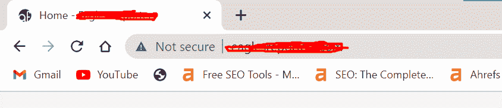
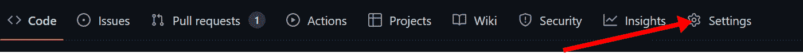
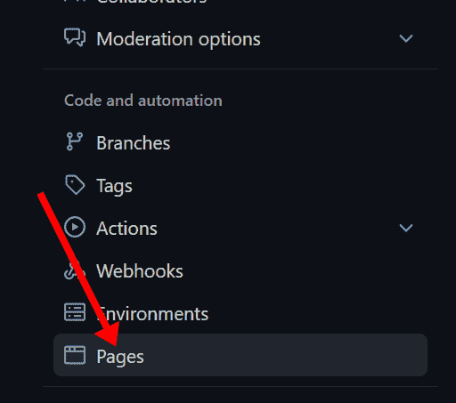
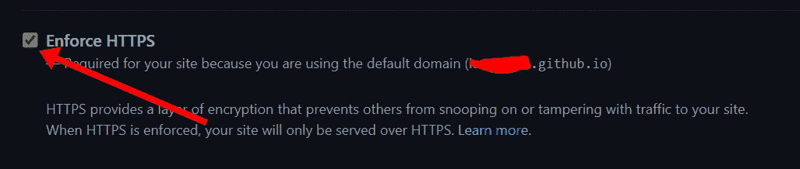
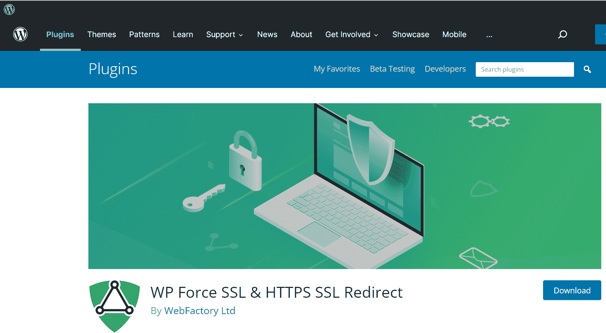
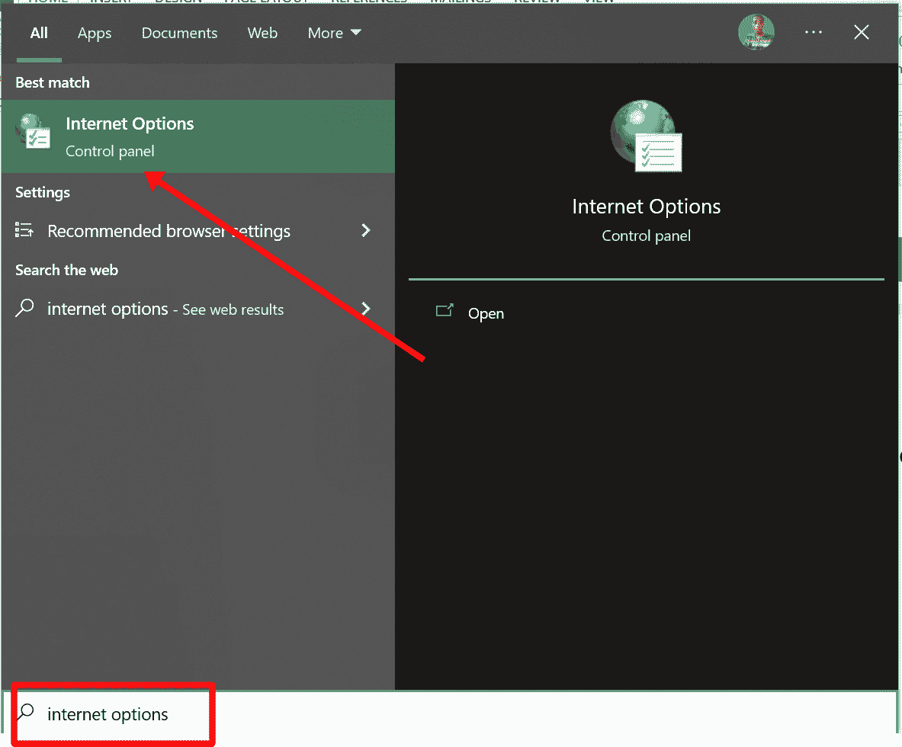
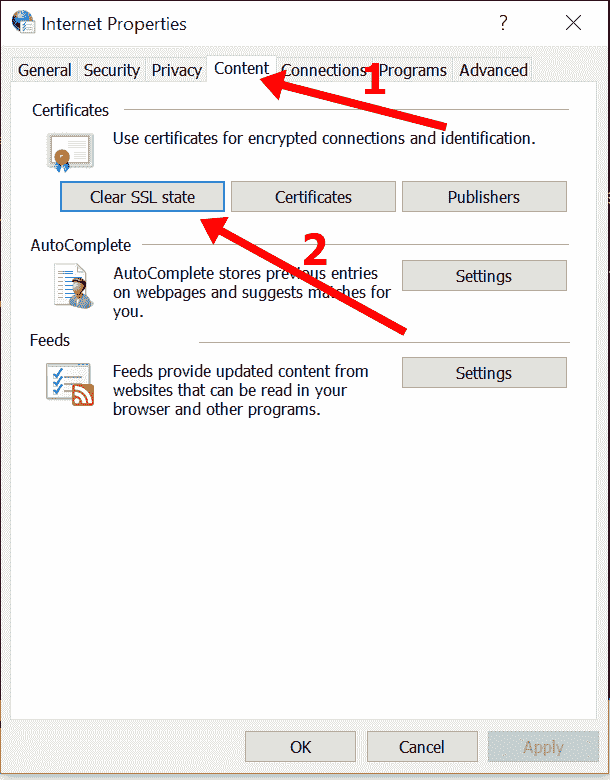
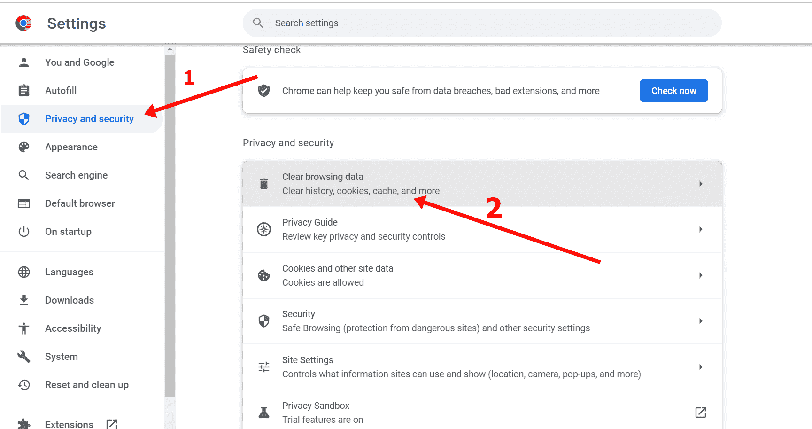

# 出现 SSL 错误–如何修复证书验证错误

> 原文：<https://www.freecodecamp.org/news/an-ssl-error-has-occurred-how-to-fix-certificate-verification-error/>

如果您在网上冲浪，并且您试图访问的网站出现 SSL 错误，您的浏览器会通过显示错误信息或信号来警告您。

此错误主要是由过期或错误的 SSL 证书引起的。当浏览器无法验证网站 SSL 证书的合法性时，也会发生这种情况。

该错误消息可能是一个巨大的错误消息，如下所示:

浏览器也可以在地址栏显示如下信号:

在本文中，我将向您展示什么是 SSL 证书。我还将向您展示作为站点所有者和用户如何修复 SSL 错误。

## 我们将涵盖的内容

*   [什么是 SSL，为什么使用它？](#whatissslandwhyisitused)
*   [作为网站所有者如何修复 SSL 错误](#howtofixsslerrorasasiteowner)
*   [购买 SSL 证书](#purchaseansslcertificate)
*   [确保您在网站上打开了 SSL](#makesureyouturnonsslonyourwebsite)
*   [如果您的网站托管在 Github 页面上…](#ifyourwebsiteishostedongithubpages)
*   [如果你的网站托管在 Netlify…](#ifyourwebsiteishostedonnetlify)
*   [如果你的网站是 WordPress 网站…](#ifyourwebsiteisawordpresswebsite)
*   [联系您的主机提供商](#contactyourhostingprovider)
*   [作为用户如何修复 SSL 错误](#howtofixsslerrorasauser)
*   [确保您的日期和时间是正确的](#makesureyourdateandtimearecorrect)
*   [清除电脑上保存的 SSLs】](#clearsavedsslsonyourcomputer)
*   [清除浏览器的缓存和 cookie](#clearyourbrowserscacheandcookies)
*   [最终想法](#finalthoughts)

## 什么是 SSL，为什么使用它？

SSL 代表安全套接字层。它是一种国际标准的安全技术，用于保证网站及其用户之间信息共享的安全。

在 Chrome 浏览器中，当一个网站拥有有效的 SSL 时，地址栏中会显示一个锁定的挂锁，这表明用户与该网站共享的任何信息都是加密的。

## 作为网站所有者如何修复 SSL 错误

如果您是网站所有者，而您的用户抱怨您的网站显示 SSL 错误，您可以使用下面介绍的任何方法来解决此问题:

### 购买 SSL 证书

如果你的网站没有安装 SSL 证书，你的用户使用的任何现代浏览器都会提醒他们你的网站不安全。

在这种情况下，您应该从任何提供商那里购买 SSL 证书。

对了，你可以从卖域名的公司买一个 SSL 证书。你也可以从 [Sectigo](https://sectigo.com/) 或[SSL](https://www.ssls.com/)购买 SSL。

### 确保您在网站上打开了 SSL

如果您已经购买并安装了 SSL，但您的网站仍然显示 SSL 错误，这可能是因为您无意中没有打开 SSL。

### 如果您的网站托管在 Github 页面上…

**步骤 1** :导航至您的站点回购，点击设置:

**第二步**:点击左边栏的页面:

**第三步**:勾选“执行 HTTPS”:

这对于使用 GitHub 默认域(example.github.io)的站点是必需的。

即使您使用的是自定义域，也要确保选中该框。

### 如果你的网站托管在 Netlify 上…

**第一步**:点击出现 SSL 错误的站点:

**第二步**:点击【站点设置】:

**第三步**:点击“域名管理”，然后点击左边栏的 HTTPS。确保有消息“您的网站已启用 HTTPS”。

### 如果你的网站是 WordPress 网站…

如果你的 WordPress 网站有 SSL 错误，在你的网站
上安装[强制 SSL 插件](https://wordpress.org/plugins/wp-force-ssl/)

### 联系您的主机提供商

如果上面讨论的每种方法对你都不起作用，那么你应该联系你的主机提供商的客户服务。

## 作为用户如何修复 SSL 错误

如果你访问一个网站，并得到任何与 SSL 相关的错误，作为用户你可以做一些事情。这是因为问题并不总是由网站引起的——只要网站上安装了 SSL 证书。

### 确保您的日期和时间是正确的

如果您的电脑的日期和时间超前或滞后，浏览器可能会显示与 SSL 相关的错误。

这是因为 SSL 是有有效期的。因此，当您的计算机的日期和时间落后或超前时，浏览器运行以查看该网站的 SSL 证书是否有效的检查将会失败。

在这种情况下，浏览器会建议您更改日期和时间。

### 清除计算机上保存的 SSL

清除计算机存储的 SSL 证书可以解决您的问题。

当您下次访问有 SSL 错误的网站时，您的浏览器将运行另一项检查，以重新验证安装在该网站上的 SSL。

要清除 SSL，点击键盘上的 Windows 按钮，搜索“互联网选项”，然后单击互联网选项搜索结果:

切换到内容选项卡，点击“清除 SSL 状态”:

### 清除浏览器的缓存和 Cookies

浏览器缓存和 cookies 中网站的 SSL 信息可能已经过期，因此如果您清除这两个记录，它可以为您解决问题。

要清除 Chrome 的缓存和 cookies，点击右上角的 3 个竖点，选择设置:

切换到左侧栏的隐私和安全选项卡，选择“清除浏览数据”:

选择缓存和 Cookies，然后点击“清除数据”:

如果你使用的不是 Chrome 浏览器，请清空浏览器的缓存和 cookies。

## 最后的想法

作为网站管理员或所有者，确保 SSL 在您的网站上安装并正常工作是非常重要的。否则，它可能不仅会影响你的网站，还会影响你的业务。

如果您也是用户，请确保您访问的任何网站在地址栏上都显示挂锁图标。如果不是这样，请确保不要与网站共享敏感信息，如卡的详细信息和密码。

感谢您的阅读。