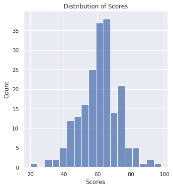
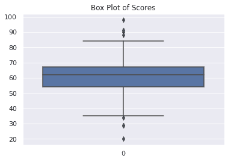

# 如何检测机器学习中的异常值——异常值检测的 4 种方法

> 原文：<https://www.freecodecamp.org/news/how-to-detect-outliers-in-machine-learning/>

你曾经在真实世界的数据集上训练过机器学习模型吗？如果是的话，你可能会遇到*离群值*。

离群值是那些与数据集的其余部分*显著*不同的数据点。它们通常是扭曲数据分布的异常观察，是由于不一致的数据输入或错误的观察而产生的。

为了确保经过训练的模型能够很好地推广到测试输入的有效范围，检测和移除异常值非常重要。

在本指南中，我们将探索一些广泛用于异常检测和剔除的统计技术。

## 为什么要检测异常值？

在机器学习流水线中，*数据清洗* *和预处理*是重要的一步，因为它可以帮助你更好地理解数据。在此步骤中，您将处理缺失值、检测异常值等等。

由于异常值是非常不同的值-异常低或异常高-它们的存在通常会扭曲数据集的统计分析结果。这可能导致效率更低、用处更小的模型。

但是处理异常值通常需要领域专业知识，并且在不了解数据分布和用例的情况下*不应该应用任何异常值检测技术。*

例如，在一个房价数据集中，如果你发现一些价格在 150 万美元左右的房子——比房价中值高得多，它们可能是离群值。但是，如果数据集包含大量价格在 100 万美元及以上的房屋，它们可能表明房价呈上升趋势。因此，把它们都标为离群值是不正确的*。在这种情况下，你需要一些房地产领域的知识。*

*离群点检测的目标是移除那些真正离群的点，这样您就可以构建一个在看不见的测试数据上表现良好的模型。我们将讨论一些有助于检测数据中异常值的技术。*

## *如何使用标准差检测异常值*

*当数据或数据集中的某些要素遵循[正态分布](https://mathworld.wolfram.com/NormalDistribution.html)时，您可以使用数据的标准差或等效的 z 得分来检测异常值。*

*在统计学中，标准差衡量的是数据围绕平均值的*分布，本质上，它捕捉的是数据点离平均值有多远。**

*对于正态分布的数据，大约 68.2%的数据位于平均值的一个标准偏差内。接近 95.4%和 99.7%的数据分别位于平均值的两个和三个标准偏差内。*

*让我们用σ表示分布的标准差，用μ表示平均值。*

*一种异常值检测方法是将*下限*设置为低于平均值三个标准差(μ - 3*σ)，将*上限*设置为高于平均值三个标准差(μ + 3*σ)。任何超出此范围的数据点都会被检测为异常值。*

*由于 99.7%的数据通常位于三个标准差内，异常值的数量将接近数据集大小的 0.3%。*

### *使用标准偏差进行异常值检测的代码*

*现在，让我们创建一个正态分布的学生成绩数据集，并对其执行异常值检测。*

*作为第一步，我们将导入必要的模块。*

```
*`import numpy as np
import pandas as pd
import seaborn as sns`*
```

*接下来，让我们定义函数`generate_scores()`，该函数返回包含 200 条记录的学生成绩的正态分布数据集。我们将调用该函数，并将返回的数组存储在变量`scores_data`中。*

```
*`def generate_scores(mean=60,std_dev=12,num_samples=200):
	np.random.seed(27)
	scores = np.random.normal(loc=mean,scale=std_dev,size=num_samples)
	scores = np.round(scores, decimals=0)
	return scores
scores_data = generate_scores()`*
```

*可以使用 Seaborn 的`displot()`函数来可视化数据分布。在这种情况下，数据集遵循正态分布，如下图所示。*

```
*`sns.set_theme()
sns.displot(data=scores_data).set(title="Distribution of Scores", xlabel="Scores")`* 
```

*

Figure 1: Normal Distribution of Scores* 

*接下来，让我们将数据加载到一个 [Pandas 数据帧](https://pandas.pydata.org/docs/reference/api/pandas.DataFrame.html)中进行进一步分析。*

```
*`df_scores = pd.DataFrame(scores_data,columns=['score'])`* 
```

 *要获得数据帧`df_scores`中数据的平均值和标准偏差，可以分别使用`.mean()`和`.std()`方法。

```
df_scores.mean()
# Output
score    61.005
dtype: float64
df_scores.std()
# Output
score    11.854434
dtype: float64
```

如前所述，将下限(`lower_limit`)设置为低于平均值三个标准差，将上限(`upper_limit`)设置为高于平均值三个标准差。

```
lower_limit = df_scores.mean() - 3*df_scores.std()
upper_limit = df_scores.mean() + 3*df_scores.std()
print(lower_limit)
print(upper_limit)
# Output
25.530716709142666
96.47928329085734
```

现在您已经定义了下限和上限，您可以过滤数据帧`df_scores`以仅保留区间`[lower_limit, upper_limit]`中的数据点，如下所示。

```
df_scores_filtered=df_scores[(df_scores['score']>lower_limit)&(df_scores['score']<upper_limit)]
print(df_scores_filtered)
# Output
score
0     75.0
1     56.0
2     67.0
3     65.0
4     63.0
..     ...
194   42.0
195   76.0
196   67.0
197   74.0
199   53.0
[198 rows x 1 columns]
```

从上面的输出中，可以看到已经删除了两条记录，而`df_scores_filtered`包含了 198 条记录。

## 如何使用 Z 分数检测异常值

现在让我们来探讨 z 分数的概念。对于具有均值μ和标准差σ的正态分布，数据集中值 x 的 z 得分由下式给出:

**z = (x - μ)/σ**

从上面的等式中，我们得到如下结果:

*   当 x = μ时，z 得分的值为 0。
*   当 x = μ 1、μ 2 或μ 3 时，z 值分别为 1、2 或 3。

请注意，这种技术相当于我们之前基于标准差的分数。在这种变换下，位于下限μ - 3*σ以下的所有数据点现在都映射到 z 分数标度上小于- 3 的点。

类似地，位于上限μ + 3*σ之上的所有点映射到 z 分数标度上大于 3 的值。所以`[lower_limit, upper_limit]`变成了[-3，3]。

让我们在分数数据集上使用这种技术。

### 使用 Z 分数进行异常值检测的代码

让我们计算数据集中所有点的 z 分数，并将 z 分数作为一列添加到 dataframe `df_scores`中。

```
df_scores['z_score']=(df_scores['score'] - df_scores['score'].mean())/df_scores['score'].std()
df_scores.head()
# Output
score	z_score
0	75.0	1.180571
1	56.0	-0.422205
2	67.0	0.505718
3	65.0	0.337005
4	63.0	0.168291
```

您可以过滤数据框`df_scores`以保留 z 分数在[-3，3]范围内的点，如下所示。如预期的那样，过滤后的数据帧包含 198 条记录。

```
df_scores_filtered= df_scores[(df_scores['z_score']>-3) & (df_scores['z_score']<3)]

print(df_scores_filtered)

# Output
     score   z_score

0     75.0  1.180571

1     56.0 -0.422205

2     67.0  0.505718

3     65.0  0.337005

4     63.0  0.168291

..     ...       ...

194   42.0 -1.603198

195   76.0  1.264928

196   67.0  0.505718

197   74.0  1.096214

199   53.0 -0.675275

[198 rows x 2 columns]
```

只有当数据集或您正在检查的要素遵循正态分布时，才能使用涉及标准差和 z 得分的方法。

接下来，我们将讨论两种离群点检测技术，它们可以独立于数据分布使用。

## 如何使用四分位距检测异常值(IQR)

在统计学中，四分位数间距或 IQR 是一个度量给定数据集中第一个四分位数和第三个四分位数之间差异的量。

*   第一个四分位数也称为四分之一四分位数，或 25%四分位数。
*   如果`q25`是第一个四分位数，这意味着数据集中 25%的点的值小于`q25`。
*   第三个四分位数也称为四分之三，或 75%四分位数。
*   如果`q75`是四分之三，75%的点的值小于`q75`。
*   使用上述符号，`IQR = q75 - q25`。

### 使用四分位距进行异常值检测的代码(IQR)

您可以使用盒状图或盒须图来探索数据集并可视化异常值的存在。位于胡须之外的点被检测为异常值。

您可以使用`boxplot`功能在 Seaborn 中生成箱线图。

```
sns.boxplot(data=scores_data).set(title="Box Plot of Scores")
```



Figure 2: Box Plot of Scores

现在，调用 dataframe `df_scores`上的 describe 方法。

```
df_scores.describe()
# Output
score
count	200.000000
mean	61.005000
std	    11.854434
min	    20.000000
25%	    54.000000
50%	    62.000000
75%	    67.000000
max	    98.000000
```

我们使用上述结果的 25%和 75%四分位值来计算 IQR，并随后设置过滤器`df_scores`的下限和上限。

```
IQR = 67-54
lower_limit = 54 - 1.5*IQR
upper_limit = 67 + 1.5*IQR
print(upper_limit)
print(lower_limit)
# Output
86.5
34.5
```

下一步，过滤数据帧`df_scores`以保留位于允许范围内的记录。

```
df_scores_filtered = df_scores[(df_scores['score']>lower_limit) & (df_scores['score']<upper_limit)]
print(df_scores_filtered)
# Output
score
0     75.0
1     56.0
2     67.0
3     65.0
4     63.0
..     ...
194   42.0
195   76.0
196   67.0
197   74.0
199   53.0
[192 rows x 1 columns]
```

如输出所示，该方法将八个点标记为异常值，过滤后的数据帧有 192 条记录长。

您不必总是调用 describe 方法来标识四分位数。你可以使用[数字](https://numpy.org/doc/stable/user/index.html#user)中的`percentile()`功能。它接受两个参数，`a`:一个数组或一个数据帧，以及`q`:一个四分位数列表。

下面的代码单元格显示了如何使用 percentile 函数计算第一个和第三个四分位数。

```
q25,q75 = np.percentile(a = df_scores,q=[25,75])
IQR = q75 - q25
print(IQR)
# Output
13.0
```

## 如何使用百分位数检测异常值

在上一节中，我们探讨了四分位数范围的概念及其在异常值检测中的应用。你可以把百分位数看作是四分位数范围的延伸。

如前所述，四分位数范围的工作原理是将范围`[q25 - 1.5*IQR, q75 + 1.5*IQR]`之外的所有点作为异常值丢弃。但是当你的观测值有一个*宽的*分布时，用这种方法去除异常值可能不是最佳选择。你可能会丢弃更多的点——比你*实际上*应该丢弃的更多——作为异常值。

根据域的不同，您可能希望扩大允许值的范围，以便更好地估计异常值。接下来，让我们重新查看分数数据集，并使用百分点来检测异常值。

### 使用百分位数进行异常值检测的代码

让我们定义一个自定义范围，包含位于数据集的 0.5 到 99.5%之间的所有数据点。为此，在 percentile 函数中设置`q = [0.5, 99.5]`，如下所示。

```
lower_limit, upper_limit = np.percentile(a=df_scores,q=[0.5,99.5])
print(upper_limit)
print(lower_limit)

# Output
91.035
28.955
```

接下来，您可以使用上一步获得的下限和上限来过滤数据帧。

```
df_scores_filtered = df_scores[(df_scores['score']>lower_limit) & (df_scores['score']<upper_limit)]
print(df_scores_filtered)

# Output
score
0     75.0
1     56.0
2     67.0
3     65.0
4     63.0
..     ...
194   42.0
195   76.0
196   67.0
197   74.0
199   53.0
[198 rows x 1 columns]
```

从上面的代码单元格中，您可以看到有两个异常值，过滤后的数据帧有 198 个数据记录。

## 结论

在本指南中，我们讨论了什么是异常值，以及为什么我们需要检测它们。然后我们回顾了最常见的离群点检测技术。

这里有一个总结:

*   如果数据或感兴趣的要素呈正态分布，您可以使用标准差和 z 值将距离平均值超过三个标准差的点标记为异常值。
*   如果数据不是正态分布的，您可以使用四分位数范围或百分比方法来检测异常值。

此外，我们讨论了异常值检测的最佳实践。当大部分数据被标记为异常值时，它们并不是真正的异常值，而是可以归因于更广泛的数据分布。

在应用上述所有技术时，了解当前的趋势以确定某些值是如何发展的，并使用领域知识检查允许的下限和上限也很重要。*