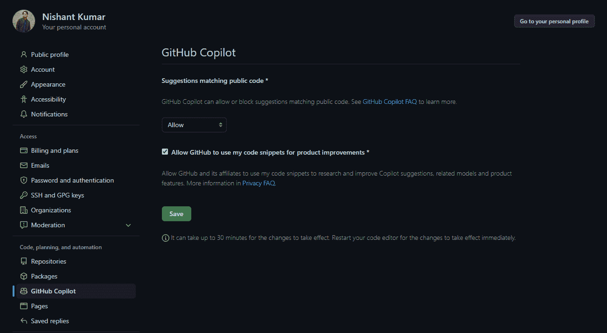
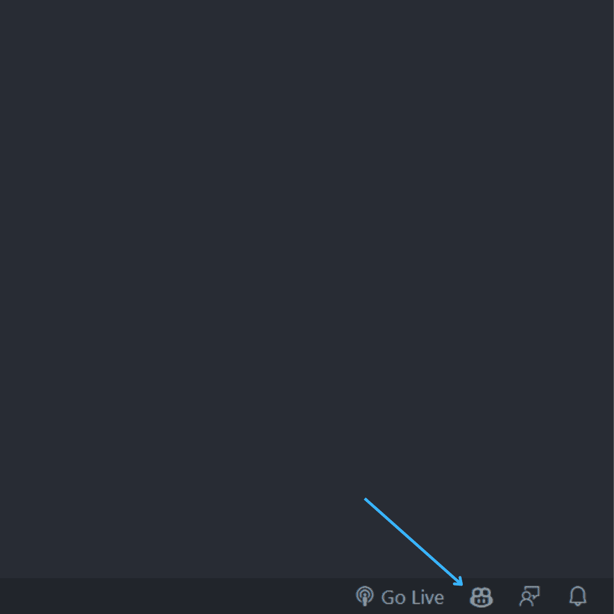
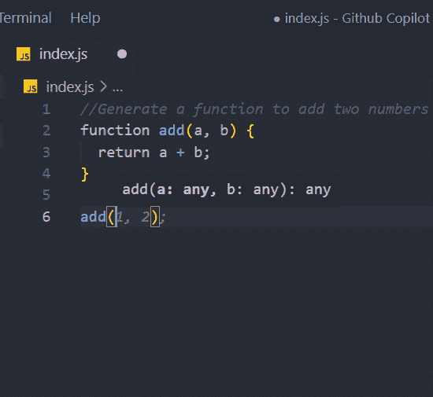
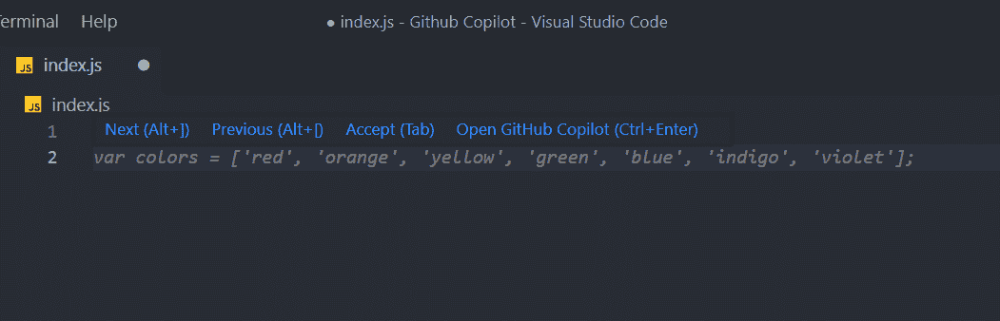
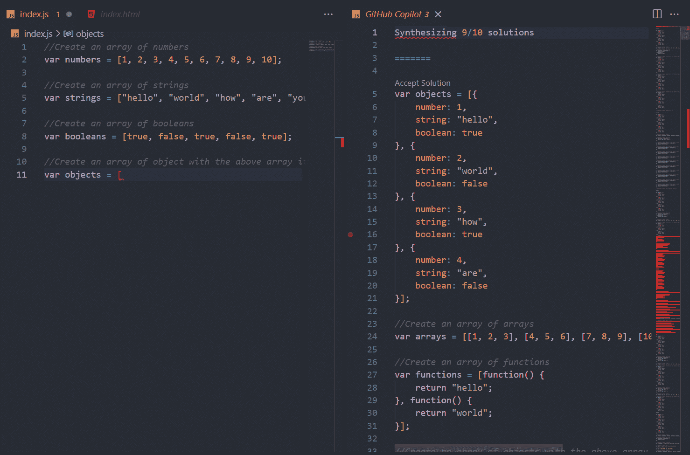
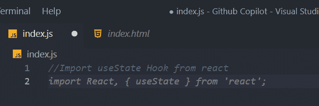
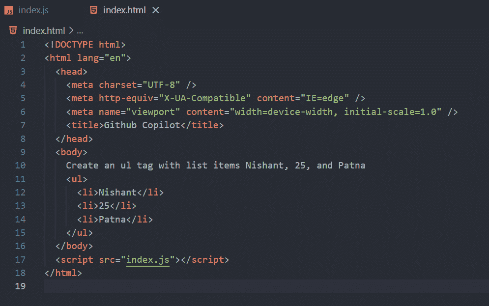

# 如何在 Visual Studio 代码中使用 GitHub Copilot

> 原文：<https://www.freecodecamp.org/news/how-to-use-github-copilot-with-visual-studio-code/>

嗨，大家好，欢迎！在本文中，我们将学习如何使用 Visual Studio 代码来使用 GitHub Copilot AI 工具。

## 什么是 GitHub Copilot？

GitHub Copilot 是一个工具，可以帮助您编写更简单、更快速的代码。它由 **GPT-3** 提供动力。你只需要写下你需要的代码描述——例如，写一个函数来生成一个随机数，或者对一个数组进行排序 Copilot 就会为你创建。

它不仅仅创造一个解决方案。它生成多个，你可以选择你想要的那个。

在本教程中，我们将学习如何为 Visual Studio 代码设置 GitHub Copilot AI 工具，以及如何为 JavaScript、React 和 HTML 生成代码。

## 如何安装 GitHub Copilot

要添加 GitHub Copilot，请前往您的 [GitHub](https://github.com/) 并进入设置。



在左侧菜单中选择 GitHub Copilot 并简单地允许它，然后点击**保存**按钮。

现在打开 Visual Studio 代码，转到**扩展**。在搜索栏中搜索 GitHub Copilot。


安装 Github Copilot 并重新启动您的 Visual Studio 代码。


在底部，你会看到 GitHub Copilot 已经被激活。



但是请记住，我们目前只有试用版。而且有效期只有两个月——免费试用将于 8 月 22 日结束。试用结束后，我们必须购买完整版。

这将花费你每月 10 美元，或每年 100 美元。


现在我们已经安装了 Copilot，让我们进入更有趣的部分，在那里我们可以使用它。

## 如何使用 GitHub Copilot 生成 JavaScript 代码

先说简单的。让我们创建一个将两个数相加的函数。

在一个 JavaScript 文件中，只需写一个类似“**生成一个将两个数字相加的函数**”的注释

```
//Generate a function to add two numbers
```

然后按回车。它会向您抛出建议，您可以通过按下**选项卡按钮来接受这些建议。**

```
//Generate a function to add two numbers
function add(a, b) {
```

然后按回车键进入下一行，当下一行代码出现时，再次按 **tab。**

```
//Generate a function to add two numbers
function add(a, b) {
  return a + b;
} 
```

这是你将两个数相加的函数。

现在让我们调用函数 **`add()`** 。写函数调用，它会自动接受一些随机参数。



我们也可以做减法、乘法和除法。

## 如何使用 GitHub Copilot 生成一个函数来显示彩虹的颜色

我们将从注释“**生成彩虹**所有颜色的数组”开始

```
//Generate an array of all the colors from the rainbow
```

然后就像之前一样，我们将按 enter 键。



它将生成彩虹中所有颜色的数组。

```
//Generate an array of all the colors from the rainbow
var colors = ['red', 'orange', 'yellow', 'green', 'blue', 'indigo', 'violet'];
```

## 如何创建数字、字符串和布尔类型的三个数组，并将它们合并到一个对象中

现在让我们尝试创建一个由数字、字符串和布尔值组成的数组。

```
//Create an array of numbers
var numbers = [1, 2, 3, 4, 5, 6, 7, 8, 9, 10];

//Create an array of strings
var strings = ["hello", "world", "how", "are", "you"];

//Create an array of booleans
var booleans = [true, false, true, false, true];
```

现在，让我们将它们合并成一个对象。我们将创建一个**对象**,如下所示:

```
var objects = [
    {
        number: 1,
        string: "hello",
        boolean: true
    },
    {
        number: 2,
        string: "world",
        boolean: false
    },
    {
        number: 3,
        string: "how",
        boolean: true
    },
]
```

写一个注释，说明“**用上面的数组项作为键值对**创建一个对象数组。”

您可以按**选项卡**按钮接受解决方案，或者按 **CTRL + Enter** 打开 Copilot 解决方案页面。



你可以接受任何你想要的解决方案。只需点击**接受**。

```
//Create an array of numbers
var numbers = [1, 2, 3, 4, 5, 6, 7, 8, 9, 10];

//Create an array of strings
var strings = ["hello", "world", "how", "are", "you"];

//Create an array of booleans
var booleans = [true, false, true, false, true];

//Create an array of objects with the above array items as key value pairs
var objects = [
  {
    number: 1,
    string: "hello",
    boolean: true,
  },
  {
    number: 2,
    string: "world",
    boolean: false,
  },
  {
    number: 3,
    string: "how",
    boolean: true,
  },
  {
    number: 4,
    string: "are",
    boolean: false,
  },
  {
    number: 5,
    string: "you",
    boolean: true,
  },
]; 
```

## 如何在反应和表达中导入事物

现在让我们来看看事物是如何反应和表达的。

我们将简单地导入几个模块。

让我们先从 **React** 导入 **useState 钩子**。

```
//Import useState Hook from react
```

写下注释，然后按回车键。副驾驶会生成代码。



```
//Import useState Hook from react
import React, { useState } from 'react';
```

让我们为 React 再做一次尝试，从 React 导入 useEffect 和 useState 挂钩。

```
//Import useState and useEffect hook from react
import React, { useState, useEffect } from 'react';
```

让我们以明示的方式做某事。让我们在 Express 中导入为 Node 和 Express 制作的 **CORS npm 包**。它会在这里。

```
//Import cors from express
const cors = require('cors');
```

## 如何为 HTML 生成代码

让我们尝试一些 HTML 代码。

首先，让我们用 Nishant，25 和 Patna 生成一些代码来创建一个无序列表。

```
Create an ul tag with list items Nishant, 25, and Patna
    <ul>
      <li>Nishant</li>
      <li>25</li>
      <li>Patna</li>
    </ul>
```



让我们尝试同样的方法，但是列表样式为 none。

```
Create an ul tag with the list having a class of lists and the items
    Nishant, 25, and Patna and the list style as none
    <ul class="lists" style="list-style: none">
      <li>Nishant</li>
      <li>25</li>
      <li>Patna</li>
    </ul>
```

这就是了。很神奇吧？

## 包扎

在本文中，您了解了什么是 GitHub Copilot 以及如何使用它。

你也可以看看我同主题的视频，是[让我们用 Visual Studio 代码测试一下 GitHub Copilot - GitHub Copilot 教程](https://youtu.be/PdXBepPOqqI)

感谢您的阅读。快乐学习。