# 如何用 HarperDB 跟踪机器学习实验

> 原文：<https://www.freecodecamp.org/news/track-machine-learning-experiments-with-harperdb/>

正确跟踪你的机器学习实验比你想象的要容易。

在做机器学习项目的时候，你会进行不同的机器学习实验，才会得出最终性能最好的 ML 模型。

这里有一些你可以进行的机器学习实验:

*   测试各种算法，以确定哪种算法对您试图解决的问题(例如，分类问题)最有效。
*   根据模型性能选择要处理的重要特征。
*   微调模型以提高其性能(例如，网格搜索技术)。
*   解决过拟合和欠拟合对模型性能的影响
*   完成一些与你正在解决的问题相关的其他任务。

## 为什么跟踪 ML 实验很重要？

跟踪你的机器学习实验是很重要的，因为这样做将有助于你对将要部署到生产中的 ML 模型做出最终决定。在分析了你所做的许多不同的 ML 实验的结果后，你会更好地做到这一点。

你进行的 ML 实验越多，就越难记住什么有效，什么无效。偶尔，您可能会有一个非常好的结果，但是因为花了几个小时或几天来训练，您已经修改了代码。而现在你已经不记得你用什么参数达到这个结果了！

数据科学家的一个常见做法是在数字或物理纸上手动记录他们的 ML 实验。但是使用**打印语句**(对于 Python 编程语言来说)来查看实验输出是无效的。这是因为当您执行另一个实验时，上一个实验的输出会丢失。

幸运的是，您可以通过将所有结果保存在一个名为 [**HarperDB**](https://harperdb.io/) 的数据库中来自动跟踪 ML 实验。它不仅设置简单，而且很容易适应您现有的工作流，而且您还可以通过使用简单的 Rest API 与您的队友分享您的机器学习实验结果。

## 什么是 HarperDB？

HarperDB 是一个快速灵活的 SQL/NoSQL 数据管理平台。您可以将它用于许多不同的事情，包括但不限于快速应用程序开发、分布式计算、边缘计算、SaaS 等等。

HarperDB 是完全索引的，不会重复数据，可以在从边缘到云的任何设备上运行。

它还兼容任何编程语言，包括 Python、JavaScript、Java 等。

以下是 HarperDB 上可用的一些功能的列表:

*   单端点 API
*   [自定义功能](https://harperdb.io/docs/custom-functions/)(类似 Lambda 的应用开发平台，可直接访问 HarperDB 的核心方法)
*   允许 JSON 和 CSV 文件插入
*   支持完整 CRUD 操作的 SQL 查询
*   支持 Math.js 和 GeoJSON
*   需要有限的数据库配置

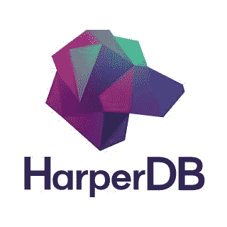

HarperDB Logo

HarperDB 有一个内置的 HTTP API、用于用户定义的端点的自定义函数，以及一个动态模式，可以帮助您在将实验结果存储在 HarperDB 云实例中后与同事共享它们。

您还可以将 ML 实验的结果快速下载为 CSV 文件，以便在做出最终决定之前进行额外的分析。

在本文中，您将学习如何使用 HarperDB 轻松管理您的机器学习实验结果。

我们开始吧🚀

## 如何设置 HarperDB

HarperBB 需要一个帐户，您需要在使用之前配置 HarperDB 云实例。要做到这两点，您可以遵循以下步骤。

### 1.创建一个 HarperDB 帐户

你可以访问 https://Harper db . io/然后点击导航栏看到一个名为“免费开始”的链接。点击它以创建您的帐户。

如果您已经有帐户，请使用以下网址[https://studio.harperdb.io/](https://studio.harperdb.io/)用您的凭证登录。

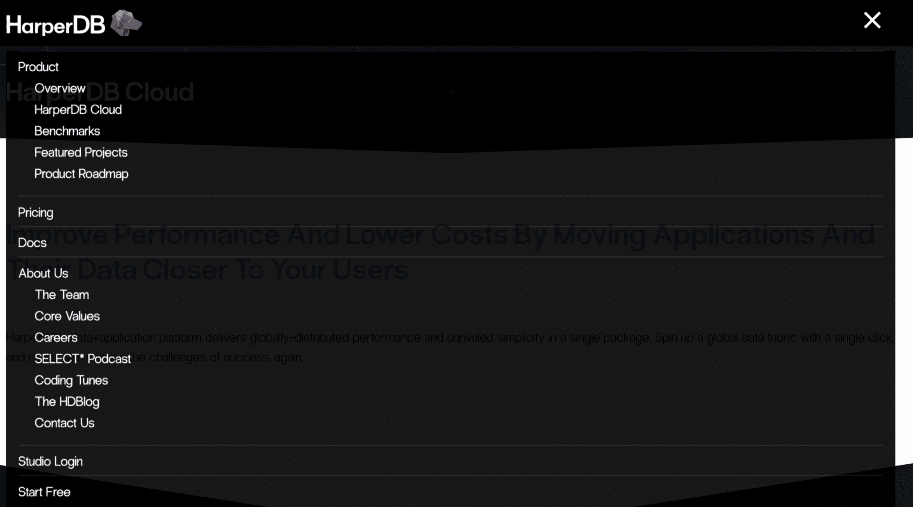

Screenshot from harperdb.io

在注册过程中，您需要提供详细信息，如您的姓名、电子邮件地址和所需的子域。HarperDB 将自动为您建立一个新的子域。

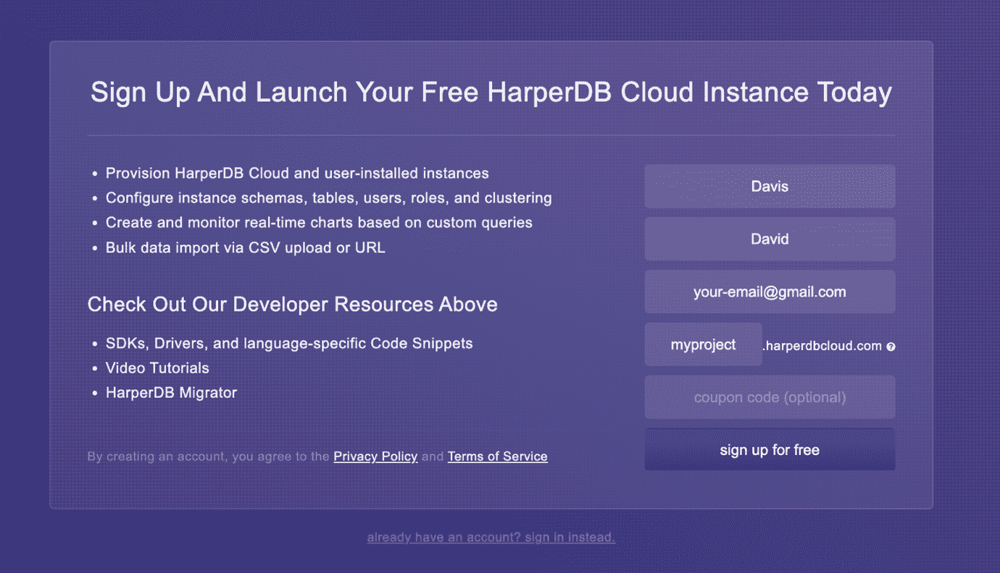

screenshot from harperdb.io

### 2.添加您的帐户密码

下一步是为您的帐户添加一个强密码，以完成您的帐户注册过程。

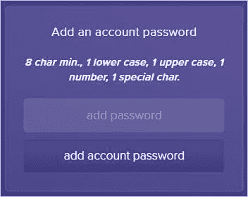

screenshot from harperdb.io

### 3.创建一个 HarperDB 云实例

注册后，您需要创建一个云实例来存储和获取您的机器学习实验的结果。您需要单击“创建新的 HarperDB 云实例”来向您的帐户添加新的实例。

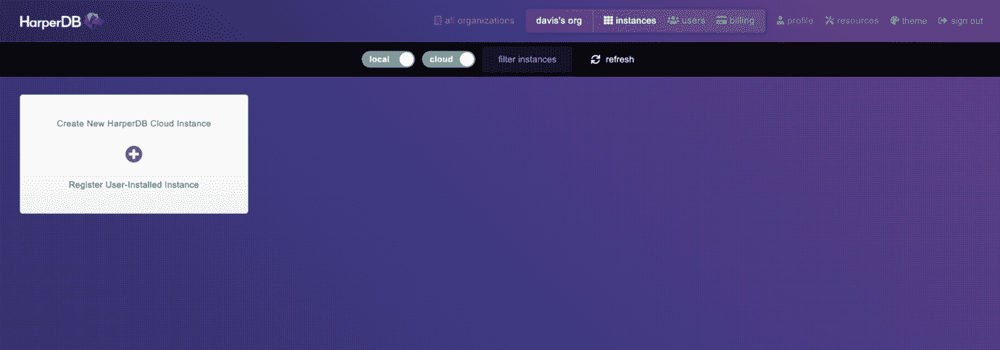

screenshot from harperdb.io

您将看到下图，其中您需要选择实例类型。对于本教程，您需要选择 **AWS 或威瑞森波长 HarperDB 实例**。

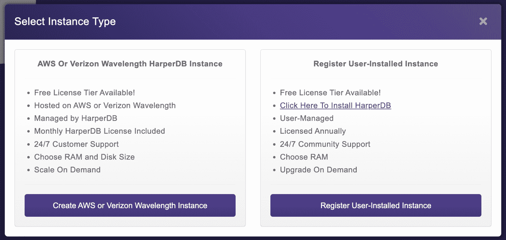

screenshot from harperdb.io

然后你需要选择云提供商。这里您将使用默认选项，然后单击**实例信息**。

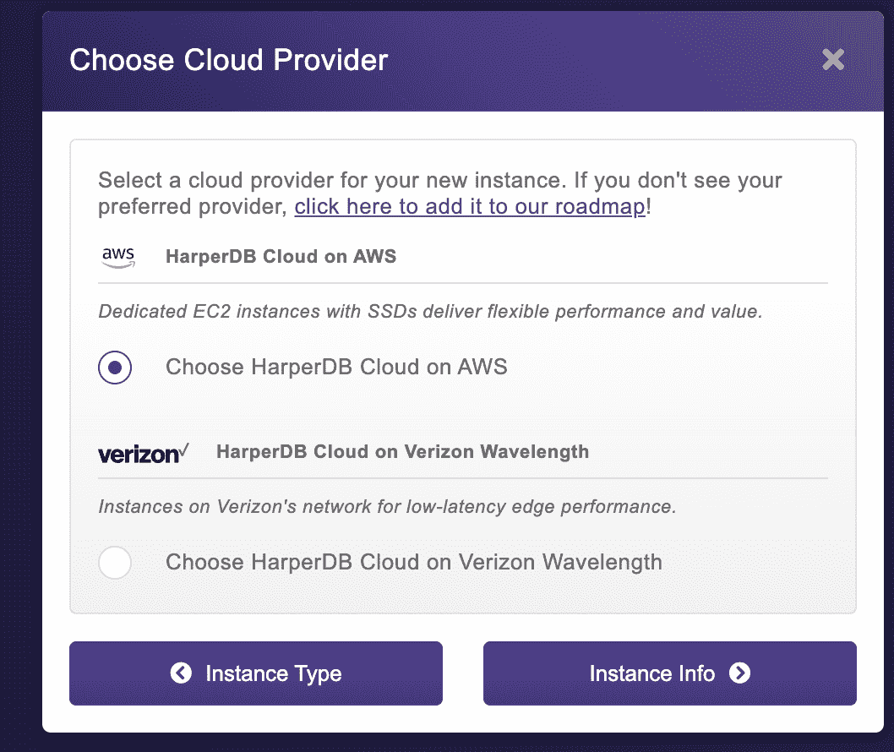

screenshot from harperdb.io

在 Instance info 页面上，您需要提供云实例的名称和访问它的凭证。

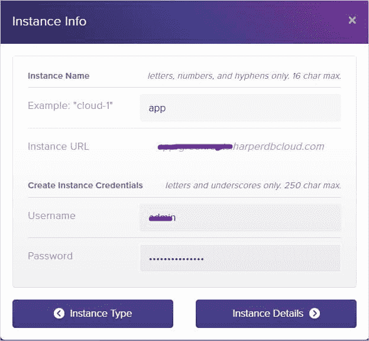

Screenshot from harperdb.io

然后单击“实例详细信息”按钮。在 specification 页面上，您需要选择实例 RAM 大小、实例存储大小和实例区域。


screenshot from harperdb.io

如果您正在使用免费服务层，您应该将上面屏幕上的所有设置保留为默认值，然后单击“确认实例详细信息”按钮。

最后一步是确认实例细节并添加 HarperDB 云实例。确保再次检查详细信息，然后单击 Add Instance 按钮。


Screenshot from harperdb.io

最后，您将看到云实例的创建已经开始，如下所示。

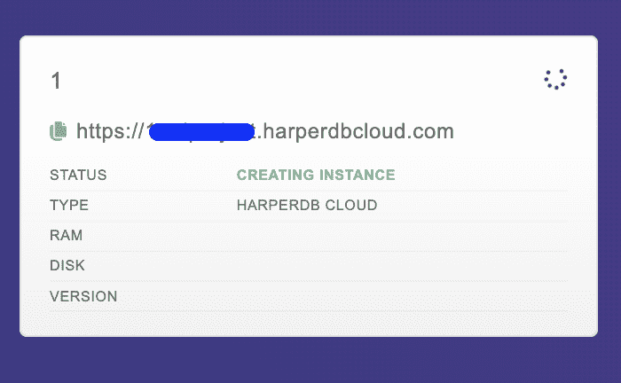

Screenshot from harperdb.io

几分钟后，当 HarperDB 云实例成功创建后，您将看到该特定实例的状态为 OK。

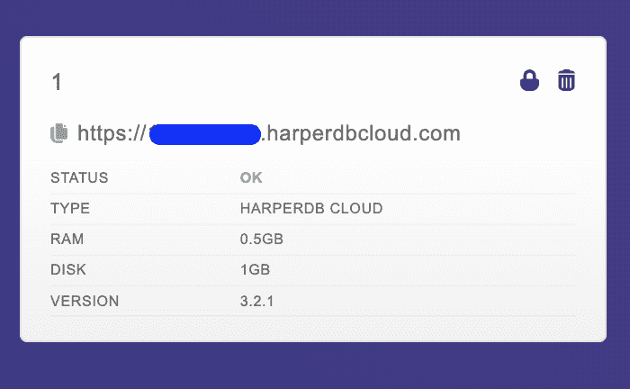

screenshot from harperdb.io

**恭喜**🎉您已经成功完成了创建云实例的第三步。

## 如何配置 HarperDB 模式和表

您需要首先创建一个模式和一个表，以便将 ML 实验的结果插入到数据库中。

要做到这一点，您所要做的就是加载您已经从仪表板中建立的 HarperDB 云实例。

首先，您需要通过指定模式名来创建模式。对于本教程，模式名称是 machinelearning。

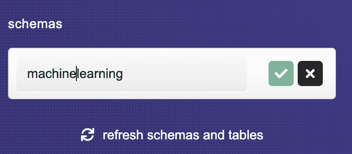

screenshot from harperdb.io

创建模式后，您将看到添加表的选项。让我们从制作第一个表格开始，我们称之为**实验**。

HarperDB 还会要求您指定 hash_attribute，这相当于一个惟一标识符。

hash_attribute 的值将由 HarperDB 自动生成。大多数数据表使用 id 作为每个记录的唯一标识符，这就是您将在这个名为 **experiments** 的表中使用的。

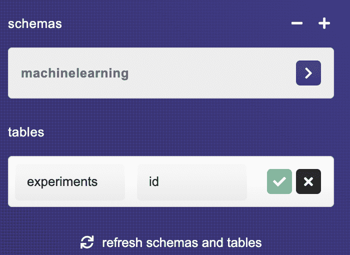

screenshot from harperdb.io

至此，模式和表都已成功创建。

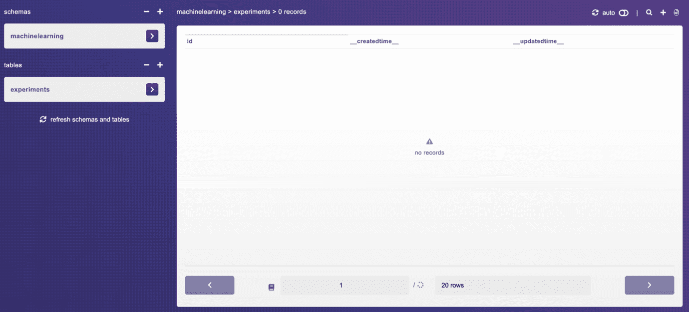

screenshot from harperdb.io

## 如何在 HarperDB 中跟踪你的机器学习实验

我将使用贷款数据集进行机器学习实验，然后将所有 ML 实验结果记录到 HarperDB 数据库云实例中的实验表中。

ML 实验的目标是在预测消费者是否应该获得贷款时达到高准确度。你可以在这里下载数据集[。](https://github.com/Davisy/Run-Machine-Learning-Experiments-with-Python-Logging-module/blob/master/data/loans_data.csv)

以下是运行和跟踪您的 ML 实验需要遵循的步骤。

### 1.安装所需的软件包

您需要在您的机器上安装以下软件包。

**(a) scikit-learn**
这是一个机器学习库，它有不同的算法来训练机器学习模型处理不同的问题，如分类、回归和聚类。

```
pip install scikit-learn
```

这是我们将用来实现不同 HarperDB API 函数的 python 包。它还为面向对象的接口提供了包装器。

```
pip install harperdb
```

### 2.导入其他重要包

下一步是导入 Python 包来加载数据，并预处理数据集和算法以在贷款数据集上进行训练。

```
#import packages

import numpy as np
import pandas as pd
from sklearn import preprocessing
from sklearn.metrics import classification_report, confusion_matrix, f1_score
from sklearn.preprocessing import StandardScaler, MinMaxScaler, LabelEncoder
from sklearn.model_selection import train_test_split
from sklearn.model_selection import cross_val_score
from sklearn.model_selection import GridSearchCV

# classifiers
from sklearn.ensemble import RandomForestClassifier
from sklearn.neighbors import KNeighborsClassifier
from sklearn.ensemble import GradientBoostingClassifier
from sklearn.tree import DecisionTreeClassifier
from sklearn.linear_model import LogisticRegression
from sklearn.ensemble import BaggingClassifier
from sklearn.ensemble import ExtraTreesClassifier
from xgboost import XGBClassifier
from imblearn.ensemble import (
    BalancedBaggingClassifier,
    EasyEnsembleClassifier,
)

# harperdb
import harperdb

import time
import json
import warnings  # To ignore any warnings

warnings.filterwarnings("ignore")

np.random.seed(123)
```

### 3.加载贷款数据集

我们将使用 Pandas 库来加载贷款数据集。

```
data = pd.read_csv("data/loans_data.csv")

data.columns
```

以下是贷款数据集中可用的要素列表。

Loan_ID
性别
已婚
家眷
学历
个体户
申请人收入
共同申请人收入
贷款金额
贷款 _ 金额 _ 期限
信用 _ 历史
房产 _ 面积
贷款 _ 状态

我们有 12 个独立的特性和一个目标(Loan_Status)。你可以在这里阅读每个特性的描述。

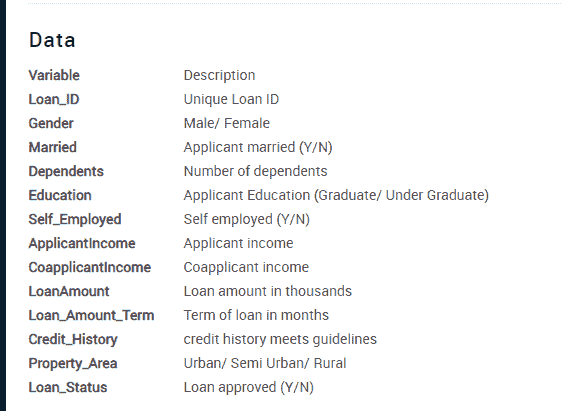

Features Definition

### 4.创建一个 Python 函数

在训练之前，必须管理数据集中包含的缺失值并预处理要素。我为缺失数据和要素工程开发了一个简单的 Python 工具。

```
# function to preprocessing the dataset

def preprocessing(data):
    # replace with numerical values
    data['Dependents'].replace('3+', 3, inplace=True)
    data['Loan_Status'].replace('N', 0, inplace=True)
    data['Loan_Status'].replace('Y', 1, inplace=True)

    # handle missing data
    data['Gender'].fillna(data['Gender'].mode()[0], inplace=True)
    data['Married'].fillna(data['Married'].mode()[0], inplace=True)
    data['Dependents'].fillna(data['Dependents'].mode()[0], inplace=True)
    data['Self_Employed'].fillna(data['Self_Employed'].mode()[0], inplace=True)
    data['Credit_History'].fillna(data['Credit_History'].mode()[0],
                                  inplace=True)
    data['Loan_Amount_Term'].fillna(data['Loan_Amount_Term'].mode()[0],
                                    inplace=True)
    data['LoanAmount'].fillna(data['LoanAmount'].median(), inplace=True)

    # drop ID column
    data = data.drop('Loan_ID', axis=1)

    #scale the data
    data["ApplicantIncome"] = MinMaxScaler().fit_transform(
        data["ApplicantIncome"].values.reshape(-1, 1))
    data["LoanAmount"] = MinMaxScaler().fit_transform(
        data["LoanAmount"].values.reshape(-1, 1))
    data["CoapplicantIncome"] = MinMaxScaler().fit_transform(
        data["CoapplicantIncome"].values.reshape(-1, 1))
    data["Loan_Amount_Term"] = MinMaxScaler().fit_transform(
        data["Loan_Amount_Term"].values.reshape(-1, 1))

    #change categorical features to numerical
    data = pd.get_dummies(data)

    return data
```

如果你很好奇，你也可以在这里阅读更多关于[如何处理数据集中的缺失值。](https://www.freecodecamp.org/news/how-to-handle-missing-data-in-a-dataset/)

让我们对贷款数据集进行预处理。

```
data = preprocessing(data)
```

### 5.连接到 HarperDB 云实例

下一步是连接到 HarperDB 云实例，以便将实验结果插入到名为 experiments 的表中。

这里需要提供三个参数:

*   HarperDB 实例的完整 URL
*   您的用户名
*   您的密码

```
# connect to harperdb

URL = "https://{project-name}.harperdbcloud.com"
USERNAME = "your-username"
PASSWORD = "your-password"

db = harperdb.HarperDB(url=URL, username=USERNAME, password=PASSWORD)

# check if you are connected
db.describe_all()
```

当您执行上面的代码时，您将看到类似于下面显示的输出，表明成功连接到您的 HarperDB 云实例。

```
{'machinelearning': {'experiments': {'__createdtime__': 1656351257480,   '__updatedtime__': 1656351257480,   'hash_attribute': 'id',   'id': 'd5333654-16c0-4ae5-bf30-0a6e607b1ee7',   'name': 'experiments',   'residence': None,   'schema': 'machinelearning',   'attributes': [{'attribute': 'id'},    {'attribute': '__createdtime__'},    {'attribute': 'accuracy_mean'},    {'attribute': '__updatedtime__'},    {'attribute': 'model_name'},    {'attribute': 'training_period'},    {'attribute': 'name'}],   'record_count': 0}}}
```

### 6.创建一个函数来记录实验结果

您还需要创建一个函数来保存其他实验表中的每个实验结果。您需要定义用于插入记录的模式和表。

下面的函数将接收实验结果作为**数据**(字典格式)，并通过使用 harperdb-python 包中的**插入函数**将其插入到该表中。

插入函数将接收三个参数:

*   架构名称
*   表名
*   数据(实验结果)

```
# define a function to record experiment results into the table

def record_results(data):

    #define the schema and table
    SCHEMA = "machinelearning"
    TABLE = "experiments"

    # insert data into the table
    result = db.insert(SCHEMA, TABLE, [data])

    return result
```

如果成功地将特定记录插入到表中，该函数将返回该记录的状态。

### 7.将数据分为要素和目标

我们需要将数据分为特征和目标。这个数据集的目标是一个名为 L **oan_Status** 的列。

```
# split data into train and test

X = data.drop('Loan_Status', axis=1)
y = data.Loan_Status
```

### 8.运行和跟踪机器学习实验

现在您可以训练多个分类算法，并通过使用 **record_results 函数**将结果保存到 HarperDB 云实例中的表中。

在这里，您将把以下记录保存到表中:

*   实验的名称，例如“第一次”。
*   分类模型的名称，例如 RandomForestClassifier。
*   模型的参数名称映射到它们的值。
*   交叉验证分数的准确度列表。
*   平均准确度分数。
*   训练期。

上述记录将被插入到实验表格中。

```
# create a dictionary for  classifiers
models = {
    "KNeighborsClassifier": KNeighborsClassifier(),
    "RandomForestClassifier": RandomForestClassifier(),
    "GradientBoostingClassifier": GradientBoostingClassifier(),
    "DecisionTreeClassifier": DecisionTreeClassifier(),
    "BaggingClassifier": BaggingClassifier(),
    "XGBClassifier": XGBClassifier(),
    "ExtraTreesClassifier": ExtraTreesClassifier(),
    "LogisticRegression": LogisticRegression(),
    "BalancedBaggingClassifier": BalancedBaggingClassifier(),
    "EasyEnsembleClassifier": EasyEnsembleClassifier(),
}

# cross_val_score for each classifier
for model_name, model in models.items():

    start = time.time()

    scores = cross_val_score(model, X, y, cv=3, scoring='accuracy')

    end = time.time()

    training_duration = end - start

    data = {
        "name": "First",
        "model_name": model_name,
        "model_parameters": json.dumps(model.get_params()),
        "accuracy_scores": json.dumps(list(scores)),
        "accuracy_mean": scores.mean(),
        "training_period": training_duration
    }

    # insert result into the HarperDB table
    result = record_results(data)

    print(result)
    print("-------------------------------")
```

一旦上面的代码运行，将生成以下输出。

```
{'message': 'inserted 1 of 1 records', 'inserted_hashes': ['d6fe4a54-69ee-4c10-8bb2-c592c57b30d7'], 'skipped_hashes': []}
-------------------------------
{'message': 'inserted 1 of 1 records', 'inserted_hashes': ['fca4307e-3287-4b76-9f8c-0c22ed1b4ac4'], 'skipped_hashes': []}
-------------------------------
{'message': 'inserted 1 of 1 records', 'inserted_hashes': ['1b0aabe7-1f31-4bb7-b195-8dc598e74a46'], 'skipped_hashes': []}
-------------------------------
{'message': 'inserted 1 of 1 records', 'inserted_hashes': ['02750d9c-8876-4e0d-8849-133d72b8ca20'], 'skipped_hashes': []}
-------------------------------
{'message': 'inserted 1 of 1 records', 'inserted_hashes': ['4ab96069-a014-49bd-ba90-6edd92b08c35'], 'skipped_hashes': []}
-------------------------------
```

该输出的目的是验证实验结果是否被正确无误地添加到了实验表中。

### 9.查看实验表格

如果你打开你的 HarperDB 云实例，你将能够看到你的机器学习实验的所有记录。

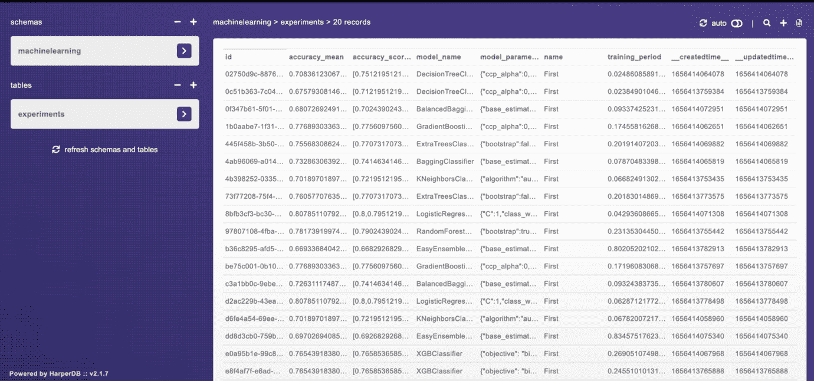

screenshot from harperdb.io

您还可以单击实验表中的单个记录，查看您在贷款数据集上训练的特定算法的所有记录数据。

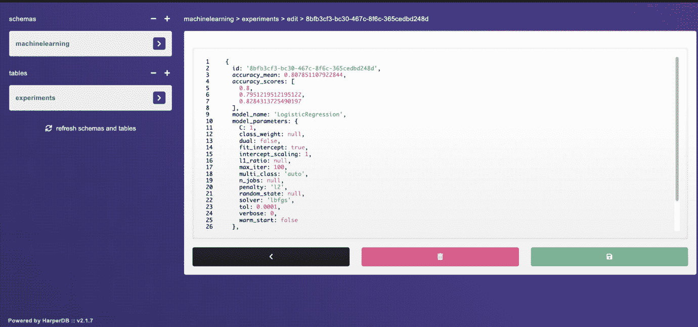

screenshot from harperdb.io

比如 LogisticRegression 模型的准确率 **80.7%。**

您现在能够继续运行各种 ML 实验，这些实验的结果将被插入到 HarperDB 云实例中。

当您运行下一个实验时，它将继续在实验表中记录实验结果，而不会覆盖以前的结果。这意味着您将有机会观察和检查所有实验的结果，并对它们进行评估，以找到改善模型性能的更好方法。

## 什么是自定义函数？

自定义函数是 Harper db 3.1+版本中的一项新特性。该特性允许您在 HarperDB 中添加自己的 **API 端点**。

自定义函数由 Fastify 提供支持，Fastify 非常灵活，通过使用 HarperDB 核心方法可以更容易地与您的数据进行交互。

在本节中，您将学习如何使用 HarperDB studio 创建自己的自定义函数。这将允许您使用 API 调用与同事交流机器学习实验的结果。

### 1.启用自定义功能

第一步是在你的 HarperDB Studio 中点击“ **functions** ”，然后启用自定义功能(默认不启用)。


screenshot from harperdb.io

### 2.创建项目

下一步是通过指定名称来创建项目。比如 **api-v1。**

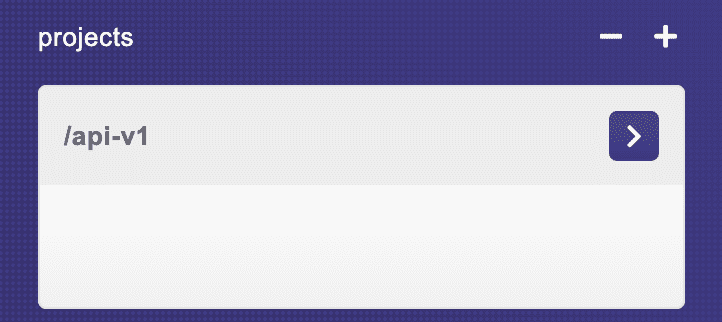

screenshot from harperdb.io

它还将为项目创建设置文件，包括:

*   路线文件夹
*   添加助手函数的文件
*   静态文件夹。

**注意:**对于本文，您将重点关注 routes 文件夹。

### 3.定义路线

让我们创建第一条路由，从 HarperDB 数据存储的实验表中获取一些数据。但是首先您需要知道路由 URL 是以下列方式解析的:

[实例 URL]:[自定义功能端口]/[项目名称]/[路由 URL]

它将包括:

*   云实例 URL
*   自定义功能端口
*   您创建的项目名称
*   您定义的路线

在 function 页面的 route 文件(example.js)中，您将看到一些模板代码作为示例。您需要用以下代码替换该代码:

```
'use strict';

module.exports = async (server, { hdbCore, logger }) => {

server.route({

    url: '/',
	method: 'GET',
	handler: (request) => {
	request.body= {
	operation: 'sql',
	sql: 'SELECT model_name,accuracy_scores,accuracy_mean,training_period FROM machinelearning.experiments ORDER BY accuracy_mean'
};
return hdbCore.requestWithoutAuthentication(request);
}
});
```

在上面的代码中，使用 GET 方法定义了 route /api-v1，处理函数将向数据库发送一个 SQL 查询，以从由 **accuracy_mean 列排序的**实验表**中获取**模型名称、accuracy_scores、**和 **accuracy_mean、training_period** 。**

您可以保存在管线文件中添加的新更改。

### **4。尝试您的 API 端点**

最后，您现在可以使用您定义的路径从实验表中获取数据。您可以尝试通过 web 浏览器、任何编程语言或 API 工具(如 Postman)来访问该路线。

路线 URL 将是:[https://functions-1-mlproject.harperdbcloud.com/api-v1](https://functions-1-mlproject.harperdbcloud.com/api-v1)

#### 如何通过网络浏览器访问路线

您只需复制路线 URL 并将其添加到您的 web 浏览器中，即可查看所请求的数据。

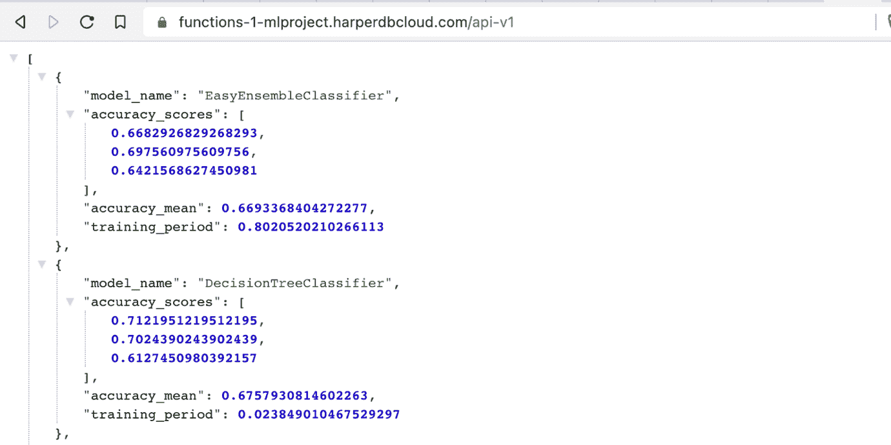

Screenshot from the web browser.

这将根据处理函数中定义的 SQL 查询显示您请求的数据。

#### 如何用 Python 发送 API 请求

该选项允许您通过使用**请求** Python 包来发送 API 请求。

```
#send an API request 

import requests

# api-endpoint
URL = "https://functions-1-mlproject.harperdbcloud.com/api-v1"

# sending get request and saving the response as response object
r = requests.get(url = URL)

# extracting data in json format
data = r.json()

for experiment in data:
    print(experiment)
```

以下是上述代码的输出示例:

```
{'model_name': 'EasyEnsembleClassifier', 'accuracy_scores': [0.6682926829268293, 0.697560975609756, 0.6421568627450981], 'accuracy_mean': 0.6693368404272277, 'training_period': 0.8020520210266113}{'model_name': 'DecisionTreeClassifier', 'accuracy_scores': [0.7121951219512195, 0.7024390243902439, 0.6127450980392157], 'accuracy_mean': 0.6757930814602263, 'training_period': 0.023849010467529297}{'model_name': 'BalancedBaggingClassifier', 'accuracy_scores': [0.7024390243902439, 0.6926829268292682, 0.6470588235294118], 'accuracy_mean': 0.6807269249163079, 'training_period': 0.09337425231933594}{'model_name': 'EasyEnsembleClassifier', 'accuracy_scores': [0.6926829268292682, 0.7268292682926829, 0.6715686274509803], 'accuracy_mean': 0.6970269408576438, 'training_period': 0.8345751762390137}
```

正如您所看到的，HarperDB 使构建 API 端点变得简单，这让您的同事可以快速访问您进行的任何机器学习实验的结果。

## 结论

恭喜🎉，你已经熬到这篇文章的结尾了。你已经学会了:

*   追踪你的机器学习实验的重要性。
*   如何在 **HarperDB 云实例**中保存您的 ML 实验结果。
*   如何从 HarperDB cloud 实例中创建一个定制函数来通过 API 端点与参与项目的同事共享您的 ML 实验结果。

如果你学到了新的东西或者喜欢阅读这篇文章，请分享给其他人看。在那之前，下期帖子再见！

你也可以在 Twitter 上找到我 [@Davis_McDavid](https://twitter.com/Davis_McDavid?ref=hackernoon.com) 。